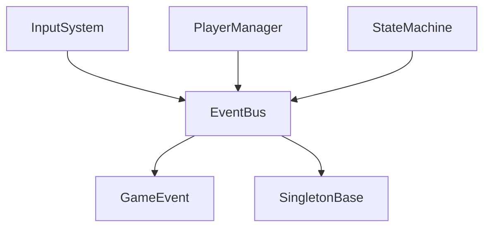
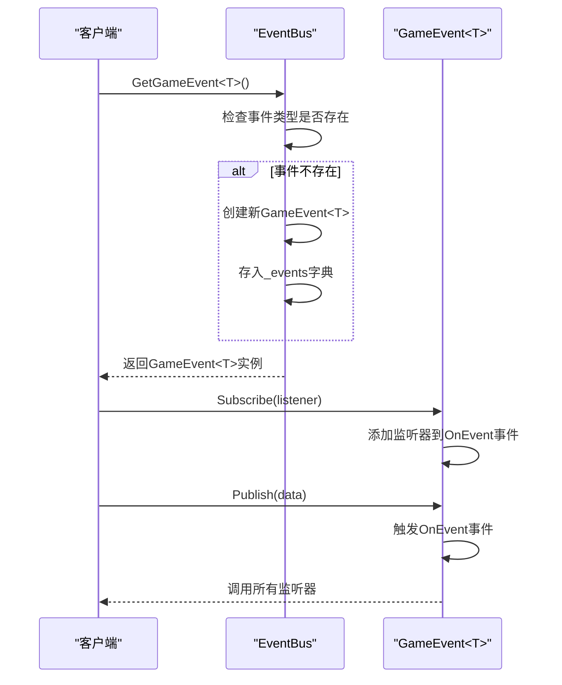
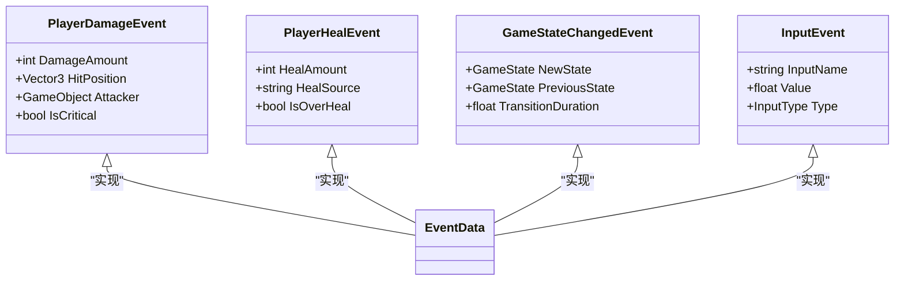
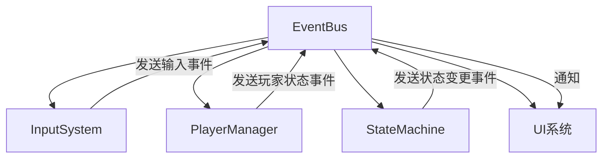

# 事件总线

<cite>
**本文档中引用的文件**  
- [EventBus.cs](file://Assets/Scripts/Manager/EventSystem/EventBus.cs)
- [GameEvent.cs](file://Assets/Scripts/Manager/EventSystem/GameEvent.cs)
- [IEvent.cs](file://Assets/Scripts/Manager/EventSystem/IEvent.cs)
- [EventLists.cs](file://Assets/Scripts/Manager/EventSystem/EventLists.cs)
- [GameEvents.cs](file://Assets/Scripts/Manager/EventSystem/GameEvents.cs)
- [Singleton.cs](file://Assets/Scripts/Tool/Singleton.cs)
- [GameMain.cs](file://Assets/Scripts/Manager/GameMain.cs)
- [InputSystem.cs](file://Assets/Scripts/Manager/InputSystem/InputSystem.cs)
- [PlayerManager.cs](file://Assets/Scripts/Manager/PlayerManager/PlayerManager.cs)
</cite>

## 目录
1. [简介](#简介)
2. [项目结构](#项目结构)
3. [核心组件](#核心组件)
4. [架构概述](#架构概述)
5. [详细组件分析](#详细组件分析)
6. [依赖分析](#依赖分析)
7. [性能考虑](#性能考虑)
8. [故障排除指南](#故障排除指南)
9. [结论](#结论)

## 简介
本文档详细说明了Unity项目中EventBus类的实现机制，重点介绍其作为全局单例事件总线的设计。文档涵盖了事件注册、注销和调用的流程，线程安全性和性能优化考虑，以及与其他系统（如状态机和输入系统）的集成方式。同时讨论了内存泄漏风险及相应的清理机制。

## 项目结构
项目采用分层架构，将事件系统独立在`Assets/Scripts/Manager/EventSystem`目录下。事件总线作为核心通信机制，连接了输入系统、玩家管理、状态机等关键模块。



**图示来源**  
- [EventBus.cs](file://Assets/Scripts/Manager/EventSystem/EventBus.cs#L1-L15)
- [GameEvent.cs](file://Assets/Scripts/Manager/EventSystem/GameEvent.cs#L1-L20)
- [Singleton.cs](file://Assets/Scripts/Tool/Singleton.cs#L1-L23)

**本节来源**  
- [EventBus.cs](file://Assets/Scripts/Manager/EventSystem/EventBus.cs#L1-L15)
- [GameEvent.cs](file://Assets/Scripts/Manager/EventSystem/GameEvent.cs#L1-L20)

## 核心组件
EventBus类作为全局单例，通过Dictionary<Type, IEvent>存储和管理不同类型事件。其核心功能包括事件的注册、注销和触发，为系统各模块提供松耦合的通信机制。

**本节来源**  
- [EventBus.cs](file://Assets/Scripts/Manager/EventSystem/EventBus.cs#L1-L15)
- [GameEvent.cs](file://Assets/Scripts/Manager/EventSystem/GameEvent.cs#L1-L20)

## 架构概述
EventBus采用单例模式实现，确保整个应用程序中只有一个事件总线实例。它使用泛型GameEvent<T>来处理不同类型的具体事件，通过类型作为键在字典中存储和检索事件处理器。

```mermaid
classDiagram
    class EventBus {
        -Dictionary<Type, object> _events
        +GameEvent<T> GetGameEvent<T>()
    }
    class GameEvent<T> {
        -Action<T> OnEvent
        +Publish(T data)
        +Subscribe(Action<T> listener)
        +Unsubscribe(Action<T> listener)
    }
    class SingletonBase<T> {
        -static Lazy<T> _instance
        +static T Instance
    }
    EventBus --> SingletonBase : "继承"
    GameEvent --> Action : "使用"
```

**图示来源**  
- [EventBus.cs](file://Assets/Scripts/Manager/EventSystem/EventBus.cs#L1-L15)
- [GameEvent.cs](file://Assets/Scripts/Manager/EventSystem/GameEvent.cs#L1-L20)
- [Singleton.cs](file://Assets/Scripts/Tool/Singleton.cs#L1-L23)

## 详细组件分析

### EventBus实现分析
EventBus类通过继承SingletonBase<EventBus>确保全局唯一实例。其内部使用只读字典存储不同类型事件的处理器，通过GetGameEvent<T>()方法按需创建和获取特定类型的事件处理器。

#### 事件管理架构
```mermaid
classDiagram
    class EventBus {
        +GetGameEvent<T>(): GameEvent<T>
    }
    class GameEvent<T> {
        +Publish(data: T)
        +Subscribe(listener: Action<T>)
        +Unsubscribe(listener: Action<T>)
    }
    EventBus --> GameEvent : "包含"
```

**图示来源**  
- [EventBus.cs](file://Assets/Scripts/Manager/EventSystem/EventBus.cs#L1-L15)
- [GameEvent.cs](file://Assets/Scripts/Manager/EventSystem/GameEvent.cs#L1-L20)

#### 事件注册与分发流程


**图示来源**  
- [EventBus.cs](file://Assets/Scripts/Manager/EventSystem/EventBus.cs#L1-L15)
- [GameEvent.cs](file://Assets/Scripts/Manager/EventSystem/GameEvent.cs#L1-L20)

#### 事件数据类型


**图示来源**  
- [EventLists.cs](file://Assets/Scripts/Manager/EventSystem/EventLists.cs#L1-L84)

**本节来源**  
- [EventBus.cs](file://Assets/Scripts/Manager/EventSystem/EventBus.cs#L1-L15)
- [GameEvent.cs](file://Assets/Scripts/Manager/EventSystem/GameEvent.cs#L1-L20)
- [EventLists.cs](file://Assets/Scripts/Manager/EventSystem/EventLists.cs#L1-L84)

### 单例模式实现
EventBus依赖SingletonBase泛型基类实现线程安全的单例模式，使用Lazy<T>和Activator确保延迟初始化和实例唯一性。

```mermaid
classDiagram
class SingletonBase<T> {
-static Lazy<T> _instance
+static T Instance
+SingletonBase()
}
EventBus --> SingletonBase : "继承"
```

**图示来源**  
- [Singleton.cs](file://Assets/Scripts/Tool/Singleton.cs#L1-L23)

**本节来源**  
- [Singleton.cs](file://Assets/Scripts/Tool/Singleton.cs#L1-L23)

## 依赖分析
EventBus与多个系统紧密集成，形成项目的核心通信枢纽。



**图示来源**  
- [EventBus.cs](file://Assets/Scripts/Manager/EventSystem/EventBus.cs#L1-L15)
- [InputSystem.cs](file://Assets/Scripts/Manager/InputSystem/InputSystem.cs#L1-L93)
- [PlayerManager.cs](file://Assets/Scripts/Manager/PlayerManager/PlayerManager.cs#L1-L84)

**本节来源**  
- [EventBus.cs](file://Assets/Scripts/Manager/EventSystem/EventBus.cs#L1-L15)
- [InputSystem.cs](file://Assets/Scripts/Manager/InputSystem/InputSystem.cs#L1-L93)
- [PlayerManager.cs](file://Assets/Scripts/Manager/PlayerManager/PlayerManager.cs#L1-L84)

## 性能考虑
EventBus的设计考虑了性能优化，通过字典查找实现O(1)时间复杂度的事件获取。使用事件委托而非列表存储监听器，确保高效的事件分发。Lazy<T>单例实现避免了不必要的同步开销。

**本节来源**  
- [EventBus.cs](file://Assets/Scripts/Manager/EventSystem/EventBus.cs#L1-L15)
- [Singleton.cs](file://Assets/Scripts/Tool/Singleton.cs#L1-L23)

## 故障排除指南
EventBus的潜在问题主要集中在内存泄漏和事件重复订阅。建议在对象销毁时确保取消事件订阅，使用弱引用或智能生命周期管理来避免持有已销毁对象的引用。

**本节来源**  
- [EventBus.cs](file://Assets/Scripts/Manager/EventSystem/EventBus.cs#L1-L15)
- [GameEvent.cs](file://Assets/Scripts/Manager/EventSystem/GameEvent.cs#L1-L20)

## 结论
EventBus作为项目的核心通信机制，通过单例模式和泛型事件处理器实现了高效、类型安全的事件系统。其设计充分考虑了线程安全、性能优化和易用性，为各系统模块提供了可靠的通信基础。建议在使用时注意事件订阅的生命周期管理，避免内存泄漏问题。