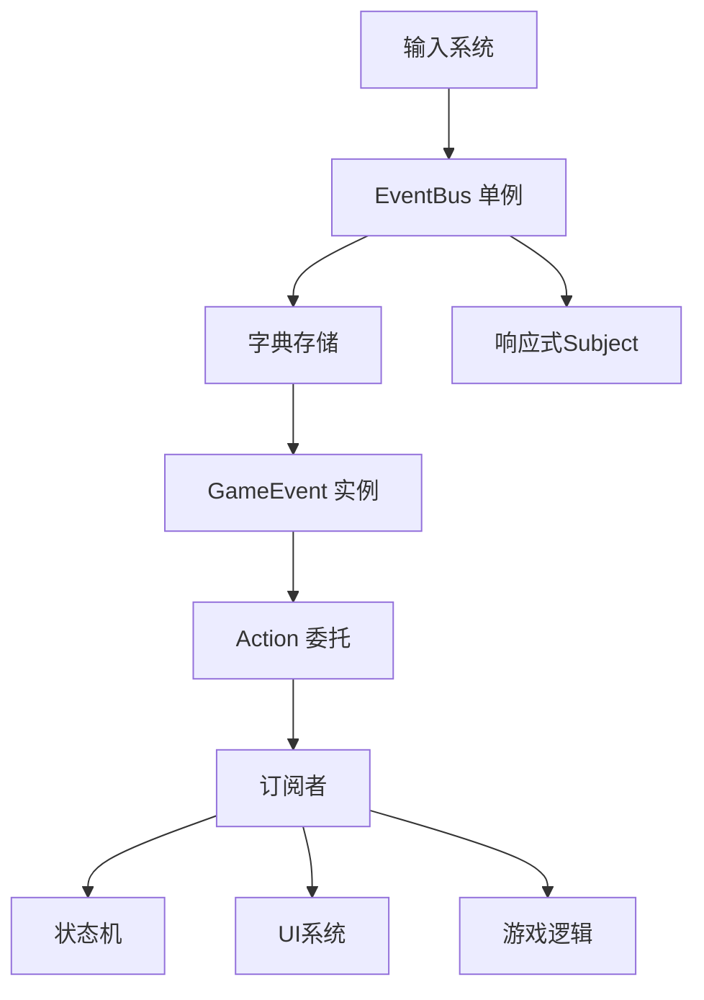
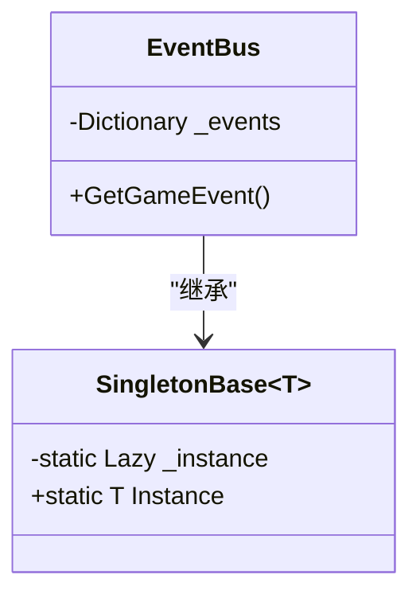
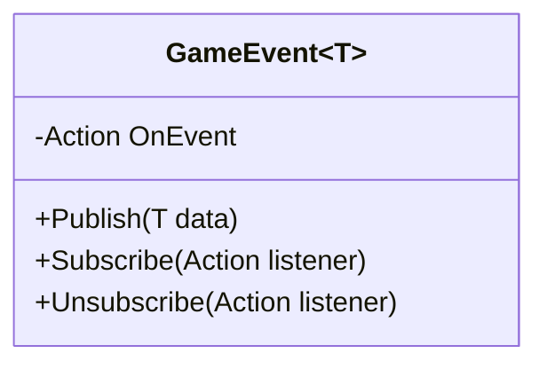
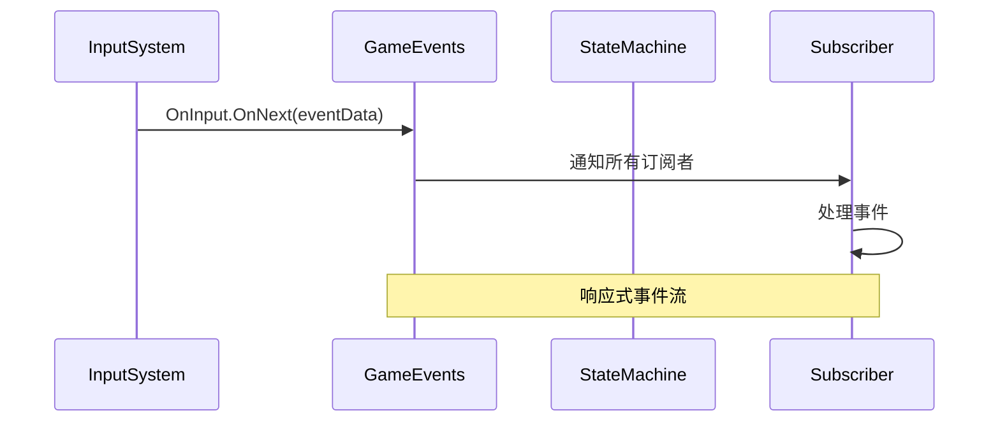
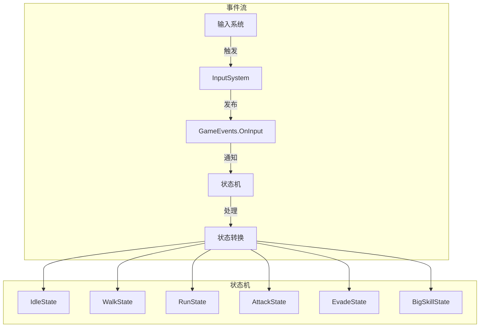

# 事件系统

<cite>
**本文档中引用的文件**  
- [EventBus.cs](file://Assets/Scripts/Manager/EventSystem/EventBus.cs)
- [GameEvent.cs](file://Assets/Scripts/Manager/EventSystem/GameEvent.cs)
- [GameEvents.cs](file://Assets/Scripts/Manager/EventSystem/GameEvents.cs)
- [EventLists.cs](file://Assets/Scripts/Manager/EventSystem/EventLists.cs)
- [InputSystem.cs](file://Assets/Scripts/Manager/InputSystem/InputSystem.cs)
- [BaseState.cs](file://Assets/Scripts/Controller/FSM/BaseState.cs)
- [StateMachine.cs](file://Assets/Scripts/Controller/FSM/StateMachine.cs)
- [PlayerEvents.cs](file://Assets/Scripts/EventData/PlayerEvents.cs)
- [Singleton.cs](file://Assets/Scripts/Tool/Singleton.cs)
</cite>

## 目录
1. [简介](#简介)
2. [事件总线架构](#事件总线架构)
3. [核心组件分析](#核心组件分析)
4. [预定义事件列表](#预定义事件列表)
5. [响应式编程实现](#响应式编程实现)
6. [事件订阅与发布示例](#事件订阅与发布示例)
7. [内存管理与事件清理](#内存管理与事件清理)
8. [事件流分析](#事件流分析)
9. [结论](#结论)

## 简介
本项目实现了一个基于发布/订阅模式的事件系统，用于解耦游戏组件之间的通信。事件系统采用单例模式作为全局事件总线，结合泛型事件类和R3响应式编程库，实现了类型安全的事件通信机制。该系统允许不同游戏模块通过事件进行松耦合交互，提高了代码的可维护性和扩展性。

## 事件总线架构



**图示来源**  
- [EventBus.cs](file://Assets/Scripts/Manager/EventSystem/EventBus.cs#L1-L15)
- [GameEvents.cs](file://Assets/Scripts/Manager/EventSystem/GameEvents.cs#L1-L23)

**本节来源**  
- [EventBus.cs](file://Assets/Scripts/Manager/EventSystem/EventBus.cs#L1-L15)
- [GameEvents.cs](file://Assets/Scripts/Manager/EventSystem/GameEvents.cs#L1-L23)

## 核心组件分析

### EventBus 单例
`EventBus` 类继承自 `SingletonBase<EventBus>`，作为全局唯一的事件总线实例。它使用 `Dictionary<Type, object>` 字典来存储不同类型的游戏事件，确保每个事件类型只有一个实例。



**图示来源**  
- [EventBus.cs](file://Assets/Scripts/Manager/EventSystem/EventBus.cs#L1-L15)
- [Singleton.cs](file://Assets/Scripts/Tool/Singleton.cs#L1-L23)

### GameEvent<T> 泛型类
`GameEvent<T>` 是一个泛型类，实现了基本的发布/订阅模式。它使用 C# 委托（Action<T>）来管理事件订阅者，并提供发布、订阅和取消订阅的方法。



**图示来源**  
- [GameEvent.cs](file://Assets/Scripts/Manager/EventSystem/GameEvent.cs#L1-L20)

**本节来源**  
- [GameEvent.cs](file://Assets/Scripts/Manager/EventSystem/GameEvent.cs#L1-L20)

## 预定义事件列表
项目中定义了多种游戏事件，主要分为以下几类：

### 输入事件
- `OnInput`: 输入事件，当有输入发生时触发

### 游戏状态事件
- `OnGameStateChanged`: 游戏状态改变事件
- `OnGamePaused`: 游戏暂停事件
- `OnSceneLoaded`: 场景加载完成事件

### 玩家相关事件
- `OnPlayerDamaged`: 玩家受伤事件
- `OnPlayerHealed`: 玩家治疗事件
- `OnPlayerLevelUp`: 玩家升级事件
- `OnPlayerDeath`: 玩家死亡事件

### UI事件
- `OnButtonClicked`: 按钮点击事件
- `OnSliderChanged`: 滑块值改变事件

### 自定义事件
- `PlayerSwitchedEvent`: 玩家切换事件
- `PlayerSpawnedEvent`: 玩家生成事件

**本节来源**  
- [GameEvents.cs](file://Assets/Scripts/Manager/EventSystem/GameEvents.cs#L1-L23)
- [EventLists.cs](file://Assets/Scripts/Manager/EventSystem/EventLists.cs#L1-L84)
- [PlayerEvents.cs](file://Assets/Scripts/EventData/PlayerEvents.cs#L1-L18)

## 响应式编程实现
事件系统使用 R3 库实现响应式编程模式。`GameEvents` 类中的事件被定义为 `Subject<T>` 类型，这是一种可观察的序列，允许订阅者以响应式方式处理事件流。



R3 库提供了以下优势：
- 支持异步事件处理
- 提供丰富的操作符来转换和过滤事件流
- 内置内存管理机制
- 支持背压处理

**图示来源**  
- [GameEvents.cs](file://Assets/Scripts/Manager/EventSystem/GameEvents.cs#L1-L23)
- [InputSystem.cs](file://Assets/Scripts/Manager/InputSystem/InputSystem.cs#L1-L93)

**本节来源**  
- [GameEvents.cs](file://Assets/Scripts/Manager/EventSystem/GameEvents.cs#L1-L23)

## 事件订阅与发布示例
以下是事件系统的基本使用模式：

### 订阅事件
```csharp
// 订阅输入事件
GameEvents.OnInput.Subscribe(inputEvent => 
{
    // 处理输入
    Debug.Log("收到输入事件");
});
```

### 发布事件
```csharp
// 发布输入事件
GameEvents.OnInput.OnNext(new InputEvent 
{ 
    InputName = "Move", 
    Value = 1.0f, 
    Type = InputType.Axis 
});
```

### 使用EventBus
```csharp
// 获取特定类型的事件
var moveEvent = EventBus.Instance.GetGameEvent<OnMove>();
moveEvent.Subscribe(data => 
{
    // 处理移动事件
    ChangeState<WalkState>();
});
```

**本节来源**  
- [GameEvents.cs](file://Assets/Scripts/Manager/EventSystem/GameEvents.cs#L1-L23)
- [InputSystem.cs](file://Assets/Scripts/Manager/InputSystem/InputSystem.cs#L1-L93)
- [BaseState.cs](file://Assets/Scripts/Controller/FSM/BaseState.cs#L1-L84)

## 内存管理与事件清理
正确的内存管理对于事件系统至关重要，以避免内存泄漏和空引用异常。

### 订阅与取消订阅
必须成对使用订阅和取消订阅操作：

```csharp
private CompositeDisposable _disposables = new();

// 订阅事件
_disposables.Add(GameEvents.OnInput.Subscribe(OnInputHandler));

// 在适当的时候清理
public void Dispose()
{
    _disposables?.Dispose();
}
```

### 最佳实践
1. **及时取消订阅**：在对象销毁时必须取消所有事件订阅
2. **使用CompositeDisposable**：集中管理多个订阅，便于批量清理
3. **避免闭包捕获**：防止意外持有对象引用导致内存泄漏
4. **检查空引用**：在发布事件前检查委托是否为空

**本节来源**  
- [StateMachine.cs](file://Assets/Scripts/Controller/FSM/StateMachine.cs#L1-L114)
- [GameEvents.cs](file://Assets/Scripts/Manager/EventSystem/GameEvents.cs#L1-L23)

## 事件流分析



**图示来源**  
- [InputSystem.cs](file://Assets/Scripts/Manager/InputSystem/InputSystem.cs#L1-L93)
- [BaseState.cs](file://Assets/Scripts/Controller/FSM/BaseState.cs#L1-L84)
- [StateMachine.cs](file://Assets/Scripts/Controller/FSM/StateMachine.cs#L1-L114)

**本节来源**  
- [InputSystem.cs](file://Assets/Scripts/Manager/InputSystem/InputSystem.cs#L1-L93)
- [BaseState.cs](file://Assets/Scripts/Controller/FSM/BaseState.cs#L1-L84)

## 结论
本项目的事件系统设计合理，采用了单例模式作为全局事件总线，通过字典存储不同类型的游戏事件，实现了高效的事件管理。`GameEvent<T>` 泛型类提供了类型安全的发布/订阅机制，而 R3 库的引入使得事件处理更加灵活和响应式。

事件系统成功地将输入系统与状态机解耦，输入事件触发后通过事件总线通知状态机进行状态转换。这种设计模式提高了代码的可维护性和可扩展性，使得添加新的游戏状态和事件变得简单。

建议在实际使用中注意内存管理，确保在对象销毁时正确清理事件订阅，避免内存泄漏。同时，可以考虑为更多游戏功能添加事件支持，进一步发挥事件系统的解耦优势。