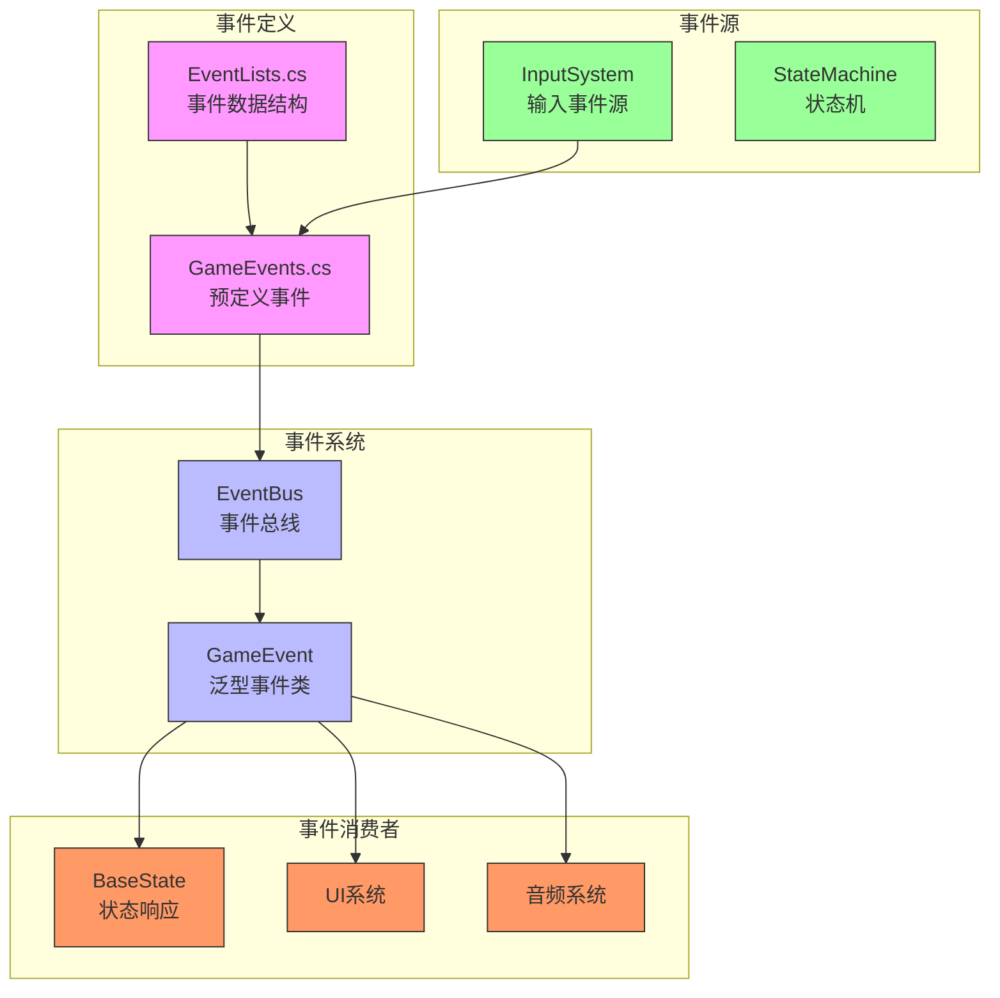
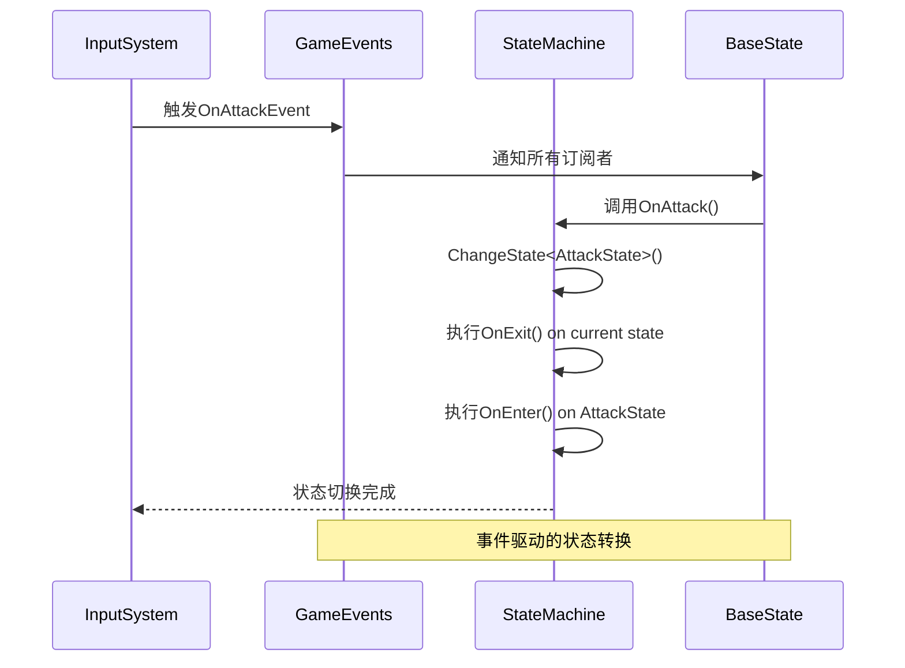
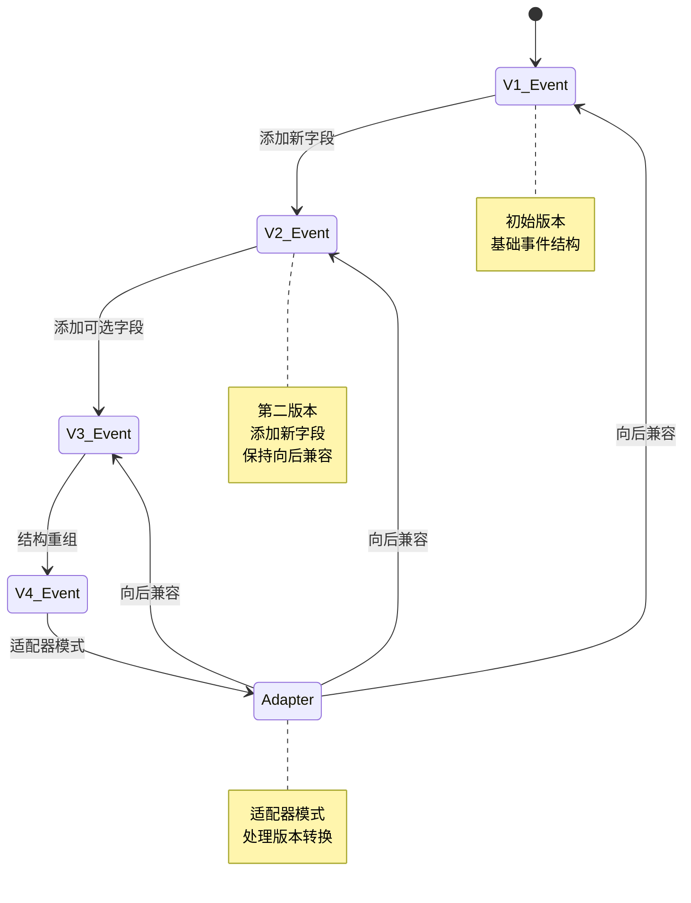

# 事件集合与预定义事件

<cite>
**本文档引用的文件**   
- [GameEvents.cs](file://Assets/Scripts/Manager/EventSystem/GameEvents.cs)
- [EventLists.cs](file://Assets/Scripts/Manager/EventSystem/EventLists.cs)
- [GameEvent.cs](file://Assets/Scripts/Manager/EventSystem/GameEvent.cs)
- [InputSystem.cs](file://Assets/Scripts/Manager/InputSystem/InputSystem.cs)
- [BaseState.cs](file://Assets/Scripts/Controller/FSM/BaseState.cs)
- [StateMachine.cs](file://Assets/Scripts/Controller/FSM/StateMachine.cs)
- [PlayerEvents.cs](file://Assets/Scripts/EventData/PlayerEvents.cs)
</cite>

## 目录
1. [简介](#简介)
2. [事件系统架构](#事件系统架构)
3. [预定义游戏事件](#预定义游戏事件)
4. [事件集合与类型组织](#事件集合与类型组织)
5. [事件消费与状态机响应](#事件消费与状态机响应)
6. [事件订阅与发布示例](#事件订阅与发布示例)
7. [事件命名规范与分类](#事件命名规范与分类)
8. [R3响应式扩展应用](#r3响应式扩展应用)
9. [事件版本控制与兼容性](#事件版本控制与兼容性)
10. [结论](#结论)

## 简介
本文档全面文档化Unity项目中的事件系统，重点关注GameEvents静态类中预定义的游戏事件。通过分析事件集合的组织方式、事件消费模式以及R3响应式扩展的应用，为开发者提供完整的事件系统使用指南。

## 事件系统架构



**图示来源**
- [GameEvents.cs](file://Assets/Scripts/Manager/EventSystem/GameEvents.cs)
- [EventLists.cs](file://Assets/Scripts/Manager/EventSystem/EventLists.cs)
- [GameEvent.cs](file://Assets/Scripts/Manager/EventSystem/GameEvent.cs)
- [InputSystem.cs](file://Assets/Scripts/Manager/InputSystem/InputSystem.cs)
- [StateMachine.cs](file://Assets/Scripts/Controller/FSM/StateMachine.cs)

## 预定义游戏事件

项目中的GameEvents静态类定义了多种预定义的游戏事件，这些事件通过R3库的Subject实现响应式编程模式。虽然大部分事件在代码中被注释，但它们展示了完整的事件设计模式。

关键预定义事件包括：

- **玩家伤害事件**: `OnPlayerDamaged` - 当玩家受到伤害时触发
- **游戏状态变更事件**: `OnGameStateChanged` - 当游戏状态（如菜单、游戏进行中、暂停等）发生变化时触发
- **攻击触发事件**: `OnAttackTriggered` - 当玩家执行攻击动作时触发
- **输入事件**: `OnInput` - 处理各种输入操作的通用事件

这些事件采用响应式编程范式，使用R3库的Subject<T>类型，允许消费者通过订阅机制接收事件通知。

**节来源**
- [GameEvents.cs](file://Assets/Scripts/Manager/EventSystem/GameEvents.cs#L4-L23)
- [EventLists.cs](file://Assets/Scripts/Manager/EventSystem/EventLists.cs#L0-L84)

## 事件集合与类型组织

事件类型集合在EventLists.cs文件中通过record struct语法定义，这种设计提供了不可变性和值语义的优势。事件集合的组织方式体现了清晰的分类策略：

```mermaid
classDiagram
class PlayerEvents {
+int DamageAmount
+Vector3 HitPosition
+GameObject Attacker
+bool IsCritical
}
class GameStateEvents {
+GameState NewState
+GameState PreviousState
+float TransitionDuration
}
class InputEvents {
+string InputName
+float Value
+InputType Type
}
class UIEvents {
+Button.ButtonClickedEvent ButtonClicked
+SliderChangedEvent SliderChanged
}
PlayerEvents <|-- PlayerDamageEvent
PlayerEvents <|-- PlayerHealEvent
PlayerEvents <|-- PlayerDeathEvent
GameStateEvents <|-- GameStateChangedEvent
GameStateEvents <|-- GamePausedEvent
InputEvents <|-- InputEvent
UIEvents <|-- ButtonClickedEvent
UIEvents <|-- SliderChangedEvent
note right of PlayerEvents
玩家相关事件基类
包含伤害、治疗、死亡等
end note
note right of GameStateEvents
游戏状态事件基类
管理游戏状态转换
end note
```

**图示来源**
- [EventLists.cs](file://Assets/Scripts/Manager/EventSystem/EventLists.cs#L0-L84)
- [GameEvents.cs](file://Assets/Scripts/Manager/EventSystem/GameEvents.cs#L0-L23)

事件集合的组织方式在事件发现和调试中发挥重要作用：
1. **类型安全**: 通过强类型定义，避免运行时类型错误
2. **IDE支持**: 提供代码补全和类型检查，提高开发效率
3. **文档化**: 事件结构本身就是自文档化的，清晰展示事件包含的数据
4. **调试便利**: 在调试器中可以清晰查看事件数据结构

## 事件消费与状态机响应

事件系统与状态机紧密集成，不同系统通过订阅事件来响应游戏状态变化。以状态机为例，当OnAttackTriggered事件发生时，状态机会响应并切换到攻击状态。



**图示来源**
- [InputSystem.cs](file://Assets/Scripts/Manager/InputSystem/InputSystem.cs#L0-L93)
- [BaseState.cs](file://Assets/Scripts/Controller/FSM/BaseState.cs#L48-L84)
- [StateMachine.cs](file://Assets/Scripts/Controller/FSM/StateMachine.cs#L0-L114)

在BaseState类中，事件处理函数直接调用状态机的ChangeState方法实现状态转换：

```csharp
protected void OnAttack(InputAction.CallbackContext ctx)
{
    // 切换到攻击状态
    DebugX.Instance.Log("攻击事件触发");
    StateMachine.ChangeState<AttackState>();
}
```

这种设计模式实现了关注点分离：输入系统只负责检测输入，状态机负责状态管理，而状态响应逻辑封装在状态类中。

**节来源**
- [BaseState.cs](file://Assets/Scripts/Controller/FSM/BaseState.cs#L48-L84)
- [StateMachine.cs](file://Assets/Scripts/Controller/FSM/StateMachine.cs#L0-L114)
- [InputSystem.cs](file://Assets/Scripts/Manager/InputSystem/InputSystem.cs#L0-L93)

## 事件订阅与发布示例

以下是事件订阅和发布的完整代码示例，展示了从事件触发到处理的完整链条：

```mermaid
flowchart TD
A[事件发布] --> B[创建事件数据]
B --> C[调用OnNext()]
C --> D[事件总线分发]
D --> E[事件消费者]
E --> F[订阅者处理]
F --> G[业务逻辑执行]
subgraph "发布端"
A
B
C
end
subgraph "消费端"
E
F
G
end
D --> |"Subject<T><br/>OnNext(data)"| E
E --> |"Subscribe()<br/>Action<T>"| F
style A fill:#f96,stroke:#333
style B fill:#f96,stroke:#333
style C fill:#f96,stroke:#333
style D fill:#bbf,stroke:#333
style E fill:#9f9,stroke:#333
style F fill:#9f9,stroke:#333
style G fill:#9f9,stroke:#333
```

**事件发布示例**:
```csharp
// 在InputSystem中发布输入事件
InputActions.Player.Move.performed += ctx =>
{
    OnMovePerformed?.Invoke(ctx);
    GameEvents.OnInput?.OnNext(new InputEvent());
};
```

**事件订阅示例**:
```csharp
// 在状态机中订阅攻击事件
public override void OnEnter()
{
    base.OnEnter();
    InputSystem.Instance.OnAttackEvent += OnAttack;
}

public override void OnExit()
{
    base.OnExit();
    InputSystem.Instance.OnAttackEvent -= OnAttack;
}
```

这种发布-订阅模式实现了松耦合的系统设计，发布者不需要知道订阅者的存在，订阅者也不需要知道事件的来源。

**节来源**
- [InputSystem.cs](file://Assets/Scripts/Manager/InputSystem/InputSystem.cs#L0-L93)
- [BaseState.cs](file://Assets/Scripts/Controller/FSM/BaseState.cs#L0-L84)
- [GameEvents.cs](file://Assets/Scripts/Manager/EventSystem/GameEvents.cs#L0-L23)

## 事件命名规范与分类

项目中的事件命名遵循清晰的规范和分类策略，这有助于开发者快速理解和使用事件系统。

### 命名规范
- **前缀一致性**: 所有事件以"On"开头，表明这是一个事件
- **驼峰命名法**: 采用PascalCase命名约定
- **语义清晰**: 名称准确描述事件的含义，如"OnPlayerDamaged"明确表示玩家受到伤害

### 分类策略
事件按功能领域进行分类：
1. **玩家事件**: 与玩家状态相关的事件（伤害、治疗、死亡等）
2. **游戏状态事件**: 管理游戏整体状态的事件
3. **输入事件**: 处理用户输入的事件
4. **UI事件**: 用户界面交互事件

这种分类策略通过文件组织和命名空间体现，使得事件系统具有良好的可扩展性和可维护性。

**节来源**
- [GameEvents.cs](file://Assets/Scripts/Manager/EventSystem/GameEvents.cs#L0-L23)
- [EventLists.cs](file://Assets/Scripts/Manager/EventSystem/EventLists.cs#L0-L84)

## R3响应式扩展应用

项目中使用R3响应式扩展库来增强事件流处理能力。R3是一个为Unity优化的响应式编程库，提供了轻量级的Observable和Observer实现。

```mermaid
classDiagram
class Subject<T> {
+OnNext(T value)
+OnError(Exception error)
+OnCompleted()
+Subscribe(IObserver<T> observer)
}
class Observable<T> {
+Subscribe(IObserver<T> observer)
}
class Observer<T> {
+OnNext(T value)
+OnError(Exception error)
+OnCompleted()
}
class IDisposable {
+Dispose()
}
Subject<T> --|> Observable<T>
Subject<T> --|> Observer<T>
Observer<T> --|> IDisposable
Observable<T> --|> IDisposable
note right of Subject<T>
R3.Subject<T><br/>既是Observable也是Observer<br/>支持多播
end note
note right of Observable<T>
R3.Observable<T><br/>事件流的生产者
end note
note right of Observer<T>
R3.Observer<T><br/>事件流的消费者
end note
```

**图示来源**
- [GameEvents.cs](file://Assets/Scripts/Manager/EventSystem/GameEvents.cs#L0-L23)
- [Assets/Packages/R3.1.3.0/lib/netstandard2.1/R3.xml](file://Assets/Packages/R3.1.3.0/lib/netstandard2.1/R3.xml)

R3响应式扩展的优势包括：
1. **内存效率**: 相比传统事件，R3具有更低的内存开销
2. **性能优化**: 专为Unity优化，减少GC分配
3. **操作符丰富**: 提供丰富的LINQ风格操作符（Filter、Map、Merge等）
4. **生命周期管理**: 内置CompositeDisposable用于订阅管理

在GameEvents类中，使用Subject<T>作为事件的底层实现，允许消费者通过Subscribe方法注册回调函数。

**节来源**
- [GameEvents.cs](file://Assets/Scripts/Manager/EventSystem/GameEvents.cs#L0-L23)
- [Assets/Packages/R3.1.3.0/lib/netstandard2.1/R3.xml](file://Assets/Packages/R3.1.3.0/lib/netstandard2.1/R3.xml)

## 事件版本控制与兼容性

虽然当前代码中没有显式的事件版本控制机制，但通过合理的架构设计可以实现向后兼容性。

### 版本控制策略
1. **语义化版本**: 为事件系统定义版本号，遵循语义化版本规范
2. **事件元数据**: 在事件数据结构中包含版本信息字段
3. **适配器模式**: 为旧版本事件创建适配器，转换为新版本格式

### 向后兼容性
通过以下方式确保向后兼容性：
1. **非破坏性变更**: 添加新字段而非修改或删除现有字段
2. **默认值**: 为新添加的字段提供合理的默认值
3. **事件映射**: 维护事件版本映射表，处理不同版本间的转换



**图示来源**
- [EventLists.cs](file://Assets/Scripts/Manager/EventSystem/EventLists.cs#L0-L84)
- [PlayerEvents.cs](file://Assets/Scripts/EventData/PlayerEvents.cs#L0-L18)

## 结论
本文档全面分析了项目的事件系统，涵盖了预定义事件、事件集合组织、事件消费模式、发布订阅机制、命名规范、R3响应式扩展应用以及版本控制策略。事件系统采用响应式编程范式，通过R3库实现高效的事件流处理，与状态机紧密集成，实现了松耦合、高内聚的游戏架构设计。建议在实际开发中遵循已建立的命名规范和分类策略，充分利用R3库提供的响应式编程能力，同时考虑实现事件版本控制机制以确保系统的长期可维护性。