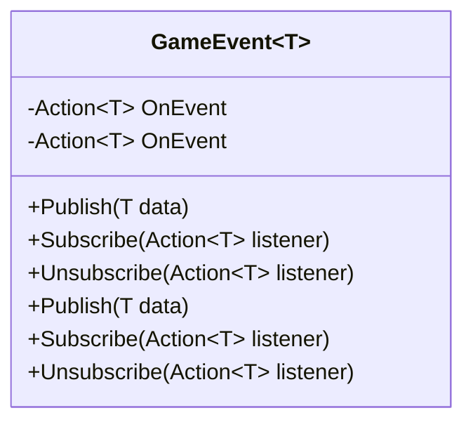
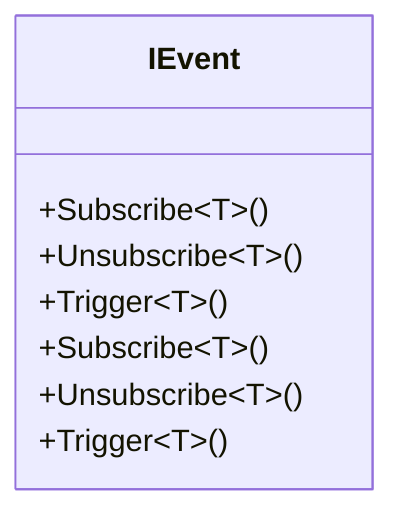
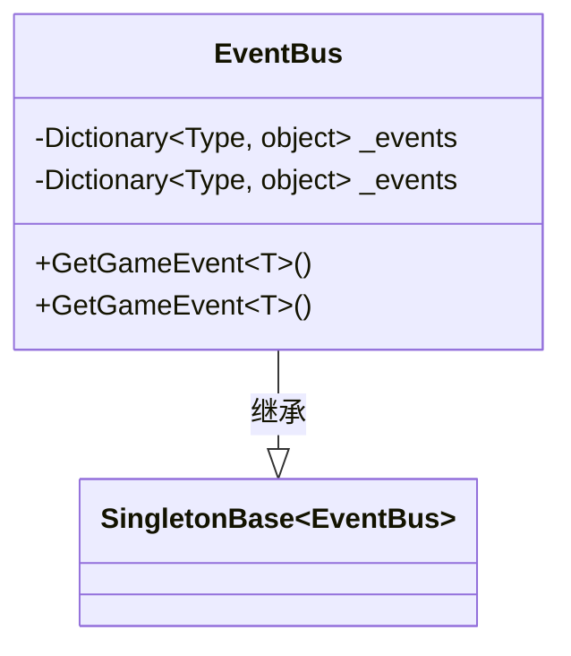
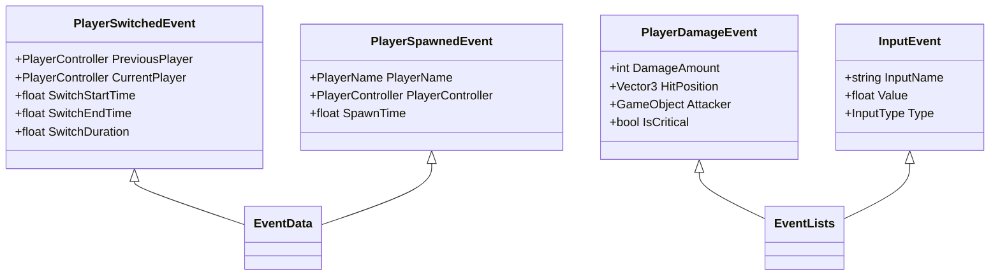
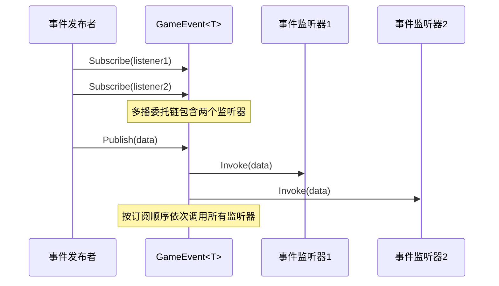
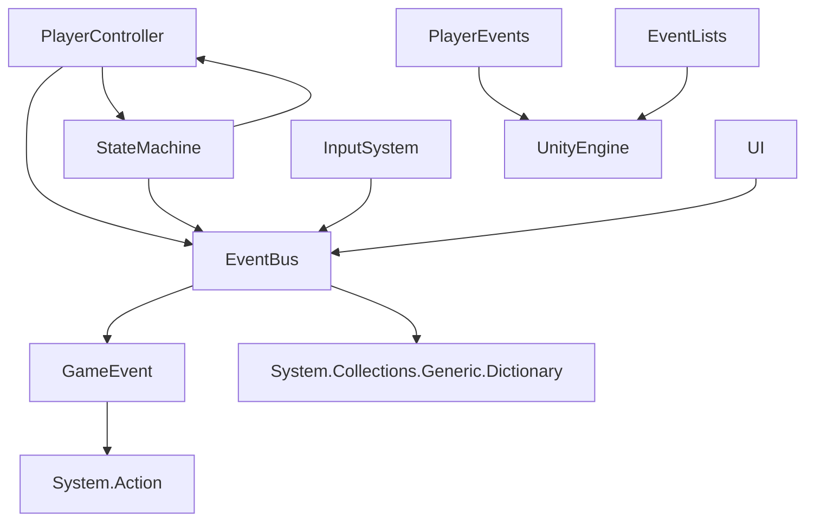
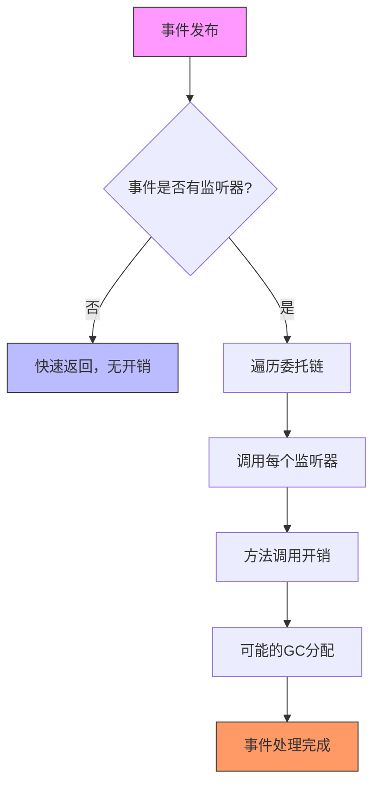

# 游戏事件类

<cite>
**本文档引用的文件**   
- [GameEvent.cs](file://Assets/Scripts/Manager/EventSystem/GameEvent.cs)
- [IEvent.cs](file://Assets/Scripts/Manager/EventSystem/IEvent.cs)
- [EventBus.cs](file://Assets/Scripts/Manager/EventSystem/EventBus.cs)
- [EventLists.cs](file://Assets/Scripts/Manager/EventSystem/EventLists.cs)
- [PlayerEvents.cs](file://Assets/Scripts/EventData/PlayerEvents.cs)
- [GameEvents.cs](file://Assets/Scripts/Manager/EventSystem/GameEvents.cs)
- [Singleton.cs](file://Assets/Scripts/Tool/Singleton.cs)
- [PlayerController.cs](file://Assets/Scripts/Controller/PlayerController.cs)
- [StateMachine.cs](file://Assets/Scripts/Controller/FSM/StateMachine.cs)
</cite>

## 目录
1. [介绍](#介绍)
2. [核心组件](#核心组件)
3. [架构概述](#架构概述)
4. [详细组件分析](#详细组件分析)
5. [依赖分析](#依赖分析)
6. [性能考虑](#性能考虑)
7. [故障排除指南](#故障排除指南)
8. [结论](#结论)

## 介绍
本文档深入解析Unity项目中的事件系统实现，重点关注GameEvent<T>泛型类作为具体事件载体的角色。文档将详细说明IEvent接口定义的核心方法契约，描述事件委托的发布/订阅模式实现机制，包括多播委托的使用和异常处理策略。同时，文档将分析事件调用时的性能特征和潜在的GC问题，以及如何通过对象池或结构体优化，并结合PlayerEvents中的实际用例说明事件数据结构的设计原则。

## 核心组件
本文档的核心组件包括GameEvent<T>泛型类、IEvent接口、EventBus事件总线、各种事件数据结构以及事件发布/订阅模式的实现。这些组件共同构成了一个完整的事件驱动架构，支持游戏中的状态变化、玩家行为和系统交互。

**核心组件**
- [GameEvent.cs](file://Assets/Scripts/Manager/EventSystem/GameEvent.cs#L1-L20)
- [IEvent.cs](file://Assets/Scripts/Manager/EventSystem/IEvent.cs#L1-L6)
- [EventBus.cs](file://Assets/Scripts/Manager/EventSystem/EventBus.cs#L1-L15)

## 架构概述
游戏事件系统采用发布/订阅模式，通过EventBus作为中心枢纽管理所有事件。GameEvent<T>类作为具体的事件载体，使用C#的Action<T>委托实现多播功能。事件数据结构被设计为轻量级的record struct或class，以提高性能和内存效率。整个系统支持泛型，允许类型安全的事件传递。

```mermaid
graph TD
A[事件发布者] --> |Publish(data)| B(GameEvent<T>)
C[事件订阅者] --> |Subscribe(listener)| B
B --> |Invoke(data)| C
D[EventBus] --> |GetGameEvent<T>()| B
E[PlayerController] --> |触发事件| A
F[UI系统] --> |监听事件| C
G[状态机] --> |响应事件| C
```

**图示来源**
- [GameEvent.cs](file://Assets/Scripts/Manager/EventSystem/GameEvent.cs#L1-L20)
- [EventBus.cs](file://Assets/Scripts/Manager/EventSystem/EventBus.cs#L1-L15)

## 详细组件分析

### GameEvent<T>泛型类分析
GameEvent<T>是事件系统的核心实现，作为具体事件的载体。它使用C#的Action<T>委托来存储事件监听器，实现了标准的发布/订阅模式。



**图示来源**
- [GameEvent.cs](file://Assets/Scripts/Manager/EventSystem/GameEvent.cs#L1-L20)

**核心方法说明**
- **Publish(T data)**: 发布事件，调用所有注册的监听器
- **Subscribe(Action<T> listener)**: 订阅事件，添加监听器到委托链
- **Unsubscribe(Action<T> listener)**: 取消订阅，从委托链中移除监听器

**核心组件**
- [GameEvent.cs](file://Assets/Scripts/Manager/EventSystem/GameEvent.cs#L1-L20)

### IEvent接口分析
IEvent接口定义了事件系统的核心契约，尽管在当前实现中并未被直接使用，但它为事件系统提供了标准化的方法定义。



**图示来源**
- [IEvent.cs](file://Assets/Scripts/Manager/EventSystem/IEvent.cs#L1-L6)

**接口方法契约**
- **Subscribe<T>()**: 通用订阅方法，用于注册事件监听器
- **Unsubscribe<T>()**: 通用取消订阅方法，用于移除事件监听器
- **Trigger<T>()**: 通用触发方法，用于发布事件

**核心组件**
- [IEvent.cs](file://Assets/Scripts/Manager/EventSystem/IEvent.cs#L1-L6)

### EventBus事件总线分析
EventBus作为单例模式实现的事件中心，管理所有类型的GameEvent实例。它使用字典存储不同类型的事件，实现了按需创建和复用。



**图示来源**
- [EventBus.cs](file://Assets/Scripts/Manager/EventSystem/EventBus.cs#L1-L15)
- [Singleton.cs](file://Assets/Scripts/Tool/Singleton.cs#L1-L23)

**核心功能**
- **GetGameEvent<T>()**: 获取指定类型的事件实例，如果不存在则创建新的实例
- **_events字典**: 使用Type作为键存储所有事件实例，实现事件的集中管理

**核心组件**
- [EventBus.cs](file://Assets/Scripts/Manager/EventSystem/EventBus.cs#L1-L15)
- [Singleton.cs](file://Assets/Scripts/Tool/Singleton.cs#L1-L23)

### 事件数据结构设计
事件数据结构被设计为轻量级的数据载体，用于在事件发布时传递相关信息。项目中使用了两种主要的设计模式：可序列化的类和记录结构。



**图示来源**
- [PlayerEvents.cs](file://Assets/Scripts/EventData/PlayerEvents.cs#L1-L18)
- [EventLists.cs](file://Assets/Scripts/Manager/EventSystem/EventLists.cs#L1-L50)

**设计原则**
- **单一职责**: 每个事件类只包含与特定事件相关的数据
- **不可变性**: 使用属性的get/set访问器控制数据访问
- **计算属性**: 如SwitchDuration属性，基于其他属性计算得出，避免数据冗余
- **类型安全**: 使用具体的类型而非通用对象，提高代码的可读性和安全性

**核心组件**
- [PlayerEvents.cs](file://Assets/Scripts/EventData/PlayerEvents.cs#L1-L18)
- [EventLists.cs](file://Assets/Scripts/Manager/EventSystem/EventLists.cs#L1-L50)

### 发布/订阅模式实现机制
事件系统的发布/订阅模式基于C#的委托机制实现，利用多播委托的特性支持多个监听器订阅同一个事件。



**图示来源**
- [GameEvent.cs](file://Assets/Scripts/Manager/EventSystem/GameEvent.cs#L1-L20)

**实现细节**
- **多播委托**: Action<T>委托天然支持多播，可以注册多个监听器
- **空值检查**: 使用?.操作符在调用前检查委托是否为null，避免空引用异常
- **线程安全**: 当前实现未考虑多线程环境下的线程安全问题

**核心组件**
- [GameEvent.cs](file://Assets/Scripts/Manager/EventSystem/GameEvent.cs#L1-L20)

## 依赖分析
事件系统与其他系统存在紧密的依赖关系，形成了一个松耦合但高内聚的架构。



**图示来源**
- [EventBus.cs](file://Assets/Scripts/Manager/EventSystem/EventBus.cs#L1-L15)
- [GameEvent.cs](file://Assets/Scripts/Manager/EventSystem/GameEvent.cs#L1-L20)
- [PlayerController.cs](file://Assets/Scripts/Controller/PlayerController.cs#L1-L102)
- [StateMachine.cs](file://Assets/Scripts/Controller/FSM/StateMachine.cs#L1-L114)

**依赖关系说明**
- **EventBus依赖GameEvent**: EventBus使用GameEvent作为事件的存储和分发单元
- **各系统依赖EventBus**: PlayerController、StateMachine、InputSystem等系统通过EventBus进行通信
- **事件数据依赖UnityEngine**: 事件数据结构使用Unity的Vector3、GameObject等类型
- **PlayerController与StateMachine相互依赖**: 形成控制循环，PlayerController管理StateMachine，StateMachine影响PlayerController的行为

**核心组件**
- [EventBus.cs](file://Assets/Scripts/Manager/EventSystem/EventBus.cs#L1-L15)
- [GameEvent.cs](file://Assets/Scripts/Manager/EventSystem/GameEvent.cs#L1-L20)
- [PlayerController.cs](file://Assets/Scripts/Controller/PlayerController.cs#L1-L102)
- [StateMachine.cs](file://Assets/Scripts/Controller/FSM/StateMachine.cs#L1-L114)

## 性能考虑
事件系统的设计需要考虑性能特征和潜在的GC问题，特别是在高频事件场景下。

### 性能特征分析


**图示来源**
- [GameEvent.cs](file://Assets/Scripts/Manager/EventSystem/GameEvent.cs#L1-L20)

**性能要点**
- **空事件开销**: 当没有监听器时，事件发布只有空值检查的开销，非常轻量
- **委托调用开销**: 每个监听器的调用都有方法调用的开销
- **GC问题**: 如果事件数据是引用类型，频繁的事件发布可能导致GC压力
- **内存占用**: 每个事件实例和委托链都会占用内存

### 优化策略
针对性能问题，可以采用以下优化策略：

1. **使用结构体**: 将事件数据定义为struct而非class，避免堆分配
2. **对象池**: 对频繁创建的事件对象使用对象池模式
3. **批处理**: 将多个相关事件合并为一个批处理事件
4. **条件发布**: 在发布事件前检查是否有监听器，避免不必要的处理

**核心组件**
- [EventLists.cs](file://Assets/Scripts/Manager/EventSystem/EventLists.cs#L1-L50)
- [PlayerEvents.cs](file://Assets/Scripts/EventData/PlayerEvents.cs#L1-L18)

## 故障排除指南
在使用事件系统时可能会遇到一些常见问题，以下是相应的解决方案。

### 事件未触发
**可能原因**:
- 监听器未正确订阅事件
- 事件发布者与监听者使用了不同的事件实例
- 订阅和发布发生在不同的生命周期阶段

**解决方案**:
- 确保使用EventBus.GetGameEvent<T>()获取事件实例，保证单例性
- 在OnEnable中订阅，在OnDisable中取消订阅
- 检查事件类型是否匹配

### 内存泄漏
**可能原因**:
- 监听器订阅事件后未正确取消订阅
- 使用匿名方法或lambda表达式订阅，难以取消

**解决方案**:
- 在OnDisable或Dispose中取消订阅
- 使用命名方法而非匿名方法订阅
- 考虑使用弱引用委托避免内存泄漏

### 多线程问题
**可能原因**:
- 在非主线程发布事件，而监听器在主线程执行UI操作

**解决方案**:
- 确保事件发布在主线程进行
- 使用Unity的主线程调度机制
- 考虑使用异步事件处理

**核心组件**
- [GameEvent.cs](file://Assets/Scripts/Manager/EventSystem/GameEvent.cs#L1-L20)
- [EventBus.cs](file://Assets/Scripts/Manager/EventSystem/EventBus.cs#L1-L15)

## 结论
本文档深入分析了Unity项目中的事件系统实现，涵盖了GameEvent<T>泛型类的实现细节、IEvent接口的契约定义、发布/订阅模式的实现机制以及性能优化策略。事件系统采用泛型和委托机制，实现了类型安全、松耦合的组件通信。通过EventBus作为中心枢纽，系统能够有效地管理各种游戏事件，支持玩家状态变化、输入响应和系统交互。在设计事件数据结构时，应遵循单一职责原则，使用轻量级的数据载体，并考虑性能影响。对于高频事件，建议使用结构体和对象池等优化技术来减少GC压力。整体而言，该事件系统为游戏开发提供了一个灵活、可扩展的通信基础设施。