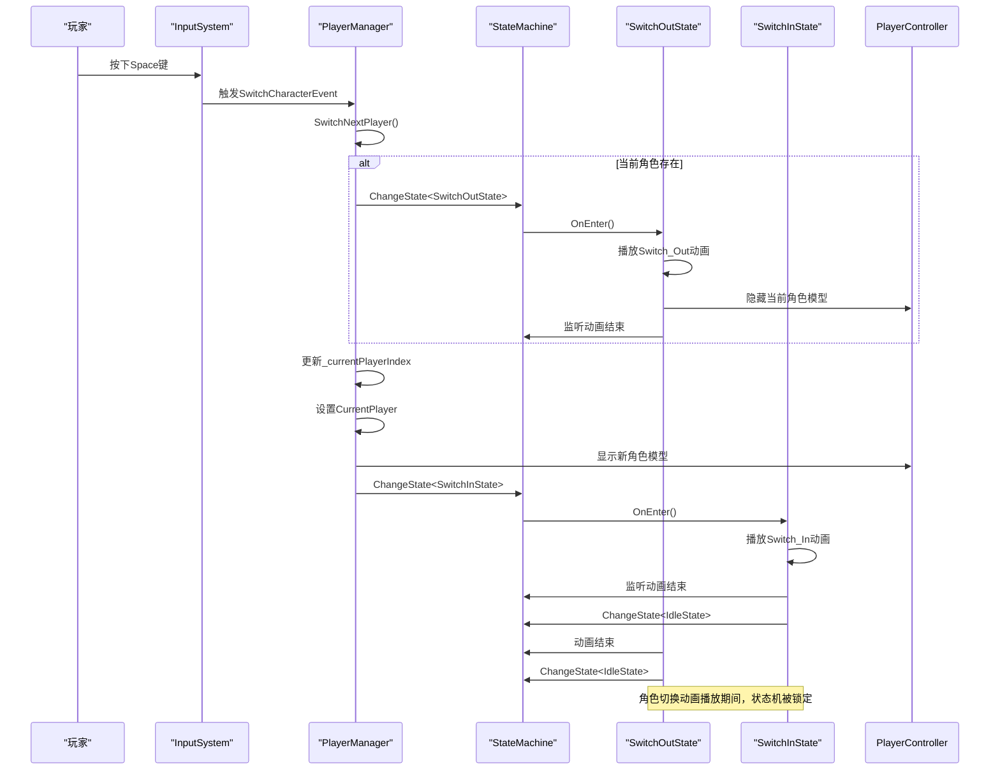
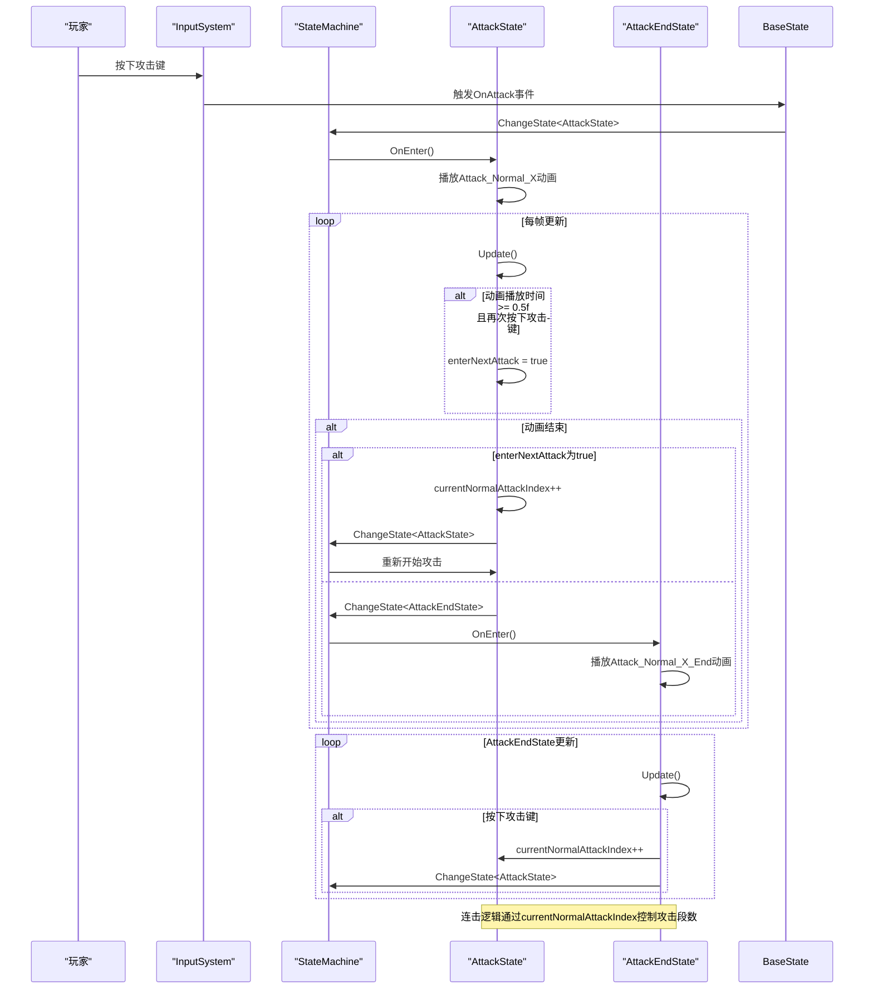
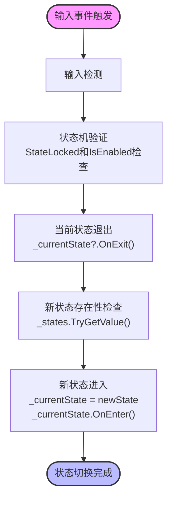
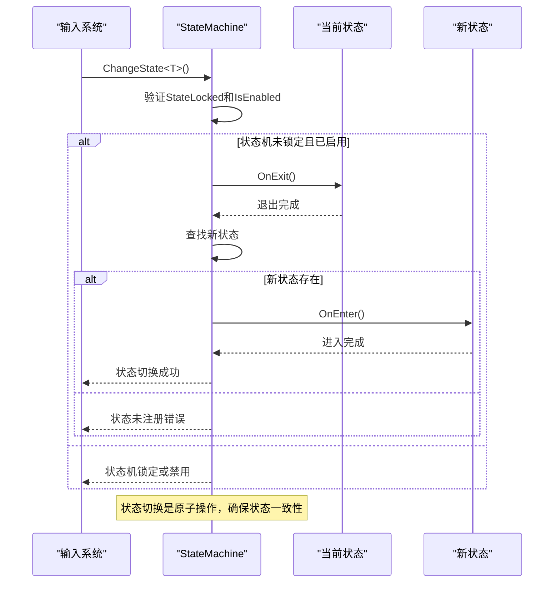

# 关键流程说明

<cite>
**本文档引用的文件**   
- [PlayerController.cs](file://Assets/Scripts/Controller/PlayerController.cs)
- [StateMachine.cs](file://Assets/Scripts/Controller/FSM/StateMachine.cs)
- [BaseState.cs](file://Assets/Scripts/Controller/FSM/BaseState.cs)
- [IState.cs](file://Assets/Scripts/Controller/FSM/IState.cs)
- [PlayerManager.cs](file://Assets/Scripts/Manager/PlayerManager/PlayerManager.cs)
- [SwitchOutState.cs](file://Assets/Scripts/Controller/FSM/CharacterState/SwitchOutState.cs)
- [SwitchInState.cs](file://Assets/Scripts/Controller/FSM/CharacterState/SwitchInState.cs)
- [AttackState.cs](file://Assets/Scripts/Controller/FSM/CharacterState/AttackState.cs)
- [AttackEndState.cs](file://Assets/Scripts/Controller/FSM/CharacterState/AttackEndState.cs)
- [InputSystem.cs](file://Assets/Scripts/Manager/InputSystem/InputSystem.cs)
- [InputSystem_Actions.cs](file://Assets/InputSystem_Actions.cs)
- [GameMain.cs](file://Assets/Scripts/Manager/GameMain.cs)
</cite>

## 目录
1. [角色切换流程](#角色切换流程)
2. [攻击流程](#攻击流程)
3. [状态切换通用流程](#状态切换通用流程)

## 角色切换流程

角色切换流程从玩家按下Space键开始，通过输入系统触发事件，由PlayerManager处理角色切换逻辑，状态机执行SwitchOutState和SwitchInState状态。整个流程确保了角色切换的平滑过渡和状态的正确管理。

**Diagram sources**
- [InputSystem.cs](file://Assets/Scripts/Manager/InputSystem/InputSystem.cs#L24)
- [PlayerManager.cs](file://Assets/Scripts/Manager/PlayerManager/PlayerManager.cs#L26)
- [SwitchOutState.cs](file://Assets/Scripts/Controller/FSM/CharacterState/SwitchOutState.cs#L5)
- [SwitchInState.cs](file://Assets/Scripts/Controller/FSM/CharacterState/SwitchInState.cs#L5)

**Section sources**
- [InputSystem.cs](file://Assets/Scripts/Manager/InputSystem/InputSystem.cs#L24-L70)
- [PlayerManager.cs](file://Assets/Scripts/Manager/PlayerManager/PlayerManager.cs#L26-L50)
- [SwitchOutState.cs](file://Assets/Scripts/Controller/FSM/CharacterState/SwitchOutState.cs#L5-L32)
- [SwitchInState.cs](file://Assets/Scripts/Controller/FSM/CharacterState/SwitchInState.cs#L5-L33)

## 攻击流程

攻击流程从玩家按下攻击键开始，状态机切换到AttackState，处理连击逻辑，并在攻击结束后进入AttackEndState处理后摇。该流程实现了流畅的连击系统和攻击后摇机制。

**Diagram sources**
- [InputSystem.cs](file://Assets/Scripts/Manager/InputSystem/InputSystem.cs#L40)
- [BaseState.cs](file://Assets/Scripts/Controller/FSM/BaseState.cs#L60)
- [AttackState.cs](file://Assets/Scripts/Controller/FSM/CharacterState/AttackState.cs#L5)
- [AttackEndState.cs](file://Assets/Scripts/Controller/FSM/CharacterState/AttackEndState.cs#L5)

**Section sources**
- [AttackState.cs](file://Assets/Scripts/Controller/FSM/CharacterState/AttackState.cs#L5-L60)
- [AttackEndState.cs](file://Assets/Scripts/Controller/FSM/CharacterState/AttackEndState.cs#L5-L43)
- [BaseState.cs](file://Assets/Scripts/Controller/FSM/BaseState.cs#L60-L65)

## 状态切换通用流程

状态切换的通用流程包括输入检测、状态机验证、当前状态退出和新状态进入四个阶段。这个流程确保了状态切换的安全性和一致性。

**Diagram sources**
- [StateMachine.cs](file://Assets/Scripts/Controller/FSM/StateMachine.cs#L40)
- [BaseState.cs](file://Assets/Scripts/Controller/FSM/BaseState.cs#L10)
- [IState.cs](file://Assets/Scripts/Controller/FSM/IState.cs#L2)

**Section sources**
- [StateMachine.cs](file://Assets/Scripts/Controller/FSM/StateMachine.cs#L40-L65)
- [BaseState.cs](file://Assets/Scripts/Controller/FSM/BaseState.cs#L10-L84)
- [IState.cs](file://Assets/Scripts/Controller/FSM/IState.cs#L2-L5)