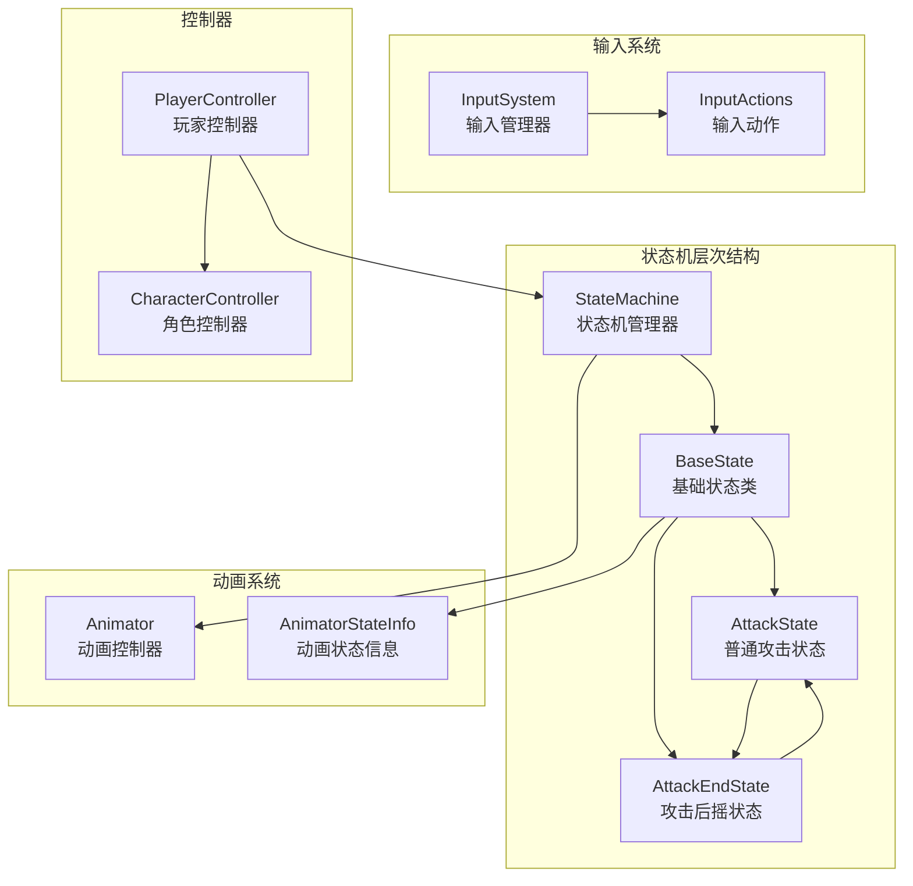
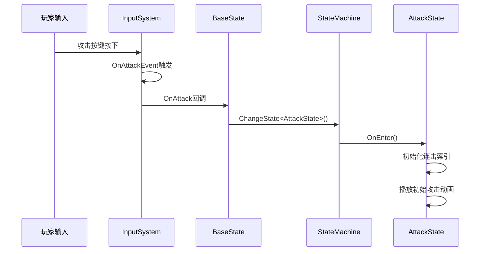
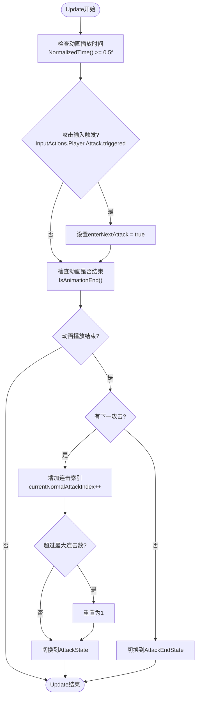
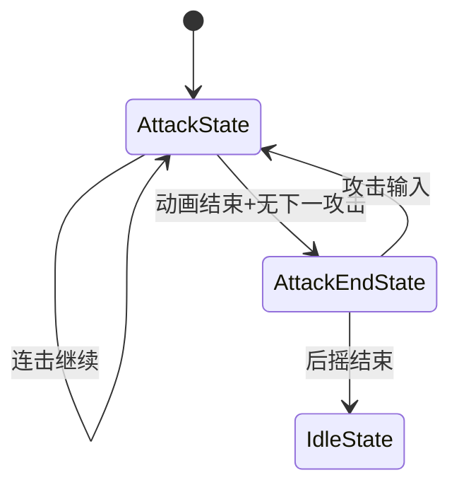
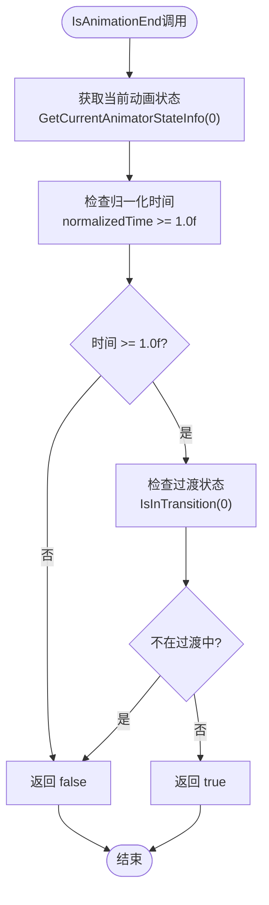

# 攻击流程深度解析

<cite>
**本文档引用的文件**
- [BaseState.cs](file://Assets/Scripts/Controller/FSM/BaseState.cs)
- [AttackState.cs](file://Assets/Scripts/Controller/FSM/CharacterState/AttackState.cs)
- [AttackEndState.cs](file://Assets/Scripts/Controller/FSM/CharacterState/AttackEndState.cs)
- [StateMachine.cs](file://Assets/Scripts/Controller/FSM/StateMachine.cs)
- [PlayerController.cs](file://Assets/Scripts/Controller/PlayerController.cs)
- [InputSystem.cs](file://Assets/Scripts/Manager/InputSystem/InputSystem.cs)
- [IState.cs](file://Assets/Scripts/Controller/FSM/IState.cs)
- [DebugX.cs](file://Assets/Scripts/Tool/DebugX.cs)
</cite>

## 目录
1. [概述](#概述)
2. [系统架构](#系统架构)
3. [攻击流程启动](#攻击流程启动)
4. [AttackState核心逻辑](#attackstate核心逻辑)
5. [连击系统详解](#连击系统详解)
6. [状态转换机制](#状态转换机制)
7. [动画系统协同](#动画系统协同)
8. [输入缓冲机制](#输入缓冲机制)
9. [状态转换图](#状态转换图)
10. [性能优化考虑](#性能优化考虑)
11. [故障排除指南](#故障排除指南)

## 概述

攻击流程是游戏战斗系统的核心组成部分，采用基于状态机的设计模式，实现了复杂的连击逻辑和流畅的动画切换。该系统通过精确的时间控制和输入检测，确保玩家能够体验到高质量的战斗反馈。

## 系统架构

攻击流程的整体架构基于有限状态机（FSM）模式，包含以下核心组件：



**图表来源**
- [StateMachine.cs](file://Assets/Scripts/Controller/FSM/StateMachine.cs#L1-L115)
- [BaseState.cs](file://Assets/Scripts/Controller/FSM/BaseState.cs#L1-L85)
- [PlayerController.cs](file://Assets/Scripts/Controller/PlayerController.cs#L1-L103)

**章节来源**
- [StateMachine.cs](file://Assets/Scripts/Controller/FSM/StateMachine.cs#L1-L115)
- [BaseState.cs](file://Assets/Scripts/Controller/FSM/BaseState.cs#L1-L85)
- [PlayerController.cs](file://Assets/Scripts/Controller/PlayerController.cs#L1-L103)

## 攻击流程启动

### 输入事件触发

攻击流程的启动始于玩家按下攻击键的输入事件。系统通过Unity的InputSystem捕获攻击输入：



**图表来源**
- [BaseState.cs](file://Assets/Scripts/Controller/FSM/BaseState.cs#L75-L84)
- [StateMachine.cs](file://Assets/Scripts/Controller/FSM/StateMachine.cs#L48-L62)
- [AttackState.cs](file://Assets/Scripts/Controller/FSM/CharacterState/AttackState.cs#L1-L15)

### BaseState.OnAttack方法

当攻击输入事件发生时，BaseState的OnAttack方法被调用，这是整个攻击流程的入口点：

**章节来源**
- [BaseState.cs](file://Assets/Scripts/Controller/FSM/BaseState.cs#L75-L84)

该方法执行以下关键操作：
1. 调用`DebugX.Instance.Log("攻击事件触发")`记录日志
2. 通过`StateMachine.ChangeState<AttackState>()`切换到攻击状态
3. 触发状态机的完整状态转换流程

## AttackState核心逻辑

### 状态初始化

AttackState的OnEnter方法负责初始化攻击状态的关键参数：

**章节来源**
- [AttackState.cs](file://Assets/Scripts/Controller/FSM/CharacterState/AttackState.cs#L1-L15)

初始化过程包括：
- 重置`enterNextAttack`标志为false
- 记录当前连击索引用于调试
- 播放对应索引的攻击动画
- 注册输入事件监听器

### Update循环中的状态检测

AttackState的Update方法是连击逻辑的核心实现：



**图表来源**
- [AttackState.cs](file://Assets/Scripts/Controller/FSM/CharacterState/AttackState.cs#L16-L48)

**章节来源**
- [AttackState.cs](file://Assets/Scripts/Controller/FSM/CharacterState/AttackState.cs#L16-L48)

## 连击系统详解

### currentNormalAttackIndex递增规则

连击系统的核心是`currentNormalAttackIndex`变量的管理：

#### 基础递增逻辑
- 初始值为1，表示第一段攻击
- 每次成功完成攻击动画后递增
- 达到最大连击数后重置为1

#### 最大连击数限制
系统通过`StateMachine._playerController.AttackLength`属性控制最大连击数：

**章节来源**
- [PlayerController.cs](file://Assets/Scripts/Controller/PlayerController.cs#L12)
- [AttackState.cs](file://Assets/Scripts/Controller/FSM/CharacterState/AttackState.cs#L28-L32)

#### 动画序列映射
攻击动画按照以下命名规则组织：
- `Attack_Normal_1`: 第一段攻击动画
- `Attack_Normal_2`: 第二段攻击动画  
- `Attack_Normal_N`: 第N段攻击动画
- `Attack_Normal_1_End`: 第一段攻击的后摇动画

### 输入缓冲窗口

连击系统的输入缓冲窗口设计在Update方法中实现：

#### 缓冲窗口时机
- **触发时机**: 动画播放到50%时（`NormalizedTime() >= 0.5f`）
- **持续时间**: 整个动画播放期间
- **检测条件**: `InputActions.Player.Attack.triggered`

#### 缓冲机制效果
- 允许玩家在最佳时机输入下一攻击
- 提供容错空间，提高操作体验
- 防止因微小延迟导致的连击中断

**章节来源**
- [AttackState.cs](file://Assets/Scripts/Controller/FSM/CharacterState/AttackState.cs#L20-L22)

## 状态转换机制

### AttackState到AttackEndState的转换

当AttackState检测到动画播放结束且没有下一攻击输入时，系统自动切换到AttackEndState：



**图表来源**
- [AttackState.cs](file://Assets/Scripts/Controller/FSM/CharacterState/AttackState.cs#L34-L48)
- [AttackEndState.cs](file://Assets/Scripts/Controller/FSM/CharacterState/AttackEndState.cs#L16-L32)

**章节来源**
- [AttackState.cs](file://Assets/Scripts/Controller/FSM/CharacterState/AttackState.cs#L34-L48)

### AttackEndState的退出条件

AttackEndState提供了两种退出方式：

#### 方式一：重新攻击
当玩家在后摇期间再次按下攻击键时：
1. 连击索引递增
2. 检查是否超过最大连击数
3. 切换回AttackState继续连击

#### 方式二：后摇自然结束
当AttackEndState的Update方法检测到动画播放完成时：
1. 调用`IsAnimationEnd()`检查动画状态
2. 如果动画结束，自动切换到IdleState

**章节来源**
- [AttackEndState.cs](file://Assets/Scripts/Controller/FSM/CharacterState/AttackEndState.cs#L16-L32)

## 动画系统协同

### IsAnimationEnd方法详解

`IsAnimationEnd()`方法是动画状态检测的核心：



**图表来源**
- [BaseState.cs](file://Assets/Scripts/Controller/FSM/BaseState.cs#L25-L32)

**章节来源**
- [BaseState.cs](file://Assets/Scripts/Controller/FSM/BaseState.cs#L25-L32)

### 动画参数设置

每个攻击状态都精确控制动画参数：

#### AttackState动画参数
- **动画名称**: `Attack_Normal_{index}`
- **播放时机**: OnEnter时立即播放
- **循环控制**: 单次播放，结束后切换状态

#### AttackEndState动画参数
- **动画名称**: `Attack_Normal_{index}_End`
- **播放时机**: OnEnter时立即播放
- **循环控制**: 单次播放，检测结束自动切换

**章节来源**
- [AttackState.cs](file://Assets/Scripts/Controller/FSM/CharacterState/AttackState.cs#L10-L11)
- [AttackEndState.cs](file://Assets/Scripts/Controller/FSM/CharacterState/AttackEndState.cs#L8)

## 输入缓冲机制

### 输入事件注册与注销

状态机在不同状态下动态管理输入事件的注册和注销：

#### AttackState输入管理
- **注册事件**: OnEnter时注册`OnMove`和`OnBigSkill`
- **注销事件**: OnExit时注销相应事件
- **作用**: 防止状态间输入冲突

#### AttackEndState输入管理
- **注册事件**: OnEnter时注册`OnMove`、`OnBigSkill`和`OnEvadeEvent`
- **注销事件**: OnExit时注销相应事件
- **作用**: 在后摇期间允许特定输入响应

**章节来源**
- [AttackState.cs](file://Assets/Scripts/Controller/FSM/CharacterState/AttackState.cs#L12-L14)
- [AttackState.cs](file://Assets/Scripts/Controller/FSM/CharacterState/AttackState.cs#L52-L56)
- [AttackEndState.cs](file://Assets/Scripts/Controller/FSM/CharacterState/AttackEndState.cs#L9-L12)
- [AttackEndState.cs](file://Assets/Scripts/Controller/FSM/CharacterState/AttackEndState.cs#L33-L37)

### 输入优先级处理

系统通过事件处理函数实现输入优先级控制：

#### 高优先级输入
- **移动输入**: 立即切换到WalkState
- **闪避输入**: 立即切换到EvadeState
- **大技能输入**: 立即切换到BigSkillState

#### 低优先级输入
- **攻击输入**: 在合适时机处理，可能触发连击

**章节来源**
- [BaseState.cs](file://Assets/Scripts/Controller/FSM/BaseState.cs#L34-L73)

## 状态转换图

以下是完整的攻击流程状态转换图：

```mermaid
stateDiagram-v2
[*] --> IdleState
IdleState --> AttackState : OnAttack()
state AttackState {
[*] --> PlayingAnimation
PlayingAnimation --> CheckingInput : Update()
CheckingInput --> PlayingAnimation : 无下一攻击
CheckingInput --> NextAttack : enterNextAttack = true
NextAttack --> PlayingAnimation : 切换到下一攻击
PlayingAnimation --> AttackEndState : 动画结束+无下一攻击
PlayingAnimation --> AttackState : 动画结束+有下一攻击
note right of PlayingAnimation
NormalizedTime() >= 0.5f
&& InputActions.Player.Attack.triggered
end note
}
state AttackEndState {
[*] --> PlayingEndAnimation
PlayingEndAnimation --> WaitingInput : Update()
WaitingInput --> AttackState : 攻击输入
WaitingInput --> IdleState : 动画结束
note right of WaitingInput
InputActions.Player.Attack.triggered
end note
}
AttackState --> IdleState : 动画结束+无下一攻击
AttackEndState --> IdleState : 动画结束
```

**图表来源**
- [StateMachine.cs](file://Assets/Scripts/Controller/FSM/StateMachine.cs#L48-L62)
- [AttackState.cs](file://Assets/Scripts/Controller/FSM/CharacterState/AttackState.cs#L16-L48)
- [AttackEndState.cs](file://Assets/Scripts/Controller/FSM/CharacterState/AttackEndState.cs#L16-L32)

## 性能优化考虑

### 动画状态缓存

系统通过`StateInfo`字段缓存动画状态信息，避免重复调用昂贵的`GetCurrentAnimatorStateInfo`方法：

**章节来源**
- [BaseState.cs](file://Assets/Scripts/Controller/FSM/BaseState.cs#L8-L9)

### 输入事件优化

- 使用事件驱动模式减少轮询开销
- 及时注销不需要的事件监听器
- 通过`StateLocked`属性防止不必要的状态转换

### 内存管理

- 实现`IDisposable`接口支持资源清理
- 使用`CompositeDisposable`管理多个订阅
- 及时释放不再需要的输入事件

## 故障排除指南

### 常见问题及解决方案

#### 问题1：攻击无法连击
**症状**: 按下攻击键后只能进行单次攻击
**原因**: 
- `NormalizedTime() >= 0.5f`条件未满足
- 输入缓冲窗口已过期
- 动画播放时间过短

**解决方案**:
- 检查动画播放时间是否足够长
- 调整输入缓冲窗口时机
- 验证`enterNextAttack`标志设置逻辑

#### 问题2：攻击后摇异常
**症状**: 攻击完成后角色卡在后摇状态
**原因**:
- 动画播放时间过长
- `IsAnimationEnd()`检测失败
- 状态转换逻辑错误

**解决方案**:
- 检查动画剪辑的播放时间设置
- 验证`IsAnimationEnd()`方法的实现
- 确认状态转换逻辑的正确性

#### 问题3：输入响应延迟
**症状**: 攻击输入后反应不及时
**原因**:
- Update循环频率不足
- 输入事件处理延迟
- 状态机切换开销过大

**解决方案**:
- 优化Update方法的执行效率
- 减少不必要的状态转换
- 使用更高效的输入检测机制

**章节来源**
- [AttackState.cs](file://Assets/Scripts/Controller/FSM/CharacterState/AttackState.cs#L20-L22)
- [BaseState.cs](file://Assets/Scripts/Controller/FSM/BaseState.cs#L25-L32)

## 结论

攻击流程的实现展现了现代游戏开发中状态机模式的强大功能。通过精心设计的输入缓冲、动画同步和状态转换机制，系统能够提供流畅而富有表现力的战斗体验。这种架构不仅保证了代码的可维护性和扩展性，还为未来的功能增强奠定了坚实的基础。

关键设计亮点包括：
- 基于时间的输入缓冲机制
- 精确的动画状态检测
- 灵活的状态转换逻辑
- 完善的输入事件管理

这套攻击系统为游戏战斗提供了可靠的技术支撑，同时保持了良好的性能特征和用户体验。