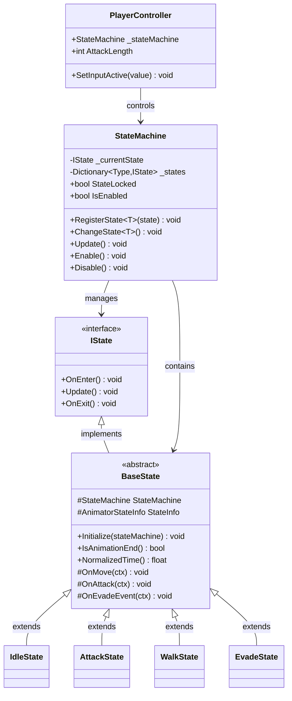
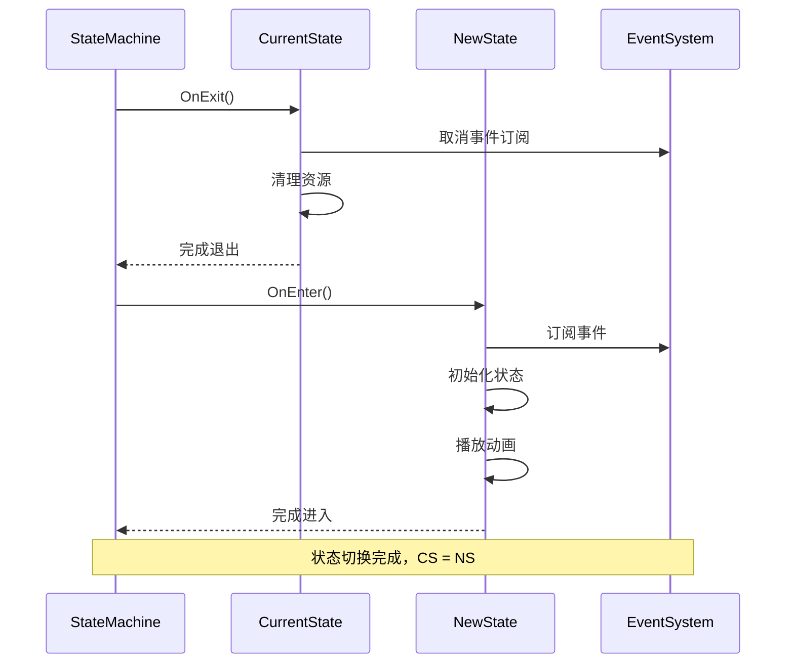
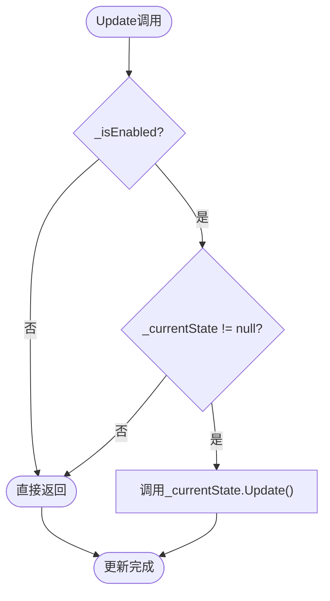
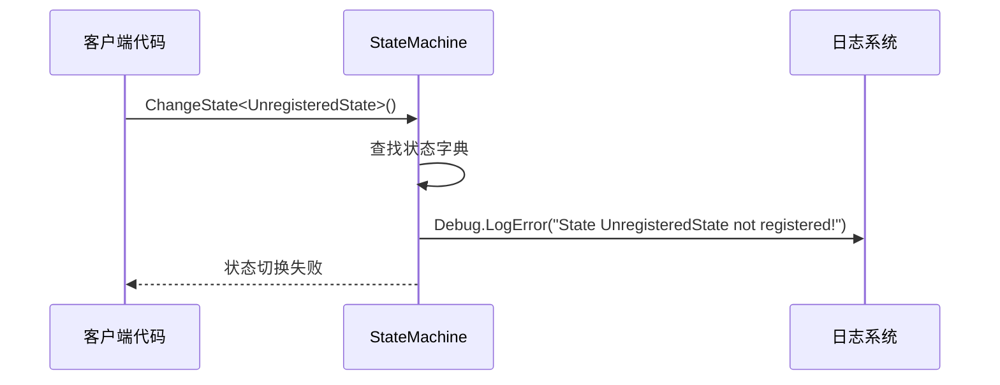
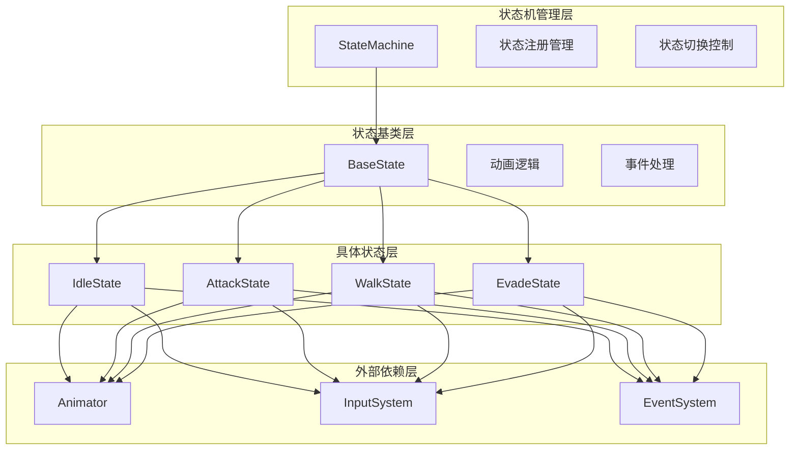
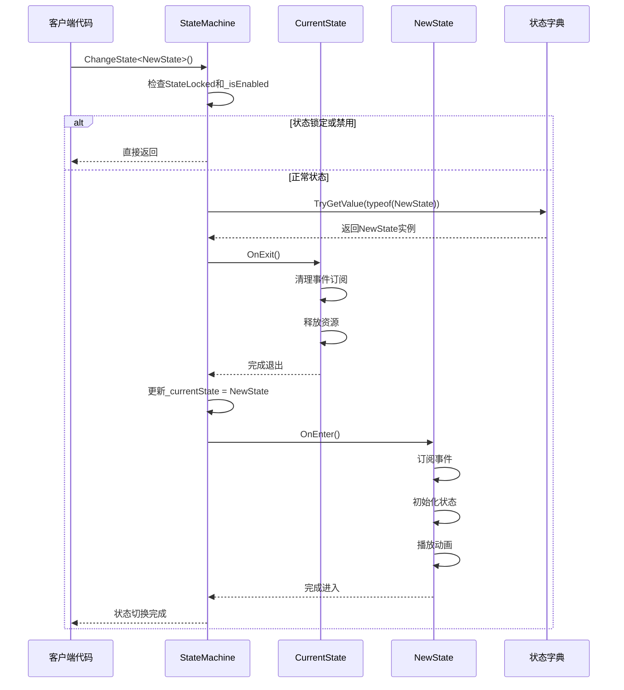

# 状态切换通用流程

<cite>
**本文档中引用的文件**
- [StateMachine.cs](file://Assets/Scripts/Controller/FSM/StateMachine.cs)
- [BaseState.cs](file://Assets/Scripts/Controller/FSM/BaseState.cs)
- [IState.cs](file://Assets/Scripts/Controller/FSM/IState.cs)
- [PlayerController.cs](file://Assets/Scripts/Controller/PlayerController.cs)
- [IdleState.cs](file://Assets/Scripts/Controller/FSM/CharacterState/IdleState.cs)
- [AttackState.cs](file://Assets/Scripts/Controller/FSM/CharacterState/AttackState.cs)
- [WalkState.cs](file://Assets/Scripts/Controller/FSM/CharacterState/WalkState.cs)
- [EvadeState.cs](file://Assets/Scripts/Controller/FSM/CharacterState/EvadeState.cs)
- [技术文档.md](file://Assets/Scripts/技术文档.md)
</cite>

## 目录
1. [引言](#引言)
2. [状态机架构概览](#状态机架构概览)
3. [核心组件分析](#核心组件分析)
4. [状态切换机制详解](#状态切换机制详解)
5. [状态生命周期管理](#状态生命周期管理)
6. [状态注册流程](#状态注册流程)
7. [状态更新循环](#状态更新循环)
8. [异常处理与错误日志](#异常处理与错误日志)
9. [设计模式与架构优势](#设计模式与架构优势)
10. [状态切换时序图](#状态切换时序图)
11. [最佳实践与注意事项](#最佳实践与注意事项)
12. [总结](#总结)

## 引言

状态机是一种经典的设计模式，用于管理对象在其生命周期内的各种状态及其转换。在本项目中，状态机系统通过精心设计的架构实现了角色行为的灵活控制，支持复杂的战斗系统和角色交互。本文档将深入分析状态机的通用切换机制，从`StateMachine.ChangeState<T>()`方法的调用开始，详细阐述整个状态切换过程的技术细节。

## 状态机架构概览

状态机系统采用分层架构设计，包含接口层、基类层、具体状态层和控制器层。这种设计实现了高度的关注点分离和良好的可扩展性。



**图表来源**
- [StateMachine.cs](file://Assets/Scripts/Controller/FSM/StateMachine.cs#L6-L115)
- [BaseState.cs](file://Assets/Scripts/Controller/FSM/BaseState.cs#L5-L85)
- [IState.cs](file://Assets/Scripts/Controller/FSM/IState.cs#L1-L6)
- [PlayerController.cs](file://Assets/Scripts/Controller/PlayerController.cs#L3-L103)

**章节来源**
- [技术文档.md](file://Assets/Scripts/技术文档.md#L66-L86)

## 核心组件分析

### IState接口契约

IState接口定义了状态的基本契约，规定了三个核心生命周期方法：

| 方法 | 参数 | 返回类型 | 描述 |
|------|------|----------|------|
| OnEnter | 无 | void | 状态进入时的初始化逻辑 |
| Update | 无 | void | 状态的持续更新逻辑 |
| OnExit | 无 | void | 状态退出时的清理逻辑 |

### StateMachine状态机类

StateMachine类是状态机的核心控制器，负责状态的注册、切换和管理：

| 属性/字段 | 类型 | 访问级别 | 描述 |
|-----------|------|----------|------|
| _currentState | IState | 私有 | 当前激活的状态实例 |
| _states | Dictionary<Type, IState> | 内部 | 存储所有已注册状态的字典 |
| StateLocked | bool | 内部 | 状态锁定标志，防止状态切换 |
| _isEnabled | bool | 私有 | 状态机启用状态标志 |
| currentNormalAttackIndex | int | 内部 | 当前普通攻击索引 |

### BaseState抽象基类

BaseState提供了状态的基础功能和事件处理机制：

| 成员 | 类型 | 描述 |
|------|------|------|
| StateMachine | StateMachine | 对状态机的引用 |
| StateInfo | AnimatorStateInfo | 当前动画状态信息 |
| Initialize() | void | 初始化状态机引用 |
| IsAnimationEnd() | bool | 检查动画是否播放结束 |
| NormalizedTime() | float | 获取动画标准化时间 |

**章节来源**
- [IState.cs](file://Assets/Scripts/Controller/FSM/IState.cs#L1-L6)
- [StateMachine.cs](file://Assets/Scripts/Controller/FSM/StateMachine.cs#L6-L25)
- [BaseState.cs](file://Assets/Scripts/Controller/FSM/BaseState.cs#L5-L85)

## 状态切换机制详解

状态切换是状态机系统的核心功能，通过`ChangeState<T>()`方法实现。该方法的执行流程遵循严格的顺序，确保状态转换的原子性和一致性。

```mermaid
flowchart TD
Start([ChangeState<T>()调用]) --> CheckLocked{"StateLocked?<br/>或 !_isEnabled"}
CheckLocked --> |是| Return([直接返回])
CheckLocked --> |否| GetType["获取类型参数<br/>typeof(T)"]
GetType --> LookupState["状态字典查找<br/>_states.TryGetValue()"]
LookupState --> StateExists{"状态存在?"}
StateExists --> |否| LogError["记录错误日志<br/>Debug.LogError()"]
StateExists --> |是| CallOnExit["调用当前状态<br/>OnExit()"]
CallOnExit --> UpdateCurrent["更新_currentState<br/>引用"]
UpdateCurrent --> CallOnEnter["调用新状态<br/>OnEnter()"]
CallOnEnter --> End([状态切换完成])
LogError --> End
Return --> End
```

**图表来源**
- [StateMachine.cs](file://Assets/Scripts/Controller/FSM/StateMachine.cs#L47-L62)

### 状态切换的内部逻辑

#### 1. 状态锁定检查（StateLocked）

状态锁定机制防止在特定情况下发生意外的状态切换。当`StateLocked`为true或状态机被禁用时，`ChangeState<T>()`会立即返回，不执行任何状态切换操作。

#### 2. 状态字典查找

状态机使用类型安全的字典查找机制，通过`typeof(T)`获取状态类型，并在`_states`字典中查找对应的实例。这种设计确保了类型安全和高效的查找性能。

#### 3. 当前状态的OnExit方法执行

在切换到新状态之前，当前状态的`OnExit()`方法会被调用。这个阶段通常用于：
- 清理事件订阅
- 停止协程和定时器
- 重置相关资源
- 执行状态退出的业务逻辑

#### 4. 新状态的OnEnter方法调用

新状态的`OnEnter()`方法在当前状态退出后立即调用。这个阶段通常包括：
- 设置初始状态变量
- 订阅必要的事件
- 开始动画播放
- 初始化游戏逻辑

#### 5. _currentState引用的更新

最后，`_currentState`引用被更新为新状态实例，完成状态切换的最后一步。

**章节来源**
- [StateMachine.cs](file://Assets/Scripts/Controller/FSM/StateMachine.cs#L47-L62)

## 状态生命周期管理

每个状态都遵循严格的生命周期管理，确保资源的正确分配和释放。BaseState类提供了完整的生命周期支持。

### 生命周期方法详解



**图表来源**
- [StateMachine.cs](file://Assets/Scripts/Controller/FSM/StateMachine.cs#L47-L62)
- [BaseState.cs](file://Assets/Scripts/Controller/FSM/BaseState.cs#L10-L15)

### BaseState生命周期方法

BaseState类定义了虚方法，允许子类重写以实现特定的生命周期逻辑：

| 方法 | 默认行为 | 重写用途 |
|------|----------|----------|
| OnEnter() | 空实现 | 初始化状态特定逻辑 |
| Update() | 空实现 | 处理状态更新逻辑 |
| OnExit() | 空实现 | 清理状态资源 |

### 动画状态检查机制

BaseState提供了专门的动画状态检查功能：

| 方法 | 功能 | 应用场景 |
|------|------|----------|
| IsAnimationEnd() | 检查动画是否播放结束 | 动画驱动的状态转换 |
| NormalizedTime() | 获取动画标准化时间 | 动画进度控制 |

**章节来源**
- [BaseState.cs](file://Assets/Scripts/Controller/FSM/BaseState.cs#L10-L85)

## 状态注册流程

状态注册是状态机初始化的重要步骤，通过`RegisterState<T>()`方法将具体状态实例化并存储到状态字典中。

```mermaid
flowchart TD
Start([RegisterState<T>(state)]) --> GetType["获取状态类型<br/>typeof(T)"]
GetType --> CheckDuplicate{"类型已存在?"}
CheckDuplicate --> |是| LogWarning["记录警告日志<br/>Debug.LogWarning()"]
CheckDuplicate --> |否| CheckBaseState{"是BaseState子类?"}
CheckBaseState --> |是| InitBaseState["调用Initialize()<br/>设置状态机引用"]
CheckBaseState --> |否| AddToDict["直接添加到字典<br/>_states[type] = state"]
InitBaseState --> AddToDict
AddToDict --> End([注册完成])
LogWarning --> End
```

**图表来源**
- [StateMachine.cs](file://Assets/Scripts/Controller/FSM/StateMachine.cs#L30-L45)

### 注册流程的关键特性

#### 1. 类型安全检查

注册过程首先检查状态类型是否已经存在于状态字典中，防止重复注册。如果发现重复类型，会记录警告日志但不会抛出异常。

#### 2. BaseState初始化

对于继承自BaseState的具体状态类，注册过程会自动调用`Initialize()`方法，设置状态机引用。这确保了状态能够访问状态机提供的所有功能。

#### 3. 字典存储机制

所有注册的状态都被存储在类型安全的字典中，使用状态类型作为键，状态实例作为值。这种设计提供了O(1)的查找性能。

**章节来源**
- [StateMachine.cs](file://Assets/Scripts/Controller/FSM/StateMachine.cs#L30-L45)

## 状态更新循环

状态机的Update方法负责驱动当前状态的更新循环，是状态机持续运行的核心机制。

### Update方法的执行流程



**图表来源**
- [StateMachine.cs](file://Assets/Scripts/Controller/FSM/StateMachine.cs#L64-L68)

### 更新循环的特性

#### 1. 启用状态检查

Update方法首先检查状态机是否启用（`_isEnabled`）。如果状态机被禁用，Update方法会立即返回，停止所有状态更新逻辑。

#### 2. 空状态保护

在调用当前状态的Update方法之前，Update方法会检查`_currentState`是否为null。这种保护机制防止了空引用异常的发生。

#### 3. 委托给当前状态

Update方法将实际的更新工作委托给当前状态的Update方法。这种设计实现了状态的完全隔离和独立性。

**章节来源**
- [StateMachine.cs](file://Assets/Scripts/Controller/FSM/StateMachine.cs#L64-L68)

## 异常处理与错误日志

状态机系统实现了完善的异常处理和错误日志记录机制，确保系统的稳定性和可调试性。

### 错误处理策略

| 错误类型 | 处理方式 | 日志级别 | 影响范围 |
|----------|----------|----------|----------|
| 未注册状态 | 记录错误日志 | Error | 单次状态切换 |
| 状态锁定 | 忽略切换请求 | None | 状态切换 |
| 状态机禁用 | 忽略更新请求 | None | 状态更新 |
| 重复注册 | 记录警告日志 | Warning | 状态注册 |

### 错误日志示例



**图表来源**
- [StateMachine.cs](file://Assets/Scripts/Controller/FSM/StateMachine.cs#L58-L60)

### 异常恢复机制

状态机系统采用了优雅的异常恢复机制：

#### 1. 非破坏性错误处理

对于未注册状态等可恢复的错误，系统不会中断正常流程，而是记录日志并继续执行。

#### 2. 状态锁定保护

状态锁定机制防止在敏感状态下发生意外的状态切换，确保系统的稳定性。

#### 3. 启用状态管理

通过`_isEnabled`标志，系统可以完全启用或禁用状态机功能，便于调试和维护。

**章节来源**
- [StateMachine.cs](file://Assets/Scripts/Controller/FSM/StateMachine.cs#L58-L60)
- [StateMachine.cs](file://Assets/Scripts/Controller/FSM/StateMachine.cs#L86-L114)

## 设计模式与架构优势

状态机系统采用了多种经典设计模式，实现了高度的可扩展性和可维护性。

### 状态模式的应用

状态模式是状态机系统的核心设计模式，具有以下优势：

#### 1. 行为封装

每个状态封装了自己的行为逻辑，实现了行为的完全隔离。状态之间的转换由状态机统一管理，避免了状态间的直接依赖。

#### 2. 易于扩展

添加新状态只需创建新的状态类并实现IState接口，无需修改现有代码。这种设计符合开闭原则。

#### 3. 可测试性

每个状态都是独立的单元，可以单独进行单元测试，提高了代码质量。

### 关注点分离



**图表来源**
- [StateMachine.cs](file://Assets/Scripts/Controller/FSM/StateMachine.cs#L6-L115)
- [BaseState.cs](file://Assets/Scripts/Controller/FSM/BaseState.cs#L5-L85)

### 架构优势总结

| 优势类别 | 具体表现 | 技术体现 |
|----------|----------|----------|
| 可扩展性 | 易于添加新状态 | 接口驱动设计 |
| 可维护性 | 状态逻辑隔离 | 单一职责原则 |
| 可测试性 | 状态可独立测试 | 封装和抽象 |
| 性能效率 | O(1)状态查找 | 类型安全字典 |
| 错误处理 | 优雅的异常恢复 | 防御性编程 |

**章节来源**
- [技术文档.md](file://Assets/Scripts/技术文档.md#L219-L256)

## 状态切换时序图

以下是状态切换的完整时序图，展示了从状态切换请求到完成的全过程：



**图表来源**
- [StateMachine.cs](file://Assets/Scripts/Controller/FSM/StateMachine.cs#L47-L62)

### 时序图的关键节点

#### 1. 请求验证阶段
- 状态锁定检查
- 状态机启用状态检查
- 类型参数验证

#### 2. 状态查找阶段
- 类型安全的字典查找
- 未注册状态的错误处理

#### 3. 状态转换阶段
- 当前状态退出
- 新状态进入
- 状态引用更新

#### 4. 完成通知阶段
- 状态切换完成
- 客户端继续执行

## 最佳实践与注意事项

基于对状态机系统的深入分析，以下是推荐的最佳实践和需要注意的事项：

### 状态设计最佳实践

#### 1. 单一职责原则
每个状态应该只负责一种特定的行为模式。例如：
- `IdleState`只处理闲置状态
- `AttackState`只处理攻击相关逻辑
- `EvadeState`只处理闪避逻辑

#### 2. 事件管理规范
- 在`OnEnter()`中订阅事件
- 在`OnExit()`中取消订阅事件
- 避免在状态间直接传递数据

#### 3. 动画状态同步
- 使用`IsAnimationEnd()`检查动画完成
- 在适当的时机进行状态切换
- 考虑动画过渡状态的影响

### 性能优化建议

#### 1. 状态切换频率控制
- 避免频繁的状态切换
- 使用状态锁定机制防止意外切换
- 合理设置状态更新频率

#### 2. 资源管理
- 及时释放不再需要的资源
- 使用对象池管理临时对象
- 避免在Update方法中进行昂贵操作

### 调试和维护

#### 1. 日志记录
- 在关键状态切换点添加日志
- 记录状态切换的原因和结果
- 使用适当的日志级别

#### 2. 错误处理
- 处理未注册状态的情况
- 提供有意义的错误信息
- 实现优雅的降级机制

**章节来源**
- [技术文档.md](file://Assets/Scripts/技术文档.md#L268-L291)

## 总结

状态机系统通过精心设计的架构实现了高效、可扩展的角色状态管理。从`StateMachine.ChangeState<T>()`方法的调用开始，整个状态切换过程遵循严格的顺序，确保了状态转换的原子性和一致性。

### 核心技术特点

1. **类型安全的状态管理**：通过泛型约束和类型字典确保状态类型的安全性
2. **生命周期管理**：完整的状态生命周期支持，包括初始化、更新和清理
3. **事件驱动架构**：基于事件的状态切换，实现松耦合的设计
4. **异常处理机制**：优雅的错误处理和日志记录
5. **性能优化**：O(1)的状态查找和高效的更新循环

### 架构优势

状态机系统展现了优秀的软件架构设计：
- **关注点分离**：不同层次的职责明确划分
- **可扩展性**：易于添加新状态和新功能
- **可维护性**：模块化设计便于维护和测试
- **稳定性**：完善的错误处理和恢复机制

这种设计模式不仅适用于角色状态管理，也为其他需要状态控制的场景提供了优秀的参考实现。通过深入理解这些机制，开发者可以构建更加健壮和可维护的游戏系统。