# 角色切换流程

<cite>
**本文档中引用的文件**
- [PlayerEvents.cs](file://Assets/Scripts/EventData/PlayerEvents.cs)
- [InputSystem.cs](file://Assets/Scripts/Manager/InputSystem/InputSystem.cs)
- [PlayerManager.cs](file://Assets/Scripts/Manager/PlayerManager/PlayerManager.cs)
- [StateMachine.cs](file://Assets/Scripts/Controller/FSM/StateMachine.cs)
- [SwitchInState.cs](file://Assets/Scripts/Controller/FSM/CharacterState/SwitchInState.cs)
- [SwitchOutState.cs](file://Assets/Scripts/Controller/FSM/CharacterState/SwitchOutState.cs)
- [PlayerController.cs](file://Assets/Controller/PlayerController.cs)
- [BaseState.cs](file://Assets/Scripts/Controller/FSM/BaseState.cs)
- [IState.cs](file://Assets/Scripts/Controller/FSM/IState.cs)
- [GameEvents.cs](file://Assets/Scripts/Manager/EventSystem/GameEvents.cs)
- [GameMain.cs](file://Assets/Scripts/Manager/GameMain.cs)
</cite>

## 目录
1. [简介](#简介)
2. [系统架构概览](#系统架构概览)
3. [角色切换事件流程](#角色切换事件流程)
4. [状态机核心机制](#状态机核心机制)
5. [切换状态详细分析](#切换状态详细分析)
6. [角色控制器管理](#角色控制器管理)
7. [时序图与方法调用链](#时序图与方法调用链)
8. [性能考虑](#性能考虑)
9. [故障排除指南](#故障排除指南)
10. [总结](#总结)

## 简介

角色切换是游戏中的核心功能之一，允许玩家在多个角色之间无缝切换。本文档详细分析了从输入事件触发到角色完全切换的完整流程，包括事件发布、状态机控制、动画播放和模型管理等关键环节。

## 系统架构概览

角色切换系统采用事件驱动的架构设计，主要由以下核心组件构成：

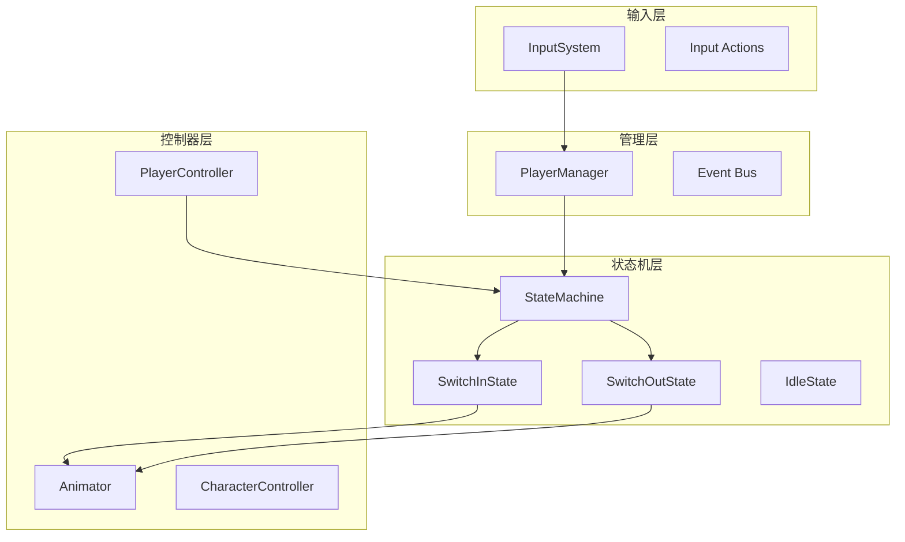

**图表来源**
- [InputSystem.cs](file://Assets/Scripts/Manager/InputSystem/InputSystem.cs#L1-L94)
- [PlayerManager.cs](file://Assets/Scripts/Manager/PlayerManager/PlayerManager.cs#L1-L85)
- [StateMachine.cs](file://Assets/Scripts/Controller/FSM/StateMachine.cs#L1-L115)

## 角色切换事件流程

### 输入事件触发

角色切换通过特定的输入动作触发，系统监听`Space`键的按下事件：

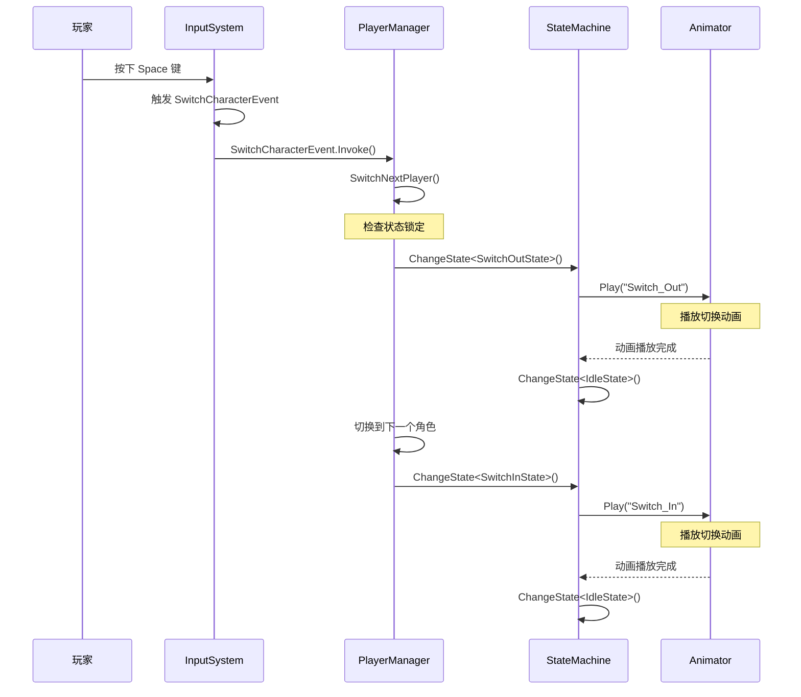

**图表来源**
- [InputSystem.cs](file://Assets/Scripts/Manager/InputSystem/InputSystem.cs#L60-L65)
- [PlayerManager.cs](file://Assets/Scripts/Manager/PlayerManager/PlayerManager.cs#L30-L50)
- [StateMachine.cs](file://Assets/Scripts/Controller/FSM/StateMachine.cs#L40-L55)

**章节来源**
- [InputSystem.cs](file://Assets/Scripts/Manager/InputSystem/InputSystem.cs#L60-L65)
- [PlayerManager.cs](file://Assets/Scripts/Manager/PlayerManager/PlayerManager.cs#L20-L50)

### 事件发布机制

系统使用事件总线模式来解耦输入处理和角色管理逻辑。当玩家按下切换键时，InputSystem发布`SwitchCharacterEvent`事件：

| 事件类型 | 触发条件 | 处理方式 |
|---------|---------|---------|
| SwitchCharacterEvent | Space键按下 | PlayerManager.SwitchNextPlayer() |
| OnMovePerformed | 移动输入 | 标准移动处理 |
| OnAttackEvent | 攻击输入 | 攻击状态切换 |

**章节来源**
- [InputSystem.cs](file://Assets/Scripts/Manager/InputSystem/InputSystem.cs#L30-L45)

## 状态机核心机制

### 状态机锁定机制

状态机实现了状态锁定机制来防止在切换过程中被中断：

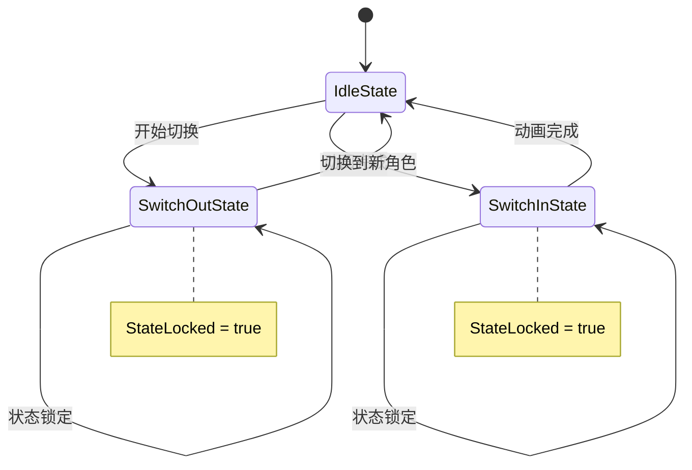

**图表来源**
- [StateMachine.cs](file://Assets/Scripts/Controller/FSM/StateMachine.cs#L40-L55)
- [SwitchInState.cs](file://Assets/Scripts/Controller/FSM/CharacterState/SwitchInState.cs#L1-L34)
- [SwitchOutState.cs](file://Assets/Scripts/Controller/FSM/CharacterState/SwitchOutState.cs#L1-L33)

### 状态机变更逻辑

状态机提供了安全的状态切换机制，确保不会在禁用状态下进行状态变更：

| 方法 | 功能 | 安全检查 |
|------|------|----------|
| ChangeState<T>() | 切换到指定状态 | StateLocked, IsEnabled |
| RegisterState<T>() | 注册状态 | 类型重复检查 |
| Update() | 更新当前状态 | IsEnabled检查 |
| Enable()/Disable() | 启用/禁用状态机 | 状态同步 |

**章节来源**
- [StateMachine.cs](file://Assets/Scripts/Controller/FSM/StateMachine.cs#L40-L60)

## 切换状态详细分析

### SwitchOutState行为分析

SwitchOutState负责处理当前角色的退出动画和状态管理：

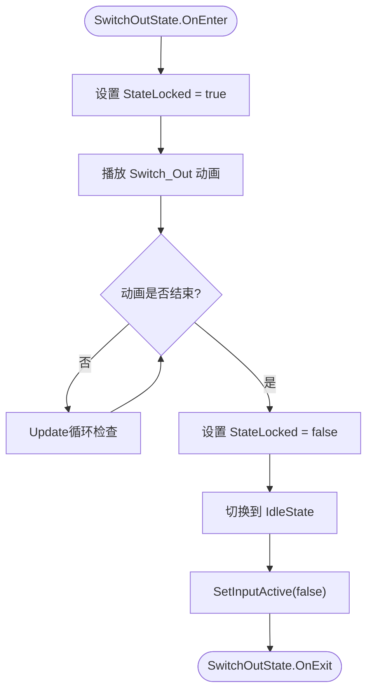

**图表来源**
- [SwitchOutState.cs](file://Assets/Scripts/Controller/FSM/CharacterState/SwitchOutState.cs#L1-L33)

#### SwitchOutState核心特性

| 特性 | 实现方式 | 目的 |
|------|----------|------|
| 状态锁定 | StateLocked = true | 防止切换过程被中断 |
| 动画播放 | Animator.Play("Switch_Out") | 视觉反馈切换过程 |
| 输入禁用 | SetInputActive(false) | 防止切换期间的输入干扰 |
| 自动清理 | 切换到IdleState | 确保状态一致性 |

**章节来源**
- [SwitchOutState.cs](file://Assets/Scripts/Controller/FSM/CharacterState/SwitchOutState.cs#L1-L33)

### SwitchInState行为分析

SwitchInState处理新角色的进入动画和激活过程：

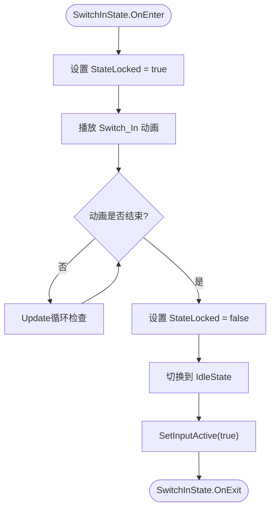

**图表来源**
- [SwitchInState.cs](file://Assets/Scripts/Controller/FSM/CharacterState/SwitchInState.cs#L1-L34)

#### SwitchInState核心特性

| 特性 | 实现方式 | 目的 |
|------|----------|------|
| 状态锁定 | StateLocked = true | 确保切换过程完整性 |
| 动画播放 | Animator.Play("Switch_In") | 视觉反馈新角色出现 |
| 输入启用 | SetInputActive(true) | 允许新角色响应输入 |
| 自动恢复 | 切换到IdleState | 准备正常游戏状态 |

**章节来源**
- [SwitchInState.cs](file://Assets/Scripts/Controller/FSM/CharacterState/SwitchInState.cs#L1-L34)

### 动画播放机制

状态机提供了统一的动画检查机制：

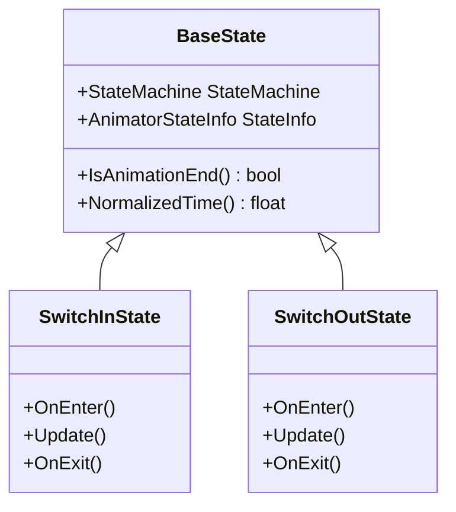

**图表来源**
- [BaseState.cs](file://Assets/Scripts/Controller/FSM/BaseState.cs#L1-L85)
- [SwitchInState.cs](file://Assets/Scripts/Controller/FSM/CharacterState/SwitchInState.cs#L1-L34)
- [SwitchOutState.cs](file://Assets/Scripts/Controller/FSM/CharacterState/SwitchOutState.cs#L1-L33)

**章节来源**
- [BaseState.cs](file://Assets/Scripts/Controller/FSM/BaseState.cs#L20-L35)

## 角色控制器管理

### PlayerController激活机制

PlayerController实现了复杂的激活/禁用逻辑来管理角色状态：

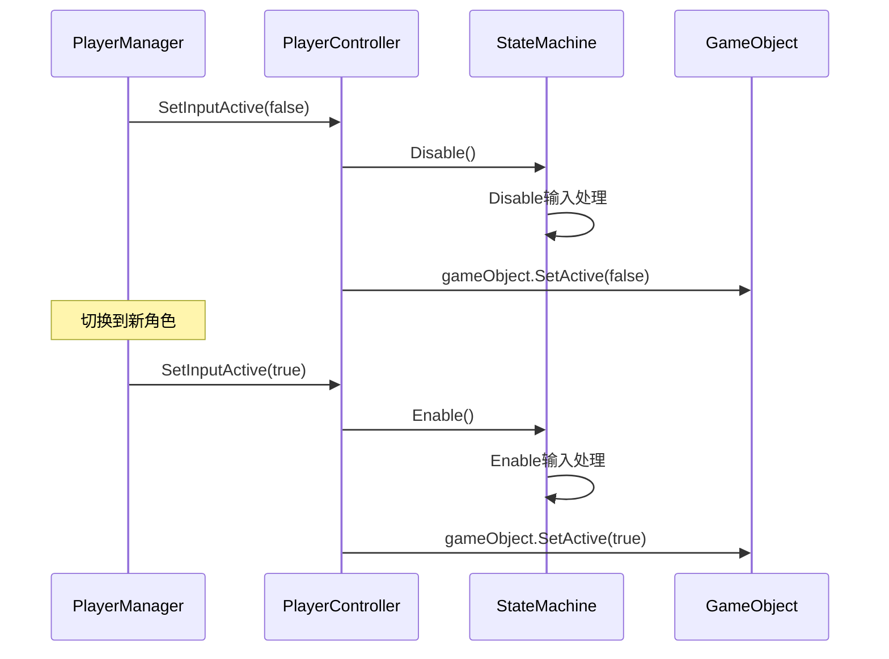

**图表来源**
- [PlayerController.cs](file://Assets/Scripts/Controller/PlayerController.cs#L70-L94)
- [PlayerManager.cs](file://Assets/Scripts/Manager/PlayerManager/PlayerManager.cs#L30-L50)

### 模型显示/隐藏逻辑

| 操作 | GameObject.SetActive() | 组件状态 | 输入状态 |
|------|---------------------|----------|----------|
| 当前角色 | true | enabled=true | 可响应输入 |
| 切换中角色 | false | enabled=false | 禁用输入 |
| 新角色 | true | enabled=true | 可响应输入 |

**章节来源**
- [PlayerManager.cs](file://Assets/Scripts/Manager/PlayerManager/PlayerManager.cs#L30-L50)
- [PlayerController.cs](file://Assets/Scripts/Controller/PlayerController.cs#L70-L94)

### 状态锁定机制详解

状态锁定是防止切换过程中被意外中断的关键机制：

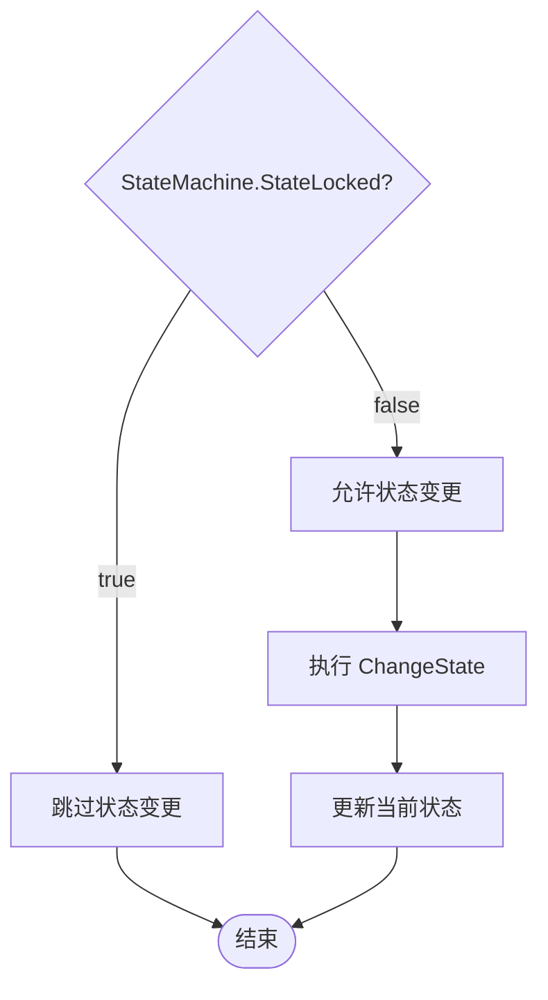

**图表来源**
- [StateMachine.cs](file://Assets/Scripts/Controller/FSM/StateMachine.cs#L40-L55)

**章节来源**
- [StateMachine.cs](file://Assets/Scripts/Controller/FSM/StateMachine.cs#L40-L55)

## 时序图与方法调用链

### 完整的角色切换时序

以下是角色切换的完整方法调用链：

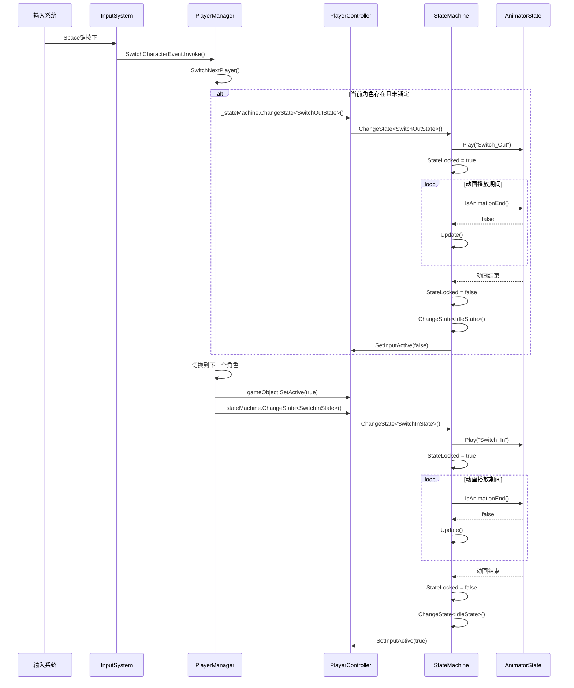

**图表来源**
- [InputSystem.cs](file://Assets/Scripts/Manager/InputSystem/InputSystem.cs#L60-L65)
- [PlayerManager.cs](file://Assets/Scripts/Manager/PlayerManager/PlayerManager.cs#L30-L50)
- [StateMachine.cs](file://Assets/Scripts/Controller/FSM/StateMachine.cs#L40-L55)
- [SwitchInState.cs](file://Assets/Scripts/Controller/FSM/CharacterState/SwitchInState.cs#L1-L34)
- [SwitchOutState.cs](file://Assets/Scripts/Controller/FSM/CharacterState/SwitchOutState.cs#L1-L33)

### 关键方法调用路径

| 调用层级 | 方法名 | 执行时机 | 功能描述 |
|---------|--------|----------|----------|
| 1 | SwitchCharacterEvent.Invoke() | 输入触发 | 事件发布 |
| 2 | SwitchNextPlayer() | 事件响应 | 主切换逻辑 |
| 3 | ChangeState<SwitchOutState>() | 当前角色 | 开始退出 |
| 4 | ChangeState<SwitchInState>() | 新角色 | 开始进入 |
| 5 | Play("Switch_Out"/"Switch_In") | 动画播放 | 视觉效果 |
| 6 | SetInputActive(true/false) | 控制器管理 | 输入状态 |

**章节来源**
- [PlayerManager.cs](file://Assets/Scripts/Manager/PlayerManager/PlayerManager.cs#L30-L50)
- [StateMachine.cs](file://Assets/Scripts/Controller/FSM/StateMachine.cs#L40-L55)

## 性能考虑

### 内存管理优化

系统采用了多种内存优化策略：

| 优化策略 | 实现方式 | 效果 |
|---------|----------|------|
| 对象池 | StateMachine._states字典 | 避免频繁创建销毁 |
| 委托缓存 | 事件订阅/取消订阅 | 减少GC压力 |
| 组件禁用 | SetInputActive(false) | 降低CPU使用率 |
| 动画状态检查 | IsAnimationEnd() | 避免不必要的更新 |

### 状态机性能监控

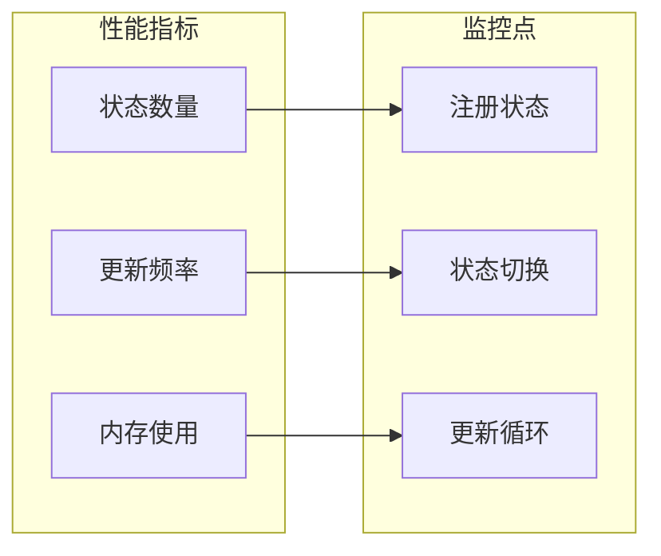

**章节来源**
- [StateMachine.cs](file://Assets/Scripts/Controller/FSM/StateMachine.cs#L25-L40)

## 故障排除指南

### 常见问题及解决方案

| 问题症状 | 可能原因 | 解决方案 |
|---------|----------|----------|
| 角色切换卡住 | 动画未完成 | 检查动画状态机配置 |
| 输入无响应 | StateLocked未解锁 | 验证状态机状态 |
| 新角色不显示 | GameObject未激活 | 检查SetActive(true)调用 |
| 切换顺序错误 | PlayerControllers列表 | 验证角色添加顺序 |

### 调试工具和日志

系统提供了丰富的调试信息：

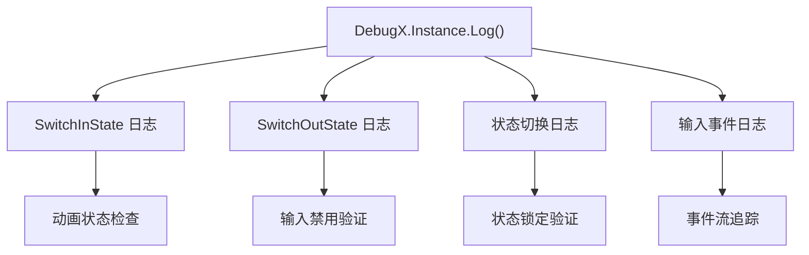

**章节来源**
- [SwitchInState.cs](file://Assets/Scripts/Controller/FSM/CharacterState/SwitchInState.cs#L5-L10)
- [SwitchOutState.cs](file://Assets/Scripts/Controller/FSM/CharacterState/SwitchOutState.cs#L5-L10)

## 总结

角色切换系统是一个精心设计的事件驱动架构，通过以下关键特性确保流畅的游戏体验：

1. **事件驱动架构**：InputSystem发布事件，PlayerManager响应处理
2. **状态机控制**：通过状态锁定机制防止切换过程被中断
3. **动画协调**：统一的动画播放和状态检查机制
4. **资源管理**：智能的GameObject激活/禁用策略
5. **性能优化**：多层次的性能监控和优化措施

该系统的设计充分体现了软件工程的最佳实践，包括松耦合、高内聚、可扩展性和可维护性。通过模块化的状态机设计，系统能够轻松支持更多角色和更复杂的状态转换需求。