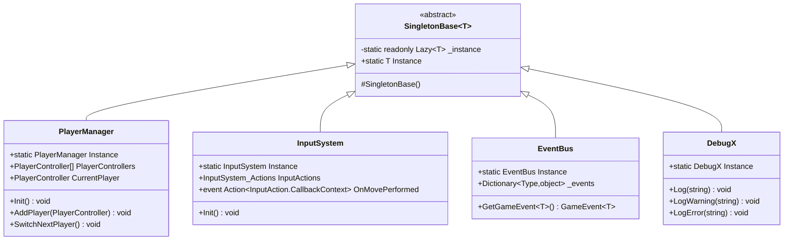

# 单例基类

<cite>
**本文档中引用的文件**
- [Singleton.cs](file://Assets/Scripts/Tool/Singleton.cs)
- [PlayerManager.cs](file://Assets/Scripts/Manager/PlayerManager/PlayerManager.cs)
- [InputSystem.cs](file://Assets/Scripts/Manager/InputSystem/InputSystem.cs)
- [EventBus.cs](file://Assets/Scripts/Manager\EventSystem\EventBus.cs)
- [DebugX.cs](file://Assets\Scripts\Tool\DebugX.cs)
- [GameMain.cs](file://Assets\Scripts\Manager\GameMain.cs)
- [技术文档.md](file://Assets\Scripts\技术文档.md)
</cite>

## 目录
1. [简介](#简介)
2. [核心架构](#核心架构)
3. [线程安全实现](#线程安全实现)
4. [泛型约束与设计](#泛型约束与设计)
5. [实例管理机制](#实例管理机制)
6. [继承使用方式](#继承使用方式)
7. [实际应用场景](#实际应用场景)
8. [最佳实践](#最佳实践)
9. [故障排除](#故障排除)
10. [总结](#总结)

## 简介

SingletonBase<T>是Unity项目中的核心单例模式泛型基类，它提供了一个线程安全、延迟初始化的单例实现。该基类通过泛型约束确保类型安全，并使用Lazy<T>实现高效的延迟加载机制，是整个项目中多个管理器类的基础。

## 核心架构

SingletonBase<T>采用简洁而强大的设计模式，通过以下核心组件实现单例功能：



**图表来源**
- [Singleton.cs](file://Assets\Scripts\Tool\Singleton.cs#L7-L23)
- [PlayerManager.cs](file://Assets\Scripts\Manager\PlayerManager\PlayerManager.cs#L12-L85)
- [InputSystem.cs](file://Assets\Scripts\Manager\InputSystem\InputSystem.cs#L5-L94)
- [EventBus.cs](file://Assets\Scripts\Manager\EventSystem\EventBus.cs#L4-L16)
- [DebugX.cs](file://Assets\Scripts\Tool\DebugX.cs#L3-L24)

**章节来源**
- [Singleton.cs](file://Assets\Scripts\Tool\Singleton.cs#L1-L24)

## 线程安全实现

SingletonBase<T>的核心优势在于其线程安全的实现机制。通过使用Lazy<T>的ExecutionAndPublication模式，确保了多线程环境下的安全性：

### 延迟初始化机制


**图表来源**
- [Singleton.cs](file://Assets\Scripts\Tool\Singleton.cs#L10-L12)

### 线程安全保障

LazyThreadSafetyMode.ExecutionAndPublication提供了以下保障：
- **首次访问时的安全初始化**：确保只有一个线程能够创建实例
- **后续访问的高效性**：一旦实例创建完成，后续访问无需同步开销
- **内存可见性保证**：确保实例创建对所有线程可见

**章节来源**
- [Singleton.cs](file://Assets\Scripts\Tool\Singleton.cs#L10-L12)

## 泛型约束与设计

SingletonBase<T>通过严格的泛型约束确保类型安全和可用性：

### 约束条件分析

| 约束 | 作用 | 必要性 |
|------|------|--------|
| `class` | 确保T是引用类型 | 必需，因为单例需要引用语义 |
| `new()` | 要求类型有无参构造函数 | 必需，用于Lazy<T>的实例创建 |

### 构造函数保护机制


**图表来源**
- [Singleton.cs](file://Assets\Scripts\Tool\Singleton.cs#L14-L17)

这种设计确保了：
- **编译时类型安全**：只有符合约束的类型才能继承
- **运行时保护**：防止意外的多重实例化
- **清晰的继承关系**：明确区分基类和派生类的职责

**章节来源**
- [Singleton.cs](file://Assets\Scripts\Tool\Singleton.cs#L7-L17)

## 实例管理机制

SingletonBase<T>的实例管理采用了优雅的设计模式：

### 静态属性设计


**图表来源**
- [Singleton.cs](file://Assets\Scripts\Tool\Singleton.cs#L19-L21)

### 内存管理特性

- **延迟加载**：直到第一次访问才创建实例，节省启动资源
- **自动垃圾回收**：当没有任何强引用时，实例可以被GC回收
- **无显式销毁**：不需要手动清理，符合Unity生命周期管理

**章节来源**
- [Singleton.cs](file://Assets\Scripts\Tool\Singleton.cs#L19-L21)

## 继承使用方式

### 基本继承模式

正确的继承方式遵循以下模式：

#### PlayerManager示例


**图表来源**
- [PlayerManager.cs](file://Assets\Scripts\Manager\PlayerManager\PlayerManager.cs#L12-L85)

#### InputSystem示例


**图表来源**
- [InputSystem.cs](file://Assets\Scripts\Manager\InputSystem\InputSystem.cs#L5-L94)

### 访问实例的方式

所有继承类都可以通过静态属性访问实例：

| 访问方式 | 示例 | 适用场景 |
|----------|------|----------|
| 静态属性访问 | `PlayerManager.Instance` | 任何需要访问单例的地方 |
| 属性链式访问 | `InputSystem.Instance.InputActions` | 访问嵌套对象 |
| 方法调用 | `EventBus.Instance.GetGameEvent<T>()` | 调用实例方法 |

**章节来源**
- [PlayerManager.cs](file://Assets\Scripts\Manager\PlayerManager\PlayerManager.cs#L12-L20)
- [InputSystem.cs](file://Assets\Scripts\Manager\InputSystem\InputSystem.cs#L5-L15)
- [EventBus.cs](file://Assets\Scripts\Manager\EventSystem\EventBus.cs#L4-L16)

## 实际应用场景

### PlayerManager - 玩家管理器

PlayerManager展示了单例模式在游戏管理中的典型应用：


**图表来源**
- [GameMain.cs](file://Assets\Scripts\Manager\GameMain.cs#L15-L35)
- [PlayerManager.cs](file://Assets\Scripts\Manager\PlayerManager\PlayerManager.cs#L18-L85)

### InputSystem - 输入系统

InputSystem作为全局输入管理器，体现了单例模式的优势：

- **全局唯一性**：确保整个游戏只有一个输入系统实例
- **事件分发**：统一处理所有输入事件
- **状态管理**：维护输入状态和回调函数

### EventBus - 事件总线

EventBus展示了单例模式在解耦系统间通信中的应用：


**图表来源**
- [EventBus.cs](file://Assets\Scripts\Manager\EventSystem\EventBus.cs#L4-L16)

### DebugX - 调试工具

DebugX作为调试辅助工具，展示了单例模式在开发阶段的应用：

- **统一日志输出**：提供一致的日志格式
- **调试信息收集**：集中管理调试数据
- **性能监控**：跟踪关键性能指标

**章节来源**
- [PlayerManager.cs](file://Assets\Scripts\Manager\PlayerManager\PlayerManager.cs#L18-L30)
- [InputSystem.cs](file://Assets\Scripts\Manager\InputSystem\InputSystem.cs#L15-L30)
- [EventBus.cs](file://Assets\Scripts\Manager\EventSystem\EventBus.cs#L8-L16)
- [DebugX.cs](file://Assets\Scripts\Tool\DebugX.cs#L3-L24)

## 最佳实践

### 正确的使用方式

1. **继承规范**
   - 确保派生类满足泛型约束
   - 提供必要的构造函数参数
   - 实现适当的初始化逻辑

2. **访问时机**
   - 在需要时才访问Instance属性
   - 避免在静态构造函数中访问单例
   - 考虑依赖注入替代方案

3. **生命周期管理**
   - 不要在Unity的Awake或Start中过早访问单例
   - 确保在场景切换时正确处理单例状态

### 性能优化建议


### 内存泄漏预防

虽然SingletonBase<T>本身不会造成内存泄漏，但仍需注意：

- **事件订阅管理**：及时取消不需要的事件订阅
- **资源释放**：在适当的生命周期点释放资源
- **循环引用**：避免与其他单例形成循环依赖

**章节来源**
- [Singleton.cs](file://Assets\Scripts\Tool\Singleton.cs#L14-L17)
- [技术文档.md](file://Assets\Scripts\技术文档.md#L250-L292)

## 故障排除

### 常见问题及解决方案

| 问题类型 | 症状 | 原因 | 解决方案 |
|----------|------|------|----------|
| 构造函数异常 | InvalidOperationException | 尝试直接实例化 | 使用Instance属性访问 |
| 线程安全问题 | 多实例创建 | 多线程同时访问 | 检查访问时机和同步 |
| 内存泄漏 | 内存持续增长 | 事件未取消订阅 | 实现适当的清理逻辑 |
| 循环依赖 | 初始化失败 | 单例间相互依赖 | 重构设计或使用弱引用 |

### 调试技巧

1. **日志记录**：在SingletonBase中添加初始化日志
2. **断点调试**：在Instance属性访问处设置断点
3. **内存分析**：使用Unity Profiler监控内存使用
4. **单元测试**：编写测试验证单例行为

### 错误处理策略

```mermaid
flowchart TD
A[错误检测] --> B{错误类型}
B --> |构造函数异常| C[检查泛型约束]
B --> |访问异常| D[检查访问时机]
B --> |性能问题| E[优化访问模式]
C --> C1[确保类型满足new()约束]
D --> D1[延迟到合适时机访问]
E --> E1[批量处理相关操作]
C1 --> F[修复并重新测试]
D1 --> F
E1 --> F
```

**章节来源**
- [Singleton.cs](file://Assets\Scripts\Tool\Singleton.cs#L14-L17)

## 总结

SingletonBase<T>是Unity项目中一个精心设计的单例模式实现，具有以下核心优势：

### 主要特性

1. **线程安全**：使用Lazy<T>确保多线程环境下的安全性
2. **类型安全**：通过泛型约束保证编译时类型检查
3. **延迟初始化**：按需创建实例，优化启动性能
4. **简单易用**：提供简洁的继承和使用接口

### 应用价值

- **全局状态管理**：为游戏提供统一的状态管理机制
- **解耦系统组件**：促进模块间的松耦合设计
- **简化依赖管理**：减少复杂的依赖注入需求
- **提高开发效率**：提供可复用的基础设施

### 设计哲学

SingletonBase<T>体现了现代软件设计中的几个重要原则：
- **单一职责**：专注于单例模式的实现
- **开放封闭**：对扩展开放，对修改封闭
- **依赖倒置**：依赖抽象而非具体实现
- **接口隔离**：提供最小化的公共接口

通过深入理解和正确使用SingletonBase<T>，开发者可以构建更加健壮、可维护的Unity应用程序，同时避免常见的单例模式陷阱和问题。