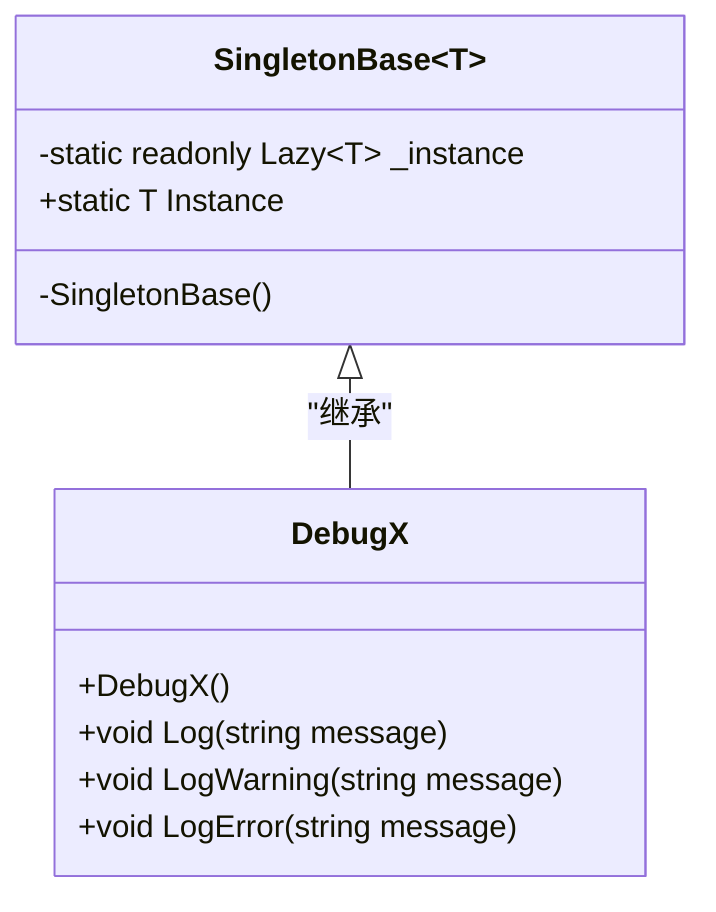
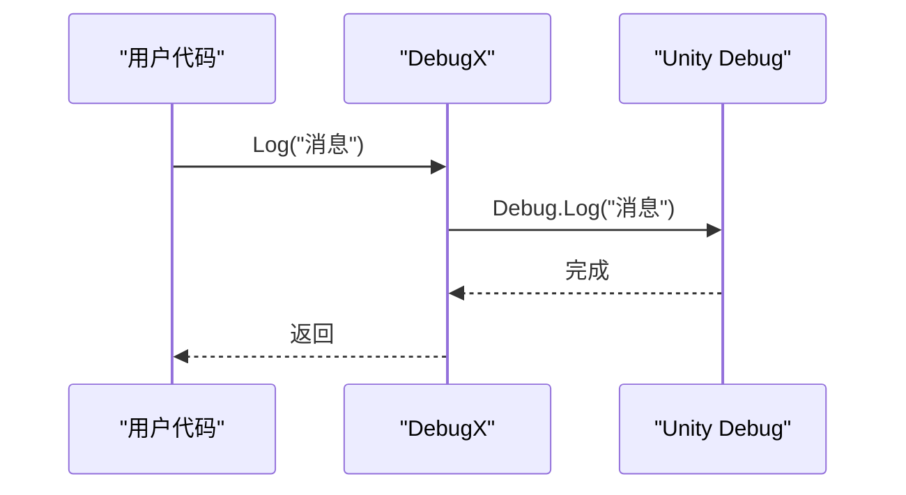
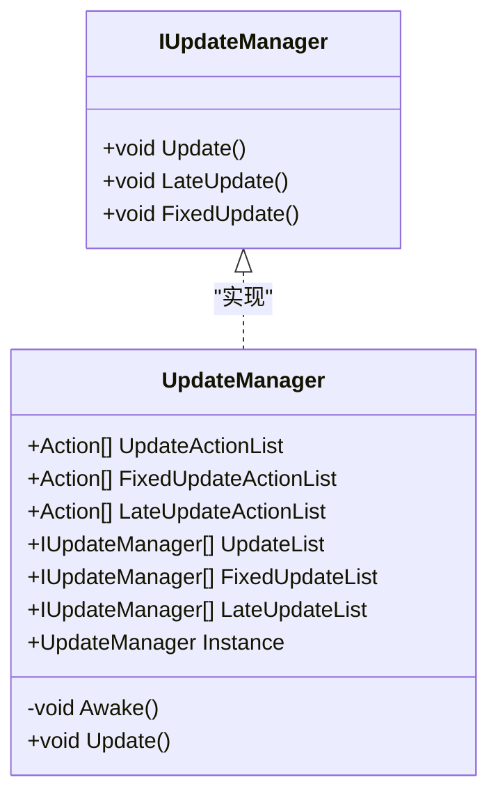

# 工具类与实用程序

<cite>
**本文档中引用的文件**  
- [Singleton.cs](file://Assets/Scripts/Tool/Singleton.cs)
- [DebugX.cs](file://Assets/Scripts/Tool/DebugX.cs)
- [UniTaskTimer.cs](file://Assets/Scripts/Tool/UniTaskTimer.cs)
- [IUpdateManager.cs](file://Assets/Scripts/Tool/UpdateManager/IUpdateManager.cs)
- [UpdataManager.cs](file://Assets/Scripts/Tool/UpdateManager/UpdataManager.cs)
- [BaseState.cs](file://Assets/Scripts/Controller/FSM/BaseState.cs)
- [GameMain.cs](file://Assets/Scripts/Manager/GameMain.cs)
- [BigSkillState.cs](file://Assets/Scripts/Controller/FSM/CharacterState/BigSkillState.cs)
</cite>

## 目录
1. [简介](#简介)
2. [核心工具类分析](#核心工具类分析)
3. [SingletonBase<T> 泛型基类](#singletonbaset-泛型基类)
4. [DebugX 调试封装类](#debugx-调试封装类)
5. [UniTaskTimer 异步定时器](#unitasktimer-异步定时器)
6. [UpdateManager 更新管理器](#updatemanager-更新管理器)
7. [使用示例与最佳实践](#使用示例与最佳实践)
8. [总结](#总结)

## 简介
本文档详细说明了项目中关键的工具类和实用程序，包括线程安全的单例模式实现、统一的调试接口、异步定时功能以及MonoBehaviour更新调用的集中管理。这些工具类为项目提供了基础架构支持，确保代码的可维护性和性能优化。

## 核心工具类分析
项目中的工具类位于`Assets/Scripts/Tool/`目录下，主要包括单例模式基类、调试封装、异步定时器和更新管理器。这些工具类通过泛型、接口和设计模式实现了高内聚、低耦合的架构设计。

**Section sources**
- [Singleton.cs](file://Assets/Scripts/Tool/Singleton.cs#L1-L23)
- [DebugX.cs](file://Assets/Scripts/Tool/DebugX.cs#L1-L23)
- [UniTaskTimer.cs](file://Assets/Scripts/Tool/UniTaskTimer.cs#L1-L188)
- [IUpdateManager.cs](file://Assets/Scripts/Tool/UpdateManager/IUpdateManager.cs#L1-L5)
- [UpdataManager.cs](file://Assets/Scripts/Tool/UpdateManager/UpdataManager.cs#L1-L33)

## SingletonBase<T> 泛型基类
`SingletonBase<T>`是一个抽象泛型类，实现了线程安全的单例模式。它使用`Lazy<T>`和`LazyThreadSafetyMode.ExecutionAndPublication`确保在多线程环境下实例的唯一性和线程安全性。

该基类通过`Activator.CreateInstance`创建实例，并使用保护构造函数防止外部直接实例化。任何继承此类的类型都将获得一个全局唯一的实例，通过静态属性`Instance`访问。



**Diagram sources**
- [Singleton.cs](file://Assets/Scripts/Tool/Singleton.cs#L1-L23)
- [DebugX.cs](file://Assets/Scripts/Tool/DebugX.cs#L1-L23)

**Section sources**
- [Singleton.cs](file://Assets/Scripts/Tool/Singleton.cs#L1-L23)

## DebugX 调试封装类
`DebugX`类继承自`SingletonBase<DebugX>`，封装了Unity的日志系统，提供统一的调试接口。它通过单例模式确保全局只有一个调试实例，避免了重复创建和资源浪费。

该类提供了`Log`、`LogWarning`和`LogError`三个方法，分别对应Unity的`Debug.Log`、`Debug.LogWarning`和`Debug.LogError`。在构造函数中会输出初始化成功的日志，便于确认调试系统已正确加载。



**Diagram sources**
- [DebugX.cs](file://Assets/Scripts/Tool/DebugX.cs#L1-L23)

**Section sources**
- [DebugX.cs](file://Assets/Scripts/Tool/DebugX.cs#L1-L23)

## UniTaskTimer 异步定时器
`UniTaskTimer`是一个基于UniTask实现的异步定时器，具有零GC分配的特性。它支持三种模式：`Once`（单次执行）和`Loop`（循环执行），以及三种时间源：`Scaled`（Time.time）、`Unscaled`（Time.unscaledTime）和`Fixed`（Time.fixedTime）。

该定时器通过`CancellationTokenSource`管理生命周期，确保可以安全地取消和释放资源。`StartTimer`静态方法用于创建并立即启动定时器，返回一个`UniTaskTimer`实例用于后续控制。

```mermaid
classDiagram
class UniTaskTimer {
+enum Mode { Once, Loop }
+enum TimeSource { Scaled, Unscaled, Fixed }
-Action _callback
-CancellationTokenSource _cts
-double _interval
-Mode _mode
-TimeSource _source
+bool IsRunning
+long ElapsedCycles
+double RemainingTime
+static UniTaskTimer StartTimer(Mode, double, TimeSource, Action)
+void Stop()
+void Dispose()
}
```

**Diagram sources**
- [UniTaskTimer.cs](file://Assets/Scripts/Tool/UniTaskTimer.cs#L1-L188)

**Section sources**
- [UniTaskTimer.cs](file://Assets/Scripts/Tool/UniTaskTimer.cs#L1-L188)

## UpdateManager 更新管理器
`UpdateManager`是一个MonoBehaviour，用于集中管理其他组件的Update、FixedUpdate和LateUpdate调用。它通过实现`IUpdateManager`接口，允许其他类注册到更新系统中。

该管理器维护了三个Action列表和三个IUpdateManager列表，分别对应Update、FixedUpdate和LateUpdate。通过`Awake`方法中的单例模式确保全局唯一实例，并使用`DontDestroyOnLoad`保证跨场景持久化。



**Diagram sources**
- [IUpdateManager.cs](file://Assets/Scripts/Tool/UpdateManager/IUpdateManager.cs#L1-L5)
- [UpdataManager.cs](file://Assets/Scripts/Tool/UpdateManager/UpdataManager.cs#L1-L33)

**Section sources**
- [IUpdateManager.cs](file://Assets/Scripts/Tool/UpdateManager/IUpdateManager.cs#L1-L5)
- [UpdataManager.cs](file://Assets/Scripts/Tool/UpdateManager/UpdataManager.cs#L1-L33)

## 使用示例与最佳实践
### SingletonBase<T> 使用示例
```csharp
// 创建一个单例类
public class MyManager : SingletonBase<MyManager>
{
    public void DoSomething()
    {
        DebugX.Instance.Log("执行操作");
    }
}

// 使用单例
MyManager.Instance.DoSomething();
```

### DebugX 使用示例
```csharp
// 在任何地方使用统一的调试接口
DebugX.Instance.Log("普通日志");
DebugX.Instance.LogWarning("警告信息");
DebugX.Instance.LogError("错误信息");
```

### UniTaskTimer 使用示例
```csharp
// 创建一个0.4秒后执行的单次定时器
UniTaskTimer.StartTimer(UniTaskTimer.Mode.Once, 0.4f,
    UniTaskTimer.TimeSource.Scaled,
    () => {
        // 定时器回调
        DebugX.Instance.Log("定时器完成");
    });
```

### UpdateManager 使用最佳实践
1. **注册更新**：将需要更新的组件或Action添加到相应的列表中
2. **注销更新**：在组件销毁时及时从列表中移除，避免空引用异常
3. **性能考虑**：避免在Update中执行耗时操作，合理使用FixedUpdate和LateUpdate

**Section sources**
- [BaseState.cs](file://Assets/Scripts/Controller/FSM/BaseState.cs#L43-L84)
- [GameMain.cs](file://Assets/Scripts/Manager/GameMain.cs#L30-L73)
- [BigSkillState.cs](file://Assets/Scripts/Controller/FSM/CharacterState/BigSkillState.cs#L1-L21)

## 总结
本文档详细分析了项目中的核心工具类和实用程序。`SingletonBase<T>`提供了线程安全的单例模式实现，`DebugX`封装了统一的调试接口，`UniTaskTimer`基于UniTask实现了高效的异步定时功能，而`UpdateManager`则集中管理了MonoBehaviour的更新调用。这些工具类共同构成了项目的基础架构，提高了代码的可维护性和性能表现。