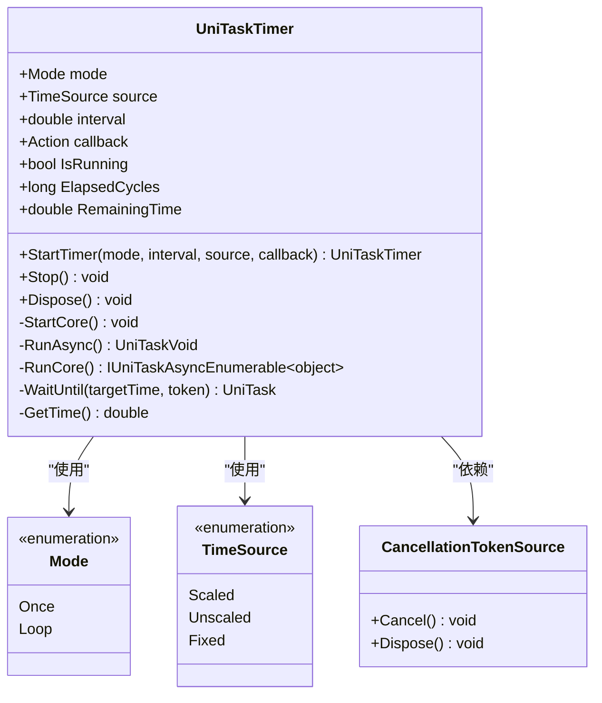
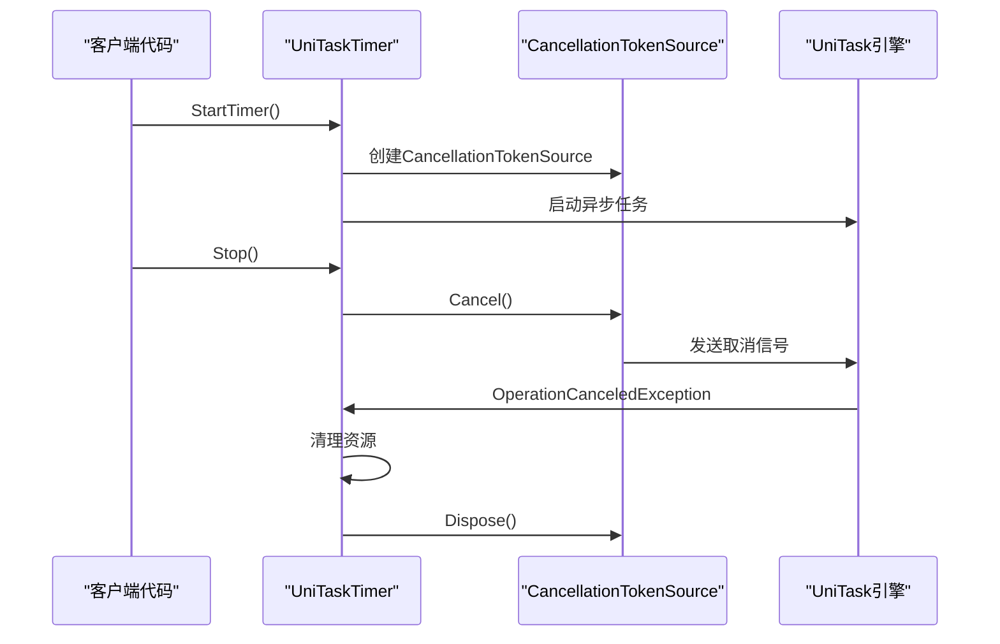

# 异步定时器UniTaskTimer

<cite>
**本文档中引用的文件**
- [UniTaskTimer.cs](file://Assets/Scripts/Tool/UniTaskTimer.cs)
- [BigSkillState.cs](file://Assets/Scripts/Controller/FSM/CharacterState/BigSkillState.cs)
- [WalkState.cs](file://Assets/Scripts/Controller/FSM/CharacterState/WalkState.cs)
</cite>

## 目录
1. [简介](#简介)
2. [核心架构](#核心架构)
3. [主要组件分析](#主要组件分析)
4. [详细API说明](#详细api说明)
5. [使用示例](#使用示例)
6. [与传统协程对比](#与传统协程对比)
7. [最佳实践](#最佳实践)
8. [故障排除指南](#故障排除指南)
9. [总结](#总结)

## 简介

UniTaskTimer是一个基于UniTask框架实现的高性能异步定时器组件，专为Unity游戏开发设计。它提供了零垃圾回收(GC)开销的定时任务调度功能，支持单次执行和循环执行两种模式，并提供了灵活的时间源选择和强大的取消机制。

### 核心特性

- **零GC开销**：全程使用UniTask实现，避免传统协程的内存分配
- **多种执行模式**：支持单次执行(Once)和循环执行(Loop)模式
- **灵活时间源**：支持缩放时间(Scaled)、非缩放时间(Unscaled)和固定更新(Fixed)三种时间源
- **强大取消机制**：集成CancellationToken防止内存泄漏
- **异常安全**：内置异常处理和资源自动释放机制

## 核心架构

UniTaskTimer采用基于异步枚举器的设计模式，通过UniTaskAsyncEnumerable实现高效的定时任务调度。



**图表来源**
- [UniTaskTimer.cs](file://Assets/Scripts/Tool/UniTaskTimer.cs#L13-L30)

**章节来源**
- [UniTaskTimer.cs](file://Assets/Scripts/Tool/UniTaskTimer.cs#L1-L189)

## 主要组件分析

### 定时器模式枚举

UniTaskTimer定义了两种执行模式，满足不同的业务需求：

| 模式 | 描述 | 使用场景 |
|------|------|----------|
| Once | 单次执行，在到达指定时间点后调用回调函数并自动停止 | 角色状态切换延迟、技能冷却结束通知 |
| Loop | 循环执行，每次到达时间点后重新开始计时 | 心跳检测、周期性数据刷新 |

### 时间源类型

系统提供三种时间源选项，适应不同的游戏逻辑需求：

| 时间源 | Unity对应属性 | 特点 | 应用场景 |
|--------|---------------|------|----------|
| Scaled | Time.time | 受时间缩放影响，受TimeScale控制 | 游戏内动作延迟、UI动画 |
| Unscaled | Time.unscaledTime | 不受时间缩放影响 | 冷却时间显示、计时器进度 |
| Fixed | Time.fixedTime | 固定时间步长，用于物理计算 | 物理相关定时任务、帧同步 |

### 取消机制设计



**图表来源**
- [UniTaskTimer.cs](file://Assets/Scripts/Tool/UniTaskTimer.cs#L88-L110)

**章节来源**
- [UniTaskTimer.cs](file://Assets/Scripts/Tool/UniTaskTimer.cs#L13-L30)

## 详细API说明

### StartTimer静态方法

这是创建和启动定时器的主要入口点，接受四个参数并返回已启动的定时器实例。

**方法签名**：
```csharp
public static UniTaskTimer StartTimer(
    Mode mode,
    double interval,
    TimeSource source = TimeSource.Scaled,
    Action callback = null
)
```

**参数说明**：

| 参数 | 类型 | 默认值 | 描述 |
|------|------|--------|------|
| mode | Mode | - | 定时器执行模式(Once或Loop) |
| interval | double | - | 延迟时间间隔(秒) |
| source | TimeSource | Scaled | 时间源类型 |
| callback | Action | null | 定时器到期时调用的回调函数 |

**返回值**：返回已启动的UniTaskTimer实例，可用于后续控制和查询。

### 核心属性

#### IsRunning属性
```csharp
public bool IsRunning => _core != null;
```
检查定时器当前是否正在运行。当定时器处于活动状态时返回true，否则返回false。

#### ElapsedCycles属性
```csharp
public long ElapsedCycles { get; private set; }
```
获取已经完成的周期数。在单次模式下，该值只能是0或1；在循环模式下，会随着每次回调递增。

#### RemainingTime属性
```csharp
public double RemainingTime
{
    get
    {
        if (!IsRunning) return 0;
        var interval = _interval;
        var elapsed = GetTime() - _startTime;
        return Math.Max(0, interval - elapsed);
    }
}
```
获取剩余等待时间(秒)。如果定时器未运行，则返回0。

### 控制方法

#### Stop方法
```csharp
public void Stop()
```
手动停止定时器，但保留当前配置以便重新启动。此方法不会释放资源，只是暂停定时器运行。

#### Dispose方法
```csharp
public void Dispose()
```
释放所有资源并停止定时器。这是IDisposable接口的实现，建议在对象生命周期结束时调用。

**章节来源**
- [UniTaskTimer.cs](file://Assets/Scripts/Tool/UniTaskTimer.cs#L42-L110)

## 使用示例

### 角色状态切换延迟

在游戏状态机中，经常需要在状态切换时添加延迟效果，例如大招释放后的状态恢复：

```csharp
// 大技能状态示例
public override void OnEnter()
{
    base.OnEnter();
    StateMachine._animator.Play("BigSkill");
    // 启动一次性定时器，在0.4秒后恢复状态锁定并切换到空闲状态
    UniTaskTimer.StartTimer(
        UniTaskTimer.Mode.Once,      // 单次执行
        0.4f,                        // 0.4秒延迟
        UniTaskTimer.TimeSource.Scaled, // 使用缩放时间
        () => {
            StateMachine.StateLocked = false;           // 解除状态锁定
            StateMachine.ChangeState<IdleState>();      // 切换到空闲状态
        }
    );
}
```

**代码来源**
- [BigSkillState.cs](file://Assets/Scripts/Controller/FSM/CharacterState/BigSkillState.cs#L5-L13)

### 技能冷却效果

在角色移动状态下，可以设置自动转换到奔跑状态的延迟：

```csharp
public override void OnEnter()
{
    StateMachine._animator.Play("Walk");
    InputSystem.Instance.OnMoveCanceled += OnMoveCanceled;
    
    // 设置4秒后自动转换到奔跑状态
    UniTaskTimer.StartTimer(
        UniTaskTimer.Mode.Once,
        4.0f,
        UniTaskTimer.TimeSource.Scaled,
        () => {
            StateMachine.ChangeState<RunState>();
        }
    );
}
```

**代码来源**
- [WalkState.cs](file://Assets/Scripts/Controller/FSM/CharacterState/WalkState.cs#L15-L22)

### 循环定时任务示例

```csharp
// 创建循环定时器，每秒检查玩家状态
var timer = UniTaskTimer.StartTimer(
    UniTaskTimer.Mode.Loop,      // 循环模式
    1.0f,                        // 1秒间隔
    UniTaskTimer.TimeSource.Unscaled, // 使用非缩放时间
    () => {
        if (PlayerHealth <= 0) {
            GameStateManager.GameOver();
        }
    }
);

// 在适当时候停止定时器
timer.Stop();
// 或者释放资源
timer.Dispose();
```

### 异常处理示例

```csharp
// 带异常处理的定时器
UniTaskTimer.StartTimer(
    UniTaskTimer.Mode.Once,
    2.0f,
    UniTaskTimer.TimeSource.Scaled,
    () => {
        try {
            // 可能抛出异常的代码
            PerformComplexCalculation();
        }
        catch (Exception ex) {
            Debug.LogError($"定时器回调执行失败: {ex.Message}");
            // 记录错误日志而不中断游戏
        }
    }
);
```

**章节来源**
- [BigSkillState.cs](file://Assets/Scripts/Controller/FSM/CharacterState/BigSkillState.cs#L1-L22)
- [WalkState.cs](file://Assets/Scripts/Controller/FSM/CharacterState/WalkState.cs#L1-L31)

## 与传统协程对比

### 性能优势对比

| 特性 | UniTaskTimer | 传统协程 |
|------|--------------|----------|
| 内存分配 | 零GC开销 | 每次创建新协程产生GC压力 |
| 执行效率 | 直接异步操作 | 需要调度器和状态机切换 |
| 取消机制 | 内置CancellationToken | 需要手动检查标志位 |
| 资源管理 | 自动资源清理 | 需要手动调用StopCoroutine |
| 异常处理 | 结构化异常处理 | try-catch嵌套复杂 |
| 调试难度 | 更直观的异步堆栈跟踪 | 协程调试困难 |

### 代码简洁性对比

**传统协程方式**：
```csharp
private IEnumerator DelayedAction(float delay, Action callback)
{
    yield return new WaitForSeconds(delay);
    callback?.Invoke();
}

// 调用时需要保存IEnumerator引用
private IEnumerator delayedCoroutine;
void StartDelayedAction()
{
    delayedCoroutine = DelayedAction(2.0f, () => {
        Debug.Log("延迟动作执行");
    });
    StartCoroutine(delayedCoroutine);
}

// 停止时需要额外处理
void StopDelayedAction()
{
    if (delayedCoroutine != null)
    {
        StopCoroutine(delayedCoroutine);
    }
}
```

**UniTaskTimer方式**：
```csharp
// 直接启动，无需保存引用
UniTaskTimer.StartTimer(
    UniTaskTimer.Mode.Once,
    2.0f,
    UniTaskTimer.TimeSource.Scaled,
    () => {
        Debug.Log("延迟动作执行");
    }
);

// 停止时直接调用
timer.Stop();
// 或释放资源
timer.Dispose();
```

### 错误处理对比

**传统协程错误处理**：
```csharp
private IEnumerator FaultyCoroutine()
{
    try
    {
        yield return new WaitForSeconds(1.0f);
        // 可能抛出异常的代码
        DangerousOperation();
    }
    catch (Exception ex)
    {
        // 需要手动记录日志
        Debug.LogError($"协程执行失败: {ex}");
    }
}
```

**UniTaskTimer错误处理**：
```csharp
UniTaskTimer.StartTimer(
    UniTaskTimer.Mode.Once,
    1.0f,
    UniTaskTimer.TimeSource.Scaled,
    () => {
        try
        {
            DangerousOperation();
        }
        catch (Exception ex)
        {
            // 自动捕获并记录异常
            Debug.LogException(ex);
        }
    }
);
```

## 最佳实践

### 资源管理最佳实践

1. **及时释放资源**
```csharp
// 在对象销毁时确保释放定时器资源
void OnDestroy()
{
    timer?.Dispose();
}
```

2. **避免内存泄漏**
```csharp
// 使用弱引用避免循环引用
WeakReference<GameObject> weakTarget = new WeakReference<GameObject>(target);
UniTaskTimer.StartTimer(
    UniTaskTimer.Mode.Once,
    1.0f,
    UniTaskTimer.TimeSource.Scaled,
    () => {
        if (weakTarget.TryGetTarget(out var targetObj))
        {
            // 安全访问目标对象
        }
    }
);
```

3. **批量管理定时器**
```csharp
public class TimerManager : IDisposable
{
    private readonly List<UniTaskTimer> timers = new List<UniTaskTimer>();
    
    public UniTaskTimer AddTimer(Action callback)
    {
        var timer = UniTaskTimer.StartTimer(
            UniTaskTimer.Mode.Once,
            1.0f,
            UniTaskTimer.TimeSource.Scaled,
            callback
        );
        timers.Add(timer);
        return timer;
    }
    
    public void Dispose()
    {
        foreach (var timer in timers)
        {
            timer?.Dispose();
        }
        timers.Clear();
    }
}
```

### 异常处理最佳实践

1. **结构化异常处理**
```csharp
UniTaskTimer.StartTimer(
    UniTaskTimer.Mode.Loop,
    0.5f,
    UniTaskTimer.TimeSource.Scaled,
    () => {
        try
        {
            // 执行可能失败的操作
            ProcessFrame();
        }
        catch (OperationCanceledException)
        {
            // 预期的取消异常，静默处理
        }
        catch (Exception ex)
        {
            // 记录意外异常
            Debug.LogError($"定时器帧处理失败: {ex}");
        }
    }
);
```

2. **超时保护**
```csharp
// 设置最大执行时间
UniTaskTimer.StartTimer(
    UniTaskTimer.Mode.Once,
    5.0f, // 5秒超时
    UniTaskTimer.TimeSource.Scaled,
    () => {
        // 如果操作超过5秒仍未完成，自动取消
        cancellationTokenSource.CancelAfter(TimeSpan.FromSeconds(5));
    }
);
```

### 性能优化最佳实践

1. **合理选择时间源**
```csharp
// 对于UI计时器，使用Unscaled时间
UniTaskTimer.StartTimer(
    UniTaskTimer.Mode.Loop,
    1.0f,
    UniTaskTimer.TimeSource.Unscaled, // UI计时不受暂停影响
    UpdateCooldownDisplay
);

// 对于游戏内动作，使用Scaled时间
UniTaskTimer.StartTimer(
    UniTaskTimer.Mode.Once,
    0.3f,
    UniTaskTimer.TimeSource.Scaled, // 受游戏暂停影响
    CompleteAction
);
```

2. **避免频繁创建定时器**
```csharp
// 推荐：复用定时器
public class ReusableTimer
{
    private UniTaskTimer timer;
    
    public void Restart(float interval, Action callback)
    {
        timer?.Stop(); // 重置现有定时器
        timer = UniTaskTimer.StartTimer(
            UniTaskTimer.Mode.Once,
            interval,
            UniTaskTimer.TimeSource.Scaled,
            callback
        );
    }
}
```

**章节来源**
- [UniTaskTimer.cs](file://Assets/Scripts/Tool/UniTaskTimer.cs#L137-L150)

## 故障排除指南

### 常见问题及解决方案

#### 1. 定时器不执行

**症状**：定时器启动后没有触发回调函数

**可能原因**：
- 时间间隔设置过小或过大
- 回调函数为空(null)
- 定时器被意外停止

**解决方案**：
```csharp
// 添加调试信息确认定时器状态
var timer = UniTaskTimer.StartTimer(
    UniTaskTimer.Mode.Once,
    1.0f,
    UniTaskTimer.TimeSource.Scaled,
    () => {
        Debug.Log("定时器回调执行");
    }
);

// 检查定时器状态
Debug.Log($"定时器运行状态: {timer.IsRunning}");
```

#### 2. 内存泄漏问题

**症状**：长时间运行后内存持续增长

**可能原因**：
- 定时器未正确释放
- 回调函数持有长期引用

**解决方案**：
```csharp
// 确保定时器在对象销毁时释放
public class TimerHolder : MonoBehaviour, IDisposable
{
    private UniTaskTimer timer;
    
    void OnDestroy()
    {
        Dispose();
    }
    
    public void Dispose()
    {
        timer?.Dispose();
        timer = null;
    }
}
```

#### 3. 异常处理不当

**症状**：定时器异常导致整个游戏崩溃

**解决方案**：
```csharp
UniTaskTimer.StartTimer(
    UniTaskTimer.Mode.Once,
    1.0f,
    UniTaskTimer.TimeSource.Scaled,
    () => {
        try
        {
            // 包装可能抛出异常的代码
            SafeOperation();
        }
        catch (Exception ex)
        {
            // 记录异常但不中断游戏
            Debug.LogException(ex);
        }
    }
);
```

#### 4. 时间精度问题

**症状**：定时器回调时间与预期不符

**解决方案**：
```csharp
// 使用Fixed时间源获得更精确的定时
UniTaskTimer.StartTimer(
    UniTaskTimer.Mode.Loop,
    0.02f, // 20ms间隔
    UniTaskTimer.TimeSource.Fixed, // 固定时间步长
    () => {
        // 物理相关操作
        PhysicsStep();
    }
);
```

### 调试技巧

1. **启用详细日志**
```csharp
public static class TimerDebug
{
    public static void LogTimerState(UniTaskTimer timer, string context)
    {
        Debug.Log($"{context}: "
            + $"IsRunning={timer.IsRunning}, "
            + $"ElapsedCycles={timer.ElapsedCycles}, "
            + $"RemainingTime={timer.RemainingTime:F3}s");
    }
}
```

2. **监控定时器生命周期**
```csharp
var timer = UniTaskTimer.StartTimer(
    UniTaskTimer.Mode.Once,
    1.0f,
    UniTaskTimer.TimeSource.Scaled,
    () => {
        Debug.Log("定时器回调开始");
        // 执行操作
        Debug.Log("定时器回调结束");
    }
);

// 定期检查状态
InvokeRepeating("CheckTimerStatus", 0f, 0.1f);

void CheckTimerStatus()
{
    TimerDebug.LogTimerState(timer, "状态检查");
}
```

**章节来源**
- [UniTaskTimer.cs](file://Assets/Scripts/Tool/UniTaskTimer.cs#L137-L150)

## 总结

UniTaskTimer是一个功能强大且高效的异步定时器解决方案，特别适合Unity游戏开发中的各种定时任务需求。其主要优势包括：

### 核心优势

1. **性能卓越**：零GC开销，相比传统协程具有显著的性能优势
2. **易于使用**：简洁的API设计，只需一行代码即可启动定时器
3. **功能完整**：支持多种执行模式、时间源和取消机制
4. **异常安全**：内置异常处理和资源自动管理
5. **灵活配置**：可根据不同场景选择合适的时间源和执行模式

### 适用场景

- **游戏状态管理**：角色状态切换延迟、技能冷却效果
- **UI交互**：按钮防抖、界面淡入淡出
- **数据同步**：定期数据刷新、心跳检测
- **动画控制**：动画序列播放、特效延迟触发

### 开发建议

1. **优先使用UniTaskTimer替代传统协程**，特别是在需要频繁创建和销毁定时器的场景
2. **根据具体需求选择合适的时间源**，平衡时间精度和游戏体验
3. **始终正确管理定时器生命周期**，避免内存泄漏
4. **在回调函数中添加适当的异常处理**，确保系统的稳定性

通过合理使用UniTaskTimer，开发者可以构建更加高效、稳定和可维护的游戏系统，同时享受现代异步编程带来的便利和性能提升。