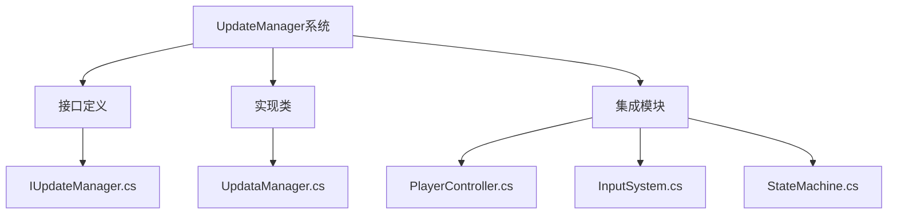
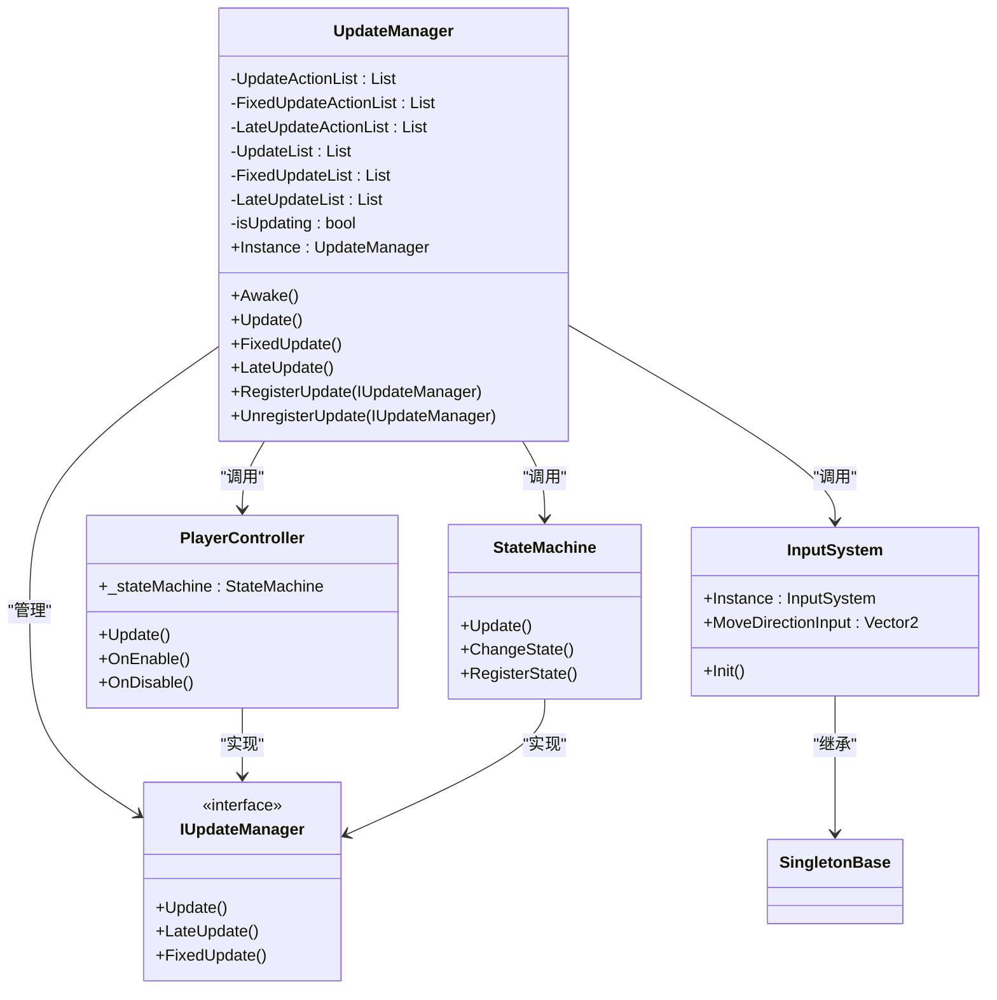
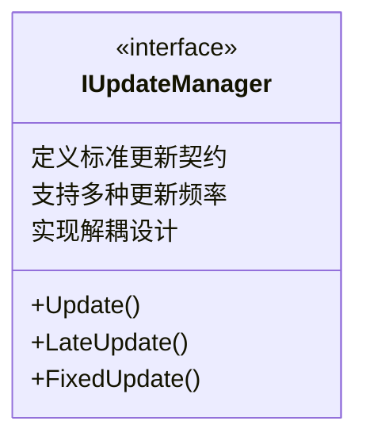
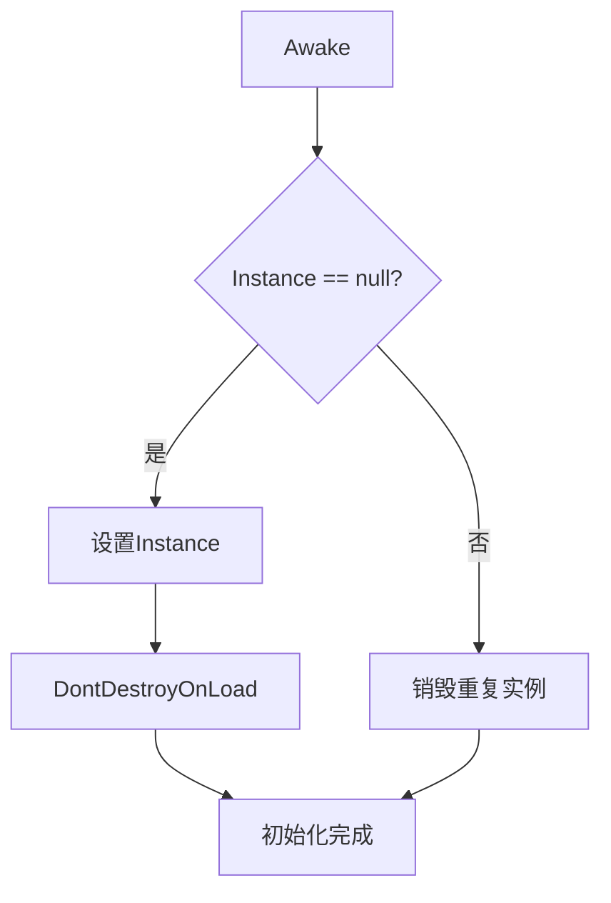
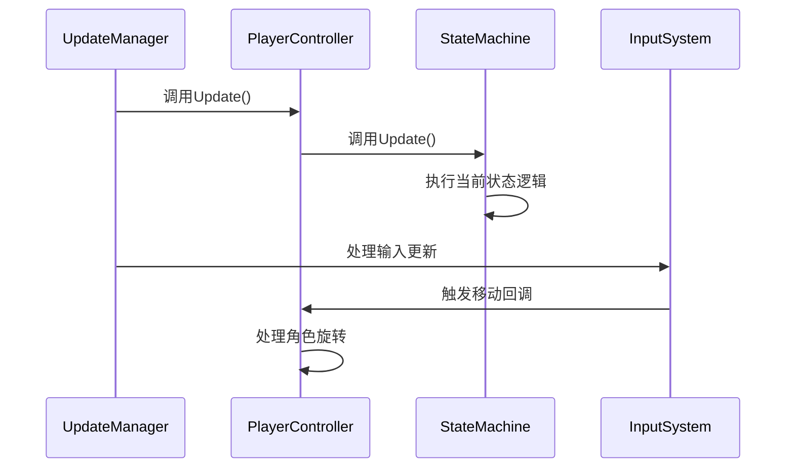
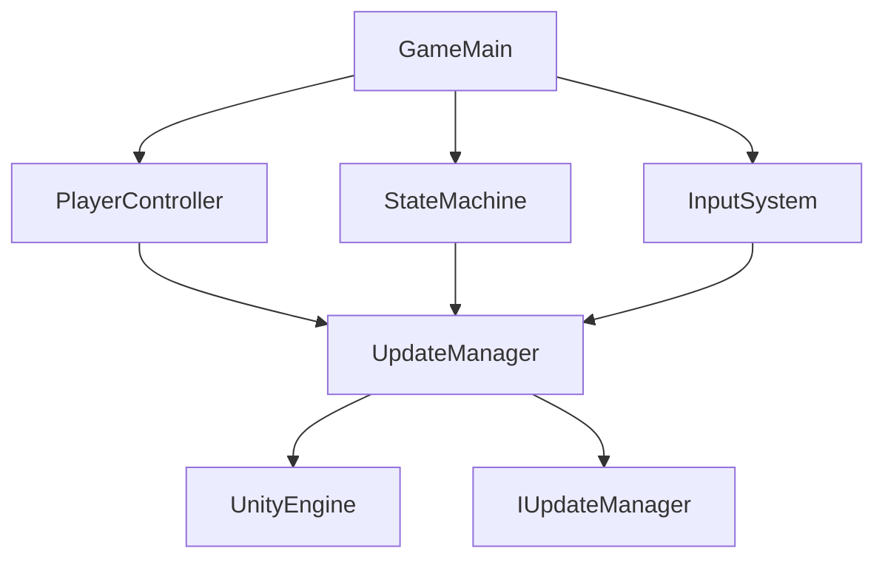

# 更新管理器

<cite>
**本文档中引用的文件**  
- [IUpdateManager.cs](file://Assets/Scripts/Tool/UpdateManager/IUpdateManager.cs)
- [UpdataManager.cs](file://Assets/Scripts/Tool/UpdateManager/UpdataManager.cs)
- [PlayerController.cs](file://Assets/Scripts/Controller/PlayerController.cs)
- [InputSystem.cs](file://Assets/Scripts/Manager/InputSystem/InputSystem.cs)
- [StateMachine.cs](file://Assets/Scripts/Controller/FSM/StateMachine.cs)
- [GameMain.cs](file://Assets/Scripts/Manager/GameMain.cs)
- [Singleton.cs](file://Assets/Scripts/Tool/Singleton.cs)
</cite>

## 目录
1. [简介](#简介)
2. [项目结构](#项目结构)
3. [核心组件](#核心组件)
4. [架构概述](#架构概述)
5. [详细组件分析](#详细组件分析)
6. [依赖分析](#依赖分析)
7. [性能考虑](#性能考虑)
8. [故障排除指南](#故障排除指南)
9. [结论](#结论)

## 简介
本文档详细说明了UpdateManager系统如何集中管理所有需要Update和FixedUpdate回调的组件。文档描述了IUpdateManager接口定义的Update()和LateUpdate()方法及其调用契约，解释了UpdateManager单例如何维护两个列表并按帧调用注册对象的方法。分析了该设计如何减少MonoBehaviour的数量从而提升性能，并提供了组件注册与注销的完整流程示例，强调在OnEnable/OnDisable中正确管理生命周期的重要性。同时讨论了其在PlayerController、InputSystem等模块中的集成方式，并指出了潜在的性能瓶颈及优化建议。

## 项目结构
UpdateManager系统位于项目的工具模块中，作为全局单例管理所有需要更新回调的组件。该系统通过接口定义标准更新契约，并通过中心化管理器实现高效的更新调度。

**Diagram sources**
- [IUpdateManager.cs](file://Assets/Scripts/Tool/UpdateManager/IUpdateManager.cs#L1-L6)
- [UpdataManager.cs](file://Assets/Scripts/Tool/UpdateManager/UpdataManager.cs#L1-L34)
- [PlayerController.cs](file://Assets/Scripts/Controller/PlayerController.cs#L1-L103)

**Section sources**
- [UpdataManager.cs](file://Assets/Scripts/Tool/UpdateManager/UpdataManager.cs#L1-L34)
- [IUpdateManager.cs](file://Assets/Scripts/Tool/UpdateManager/IUpdateManager.cs#L1-L6)

## 核心组件
UpdateManager系统由两个核心组件构成：IUpdateManager接口定义了标准更新契约，UpdateManager单例实现了中心化的更新调度。该系统通过维护多个更新列表，实现了对不同更新类型（Update、FixedUpdate、LateUpdate）的分类管理。

**Section sources**
- [IUpdateManager.cs](file://Assets/Scripts/Tool/UpdateManager/IUpdateManager.cs#L1-L6)
- [UpdataManager.cs](file://Assets/Scripts/Tool/UpdateManager/UpdataManager.cs#L1-L34)

## 架构概述
UpdateManager系统采用中心化架构，通过单例模式确保全局唯一实例。系统定义了IUpdateManager接口作为所有可更新组件的标准契约，允许各种游戏组件实现该接口并注册到全局更新管理器中。

**Diagram sources**
- [IUpdateManager.cs](file://Assets/Scripts/Tool/UpdateManager/IUpdateManager.cs#L1-L6)
- [UpdataManager.cs](file://Assets/Scripts/Tool/UpdateManager/UpdataManager.cs#L1-L34)
- [PlayerController.cs](file://Assets/Scripts/Controller/PlayerController.cs#L1-L103)
- [InputSystem.cs](file://Assets/Scripts/Manager/InputSystem/InputSystem.cs#L1-L94)
- [StateMachine.cs](file://Assets/Scripts/Controller/FSM/StateMachine.cs#L1-L115)

## 详细组件分析

### IUpdateManager接口分析
IUpdateManager接口定义了所有可更新组件必须实现的标准方法契约，包括Update、LateUpdate和FixedUpdate三个方法。这种设计模式允许UpdateManager统一管理各种不同类型的可更新组件。

**Diagram sources**
- [IUpdateManager.cs](file://Assets/Scripts/Tool/UpdateManager/IUpdateManager.cs#L1-L6)

**Section sources**
- [IUpdateManager.cs](file://Assets/Scripts/Tool/UpdateManager/IUpdateManager.cs#L1-L6)

### UpdateManager单例分析
UpdateManager作为MonoBehaviour的单例实现，通过Awake方法确保全局唯一实例，并使用DontDestroyOnLoad保证跨场景持久化。该管理器维护了六个独立的列表，分别用于存储Action委托和IUpdateManager接口实现。

**Diagram sources**
- [UpdataManager.cs](file://Assets/Scripts/Tool/UpdateManager/UpdataManager.cs#L15-L30)

**Section sources**
- [UpdataManager.cs](file://Assets/Scripts/Tool/UpdateManager/UpdataManager.cs#L1-L34)

### 组件集成分析
UpdateManager系统与PlayerController、InputSystem和StateMachine等核心模块紧密集成。PlayerController通过状态机模式管理角色行为，而StateMachine实现了IUpdateManager接口，使其能够被UpdateManager统一调度。

**Diagram sources**
- [PlayerController.cs](file://Assets/Scripts/Controller/PlayerController.cs#L70-L75)
- [StateMachine.cs](file://Assets/Scripts/Controller/FSM/StateMachine.cs#L90-L95)
- [InputSystem.cs](file://Assets/Scripts/Manager/InputSystem/InputSystem.cs#L50-L60)

**Section sources**
- [PlayerController.cs](file://Assets/Scripts/Controller/PlayerController.cs#L1-L103)
- [StateMachine.cs](file://Assets/Scripts/Controller/FSM/StateMachine.cs#L1-L115)
- [InputSystem.cs](file://Assets/Scripts/Manager/InputSystem/InputSystem.cs#L1-L94)

## 依赖分析
UpdateManager系统依赖于Unity的MonoBehaviour生命周期，并通过接口实现与其他系统的松耦合。该系统本身被多个游戏模块所依赖，形成了中心化的更新调度架构。

**Diagram sources**
- [UpdataManager.cs](file://Assets/Scripts/Tool/UpdateManager/UpdataManager.cs#L3-L4)
- [IUpdateManager.cs](file://Assets/Scripts/Tool/UpdateManager/IUpdateManager.cs#L1-L6)
- [GameMain.cs](file://Assets/Scripts/Manager/GameMain.cs#L1-L74)

**Section sources**
- [UpdataManager.cs](file://Assets/Scripts/Tool/UpdateManager/UpdataManager.cs#L1-L34)
- [GameMain.cs](file://Assets/Scripts/Manager/GameMain.cs#L1-L74)

## 性能考虑
UpdateManager系统通过减少MonoBehaviour组件数量来提升性能。传统的Unity开发中，每个需要更新逻辑的组件都需要作为一个独立的MonoBehaviour挂载在GameObject上，这会增加引擎的更新开销。通过集中管理更新回调，该系统显著减少了MonoBehaviour实例的数量。

然而，该设计也存在潜在的性能瓶颈：
1. **列表遍历开销**：每次Update调用都需要遍历所有注册的Action和IUpdateManager实例
2. **内存分配**：频繁的注册和注销操作可能导致内存碎片
3. **单例竞争**：多线程环境下可能产生竞争条件

优化建议：
- 使用对象池管理注册的更新对象
- 实现分层更新机制，按优先级调度
- 添加更新频率控制，避免不必要的调用
- 使用更高效的数据结构（如数组替代列表）存储更新对象

## 故障排除指南
在使用UpdateManager系统时，可能遇到以下常见问题：

1. **重复实例问题**：确保Awake方法中的单例检查逻辑正确执行
2. **内存泄漏**：确保在OnDisable或销毁时正确注销所有更新回调
3. **更新顺序问题**：不同模块的更新顺序可能影响游戏逻辑
4. **跨场景持久化问题**：确认DontDestroyOnLoad正确应用

关键生命周期管理：
- 在OnEnable中注册更新回调
- 在OnDisable中注销更新回调
- 在销毁前清理所有引用
- 避免在Update中进行耗时操作

**Section sources**
- [UpdataManager.cs](file://Assets/Scripts/Tool/UpdateManager/UpdataManager.cs#L15-L30)
- [PlayerController.cs](file://Assets/Scripts/Controller/PlayerController.cs#L85-L95)

## 结论
UpdateManager系统通过中心化管理所有更新回调，有效减少了MonoBehaviour组件的数量，从而提升了游戏性能。该系统采用清晰的接口定义和单例模式，实现了模块间的解耦和高效的更新调度。通过与PlayerController、InputSystem和StateMachine等核心模块的集成，该系统为游戏提供了稳定可靠的更新框架。建议在使用时注意生命周期管理，避免内存泄漏，并根据具体需求进行性能优化。