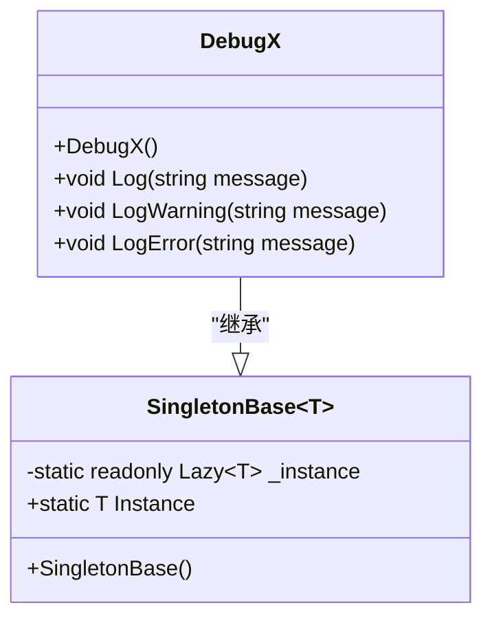
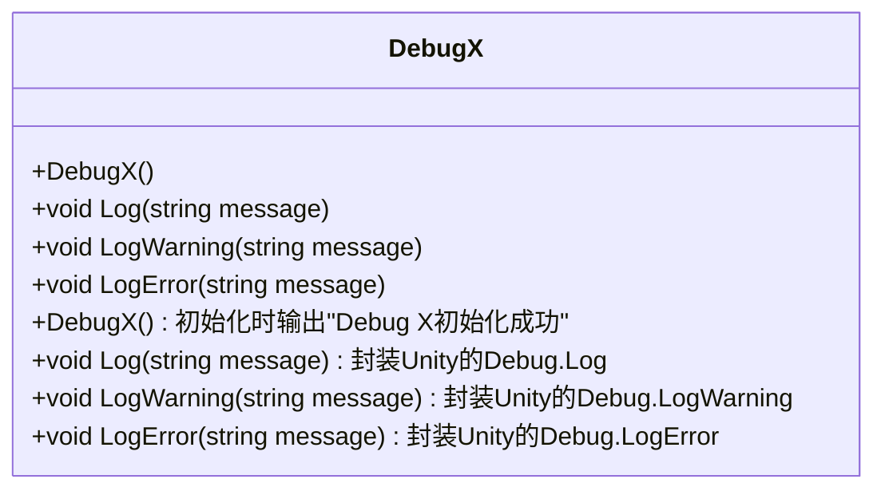
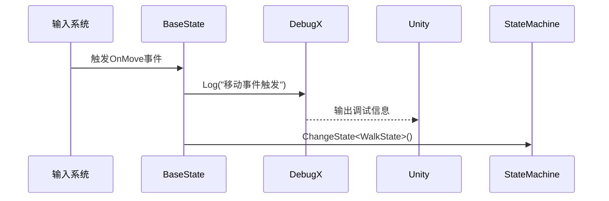
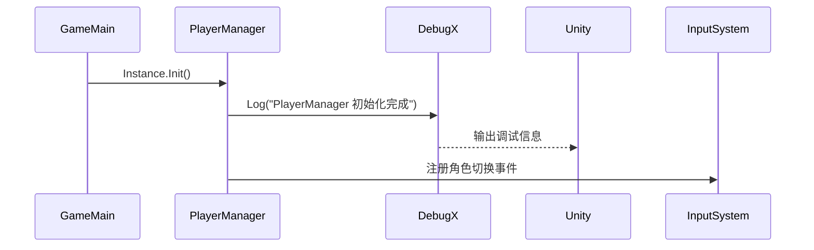

# 调试工具DebugX

<cite>
**本文档引用文件**   
- [DebugX.cs](file://Assets/Scripts/Tool/DebugX.cs)
- [Singleton.cs](file://Assets/Scripts/Tool/Singleton.cs)
- [BaseState.cs](file://Assets/Scripts/Controller/FSM/BaseState.cs)
- [PlayerController.cs](file://Assets/Scripts/Controller/PlayerController.cs)
- [GameMain.cs](file://Assets/Scripts/Manager/GameMain.cs)
- [PlayerManager.cs](file://Assets/Scripts/Manager/PlayerManager/PlayerManager.cs)
- [CompilerDefine.cs](file://Assets/Plugins/Infinity Code/Ultimate Editor Enhancer/Scripts/Editor/Core/CompilerDefine.cs)
</cite>

## 目录
1. [简介](#简介)
2. [核心组件](#核心组件)
3. [架构概述](#架构概述)
4. [详细组件分析](#详细组件分析)
5. [依赖分析](#依赖分析)
6. [性能考虑](#性能考虑)
7. [故障排除指南](#故障排除指南)
8. [结论](#结论)

## 简介
DebugX类是Unity原生Debug类的封装层，提供统一的日志接口。该工具类通过单例模式确保全局唯一实例，为开发者提供了一套简洁、一致的调试日志系统。DebugX封装了Unity的标准日志功能，包括Log、LogWarning和LogError等方法，使得在项目中进行调试信息输出更加方便和规范。

## 核心组件

DebugX类作为调试工具的核心，提供了统一的日志接口。它继承自SingletonBase<T>泛型基类，确保了全局唯一实例。该类封装了Unity的Debug类，提供了Log、LogWarning和LogError等静态方法，使得开发者可以方便地输出调试信息。

**Section sources**
- [DebugX.cs](file://Assets/Scripts/Tool/DebugX.cs#L2-L23)
- [Singleton.cs](file://Assets/Scripts/Tool/Singleton.cs#L10-L23)

## 架构概述

DebugX类的架构基于单例模式，确保在整个应用程序生命周期中只有一个实例存在。这种设计模式特别适用于全局管理器类，如调试工具、输入系统和玩家管理器等。通过继承SingletonBase<T>泛型基类，DebugX获得了线程安全的延迟初始化能力。



**Diagram sources **
- [DebugX.cs](file://Assets/Scripts/Tool/DebugX.cs#L2-L23)
- [Singleton.cs](file://Assets/Scripts/Tool/Singleton.cs#L10-L23)

## 详细组件分析

### DebugX类分析

DebugX类作为Unity原生Debug类的封装层，提供了统一的日志接口。它通过继承SingletonBase<T>泛型基类实现了单例模式，确保了全局唯一实例。

#### 类结构分析


**Diagram sources **
- [DebugX.cs](file://Assets/Scripts/Tool/DebugX.cs#L2-L23)

#### 静态方法实现机制
DebugX类提供了三个主要的静态方法：Log、LogWarning和LogError。这些方法直接调用Unity的相应Debug方法，实现了对原生调试功能的封装。

- **Log方法**：用于输出普通调试信息，参数为字符串消息
- **LogWarning方法**：用于输出警告信息，参数为字符串消息
- **LogError方法**：用于输出错误信息，参数为字符串消息

这些方法的实现机制非常简单直接，主要是为了提供一个统一的接口，使得在项目中使用日志功能时更加一致和方便。

**Section sources**
- [DebugX.cs](file://Assets/Scripts/Tool/DebugX.cs#L10-L23)

### 实际应用场景分析

DebugX在项目中的实际应用场景广泛，特别是在状态机和玩家控制器中被频繁使用。

#### 状态机中的应用
在BaseState类中，DebugX被用于输出各种状态转换的调试信息。例如，当触发移动事件时，会输出"移动事件触发"的日志信息。



**Diagram sources **
- [BaseState.cs](file://Assets/Scripts/Controller/FSM/BaseState.cs#L43)
- [DebugX.cs](file://Assets/Scripts/Tool/DebugX.cs#L10-L13)

#### 玩家管理器中的应用
在PlayerManager类中，DebugX被用于输出初始化完成的信息。当PlayerManager初始化时，会输出"PlayerManager 初始化完成"的日志信息。



**Diagram sources **
- [PlayerManager.cs](file://Assets/Scripts/Manager/PlayerManager/PlayerManager.cs#L25)
- [GameMain.cs](file://Assets/Scripts/Manager/GameMain.cs#L36)

## 依赖分析

DebugX类的依赖关系相对简单，主要依赖于Unity的UnityEngine命名空间和SingletonBase泛型基类。

```mermaid
graph TD
DebugX --> UnityEngine : "使用Debug类"
DebugX --> SingletonBase : "继承单例基类"
SingletonBase --> System : "使用Lazy<T>和Activator"
```

**Diagram sources **
- [DebugX.cs](file://Assets/Scripts/Tool/DebugX.cs#L2-L23)
- [Singleton.cs](file://Assets/Scripts/Tool/Singleton.cs#L10-L23)

## 性能考虑

虽然当前的DebugX实现中没有直接使用条件编译指令来控制日志输出，但项目中存在类似的性能优化实践。通过条件编译指令（如FULLSCREEN_DEBUG），可以在不同构建版本中控制调试信息的输出，从而优化运行时性能。

在实际项目中，可以考虑为DebugX添加类似的条件编译机制，例如使用ENABLE_LOG宏来控制日志输出。这样在发布版本中可以完全移除日志输出代码，避免对性能造成影响。

此外，DebugX的单例模式实现使用了Lazy<T>和线程安全的初始化，确保了在多线程环境下的安全性和性能。

**Section sources**
- [Logger.cs](file://Packages/com.mibdev.fullscreen-editor/Editor/Logger.cs#L8-L11)
- [CompilerDefine.cs](file://Assets/Plugins/Infinity Code/Ultimate Editor Enhancer/Scripts/Editor/Core/CompilerDefine.cs#L10-L78)

## 故障排除指南

在使用DebugX时可能会遇到一些常见问题，以下是一些故障排除建议：

1. **日志不输出**：检查是否在正确的构建设置下运行，某些条件编译指令可能会禁用日志输出
2. **单例初始化失败**：确保DebugX的构造函数没有被外部调用，只能通过Instance属性访问
3. **性能问题**：在发布版本中考虑使用条件编译指令禁用不必要的日志输出
4. **线程安全问题**：DebugX的单例实现已经是线程安全的，但在多线程环境中使用时仍需注意

**Section sources**
- [DebugX.cs](file://Assets/Scripts/Tool/DebugX.cs#L2-L23)
- [Singleton.cs](file://Assets/Scripts/Tool/Singleton.cs#L10-L23)

## 结论

DebugX类作为Unity原生Debug类的封装层，提供了一个统一、简洁的日志接口。通过单例模式确保了全局唯一实例，使得在项目中使用调试功能更加方便和一致。该类在状态机、玩家控制器和管理器等组件中被广泛应用，为开发者提供了重要的调试支持。

虽然当前实现相对简单，但已经满足了基本的调试需求。未来可以考虑添加更多功能，如条件编译支持、日志级别控制、自定义颜色输出等，以进一步提升调试体验和性能。