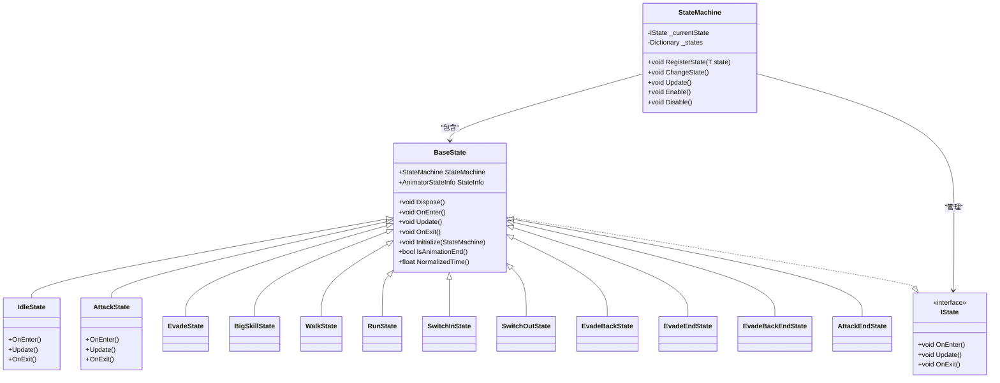
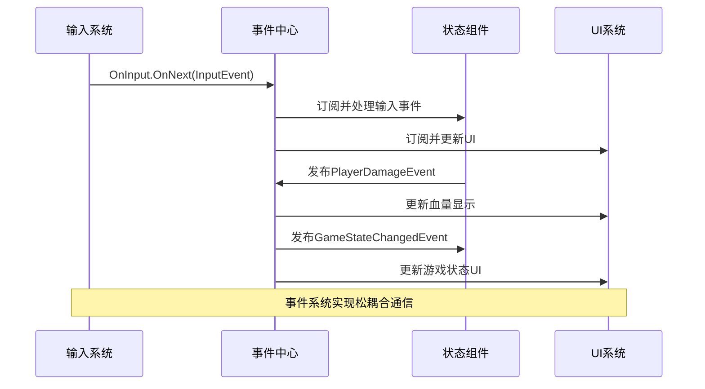
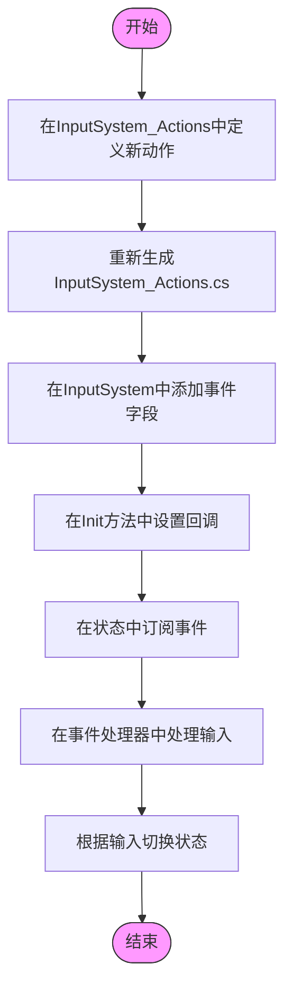
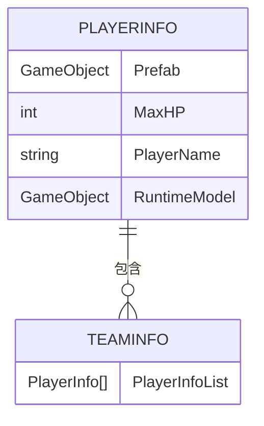

# 扩展与集成指南

<cite>
**本文档中引用的文件**  
- [BaseState.cs](file://Assets/Scripts/Controller/FSM/BaseState.cs)
- [StateMachine.cs](file://Assets/Scripts/Controller/FSM/StateMachine.cs)
- [PlayerController.cs](file://Assets/Scripts/Controller/PlayerController.cs)
- [GameEvents.cs](file://Assets/Scripts/Manager/EventSystem/GameEvents.cs)
- [GameEvent.cs](file://Assets/Scripts/Manager/EventSystem/GameEvent.cs)
- [EventBus.cs](file://Assets/Scripts/Manager/EventSystem/EventBus.cs)
- [InputSystem.cs](file://Assets/Scripts/Manager/InputSystem/InputSystem.cs)
- [InputSystem_Actions.cs](file://Assets/InputSystem_Actions.cs)
- [PlayerInfo.cs](file://Assets/Scripts/Data/SOBase/PlayerInfo.cs)
- [TeamInfo.cs](file://Assets/Scripts/Data/SOBase/TeamInfo.cs)
</cite>

## 目录
1. [简介](#简介)
2. [状态系统扩展](#状态系统扩展)
3. [事件系统扩展](#事件系统扩展)
4. [输入系统扩展](#输入系统扩展)
5. [数据配置与ScriptableObject](#数据配置与scriptableobject)
6. [最佳实践与常见陷阱](#最佳实践与常见陷阱)

## 简介
本指南详细介绍了如何在现有Unity项目中进行系统扩展与集成。项目采用状态机模式管理角色行为，通过事件系统实现组件间通信，并使用ScriptableObject进行数据配置。本文档将指导开发者如何添加新状态、新事件、新输入以及如何通过ScriptableObject配置游戏数据，同时提供与现有系统集成的最佳实践。

## 状态系统扩展

### 添加新状态的完整步骤
在本项目中，状态系统基于有限状态机（FSM）模式实现，所有状态继承自`BaseState`类。添加新状态需要遵循以下步骤：

1. **创建继承自BaseState的新类**：新状态类应继承`BaseState`，并实现生命周期方法
2. **实现生命周期方法**：重写`OnEnter()`、`Update()`和`OnExit()`方法
3. **在PlayerController中注册**：在`PlayerController.Awake()`方法中通过`StateMachine.RegisterState()`注册新状态
4. **处理状态切换逻辑**：在适当的状态中添加状态切换的触发条件

**图示来源**  
- [BaseState.cs](file://Assets/Scripts/Controller/FSM/BaseState.cs#L1-L84)
- [StateMachine.cs](file://Assets/Scripts/Controller/FSM/StateMachine.cs#L1-L114)
- [PlayerController.cs](file://Assets/Scripts/Controller/PlayerController.cs#L1-L93)

**本节来源**  
- [BaseState.cs](file://Assets/Scripts/Controller/FSM/BaseState.cs#L1-L84)
- [StateMachine.cs](file://Assets/Scripts/Controller/FSM/StateMachine.cs#L1-L114)
- [PlayerController.cs](file://Assets/Scripts/Controller/PlayerController.cs#L1-L93)

## 事件系统扩展

### 添加新事件的流程
项目使用两种事件系统：基于R3库的`Subject`和基于自定义泛型的`GameEvent<T>`。添加新事件的步骤如下：

1. **在GameEvents中定义新Subject**：在`GameEvents`静态类中添加新的`Subject<T>`字段
2. **创建事件数据结构**：使用`record struct`定义事件携带的数据
3. **在适当位置发布事件**：在需要触发事件的地方调用`OnNext()`方法
4. **在订阅者中处理事件**：通过`Subscribe()`方法注册事件处理器

**图示来源**  
- [GameEvents.cs](file://Assets/Scripts/Manager/EventSystem/GameEvents.cs#L1-L23)
- [GameEvent.cs](file://Assets/Scripts/Manager/EventSystem/GameEvent.cs#L1-L20)
- [EventBus.cs](file://Assets/Scripts/Manager/EventSystem/EventBus.cs#L1-L15)

**本节来源**  
- [GameEvents.cs](file://Assets/Scripts/Manager/EventSystem/GameEvents.cs#L1-L23)
- [EventLists.cs](file://Assets/Scripts/Manager/EventSystem/EventLists.cs#L1-L84)

## 输入系统扩展

### 添加新输入的流程
项目使用Unity的Input System包处理输入，扩展新输入需要以下步骤：

1. **在InputActions中配置新动作**：在`InputSystem_Actions.inputactions`资源中添加新的Input Action
2. **在InputSystem中定义事件**：在`InputSystem`类中添加相应的事件字段
3. **在Init方法中设置回调**：将Input Action的回调连接到自定义事件
4. **在状态机中处理输入**：在状态的`OnEnter()`方法中订阅输入事件，在`OnExit()`中取消订阅

**图示来源**  
- [InputSystem.cs](file://Assets/Scripts/Manager/InputSystem/InputSystem.cs#L1-L93)
- [InputSystem_Actions.cs](file://Assets/InputSystem_Actions.cs#L1-L799)

**本节来源**  
- [InputSystem.cs](file://Assets/Scripts/Manager/InputSystem/InputSystem.cs#L1-L93)
- [InputSystem_Actions.cs](file://Assets/InputSystem_Actions.cs#L1-L799)

## 数据配置与ScriptableObject

### 通过ScriptableObject配置数据
项目使用ScriptableObject进行游戏数据配置，这是一种高效的数据管理方式。主要数据类型包括：

- **PlayerInfo**：存储玩家角色的基本信息，如最大生命值、角色名称和预制体引用
- **TeamInfo**：管理队伍信息，包含多个PlayerInfo的引用

**图示来源**  
- [PlayerInfo.cs](file://Assets/Scripts/Data/SOBase/PlayerInfo.cs#L1-L11)
- [TeamInfo.cs](file://Assets/Scripts/Data/SOBase/TeamInfo.cs#L1-L9)

**本节来源**  
- [PlayerInfo.cs](file://Assets/Scripts/Data/SOBase/PlayerInfo.cs#L1-L11)
- [TeamInfo.cs](file://Assets/Scripts/Data/SOBase/TeamInfo.cs#L1-L9)

## 最佳实践与常见陷阱

### 与现有系统集成的最佳实践
1. **状态管理**：确保在`OnExit()`方法中取消所有事件订阅，避免内存泄漏
2. **事件处理**：使用`Subject`进行高频事件（如输入），使用`GameEvent<T>`进行低频重要事件
3. **输入系统**：避免在Update中直接读取输入，应使用事件驱动模式
4. **数据配置**：将运行时数据与配置数据分离，避免在ScriptableObject中存储运行时状态

### 常见陷阱
1. **事件订阅泄漏**：忘记在`OnExit()`中取消订阅会导致多个状态同时响应事件
2. **状态机锁定**：在状态切换过程中修改`StateLocked`标志可能导致意外行为
3. **输入冲突**：多个状态同时订阅同一输入事件会导致重复处理
4. **资源引用**：确保ScriptableObject中的预制体引用正确，避免运行时NullReferenceException

**本节来源**  
- [BaseState.cs](file://Assets/Scripts/Controller/FSM/BaseState.cs#L1-L84)
- [PlayerController.cs](file://Assets/Scripts/Controller/PlayerController.cs#L1-L93)
- [InputSystem.cs](file://Assets/Scripts/Manager/InputSystem/InputSystem.cs#L1-L93)