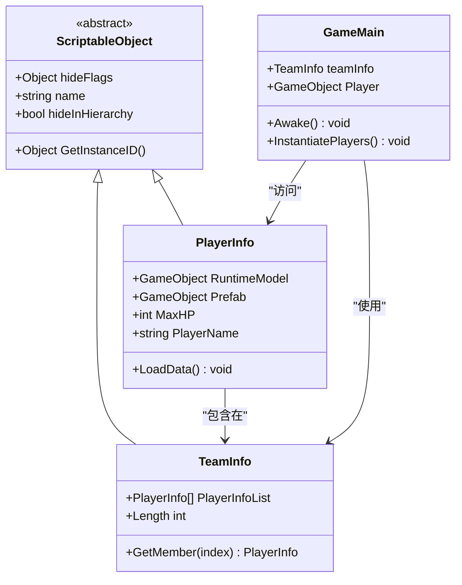
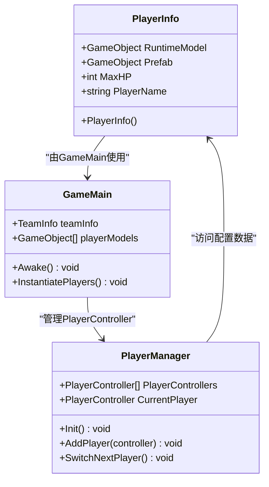
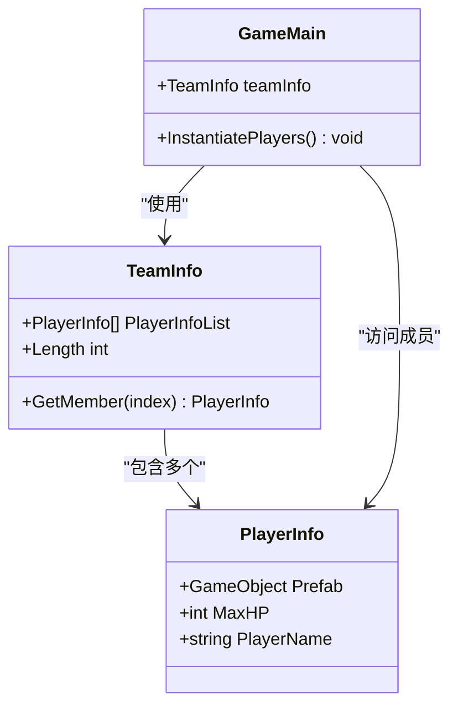

# 数据配置

<cite>
**本文档中引用的文件**
- [PlayerInfo.cs](file://Assets/Scripts/Data/SOBase/PlayerInfo.cs)
- [TeamInfo.cs](file://Assets/Scripts/Data/SOBase/TeamInfo.cs)
- [GameMain.cs](file://Assets/Scripts/Manager/GameMain.cs)
- [PlayerManager.cs](file://Assets/Scripts/Manager/PlayerManager/PlayerManager.cs)
- [Singleton.cs](file://Assets/Scripts/Tool/Singleton.cs)
- [NewScriptableObject.cs.txt](file://Assets/Plugins/Infinity Code/Ultimate Editor Enhancer/LocalResources/ScriptTemplates/C# ScriptableObject-NewScriptableObject.cs.txt)
- [ProjectAssetCache.cs](file://Assets/Plugins/Infinity Code/Ultimate Editor Enhancer/Scripts/Editor/Helpers/ProjectAssetCache.cs)
</cite>

## 目录
1. [简介](#简介)
2. [ScriptableObject概述](#scriptableobject概述)
3. [创建ScriptableObject数据类](#创建scriptableobject数据类)
4. [现有数据类分析](#现有数据类分析)
5. [数据资产管理](#数据资产管理)
6. [运行时加载与使用](#运行时加载与使用)
7. [最佳实践](#最佳实践)
8. [Ultimate Editor Enhancer集成](#ultimate-editor-enhancer集成)
9. [故障排除](#故障排除)
10. [总结](#总结)

## 简介

ScriptableObject是Unity中一种强大的数据容器机制，特别适用于游戏开发中的配置数据管理。它允许开发者在编辑器中直接创建和编辑数据资产，支持资源复用，并且可以跨场景持久化。本指南将详细介绍如何使用ScriptableObject进行游戏数据配置，包括创建、管理和最佳实践。

## ScriptableObject概述

### 核心优势

ScriptableObject相比普通C#类具有以下核心优势：

1. **可序列化性**：Unity自动序列化ScriptableObject中的所有公共字段
2. **编辑器集成**：支持在Unity编辑器中直接编辑和可视化
3. **资源复用**：可以在多个地方引用同一个ScriptableObject实例
4. **持久化存储**：数据可以保存为独立的资源文件
5. **类型安全**：编译时类型检查确保数据完整性

### 基本架构



**图表来源**
- [PlayerInfo.cs](file://Assets/Scripts/Data/SOBase/PlayerInfo.cs#L1-L12)
- [TeamInfo.cs](file://Assets/Scripts/Data/SOBase/TeamInfo.cs#L1-L10)
- [GameMain.cs](file://Assets/Scripts/Manager/GameMain.cs#L1-L74)

## 创建ScriptableObject数据类

### 基本步骤

创建新的ScriptableObject数据类需要以下步骤：

#### 1. 继承ScriptableObject

```csharp
// 基本结构示例
public class CustomData : ScriptableObject
{
    // 数据字段定义
}
```

#### 2. 添加[CreateAssetMenu]属性

```csharp
[CreateAssetMenu(menuName = "Game/CustomData", fileName = "NewCustomData")]
public class CustomData : ScriptableObject
{
    // 菜单名称：Game/CustomData
    // 默认文件名：NewCustomData
}
```

#### 3. 定义数据字段

根据业务需求定义合适的数据字段，利用Unity的序列化系统：

```csharp
[CreateAssetMenu(menuName = "Game/PlayerConfig")]
public class PlayerConfig : ScriptableObject
{
    [Header("基础属性")]
    public string CharacterName;
    public int MaxHealth;
    public float MoveSpeed;
    
    [Header("战斗属性")]
    public int AttackDamage;
    public float AttackRange;
    public float AttackCooldown;
    
    [Header("视觉效果")]
    public GameObject ModelPrefab;
    public Color SkinColor;
    
    [Header("音效配置")]
    public AudioClip FootstepSound;
    public AudioClip AttackSound;
}
```

### 字段组织技巧

使用Unity的属性特性来组织和美化编辑器界面：

```csharp
[CreateAssetMenu(menuName = "Game/LevelData")]
public class LevelData : ScriptableObject
{
    [Header("关卡基本信息")]
    public string LevelName;
    public int LevelIndex;
    public Sprite BackgroundImage;
    
    [Header("难度设置")]
    [Range(1, 10)] public int Difficulty;
    [Tooltip("敌人出现间隔时间")] public float SpawnInterval;
    
    [Header("奖励配置")]
    public int BaseExperience;
    public int BaseGold;
    
    [Header("特殊配置")]
    [SerializeField] private bool enableBossFight;
    [SerializeField] private bool enableMiniMap;
    
    // 只读属性
    public bool HasBossFight => enableBossFight;
    public bool HasMiniMap => enableMiniMap;
}
```

**节来源**
- [PlayerInfo.cs](file://Assets/Scripts/Data/SOBase/PlayerInfo.cs#L1-L12)
- [NewScriptableObject.cs.txt](file://Assets/Plugins/Infinity Code/Ultimate Editor Enhancer/LocalResources/ScriptTemplates/C# ScriptableObject-NewScriptableObject.cs.txt#L1-L12)

## 现有数据类分析

### PlayerInfo类详解

PlayerInfo类展示了ScriptableObject在角色配置中的典型应用：



**图表来源**
- [PlayerInfo.cs](file://Assets/Scripts/Data/SOBase/PlayerInfo.cs#L1-L12)
- [GameMain.cs](file://Assets/Scripts/Manager/GameMain.cs#L1-L74)
- [PlayerManager.cs](file://Assets/Scripts/Manager/PlayerManager/PlayerManager.cs#L1-L85)

#### 关键特性分析

1. **RuntimeModel字段**：用于运行时缓存，避免重复查找
2. **Prefab字段**：支持Addressable Key或直接预制体引用
3. **MaxHP和PlayerName**：核心角色属性配置

### TeamInfo类详解

TeamInfo类展示了ScriptableObject在团队配置中的应用：



**图表来源**
- [TeamInfo.cs](file://Assets/Scripts/Data/SOBase/TeamInfo.cs#L1-L10)
- [GameMain.cs](file://Assets/Scripts/Manager/GameMain.cs#L20-L40)

#### 团队配置优势

1. **数组管理**：支持固定数量的角色配置
2. **索引访问**：通过GetMember方法提供安全访问
3. **长度属性**：Length属性提供团队大小信息

**节来源**
- [PlayerInfo.cs](file://Assets/Scripts/Data/SOBase/PlayerInfo.cs#L1-L12)
- [TeamInfo.cs](file://Assets/Scripts/Data/SOBase/TeamInfo.cs#L1-L10)

## 数据资产管理

### 创建数据资产

#### 方法一：通过编辑器菜单

1. 在Unity编辑器中选择 `Assets > Create > Game > PlayerInfo`
2. 重命名新创建的资产文件
3. 在Inspector面板中配置各项属性

#### 方法二：程序化创建

```csharp
// 创建PlayerInfo资产的示例代码
public static PlayerInfo CreatePlayerInfo(string name, int health, GameObject prefab)
{
    PlayerInfo playerInfo = ScriptableObject.CreateInstance<PlayerInfo>();
    playerInfo.PlayerName = name;
    playerInfo.MaxHP = health;
    playerInfo.Prefab = prefab;
    
    // 保存到项目
    string path = $"Assets/Resources/PlayerData/{name}.asset";
    AssetDatabase.CreateAsset(playerInfo, path);
    AssetDatabase.SaveAssets();
    
    return playerInfo;
}
```

### 资产组织结构

推荐的数据资产组织结构：

```
Assets/
├── Resources/
│   ├── PlayerData/
│   │   ├── Warrior.asset
│   │   ├── Mage.asset
│   │   ├── Archer.asset
│   │   └── Team1.asset
│   ├── EnemyData/
│   │   ├── Goblin.asset
│   │   ├── Orc.asset
│   │   └── Boss.asset
│   ├── LevelData/
│   │   ├── Level1.asset
│   │   ├── Level2.asset
│   │   └── Level3.asset
│   └── Config/
│       ├── GameConfig.asset
│       └── AudioConfig.asset
```

### 资产缓存机制

使用ProjectAssetCache实现高效的资源加载：

```csharp
public static class ProjectAssetCache
{
    private static Dictionary<string, Object> assets = new Dictionary<string, Object>();
    
    public static T Get<T>(string path) where T : Object
    {
        Object asset;
        if (assets.TryGetValue(path, out asset)) return (T) asset;
        
        asset = AssetDatabase.LoadAssetAtPath<T>(path);
        assets[path] = asset;
        return (T) asset;
    }
}
```

**节来源**
- [ProjectAssetCache.cs](file://Assets/Plugins/Infinity Code/Ultimate Editor Enhancer/Scripts/Editor/Helpers/ProjectAssetCache.cs#L1-L23)

## 运行时加载与使用

### Resources.Load方式

```csharp
public class GameManager : MonoBehaviour
{
    private void LoadPlayerData()
    {
        // 从Resources目录加载
        PlayerInfo warrior = Resources.Load<PlayerInfo>("PlayerData/Warrior");
        if (warrior != null)
        {
            Debug.Log($"加载角色: {warrior.PlayerName}, 生命值: {warrior.MaxHP}");
        }
    }
}
```

### 直接引用方式

```csharp
public class GameMain : MonoBehaviour
{
    [SerializeField] private TeamInfo teamInfo;
    
    private void Awake()
    {
        // 直接引用方式
        for (int i = 0; i < teamInfo.PlayerInfoList.Length; i++)
        {
            PlayerInfo playerInfo = teamInfo.PlayerInfoList[i];
            if (playerInfo == null) continue;
            
            // 实例化角色
            GameObject player = Instantiate(playerInfo.Prefab, spawnPosition, Quaternion.identity);
            player.name = playerInfo.PlayerName;
        }
    }
}
```

### 动态加载示例

```csharp
public class LevelManager : MonoBehaviour
{
    private Dictionary<string, PlayerInfo> playerCache = new Dictionary<string, PlayerInfo>();
    
    public PlayerInfo GetPlayerData(string playerName)
    {
        if (playerCache.TryGetValue(playerName, out PlayerInfo cachedData))
        {
            return cachedData;
        }
        
        // 尝试从Resources加载
        PlayerInfo newData = Resources.Load<PlayerInfo>($"PlayerData/{playerName}");
        if (newData != null)
        {
            playerCache[playerName] = newData;
            return newData;
        }
        
        // 默认返回空数据
        Debug.LogWarning($"未找到玩家数据: {playerName}");
        return null;
    }
}
```

**节来源**
- [GameMain.cs](file://Assets/Scripts/Manager/GameMain.cs#L20-L50)

## 最佳实践

### 数据验证

#### 1. 属性验证

```csharp
[CreateAssetMenu(menuName = "Game/ValidatedPlayerData")]
public class ValidatedPlayerData : ScriptableObject
{
    [Header("基础属性")]
    [Min(1)] public int MaxHealth = 100;
    [Range(1f, 100f)] public float MoveSpeed = 5.0f;
    
    [Header("战斗属性")]
    [SerializeField, Min(0)] private int attackDamage = 10;
    [SerializeField, Range(0f, 10f)] private float attackRange = 2.0f;
    
    public int AttackDamage => attackDamage;
    public float AttackRange => attackRange;
    
    // 运行时验证
    public bool IsValid()
    {
        return MaxHealth > 0 && 
               MoveSpeed > 0 && 
               AttackDamage >= 0 && 
               AttackRange > 0;
    }
}
```

#### 2. 编辑器验证

```csharp
#if UNITY_EDITOR
using UnityEditor;
using UnityEngine;

[CustomEditor(typeof(ValidatedPlayerData))]
public class ValidatedPlayerDataEditor : Editor
{
    public override void OnInspectorGUI()
    {
        ValidatedPlayerData data = (ValidatedPlayerData)target;
        
        // 显示默认Inspector
        DrawDefaultInspector();
        
        // 自定义验证提示
        if (data.MaxHealth <= 0)
        {
            EditorGUILayout.HelpBox("生命值必须大于0", MessageType.Error);
        }
        
        if (data.MoveSpeed <= 0)
        {
            EditorGUILayout.HelpBox("移动速度必须大于0", MessageType.Error);
        }
    }
}
#endif
```

### 版本控制策略

#### 1. 文件命名规范

```
PlayerData_V1.0.asset          // 初始版本
PlayerData_V1.1.asset          // 包含小修复
PlayerData_V2.0.asset          // 主要更新
EnemyData_Boss_V1.0.asset      // 特定敌人版本
```

#### 2. 版本兼容性处理

```csharp
[CreateAssetMenu(menuName = "Game/VersionedData")]
public class VersionedData : ScriptableObject
{
    [SerializeField] private int version = 1;
    [SerializeField] private string lastModified = "";
    
    public bool IsCompatible(int targetVersion)
    {
        return version <= targetVersion;
    }
    
    public void UpgradeTo(int targetVersion)
    {
        if (version < targetVersion)
        {
            // 执行升级逻辑
            version = targetVersion;
            lastModified = DateTime.Now.ToString();
        }
    }
}
```

### 避免运行时状态

#### 错误做法

```csharp
// ❌ 不推荐：在ScriptableObject中存储运行时状态
[CreateAssetMenu(menuName = "Game/BadPractice")]
public class BadPracticeData : ScriptableObject
{
    public int currentHealth;  // 运行时状态不应该存储在这里
    public bool isDead;        // 运行时状态不应该存储在这里
}
```

#### 正确做法

```csharp
// ✅ 推荐：只存储配置数据
[CreateAssetMenu(menuName = "Game/GoodPractice")]
public class GoodPracticeData : ScriptableObject
{
    public int MaxHealth;
    public float RegenerationRate;
    public float DamageMultiplier;
}

// 运行时状态管理
public class HealthManager
{
    private GoodPracticeData config;
    private int currentHealth;
    
    public void Initialize(GoodPracticeData data)
    {
        config = data;
        currentHealth = data.MaxHealth;
    }
    
    public void TakeDamage(int damage)
    {
        currentHealth -= damage;
        if (currentHealth <= 0)
        {
            Die();
        }
    }
}
```

### 性能优化

#### 1. 延迟加载

```csharp
public class LazyAssetLoader<T> where T : ScriptableObject
{
    private string assetPath;
    private T cachedAsset;
    
    public LazyAssetLoader(string path)
    {
        assetPath = path;
    }
    
    public T GetAsset()
    {
        if (cachedAsset == null)
        {
            cachedAsset = Resources.Load<T>(assetPath);
            if (cachedAsset == null)
            {
                Debug.LogError($"无法加载资源: {assetPath}");
            }
        }
        return cachedAsset;
    }
}
```

#### 2. 对象池模式

```csharp
public class ScriptableObjectPool<T> where T : ScriptableObject
{
    private Queue<T> pool = new Queue<T>();
    private Func<T> factory;
    
    public ScriptableObjectPool(Func<T> factory, int initialSize = 5)
    {
        this.factory = factory;
        for (int i = 0; i < initialSize; i++)
        {
            pool.Enqueue(factory());
        }
    }
    
    public T Get()
    {
        if (pool.Count > 0)
        {
            return pool.Dequeue();
        }
        return factory();
    }
    
    public void Release(T asset)
    {
        pool.Enqueue(asset);
    }
}
```

## Ultimate Editor Enhancer集成

### 脚本模板功能

Ultimate Editor Enhancer提供了便捷的ScriptableObject创建模板：

```csharp
// 使用模板创建的ScriptableObject
[CreateAssetMenu(menuName = "Custom/MyData", fileName = "MyData")]
public class MyData : ScriptableObject
{
    // 字段定义
}
```

### 快速创建流程

1. **右键菜单创建**：在Assets文件夹上右键，选择 `Create > Custom > MyData`
2. **自动命名**：文件名会自动设置为"MyData"
3. **菜单集成**：在 `Assets/Create/Custom` 菜单中可见

### 编辑器增强功能

#### 1. 快速访问

```csharp
// 在QuickAccessBar中添加ScriptableObject快捷方式
public class QuickAccessItem
{
    public ScriptableObject scriptableObject 
    {
        get
        {
            if (_scriptableObject == null && !scriptableObjectMissed)
            {
                try
                {
                    string path = settings[0];
                    if (!string.IsNullOrEmpty(path) && File.Exists(path))
                    {
                        _scriptableObject = AssetDatabase.LoadAssetAtPath<ScriptableObject>(path);
                    }
                }
                catch { }
                
                scriptableObjectMissed = _scriptableObject != null;
            }
            return _scriptableObject;
        }
    }
}
```

#### 2. 搜索和过滤

```csharp
// 支持ScriptableObject的搜索功能
public static class ProjectAssetCache
{
    public static T Get<T>(string path) where T : Object
    {
        Object asset;
        if (assets.TryGetValue(path, out asset)) return (T) asset;
        
        asset = AssetDatabase.LoadAssetAtPath<T>(path);
        assets[path] = asset;
        return (T) asset;
    }
}
```

**节来源**
- [NewScriptableObject.cs.txt](file://Assets/Plugins/Infinity Code/Ultimate Editor Enhancer/LocalResources/ScriptTemplates/C# ScriptableObject-NewScriptableObject.cs.txt#L1-L12)
- [ProjectAssetCache.cs](file://Assets/Plugins/Infinity Code/Ultimate Editor Enhancer/Scripts/Editor/Helpers/ProjectAssetCache.cs#L1-L23)

## 故障排除

### 常见问题及解决方案

#### 1. ScriptableObject丢失引用

**问题**：运行时找不到已加载的ScriptableObject

**解决方案**：
```csharp
public class SafeAssetLoader
{
    public static T LoadAssetSafe<T>(string path) where T : ScriptableObject
    {
        T asset = Resources.Load<T>(path);
        if (asset == null)
        {
            Debug.LogError($"资源未找到: {path}");
            // 返回默认配置
            return ScriptableObject.CreateInstance<T>();
        }
        return asset;
    }
}
```

#### 2. 编辑器中显示异常

**问题**：ScriptableObject在编辑器中显示不正确

**解决方案**：
```csharp
#if UNITY_EDITOR
[CustomEditor(typeof(MyScriptableObject))]
public class MyScriptableObjectEditor : Editor
{
    public override void OnInspectorGUI()
    {
        MyScriptableObject data = (MyScriptableObject)target;
        
        // 确保序列化字段正确显示
        serializedObject.Update();
        
        // 自定义绘制逻辑
        EditorGUILayout.PropertyField(serializedObject.FindProperty("myField"));
        
        serializedObject.ApplyModifiedProperties();
    }
}
#endif
```

#### 3. 内存泄漏问题

**问题**：ScriptableObject资源未正确释放

**解决方案**：
```csharp
public class ResourceManager
{
    private Dictionary<string, Object> loadedAssets = new Dictionary<string, Object>();
    
    public void UnloadAsset(string path)
    {
        if (loadedAssets.TryGetValue(path, out Object asset))
        {
            Resources.UnloadAsset(asset);
            loadedAssets.Remove(path);
        }
    }
    
    public void Cleanup()
    {
        foreach (var asset in loadedAssets.Values)
        {
            Resources.UnloadAsset(asset);
        }
        loadedAssets.Clear();
    }
}
```

### 调试技巧

#### 1. 日志记录

```csharp
public class ScriptableObjectLogger : MonoBehaviour
{
    [SerializeField] private ScriptableObject[] debugAssets;
    
    private void OnValidate()
    {
        if (debugAssets != null)
        {
            foreach (var asset in debugAssets)
            {
                if (asset != null)
                {
                    Debug.Log($"调试资产: {asset.name}");
                }
            }
        }
    }
}
```

#### 2. 可视化调试

```csharp
#if UNITY_EDITOR
[ExecuteInEditMode]
public class ScriptableObjectDebugger : MonoBehaviour
{
    [SerializeField] private ScriptableObject debugAsset;
    
    private void OnDrawGizmos()
    {
        if (debugAsset != null)
        {
            Gizmos.color = Color.yellow;
            Gizmos.DrawWireCube(transform.position, Vector3.one * 2);
            
            // 显示资产信息
            Handles.Label(transform.position + Vector3.up * 2, 
                         $"{debugAsset.GetType().Name}: {debugAsset.name}");
        }
    }
}
#endif
```

## 总结

ScriptableObject是Unity游戏中数据配置的强大工具，通过本指南的学习，您应该能够：

### 核心要点回顾

1. **创建ScriptableObject**：继承ScriptableObject，添加[CreateAssetMenu]属性
2. **字段设计**：合理组织数据字段，使用Unity编辑器特性美化界面
3. **资产管理**：建立清晰的资源组织结构，实现高效加载
4. **运行时使用**：掌握Resources.Load和直接引用两种加载方式
5. **最佳实践**：遵循数据验证、版本控制和性能优化原则

### 开发建议

1. **模块化设计**：将相关数据组织在同一ScriptableObject中
2. **版本管理**：实施适当的版本控制策略
3. **错误处理**：实现健壮的加载和验证机制
4. **性能考虑**：使用缓存和延迟加载优化性能
5. **编辑器集成**：充分利用Ultimate Editor Enhancer等工具提升开发效率

通过遵循这些指导原则和最佳实践，您可以构建出既强大又易于维护的游戏数据配置系统，为您的项目奠定坚实的基础。