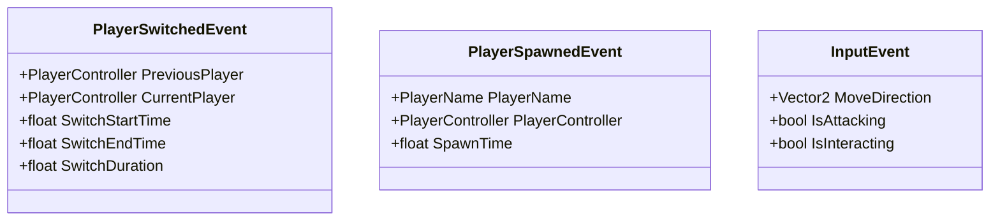
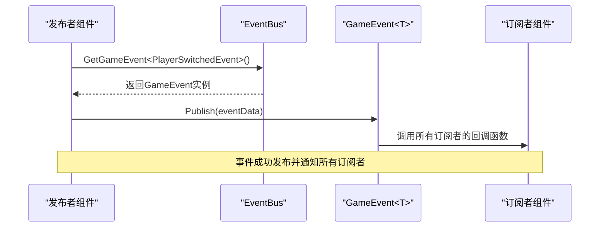
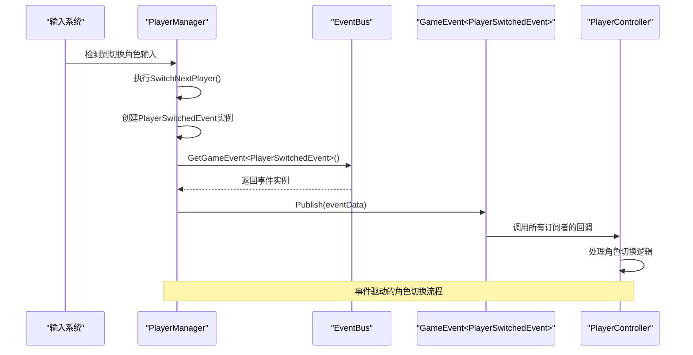

# 添加新事件

<cite>
**本文档中引用的文件**  
- [GameEvents.cs](file://Assets/Scripts/Manager/EventSystem/GameEvents.cs)
- [GameEvent.cs](file://Assets/Scripts/Manager/EventSystem/GameEvent.cs)
- [EventBus.cs](file://Assets/Scripts/Manager/EventSystem/EventBus.cs)
- [PlayerEvents.cs](file://Assets/Scripts/EventData/PlayerEvents.cs)
- [PlayerManager.cs](file://Assets/Scripts/Manager/PlayerManager/PlayerManager.cs)
- [PlayerController.cs](file://Assets/Scripts/Controller/PlayerController.cs)
- [GameMain.cs](file://Assets/Scripts/Manager/GameMain.cs)
- [Singleton.cs](file://Assets/Scripts/Tool/Singleton.cs)
</cite>

## 目录
1. [简介](#简介)
2. [事件系统架构](#事件系统架构)
3. [定义自定义事件](#定义自定义事件)
4. [发布事件](#发布事件)
5. [订阅和取消订阅事件](#订阅和取消订阅事件)
6. [使用R3响应式编程](#使用r3响应式编程)
7. [完整示例：玩家切换事件](#完整示例玩家切换事件)
8. [线程安全注意事项](#线程安全注意事项)
9. [事件命名规范](#事件命名规范)
10. [最佳实践总结](#最佳实践总结)

## 简介
本指南详细介绍了如何在Unity项目中扩展事件系统，包括定义、发布和订阅自定义事件的完整流程。文档涵盖了事件系统的核心组件、实现模式以及最佳实践，帮助开发者安全高效地使用事件驱动架构。

## 事件系统架构

```mermaid
classDiagram
class EventBus {
-Dictionary<Type, object> _events
+GetGameEvent<T>() GameEvent<T>
}
class GameEvent<T> {
-Action<T> OnEvent
+Publish(T data) void
+Subscribe(Action<T> listener) void
+Unsubscribe(Action<T> listener) void
}
class GameEvents {
+static readonly Subject<InputEvent> OnInput
}
class PlayerManager {
+SwitchNextPlayer() void
}
class PlayerController {
+SetInputActive(bool value) void
}
EventBus --> GameEvent : "创建和管理"
PlayerManager --> EventBus : "获取事件实例"
PlayerController --> EventBus : "获取事件实例"
GameEvents ..> Subject : "使用R3库"
```

**图示来源**  
- [EventBus.cs](file://Assets/Scripts/Manager/EventSystem/EventBus.cs#L1-L15)
- [GameEvent.cs](file://Assets/Scripts/Manager/EventSystem/GameEvent.cs#L1-L20)
- [GameEvents.cs](file://Assets/Scripts/Manager/EventSystem/GameEvents.cs#L1-L23)

**本节来源**  
- [EventBus.cs](file://Assets/Scripts/Manager/EventSystem/EventBus.cs#L1-L15)
- [GameEvent.cs](file://Assets/Scripts/Manager/EventSystem/GameEvent.cs#L1-L20)

## 定义自定义事件

在项目中定义自定义事件需要创建专门的事件数据类，这些类通常位于`EventData`目录下。事件数据类应该使用`[Serializable]`属性标记，以便在编辑器中可视化和序列化。

定义事件数据类时，应遵循以下原则：
- 使用清晰、描述性的类名，以`Event`后缀结尾
- 包含事件发生时需要传递的所有必要数据
- 提供适当的属性访问器（getter/setter）
- 避免包含对GameObject或Component的直接引用，而应使用ID或名称



**图示来源**  
- [PlayerEvents.cs](file://Assets/Scripts/EventData/PlayerEvents.cs#L1-L18)
- [GameEvents.cs](file://Assets/Scripts/Manager/EventSystem/GameEvents.cs#L1-L23)

**本节来源**  
- [PlayerEvents.cs](file://Assets/Scripts/EventData/PlayerEvents.cs#L1-L18)

## 发布事件

发布事件的正确方式是通过`EventBus.Instance.GetGameEvent<T>()`获取事件实例，然后调用`Publish(data)`方法。这种模式确保了事件系统的单例特性和类型安全。

发布事件的步骤：
1. 通过`EventBus.Instance`获取事件总线单例
2. 使用泛型方法`GetGameEvent<T>()`获取特定类型的事件实例
3. 创建事件数据实例并填充必要信息
4. 调用`Publish(data)`方法发布事件



**图示来源**  
- [EventBus.cs](file://Assets/Scripts/Manager/EventSystem/EventBus.cs#L1-L15)
- [GameEvent.cs](file://Assets/Scripts/Manager/EventSystem/GameEvent.cs#L1-L20)

**本节来源**  
- [EventBus.cs](file://Assets/Scripts/Manager/EventSystem/EventBus.cs#L1-L15)
- [GameEvent.cs](file://Assets/Scripts/Manager/EventSystem/GameEvent.cs#L1-L20)

## 订阅和取消订阅事件

订阅事件时必须遵循生命周期管理原则，在`OnEnable()`中订阅，在`OnDisable()`中取消订阅，以避免内存泄漏和空引用异常。

正确的订阅模式：
- 在`OnEnable()`方法中建立订阅关系
- 在`OnDisable()`方法中清理订阅关系
- 使用命名方法而非匿名委托，便于取消订阅
- 避免在`Awake()`或`Start()`中订阅，因为组件激活状态可能变化

```mermaid
flowchart TD
A[组件激活] --> B[OnEnable()]
B --> C[获取EventBus实例]
C --> D[调用GetGameEvent<T>()]
D --> E[调用Subscribe()方法]
E --> F[建立事件订阅]
G[组件禁用] --> H[OnDisable()]
H --> I[获取EventBus实例]
I --> J[调用GetGameEvent<T>()]
J --> K[调用Unsubscribe()方法]
K --> L[清除事件订阅]
style F fill:#9f9,stroke:#333
style L fill:#f99,stroke:#333
```

**图示来源**  
- [PlayerController.cs](file://Assets/Scripts/Controller/PlayerController.cs#L1-L102)
- [PlayerManager.cs](file://Assets/Scripts/Manager/PlayerManager/PlayerManager.cs#L1-L84)

**本节来源**  
- [PlayerController.cs](file://Assets/Scripts/Controller/PlayerController.cs#L1-L102)
- [PlayerManager.cs](file://Assets/Scripts/Manager/PlayerManager/PlayerManager.cs#L1-L84)

## 使用R3响应式编程

项目中集成了R3响应式编程库，提供了更强大的事件流处理能力。R3库基于Unity的Job System和Burst Compiler，提供了高性能的响应式编程功能。

R3的主要优势：
- 更好的性能和内存管理
- 支持操作符链式调用（如Filter、Map、Throttle等）
- 与Unity生命周期集成，自动处理订阅清理
- 支持协程和异步操作的无缝集成

虽然当前项目主要使用自定义的`GameEvent<T>`系统，但`GameEvents`类中也使用了R3的`Subject<T>`类型，展示了两种系统的共存模式。

```mermaid
classDiagram
class Subject<T> {
+OnNext(T value) void
+Subscribe(IObserver<T> observer) IDisposable
+Dispose() void
}
class Observable {
+FromEvent<T> method
+Timer period
+Interval period
}
class IDisposable {
+Dispose() void
}
Subject<T> --|> IObservable<T>
Subject<T> --> IDisposable : "实现"
Observable --> IObservable<T> : "提供"
```

**图示来源**  
- [GameEvents.cs](file://Assets/Scripts/Manager/EventSystem/GameEvents.cs#L1-L23)
- [Packages/R3.1.3.0](file://Assets/Packages/R3.1.3.0)

**本节来源**  
- [GameEvents.cs](file://Assets/Scripts/Manager/EventSystem/GameEvents.cs#L1-L23)

## 完整示例：玩家切换事件

以下是一个完整的示例，展示从定义事件到发布和订阅的全过程：



该示例展示了事件系统的核心工作流程：
1. 输入系统检测到玩家的切换角色操作
2. PlayerManager处理输入并准备切换逻辑
3. 创建包含切换信息的事件数据
4. 通过EventBus发布事件
5. 所有订阅该事件的组件接收并处理事件

**图示来源**  
- [PlayerManager.cs](file://Assets/Scripts/Manager/PlayerManager/PlayerManager.cs#L1-L84)
- [PlayerEvents.cs](file://Assets/Scripts/EventData/PlayerEvents.cs#L1-L18)
- [EventBus.cs](file://Assets/Scripts/Manager/EventSystem/EventBus.cs#L1-L15)

**本节来源**  
- [PlayerManager.cs](file://Assets/Scripts/Manager/PlayerManager/PlayerManager.cs#L1-L84)
- [PlayerEvents.cs](file://Assets/Scripts/EventData/PlayerEvents.cs#L1-L18)

## 线程安全注意事项

事件系统在多线程环境下的使用需要注意以下几点：

1. **主线程约束**：Unity的大多数API只能在主线程调用，因此事件处理逻辑通常应该在主线程执行
2. **单例模式**：EventBus使用SingletonBase实现，确保全局唯一实例
3. **延迟初始化**：使用Lazy<T>实现线程安全的延迟初始化
4. **避免跨线程订阅**：不要从工作线程直接订阅或发布影响UI的事件

```mermaid
stateDiagram-v2
[*] --> Idle
Idle --> MainThreadOperation : "主线程操作"
MainThreadOperation --> Idle : "完成"
Idle --> WorkerThreadOperation : "工作线程操作"
WorkerThreadOperation --> QueueMainThreadTask : "排队主线程任务"
QueueMainThreadTask --> MainThreadOperation : "主线程执行"
MainThreadOperation --> Idle : "完成"
Note over WorkerThreadOperation,MainThreadOperation : 工作线程不应直接操作Unity API
```

**图示来源**  
- [Singleton.cs](file://Assets/Scripts/Tool/Singleton.cs#L1-L23)
- [EventBus.cs](file://Assets/Scripts/Manager/EventSystem/EventBus.cs#L1-L15)

**本节来源**  
- [Singleton.cs](file://Assets/Scripts/Tool/Singleton.cs#L1-L23)

## 事件命名规范

为了保持代码的一致性和可读性，事件命名应遵循以下规范：

- **事件类命名**：使用`[描述性名称]Event`格式，如`PlayerSwitchedEvent`
- **事件实例命名**：使用`On[事件描述]`格式，如`OnPlayerSwitched`
- **动词时态**：使用过去时态表示已发生的事件，如`PlayerSwitched`而非`PlayerSwitch`
- **避免缩写**：使用完整单词而非缩写，提高代码可读性
- **领域一致性**：在同一领域内保持命名风格一致

推荐的事件命名模式：
- `OnPlayerSpawned` - 玩家生成
- `OnPlayerDied` - 玩家死亡
- `OnItemCollected` - 物品收集
- `OnLevelCompleted` - 关卡完成
- `OnGamePaused` - 游戏暂停

**本节来源**  
- [PlayerEvents.cs](file://Assets/Scripts/EventData/PlayerEvents.cs#L1-L18)
- [GameEvents.cs](file://Assets/Scripts/Manager/EventSystem/GameEvents.cs#L1-L23)

## 最佳实践总结

1. **生命周期管理**：始终在`OnEnable`中订阅，在`OnDisable`中取消订阅
2. **内存安全**：避免持有对已销毁对象的引用
3. **类型安全**：使用泛型确保编译时类型检查
4. **单一职责**：每个事件只传递与其直接相关的数据
5. **文档化**：为复杂事件添加XML文档注释
6. **测试**：为关键事件流编写单元测试
7. **性能考虑**：避免在每帧更新中发布大量事件
8. **调试支持**：在开发版本中添加事件发布和订阅的日志记录

遵循这些最佳实践可以确保事件系统的稳定性和可维护性，为游戏开发提供可靠的通信基础设施。

**本节来源**  
- [PlayerManager.cs](file://Assets/Scripts/Manager/PlayerManager/PlayerManager.cs#L1-L84)
- [PlayerController.cs](file://Assets/Scripts/Controller/PlayerController.cs#L1-L102)
- [EventBus.cs](file://Assets/Scripts/Manager/EventSystem/EventBus.cs#L1-L15)