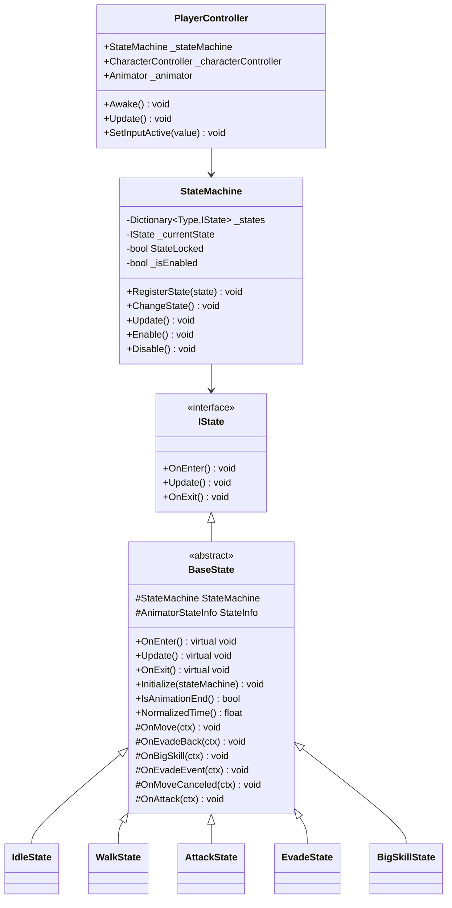
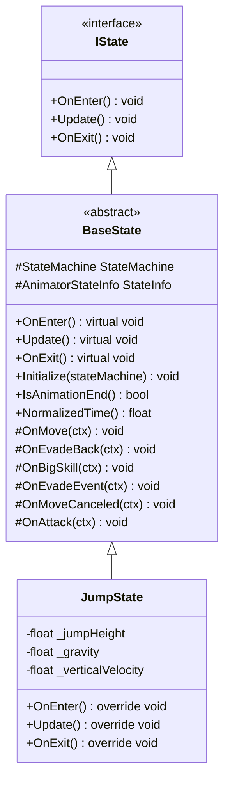
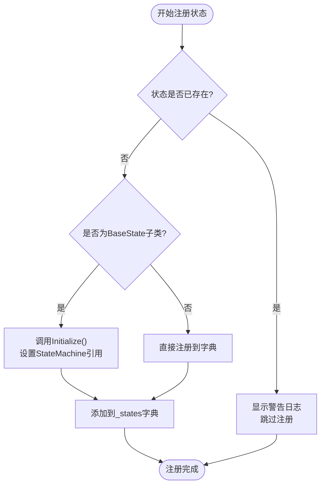
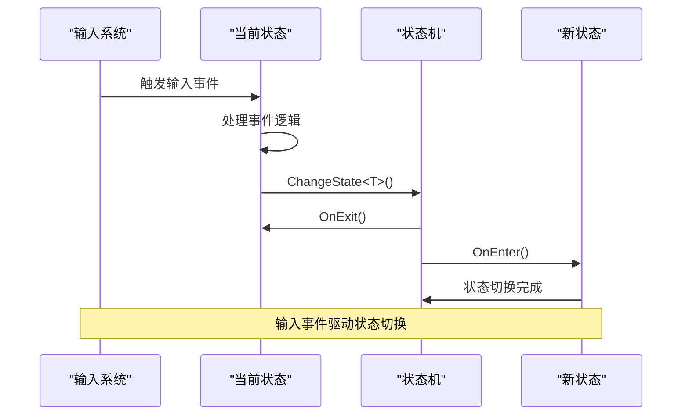

# 添加新状态

<cite>
**本文档中引用的文件**
- [BaseState.cs](file://Assets/Scripts/Controller/FSM/BaseState.cs)
- [StateMachine.cs](file://Assets/Scripts/Controller/FSM/StateMachine.cs)
- [IState.cs](file://Assets/Scripts/Controller/FSM/IState.cs)
- [PlayerController.cs](file://Assets/Scripts/Controller/PlayerController.cs)
- [IdleState.cs](file://Assets/Scripts/Controller/FSM/CharacterState/IdleState.cs)
- [WalkState.cs](file://Assets/Scripts/Controller/FSM/CharacterState/WalkState.cs)
- [AttackState.cs](file://Assets/Scripts/Controller/FSM/CharacterState/AttackState.cs)
- [EvadeState.cs](file://Assets/Scripts/Controller/FSM/CharacterState/EvadeState.cs)
- [BigSkillState.cs](file://Assets/Scripts/Controller/FSM/CharacterState/BigSkillState.cs)
- [InputSystem.cs](file://Assets/Scripts/Manager/InputSystem/InputSystem.cs)
</cite>

## 目录
1. [简介](#简介)
2. [系统架构概览](#系统架构概览)
3. [创建新状态类](#创建新状态类)
4. [实现生命周期方法](#实现生命周期方法)
5. [注册状态到状态机](#注册状态到状态机)
6. [处理输入事件](#处理输入事件)
7. [状态切换机制](#状态切换机制)
8. [完整代码示例](#完整代码示例)
9. [常见错误与调试](#常见错误与调试)
10. [最佳实践](#最佳实践)

## 简介

本指南详细说明了如何向状态机系统添加新状态。状态机系统采用基于接口的设计模式，通过继承`BaseState`类来实现特定状态的行为。每个状态都必须实现三个核心生命周期方法：`OnEnter()`、`Update()`和`OnExit()`，并通过状态机进行管理。

## 系统架构概览

状态机系统的核心组件包括：



**图表来源**
- [IState.cs](file://Assets/Scripts/Controller/FSM/IState.cs#L1-L6)
- [BaseState.cs](file://Assets/Scripts/Controller/FSM/BaseState.cs#L1-L85)
- [StateMachine.cs](file://Assets/Scripts/Controller/FSM/StateMachine.cs#L1-L115)
- [PlayerController.cs](file://Assets/Scripts/Controller/PlayerController.cs#L1-L94)

**章节来源**
- [BaseState.cs](file://Assets/Scripts/Controller/FSM/BaseState.cs#L1-L85)
- [StateMachine.cs](file://Assets/Scripts/Controller/FSM/StateMachine.cs#L1-L115)
- [IState.cs](file://Assets/Scripts/Controller/FSM/IState.cs#L1-L6)

## 创建新状态类

### 步骤 1：创建状态类

创建一个新的状态类，继承自`BaseState`：

```csharp
// 示例：创建一个新的跳跃状态
public class JumpState : BaseState
{
    private float _jumpHeight = 5f;
    private float _gravity = 20f;
    private float _verticalVelocity = 0f;
    
    public override void OnEnter()
    {
        // 实现进入跳跃状态的逻辑
    }
    
    public override void Update()
    {
        // 实现跳跃状态的更新逻辑
    }
    
    public override void OnExit()
    {
        // 实现离开跳跃状态的逻辑
    }
}
```

### 步骤 2：命名约定

遵循以下命名约定：
- 类名使用`PascalCase`格式，例如`JumpState`
- 文件名与类名相同，例如`JumpState.cs`
- 放置在`Assets/Scripts/Controller/FSM/CharacterState/`目录下

### 步骤 3：继承层次结构



**图表来源**
- [BaseState.cs](file://Assets/Scripts/Controller/FSM/BaseState.cs#L5-L85)
- [JumpState.cs](file://Assets/Scripts/Controller/FSM/CharacterState/JumpState.cs)

**章节来源**
- [BaseState.cs](file://Assets/Scripts/Controller/FSM/BaseState.cs#L5-L85)

## 实现生命周期方法

### OnEnter() 方法

`OnEnter()`方法在状态开始时被调用，用于初始化状态相关的资源和设置。

```csharp
public override void OnEnter()
{
    // 1. 播放相关动画
    StateMachine._animator.Play("Jump_Start");
    
    // 2. 初始化状态变量
    _verticalVelocity = Mathf.Sqrt(_jumpHeight * 2 * _gravity);
    
    // 3. 注册输入事件监听器
    InputSystem.Instance.OnMovePerformed += OnMove;
    InputSystem.Instance.OnAttackEvent += OnAttack;
    
    // 4. 锁定状态机（如果需要）
    StateMachine.StateLocked = true;
    
    // 5. 执行其他初始化逻辑
    DebugX.Instance.Log("JumpState OnEnter");
}
```

### Update() 方法

`Update()`方法在每一帧被调用，用于处理状态的持续逻辑。

```csharp
public override void Update()
{
    // 1. 处理重力效果
    _verticalVelocity -= _gravity * Time.deltaTime;
    
    // 2. 更新角色位置
    Vector3 moveDirection = StateMachine._characterController.velocity;
    moveDirection.y = _verticalVelocity;
    StateMachine._characterController.Move(moveDirection * Time.deltaTime);
    
    // 3. 检查是否落地
    if (StateMachine._characterController.isGrounded)
    {
        // 落地后切换到站立状态
        StateMachine.ChangeState<IdleState>();
        return;
    }
    
    // 4. 检查动画是否结束
    if (IsAnimationEnd())
    {
        // 动画结束后切换到空中状态
        StateMachine.ChangeState<FallState>();
    }
}
```

### OnExit() 方法

`OnExit()`方法在状态结束时被调用，用于清理资源和移除事件监听器。

```csharp
public override void OnExit()
{
    // 1. 停止所有输入事件监听
    InputSystem.Instance.OnMovePerformed -= OnMove;
    InputSystem.Instance.OnAttackEvent -= OnAttack;
    
    // 2. 解锁状态机
    StateMachine.StateLocked = false;
    
    // 3. 执行清理逻辑
    _verticalVelocity = 0f;
    
    // 4. 调用基类的清理逻辑
    base.OnExit();
    
    DebugX.Instance.Log("JumpState OnExit");
}
```

**章节来源**
- [BaseState.cs](file://Assets/Scripts/Controller/FSM/BaseState.cs#L10-L15)
- [JumpState.cs](file://Assets/Scripts/Controller/FSM/CharacterState/JumpState.cs)

## 注册状态到状态机

### 在PlayerController中注册状态

在`PlayerController`的`Awake()`方法中注册新状态：

```csharp
private void Awake()
{
    // 1. 初始化状态机
    _stateMachine = new StateMachine(this, _characterController, _animator);
    
    // 2. 注册所有状态
    _stateMachine.RegisterState(new IdleState());
    _stateMachine.RegisterState(new WalkState());
    _stateMachine.RegisterState(new RunState());
    _stateMachine.RegisterState(new EvadeState());
    _stateMachine.RegisterState(new EvadeBackState());
    _stateMachine.RegisterState(new BigSkillState());
    _stateMachine.RegisterState(new AttackState());
    _stateMachine.RegisterState(new AttackEndState());
    _stateMachine.RegisterState(new EvadeBackEndState());
    
    // 3. 注册新状态
    _stateMachine.RegisterState(new JumpState());
    
    // 4. 设置初始状态
    _stateMachine.ChangeState<IdleState>();
}
```

### 注册状态的注意事项



**图表来源**
- [StateMachine.cs](file://Assets/Scripts/Controller/FSM/StateMachine.cs#L25-L45)

**章节来源**
- [PlayerController.cs](file://Assets/Scripts/Controller/PlayerController.cs#L25-L45)
- [StateMachine.cs](file://Assets/Scripts/Controller/FSM/StateMachine.cs#L25-L45)

## 处理输入事件

### 使用BaseState提供的事件处理

`BaseState`类提供了预定义的事件处理方法，可以直接在子类中重写：

```csharp
protected void OnMove(InputAction.CallbackContext ctx)
{
    // 切换到移动状态
    DebugX.Instance.Log("移动事件触发");
    StateMachine.ChangeState<WalkState>();
}

protected void OnAttack(InputAction.CallbackContext ctx)
{
    // 切换到攻击状态
    DebugX.Instance.Log("攻击事件触发");
    StateMachine.ChangeState<AttackState>();
}

protected void OnEvadeEvent(InputAction.CallbackContext ctx)
{
    // 切换到闪避状态
    DebugX.Instance.Log("闪避事件触发");
    StateMachine.ChangeState<EvadeState>();
}
```

### 自定义事件处理

```csharp
public override void OnEnter()
{
    // 注册自定义事件
    InputSystem.Instance.OnMovePerformed += OnMove;
    InputSystem.Instance.OnAttackEvent += OnAttack;
    InputSystem.Instance.OnCustomEvent += OnCustomEvent;
    
    // 播放动画
    StateMachine._animator.Play("CustomState");
}

private void OnCustomEvent(InputAction.CallbackContext ctx)
{
    // 处理自定义事件
    if (ctx.performed)
    {
        // 执行自定义逻辑
        DebugX.Instance.Log("自定义事件触发");
        
        // 触发状态切换
        StateMachine.ChangeState<IdleState>();
    }
}

public override void OnExit()
{
    // 移除事件监听器
    InputSystem.Instance.OnMovePerformed -= OnMove;
    InputSystem.Instance.OnAttackEvent -= OnAttack;
    InputSystem.Instance.OnCustomEvent -= OnCustomEvent;
    
    base.OnExit();
}
```

### 输入事件处理流程



**图表来源**
- [BaseState.cs](file://Assets/Scripts/Controller/FSM/BaseState.cs#L40-L75)
- [InputSystem.cs](file://Assets/Scripts/Manager/InputSystem/InputSystem.cs#L60-L75)

**章节来源**
- [BaseState.cs](file://Assets/Scripts/Controller/FSM/BaseState.cs#L40-L75)
- [InputSystem.cs](file://Assets/Scripts/Manager/InputSystem/InputSystem.cs#L60-L75)

## 状态切换机制

### 使用StateMachine.ChangeState<T>()

状态切换通过`StateMachine.ChangeState<T>()`方法实现：

```csharp
// 基本状态切换
StateMachine.ChangeState<IdleState>();

// 条件状态切换
if (someCondition)
{
    StateMachine.ChangeState<AttackState>();
}

// 异步状态切换
UniTaskTimer.StartTimer(UniTaskTimer.Mode.Once, 0.5f,
                       UniTaskTimer.TimeSource.Scaled,
                       () => {
                           StateMachine.ChangeState<IdleState>();
                       });
```

### 状态切换的安全性检查

```csharp
public void ChangeState<T>() where T : IState
{
    if (StateLocked || !_isEnabled) return;
    
    var type = typeof(T);
    if (_states.TryGetValue(type, out var newState))
    {
        _currentState?.OnExit();  // 退出当前状态
        _currentState = newState; // 设置新状态
        _currentState.OnEnter();  // 进入新状态
    }
    else
    {
        Debug.LogError($"State {type} not registered!");
    }
}
```

### 动画状态检测

```csharp
public bool IsAnimationEnd()
{
    StateInfo = StateMachine._animator.GetCurrentAnimatorStateInfo(0);
    return StateInfo.normalizedTime >= 1.0f && !StateMachine._animator.IsInTransition(0);
}

public float NormalizedTime()
{
    StateInfo = StateMachine._animator.GetCurrentAnimatorStateInfo(0);
    return StateInfo.normalizedTime;
}
```

**章节来源**
- [StateMachine.cs](file://Assets/Scripts/Controller/FSM/StateMachine.cs#L47-L65)
- [BaseState.cs](file://Assets/Scripts/Controller/FSM/BaseState.cs#L20-L35)

## 完整代码示例

### Step 1: 创建JumpState类

```csharp
// JumpState.cs
using UnityEngine;

public class JumpState : BaseState
{
    private float _jumpHeight = 5f;
    private float _gravity = 20f;
    private float _verticalVelocity = 0f;
    private bool _hasJumped = false;
    
    public override void OnEnter()
    {
        // 播放跳跃动画
        StateMachine._animator.Play("Jump_Start");
        
        // 初始化跳跃参数
        _verticalVelocity = Mathf.Sqrt(_jumpHeight * 2 * _gravity);
        _hasJumped = true;
        
        // 锁定状态机防止输入干扰
        StateMachine.StateLocked = true;
        
        // 注册输入事件
        InputSystem.Instance.OnMovePerformed += OnMove;
        InputSystem.Instance.OnAttackEvent += OnAttack;
        
        DebugX.Instance.Log("JumpState OnEnter");
    }
    
    public override void Update()
    {
        // 应用重力
        _verticalVelocity -= _gravity * Time.deltaTime;
        
        // 更新垂直位置
        Vector3 moveDirection = StateMachine._characterController.velocity;
        moveDirection.y = _verticalVelocity;
        StateMachine._characterController.Move(moveDirection * Time.deltaTime);
        
        // 检查是否落地
        if (StateMachine._characterController.isGrounded)
        {
            // 落地后切换到站立状态
            StateMachine.ChangeState<IdleState>();
            return;
        }
        
        // 检查动画进度
        if (IsAnimationEnd())
        {
            // 动画结束后切换到自由落体状态
            StateMachine.ChangeState<FallState>();
        }
        
        // 水平移动控制
        StateMachine._playerController.SetCharacterRotation();
    }
    
    public override void OnExit()
    {
        // 清理输入事件
        InputSystem.Instance.OnMovePerformed -= OnMove;
        InputSystem.Instance.OnAttackEvent -= OnAttack;
        
        // 解锁状态机
        StateMachine.StateLocked = false;
        
        // 重置跳跃标志
        _hasJumped = false;
        
        DebugX.Instance.Log("JumpState OnExit");
        
        base.OnExit();
    }
    
    protected void OnMove(InputAction.CallbackContext ctx)
    {
        // 在跳跃过程中仍然可以移动
        DebugX.Instance.Log("跳跃中移动事件");
        StateMachine.ChangeState<WalkState>();
    }
    
    protected void OnAttack(InputAction.CallbackContext ctx)
    {
        // 在跳跃过程中可以攻击
        DebugX.Instance.Log("跳跃中攻击事件");
        StateMachine.ChangeState<AttackState>();
    }
}
```

### Step 2: 注册JumpState到PlayerController

```csharp
// 在PlayerController.cs的Awake方法中
private void Awake()
{
    _animator = GetComponent<Animator>();
    
    // 初始化状态机
    _stateMachine = new StateMachine(this, _characterController, _animator);
    
    // 注册所有现有状态
    _stateMachine.RegisterState(new IdleState());
    _stateMachine.RegisterState(new WalkState());
    _stateMachine.RegisterState(new RunState());
    _stateMachine.RegisterState(new EvadeState());
    _stateMachine.RegisterState(new EvadeBackState());
    _stateMachine.RegisterState(new BigSkillState());
    _stateMachine.RegisterState(new AttackState());
    _stateMachine.RegisterState(new AttackEndState());
    _stateMachine.RegisterState(new EvadeBackEndState());
    
    // 注册新状态
    _stateMachine.RegisterState(new JumpState());
    
    // 设置初始状态
    _stateMachine.ChangeState<IdleState>();
}
```

### Step 3: 在其他状态中添加跳跃触发条件

```csharp
// 在IdleState中添加跳跃触发
public override void OnEnter()
{
    StateMachine._animator.Play("Idle");
    
    // 注册输入事件
    InputSystem.Instance.OnMovePerformed += OnMove;
    InputSystem.Instance.OnAttackEvent += OnAttack;
    InputSystem.Instance.OnEvadeEvent += OnEvadeBack;
    InputSystem.Instance.OnBigSkillEvent += OnBigSkill;
    
    // 添加跳跃输入事件
    InputSystem.Instance.OnJumpEvent += OnJump; // 需要在InputSystem中添加此事件
    
    DebugX.Instance.Log("IdleState OnEnter");
}

private void OnJump(InputAction.CallbackContext ctx)
{
    if (ctx.performed && !StateMachine.StateLocked)
    {
        DebugX.Instance.Log("从待机状态切换到跳跃状态");
        StateMachine.ChangeState<JumpState>();
    }
}
```

## 常见错误与调试

### 常见错误类型

#### 1. 忘记注册状态

```csharp
// 错误示例：状态未注册
// _stateMachine.RegisterState(new JumpState()); // 缺少这行代码

// 结果：运行时会抛出错误："State JumpState not registered!"
```

#### 2. 忘记在OnUpdate中调用基类方法

```csharp
public override void Update()
{
    // 错误：忘记调用基类Update()
    // base.Update(); // 缺少这行代码
    
    // 自定义更新逻辑
    // ...
}
```

#### 3. 事件监听器泄漏

```csharp
public override void OnExit()
{
    // 错误：忘记移除事件监听器
    // InputSystem.Instance.OnMovePerformed -= OnMove; // 缺少这行代码
    
    base.OnExit();
}
```

#### 4. 状态机锁定问题

```csharp
public override void OnEnter()
{
    // 错误：忘记在OnExit中解锁
    // StateMachine.StateLocked = false; // 缺少这行代码
    
    // 其他初始化逻辑
    // ...
}
```

### 调试技巧

#### 1. 启用调试日志

```csharp
public override void OnEnter()
{
    DebugX.Instance.Log($"[{this.GetType().Name}] OnEnter");
    // 其他逻辑...
}

public override void Update()
{
    DebugX.Instance.Log($"[{this.GetType().Name}] Update - Time: {Time.time}");
    // 其他逻辑...
}

public override void OnExit()
{
    DebugX.Instance.Log($"[{this.GetType().Name}] OnExit");
    // 其他逻辑...
}
```

#### 2. 检查状态机状态

```csharp
// 在PlayerController的Update方法中添加调试信息
private void Update()
{
    _stateMachine.Update();
    
    // 调试输出当前状态信息
    if (Input.GetKeyDown(KeyCode.F1))
    {
        DebugX.Instance.Log($"Current State: {_stateMachine._currentState?.GetType().Name}");
        DebugX.Instance.Log($"State Locked: {_stateMachine.StateLocked}");
        DebugX.Instance.Log($"Is Enabled: {_stateMachine.IsEnabled}");
    }
}
```

#### 3. 验证状态注册

```csharp
// 在Awake方法中验证状态注册
private void Awake()
{
    // ... 其他初始化代码
    
    // 验证状态注册
    var registeredStates = string.Join(", ", _stateMachine._states.Keys.Select(k => k.Name));
    DebugX.Instance.Log($"Registered States: {registeredStates}");
    
    // 检查特定状态是否存在
    if (!_stateMachine._states.ContainsKey(typeof(JumpState)))
    {
        Debug.LogError("JumpState is not registered!");
    }
}
```

### 性能优化建议

#### 1. 避免频繁的状态切换

```csharp
// 错误：频繁的状态切换
public override void Update()
{
    if (someCondition)
    {
        StateMachine.ChangeState<SomeState>(); // 不要在这里频繁切换
    }
}

// 正确：使用标志位控制状态切换
private bool _shouldChangeState = false;

public override void Update()
{
    if (_shouldChangeState)
    {
        StateMachine.ChangeState<SomeState>();
        _shouldChangeState = false;
    }
}
```

#### 2. 优化动画检测

```csharp
// 错误：每次Update都检测动画
public override void Update()
{
    if (IsAnimationEnd()) // 每帧都调用很耗性能
    {
        // ...
    }
}

// 正确：缓存动画状态
private AnimatorStateInfo _cachedStateInfo;
private bool _animationEnded = false;

public override void Update()
{
    _cachedStateInfo = StateMachine._animator.GetCurrentAnimatorStateInfo(0);
    _animationEnded = _cachedStateInfo.normalizedTime >= 1.0f && 
                     !_StateMachine._animator.IsInTransition(0);
    
    if (_animationEnded)
    {
        // ...
    }
}
```

**章节来源**
- [StateMachine.cs](file://Assets/Scripts/Controller/FSM/StateMachine.cs#L47-L65)
- [BaseState.cs](file://Assets/Scripts/Controller/FSM/BaseState.cs#L10-L15)

## 最佳实践

### 1. 状态设计原则

#### 单一职责原则
每个状态应该只负责一种特定的行为模式：

```csharp
// 好的设计：每个状态专注于单一功能
public class IdleState : BaseState { /* 只处理待机行为 */ }
public class WalkState : BaseState { /* 只处理行走行为 */ }
public class JumpState : BaseState { /* 只处理跳跃行为 */ }
public class AttackState : BaseState { /* 只处理攻击行为 */ }
```

#### 状态间转换清晰
确保状态间的转换有明确的条件和逻辑：

```csharp
public override void Update()
{
    // 明确的转换条件
    if (InputSystem.Instance.JumpTriggered && CanJump())
    {
        StateMachine.ChangeState<JumpState>();
        return;
    }
    
    if (InputSystem.Instance.AttackTriggered && CanAttack())
    {
        StateMachine.ChangeState<AttackState>();
        return;
    }
}
```

### 2. 资源管理

#### 正确的资源清理

```csharp
public override void OnExit()
{
    // 1. 移除所有事件监听器
    InputSystem.Instance.OnMovePerformed -= OnMove;
    InputSystem.Instance.OnAttackEvent -= OnAttack;
    InputSystem.Instance.OnJumpEvent -= OnJump;
    
    // 2. 重置相关变量
    _currentSpeed = 0f;
    _isMoving = false;
    
    // 3. 停止协程（如果有）
    if (_movementCoroutine != null)
    {
        StopCoroutine(_movementCoroutine);
        _movementCoroutine = null;
    }
    
    // 4. 调用基类清理
    base.OnExit();
}
```

#### 内存泄漏防护

```csharp
public class JumpState : BaseState
{
    private Coroutine _landingCoroutine;
    
    public override void OnEnter()
    {
        // 启动协程
        _landingCoroutine = StartCoroutine(WaitForLanding());
        
        // 注册事件
        InputSystem.Instance.OnMovePerformed += OnMove;
    }
    
    public override void OnExit()
    {
        // 停止协程
        if (_landingCoroutine != null)
        {
            StopCoroutine(_landingCoroutine);
            _landingCoroutine = null;
        }
        
        // 移除事件
        InputSystem.Instance.OnMovePerformed -= OnMove;
        
        base.OnExit();
    }
    
    private IEnumerator WaitForLanding()
    {
        yield return new WaitForSeconds(2.0f);
        StateMachine.ChangeState<IdleState>();
    }
}
```

### 3. 错误处理

#### 状态机状态验证

```csharp
public void ChangeState<T>() where T : IState
{
    if (StateLocked || !_isEnabled)
    {
        Debug.LogWarning($"Cannot change state while StateLocked={StateLocked} or IsEnabled={_isEnabled}");
        return;
    }
    
    var type = typeof(T);
    if (!_states.ContainsKey(type))
    {
        Debug.LogError($"State {type} not registered! Available states: {string.Join(", ", _states.Keys)}");
        return;
    }
    
    // 执行状态切换
    var newState = _states[type];
    _currentState?.OnExit();
    _currentState = newState;
    _currentState.OnEnter();
}
```

#### 输入事件安全处理

```csharp
protected void OnMove(InputAction.CallbackContext ctx)
{
    // 安全检查
    if (ctx == null || StateMachine == null)
    {
        Debug.LogWarning("Invalid input context or state machine");
        return;
    }
    
    // 状态机状态检查
    if (StateMachine.StateLocked || !_StateMachine.IsEnabled)
    {
        return;
    }
    
    // 执行状态切换
    StateMachine.ChangeState<WalkState>();
}
```

### 4. 测试策略

#### 单元测试状态逻辑

```csharp
[Test]
public void JumpState_ShouldTransitionToIdleWhenLanded()
{
    // Arrange
    var jumpState = new JumpState();
    var mockStateMachine = new Mock<StateMachine>();
    var mockCharacterController = new Mock<CharacterController>();
    
    jumpState.Initialize(mockStateMachine.Object);
    
    // Act
    // 模拟角色着地
    mockCharacterController.Setup(c => c.isGrounded).Returns(true);
    jumpState.Update();
    
    // Assert
    mockStateMachine.Verify(s => s.ChangeState<IdleState>(), Times.Once);
}
```

#### 状态机集成测试

```csharp
[Test]
public void StateMachine_ShouldHandleStateTransitionsCorrectly()
{
    // Arrange
    var playerController = new PlayerController();
    var stateMachine = new StateMachine(playerController, null, null);
    
    stateMachine.RegisterState(new IdleState());
    stateMachine.RegisterState(new JumpState());
    
    // Act
    stateMachine.ChangeState<IdleState>();
    stateMachine.Update();
    
    // 模拟跳跃输入
    // ... 触发跳跃事件
    
    // Assert
    Assert.IsInstanceOf<JumpState>(stateMachine.CurrentState);
}
```

通过遵循这些最佳实践，您可以创建稳定、可维护且高性能的状态机系统，确保游戏中的角色行为符合预期并且易于调试和扩展。