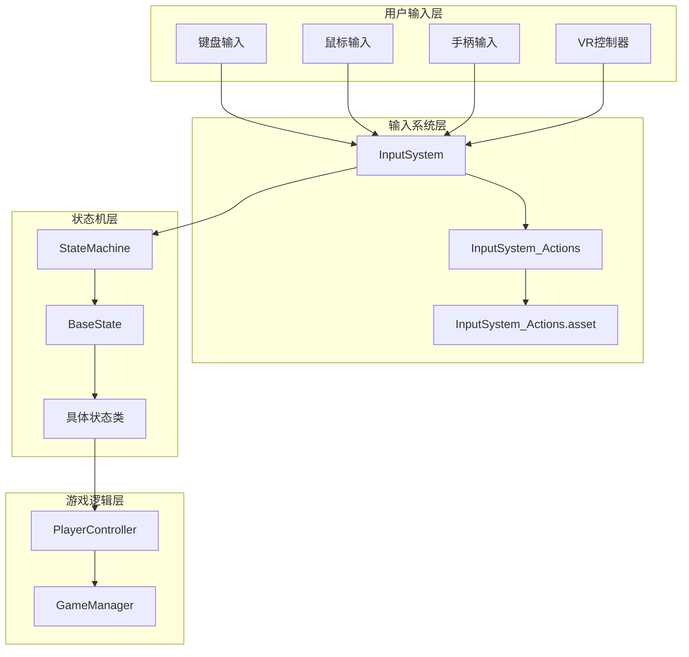
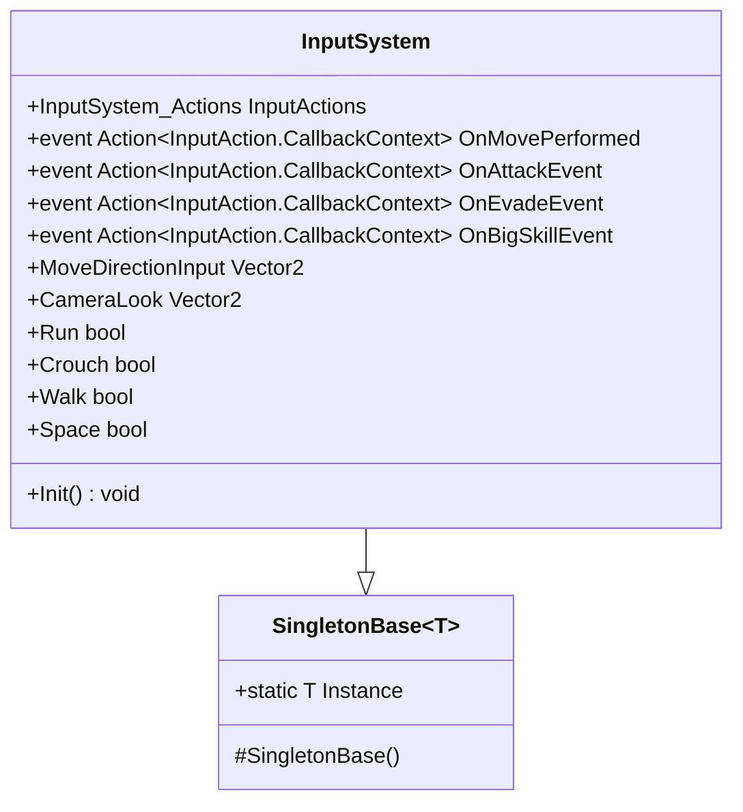
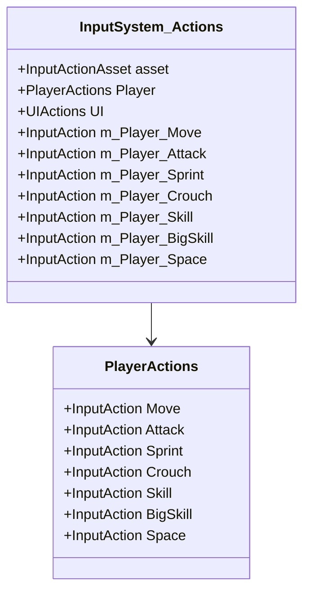
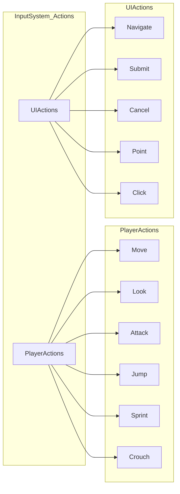
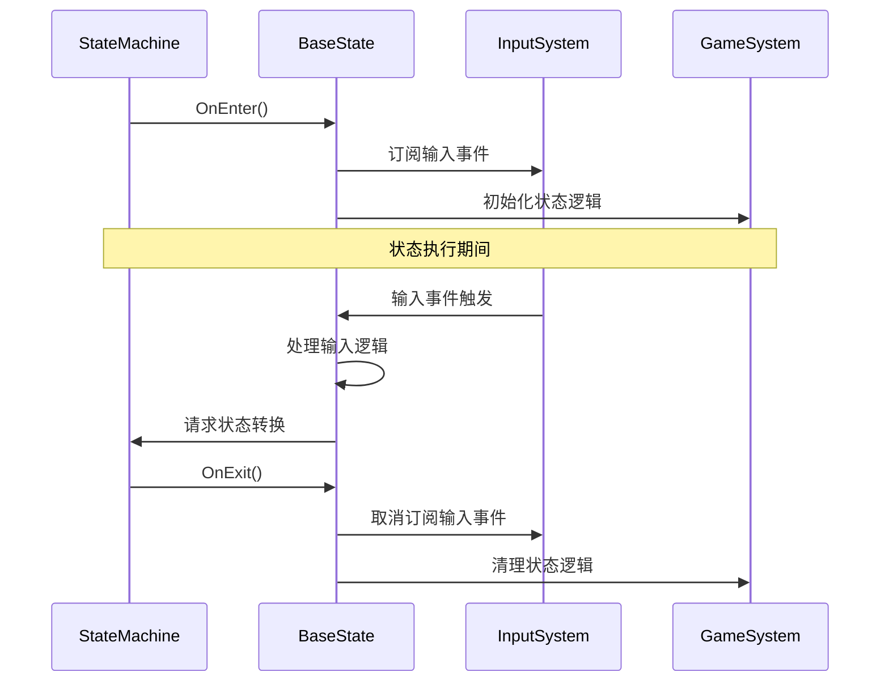

# 添加新输入系统扩展指南

<cite>
**本文档引用的文件**
- [InputSystem.cs](file://Assets/Scripts/Manager/InputSystem/InputSystem.cs)
- [InputSystem_Actions.cs](file://Assets/InputSystem_Actions.cs)
- [InputSystem_Actions.inputactions](file://Assets/InputSystem_Actions.inputactions)
- [BaseState.cs](file://Assets/Scripts/Controller/FSM/BaseState.cs)
- [StateMachine.cs](file://Assets/Scripts/Controller/FSM/StateMachine.cs)
- [PlayerController.cs](file://Assets/Scripts/Controller/PlayerController.cs)
- [IdleState.cs](file://Assets/Scripts/Controller/FSM/CharacterState/IdleState.cs)
- [WalkState.cs](file://Assets/Scripts/Controller/FSM/CharacterState/WalkState.cs)
- [Singleton.cs](file://Assets/Scripts/Tool/Singleton.cs)
- [GameEvents.cs](file://Assets/Scripts/Manager/EventSystem/GameEvents.cs)
- [EventLists.cs](file://Assets/Scripts/Manager/EventSystem/EventLists.cs)
</cite>

## 目录
1. [简介](#简介)
2. [项目架构概览](#项目架构概览)
3. [输入系统核心组件](#输入系统核心组件)
4. [创建新输入动作](#创建新输入动作)
5. [配置输入动作绑定](#配置输入动作绑定)
6. [访问生成的输入动作](#访问生成的输入动作)
7. [定义输入事件](#定义输入事件)
8. [状态机中的输入处理](#状态机中的输入处理)
9. [完整示例：添加跳跃功能](#完整示例添加跳跃功能)
10. [常见问题与调试技巧](#常见问题与调试技巧)
11. [最佳实践](#最佳实践)

## 简介

本指南详细介绍了如何在Unity项目中扩展输入系统，添加新的输入动作并将其集成到游戏的状态机系统中。通过遵循本指南的步骤，开发者可以轻松地为游戏添加新的控制方式，包括键盘、鼠标和手柄输入。

## 项目架构概览

当前项目采用分层架构设计，输入系统位于中间层，连接用户界面和游戏逻辑：



**图表来源**
- [InputSystem.cs](file://Assets/Scripts/Manager/InputSystem/InputSystem.cs#L1-L94)
- [StateMachine.cs](file://Assets/Scripts/Controller/FSM/StateMachine.cs#L1-L115)

## 输入系统核心组件

### InputSystem类

InputSystem是输入系统的主控制器，继承自SingletonBase，负责管理所有输入动作和事件：



**图表来源**
- [InputSystem.cs](file://Assets/Scripts/Manager/InputSystem/InputSystem.cs#L5-L94)
- [Singleton.cs](file://Assets/Scripts/Tool/Singleton.cs#L1-L23)

### InputSystem_Actions类

InputSystem_Actions是自动生成的类，提供了对输入动作的程序化访问：



**图表来源**
- [InputSystem_Actions.cs](file://Assets/InputSystem_Actions.cs#L1302-L1389)

**章节来源**
- [InputSystem.cs](file://Assets/Scripts/Manager/InputSystem/InputSystem.cs#L1-L94)
- [InputSystem_Actions.cs](file://Assets/InputSystem_Actions.cs#L1-L1389)

## 创建新输入动作

### 步骤1：修改InputSystem_Actions.inputactions文件

1. 在Unity编辑器中打开`Assets/InputSystem_Actions.inputactions`文件
2. 在Player动作映射中添加新的动作定义

#### 新动作定义格式

```json
{
    "name": "Jump",
    "type": "Button",
    "id": "新的唯一标识符",
    "expectedControlType": "Button",
    "processors": "",
    "interactions": "",
    "initialStateCheck": false
}
```

### 步骤2：添加动作绑定

在bindings数组中为新动作添加相应的输入绑定：

```json
{
    "name": "",
    "id": "新的唯一标识符",
    "path": "<Keyboard>/space",
    "interactions": "",
    "processors": "",
    "groups": ";Keyboard&Mouse",
    "action": "Jump",
    "isComposite": false,
    "isPartOfComposite": false
}
```

### 步骤3：重新生成代码

保存`.inputactions`文件后，Unity会自动重新生成`InputSystem_Actions.cs`文件。确保生成的代码包含新动作的属性。

**章节来源**
- [InputSystem_Actions.inputactions](file://Assets/InputSystem_Actions.inputactions#L1-L799)

## 配置输入动作绑定

### 支持的输入设备

| 设备类型 | 路径格式 | 示例 |
|---------|---------|------|
| 键盘 | `<Keyboard>/按键名` | `<Keyboard>/space`, `<Keyboard>/w` |
| 鼠标 | `<Mouse>/按钮名` | `<Mouse>/leftButton`, `<Mouse>/rightButton` |
| 手柄 | `<Gamepad>/按钮名` | `<Gamepad>/buttonSouth`, `<Gamepad>/leftStick` |
| VR控制器 | `<XRController>/路径` | `<XRController>/{PrimaryAction}` |
| 触摸屏 | `<Touchscreen>/路径` | `<Touchscreen>/primaryTouch/tap` |

### 绑定组配置

| 绑定组 | 描述 | 使用场景 |
|-------|------|---------|
| `;Keyboard&Mouse` | 键盘和鼠标组合 | 默认PC控制 |
| `;Gamepad` | 手柄组合 | 游戏主机控制 |
| `;Touch` | 触摸屏组合 | 移动设备控制 |
| `;XR` | VR设备组合 | 虚拟现实控制 |

## 访问生成的输入动作

### 基本属性访问

生成的InputSystem_Actions类提供了直接访问输入动作的方式：

```csharp
// 访问Player动作映射中的动作
InputAction jumpAction = InputSystem.Instance.InputActions.Player.Jump;

// 读取动作值
bool jumpTriggered = InputSystem.Instance.InputActions.Player.Jump.triggered;
Vector2 moveValue = InputSystem.Instance.InputActions.Player.Move.ReadValue<Vector2>();

// 获取只读属性
Vector2 moveDirection = InputSystem.Instance.MoveDirectionInput;
Vector2 cameraLook = InputSystem.Instance.CameraLook;
bool sprint = InputSystem.Instance.Run;
```

### 动作映射结构



**图表来源**
- [InputSystem_Actions.cs](file://Assets/InputSystem_Actions.cs#L1332-L1389)
- [InputSystem_Actions.cs](file://Assets/InputSystem_Actions.cs#L1532-L1564)

**章节来源**
- [InputSystem_Actions.cs](file://Assets/InputSystem_Actions.cs#L1302-L1389)

## 定义输入事件

### 在InputSystem中添加新事件

1. 在InputSystem类中添加新的事件声明：

```csharp
public event Action<InputAction.CallbackContext> OnJumpEvent;
```

2. 在Init方法中绑定事件处理：

```csharp
public void Init()
{
    // 现有事件绑定...
    
    // 添加跳跃事件绑定
    InputActions.Player.Jump.performed += ctx => 
    {
        OnJumpEvent?.Invoke(ctx);
        GameEvents.OnInput?.OnNext(new InputEvent());
    };
}
```

### 事件处理接口

InputSystem_Actions生成了回调接口，可以通过实现这些接口来处理输入事件：

```csharp
public interface IPlayerActions
{
    void OnMove(InputAction.CallbackContext context);
    void OnAttack(InputAction.CallbackContext context);
    void OnJump(InputAction.CallbackContext context); // 新增跳跃回调
    // 其他现有回调...
}
```

**章节来源**
- [InputSystem.cs](file://Assets/Scripts/Manager/InputSystem/InputSystem.cs#L30-L50)
- [InputSystem_Actions.cs](file://Assets/InputSystem_Actions.cs#L1791-L1811)

## 状态机中的输入处理

### 重写BaseState的OnEnable/OnDisable

在BaseState或具体状态类中，通过重写OnEnable和OnDisable方法来订阅和处理输入事件：

```csharp
public class CustomState : BaseState
{
    public override void OnEnter()
    {
        // 订阅输入事件
        InputSystem.Instance.OnJumpEvent += OnJump;
        
        // 播放相关动画
        StateMachine._animator.Play("JumpReady");
    }

    public override void OnExit()
    {
        // 取消订阅输入事件
        InputSystem.Instance.OnJumpEvent -= OnJump;
        
        base.OnExit();
    }
}
```

### 在具体状态中处理输入

```csharp
protected void OnJump(InputAction.CallbackContext ctx)
{
    // 处理跳跃逻辑
    DebugX.Instance.Log("跳跃事件触发");
    
    // 根据游戏逻辑决定状态转换
    if (CanJump())
    {
        StateMachine.ChangeState<JumpState>();
    }
}
```

### 状态机生命周期管理



**图表来源**
- [BaseState.cs](file://Assets/Scripts/Controller/FSM/BaseState.cs#L1-L85)
- [StateMachine.cs](file://Assets/Scripts/Controller/FSM/StateMachine.cs#L1-L115)

**章节来源**
- [BaseState.cs](file://Assets/Scripts/Controller/FSM/BaseState.cs#L1-L85)
- [IdleState.cs](file://Assets/Scripts/Controller/FSM/CharacterState/IdleState.cs#L1-L25)
- [WalkState.cs](file://Assets/Scripts/Controller/FSM/CharacterState/WalkState.cs#L1-L32)

## 完整示例：添加跳跃功能

### 步骤1：修改输入动作定义

在`InputSystem_Actions.inputactions`文件中添加Jump动作：

```json
{
    "name": "Jump",
    "type": "Button",
    "id": "新的唯一标识符",
    "expectedControlType": "Button",
    "processors": "",
    "interactions": "",
    "initialStateCheck": false
}
```

添加键盘绑定：
```json
{
    "name": "",
    "id": "新的唯一标识符",
    "path": "<Keyboard>/space",
    "interactions": "",
    "processors": "",
    "groups": ";Keyboard&Mouse",
    "action": "Jump",
    "isComposite": false,
    "isPartOfComposite": false
}
```

### 步骤2：更新InputSystem类

```csharp
// 在InputSystem类中添加新事件
public event Action<InputAction.CallbackContext> OnJumpEvent;

// 在Init方法中添加事件绑定
public void Init()
{
    // 现有事件绑定...
    
    // 添加跳跃事件绑定
    InputActions.Player.Jump.performed += ctx => 
    {
        OnJumpEvent?.Invoke(ctx);
        GameEvents.OnInput?.OnNext(new InputEvent());
    };
}
```

### 步骤3：创建跳跃状态

```csharp
public class JumpState : BaseState
{
    private bool _isJumping = false;
    private float _jumpHeight = 2.0f;
    private float _gravity = 9.8f;
    private float _timeInAir = 0f;

    public override void OnEnter()
    {
        _isJumping = true;
        _timeInAir = 0f;
        
        // 播放跳跃动画
        StateMachine._animator.CrossFade("Jump", 0.2f);
        
        // 订阅输入事件
        InputSystem.Instance.OnJumpEvent += OnJump;
    }

    public override void Update()
    {
        if (!_isJumping) return;
        
        _timeInAir += Time.deltaTime;
        
        // 应用重力
        float verticalVelocity = CalculateVerticalVelocity();
        StateMachine._characterController.Move(
            new Vector3(0, verticalVelocity, 0) * Time.deltaTime);
        
        // 检查是否落地
        if (StateMachine._characterController.isGrounded)
        {
            _isJumping = false;
            StateMachine.ChangeState<IdleState>();
        }
    }

    public override void OnExit()
    {
        _isJumping = false;
        InputSystem.Instance.OnJumpEvent -= OnJump;
        base.OnExit();
    }

    private float CalculateVerticalVelocity()
    {
        // 简化的跳跃物理计算
        return _jumpHeight - (_gravity * _timeInAir);
    }

    protected void OnJump(InputAction.CallbackContext ctx)
    {
        // 跳跃过程中再次按下跳跃键可能触发特殊动作
        if (_timeInAir > 0.1f && _timeInAir < 0.5f)
        {
            // 触发空中特殊动作
            StateMachine.ChangeState<AerialSpecialState>();
        }
    }
}
```

### 步骤4：更新状态机注册

```csharp
private void Awake()
{
    // 注册现有状态...
    
    // 注册跳跃状态
    _stateMachine.RegisterState(new JumpState());
    
    // 注册空中特殊动作状态
    _stateMachine.RegisterState(new AerialSpecialState());
}
```

### 步骤5：在IdleState中处理跳跃输入

```csharp
public class IdleState : BaseState
{
    public override void OnEnter()
    {
        // 播放闲置动画
        
        // 订阅输入事件
        InputSystem.Instance.OnMovePerformed += OnMove;
        InputSystem.Instance.OnAttackEvent += OnAttack;
        InputSystem.Instance.OnJumpEvent += OnJump; // 添加跳跃事件订阅
        
        StateMachine._animator.Play("Idle");
    }

    protected void OnJump(InputAction.CallbackContext ctx)
    {
        // 检查是否可以跳跃
        if (CanJump())
        {
            DebugX.Instance.Log("跳跃事件触发");
            StateMachine.ChangeState<JumpState>();
        }
    }

    private bool CanJump()
    {
        // 检查跳跃条件
        return StateMachine._characterController.isGrounded;
    }
}
```

**章节来源**
- [InputSystem.cs](file://Assets/Scripts/Manager/InputSystem/InputSystem.cs#L30-L50)
- [BaseState.cs](file://Assets/Scripts/Controller/FSM/BaseState.cs#L30-L85)
- [IdleState.cs](file://Assets/Scripts/Controller/FSM/CharacterState/IdleState.cs#L1-L25)

## 常见问题与调试技巧

### 输入冲突问题

#### 问题识别
- 多个动作同时触发同一输入
- 某些输入无法响应
- 输入响应延迟或不准确

#### 解决策略

1. **使用绑定组隔离输入**
```json
{
    "name": "",
    "id": "新的唯一标识符",
    "path": "<Keyboard>/space",
    "interactions": "",
    "processors": "",
    "groups": ";Keyboard&Mouse;Exclusive",  // 添加排他性标记
    "action": "Jump",
    "isComposite": false,
    "isPartOfComposite": false
}
```

2. **设置优先级**
```csharp
// 在InputSystem中添加输入优先级检查
public bool IsInputAllowed(string actionName)
{
    // 检查当前状态是否允许该输入
    if (StateMachine.CurrentState is CombatState && 
        actionName == "Jump")
    {
        return false;
    }
    return true;
}
```

### 调试技巧

#### 1. 启用输入日志

```csharp
protected void OnJump(InputAction.CallbackContext ctx)
{
    DebugX.Instance.Log($"跳跃输入: {ctx.action.name}, Phase: {ctx.phase}, Value: {ctx.ReadValue<float>()}");
    
    // 输出详细的状态信息
    DebugX.Instance.Log($"当前状态: {StateMachine.CurrentState.GetType().Name}");
    DebugX.Instance.Log($"角色状态: {StateMachine._characterController.isGrounded}");
}
```

#### 2. 输入可视化

```csharp
// 在PlayerController中添加输入可视化
private void OnDrawGizmos()
{
    if (Application.isPlaying)
    {
        Vector2 moveInput = InputSystem.Instance.MoveDirectionInput;
        Gizmos.color = Color.blue;
        Gizmos.DrawLine(transform.position, transform.position + new Vector3(moveInput.x, 0, moveInput.y));
        
        Gizmos.color = Color.red;
        if (InputSystem.Instance.Run)
        {
            Gizmos.DrawWireSphere(transform.position + Vector3.up, 0.5f);
        }
    }
}
```

#### 3. 输入测试工具

```csharp
#if UNITY_EDITOR
public class InputDebugger : MonoBehaviour
{
    private void Update()
    {
        if (Input.GetKeyDown(KeyCode.F1))
        {
            DebugInputStates();
        }
    }
    
    private void DebugInputStates()
    {
        var inputSystem = InputSystem.Instance;
        Debug.Log($"Move: {inputSystem.MoveDirectionInput}");
        Debug.Log($"Jump: {inputSystem.InputActions.Player.Jump.triggered}");
        Debug.Log($"Attack: {inputSystem.InputActions.Player.Attack.triggered}");
        Debug.Log($"Sprint: {inputSystem.Run}");
    }
}
#endif
```

### 性能优化

#### 1. 条件订阅
```csharp
public override void OnEnter()
{
    // 只在需要时订阅输入事件
    if (RequiresJumpInput())
    {
        InputSystem.Instance.OnJumpEvent += OnJump;
    }
}
```

#### 2. 输入节流
```csharp
private float _lastJumpTime = 0f;
private const float JUMP_COOLDOWN = 0.5f;

protected void OnJump(InputAction.CallbackContext ctx)
{
    if (Time.time - _lastJumpTime < JUMP_COOLDOWN)
    {
        return; // 跳过频繁的跳跃请求
    }
    
    _lastJumpTime = Time.time;
    // 处理跳跃逻辑
}
```

## 最佳实践

### 1. 输入系统设计原则

#### 单一职责原则
- 每个输入动作应该只有一个明确的目的
- 避免一个动作触发多个不相关的功能

#### 松耦合设计
- 状态类不应该直接依赖具体的输入设备
- 通过事件系统解耦输入处理和状态逻辑

#### 可扩展性
- 使用接口和抽象类支持多种输入设备
- 为未来的新设备预留扩展点

### 2. 代码组织规范

#### 输入事件命名约定
```csharp
// 推荐的事件命名
public event Action<InputAction.CallbackContext> OnJumpEvent;
public event Action<InputAction.CallbackContext> OnDashEvent;
public event Action<InputAction.CallbackContext> OnInteractEvent;

// 避免的命名
public event Action<InputAction.CallbackContext> OnJump;
public event Action<InputAction.CallbackContext> OnDash;
```

#### 状态订阅管理
```csharp
public abstract class BaseState : IState, IDisposable
{
    protected virtual void SubscribeToInputEvents() { }
    protected virtual void UnsubscribeFromInputEvents() { }
    
    public void Initialize(StateMachine stateMachine)
    {
        StateMachine = stateMachine;
        SubscribeToInputEvents();
    }
    
    public virtual void Dispose()
    {
        UnsubscribeFromInputEvents();
    }
}
```

### 3. 用户体验优化

#### 1. 输入反馈
```csharp
protected void OnJump(InputAction.CallbackContext ctx)
{
    // 提供视觉反馈
    ScreenShake.Instance.Trigger(0.1f, 0.3f);
    
    // 提供音频反馈
    AudioManager.Instance.PlaySound("Jump");
    
    // 提供震动反馈（移动端）
    if (Application.isMobilePlatform)
    {
        Handheld.Vibrate();
    }
}
```

#### 2. 自适应控制
```csharp
public class AdaptiveInputSystem
{
    public static float GetSensitivityMultiplier()
    {
        // 根据设备类型调整灵敏度
        if (IsUsingGamepad())
        {
            return 0.8f; // 手柄灵敏度较低
        }
        else if (IsUsingVR())
        {
            return 1.2f; // VR需要更高的灵敏度
        }
        return 1.0f; // 默认键盘鼠标
    }
}
```

#### 3. 可访问性支持
```csharp
public class AccessibilityManager
{
    public static bool IsHighContrastMode()
    {
        // 检查系统高对比度设置
        return QualitySettings.activeColorSpace == ColorSpace.Linear;
    }
    
    public static float GetInputDeadZone()
    {
        // 根据无障碍设置调整死区
        return PlayerPrefs.GetFloat("InputDeadZone", 0.1f);
    }
}
```

### 4. 测试策略

#### 1. 单元测试
```csharp
[Test]
public void TestJumpInput()
{
    // 模拟跳跃输入
    MockInputSystem.SetupJumpInput();
    
    // 触发输入事件
    InputSystem.Instance.OnJumpEvent?.Invoke(mockContext);
    
    // 验证状态转换
    Assert.AreEqual(typeof(JumpState), StateMachine.CurrentState.GetType());
}
```

#### 2. 集成测试
```csharp
[Test]
public void TestInputSystemIntegration()
{
    // 测试不同设备的输入响应
    TestWithKeyboard();
    TestWithGamepad();
    TestWithVRController();
}
```

#### 3. 用户测试
```csharp
public class InputFeedbackSystem
{
    public static void CollectUserFeedback()
    {
        // 收集用户对输入响应的满意度
        UserSurvey.AddQuestion("您觉得跳跃输入的响应速度如何？", 
            new[] { "很快", "适中", "较慢" });
    }
}
```

通过遵循这些最佳实践，可以构建出高质量、可维护且用户体验优秀的输入系统。记住，输入系统是游戏的核心交互机制，应该持续优化和改进以提供最佳的游戏体验。