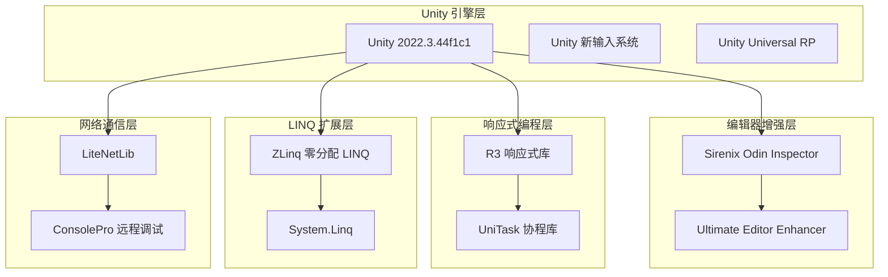
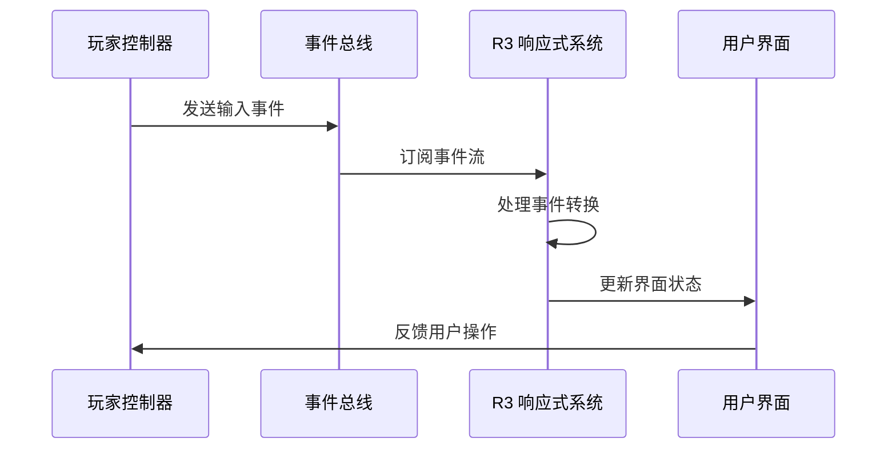
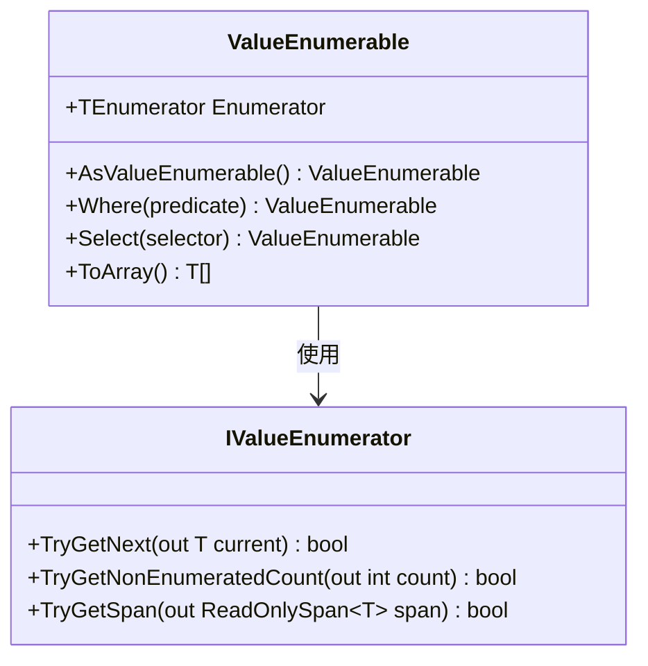
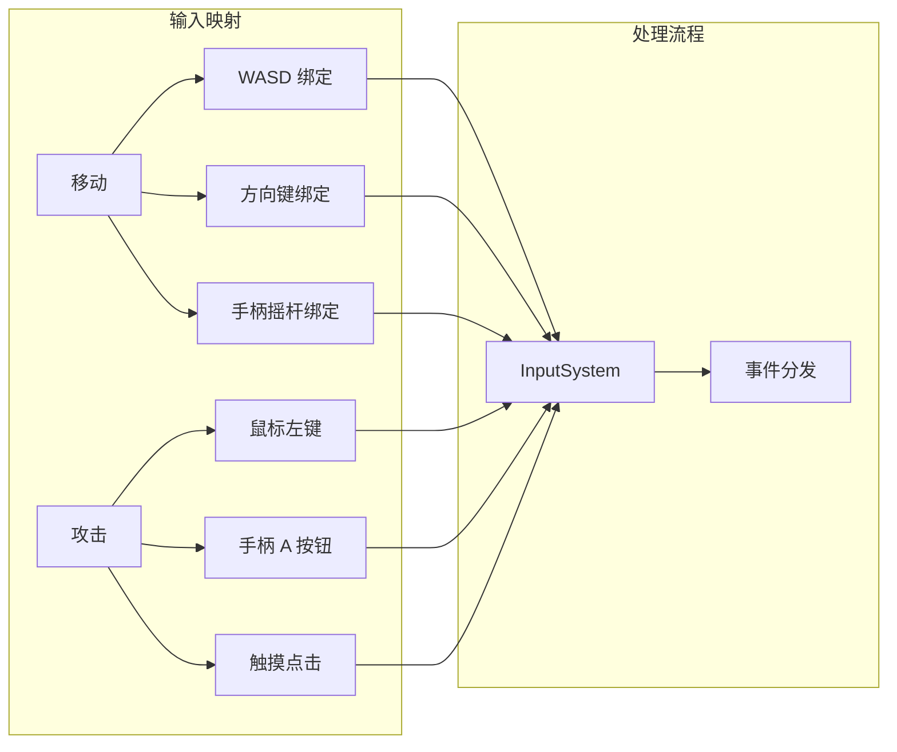
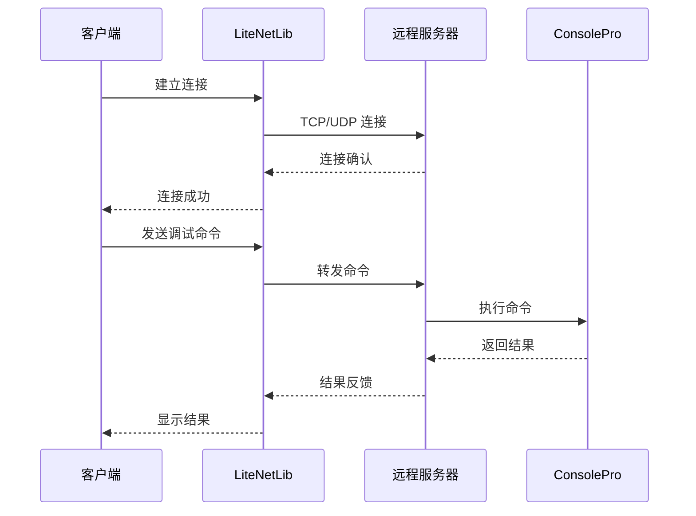
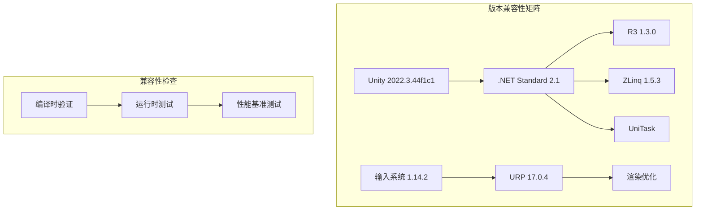

# 技术栈与依赖

<cite>
**本文档中引用的文件**
- [manifest.json](file://Packages/manifest.json)
- [packages-lock.json](file://Packages/packages-lock.json)
- [README.md](file://Assets/Packages/ZLinq.1.5.3/README.md)
- [InputSystem_Actions.cs](file://Assets/InputSystem_Actions.cs)
- [NetManager.cs](file://Assets/ConsolePro/Remote/LiteNetLib/NetManager.cs)
- [ProjectVersion.txt](file://ProjectSettings/ProjectVersion.txt)
- [InputSystem.cs](file://Assets/Scripts/Manager/InputSystem/InputSystem.cs)
- [EventBus.cs](file://Assets/Scripts/Manager/EventSystem/EventBus.cs)
- [MathematicsDrawers.cs](file://Assets/Sirenix/Odin Inspector/Modules/Unity.Mathematics/MathematicsDrawers.cs)
</cite>

## 目录
1. [项目概述](#项目概述)
2. [核心技术栈](#核心技术栈)
3. [Unity 2022.3.44f1c1 引擎](#unity-2022344f1c1-引擎)
4. [Sirenix Odin Inspector 编辑器增强工具](#sirenix-odin-inspector-编辑器增强工具)
5. [R3 响应式编程库](#r3-响应式编程库)
6. [ZLinq LINQ 扩展](#zlinq-linq-扩展)
7. [Unity 新输入系统](#unity-新输入系统)
8. [第三方包管理](#第三方包管理)
9. [LiteNetLib 网络库](#litnetlib-网络库)
10. [依赖兼容性与版本锁定](#依赖兼容性与版本锁定)
11. [开发环境配置指南](#开发环境配置指南)
12. [总结](#总结)

## 项目概述

本项目采用现代化的 Unity 开发技术栈，结合多个高性能第三方库构建了一个功能完整的游戏开发框架。项目充分利用了 Unity 2022.3.44f1c1 引擎的最新特性，同时集成了多个专业级工具和库来提升开发效率和性能表现。

## 核心技术栈

项目采用了以下核心技术组件：



**图表来源**
- [manifest.json](file://Packages/manifest.json#L1-L53)
- [packages-lock.json](file://Packages/packages-lock.json#L1-L567)

## Unity 2022.3.44f1c1 引擎

### 版本信息
项目使用 Unity 2022.3.44f1c1 版本，这是一个长期支持版本（LTS），提供了稳定性和丰富的功能支持。

### 主要特性
- **Universal Render Pipeline (URP)**：采用 Unity 的通用渲染管线，提供高质量的视觉效果和跨平台兼容性
- **新输入系统**：统一的输入处理框架，支持多种输入设备
- **改进的性能优化**：包括内存管理和 CPU 性能提升
- **增强的 VR/XR 支持**：更好的虚拟现实和扩展现实体验

### 技术优势
1. **稳定性**：作为 LTS 版本，具有长期维护和支持
2. **性能**：针对现代硬件进行了深度优化
3. **兼容性**：广泛的平台支持和设备兼容性
4. **生态系统**：丰富的插件和工具支持

**章节来源**
- [ProjectVersion.txt](file://ProjectSettings/ProjectVersion.txt#L1-L3)

## Sirenix Odin Inspector 编辑器增强工具

### 功能概述
Odin Inspector 是一个强大的 Unity 编辑器增强工具，提供了直观的属性检查器界面和高级的序列化功能。

### 核心功能
1. **可视化属性检查器**：提供更美观和易用的编辑界面
2. **高级序列化**：支持复杂数据类型的序列化和反序列化
3. **自定义绘制器**：允许开发者创建自定义的属性显示样式
4. **条件属性**：根据条件动态显示或隐藏属性
5. **数学类型支持**：专门针对 Unity 数学库的优化支持

### 技术优势
- **零反射**：避免运行时反射开销，提升性能
- **类型安全**：编译时类型检查，减少运行时错误
- **可扩展性**：丰富的 API 支持自定义扩展
- **跨平台**：在所有 Unity 支持的平台上保持一致的行为

### 在项目中的应用
项目中特别集成了对 Unity 数学库的支持，通过 `MathematicsDrawers.cs` 提供了针对数学类型的优化显示。

**章节来源**
- [MathematicsDrawers.cs](file://Assets/Sirenix/Odin Inspector/Modules/Unity.Mathematics/MathematicsDrawers.cs#L1-L50)

## R3 响应式编程库

### 库简介
R3 是一个高性能的响应式编程库，专为 Unity 和 .NET 平台设计，提供了强大的事件处理和数据流管理能力。

### 核心特性
1. **零分配设计**：最小化内存分配，适合游戏开发
2. **异步操作支持**：内置对异步操作的优化支持
3. **链式操作**：流畅的 API 设计，支持复杂的操作组合
4. **线程安全**：提供安全的多线程操作支持

### 在项目中的应用


**图表来源**
- [EventBus.cs](file://Assets/Scripts/Manager/EventSystem/EventBus.cs#L1-L16)

### 技术优势
- **高性能**：针对游戏开发场景优化的底层实现
- **类型安全**：强类型事件处理，减少运行时错误
- **内存效率**：零分配的设计理念
- **易于调试**：清晰的事件流追踪和调试支持

**章节来源**
- [packages-lock.json](file://Packages/packages-lock.json#L15-L25)

## ZLinq LINQ 扩展

### 库特性
ZLinq 是一个零分配的 LINQ 实现，专为高性能计算而设计，特别适合游戏开发中的大量数据处理需求。

### 核心优势
1. **零分配 LINQ**：避免传统 LINQ 的内存分配开销
2. **SIMD 优化**：自动利用 SIMD 指令加速计算
3. **树形结构支持**：扩展 LINQ 到文件系统、JSON 和 GameObject 树
4. **Span 支持**：完全兼容 .NET 9 的 Span 功能

### 技术实现


**图表来源**
- [README.md](file://Assets/Packages/ZLinq.1.5.3/README.md#L50-L100)

### 在项目中的应用
- **数据处理优化**：用于游戏对象的快速查询和过滤
- **性能关键路径**：在需要高频数据处理的场景中使用
- **内存敏感操作**：在内存受限环境中替代标准 LINQ

**章节来源**
- [README.md](file://Assets/Packages/ZLinq.1.5.3/README.md#L1-L100)

## Unity 新输入系统

### 系统架构
Unity 新输入系统提供了统一的输入处理框架，支持多种输入设备和复杂的输入映射。

### 核心组件
1. **InputActionAsset**：输入动作的配置文件
2. **InputActionMap**：输入动作的分组管理
3. **InputAction**：具体的输入动作定义
4. **InputControlScheme**：控制方案配置

### 输入绑定示例


**图表来源**
- [InputSystem_Actions.cs](file://Assets/InputSystem_Actions.cs#L1-L100)

### 技术优势
- **统一接口**：单一 API 处理所有输入设备
- **灵活配置**：支持运行时修改输入绑定
- **设备检测**：自动检测可用输入设备
- **跨平台**：统一的跨平台输入处理

**章节来源**
- [InputSystem_Actions.cs](file://Assets/InputSystem_Actions.cs#L1-L200)
- [InputSystem.cs](file://Assets/Scripts/Manager/InputSystem/InputSystem.cs#L1-L94)

## 第三方包管理

### 包管理策略
项目采用 Unity 的包管理器进行第三方库的管理，通过 `Packages/manifest.json` 文件定义依赖关系。

### 核心依赖包
| 包名称 | 版本 | 用途 | 来源 |
|--------|------|------|------|
| com.cysharp.r3 | Git | 响应式编程 | GitHub |
| com.cysharp.unitask | Git | 协程优化 | GitHub |
| com.cysharp.zlinq | Git | LINQ 扩展 | GitHub |
| com.unity.inputsystem | 1.14.2 | 输入系统 | Unity Registry |
| com.unity.render-pipelines.universal | 17.0.4 | 渲染管线 | Unity Registry |
| com.mibdev.fullscreen-editor | Embedded | 全屏编辑器 | 内置包 |

### 包管理优势
- **版本控制**：通过 `packages-lock.json` 锁定具体版本
- **一致性**：确保团队成员使用相同的依赖版本
- **可重复构建**：支持持续集成和部署
- **安全性**：跟踪依赖包的安全更新

**章节来源**
- [manifest.json](file://Packages/manifest.json#L1-L53)
- [packages-lock.json](file://Packages/packages-lock.json#L1-L100)

## LiteNetLib 网络库

### 库功能
LiteNetLib 是一个轻量级的网络库，主要用于项目中的远程调试功能。

### 核心特性
1. **轻量级设计**：最小化的内存占用和 CPU 使用
2. **可靠传输**：提供可靠的连接和消息传递
3. **多平台支持**：支持所有 Unity 支持的平台
4. **简单 API**：易于集成和使用的接口

### 在项目中的应用


**图表来源**
- [NetManager.cs](file://Assets/ConsolePro/Remote/LiteNetLib/NetManager.cs#L1-L100)

### 技术优势
- **低延迟**：优化的网络协议减少延迟
- **高吞吐量**：高效的网络数据传输
- **容错性**：内置的错误处理和重试机制
- **资源友好**：最小化的系统资源占用

**章节来源**
- [NetManager.cs](file://Assets/ConsolePro/Remote/LiteNetLib/NetManager.cs#L1-L200)

## 依赖兼容性与版本锁定

### 版本锁定机制
项目使用 `packages-lock.json` 文件实现精确的版本锁定，确保开发环境的一致性。

### 兼容性保证


### 兼容性策略
1. **向后兼容**：新版本保持对旧版本的兼容性
2. **渐进升级**：逐步升级依赖包，避免大规模重构
3. **测试覆盖**：全面的单元测试和集成测试
4. **监控告警**：依赖包安全漏洞的实时监控

**章节来源**
- [packages-lock.json](file://Packages/packages-lock.json#L1-L567)

## 开发环境配置指南

### 环境要求
1. **Unity 版本**：2022.3.44f1c1 或更高版本
2. **.NET 版本**：.NET Standard 2.1
3. **IDE**：推荐使用 Visual Studio 或 Rider
4. **Git**：版本控制系统

### 配置步骤

#### 1. Unity 环境设置
```bash
# 导入项目
open Unity Hub
add folder: path/to/project

# 设置目标平台
Edit > Project Settings > Player
  - Api Compatibility Level: .NET Standard 2.1
  - Scripting Backend: IL2CPP
  - Target Architectures: ARM64, x86_64
```

#### 2. 包管理器配置
```bash
# 打开包管理器
Window > Package Manager

# 添加私有注册表（如需要）
Advanced > Add package from git URL
  - com.cysharp.r3: https://github.com/Cysharp/R3.git?path=src/R3.Unity/Assets/R3.Unity
  - com.cysharp.unitask: https://github.com/Cysharp/UniTask.git?path=src/UniTask/Assets/Plugins/UniTask
  - com.cysharp.zlinq: https://github.com/Cysharp/ZLinq.git?path=src/ZLinq.Unity/Assets/ZLinq.Unity
```

#### 3. 输入系统配置
```csharp
// 创建输入动作资产
Assets > Create > Input Actions
  - 名称: InputSystem_Actions
  - 保存位置: Assets/

// 配置输入动作
  - 添加动作组: Player
  - 添加动作: Move, Look, Attack, Sprint 等
  - 配置绑定: 键盘、鼠标、手柄等
```

#### 4. 编辑器增强配置
```bash
# 安装 Sirenix Odin Inspector
Window > Package Manager > Add package from git URL
  - odin-inspector: https://github.com/odininspector/odin-inspector.git

# 配置 Ultimate Editor Enhancer
Tools > Ultimate Editor Enhancer > Settings
  - 启用所需的功能模块
  - 自定义快捷键绑定
```

### 最佳实践
1. **定期更新**：及时更新依赖包以获得性能改进和安全修复
2. **分支隔离**：为不同功能开发创建独立的分支
3. **代码审查**：实施严格的代码审查流程
4. **自动化测试**：建立完善的自动化测试体系

## 总结

本项目的技术栈体现了现代 Unity 开发的最佳实践，通过精心选择的第三方库和工具，实现了高性能、高可维护性的游戏开发框架。

### 技术亮点
- **性能优先**：通过 R3、ZLinq 等库实现零分配和高性能计算
- **开发效率**：Odin Inspector 和新输入系统大幅提升开发体验
- **可扩展性**：模块化设计支持功能的灵活扩展
- **跨平台**：统一的架构支持多平台部署

### 发展方向
1. **性能优化**：持续优化关键路径的性能表现
2. **功能扩展**：根据项目需求添加新的功能模块
3. **工具完善**：进一步完善开发工具和调试功能
4. **社区贡献**：积极参与开源社区，贡献代码和经验

通过这套技术栈，项目能够在保证开发效率的同时，提供优秀的用户体验和稳定的性能表现，为后续的功能开发奠定了坚实的基础。