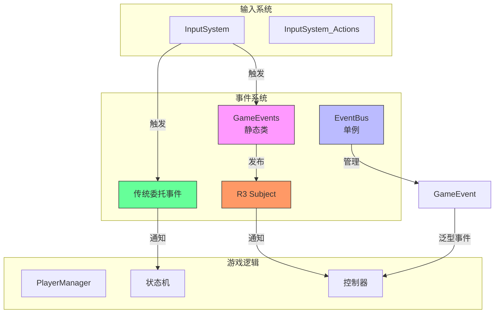
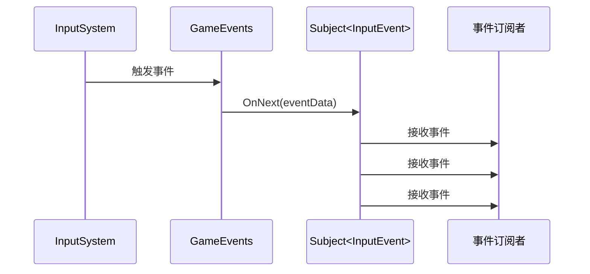
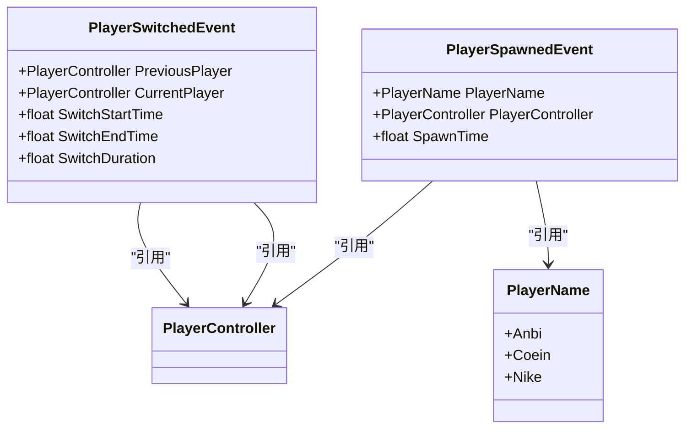
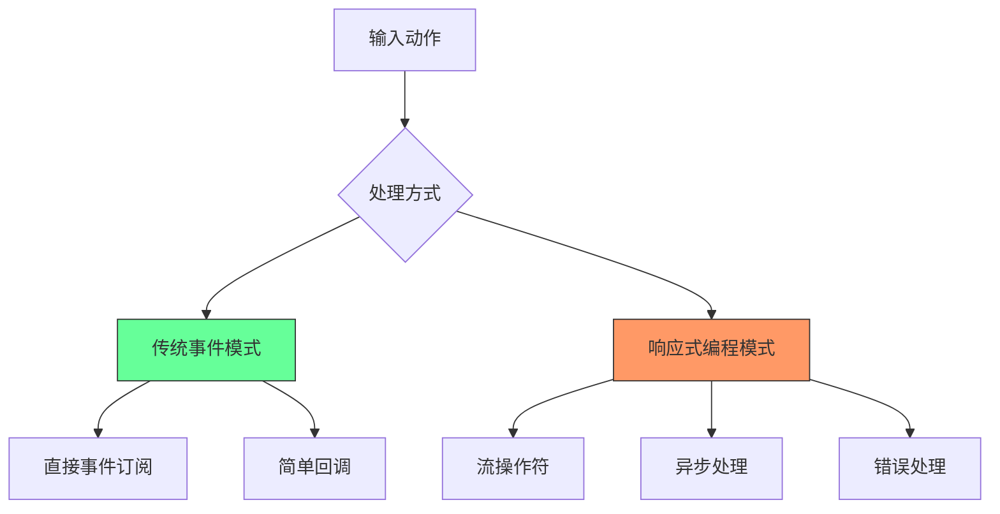
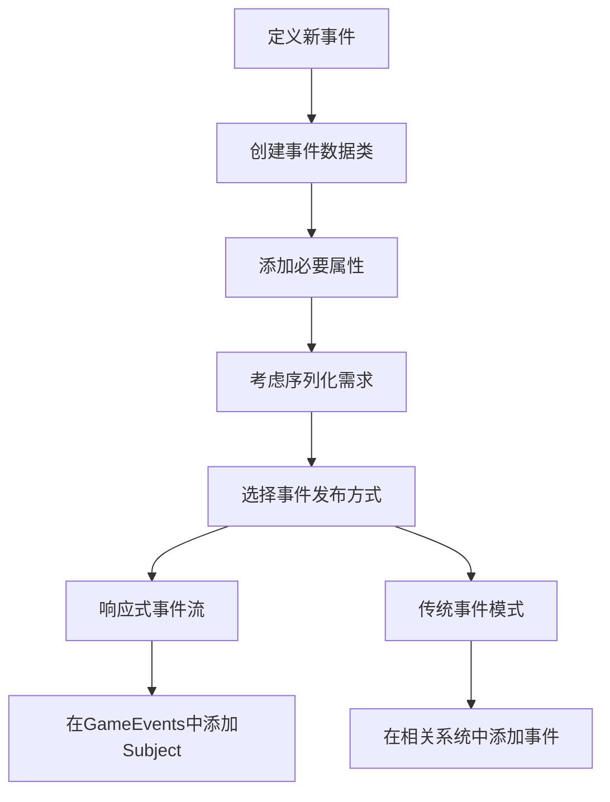

# 事件定义

<cite>
**本文档引用的文件**
- [GameEvents.cs](file://Assets/Scripts/Manager/EventSystem/GameEvents.cs)
- [IEvent.cs](file://Assets/Scripts/Manager/EventSystem/IEvent.cs)
- [PlayerEvents.cs](file://Assets/Scripts/EventData/PlayerEvents.cs)
- [GameEvent.cs](file://Assets/Scripts/Manager/EventSystem/GameEvent.cs)
- [EventBus.cs](file://Assets/Scripts/Manager/EventSystem/EventBus.cs)
- [EventLists.cs](file://Assets/Scripts/Manager/EventSystem/EventLists.cs)
- [InputSystem.cs](file://Assets/Scripts/Manager/InputSystem/InputSystem.cs)
- [InputSystem_Actions.cs](file://Assets/InputSystem_Actions.cs)
- [PlayerManager.cs](file://Assets/Scripts/Manager/PlayerManager/PlayerManager.cs)
- [BaseState.cs](file://Assets/Scripts/Controller/FSM/BaseState.cs)
- [RunState.cs](file://Assets/Scripts/Controller/FSM/CharacterState/RunState.cs)
- [技术文档.md](file://Assets/Scripts/技术文档.md)
</cite>

## 目录
1. [简介](#简介)
2. [事件系统架构](#事件系统架构)
3. [GameEvents静态类与R3响应式事件流](#gameevents静态类与r3响应式事件流)
4. [IEvent接口设计意图](#ievent接口设计意图)
5. [具体事件数据类分析](#具体事件数据类分析)
6. [响应式编程与传统事件模式集成](#响应式编程与传统事件模式集成)
7. [新事件类型定义与使用示例](#新事件类型定义与使用示例)
8. [事件版本控制与向后兼容性](#事件版本控制与向后兼容性)
9. [结论](#结论)

## 简介
本项目采用混合事件处理模式，结合了响应式编程（R3库）和传统事件系统。事件系统是游戏架构的核心组成部分，负责解耦游戏组件间的通信，实现松耦合的设计模式。系统主要由GameEvents静态类、EventBus事件总线和各种具体事件数据类组成，支持基于R3 Subject的响应式事件流和传统的委托事件模式。

## 事件系统架构



**图示来源**
- [GameEvents.cs](file://Assets/Scripts/Manager/EventSystem/GameEvents.cs)
- [EventBus.cs](file://Assets/Scripts/Manager/EventSystem/EventBus.cs)
- [InputSystem.cs](file://Assets/Scripts/Manager/InputSystem/InputSystem.cs)

## GameEvents静态类与R3响应式事件流

GameEvents静态类是项目中响应式事件流的核心，使用R3库的Subject实现基于观察者模式的事件系统。该类定义了各种只读的静态Subject字段，作为特定事件类型的发布点。

在当前实现中，GameEvents类主要定义了OnInput事件，这是一个基于R3 Subject的响应式事件流，用于处理输入相关的事件。这种设计模式允许订阅者以响应式编程的方式监听和处理事件，提供了更好的流控制、错误处理和资源管理能力。

R3 Subject作为热信号（Hot Observable），允许多个订阅者同时监听同一个事件流。当事件发生时，所有订阅者都会收到通知。这种模式特别适合处理高频事件（如输入事件），因为它避免了传统事件系统中可能出现的事件丢失问题。



**图示来源**
- [GameEvents.cs](file://Assets/Scripts/Manager/EventSystem/GameEvents.cs)
- [InputSystem.cs](file://Assets/Scripts/Manager/InputSystem/InputSystem.cs)

**本节来源**
- [GameEvents.cs](file://Assets/Scripts/Manager/EventSystem/GameEvents.cs#L1-L23)
- [InputSystem.cs](file://Assets/Scripts/Manager/InputSystem/InputSystem.cs#L70-L75)

## IEvent接口设计意图

IEvent接口定义了事件系统的基本契约，提供了事件订阅、取消订阅和触发的标准方法。该接口的设计意图是创建一个统一的事件处理模式，使不同类型的事件能够遵循相同的接口规范。

通过IEvent接口，系统实现了事件处理的标准化，使得任何实现了该接口的类都能够以一致的方式进行事件管理。这种设计模式提高了代码的可维护性和可扩展性，新的事件类型只需实现IEvent接口即可无缝集成到现有的事件系统中。

接口的泛型方法设计允许类型安全的事件处理，避免了运行时类型转换错误。同时，这种设计也支持事件的链式调用和组合，为复杂的事件处理逻辑提供了基础。

**本节来源**
- [IEvent.cs](file://Assets/Scripts/Manager/EventSystem/IEvent.cs#L1-L6)

## 具体事件数据类分析

### PlayerEvents事件数据类

PlayerEvents文件定义了与玩家相关的具体事件数据类，包括PlayerSwitchedEvent和PlayerSpawnedEvent。这些类使用[Serializable]属性标记，表明它们可以被序列化，便于在编辑器中配置和调试。



**图示来源**
- [PlayerEvents.cs](file://Assets/Scripts/EventData/PlayerEvents.cs#L1-L18)
- [PlayerManager.cs](file://Assets/Scripts/Manager/PlayerManager/PlayerManager.cs#L1-L10)

#### PlayerSwitchedEvent结构设计
PlayerSwitchedEvent类记录了玩家切换过程中的关键信息，包括前一个玩家、当前玩家、切换开始和结束时间。该类还提供了一个计算属性SwitchDuration，用于获取切换过程的持续时间。这种设计将相关数据封装在一起，提供了完整的上下文信息，便于事件处理逻辑使用。

#### PlayerSpawnedEvent结构设计
PlayerSpawnedEvent类记录了玩家生成时的信息，包括玩家名称、玩家控制器引用和生成时间。这种设计模式将玩家身份标识与游戏对象引用分离，提高了数据的灵活性和可维护性。

**本节来源**
- [PlayerEvents.cs](file://Assets/Scripts/EventData/PlayerEvents.cs#L1-L18)
- [PlayerManager.cs](file://Assets/Scripts/Manager/PlayerManager/PlayerManager.cs#L1-L10)

## 响应式编程与传统事件模式集成

项目采用了响应式编程（R3）与传统事件模式的混合集成策略。这种策略结合了两种模式的优点：响应式编程提供了强大的流处理能力，而传统事件模式则简单直观，易于理解和使用。

在InputSystem中，可以看到这种混合模式的具体实现：系统既使用了传统的C#事件（如OnMovePerformed、OnAttackEvent等），又通过GameEvents.OnInput发布R3事件流。这种设计允许不同组件根据自身需求选择合适的事件处理方式。



**图示来源**
- [InputSystem.cs](file://Assets/Scripts/Manager/InputSystem/InputSystem.cs#L34-L69)
- [GameEvents.cs](file://Assets/Scripts/Manager/EventSystem/GameEvents.cs#L1-L23)

在状态机实现中，传统事件模式被广泛使用。例如，在RunState的OnEnter方法中，通过订阅InputSystem的事件来响应玩家输入。这种模式适合处理明确的、离散的事件，代码逻辑清晰，易于调试。

**本节来源**
- [InputSystem.cs](file://Assets/Scripts/Manager/InputSystem/InputSystem.cs#L70-L75)
- [RunState.cs](file://Assets/Scripts/Controller/FSM/CharacterState/RunState.cs#L1-L25)
- [BaseState.cs](file://Assets/Scripts/Controller/FSM/BaseState.cs#L48-L84)

## 新事件类型定义与使用示例

### 定义新事件类型

要定义新的事件类型，首先需要在适当的事件数据文件中创建新的事件数据类。根据项目结构，可以将新的事件类添加到EventLists.cs或创建专门的事件数据文件。



**本节来源**
- [技术文档.md](file://Assets/Scripts/技术文档.md#L253-L267)

### 发布R3事件流

发布R3事件流的典型模式是在适当的系统中触发GameEvents中的Subject。以输入事件为例：

```csharp
// 在InputSystem中发布OnInput事件
InputActions.Player.Move.performed += ctx =>
{
    OnMovePerformed?.Invoke(ctx);
    GameEvents.OnInput?.OnNext(new InputEvent());
};
```

这种模式确保了事件能够通过响应式流被所有订阅者接收，同时保持了与传统事件系统的兼容性。

### 订阅混合事件模式

组件可以根据需要选择订阅响应式事件流或传统事件。对于需要复杂流处理逻辑的场景，推荐使用响应式编程模式；对于简单的状态切换或直接操作，传统事件模式更为合适。

**本节来源**
- [InputSystem.cs](file://Assets/Scripts/Manager/InputSystem/InputSystem.cs#L70-L75)
- [GameEvents.cs](file://Assets/Scripts/Manager/EventSystem/GameEvents.cs#L1-L23)

## 事件版本控制与向后兼容性

通过对项目代码的分析，目前没有发现明确的事件版本控制策略。然而，在第三方插件代码中发现了关于向后兼容性的实践，如使用Obsolete属性标记已弃用的成员。

在实际开发中，建议采用以下策略来确保事件系统的向后兼容性：

1. **避免删除现有事件**：当需要修改事件时，优先考虑扩展而非删除
2. **使用版本标记**：在事件数据类中添加版本号属性，便于处理不同版本的事件数据
3. **提供转换适配器**：为旧版本事件创建适配器，将其转换为新版本格式
4. **渐进式迁移**：允许新旧事件系统并存，逐步迁移组件到新系统

虽然当前项目没有实现完整的版本控制机制，但其模块化的设计为未来添加此类功能提供了良好的基础。

**本节来源**
- [NavMeshLink.deprecated.cs](file://Library/PackageCache/com.unity.ai.navigation@5218e4bf7edc/Runtime/NavMeshLink.deprecated.cs)
- [技术文档.md](file://Assets/Scripts/技术文档.md#L253-L267)

## 结论

本项目的事件系统采用了响应式编程与传统事件模式相结合的混合架构。GameEvents静态类基于R3 Subject提供了响应式事件流，特别适合处理高频输入事件。IEvent接口定义了统一的事件处理契约，促进了代码的标准化。PlayerEvents中的具体事件数据类通过合理的结构设计，提供了丰富的上下文信息。

系统成功集成了响应式编程的强大功能与传统事件模式的简洁性，为不同场景提供了灵活的选择。虽然目前缺乏明确的事件版本控制策略，但其良好的架构设计为未来的扩展和维护奠定了坚实的基础。建议在后续开发中引入更完善的版本控制机制，以确保系统的长期稳定性和兼容性。