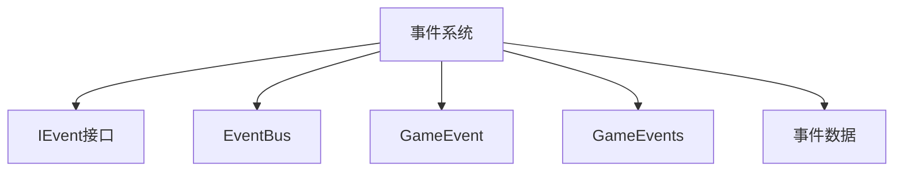
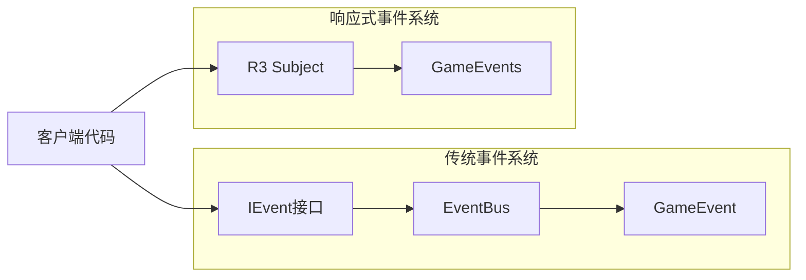
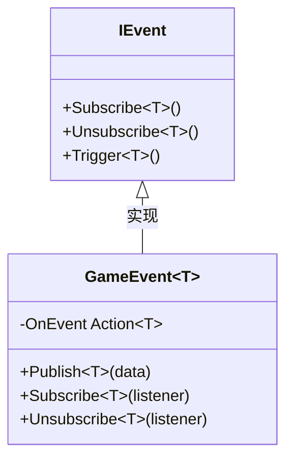
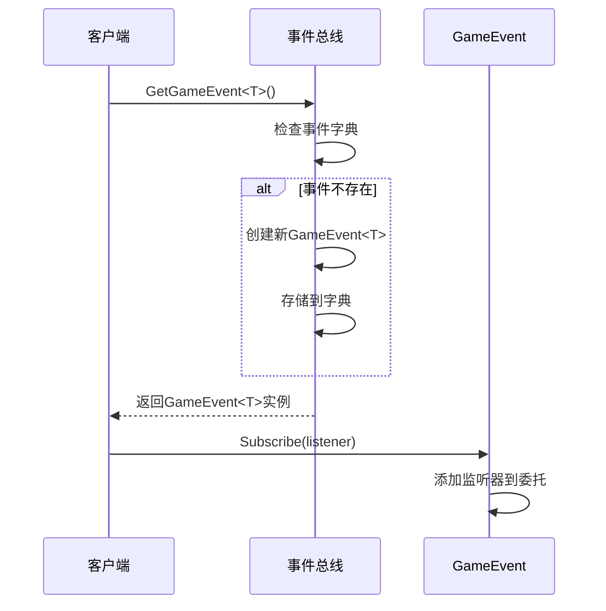
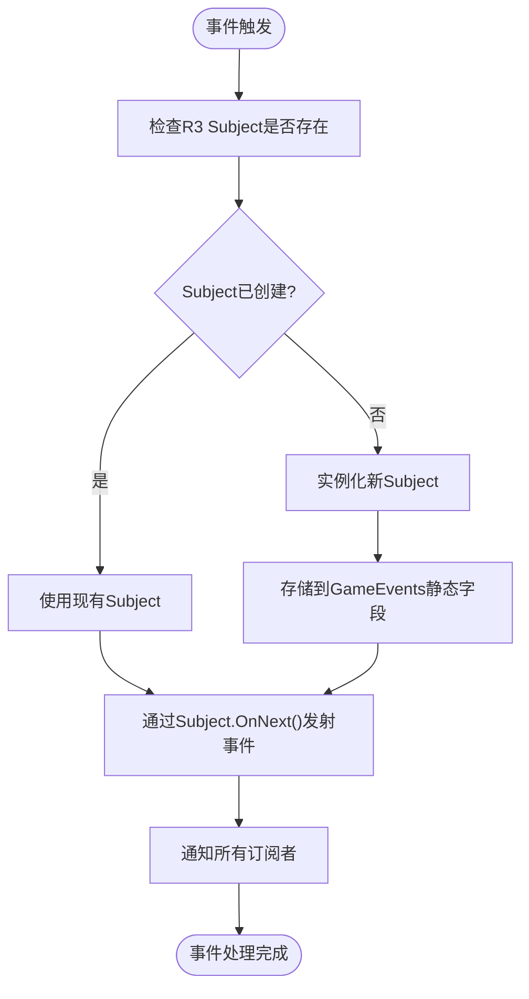
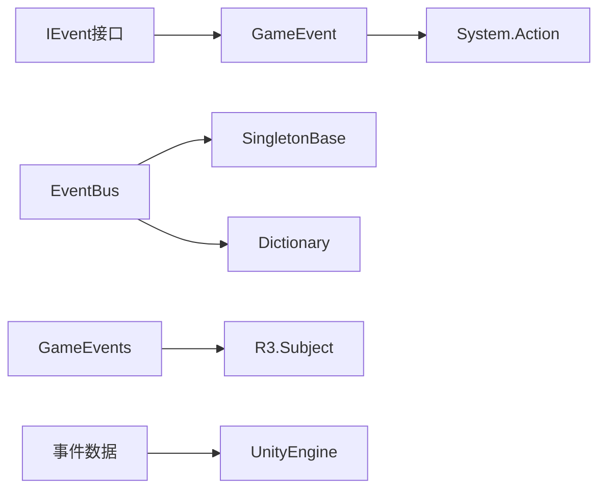

# 事件接口契约

<cite>
**本文档引用的文件**
- [IEvent.cs](file://Assets/Scripts/Manager/EventSystem/IEvent.cs)
- [GameEvent.cs](file://Assets/Scripts/Manager/EventSystem/GameEvent.cs)
- [EventBus.cs](file://Assets/Scripts/Manager/EventSystem/EventBus.cs)
- [GameEvents.cs](file://Assets/Scripts/Manager/EventSystem/GameEvents.cs)
- [EventLists.cs](file://Assets/Scripts/Manager/EventSystem/EventLists.cs)
- [PlayerEvents.cs](file://Assets/Scripts/EventData/PlayerEvents.cs)
- [R3.xml](file://Assets/Packages/R3.1.3.0/lib/netstandard2.1/R3.xml)
</cite>

## 目录
1. [引言](#引言)
2. [项目结构](#项目结构)
3. [核心组件](#核心组件)
4. [架构概述](#架构概述)
5. [详细组件分析](#详细组件分析)
6. [依赖分析](#依赖分析)
7. [性能考虑](#性能考虑)
8. [故障排除指南](#故障排除指南)
9. [结论](#结论)

## 引言
本文档深入解析IEvent接口作为事件处理统一契约的设计意图，详细说明其三个泛型方法的预期行为和实现约束。探讨该接口如何促进事件系统的模块化和可扩展性，以及它在不同事件实现之间提供抽象层的作用。

## 项目结构
项目中的事件系统主要位于Assets/Scripts/Manager/EventSystem目录下，包含核心接口、事件总线、具体事件实现和事件数据定义。事件系统与R3响应式编程库集成，同时定义了丰富的事件数据结构。

**Diagram sources**
- [IEvent.cs](file://Assets/Scripts/Manager/EventSystem/IEvent.cs#L1-L5)
- [EventBus.cs](file://Assets/Scripts/Manager/EventSystem/EventBus.cs#L1-L15)

**Section sources**
- [IEvent.cs](file://Assets/Scripts/Manager/EventSystem/IEvent.cs#L1-L5)
- [EventBus.cs](file://Assets/Scripts/Manager/EventSystem/EventBus.cs#L1-L15)

## 核心组件
IEvent接口定义了事件处理的统一契约，包括订阅、取消订阅和触发三个核心操作。EventBus作为单例模式的事件总线，管理所有事件实例。GameEvent提供了基于委托的具体事件实现，而GameEvents则利用R3库的Subject实现了响应式事件流。

**Section sources**
- [IEvent.cs](file://Assets/Scripts/Manager/EventSystem/IEvent.cs#L1-L5)
- [EventBus.cs](file://Assets/Scripts/Manager/EventSystem/EventBus.cs#L1-L15)
- [GameEvent.cs](file://Assets/Scripts/Manager/EventSystem/GameEvent.cs#L1-L20)
- [GameEvents.cs](file://Assets/Scripts/Manager/EventSystem/GameEvents.cs#L1-L23)

## 架构概述
事件系统采用双重架构设计：一方面通过IEvent接口和EventBus提供传统的发布-订阅模式，另一方面通过R3的Subject实现响应式事件流。这种设计允许系统在不同场景下选择最适合的事件处理方式。

**Diagram sources**
- [IEvent.cs](file://Assets/Scripts/Manager/EventSystem/IEvent.cs#L1-L5)
- [EventBus.cs](file://Assets/Scripts/Manager/EventSystem/EventBus.cs#L1-L15)
- [GameEvents.cs](file://Assets/Scripts/Manager/EventSystem/GameEvents.cs#L1-L23)

## 详细组件分析

### IEvent接口分析
IEvent接口作为事件处理的统一契约，定义了所有事件实现必须遵循的基本操作。该接口采用泛型设计，支持类型安全的事件处理。

**Diagram sources**
- [IEvent.cs](file://Assets/Scripts/Manager/EventSystem/IEvent.cs#L1-L5)
- [GameEvent.cs](file://Assets/Scripts/Manager/EventSystem/GameEvent.cs#L1-L20)

**Section sources**
- [IEvent.cs](file://Assets/Scripts/Manager/EventSystem/IEvent.cs#L1-L5)
- [GameEvent.cs](file://Assets/Scripts/Manager/EventSystem/GameEvent.cs#L1-L20)

### EventBus分析
EventBus作为单例模式的事件总线，负责管理所有事件实例的生命周期。它使用字典存储不同类型的事件，确保每种事件类型只有一个实例。

**Diagram sources**
- [EventBus.cs](file://Assets/Scripts/Manager/EventSystem/EventBus.cs#L1-L15)
- [GameEvent.cs](file://Assets/Scripts/Manager/EventSystem/GameEvent.cs#L1-L20)

### GameEvents响应式事件分析
GameEvents类利用R3库的Subject实现了响应式事件流，提供了现代的响应式编程能力。虽然大部分事件被注释，但InputEvent的OnInput事件已被启用。

**Diagram sources**
- [GameEvents.cs](file://Assets/Scripts/Manager/EventSystem/GameEvents.cs#L1-L23)
- [R3.xml](file://Assets/Packages/R3.1.3.0/lib/netstandard2.1/R3.xml#L1-L100)

## 依赖分析
事件系统依赖于R3响应式编程库提供响应式事件流功能，同时使用Unity的System库进行基本的数据结构操作。EventBus依赖于SingletonBase基类实现单例模式。

**Diagram sources**
- [IEvent.cs](file://Assets/Scripts/Manager/EventSystem/IEvent.cs#L1-L5)
- [EventBus.cs](file://Assets/Scripts/Manager/EventSystem/EventBus.cs#L1-L15)
- [GameEvent.cs](file://Assets/Scripts/Manager/EventSystem/GameEvent.cs#L1-L20)
- [GameEvents.cs](file://Assets/Scripts/Manager/EventSystem/GameEvents.cs#L1-L23)

**Section sources**
- [IEvent.cs](file://Assets/Scripts/Manager/EventSystem/IEvent.cs#L1-L5)
- [EventBus.cs](file://Assets/Scripts/Manager/EventSystem/EventBus.cs#L1-L15)
- [GameEvent.cs](file://Assets/Scripts/Manager/EventSystem/GameEvent.cs#L1-L20)
- [GameEvents.cs](file://Assets/Scripts/Manager/EventSystem/GameEvents.cs#L1-L23)

## 性能考虑
事件系统的性能主要受委托调用和内存分配的影响。传统的GameEvent使用C#委托，性能较高但缺乏响应式编程的高级功能。R3的Subject提供了丰富的响应式操作符，但可能引入额外的内存开销。建议在高频事件中使用传统的GameEvent，在需要复杂事件流处理的场景中使用R3 Subject。

## 故障排除指南
常见问题包括事件订阅后未触发、内存泄漏和类型不匹配。确保在对象销毁时取消订阅，使用正确的泛型类型参数，并检查EventBus是否正确初始化。对于R3 Subject，确保在适当的作用域内管理订阅生命周期。

**Section sources**
- [GameEvent.cs](file://Assets/Scripts/Manager/EventSystem/GameEvent.cs#L1-L20)
- [EventBus.cs](file://Assets/Scripts/Manager/EventSystem/EventBus.cs#L1-L15)
- [GameEvents.cs](file://Assets/Scripts/Manager/EventSystem/GameEvents.cs#L1-L23)

## 结论
IEvent接口为项目提供了事件处理的统一契约，促进了系统的模块化和可扩展性。双重事件架构设计既保留了传统发布-订阅模式的简单高效，又引入了响应式编程的强大功能。通过合理选择事件实现方式，可以满足不同场景下的性能和功能需求。