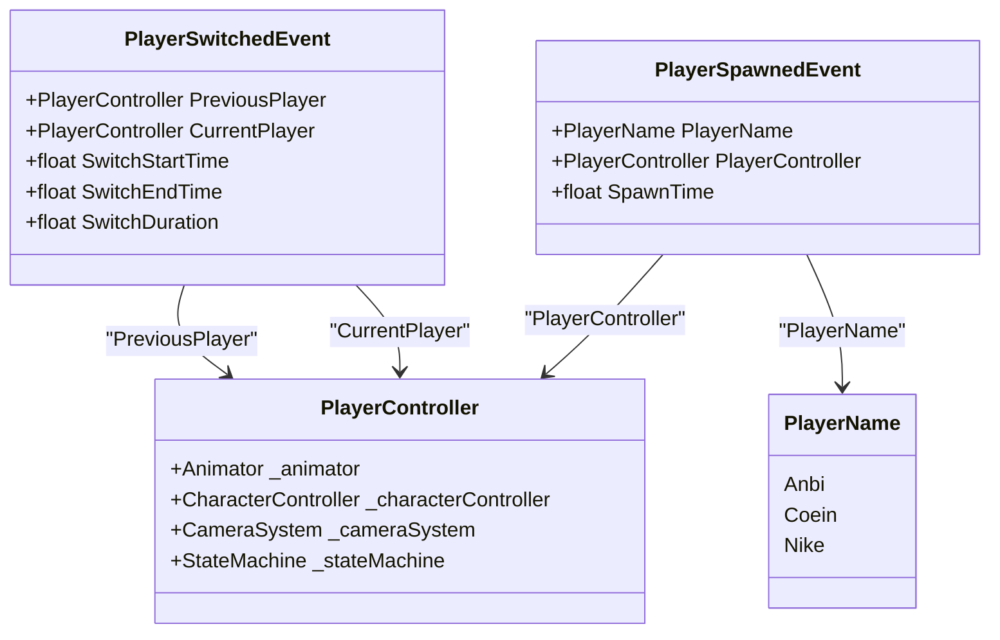
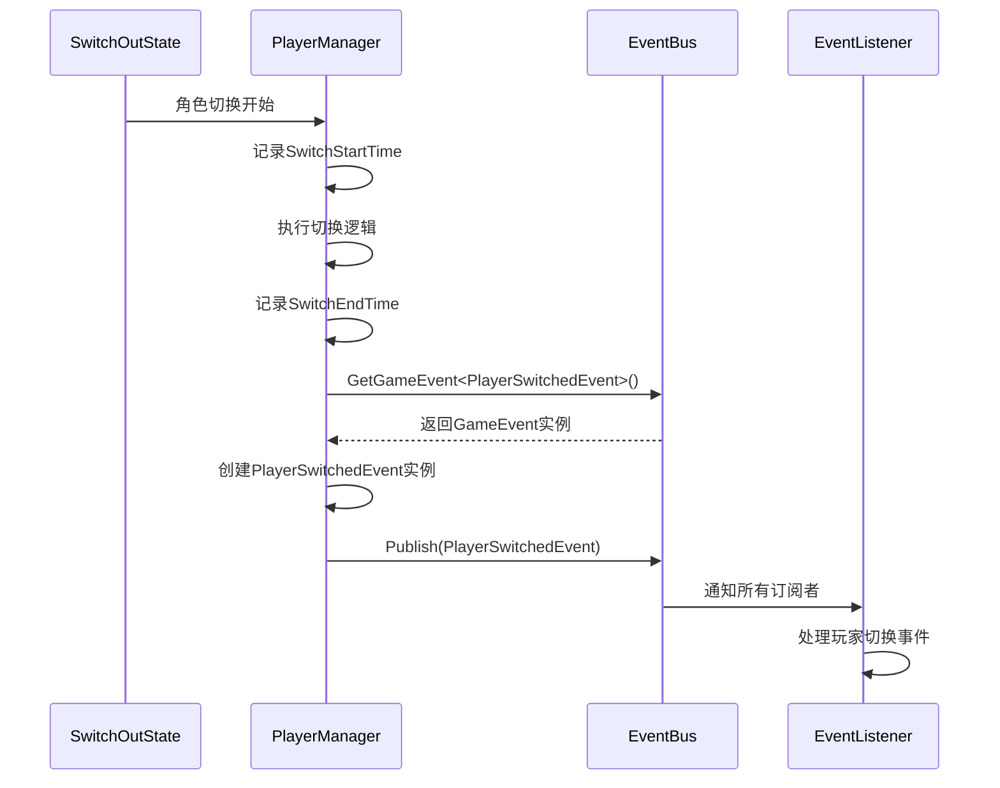
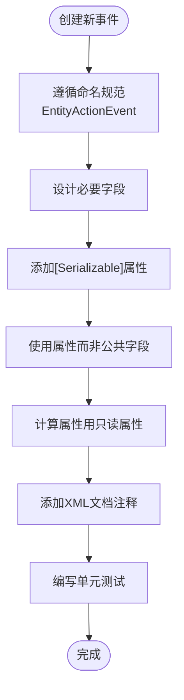

# 具体事件类型

<cite>
**本文档引用的文件**
- [PlayerEvents.cs](file://Assets/Scripts/EventData/PlayerEvents.cs)
- [PlayerManager.cs](file://Assets/Scripts/Manager/PlayerManager/PlayerManager.cs)
- [EventBus.cs](file://Assets/Scripts/Manager/EventSystem/EventBus.cs)
- [GameEvent.cs](file://Assets/Scripts/Manager/EventSystem/GameEvent.cs)
- [PlayerController.cs](file://Assets/Scripts/Controller/PlayerController.cs)
</cite>

## 目录
1. [引言](#引言)
2. [核心事件类型结构](#核心事件类型结构)
3. [PlayerSwitchedEvent 详细分析](#playerswitchedevent-详细分析)
4. [PlayerSpawnedEvent 详细分析](#playerspawnedevent-详细分析)
5. [事件数据封装与传递机制](#事件数据封装与传递机制)
6. [事件触发与处理流程](#事件触发与处理流程)
7. [新事件数据类设计最佳实践](#新事件数据类设计最佳实践)
8. [结论](#结论)

## 引言
本文档详细分析Unity项目中的具体事件数据类型，重点关注PlayerSwitchedEvent和PlayerSpawnedEvent的结构设计。这些事件类作为游戏状态变更的载体，在系统间传递关键信息。文档将深入探讨其字段设计、序列化特性、只读属性计算逻辑以及在事件流中的应用方式。

**Section sources**
- [PlayerEvents.cs](file://Assets/Scripts/EventData/PlayerEvents.cs#L1-L18)

## 核心事件类型结构
项目中的事件数据类型采用C#的[Serializable]属性标记，确保对象可以在Unity编辑器中序列化和持久化。这些类通常包含描述特定游戏事件状态的字段，通过属性封装提供类型安全的访问。事件数据类作为轻量级数据容器，不包含业务逻辑，仅用于在事件发布-订阅系统中传递信息。



**Diagram sources**
- [PlayerEvents.cs](file://Assets/Scripts/EventData/PlayerEvents.cs#L3-L18)
- [PlayerController.cs](file://Assets/Scripts/Controller/PlayerController.cs#L2-L102)
- [PlayerManager.cs](file://Assets/Scripts/Manager/PlayerManager/PlayerManager.cs#L3-L8)

## PlayerSwitchedEvent 详细分析
PlayerSwitchedEvent类用于表示玩家角色切换完成的事件。该事件包含切换前后的玩家引用、切换开始和结束时间戳，以及一个计算属性SwitchDuration。

### 字段业务含义与数据类型
- **PreviousPlayer**: 切换前的玩家控制器引用，类型为PlayerController，用于访问前一个角色的状态和属性
- **CurrentPlayer**: 切换后的玩家控制器引用，类型为PlayerController，表示当前激活的角色
- **SwitchStartTime**: 切换开始的时间戳（以秒为单位），类型为float，通常使用Time.time获取
- **SwitchEndTime**: 切换结束的时间戳（以秒为单位），类型为float，记录切换完成的时刻
- **SwitchDuration**: 只读属性，计算切换过程的持续时间

### SwitchDuration计算逻辑
SwitchDuration属性是一个只读的计算属性，其值为SwitchEndTime与SwitchStartTime的差值：
```csharp
public float SwitchDuration => SwitchEndTime - SwitchStartTime;
```
这个设计确保了持续时间始终基于实际的开始和结束时间计算，避免了数据不一致的风险。在游戏逻辑中，SwitchDuration可用于：
- 分析玩家切换角色的频率和模式
- 平衡游戏机制，根据切换速度调整奖励或惩罚
- 调试和性能分析，监控状态切换的耗时
- 动画同步，确保切换动画与实际持续时间匹配

**Section sources**
- [PlayerEvents.cs](file://Assets/Scripts/EventData/PlayerEvents.cs#L3-L12)

## PlayerSpawnedEvent 详细分析
PlayerSpawnedEvent类用于表示玩家角色生成的事件。该事件包含新生成玩家的相关信息。

### 字段业务含义与数据类型
- **PlayerName**: 生成玩家的角色名称，类型为PlayerName枚举，目前包含Anbi、Coein、Nike三个预定义角色
- **PlayerController**: 新生成玩家的控制器引用，类型为PlayerController，用于后续操作和状态管理
- **SpawnTime**: 生成时间戳（以秒为单位），类型为float，记录玩家生成的精确时刻

### 序列化特性
两个事件类都使用[Serializable]属性标记，这使得：
- 事件对象可以在Unity编辑器中被序列化和保存
- 事件数据可以跨场景传递和持久化
- 在调试时可以在Inspector中查看事件实例的详细信息
- 支持通过网络传输事件数据（如果集成网络功能）

**Section sources**
- [PlayerEvents.cs](file://Assets/Scripts/EventData/PlayerEvents.cs#L13-L18)
- [PlayerManager.cs](file://Assets/Scripts/Manager/PlayerManager/PlayerManager.cs#L3-L8)

## 事件数据封装与传递机制
事件数据类作为事件流的载荷，在系统间传递状态变更信息。项目采用发布-订阅模式实现事件系统，通过EventBus进行事件管理。

### 事件封装原则
- **单一职责**: 每个事件类只表示一种特定类型的游戏状态变更
- **数据完整性**: 包含处理事件所需的所有必要信息，避免额外查询
- **不可变性**: 事件发布后不应被修改，确保处理的一致性
- **轻量化**: 仅包含必要字段，减少内存开销和序列化成本

### 事件传递流程


**Diagram sources**
- [PlayerEvents.cs](file://Assets/Scripts/EventData/PlayerEvents.cs#L3-L18)
- [EventBus.cs](file://Assets/Scripts/Manager/EventSystem/EventBus.cs#L3-L15)
- [GameEvent.cs](file://Assets/Scripts/Manager/EventSystem/GameEvent.cs#L3-L20)

## 事件触发与处理流程
虽然当前代码中未直接显示PlayerSwitchedEvent和PlayerSpawnedEvent的触发代码，但可以推断其使用模式基于项目中的事件系统架构。

### 事件实例化示例
```csharp
// 角色切换完成后触发事件
void OnSwitchComplete()
{
    var switchEvent = new PlayerSwitchedEvent
    {
        PreviousPlayer = previousPlayer,
        CurrentPlayer = currentPlayer,
        SwitchStartTime = startTime,
        SwitchEndTime = Time.time
    };
    
    // 通过EventBus发布事件
    EventBus.Instance.GetGameEvent<PlayerSwitchedEvent>().Publish(switchEvent);
}

// 玩家生成时触发事件
void OnPlayerSpawned(PlayerController player, PlayerName name)
{
    var spawnEvent = new PlayerSpawnedEvent
    {
        PlayerName = name,
        PlayerController = player,
        SpawnTime = Time.time
    };
    
    EventBus.Instance.GetGameEvent<PlayerSpawnedEvent>().Publish(spawnEvent);
}
```

### 事件订阅示例
```csharp
// 订阅玩家切换事件
EventBus.Instance.GetGameEvent<PlayerSwitchedEvent>().Subscribe(OnPlayerSwitched);

void OnPlayerSwitched(PlayerSwitchedEvent eventData)
{
    Debug.Log($"玩家从 {eventData.PreviousPlayer.name} 切换到 {eventData.CurrentPlayer.name}");
    Debug.Log($"切换耗时: {eventData.SwitchDuration}秒");
    
    // 更新UI、调整摄像机等后续处理
    UpdateCameraTarget(eventData.CurrentPlayer);
    UpdatePlayerUI(eventData.CurrentPlayer);
}
```

**Section sources**
- [PlayerEvents.cs](file://Assets/Scripts/EventData/PlayerEvents.cs#L3-L18)
- [EventBus.cs](file://Assets/Scripts/Manager/EventSystem/EventBus.cs#L3-L15)
- [GameEvent.cs](file://Assets/Scripts/Manager/EventSystem/GameEvent.cs#L3-L20)

## 新事件数据类设计最佳实践
基于现有代码结构，创建新的事件数据类应遵循以下最佳实践：

### 命名规范
- 使用"实体+动作+Event"的命名模式，如PlayerSwitchedEvent
- 保持命名的一致性和可预测性
- 避免缩写和模糊术语

### 字段设计原则
- **必要性**: 只包含事件处理必需的字段
- **类型安全**: 使用具体类型而非object，避免运行时类型转换
- **可读性**: 使用清晰的字段名称，必要时添加XML文档注释
- **默认值**: 考虑为字段提供合理的默认值

### 版本兼容性考虑
- **向后兼容**: 添加新字段时不影响现有订阅者的正常工作
- **避免删除**: 不要删除已发布的字段，可标记为[Obsolete]
- **扩展性**: 考虑使用继承或组合来支持未来扩展
- **序列化兼容**: 确保字段重命名或结构调整不会破坏序列化

### 设计模式建议


**Diagram sources**
- [PlayerEvents.cs](file://Assets/Scripts/EventData/PlayerEvents.cs#L3-L18)

## 结论
PlayerSwitchedEvent和PlayerSpawnedEvent作为游戏状态变更的关键载体，通过精心设计的字段结构和[Serializable]特性，有效地封装了玩家角色切换和生成的相关信息。SwitchDuration只读属性的设计体现了计算属性在避免数据冗余方面的优势。这些事件类通过EventBus系统在组件间传递，实现了松耦合的架构。在创建新的事件数据类时，应遵循一致的命名规范、合理的字段设计和版本兼容性考虑，确保事件系统的可维护性和扩展性。