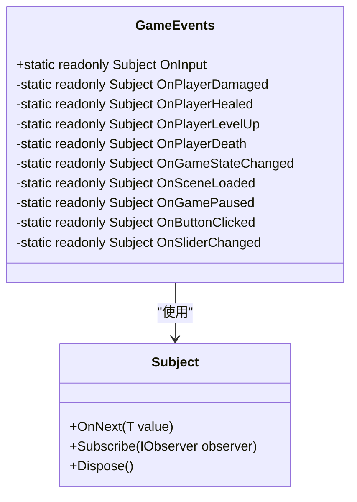
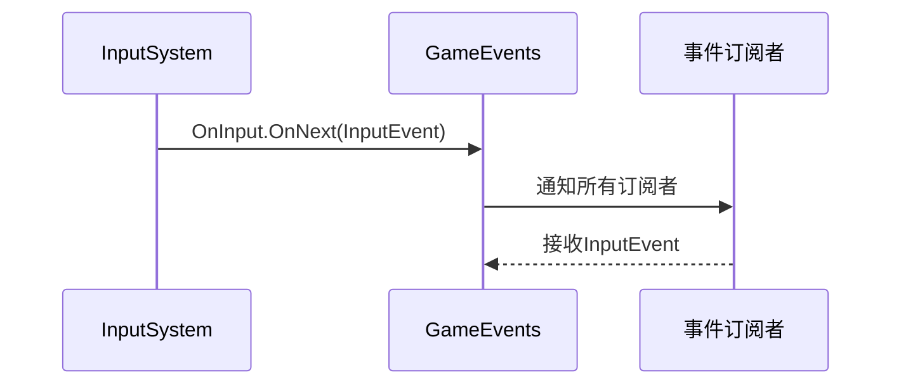
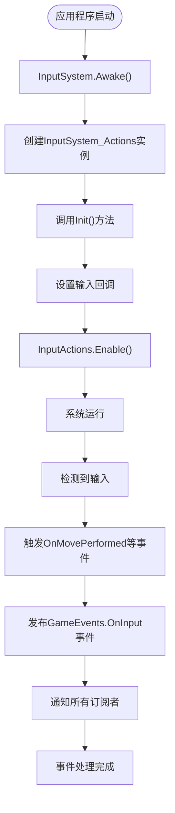
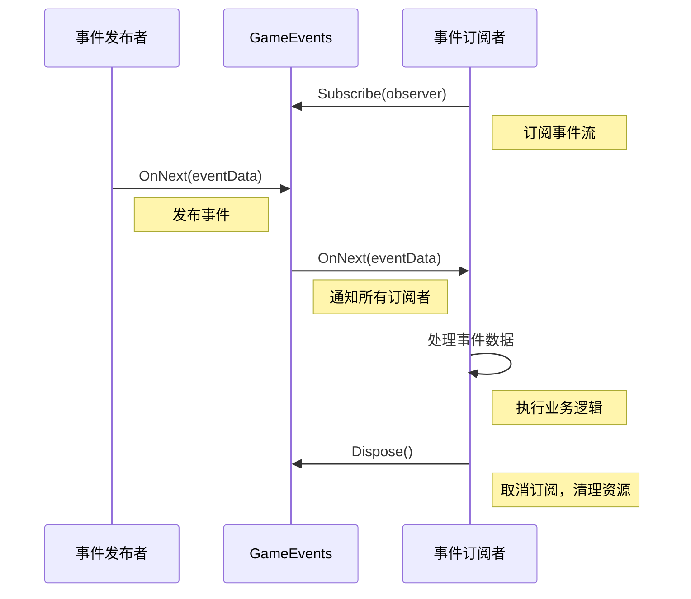

# 静态事件流

<cite>
**本文档引用的文件**   
- [GameEvents.cs](file://Assets/Scripts/Manager/EventSystem/GameEvents.cs)
- [InputSystem.cs](file://Assets/Scripts/Manager/InputSystem/InputSystem.cs)
- [EventLists.cs](file://Assets/Scripts/Manager/EventSystem/EventLists.cs)
- [InputSystem_Actions.cs](file://Assets/InputSystem_Actions.cs)
- [PlayerEvents.cs](file://Assets/Scripts/EventData/PlayerEvents.cs)
</cite>

## 目录
1. [简介](#简介)
2. [核心设计](#核心设计)
3. [事件流实现](#事件流实现)
4. [线程安全性与生命周期](#线程安全性与生命周期)
5. [Unity生命周期集成](#unity生命周期集成)
6. [事件发布与订阅示例](#事件发布与订阅示例)
7. [被禁用事件的潜在用途](#被禁用事件的潜在用途)
8. [性能特征与内存管理](#性能特征与内存管理)
9. [调试技巧](#调试技巧)
10. [结论](#结论)

## 简介
本项目采用R3库实现的响应式编程模型，通过静态事件流提供游戏全局通信机制。GameEvents静态类作为中心化的事件总线，实现了松耦合的系统间通信。该设计基于R3 Subject，为游戏开发提供了现代化的响应式编程范式，支持事件的发布-订阅模式，确保不同系统模块能够高效、安全地进行通信。

**Section sources**
- [GameEvents.cs](file://Assets/Scripts/Manager/EventSystem/GameEvents.cs#L2-L23)

## 核心设计
GameEvents静态类采用单例模式设计，通过静态只读字段暴露各种事件流。这种设计确保了事件流的全局可访问性，同时保持了线程安全性。事件流基于R3库的Subject实现，提供了完整的响应式编程能力，包括事件发布(OnNext)、订阅和取消订阅等操作。

事件流被组织为不同的类别，包括输入事件、游戏状态事件和UI事件等，这种分类方式提高了代码的可维护性和可理解性。每个事件流都是一个独立的Subject实例，允许不同类型的事件独立处理，避免了事件冲突和耦合。

**Diagram sources**
- [GameEvents.cs](file://Assets/Scripts/Manager/EventSystem/GameEvents.cs#L2-L23)

**Section sources**
- [GameEvents.cs](file://Assets/Scripts/Manager/EventSystem/GameEvents.cs#L2-L23)

## 事件流实现
GameEvents类中的事件流实现基于R3库的Subject泛型类。以OnInput事件为例，其实现方式为`public static readonly Subject<InputEvent> OnInput = new();`。这种实现提供了类型安全的事件通信机制，确保只有正确类型的事件数据才能被发布和接收。

事件数据类型在EventLists.cs文件中定义，采用record struct语法，这不仅提供了不可变性保证，还优化了内存性能。InputEvent作为输入事件的基础类型，虽然当前为空，但为未来的扩展提供了基础。

输入系统通过InputSystem类与GameEvents集成，当检测到玩家输入时，不仅触发传统的事件回调，还会通过GameEvents.OnInput.OnNext()方法发布响应式事件，实现了传统事件系统与响应式编程的无缝集成。

**Diagram sources**
- [GameEvents.cs](file://Assets/Scripts/Manager/EventSystem/GameEvents.cs#L2-L23)
- [InputSystem.cs](file://Assets/Scripts/Manager/InputSystem/InputSystem.cs#L0-L93)

**Section sources**
- [GameEvents.cs](file://Assets/Scripts/Manager/EventSystem/GameEvents.cs#L2-L23)
- [InputSystem.cs](file://Assets/Scripts/Manager/InputSystem/InputSystem.cs#L0-L93)
- [EventLists.cs](file://Assets/Scripts/Manager/EventSystem/EventLists.cs#L0-L50)

## 线程安全性与生命周期
R3库的Subject实现是线程安全的，这意味着GameEvents中的事件流可以在多线程环境中安全使用。Subject的内部实现确保了OnNext、Subscribe和Dispose等操作的原子性，避免了竞态条件。

事件流的生命周期与应用程序的生命周期一致。由于GameEvents是静态类，其内部的Subject实例在应用程序启动时创建，在应用程序终止时销毁。这种设计确保了事件流的持久性，使得任何时间点注册的订阅者都能接收到后续的事件。

对于订阅者的生命周期管理，采用IDisposable模式。当订阅者不再需要接收事件时，应正确释放订阅，避免内存泄漏。R3的响应式系统会自动处理订阅的清理工作，确保资源的正确释放。

**Section sources**
- [GameEvents.cs](file://Assets/Scripts/Manager/EventSystem/GameEvents.cs#L2-L23)
- [Singleton.cs](file://Assets/Scripts/Tool/Singleton.cs#L0-L23)

## Unity生命周期集成
事件系统与Unity的生命周期紧密集成。InputSystem作为单例在Awake阶段初始化，并在OnEnable时启用输入动作。当检测到输入时，不仅触发传统的事件回调，还会通过GameEvents发布响应式事件。

这种双重机制确保了兼容性，既支持传统的Unity事件处理模式，又提供了现代化的响应式编程接口。事件的发布发生在Unity的Update循环中，与游戏逻辑同步，确保了事件处理的及时性和一致性。

**Diagram sources**
- [InputSystem.cs](file://Assets/Scripts/Manager/InputSystem/InputSystem.cs#L0-L93)

**Section sources**
- [InputSystem.cs](file://Assets/Scripts/Manager/InputSystem/InputSystem.cs#L0-L93)
- [InputSystem_Actions.cs](file://Assets/InputSystem_Actions.cs#L0-L30)

## 事件发布与订阅示例
事件发布和订阅的具体实现展示了如何在不同系统间进行松耦合通信。以下为典型的使用模式：

**Diagram sources**
- [GameEvents.cs](file://Assets/Scripts/Manager/EventSystem/GameEvents.cs#L2-L23)

**Section sources**
- [GameEvents.cs](file://Assets/Scripts/Manager/EventSystem/GameEvents.cs#L2-L23)
- [InputSystem.cs](file://Assets/Scripts/Manager/InputSystem/InputSystem.cs#L0-L93)

## 被禁用事件的潜在用途
GameEvents类中注释掉的事件展示了系统潜在的扩展能力。这些被禁用的事件包括：

- **玩家伤害事件**：可用于实现伤害反馈、UI更新、音效播放等
- **玩家治疗事件**：可用于生命值显示、治疗效果可视化等
- **玩家升级事件**：可用于技能解锁、属性提升等RPG机制
- **玩家死亡事件**：可用于游戏结束处理、复活机制等
- **游戏状态改变事件**：可用于场景管理、UI状态同步等
- **UI交互事件**：可用于按钮点击、滑块变化等UI逻辑处理

启用这些事件的方法很简单，只需取消相应行的注释即可。这种设计模式允许开发者根据项目需求逐步启用所需的功能，避免了不必要的性能开销。

**Section sources**
- [GameEvents.cs](file://Assets/Scripts/Manager/EventSystem/GameEvents.cs#L2-L23)
- [EventLists.cs](file://Assets/Scripts/Manager/EventSystem/EventLists.cs#L0-L50)
- [PlayerEvents.cs](file://Assets/Scripts/EventData/PlayerEvents.cs#L0-L18)

## 性能特征与内存管理
基于R3 Subject的事件流具有优秀的性能特征。Subject的内部实现优化了事件分发过程，确保了O(1)的订阅和发布复杂度。内存管理方面，采用引用计数机制，当没有订阅者时自动清理资源。

事件数据采用record struct定义，这减少了堆内存分配，提高了缓存局部性。对于高频事件如输入事件，这种设计显著降低了GC压力。同时，响应式编程的惰性求值特性避免了不必要的计算，进一步优化了性能。

内存泄漏预防方面，建议所有订阅者在不再需要事件通知时显式调用Dispose方法。R3系统会自动管理订阅关系，确保即使在异常情况下也能正确清理资源。

**Section sources**
- [GameEvents.cs](file://Assets/Scripts/Manager/EventSystem/GameEvents.cs#L2-L23)
- [EventLists.cs](file://Assets/Scripts/Manager/EventSystem/EventLists.cs#L0-L50)

## 调试技巧
调试响应式事件流时，可以采用以下技巧：

1. **日志记录**：在关键的OnNext调用处添加日志，追踪事件流的传播
2. **断点调试**：在Subject的OnNext方法处设置断点，观察事件发布过程
3. **订阅监控**：通过反射或调试工具查看当前的订阅者列表
4. **性能分析**：使用Unity Profiler监控事件处理的CPU消耗
5. **内存分析**：检查是否存在未正确释放的订阅导致的内存泄漏

对于复杂的事件流调试，可以考虑实现一个调试装饰器，包装Subject实例并添加额外的监控功能，如事件计数、耗时统计等。

**Section sources**
- [GameEvents.cs](file://Assets/Scripts/Manager/EventSystem/GameEvents.cs#L2-L23)
- [InputSystem.cs](file://Assets/Scripts/Manager/InputSystem/InputSystem.cs#L0-L93)

## 结论
GameEvents静态类通过R3 Subject实现的响应式事件流，为游戏开发提供了一个强大而灵活的全局通信机制。该设计具有良好的线程安全性、清晰的生命周期管理和优秀的性能特征。通过合理的事件分类和类型安全的设计，系统实现了高度的模块化和松耦合。

尽管目前只有OnInput事件被启用，但系统架构为未来的功能扩展提供了坚实的基础。开发者可以根据项目需求逐步启用其他事件类型，构建完整的响应式游戏架构。这种现代化的编程范式不仅提高了代码的可维护性，还为复杂的游戏逻辑处理提供了优雅的解决方案。