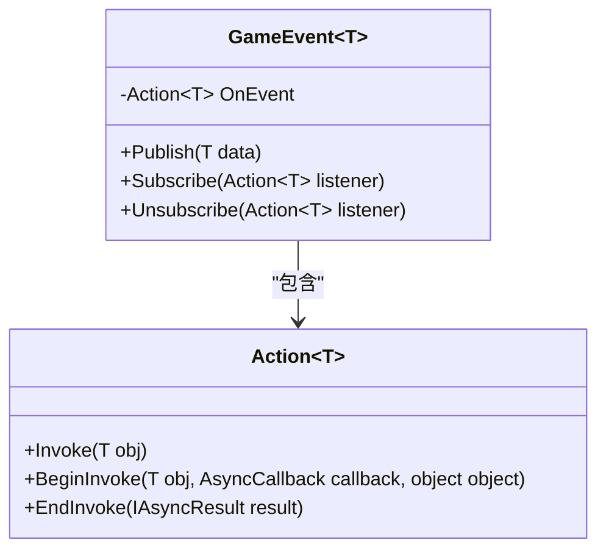
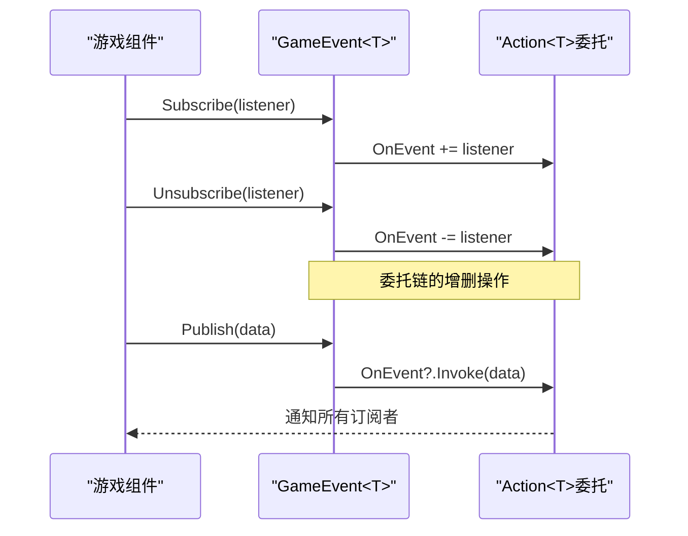
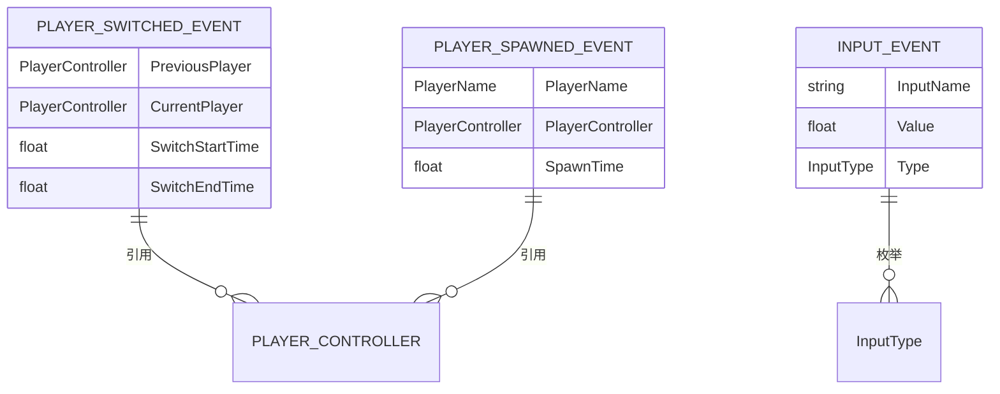
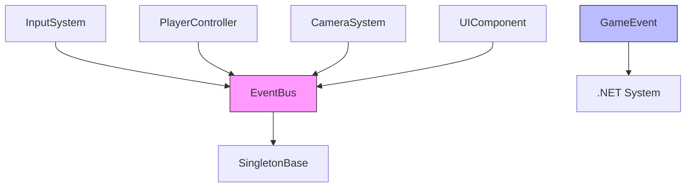
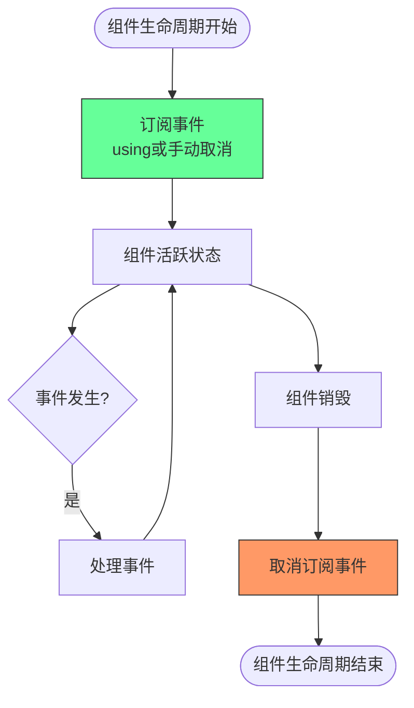

# 事件容器

<cite>
**本文档引用文件**   
- [GameEvent.cs](file://Assets/Scripts/Manager/EventSystem/GameEvent.cs)
- [EventBus.cs](file://Assets/Scripts/Manager/EventSystem/EventBus.cs)
- [GameEvents.cs](file://Assets/Scripts/Manager/EventSystem/GameEvents.cs)
- [EventLists.cs](file://Assets/Scripts/Manager/EventSystem/EventLists.cs)
- [PlayerEvents.cs](file://Assets/Scripts/EventData/PlayerEvents.cs)
- [InputSystem.cs](file://Assets/Scripts/Manager/InputSystem/InputSystem.cs)
- [Singleton.cs](file://Assets/Scripts/Tool/Singleton.cs)
</cite>

## 目录
1. [简介](#简介)
2. [核心组件](#核心组件)
3. [架构概述](#架构概述)
4. [详细组件分析](#详细组件分析)
5. [依赖分析](#依赖分析)
6. [性能考量](#性能考量)
7. [故障排除指南](#故障排除指南)
8. [结论](#结论)

## 简介
本项目实现了一个基于泛型的事件系统，用于在Unity游戏开发中实现松耦合的组件通信。系统核心是GameEvent<T>容器类，它提供了一种类型安全的方式来发布和订阅事件。事件总线(EventBus)作为单例模式实现，集中管理所有事件实例，确保全局访问的一致性。该系统支持高频率事件（如输入事件）的高效处理，并通过适当的内存管理机制防止内存泄漏。

## 核心组件
事件系统由几个关键组件构成：GameEvent<T>作为基础事件容器，EventBus作为全局事件管理器，以及各种事件数据结构。GameEvent<T>使用C#的Action<T>委托来存储事件监听器，通过Publish方法触发事件分发。EventBus利用字典存储不同类型的事件实例，通过泛型方法GetGameEvent<T>()提供类型安全的事件访问。系统还定义了多种事件数据结构，如PlayerSwitchedEvent和InputEvent，用于传递具体的事件信息。

**Section sources**
- [GameEvent.cs](file://Assets/Scripts/Manager/EventSystem/GameEvent.cs#L1-L20)
- [EventBus.cs](file://Assets/Scripts/Manager/EventSystem/EventBus.cs#L1-L15)
- [EventLists.cs](file://Assets/Scripts/Manager/EventSystem/EventLists.cs#L1-L84)

## 架构概述
事件系统采用发布-订阅模式，实现了组件间的松耦合通信。EventBus作为中心枢纽，管理所有事件实例的生命周期。各个游戏组件通过EventBus获取特定类型的GameEvent<T>实例，并订阅感兴趣的事件。当事件发生时，发布者调用Publish方法，事件容器安全地通知所有订阅者。这种架构使得组件可以独立开发和测试，同时保持高效的通信能力。

```mermaid
graph TB
subgraph "事件发布者"
Publisher1[输入系统]
Publisher2[游戏逻辑]
Publisher3[UI系统]
end
subgraph "事件系统核心"
EventBus[EventBus<br/>单例管理]
GameEvent[GameEvent<T><br/>事件容器]
end
subgraph "事件订阅者"
Subscriber1[角色控制器]
Subscriber2[摄像机系统]
Subscriber3[UI更新器]
end
Publisher1 --> |Publish(data)| GameEvent
Publisher2 --> |Publish(data)| GameEvent
Publisher3 --> |Publish(data)| GameEvent
GameEvent --> EventBus
EventBus --> |Subscribe(listener)| Subscriber1
EventBus --> |Subscribe(listener)| Subscriber2
EventBus --> |Subscribe(listener)| Subscriber3
style EventBus fill:#f9f,stroke:#333
style GameEvent fill:#bbf,stroke:#333
```

**Diagram sources **
- [EventBus.cs](file://Assets/Scripts/Manager/EventSystem/EventBus.cs#L1-L15)
- [GameEvent.cs](file://Assets/Scripts/Manager/EventSystem/GameEvent.cs#L1-L20)

## 详细组件分析

### GameEvent<T>容器分析
GameEvent<T>是事件系统的核心容器类，它封装了一个类型安全的委托事件，用于管理特定类型事件的订阅和发布。该类通过泛型参数T确保事件数据的类型安全，避免了运行时类型转换错误。

#### 实现机制


**Diagram sources **
- [GameEvent.cs](file://Assets/Scripts/Manager/EventSystem/GameEvent.cs#L1-L20)

**Section sources**
- [GameEvent.cs](file://Assets/Scripts/Manager/EventSystem/GameEvent.cs#L1-L20)

### 事件分发与监听器管理
GameEvent<T>提供了完整的事件生命周期管理功能，包括发布、订阅和取消订阅操作。

#### 发布方法安全机制
```mermaid
flowchart TD
Start([Publish(data)]) --> NullCheck["空引用检查<br/>OnEvent?.Invoke(data)"]
NullCheck --> HasListeners{"存在监听器?"}
HasListeners --> |是| Invoke["调用所有监听器<br/>OnEvent.Invoke(data)"]
HasListeners --> |否| End([无操作])
Invoke --> End
style NullCheck fill:#f96,stroke:#333
style HasListeners fill:#6f9,stroke:#333
```

**Diagram sources **
- [GameEvent.cs](file://Assets/Scripts/Manager/EventSystem/GameEvent.cs#L7-L9)

#### 订阅与取消订阅流程


**Diagram sources **
- [GameEvent.cs](file://Assets/Scripts/Manager/EventSystem/GameEvent.cs#L1-L20)

**Section sources**
- [GameEvent.cs](file://Assets/Scripts/Manager/EventSystem/GameEvent.cs#L1-L20)

### 泛型约束与事件数据结构
系统通过合理的泛型约束和数据结构设计，确保了事件系统的类型安全和可扩展性。

#### 事件数据结构示例


**Diagram sources **
- [PlayerEvents.cs](file://Assets/Scripts/EventData/PlayerEvents.cs#L1-L18)
- [EventLists.cs](file://Assets/Scripts/Manager/EventSystem/EventLists.cs#L1-L84)

**Section sources**
- [PlayerEvents.cs](file://Assets/Scripts/EventData/PlayerEvents.cs#L1-L18)
- [EventLists.cs](file://Assets/Scripts/Manager/EventSystem/EventLists.cs#L1-L84)

## 依赖分析
事件系统与其他组件存在明确的依赖关系，这些关系通过接口和依赖注入实现松耦合。



**Diagram sources **
- [EventBus.cs](file://Assets/Scripts/Manager/EventSystem/EventBus.cs#L1-L15)
- [GameEvent.cs](file://Assets/Scripts/Manager/EventSystem/GameEvent.cs#L1-L20)
- [Singleton.cs](file://Assets/Scripts/Tool/Singleton.cs#L1-L23)

**Section sources**
- [EventBus.cs](file://Assets/Scripts/Manager/EventSystem/EventBus.cs#L1-L15)
- [Singleton.cs](file://Assets/Scripts/Tool/Singleton.cs#L1-L23)

## 性能考量
事件系统在设计时考虑了性能因素，特别是在高频率事件场景下的表现。

### 高频率事件处理
对于输入事件等高频场景，系统通过以下方式优化性能：
- 使用轻量级的Action<T>委托而非复杂的事件处理机制
- 避免在事件处理中进行昂贵的内存分配
- 通过空引用条件调用(?.Invoke)减少不必要的空检查开销

### 内存泄漏预防


**Diagram sources **
- [InputSystem.cs](file://Assets/Scripts/Manager/InputSystem/InputSystem.cs#L1-L93)

**Section sources**
- [InputSystem.cs](file://Assets/Scripts/Manager/InputSystem/InputSystem.cs#L1-L93)

## 故障排除指南
### 常见问题与解决方案
1. **事件未触发**：检查订阅和发布的事件类型是否匹配，确保使用相同的泛型参数T
2. **内存泄漏**：确保在组件销毁时正确取消订阅，推荐使用using语句或在OnDestroy中取消订阅
3. **空引用异常**：虽然?.Invoke提供了基本保护，但仍需确保事件数据对象本身不为空

### 调试技巧
- 使用调试日志记录事件的订阅、发布和取消订阅操作
- 在开发阶段启用事件监听器数量监控，及时发现未正确取消订阅的情况
- 使用Unity的Profiler工具分析事件处理的性能开销

**Section sources**
- [GameEvent.cs](file://Assets/Scripts/Manager/EventSystem/GameEvent.cs#L1-L20)
- [InputSystem.cs](file://Assets/Scripts/Manager/InputSystem/InputSystem.cs#L1-L93)

## 结论
本事件容器系统提供了一个类型安全、高性能的事件处理机制，适用于Unity游戏开发中的各种场景。通过GameEvent<T>和EventBus的组合，实现了组件间的松耦合通信，同时保证了代码的可维护性和可扩展性。系统特别适合处理高频率事件，如输入事件，通过合理的内存管理机制有效防止内存泄漏。建议在使用时遵循最佳实践，特别是在组件生命周期管理方面，确保订阅和取消订阅操作的配对执行。