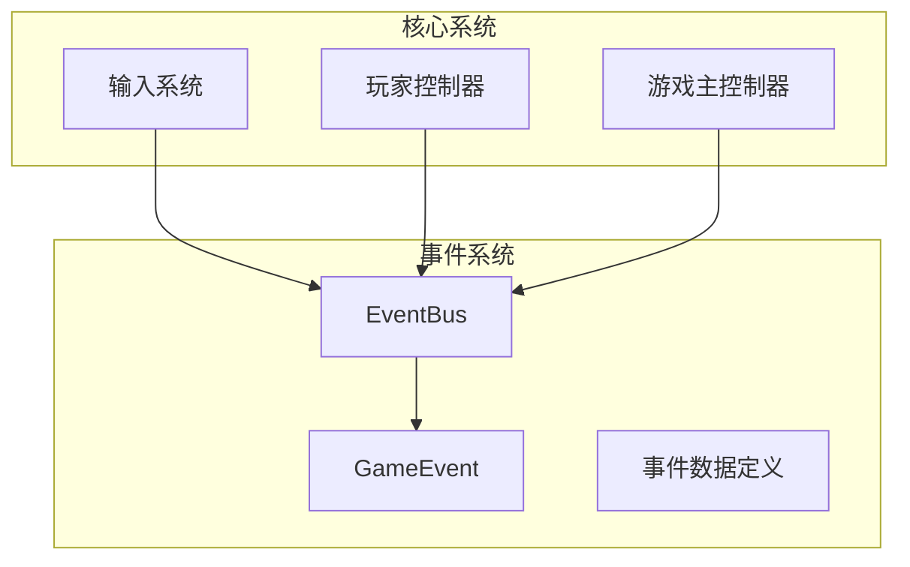
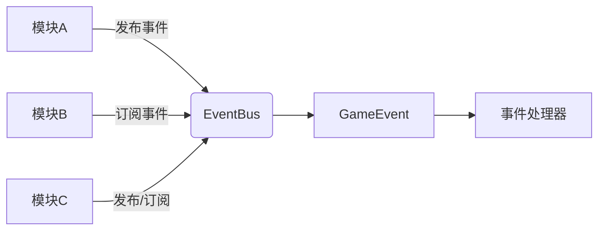
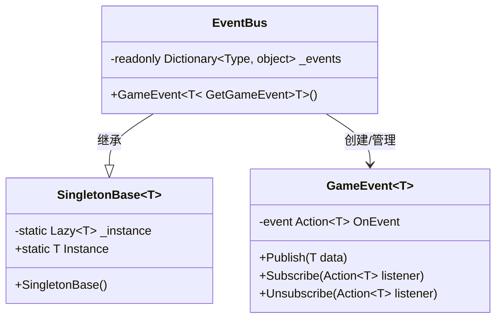
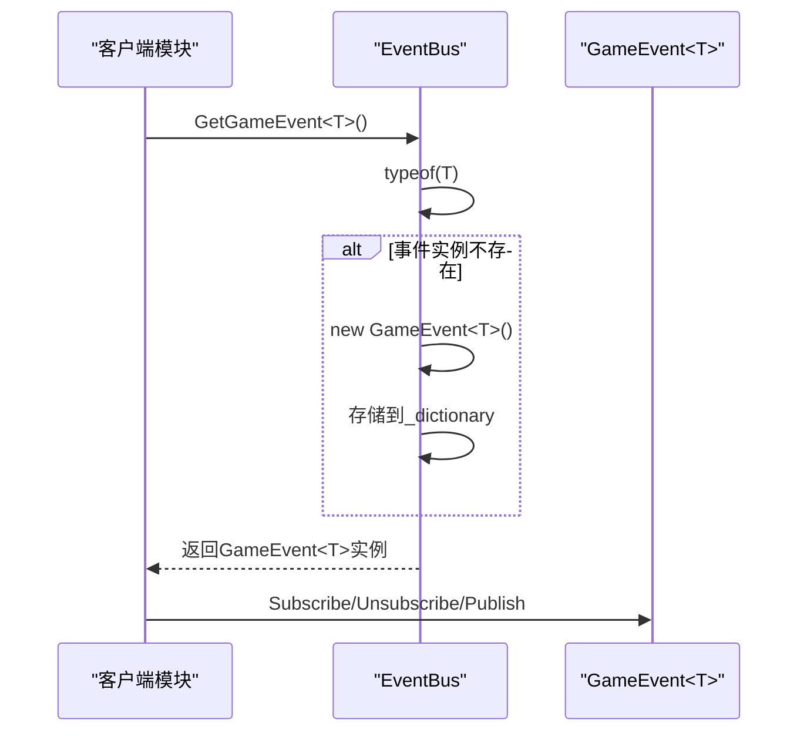
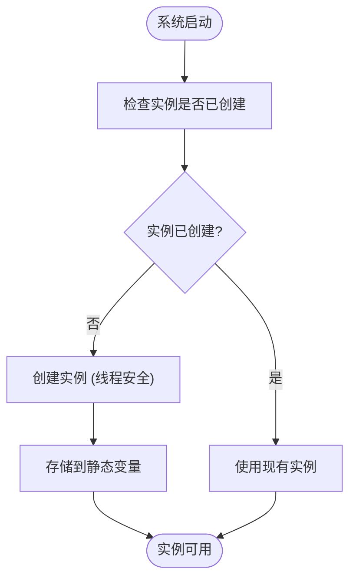

# 事件总线核心

<cite>
**本文档引用的文件**
- [EventBus.cs](file://Assets/Scripts/Manager/EventSystem/EventBus.cs)
- [GameEvent.cs](file://Assets/Scripts/Manager/EventSystem/GameEvent.cs)
- [Singleton.cs](file://Assets/Scripts/Tool/Singleton.cs)
- [InputSystem.cs](file://Assets/Scripts/Manager/InputSystem/InputSystem.cs)
- [PlayerController.cs](file://Assets/Scripts/Controller/PlayerController.cs)
- [GameMain.cs](file://Assets/Scripts/Manager/GameMain.cs)
- [EventLists.cs](file://Assets/Scripts/Manager/EventSystem/EventLists.cs)
- [GameEvents.cs](file://Assets/Scripts/Manager/EventSystem/GameEvents.cs)
</cite>

## 目录
1. [简介](#简介)
2. [项目结构](#项目结构)
3. [核心组件](#核心组件)
4. [架构概述](#架构概述)
5. [详细组件分析](#详细组件分析)
6. [依赖分析](#依赖分析)
7. [性能考虑](#性能考虑)
8. [故障排除指南](#故障排除指南)
9. [结论](#结论)

## 简介
本文档详细介绍了Unity项目中的事件总线核心实现，重点分析了EventBus类作为单例模式的实现机制及其在系统架构中的中枢作用。文档深入探讨了类型安全的事件管理机制、线程安全性考虑、延迟初始化模式的应用，以及与其他系统（如输入系统、玩家控制器）的集成方式。

## 项目结构
事件总线系统位于Assets/Scripts/Manager/EventSystem目录下，是整个项目模块间通信的核心枢纽。该系统通过泛型机制实现类型安全的事件发布/订阅模式，为游戏各模块提供松耦合的通信机制。



**Diagram sources**
- [EventBus.cs](file://Assets/Scripts/Manager/EventSystem/EventBus.cs#L1-L15)
- [GameEvent.cs](file://Assets/Scripts/Manager/EventSystem/GameEvent.cs#L1-L20)

**Section sources**
- [EventBus.cs](file://Assets/Scripts/Manager/EventSystem/EventBus.cs#L1-L15)
- [GameEvent.cs](file://Assets/Scripts/Manager/EventSystem/GameEvent.cs#L1-L20)

## 核心组件
事件总线核心由EventBus类、GameEvent泛型类和SingletonBase基类组成。EventBus作为单例实例，通过字典存储机制管理所有类型的事件实例，实现了全局唯一的事件管理中心。

**Section sources**
- [EventBus.cs](file://Assets/Scripts/Manager/EventSystem/EventBus.cs#L1-L15)
- [Singleton.cs](file://Assets/Scripts/Tool/Singleton.cs#L1-L23)

## 架构概述
事件总线采用发布-订阅模式，作为所有模块间通信的中心枢纽。系统架构通过泛型类型作为字典键值，实现了类型安全的事件管理，避免了字符串标识符可能带来的错误。



**Diagram sources**
- [EventBus.cs](file://Assets/Scripts/Manager/EventSystem/EventBus.cs#L1-L15)
- [GameEvent.cs](file://Assets/Scripts/Manager/EventSystem/GameEvent.cs#L1-L20)

## 详细组件分析

### EventBus单例实现分析
EventBus类继承自SingletonBase<EventBus>，确保了全局唯一实例。通过私有字典_dictionary存储不同类型的事件实例，实现了高效的事件管理。



**Diagram sources**
- [EventBus.cs](file://Assets/Scripts/Manager/EventSystem/EventBus.cs#L1-L15)
- [Singleton.cs](file://Assets/Scripts/Tool/Singleton.cs#L1-L23)
- [GameEvent.cs](file://Assets/Scripts/Manager/EventSystem/GameEvent.cs#L1-L20)

### GetGameEvent泛型方法分析
GetGameEvent<T>()泛型方法通过Type作为键在_dictionary中查找或创建GameEvent<T>实例，实现了类型安全的事件管理。该方法采用延迟初始化模式，在首次请求特定类型事件时才创建实例。



**Diagram sources**
- [EventBus.cs](file://Assets/Scripts/Manager/EventSystem/EventBus.cs#L7-L15)
- [GameEvent.cs](file://Assets/Scripts/Manager/EventSystem/GameEvent.cs#L1-L20)

### 线程安全性与延迟初始化分析
事件总线系统通过Lazy<T>实现线程安全的延迟初始化，确保在多线程环境下单例实例的安全创建。LazyThreadSafetyMode.ExecutionAndPublication模式保证了实例创建的原子性。



**Diagram sources**
- [Singleton.cs](file://Assets/Scripts/Tool/Singleton.cs#L8-L15)

**Section sources**
- [Singleton.cs](file://Assets/Scripts/Tool/Singleton.cs#L1-L23)

## 依赖分析
事件总线系统与其他核心系统紧密集成，形成了松耦合但高效通信的架构体系。

```mermaid
graph TD
EventBus --> SingletonBase : 依赖
InputSystem --> EventBus : 发布输入事件
PlayerController --> EventBus : 监听状态变化
GameMain --> EventBus : 系统初始化
EventBus --> GameEvent : 管理事件实例
```

**Diagram sources**
- [EventBus.cs](file://Assets/Scripts/Manager/EventSystem/EventBus.cs#L1-L15)
- [InputSystem.cs](file://Assets/Scripts/Manager/InputSystem/InputSystem.cs#L1-L93)
- [PlayerController.cs](file://Assets/Scripts/Controller/PlayerController.cs#L1-L102)

**Section sources**
- [EventBus.cs](file://Assets/Scripts/Manager/EventSystem/EventBus.cs#L1-L15)
- [InputSystem.cs](file://Assets/Scripts/Manager/InputSystem/InputSystem.cs#L1-L93)
- [PlayerController.cs](file://Assets/Scripts/Controller/PlayerController.cs#L1-L102)

## 性能考虑
事件总线系统在设计时考虑了多项性能优化策略：

1. **字典预分配**：通过合理预估事件类型数量，减少字典扩容带来的性能开销
2. **类型缓存**：利用Type对象作为键，避免字符串比较的开销
3. **延迟初始化**：仅在需要时创建事件实例，减少内存占用
4. **引用传递**：返回事件实例的引用，避免重复创建

系统还应考虑以下优化：
- 事件类型注册时的性能监控
- 不活跃事件的自动清理机制
- 高频事件的批处理优化

**Section sources**
- [EventBus.cs](file://Assets/Scripts/Manager/EventSystem/EventBus.cs#L7-L15)
- [GameEvent.cs](file://Assets/Scripts/Manager/EventSystem/GameEvent.cs#L1-L20)

## 故障排除指南
在使用事件总线系统时可能遇到的常见问题及解决方案：

1. **事件未触发**：检查订阅和发布是否使用相同的泛型类型
2. **内存泄漏**：确保在对象销毁时正确取消订阅
3. **性能瓶颈**：监控高频事件的发布频率，考虑合并或节流
4. **类型转换错误**：确保事件数据类型与订阅类型完全匹配

调试建议：
- 使用调试工具监控事件订阅/取消订阅的平衡
- 记录事件发布频率和处理时间
- 定期检查事件字典的大小和内容

**Section sources**
- [EventBus.cs](file://Assets/Scripts/Manager/EventSystem/EventBus.cs#L1-L15)
- [GameEvent.cs](file://Assets/Scripts/Manager/EventSystem/GameEvent.cs#L1-L20)

## 结论
事件总线核心系统通过精巧的设计实现了类型安全、线程安全且高效的模块间通信机制。作为系统的中枢，它成功解耦了各个功能模块，提高了代码的可维护性和可扩展性。单例模式与泛型字典的结合，既保证了全局唯一性，又实现了灵活的事件管理。未来可进一步优化事件生命周期管理和性能监控，使系统更加健壮。