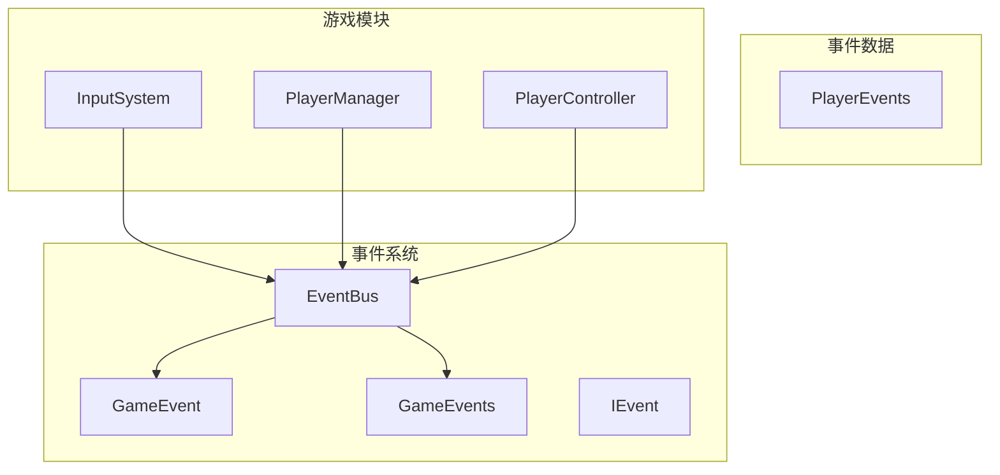
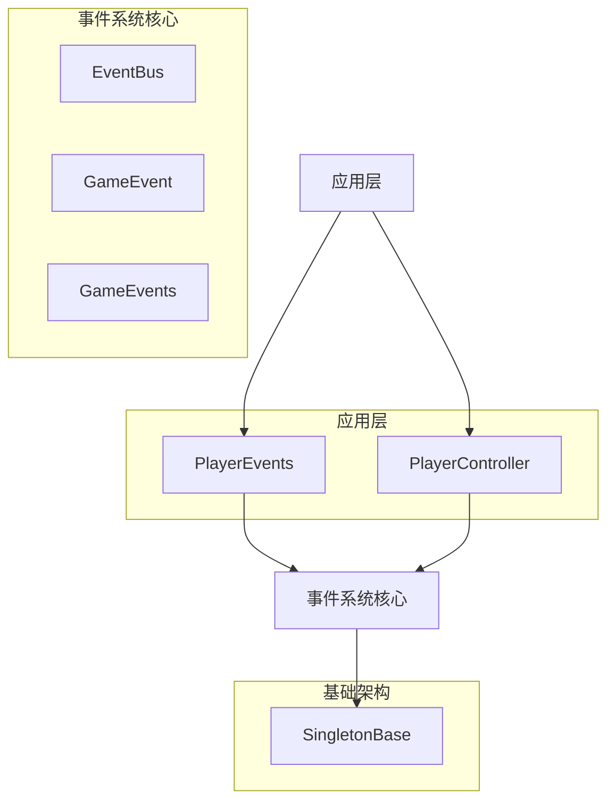
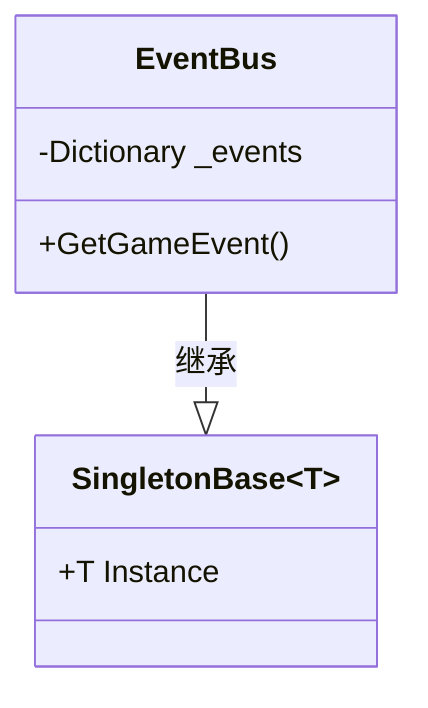
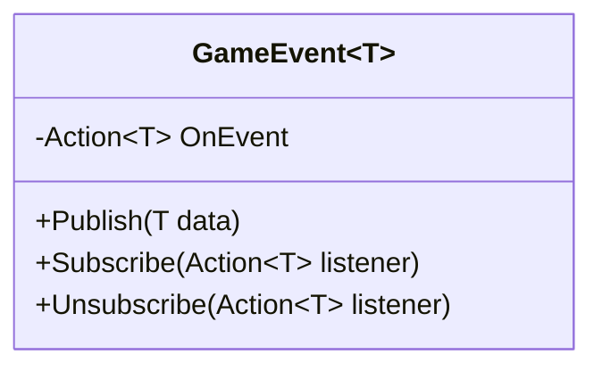
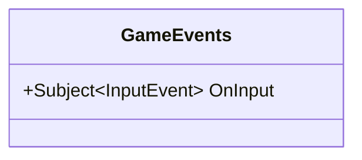
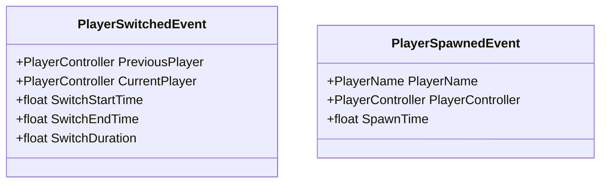
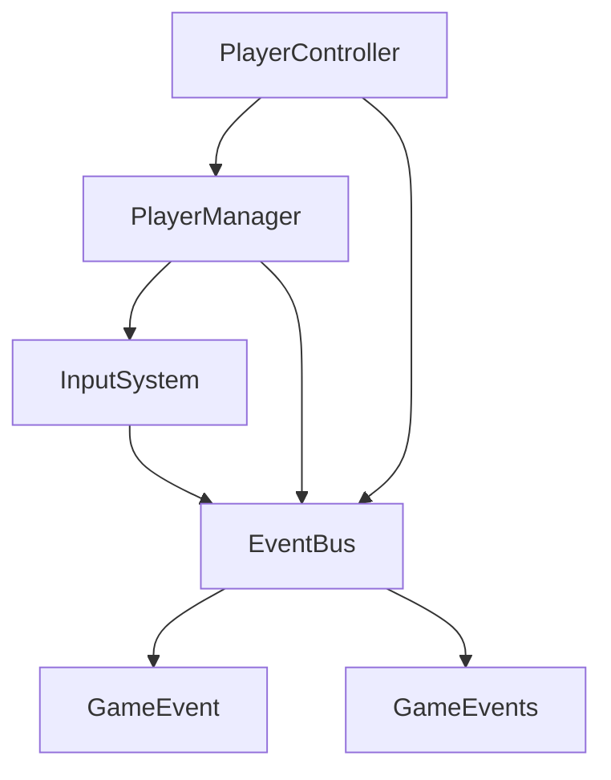

# 事件系统

<cite>
**本文档中引用的文件**  
- [EventBus.cs](file://Assets/Scripts/Manager/EventSystem/EventBus.cs)
- [GameEvent.cs](file://Assets/Scripts/Manager/EventSystem/GameEvent.cs)
- [GameEvents.cs](file://Assets/Scripts/Manager/EventSystem/GameEvents.cs)
- [IEvent.cs](file://Assets/Scripts/Manager/EventSystem/IEvent.cs)
- [PlayerEvents.cs](file://Assets/Scripts/EventData/PlayerEvents.cs)
- [InputSystem.cs](file://Assets/Scripts/Manager/InputSystem/InputSystem.cs)
- [PlayerManager.cs](file://Assets/Scripts/Manager/PlayerManager/PlayerManager.cs)
- [PlayerController.cs](file://Assets/Scripts/Controller/PlayerController.cs)
- [Singleton.cs](file://Assets/Scripts/Tool/Singleton.cs)
</cite>

## 目录
1. [简介](#简介)
2. [项目结构](#项目结构)
3. [核心组件](#核心组件)
4. [架构概述](#架构概述)
5. [详细组件分析](#详细组件分析)
6. [依赖分析](#依赖分析)
7. [性能考虑](#性能考虑)
8. [故障排除指南](#故障排除指南)
9. [结论](#结论)

## 简介
本项目实现了一个基于发布-订阅模式的事件系统，用于在游戏模块之间实现松耦合通信。系统核心是EventBus事件总线，采用单例模式管理所有游戏事件。事件系统通过泛型类型安全机制，支持不同类型事件的发布和订阅，并与R3响应式流集成，为输入事件等实时数据流提供支持。

## 项目结构
事件系统主要分布在`Assets/Scripts/Manager/EventSystem`目录下，相关事件数据定义在`Assets/Scripts/EventData`目录中。系统通过单例模式确保全局唯一性，各游戏模块通过事件总线进行通信。



**Diagram sources**
- [EventBus.cs](file://Assets/Scripts/Manager/EventSystem/EventBus.cs)
- [GameEvent.cs](file://Assets/Scripts/Manager/EventSystem/GameEvent.cs)
- [GameEvents.cs](file://Assets/Scripts/Manager/EventSystem/GameEvents.cs)

**Section sources**
- [EventBus.cs](file://Assets/Scripts/Manager/EventSystem/EventBus.cs)
- [GameEvent.cs](file://Assets/Scripts/Manager/EventSystem/GameEvent.cs)
- [GameEvents.cs](file://Assets/Scripts/Manager/EventSystem/GameEvents.cs)

## 核心组件
事件系统的核心组件包括EventBus事件总线、GameEvent<T>泛型事件类、GameEvents静态事件类和IEvent接口。EventBus作为单例全局访问点，使用字典存储机制管理不同类型的游戏事件实例。GameEvent<T>提供类型安全的事件发布订阅功能，而GameEvents则集成R3响应式流，为特定事件类型提供流式处理能力。

**Section sources**
- [EventBus.cs](file://Assets/Scripts/Manager/EventSystem/EventBus.cs#L1-L15)
- [GameEvent.cs](file://Assets/Scripts/Manager/EventSystem/GameEvent.cs#L1-L20)
- [GameEvents.cs](file://Assets/Scripts/Manager/EventSystem/GameEvents.cs#L1-L23)
- [IEvent.cs](file://Assets/Scripts/Manager/EventSystem/IEvent.cs#L1-L5)

## 架构概述
事件系统采用分层架构设计，上层为具体事件类型和数据结构，中层为事件管理核心，底层为单例基础架构。系统通过泛型和字典的组合，实现了类型安全的事件实例管理和高效的事件查找机制。



**Diagram sources**
- [EventBus.cs](file://Assets/Scripts/Manager/EventSystem/EventBus.cs)
- [GameEvent.cs](file://Assets/Scripts/Manager/EventSystem/GameEvent.cs)
- [GameEvents.cs](file://Assets/Scripts/Manager/EventSystem/GameEvents.cs)
- [Singleton.cs](file://Assets/Scripts/Tool/Singleton.cs)

## 详细组件分析

### EventBus事件总线分析
EventBus是事件系统的核心，采用单例模式确保全局唯一性。它使用字典存储机制管理所有游戏事件实例，通过泛型方法GetGameEvent<T>()按类型获取或创建GameEvent<T>实例。



**Diagram sources**
- [EventBus.cs](file://Assets/Scripts/Manager/EventSystem/EventBus.cs#L1-L15)
- [Singleton.cs](file://Assets/Scripts/Tool/Singleton.cs#L1-L23)

### GameEvent<T>泛型事件分析
GameEvent<T>类实现类型安全的事件发布订阅模式，使用C#事件机制管理订阅者列表。它提供Publish、Subscribe和Unsubscribe三个核心方法，支持事件的发布和订阅管理。



**Diagram sources**
- [GameEvent.cs](file://Assets/Scripts/Manager/EventSystem/GameEvent.cs#L1-L20)

### GameEvents静态事件分析
GameEvents静态类提供全局事件访问点，特别是集成R3响应式流的OnInput事件。它使用Subject<T>实现可观察序列，支持响应式编程模式。



**Diagram sources**
- [GameEvents.cs](file://Assets/Scripts/Manager/EventSystem/GameEvents.cs#L1-L23)

### 事件数据结构分析
事件数据结构定义了事件传递的数据契约。PlayerEvents包含PlayerSwitchedEvent和PlayerSpawnedEvent等具体事件类型，通过属性封装事件相关数据。



**Diagram sources**
- [PlayerEvents.cs](file://Assets/Scripts/EventData/PlayerEvents.cs#L1-L18)

**Section sources**
- [PlayerEvents.cs](file://Assets/Scripts/EventData/PlayerEvents.cs#L1-L18)

## 依赖分析
事件系统与其他游戏模块存在明确的依赖关系，通过事件总线实现松耦合通信。



**Diagram sources**
- [EventBus.cs](file://Assets/Scripts/Manager/EventSystem/EventBus.cs)
- [InputSystem.cs](file://Assets/Scripts/Manager/InputSystem/InputSystem.cs)
- [PlayerManager.cs](file://Assets/Scripts/Manager/PlayerManager/PlayerManager.cs)
- [PlayerController.cs](file://Assets/Scripts/Controller/PlayerController.cs)

**Section sources**
- [EventBus.cs](file://Assets/Scripts/Manager/EventSystem/EventBus.cs)
- [InputSystem.cs](file://Assets/Scripts/Manager/InputSystem/InputSystem.cs)
- [PlayerManager.cs](file://Assets/Scripts/Manager/PlayerManager/PlayerManager.cs)
- [PlayerController.cs](file://Assets/Scripts/Controller/PlayerController.cs)

## 性能考虑
事件系统在设计时考虑了性能优化：
1. 使用字典存储事件实例，确保O(1)时间复杂度的事件查找
2. 采用单例模式，避免重复创建事件总线实例
3. 使用泛型实现类型安全，避免运行时类型检查开销
4. 通过弱引用或显式取消订阅，防止内存泄漏

事件发布和订阅操作的时间复杂度为O(1)，适合高频事件处理场景。建议在对象销毁时及时取消事件订阅，避免内存泄漏。

## 故障排除指南
### 事件未触发
检查事件订阅和发布是否匹配，确保事件类型一致。验证订阅代码是否在发布代码之前执行。

### 内存泄漏
确保在对象销毁时取消所有事件订阅。推荐使用using语句管理订阅生命周期：

```csharp
// 使用using语句管理订阅生命周期
using (EventBus.Instance.GetGameEvent<PlayerSwitchedEvent>().Subscribe(OnPlayerSwitched))
{
    // 事件处理逻辑
}
```

### 空引用异常
在发布事件前检查事件实例是否为null，特别是在系统初始化阶段。

**Section sources**
- [EventBus.cs](file://Assets/Scripts/Manager/EventSystem/EventBus.cs#L1-L15)
- [GameEvent.cs](file://Assets/Scripts/Manager/EventSystem/GameEvent.cs#L1-L20)
- [InputSystem.cs](file://Assets/Scripts/Manager/InputSystem/InputSystem.cs#L1-L93)

## 结论
本事件系统通过EventBus单例、字典存储和泛型机制，实现了高效、类型安全的事件管理。系统与R3响应式流集成，支持现代响应式编程模式。通过松耦合设计，各游戏模块可以独立开发和测试，提高了代码的可维护性和可扩展性。建议在使用时遵循最佳实践，及时管理订阅生命周期，确保系统稳定运行。