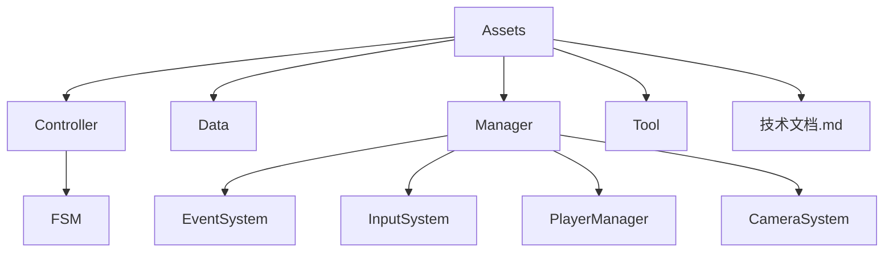
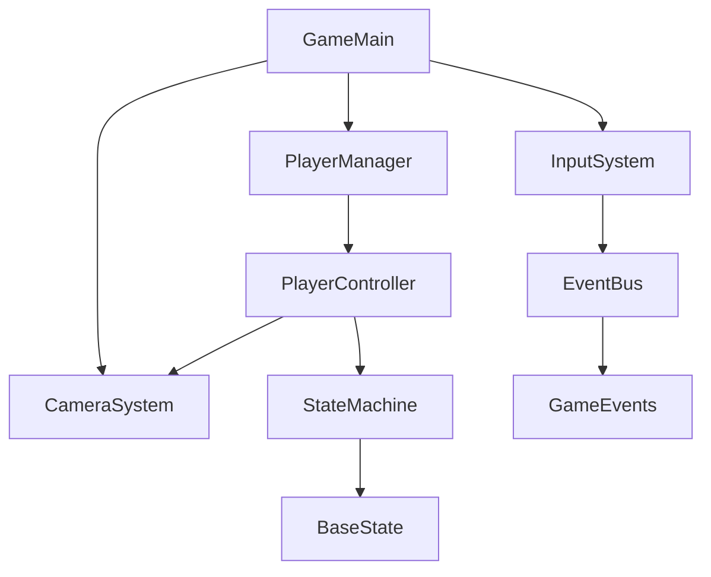
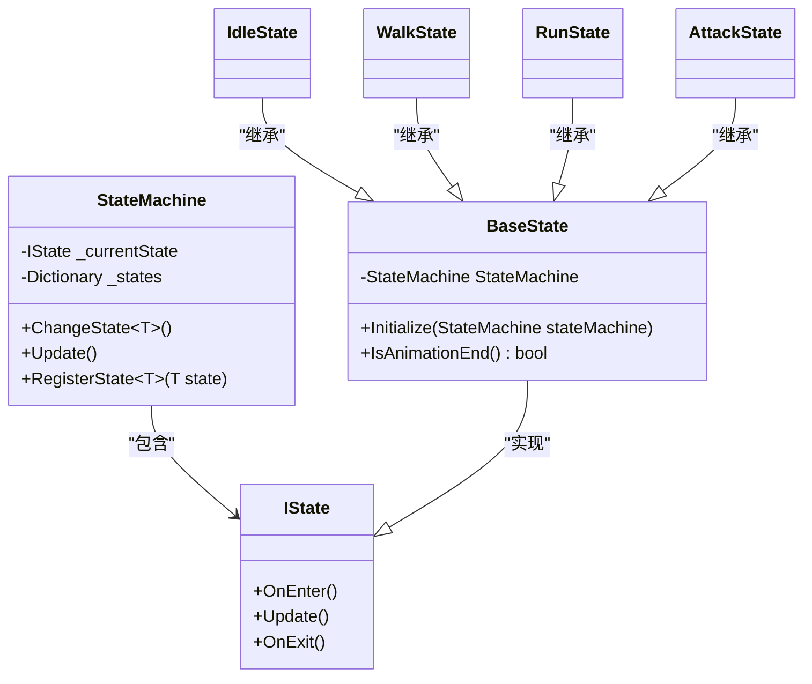
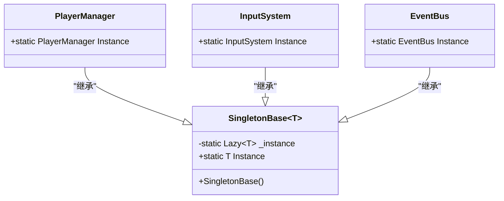
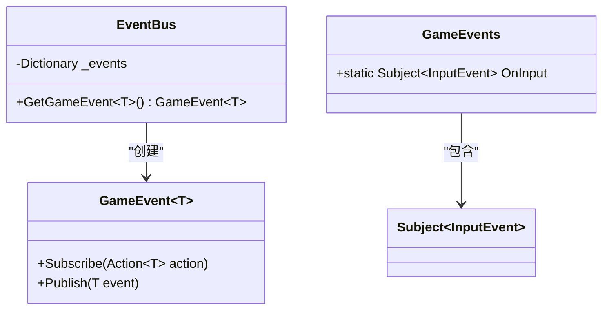
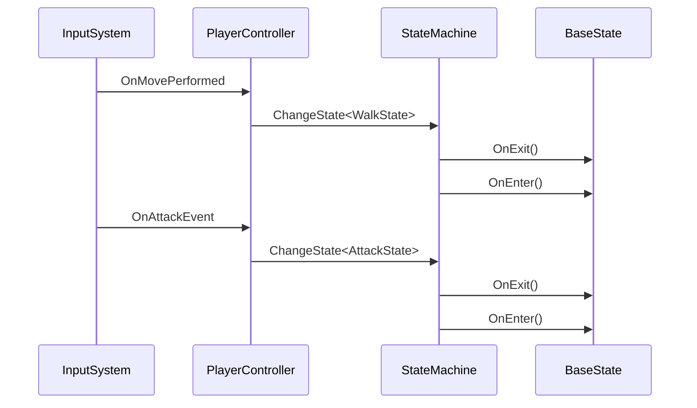

# 核心架构设计

<cite>
**本文档中引用的文件**
- [GameMain.cs](file://Assets/Scripts/Manager/GameMain.cs)
- [StateMachine.cs](file://Assets/Scripts/Controller/FSM/StateMachine.cs)
- [BaseState.cs](file://Assets/Scripts/Controller/FSM/BaseState.cs)
- [IState.cs](file://Assets/Scripts/Controller/FSM/IState.cs)
- [PlayerController.cs](file://Assets/Scripts/Controller/PlayerController.cs)
- [InputSystem.cs](file://Assets/Scripts/Manager/InputSystem/InputSystem.cs)
- [EventBus.cs](file://Assets/Scripts/Manager/EventSystem/EventBus.cs)
- [GameEvents.cs](file://Assets/Scripts/Manager/EventSystem/GameEvents.cs)
- [PlayerManager.cs](file://Assets/Scripts/Manager/PlayerManager/PlayerManager.cs)
- [CameraSystem.cs](file://Assets/Scripts/Manager/CameraSystem/CameraSystem.cs)
- [Singleton.cs](file://Assets/Scripts/Tool/Singleton.cs)
- [UpdataManager.cs](file://Assets/Scripts/Tool/UpdateManager/UpdataManager.cs)
- [技术文档.md](file://Assets/Scripts/技术文档.md)
</cite>

## 目录
1. [简介](#简介)
2. [项目结构](#项目结构)
3. [核心组件](#核心组件)
4. [架构概述](#架构概述)
5. [详细组件分析](#详细组件分析)
6. [依赖分析](#依赖分析)
7. [性能考虑](#性能考虑)
8. [故障排除指南](#故障排除指南)
9. [结论](#结论)

## 简介
本文档详细描述了Unity项目ZZZ的整体架构设计。该架构采用组件化设计风格和MVC变体模式，重点实现了状态模式（角色状态管理）、单例模式（全局管理器）、观察者模式（事件系统）和命令模式（输入处理）。文档将深入分析GameMain如何协调各个系统的初始化，并讨论架构决策背后的权衡，特别是选择基于状态机而非行为树的原因。为有经验的开发者提供性能考虑和扩展性分析。

## 项目结构
项目采用清晰的分层结构，主要分为Assets、Packages和ProjectSettings目录。Assets目录包含所有游戏资源，按功能模块组织，包括Controller（控制器）、Data（数据）、Manager（管理器）、Tool（工具）等。这种组织方式支持组件化架构，使代码更易于维护和扩展。

**图源**
- [GameMain.cs](file://Assets/Scripts/Manager/GameMain.cs)
- [技术文档.md](file://Assets/Scripts/技术文档.md)

**本节来源**
- [GameMain.cs](file://Assets/Scripts/Manager/GameMain.cs)
- [技术文档.md](file://Assets/Scripts/技术文档.md)

## 核心组件
项目的核心组件包括GameMain（主控制器）、StateMachine（状态机）、PlayerController（玩家控制器）、InputSystem（输入系统）、EventBus（事件总线）和PlayerManager（玩家管理器）。这些组件通过精心设计的接口和模式协同工作，实现了游戏的核心功能。

**本节来源**
- [GameMain.cs](file://Assets/Scripts/Manager/GameMain.cs)
- [StateMachine.cs](file://Assets/Scripts/Controller/FSM/StateMachine.cs)
- [PlayerController.cs](file://Assets/Scripts/Controller/PlayerController.cs)

## 架构概述
系统采用组件化架构风格和MVC变体模式。GameMain作为主控制器协调各个系统的初始化。状态模式用于管理角色状态，单例模式确保全局管理器的唯一性，观察者模式实现事件系统，命令模式处理输入。这种架构提供了良好的模块化和可扩展性。

**图源**
- [GameMain.cs](file://Assets/Scripts/Manager/GameMain.cs)
- [PlayerManager.cs](file://Assets/Scripts/Manager/PlayerManager/PlayerManager.cs)
- [InputSystem.cs](file://Assets/Scripts/Manager/InputSystem/InputSystem.cs)

## 详细组件分析
本节将深入分析各个关键组件的实现和交互。

### 状态模式实现
状态模式用于管理角色的各种状态，如闲置、移动、攻击等。StateMachine类作为状态机的核心，管理当前状态和状态转换。

**图源**
- [StateMachine.cs](file://Assets/Scripts/Controller/FSM/StateMachine.cs)
- [BaseState.cs](file://Assets/Scripts/Controller/FSM/BaseState.cs)
- [IState.cs](file://Assets/Scripts/Controller/FSM/IState.cs)

**本节来源**
- [StateMachine.cs](file://Assets/Scripts/Controller/FSM/StateMachine.cs)
- [BaseState.cs](file://Assets/Scripts/Controller/FSM/BaseState.cs)
- [IState.cs](file://Assets/Scripts/Controller/FSM/IState.cs)

### 单例模式实现
单例模式用于确保全局管理器的唯一性，如PlayerManager、InputSystem等。SingletonBase类作为泛型基类，提供线程安全的延迟初始化。

**图源**
- [Singleton.cs](file://Assets/Scripts/Tool/Singleton.cs)
- [PlayerManager.cs](file://Assets/Scripts/Manager/PlayerManager/PlayerManager.cs)
- [InputSystem.cs](file://Assets/Scripts/Manager/InputSystem/InputSystem.cs)
- [EventBus.cs](file://Assets/Scripts/Manager/EventSystem/EventBus.cs)

**本节来源**
- [Singleton.cs](file://Assets/Scripts/Tool/Singleton.cs)
- [PlayerManager.cs](file://Assets/Scripts/Manager/PlayerManager/PlayerManager.cs)
- [InputSystem.cs](file://Assets/Scripts/Manager/InputSystem/InputSystem.cs)
- [EventBus.cs](file://Assets/Scripts/Manager/EventSystem/EventBus.cs)

### 观察者模式实现
观察者模式用于实现事件系统，GameEvents类定义了各种游戏事件，EventBus类作为事件总线管理事件的发布和订阅。

**图源**
- [EventBus.cs](file://Assets/Scripts/Manager/EventSystem/EventBus.cs)
- [GameEvents.cs](file://Assets/Scripts/Manager/EventSystem/GameEvents.cs)

**本节来源**
- [EventBus.cs](file://Assets/Scripts/Manager/EventSystem/EventBus.cs)
- [GameEvents.cs](file://Assets/Scripts/Manager/EventSystem/GameEvents.cs)

### 命令模式实现
命令模式用于处理输入，InputSystem类将输入动作封装为命令，PlayerController类通过订阅这些命令来响应用户输入。

**图源**
- [InputSystem.cs](file://Assets/Scripts/Manager/InputSystem/InputSystem.cs)
- [PlayerController.cs](file://Assets/Scripts/Controller/PlayerController.cs)
- [StateMachine.cs](file://Assets/Scripts/Controller/FSM/StateMachine.cs)

**本节来源**
- [InputSystem.cs](file://Assets/Scripts/Manager/InputSystem/InputSystem.cs)
- [PlayerController.cs](file://Assets/Scripts/Controller/PlayerController.cs)
- [StateMachine.cs](file://Assets/Scripts/Controller/FSM/StateMachine.cs)

## 依赖分析
系统各组件之间存在明确的依赖关系。GameMain依赖于PlayerManager、InputSystem和CameraSystem。PlayerManager依赖于PlayerController，PlayerController依赖于StateMachine。InputSystem通过事件系统与其他组件通信。

**图源**
- [GameMain.cs](file://Assets/Scripts/Manager/GameMain.cs)
- [PlayerManager.cs](file://Assets/Scripts/Manager/PlayerManager/PlayerManager.cs)
- [InputSystem.cs](file://Assets/Scripts/Manager/InputSystem/InputSystem.cs)
- [CameraSystem.cs](file://Assets/Scripts/Manager/CameraSystem/CameraSystem.cs)

**本节来源**
- [GameMain.cs](file://Assets/Scripts/Manager/GameMain.cs)
- [PlayerManager.cs](file://Assets/Scripts/Manager/PlayerManager/PlayerManager.cs)
- [InputSystem.cs](file://Assets/Scripts/Manager/InputSystem/InputSystem.cs)
- [CameraSystem.cs](file://Assets/Scripts/Manager/CameraSystem/CameraSystem.cs)

## 性能考虑
系统在性能方面做了多项优化。状态机的Update方法只在启用时执行，减少了不必要的计算。事件系统使用Subject模式，确保事件发布和订阅的高效性。单例模式避免了重复创建全局管理器，节省了内存。输入系统将输入动作的读取和处理分离，提高了响应速度。

## 故障排除指南
常见问题包括状态机无法切换状态、输入无响应、事件未触发等。检查状态机是否被禁用，输入系统是否正确初始化，事件订阅是否正确设置。使用DebugX.Instance.Log进行调试，查看状态转换和事件触发的日志。

**本节来源**
- [DebugX.cs](file://Assets/Scripts/Tool/DebugX.cs)
- [StateMachine.cs](file://Assets/Scripts/Controller/FSM/StateMachine.cs)
- [InputSystem.cs](file://Assets/Scripts/Manager/InputSystem/InputSystem.cs)

## 结论
该项目采用组件化架构和MVC变体模式，通过状态模式、单例模式、观察者模式和命令模式的组合，实现了高效、可扩展的游戏系统。GameMain作为主控制器协调各个系统的初始化，确保了系统的稳定运行。选择基于状态机而非行为树的决策，使得角色状态管理更加简单和高效。为有经验的开发者提供了良好的扩展性和维护性。