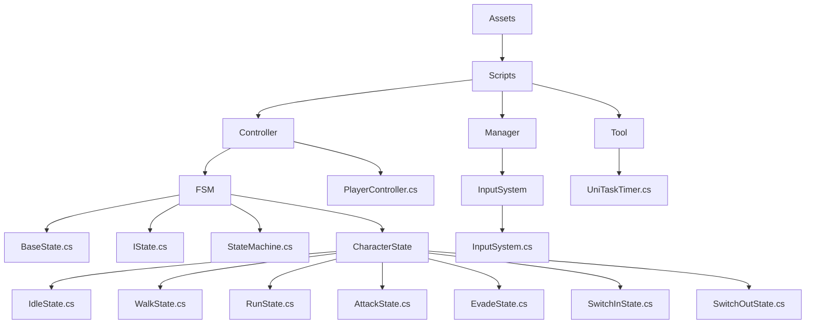
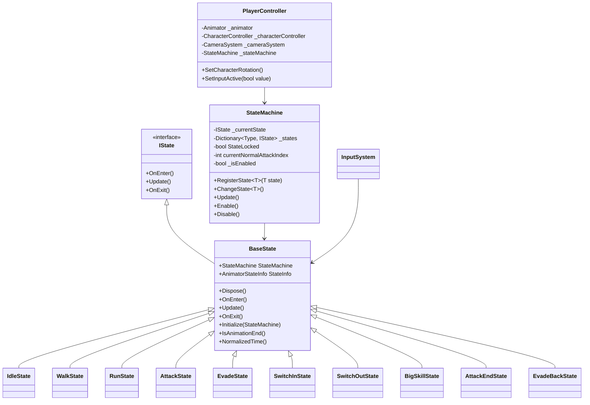
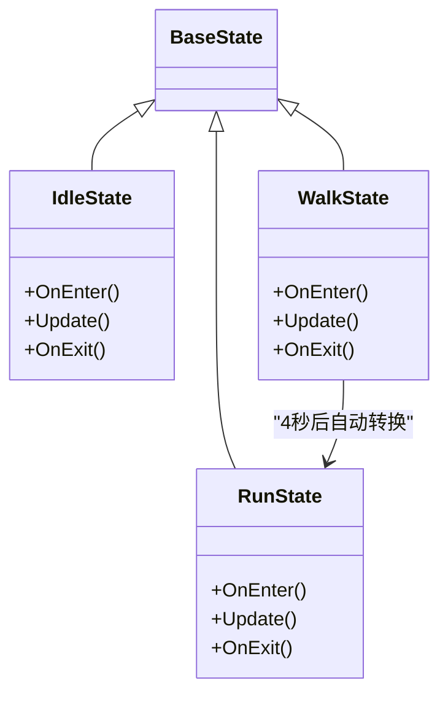
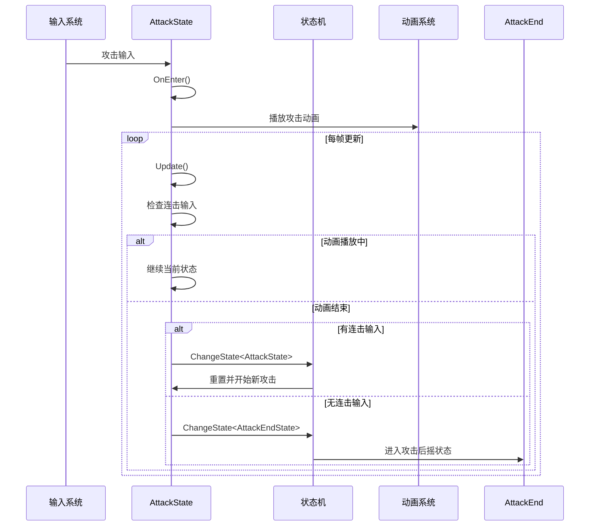
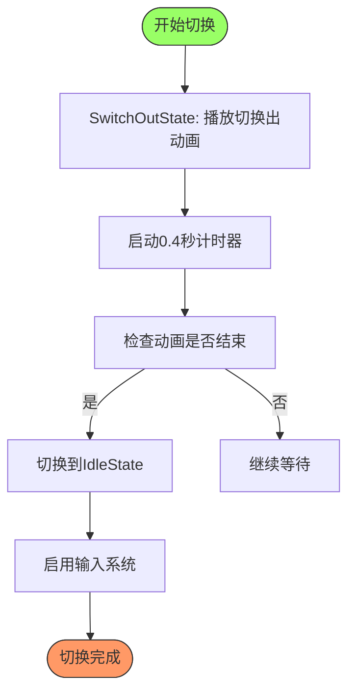
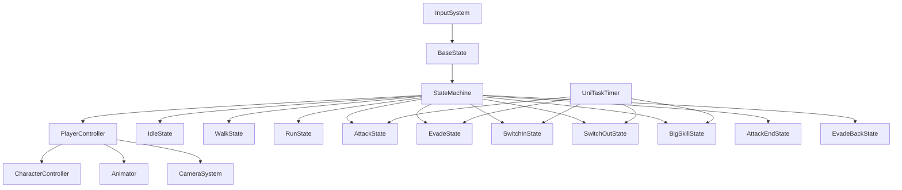

# 具体状态实现

<cite>
**本文档中引用的文件**  
- [BaseState.cs](file://Assets/Scripts/Controller/FSM/BaseState.cs)
- [IState.cs](file://Assets/Scripts/Controller/FSM/IState.cs)
- [StateMachine.cs](file://Assets/Scripts/Controller/FSM/StateMachine.cs)
- [PlayerController.cs](file://Assets/Scripts/Controller/PlayerController.cs)
- [IdleState.cs](file://Assets/Scripts/Controller/FSM/CharacterState/IdleState.cs)
- [WalkState.cs](file://Assets/Scripts/Controller/FSM/CharacterState/WalkState.cs)
- [RunState.cs](file://Assets/Scripts/Controller/FSM/CharacterState/RunState.cs)
- [AttackState.cs](file://Assets/Scripts/Controller/FSM/CharacterState/AttackState.cs)
- [EvadeState.cs](file://Assets/Scripts/Controller/FSM/CharacterState/EvadeState.cs)
- [SwitchInState.cs](file://Assets/Scripts/Controller/FSM/CharacterState/SwitchInState.cs)
- [SwitchOutState.cs](file://Assets/Scripts/Controller/FSM/CharacterState/SwitchOutState.cs)
- [BigSkillState.cs](file://Assets/Scripts/Controller/FSM/CharacterState/BigSkillState.cs)
- [AttackEndState.cs](file://Assets/Scripts/Controller/FSM/CharacterState/AttackEndState.cs)
- [EvadeBackState.cs](file://Assets/Scripts/Controller/FSM/CharacterState/EvadeBackState.cs)
- [UniTaskTimer.cs](file://Assets/Scripts/Tool/UniTaskTimer.cs)
- [InputSystem.cs](file://Assets/Scripts/Manager/InputSystem/InputSystem.cs)
</cite>

## 目录
1. [简介](#简介)
2. [项目结构](#项目结构)
3. [核心组件](#核心组件)
4. [架构概述](#架构概述)
5. [详细组件分析](#详细组件分析)
6. [依赖分析](#依赖分析)
7. [性能考虑](#性能考虑)
8. [故障排除指南](#故障排除指南)
9. [结论](#结论)

## 简介
本文档详细分析了Unity项目中具体状态的实现，重点关注有限状态机（FSM）模式下的各种角色状态。文档涵盖了移动状态（如IdleState、WalkState、RunState）、战斗状态（如AttackState、EvadeState）以及角色切换状态（如SwitchInState、SwitchOutState）的实现模式。通过分析这些状态在OnStateEnter中的初始化逻辑、OnStateUpdate中的行为控制和OnStateExit中的清理工作，为开发者提供了新状态开发的模板和最佳实践。

## 项目结构
项目采用分层架构，将控制器、数据、事件、管理器和工具类分别组织在不同的目录中。状态机相关代码位于`Assets/Scripts/Controller/FSM/`目录下，包括基础状态类、具体状态实现和状态机管理器。

**图示来源**
- [BaseState.cs](file://Assets/Scripts/Controller/FSM/BaseState.cs)
- [StateMachine.cs](file://Assets/Scripts/Controller/FSM/StateMachine.cs)
- [PlayerController.cs](file://Assets/Scripts/Controller/PlayerController.cs)

**本节来源**
- [BaseState.cs](file://Assets/Scripts/Controller/FSM/BaseState.cs)
- [StateMachine.cs](file://Assets/Scripts/Controller/FSM/StateMachine.cs)

## 核心组件
系统的核心组件包括状态机（StateMachine）、基础状态（BaseState）、具体状态实现和输入系统。状态机负责管理状态的注册、切换和更新，基础状态提供通用功能和事件处理，具体状态实现定义了特定行为，输入系统则负责将用户输入转换为状态转换事件。

**本节来源**
- [StateMachine.cs](file://Assets/Scripts/Controller/FSM/StateMachine.cs)
- [BaseState.cs](file://Assets/Scripts/Controller/FSM/BaseState.cs)
- [InputSystem.cs](file://Assets/Scripts/Manager/InputSystem/InputSystem.cs)

## 架构概述
系统采用有限状态机模式实现角色行为控制。状态机作为中央控制器，管理所有可能的状态实例，并处理状态之间的转换。每个状态继承自BaseState，实现IState接口定义的生命周期方法。输入系统通过事件驱动机制触发状态转换，而UniTaskTimer用于实现基于时间的状态控制。

**图示来源**
- [IState.cs](file://Assets/Scripts/Controller/FSM/IState.cs)
- [BaseState.cs](file://Assets/Scripts/Controller/FSM/BaseState.cs)
- [StateMachine.cs](file://Assets/Scripts/Controller/FSM/StateMachine.cs)
- [PlayerController.cs](file://Assets/Scripts/Controller/PlayerController.cs)

## 详细组件分析
本节详细分析各种状态的实现模式，包括移动状态、战斗状态和角色切换状态。

### 移动状态分析
移动状态包括IdleState、WalkState和RunState，负责处理角色的静止和移动行为。

#### 移动状态类图

**图示来源**
- [IdleState.cs](file://Assets/Scripts/Controller/FSM/CharacterState/IdleState.cs)
- [WalkState.cs](file://Assets/Scripts/Controller/FSM/CharacterState/WalkState.cs)
- [RunState.cs](file://Assets/Scripts/Controller/FSM/CharacterState/RunState.cs)

**本节来源**
- [IdleState.cs](file://Assets/Scripts/Controller/FSM/CharacterState/IdleState.cs)
- [WalkState.cs](file://Assets/Scripts/Controller/FSM/CharacterState/WalkState.cs)
- [RunState.cs](file://Assets/Scripts/Controller/FSM/CharacterState/RunState.cs)

### 战斗状态分析
战斗状态包括AttackState、EvadeState、BigSkillState和AttackEndState，处理角色的攻击、闪避和特殊技能行为。

#### 攻击状态序列图

**图示来源**
- [AttackState.cs](file://Assets/Scripts/Controller/FSM/CharacterState/AttackState.cs)
- [AttackEndState.cs](file://Assets/Scripts/Controller/FSM/CharacterState/AttackEndState.cs)
- [StateMachine.cs](file://Assets/Scripts/Controller/FSM/StateMachine.cs)

**本节来源**
- [AttackState.cs](file://Assets/Scripts/Controller/FSM/CharacterState/AttackState.cs)
- [EvadeState.cs](file://Assets/Scripts/Controller/FSM/CharacterState/EvadeState.cs)
- [BigSkillState.cs](file://Assets/Scripts/Controller/FSM/CharacterState/BigSkillState.cs)
- [AttackEndState.cs](file://Assets/Scripts/Controller/FSM/CharacterState/AttackEndState.cs)

### 角色切换状态分析
角色切换状态包括SwitchInState和SwitchOutState，处理角色之间的切换逻辑。

#### 角色切换状态流程图

**图示来源**
- [SwitchInState.cs](file://Assets/Scripts/Controller/FSM/CharacterState/SwitchInState.cs)
- [SwitchOutState.cs](file://Assets/Scripts/Controller/FSM/CharacterState/SwitchOutState.cs)
- [UniTaskTimer.cs](file://Assets/Scripts/Tool/UniTaskTimer.cs)

**本节来源**
- [SwitchInState.cs](file://Assets/Scripts/Controller/FSM/CharacterState/SwitchInState.cs)
- [SwitchOutState.cs](file://Assets/Scripts/Controller/FSM/CharacterState/SwitchOutState.cs)

## 依赖分析
系统各组件之间存在明确的依赖关系，状态机依赖于玩家控制器、角色控制器和动画系统，而具体状态则依赖于状态机来访问这些系统。

**图示来源**
- [StateMachine.cs](file://Assets/Scripts/Controller/FSM/StateMachine.cs)
- [PlayerController.cs](file://Assets/Scripts/Controller/PlayerController.cs)
- [InputSystem.cs](file://Assets/Scripts/Manager/InputSystem/InputSystem.cs)
- [UniTaskTimer.cs](file://Assets/Scripts/Tool/UniTaskTimer.cs)

**本节来源**
- [StateMachine.cs](file://Assets/Scripts/Controller/FSM/StateMachine.cs)
- [PlayerController.cs](file://Assets/Scripts/Controller/PlayerController.cs)
- [InputSystem.cs](file://Assets/Scripts/Manager/InputSystem/InputSystem.cs)

## 性能考虑
系统在性能方面采用了多种优化策略。状态机使用字典存储状态实例，确保状态注册和查找的时间复杂度为O(1)。UniTaskTimer实现为0GC的计时器，避免了频繁的内存分配。动画参数通过直接播放动画名称而非设置布尔值来减少Animator开销。

## 故障排除指南
当状态转换出现问题时，首先检查状态是否已正确注册到状态机中。确保输入事件正确绑定和解绑，避免事件处理函数的重复调用。对于基于时间的状态转换，验证UniTaskTimer是否正确启动和停止。如果动画没有正确播放，检查动画名称是否与Animator中的状态匹配。

**本节来源**
- [StateMachine.cs](file://Assets/Scripts/Controller/FSM/StateMachine.cs)
- [BaseState.cs](file://Assets/Scripts/Controller/FSM/BaseState.cs)
- [UniTaskTimer.cs](file://Assets/Scripts/Tool/UniTaskTimer.cs)

## 结论
本文档详细分析了项目中具体状态的实现模式，展示了如何通过有限状态机模式有效地管理角色的复杂行为。通过继承BaseState并实现IState接口，各种具体状态能够共享通用功能，同时保持各自的独特行为。状态机作为中央控制器，确保了状态转换的有序性和一致性。这种设计模式为添加新状态和修改现有状态提供了良好的扩展性和维护性。