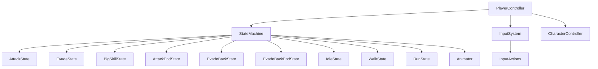
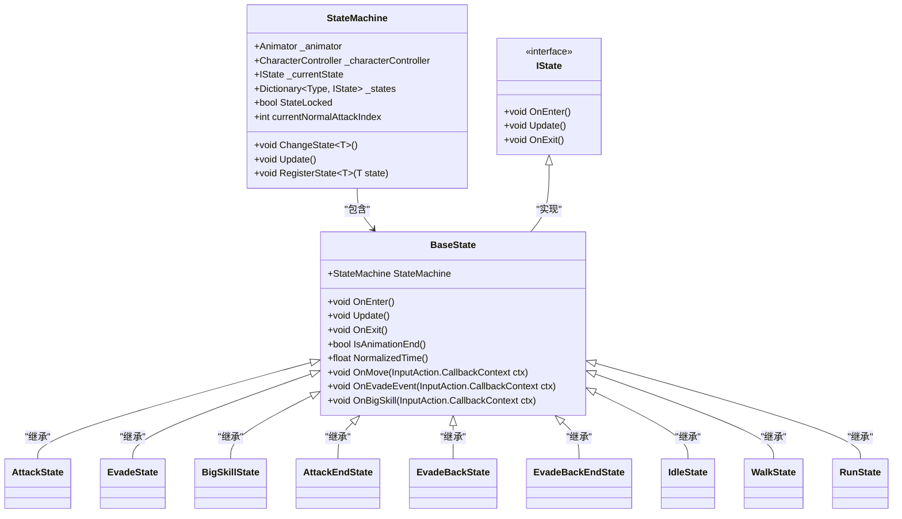
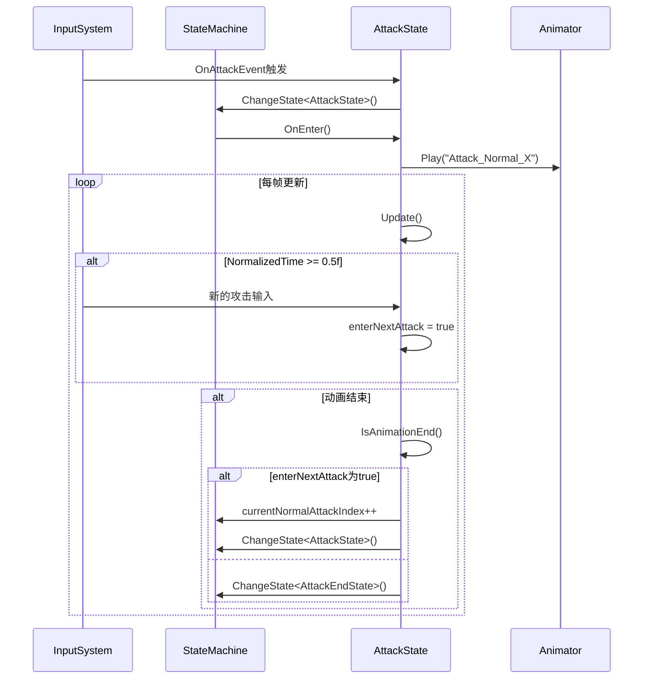
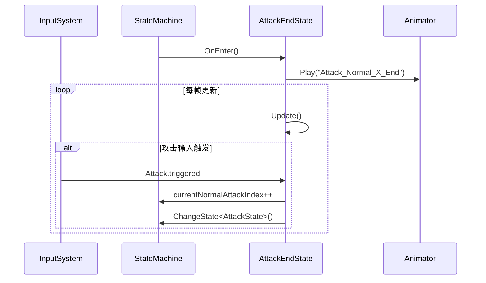
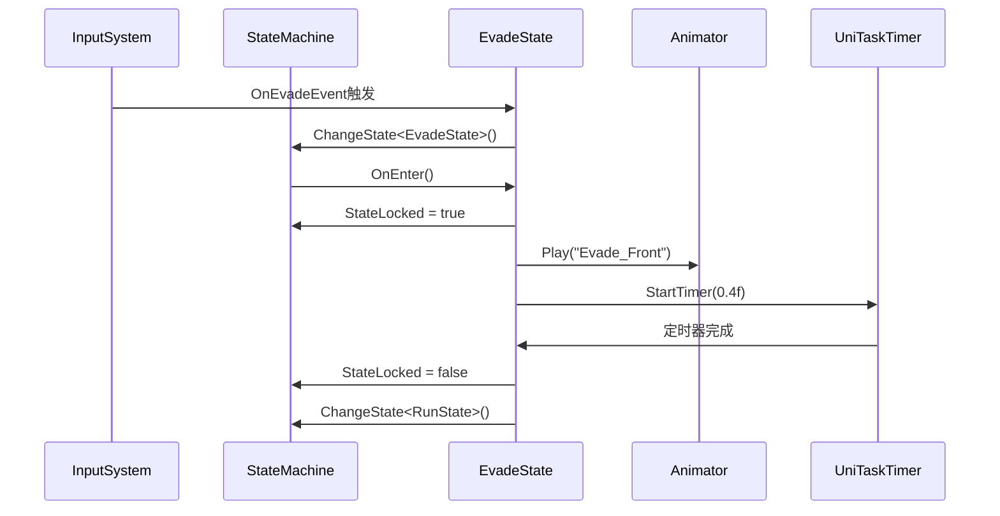
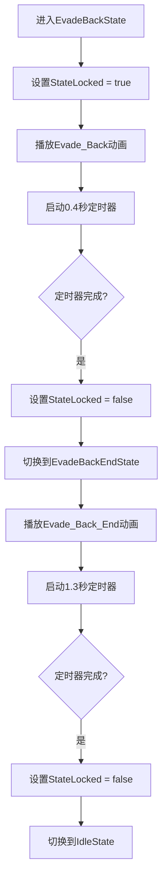
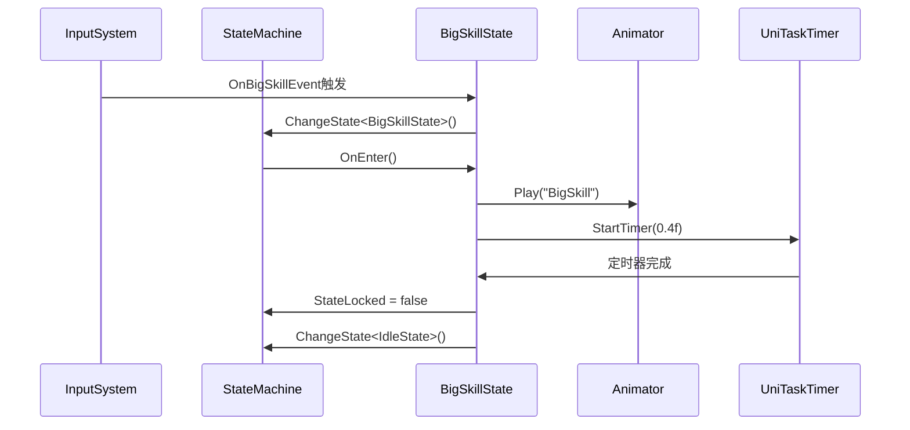
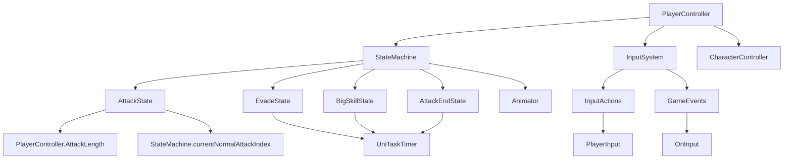

# 战斗状态

<cite>
**本文档引用的文件**
- [AttackState.cs](file://Assets/Scripts/Controller/FSM/CharacterState/AttackState.cs)
- [EvadeState.cs](file://Assets/Scripts/Controller/FSM/CharacterState/EvadeState.cs)
- [BigSkillState.cs](file://Assets/Scripts/Controller/FSM/CharacterState/BigSkillState.cs)
- [AttackEndState.cs](file://Assets/Scripts/Controller/FSM/CharacterState/AttackEndState.cs)
- [BaseState.cs](file://Assets/Scripts/Controller/FSM/BaseState.cs)
- [StateMachine.cs](file://Assets/Scripts/Controller/FSM/StateMachine.cs)
- [PlayerController.cs](file://Assets/Scripts/Controller/PlayerController.cs)
- [InputSystem.cs](file://Assets/Scripts/Manager/InputSystem/InputSystem.cs)
- [PlayerInfo.cs](file://Assets/Scripts/Data/SOBase/PlayerInfo.cs)
- [GameEvents.cs](file://Assets/Scripts/Manager/EventSystem/GameEvents.cs)
- [EventLists.cs](file://Assets/Scripts/Manager/EventSystem/EventLists.cs)
- [EvadeBackState.cs](file://Assets/Scripts/Controller/FSM/CharacterState/EvadeBackState.cs)
- [EvadeBackEndState.cs](file://Assets/Scripts/Controller/FSM/CharacterState/EvadeBackEndState.cs)
</cite>

## 目录
1. [简介](#简介)
2. [项目结构](#项目结构)
3. [核心组件](#核心组件)
4. [架构概述](#架构概述)
5. [详细组件分析](#详细组件分析)
6. [依赖分析](#依赖分析)
7. [性能考虑](#性能考虑)
8. [故障排除指南](#故障排除指南)
9. [结论](#结论)

## 简介
本文档详细分析了Unity项目中的战斗状态系统，重点关注AttackState、EvadeState、BigSkillState等核心战斗行为的实现。文档深入探讨了攻击状态如何管理连击序列、处理攻击窗口与硬直时间、触发特效与音效；闪避状态如何实现无敌帧判定、方向控制与资源消耗；大招状态如何协调特殊动画与全局状态锁定。同时解释了战斗状态与UI系统、音效系统的事件通信机制，以及与角色属性系统的数据交互。

## 项目结构
战斗状态系统位于Assets/Scripts/Controller/FSM/CharacterState目录下，采用状态机模式实现角色的各种行为状态。系统通过PlayerController初始化状态机，并注册各种状态。输入系统通过事件驱动状态转换，实现了流畅的战斗体验。

**图示来源**
- [PlayerController.cs](file://Assets/Scripts/Controller/PlayerController.cs#L0-L102)
- [StateMachine.cs](file://Assets/Scripts/Controller/FSM/StateMachine.cs#L0-L114)

**本节来源**
- [PlayerController.cs](file://Assets/Scripts/Controller/PlayerController.cs#L0-L102)
- [StateMachine.cs](file://Assets/Scripts/Controller/FSM/StateMachine.cs#L0-L114)

## 核心组件
战斗状态系统的核心组件包括AttackState（攻击状态）、EvadeState（闪避状态）、BigSkillState（大招状态）和AttackEndState（攻击结束状态）。这些状态通过状态机进行管理，每个状态都有明确的进入、更新和退出逻辑。系统通过输入事件触发状态转换，实现了复杂的战斗行为。

**本节来源**
- [AttackState.cs](file://Assets/Scripts/Controller/FSM/CharacterState/AttackState.cs#L0-L60)
- [EvadeState.cs](file://Assets/Scripts/Controller/FSM/CharacterState/EvadeState.cs#L0-L22)
- [BigSkillState.cs](file://Assets/Scripts/Controller/FSM/CharacterState/BigSkillState.cs#L0-L21)

## 架构概述
战斗状态系统采用有限状态机（FSM）架构，由StateMachine类统一管理所有状态。BaseState作为所有状态的基类，提供了统一的接口和事件处理机制。状态机通过Animator控制角色动画，通过InputSystem接收玩家输入，并根据当前状态执行相应的逻辑。

**图示来源**
- [StateMachine.cs](file://Assets/Scripts/Controller/FSM/StateMachine.cs#L0-L114)
- [BaseState.cs](file://Assets/Scripts/Controller/FSM/BaseState.cs#L0-L84)

## 详细组件分析
本节详细分析战斗状态系统中的各个关键组件，包括攻击状态、闪避状态、大招状态等的实现细节。

### 攻击状态分析
攻击状态（AttackState）管理角色的普通攻击行为，包括连击序列、攻击窗口和硬直时间的处理。

#### 攻击状态实现

**图示来源**
- [AttackState.cs](file://Assets/Scripts/Controller/FSM/CharacterState/AttackState.cs#L0-L60)
- [BaseState.cs](file://Assets/Scripts/Controller/FSM/BaseState.cs#L0-L84)

#### 攻击结束状态实现

**图示来源**
- [AttackEndState.cs](file://Assets/Scripts/Controller/FSM/CharacterState/AttackEndState.cs#L0-L43)
- [BaseState.cs](file://Assets/Scripts/Controller/FSM/BaseState.cs#L0-L84)

**本节来源**
- [AttackState.cs](file://Assets/Scripts/Controller/FSM/CharacterState/AttackState.cs#L0-L60)
- [AttackEndState.cs](file://Assets/Scripts/Controller/FSM/CharacterState/AttackEndState.cs#L0-L43)
- [BaseState.cs](file://Assets/Scripts/Controller/FSM/BaseState.cs#L0-L84)

### 闪避状态分析
闪避状态（EvadeState）处理角色的闪避行为，包括无敌帧判定、方向控制和资源消耗。

#### 闪避状态实现

**图示来源**
- [EvadeState.cs](file://Assets/Scripts/Controller/FSM/CharacterState/EvadeState.cs#L0-L22)
- [EvadeBackState.cs](file://Assets/Scripts/Controller/FSM/CharacterState/EvadeBackState.cs#L0-L25)
- [EvadeBackEndState.cs](file://Assets/Scripts/Controller/FSM/CharacterState/EvadeBackEndState.cs#L0-L30)

#### 闪避后状态实现

**图示来源**
- [EvadeBackState.cs](file://Assets/Scripts/Controller/FSM/CharacterState/EvadeBackState.cs#L0-L25)
- [EvadeBackEndState.cs](file://Assets/Scripts/Controller/FSM/CharacterState/EvadeBackEndState.cs#L0-L30)

**本节来源**
- [EvadeState.cs](file://Assets/Scripts/Controller/FSM/CharacterState/EvadeState.cs#L0-L22)
- [EvadeBackState.cs](file://Assets/Scripts/Controller/FSM/CharacterState/EvadeBackState.cs#L0-L25)
- [EvadeBackEndState.cs](file://Assets/Scripts/Controller/FSM/CharacterState/EvadeBackEndState.cs#L0-L30)

### 大招状态分析
大招状态（BigSkillState）处理角色的终极技能，协调特殊动画与全局状态锁定。

#### 大招状态实现

**图示来源**
- [BigSkillState.cs](file://Assets/Scripts/Controller/FSM/CharacterState/BigSkillState.cs#L0-L21)
- [BaseState.cs](file://Assets/Scripts/Controller/FSM/BaseState.cs#L0-L84)

**本节来源**
- [BigSkillState.cs](file://Assets/Scripts/Controller/FSM/CharacterState/BigSkillState.cs#L0-L21)

## 依赖分析
战斗状态系统与其他系统有紧密的依赖关系，包括输入系统、动画系统、事件系统等。

**图示来源**
- [PlayerController.cs](file://Assets/Scripts/Controller/PlayerController.cs#L0-L102)
- [StateMachine.cs](file://Assets/Scripts/Controller/FSM/StateMachine.cs#L0-L114)
- [InputSystem.cs](file://Assets/Scripts/Manager/InputSystem/InputSystem.cs#L0-L93)
- [GameEvents.cs](file://Assets/Scripts/Manager/EventSystem/GameEvents.cs#L0-L23)

**本节来源**
- [PlayerController.cs](file://Assets/Scripts/Controller/PlayerController.cs#L0-L102)
- [StateMachine.cs](file://Assets/Scripts/Controller/FSM/StateMachine.cs#L0-L114)
- [InputSystem.cs](file://Assets/Scripts/Manager/InputSystem/InputSystem.cs#L0-L93)
- [GameEvents.cs](file://Assets/Scripts/Manager/EventSystem/GameEvents.cs#L0-L23)

## 性能考虑
战斗状态系统在性能方面有以下考虑：
1. 使用对象池模式管理状态实例，避免频繁的内存分配
2. 通过StateLocked标志位控制状态转换，防止非法状态切换
3. 使用UniTaskTimer进行定时操作，避免使用协程带来的性能开销
4. 在状态切换时正确注册和注销事件监听，防止内存泄漏
5. 使用NormalizedTime()方法精确控制攻击窗口，提高战斗体验

## 故障排除指南
### 常见问题及解决方案
1. **状态无法切换**
   - 检查StateLocked是否为true
   - 确认状态机是否已启用
   - 检查输入事件是否正确触发

2. **连击中断**
   - 检查NormalizedTime()阈值是否合适
   - 确认currentNormalAttackIndex是否正确重置
   - 检查动画剪辑长度是否匹配

3. **闪避后无法移动**
   - 检查EvadeBackEndState的定时器是否正确设置
   - 确认StateLocked是否在定时器完成后设置为false
   - 检查是否正确切换到RunState或IdleState

4. **大招无法释放**
   - 检查技能冷却逻辑
   - 确认能量值是否足够
   - 检查输入事件绑定是否正确

**本节来源**
- [StateMachine.cs](file://Assets/Scripts/Controller/FSM/StateMachine.cs#L0-L114)
- [BaseState.cs](file://Assets/Scripts/Controller/FSM/BaseState.cs#L0-L84)
- [PlayerController.cs](file://Assets/Scripts/Controller/PlayerController.cs#L0-L102)

## 结论
本文档详细分析了Unity项目中的战斗状态系统，涵盖了攻击、闪避、大招等核心战斗行为的实现。系统采用有限状态机架构，通过清晰的状态转换逻辑实现了流畅的战斗体验。攻击状态通过NormalizedTime()方法精确控制攻击窗口，实现了连击机制；闪避状态使用定时器管理无敌帧和状态恢复；大招状态协调特殊动画与全局状态锁定。系统与输入系统、事件系统紧密集成，通过事件驱动实现状态转换。开发者在实现新的战斗状态时，应遵循现有模式，注意状态锁定、事件注册/注销和性能优化等关键点。