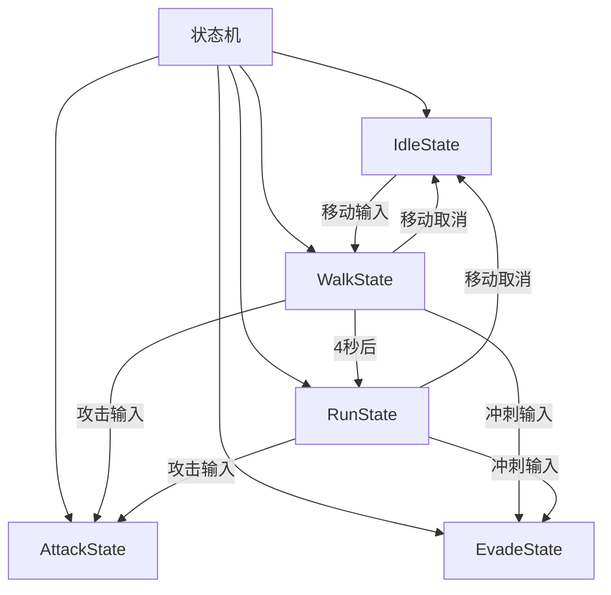
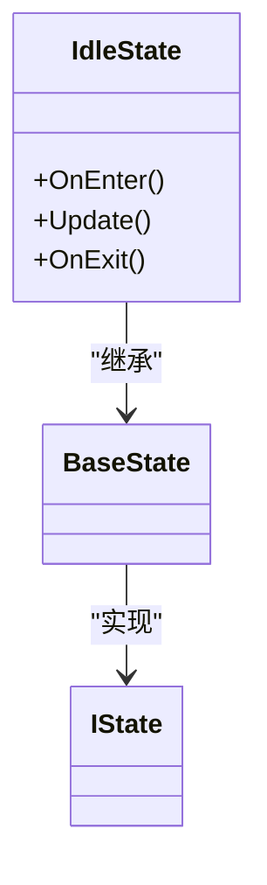
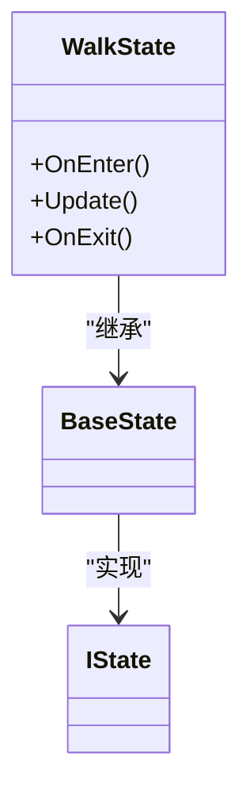
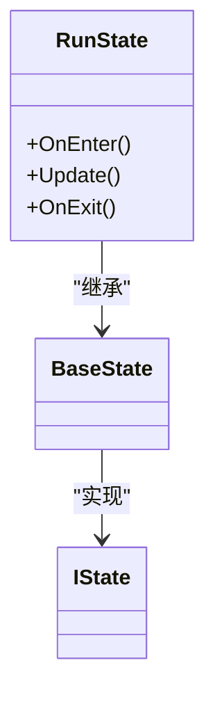
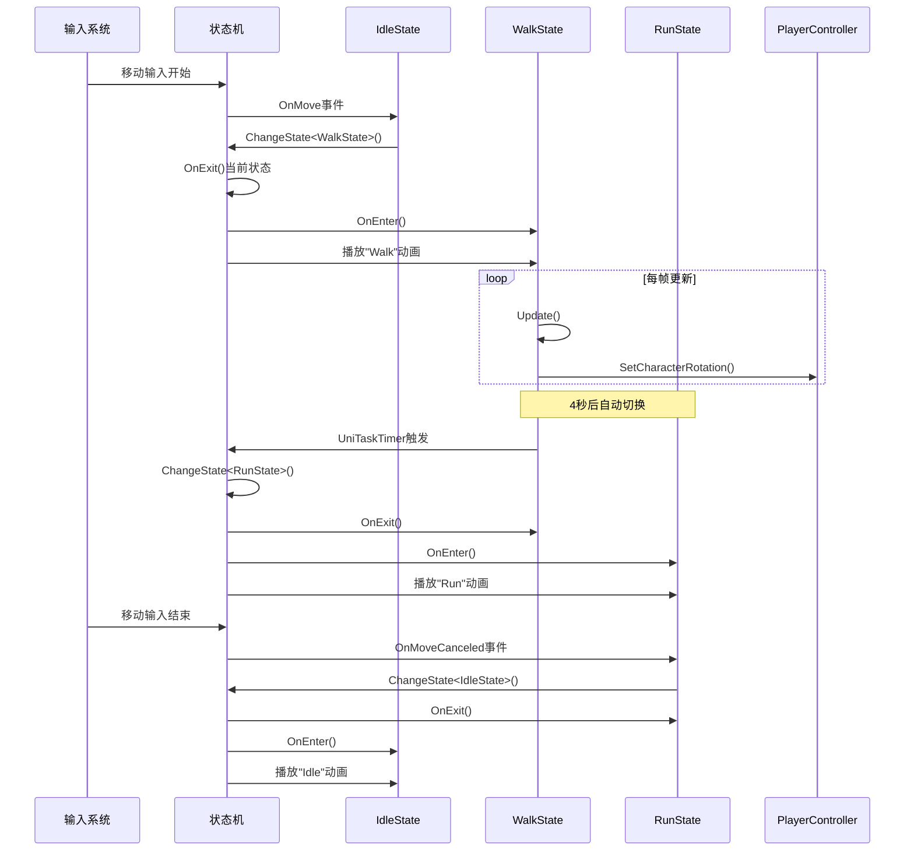
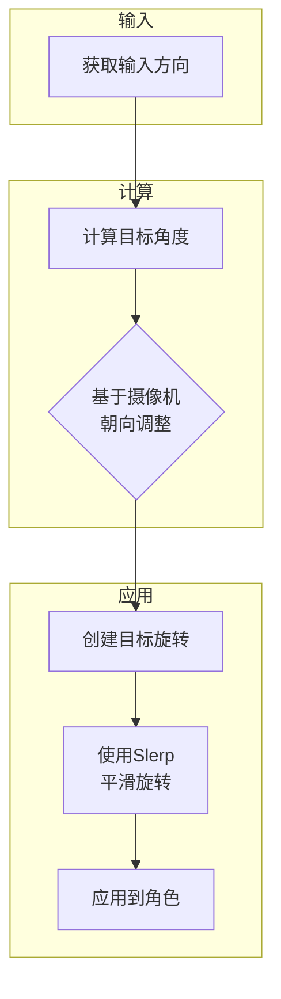
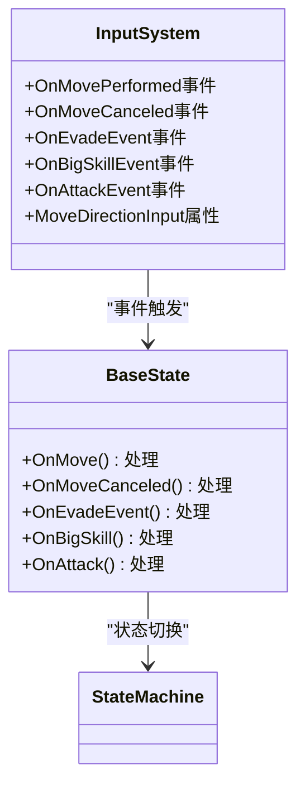

# 移动状态

<cite>
**本文档引用的文件**
- [IdleState.cs](file://Assets/Scripts/Controller/FSM/CharacterState/IdleState.cs)
- [WalkState.cs](file://Assets/Scripts/Controller/FSM/CharacterState/WalkState.cs)
- [RunState.cs](file://Assets/Scripts/Controller/FSM/CharacterState/RunState.cs)
- [BaseState.cs](file://Assets/Scripts/Controller/FSM/BaseState.cs)
- [StateMachine.cs](file://Assets/Scripts/Controller/FSM/StateMachine.cs)
- [PlayerController.cs](file://Assets/Scripts/Controller/PlayerController.cs)
- [InputSystem.cs](file://Assets/Scripts/Manager/InputSystem/InputSystem.cs)
- [CameraSystem.cs](file://Assets/Scripts/Manager/CameraSystem/CameraSystem.cs)
</cite>

## 目录
1. [简介](#简介)
2. [移动状态架构](#移动状态架构)
3. [核心移动状态分析](#核心移动状态分析)
4. [状态转换机制](#状态转换机制)
5. [动画系统集成](#动画系统集成)
6. [物理与转向系统](#物理与转向系统)
7. [输入系统集成](#输入系统集成)
8. [新移动状态开发最佳实践](#新移动状态开发最佳实践)
9. [结论](#结论)

## 简介
本文档详细分析了Unity项目中的移动状态系统，重点关注IdleState（待机状态）、WalkState（行走状态）和RunState（奔跑状态）的实现机制。文档详细说明了各状态在OnStateEnter中如何初始化角色移动参数、OnStateUpdate中如何处理输入与移动逻辑、OnStateExit中如何重置速度与动画参数。同时，文档解释了移动状态与动画系统、物理系统的集成方式，包括Animator参数设置、地面检测和转向逻辑，并为开发者提供新移动状态开发的最佳实践。

## 移动状态架构



**图示来源**
- [StateMachine.cs](file://Assets/Scripts/Controller/FSM/StateMachine.cs#L1-L115)
- [BaseState.cs](file://Assets/Scripts/Controller/FSM/BaseState.cs#L1-L85)

## 核心移动状态分析

### 待机状态 (IdleState)

待机状态是角色的默认状态，当角色没有移动输入时处于此状态。该状态主要负责监听移动输入事件，以便在用户开始移动时切换到行走状态。



**图示来源**
- [IdleState.cs](file://Assets/Scripts/Controller/FSM/CharacterState/IdleState.cs#L1-L25)
- [BaseState.cs](file://Assets/Scripts/Controller/FSM/BaseState.cs#L1-L85)

**状态进入 (OnEnter)**
- 播放"Idle"动画
- 注册移动、攻击、闪避和大技能输入事件的监听器

**状态更新 (Update)**
- 空实现，待机状态不需要持续更新逻辑

**状态退出 (OnExit)**
- 注销所有注册的输入事件监听器
- 调用基类的OnExit方法

**本节来源**
- [IdleState.cs](file://Assets/Scripts/Controller/FSM/CharacterState/IdleState.cs#L1-L25)

### 行走状态 (WalkState)

行走状态处理角色的行走逻辑，当用户开始移动时从待机状态切换到此状态。该状态具有自动升级到奔跑状态的机制。



**图示来源**
- [WalkState.cs](file://Assets/Scripts/Controller/FSM/CharacterState/WalkState.cs#L1-L32)
- [BaseState.cs](file://Assets/Scripts/Controller/FSM/BaseState.cs#L1-L85)

**状态进入 (OnEnter)**
- 播放"Walk"动画
- 注册移动取消、闪避、大技能和攻击输入事件的监听器
- 启动4秒计时器，超时后自动切换到奔跑状态

**状态更新 (Update)**
- 调用PlayerController的SetCharacterRotation方法，根据输入方向和摄像机朝向更新角色旋转

**状态退出 (OnExit)**
- 注销所有注册的输入事件监听器
- 调用基类的OnExit方法

**本节来源**
- [WalkState.cs](file://Assets/Scripts/Controller/FSM/CharacterState/WalkState.cs#L1-L32)

### 奔跑状态 (RunState)

奔跑状态处理角色的快速移动逻辑，可以通过两种方式进入：从行走状态自动升级或通过闪避输入直接进入。



**图示来源**
- [RunState.cs](file://Assets/Scripts/Controller/FSM/CharacterState/RunState.cs#L1-L26)
- [BaseState.cs](file://Assets/Scripts/Controller/FSM/BaseState.cs#L1-L85)

**状态进入 (OnEnter)**
- 调用基类的OnEnter方法
- 播放"Run"动画
- 注册移动取消、闪避、大技能和攻击输入事件的监听器

**状态更新 (Update)**
- 调用PlayerController的SetCharacterRotation方法，根据输入方向和摄像机朝向更新角色旋转

**状态退出 (OnExit)**
- 注销所有注册的输入事件监听器
- 调用基类的OnExit方法

**本节来源**
- [RunState.cs](file://Assets/Scripts/Controller/FSM/CharacterState/RunState.cs#L1-L26)

## 状态转换机制



**图示来源**
- [BaseState.cs](file://Assets/Scripts/Controller/FSM/BaseState.cs#L60-L100)
- [StateMachine.cs](file://Assets/Scripts/Controller/FSM/StateMachine.cs#L42-L57)
- [PlayerController.cs](file://Assets/Scripts/Controller/PlayerController.cs#L62-L72)

状态转换机制基于事件驱动模式，通过InputSystem发布输入事件，BaseState中的事件处理方法响应这些事件并调用StateMachine的ChangeState方法进行状态切换。状态机确保在切换状态时正确执行当前状态的OnExit方法和新状态的OnEnter方法。

## 动画系统集成

移动状态系统与Unity的Animator系统紧密集成，每个状态在进入时都会播放相应的动画剪辑：

- **IdleState**: 播放"Idle"动画
- **WalkState**: 播放"Walk"动画  
- **RunState**: 播放"Run"动画

状态机通过StateMachine._animator引用直接控制Animator组件，确保状态变化与动画播放同步。这种直接的动画控制方式避免了复杂的Animator参数设置，简化了状态与动画的同步逻辑。

```mermaid
flowchart TD
A[状态进入] --> B{状态类型}
B --> |IdleState| C[播放"Idle"动画]
B --> |WalkState| D[播放"Walk"动画]
B --> |RunState| E[播放"Run"动画]
C --> F[动画系统]
D --> F
E --> F
F --> G[角色渲染]
```

**图示来源**
- [IdleState.cs](file://Assets/Scripts/Controller/FSM/CharacterState/IdleState.cs#L5-L10)
- [WalkState.cs](file://Assets/Scripts/Controller/FSM/CharacterState/WalkState.cs#L5-L15)
- [RunState.cs](file://Assets/Scripts/Controller/FSM/CharacterState/RunState.cs#L5-L10)

## 物理与转向系统

移动状态系统集成了角色的物理和转向逻辑，确保角色能够根据玩家输入和摄像机方向正确移动。

### 转向逻辑

转向逻辑在PlayerController的SetCharacterRotation方法中实现，该方法被行走和奔跑状态在每帧更新中调用：



**图示来源**
- [PlayerController.cs](file://Assets/Scripts/Controller/PlayerController.cs#L62-L72)
- [CameraSystem.cs](file://Assets/Scripts/Manager/CameraSystem/CameraSystem.cs#L1-L36)

转向逻辑考虑了摄像机的当前朝向，使角色移动方向与摄像机视角保持一致，提供更直观的控制体验。使用Quaternion.Slerp实现平滑旋转，避免了角色的突兀转向。

## 输入系统集成

移动状态系统与InputSystem紧密集成，通过事件订阅机制响应玩家输入：



**图示来源**
- [InputSystem.cs](file://Assets/Scripts/Manager/InputSystem/InputSystem.cs#L1-L94)
- [BaseState.cs](file://Assets/Scripts/Controller/FSM/BaseState.cs#L60-L100)

输入系统使用Unity的Input System包，定义了多种输入动作：
- **Move**: 移动输入，触发OnMovePerformed和OnMoveCanceled事件
- **Run**: 奔跑/冲刺输入，触发OnEvadeEvent事件
- **Attack**: 攻击输入，触发OnAttackEvent事件
- **BigSkill**: 大技能输入，触发OnBigSkillEvent事件

各移动状态在OnEnter时订阅相关事件，在OnExit时取消订阅，确保事件处理的正确性和内存安全。

## 新移动状态开发最佳实践

### 输入响应优化

1. **事件订阅管理**: 在OnEnter中订阅事件，在OnExit中取消订阅，避免内存泄漏
2. **输入去抖动**: 对快速连续的输入进行过滤，避免状态频繁切换
3. **输入缓冲**: 实现输入缓冲机制，确保快速操作不会被错过

### 移动平滑插值

1. **使用Slerp进行旋转插值**: 如PlayerController中的SetCharacterRotation方法所示
2. **速度插值**: 在状态切换时平滑过渡移动速度，避免突兀变化
3. **动画混合**: 利用Animator的混合树实现不同移动速度间的平滑过渡

### 状态切换延迟处理

1. **计时器机制**: 如WalkState中使用UniTaskTimer在4秒后自动切换到奔跑状态
2. **条件检查**: 在切换前检查角色是否在地面上、是否有障碍物等
3. **状态锁定**: 使用StateMachine.StateLocked机制防止在特定动画播放期间被中断

### 代码组织建议

1. **继承BaseState**: 新状态应继承BaseState以复用事件处理逻辑
2. **单一职责**: 每个状态只负责特定的移动行为
3. **清晰的生命周期**: 正确实现OnEnter、Update和OnExit方法
4. **资源管理**: 在OnExit中释放所有资源和事件订阅

## 结论

本移动状态系统采用状态机模式实现了角色移动的精细化控制，通过IdleState、WalkState和RunState三个核心状态提供了完整的移动体验。系统具有以下特点：

1. **模块化设计**: 每个状态独立实现，易于扩展和维护
2. **事件驱动**: 基于输入事件的状态转换，响应灵敏
3. **自动升级**: 行走状态在持续移动4秒后自动升级为奔跑状态
4. **平滑过渡**: 通过Slerp插值实现角色旋转的平滑过渡
5. **摄像机集成**: 移动方向基于摄像机朝向计算，提供直观的控制体验

开发者在创建新的移动状态时，应遵循已有的设计模式，确保新状态与现有系统的无缝集成，同时注意输入响应优化、移动平滑插值和状态切换延迟处理等最佳实践。