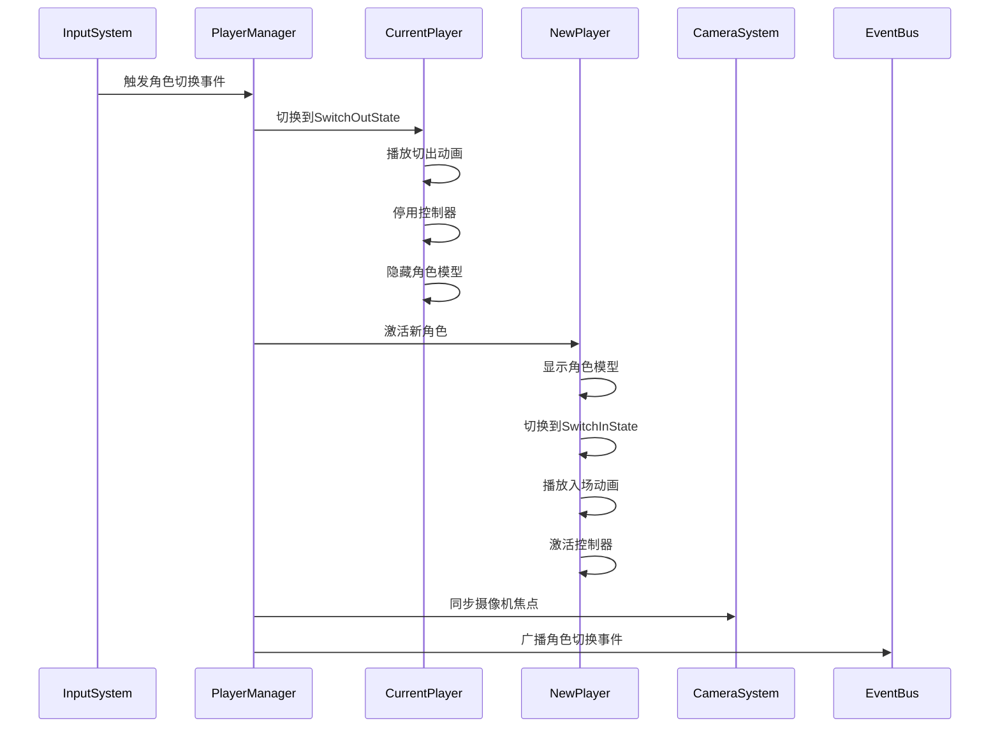
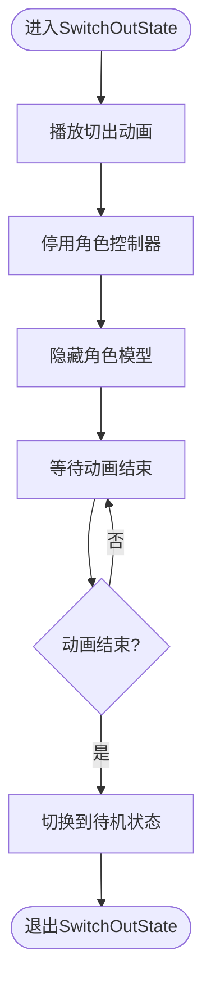
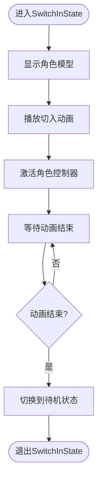
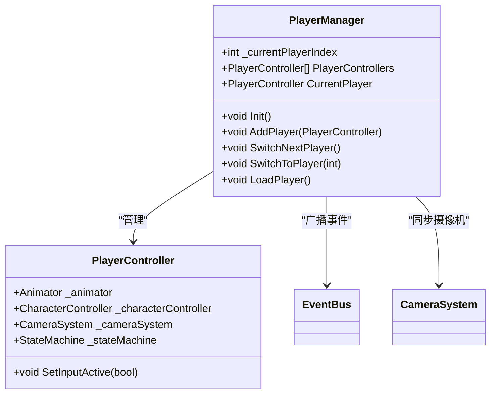

# 角色切换状态

<cite>
**本文档引用的文件**
- [SwitchInState.cs](file://Assets/Scripts/Controller/FSM/CharacterState/SwitchInState.cs)
- [SwitchOutState.cs](file://Assets/Scripts/Controller/FSM/CharacterState/SwitchOutState.cs)
- [PlayerManager.cs](file://Assets/Scripts/Manager/PlayerManager/PlayerManager.cs)
- [EventBus.cs](file://Assets/Scripts/Manager/EventSystem/EventBus.cs)
- [PlayerController.cs](file://Assets/Scripts/Controller/PlayerController.cs)
- [CameraSystem.cs](file://Assets/Scripts/Manager/CameraSystem/CameraSystem.cs)
- [InputSystem.cs](file://Assets/Scripts/Manager/InputSystem/InputSystem.cs)
- [PlayerEvents.cs](file://Assets/Scripts/EventData/PlayerEvents.cs)
- [StateMachine.cs](file://Assets/Scripts/Controller/FSM/StateMachine.cs)
- [BaseState.cs](file://Assets/Scripts/Controller/FSM/BaseState.cs)
- [GameMain.cs](file://Assets/Scripts/Manager/GameMain.cs)
- [GameEvents.cs](file://Assets/Scripts/Manager/EventSystem/GameEvents.cs)
- [GameEvent.cs](file://Assets/Scripts/Manager/EventSystem/GameEvent.cs)
</cite>

## 目录
1. [简介](#简介)
2. [项目结构](#项目结构)
3. [核心组件](#核心组件)
4. [架构概述](#架构概述)
5. [详细组件分析](#详细组件分析)
6. [依赖分析](#依赖分析)
7. [性能考虑](#性能考虑)
8. [故障排除指南](#故障排除指南)
9. [结论](#结论)

## 简介
本文档详细分析了Unity项目中的角色切换状态系统，重点研究了`SwitchInState`和`SwitchOutState`的实现逻辑。文档详细说明了角色切出状态如何保存当前角色状态、停用控制器与碰撞体、播放切出动画；以及角色切入状态如何激活新角色、恢复控制权、同步位置与朝向、播放切入动画。同时，文档还解释了切换状态与摄像机系统的协同机制，包括视角过渡与焦点切换，并为开发者提供了角色切换状态扩展的最佳实践。

## 项目结构
项目采用分层架构，将控制器、管理器、数据和工具类分离。角色切换系统主要分布在`Controller/FSM`和`Manager`目录下，通过事件总线进行通信。

```mermaid
graph TD
subgraph "控制器层"
FSM[FSM]
PlayerController[PlayerController]
end
subgraph "管理层"
PlayerManager[PlayerManager]
CameraSystem[CameraSystem]
EventBus[EventBus]
InputSystem[InputSystem]
end
subgraph "数据层"
PlayerEvents[PlayerEvents]
GameEvents[GameEvents]
end
InputSystem --> PlayerManager : "触发角色切换"
PlayerManager --> FSM : "状态切换"
FSM --> PlayerController : "控制角色"
PlayerManager --> CameraSystem : "同步摄像机"
PlayerManager --> EventBus : "广播事件"
```

**图示来源**
- [PlayerManager.cs](file://Assets/Scripts/Manager/PlayerManager/PlayerManager.cs)
- [PlayerController.cs](file://Assets/Scripts/Controller/PlayerController.cs)
- [CameraSystem.cs](file://Assets/Scripts/Manager/CameraSystem/CameraSystem.cs)

**章节来源**
- [PlayerManager.cs](file://Assets/Scripts/Manager/PlayerManager/PlayerManager.cs)
- [PlayerController.cs](file://Assets/Scripts/Controller/PlayerController.cs)

## 核心组件
角色切换系统的核心组件包括`SwitchInState`、`SwitchOutState`、`PlayerManager`和`EventBus`。这些组件协同工作，实现了平滑的角色切换体验。

**章节来源**
- [SwitchInState.cs](file://Assets/Scripts/Controller/FSM/CharacterState/SwitchInState.cs)
- [SwitchOutState.cs](file://Assets/Scripts/Controller/FSM/CharacterState/SwitchOutState.cs)
- [PlayerManager.cs](file://Assets/Scripts/Manager/PlayerManager/PlayerManager.cs)

## 架构概述
角色切换系统采用状态机模式，通过事件驱动的方式协调多个角色的激活与停用。系统架构清晰，各组件职责明确，易于扩展和维护。



**图示来源**
- [InputSystem.cs](file://Assets/Scripts/Manager/InputSystem/InputSystem.cs)
- [PlayerManager.cs](file://Assets/Scripts/Manager/PlayerManager/PlayerManager.cs)
- [SwitchInState.cs](file://Assets/Scripts/Controller/FSM/CharacterState/SwitchInState.cs)
- [SwitchOutState.cs](file://Assets/Scripts/Controller/FSM/CharacterState/SwitchOutState.cs)
- [CameraSystem.cs](file://Assets/Scripts/Manager/CameraSystem/CameraSystem.cs)

## 详细组件分析
本节详细分析角色切换系统中的各个关键组件，包括状态机、角色控制器、玩家管理器等。

### SwitchOutState 分析
`SwitchOutState`负责处理角色切出的逻辑，包括播放切出动画、停用控制器和隐藏角色模型。



**图示来源**
- [SwitchOutState.cs](file://Assets/Scripts/Controller/FSM/CharacterState/SwitchOutState.cs)

**章节来源**
- [SwitchOutState.cs](file://Assets/Scripts/Controller/FSM/CharacterState/SwitchOutState.cs)

### SwitchInState 分析
`SwitchInState`负责处理角色切入的逻辑，包括播放切入动画、激活控制器和显示角色模型。



**图示来源**
- [SwitchInState.cs](file://Assets/Scripts/Controller/FSM/CharacterState/SwitchInState.cs)

**章节来源**
- [SwitchInState.cs](file://Assets/Scripts/Controller/FSM/CharacterState/SwitchInState.cs)

### PlayerManager 分析
`PlayerManager`是角色切换系统的核心协调者，负责管理所有角色的激活状态和切换逻辑。



**图示来源**
- [PlayerManager.cs](file://Assets/Scripts/Manager/PlayerManager/PlayerManager.cs)
- [PlayerController.cs](file://Assets/Scripts/Controller/PlayerController.cs)

**章节来源**
- [PlayerManager.cs](file://Assets/Scripts/Manager/PlayerManager/PlayerManager.cs)

## 依赖分析
角色切换系统依赖于多个子系统，包括输入系统、事件总线、摄像机系统等。这些依赖关系确保了系统的完整性和一致性。

```mermaid
graph TD
PlayerManager --> InputSystem : "监听输入"
PlayerManager --> EventBus : "发布事件"
PlayerManager --> CameraSystem : "同步视角"
PlayerManager --> PlayerController : "控制角色"
PlayerController --> StateMachine : "状态管理"
StateMachine --> Animator : "播放动画"
StateMachine --> CharacterController : "物理控制"
```

**图示来源**
- [PlayerManager.cs](file://Assets/Scripts/Manager/PlayerManager/PlayerManager.cs)
- [InputSystem.cs](file://Assets/Scripts/Manager/InputSystem/InputSystem.cs)
- [EventBus.cs](file://Assets/Scripts/Manager/EventSystem/EventBus.cs)
- [CameraSystem.cs](file://Assets/Scripts/Manager/CameraSystem/CameraSystem.cs)

**章节来源**
- [PlayerManager.cs](file://Assets/Scripts/Manager/PlayerManager/PlayerManager.cs)
- [InputSystem.cs](file://Assets/Scripts/Manager/InputSystem/InputSystem.cs)

## 性能考虑
角色切换系统在设计时考虑了性能优化，通过状态锁定机制避免了频繁的状态切换，减少了不必要的计算和内存分配。

1. **状态锁定**：在角色切换过程中，`StateLocked`标志被设置为`true`，防止在切换动画播放期间被其他输入中断。
2. **对象激活/停用**：通过`gameObject.SetActive()`方法高效地控制角色模型的显示和隐藏，避免了昂贵的实例化和销毁操作。
3. **事件优化**：使用`EventBus`单例模式管理事件，避免了频繁的事件订阅和取消订阅操作。

**章节来源**
- [StateMachine.cs](file://Assets/Scripts/Controller/FSM/StateMachine.cs)
- [PlayerManager.cs](file://Assets/Scripts/Manager/PlayerManager/PlayerManager.cs)

## 故障排除指南
本节提供了一些常见问题的解决方案和调试技巧。

### 角色切换无响应
1. 检查`PlayerManager`是否已正确初始化
2. 确认`InputSystem`的`SwitchCharacterEvent`是否已正确绑定
3. 检查当前角色的状态机是否被锁定(`StateLocked`)

### 动画播放异常
1. 确认Animator Controller中存在名为"Switch_In"和"Switch_Out"的动画状态
2. 检查动画过渡条件是否正确设置
3. 验证动画剪辑是否已正确导入

### 摄像机不同步
1. 确保`CameraSystem`已正确初始化并设置了`LookAtPoint`
2. 检查`PlayerController`的`LookAtPoint`是否已正确设置
3. 验证`CameraSystem`的`LateUpdate`方法是否正常执行

**章节来源**
- [SwitchInState.cs](file://Assets/Scripts/Controller/FSM/CharacterState/SwitchInState.cs)
- [SwitchOutState.cs](file://Assets/Scripts/Controller/FSM/CharacterState/SwitchOutState.cs)
- [CameraSystem.cs](file://Assets/Scripts/Manager/CameraSystem/CameraSystem.cs)

## 结论
角色切换系统通过状态机模式和事件驱动架构，实现了流畅的角色切换体验。系统设计清晰，各组件职责明确，易于扩展和维护。通过合理利用Unity的动画系统、输入系统和摄像机系统，实现了高质量的角色切换效果。开发者可以根据具体需求，通过继承和扩展现有状态类来定制切换动画和逻辑，满足不同的游戏设计需求。