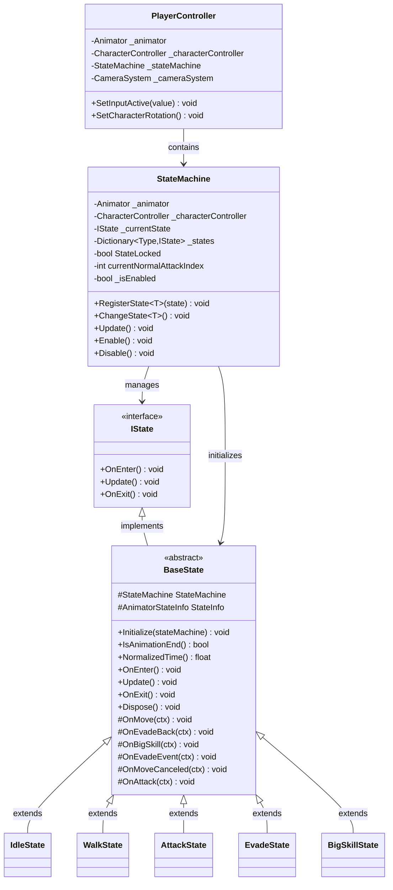
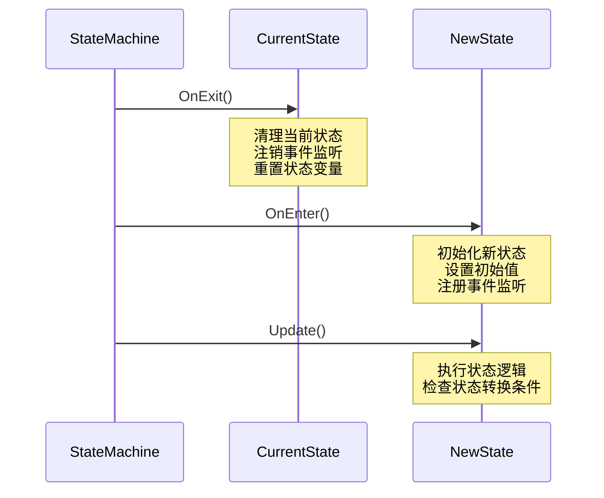
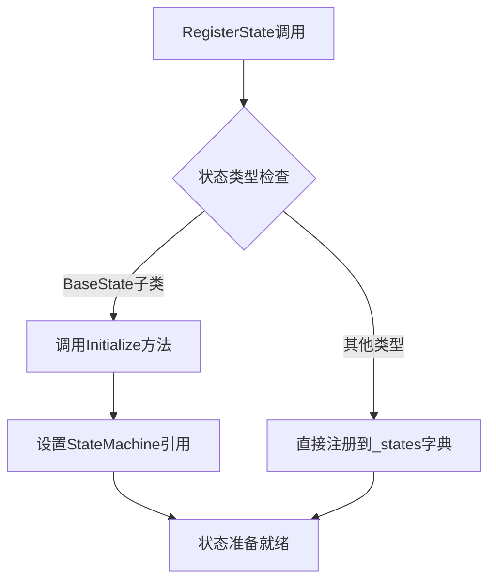
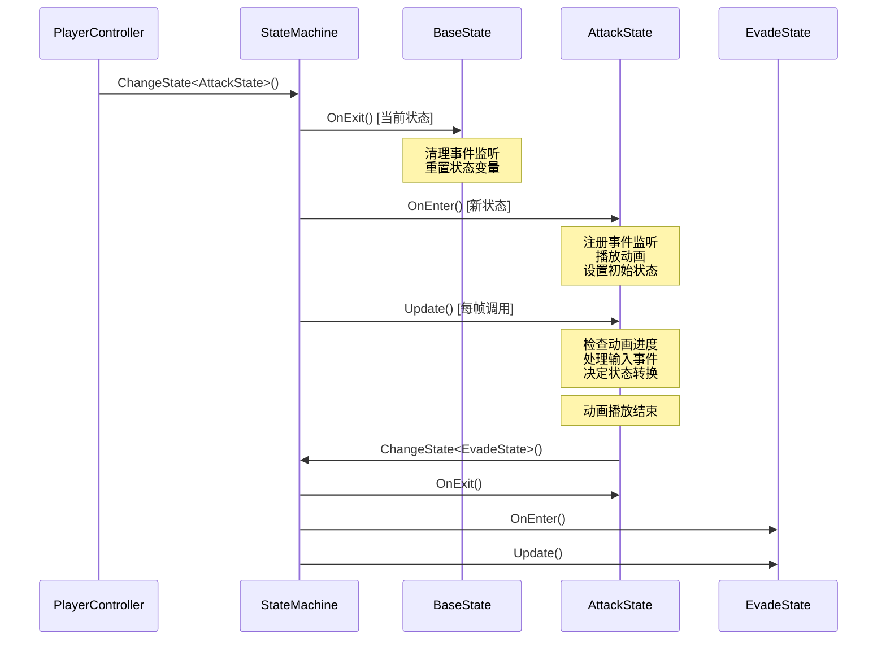
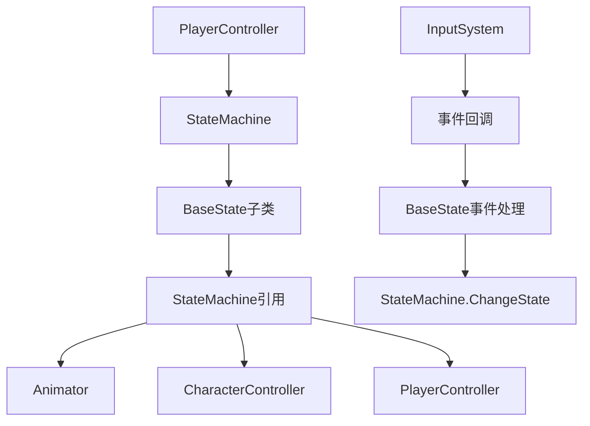
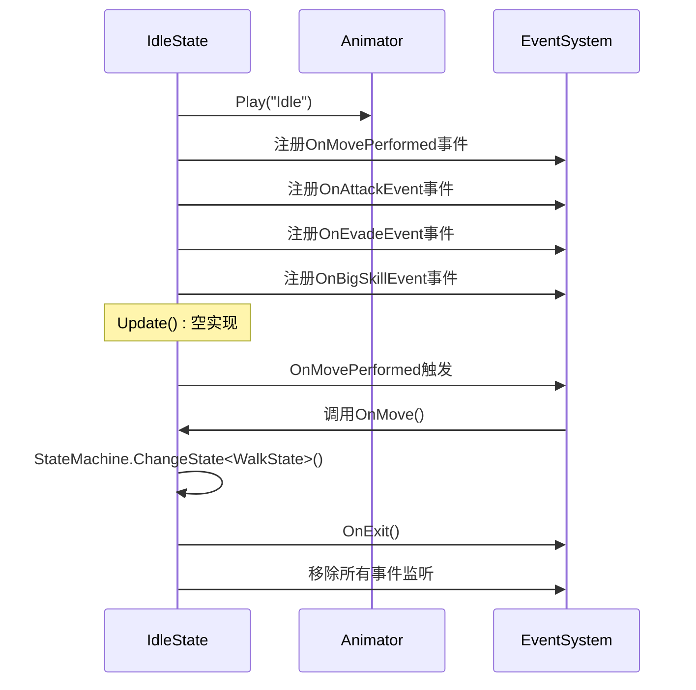
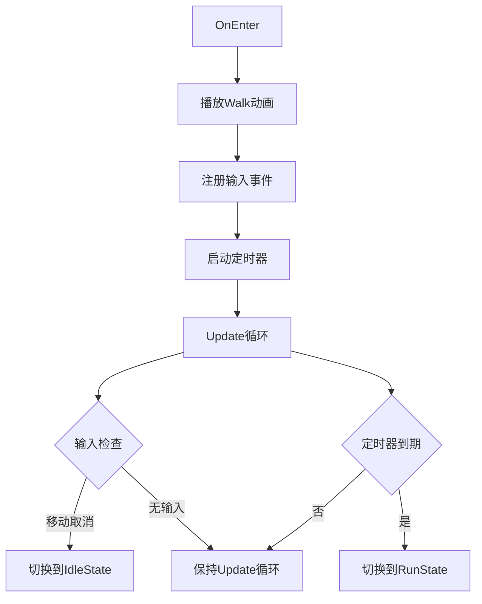
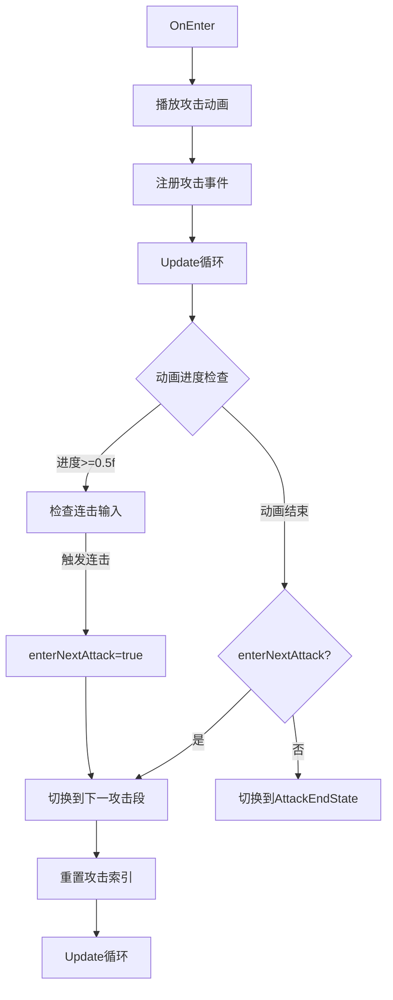
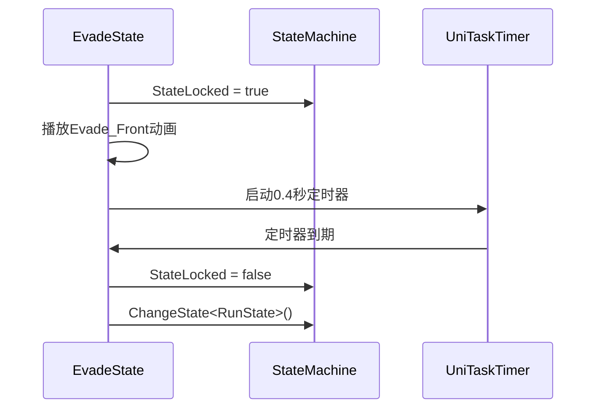

# 基础状态类

<cite>
**本文档中引用的文件**
- [BaseState.cs](file://Assets/Scripts/Controller/FSM/BaseState.cs)
- [IState.cs](file://Assets/Scripts/Controller/FSM/IState.cs)
- [StateMachine.cs](file://Assets/Scripts/Controller/FSM/StateMachine.cs)
- [PlayerController.cs](file://Assets/Scripts/Controller/PlayerController.cs)
- [IdleState.cs](file://Assets/Scripts/Controller/FSM/CharacterState/IdleState.cs)
- [WalkState.cs](file://Assets/Scripts/Controller/FSM/CharacterState/WalkState.cs)
- [AttackState.cs](file://Assets/Scripts/Controller/FSM/CharacterState/AttackState.cs)
- [EvadeState.cs](file://Assets/Scripts/Controller/FSM/CharacterState/EvadeState.cs)
- [BigSkillState.cs](file://Assets/Scripts/Controller/FSM/CharacterState/BigSkillState.cs)
- [DebugX.cs](file://Assets/Scripts/Tool/DebugX.cs)
- [UniTaskTimer.cs](file://Assets/Scripts/Tool/UniTaskTimer.cs)
</cite>

## 目录
1. [简介](#简介)
2. [核心接口与抽象类](#核心接口与抽象类)
3. [IState接口设计](#istate接口设计)
4. [BaseState抽象基类](#basestate抽象基类)
5. [状态生命周期管理](#状态生命周期管理)
6. [PlayerController引用机制](#playercontroller引用机制)
7. [状态间数据共享](#状态间数据共享)
8. [具体状态实现示例](#具体状态实现示例)
9. [最佳实践指南](#最佳实践指南)
10. [扩展开发指南](#扩展开发指南)

## 简介

本项目采用基于状态机的角色控制系统，通过抽象基类和接口的组合设计，实现了灵活且可扩展的状态管理机制。基础状态类提供了统一的状态生命周期管理和事件处理能力，支持复杂的游戏状态转换和行为控制。

## 核心接口与抽象类

### 架构概览



**图表来源**
- [IState.cs](file://Assets/Scripts/Controller/FSM/IState.cs#L1-L6)
- [BaseState.cs](file://Assets/Scripts/Controller/FSM/BaseState.cs#L1-L85)
- [StateMachine.cs](file://Assets/Scripts/Controller/FSM/StateMachine.cs#L1-L115)
- [PlayerController.cs](file://Assets/Scripts/Controller/PlayerController.cs#L1-L103)

## IState接口设计

### 接口契约规范

IState接口定义了状态机的基本契约，规定了所有状态必须实现的三个核心生命周期方法：

| 方法名 | 返回类型 | 描述 | 调用时机 |
|--------|----------|------|----------|
| `OnEnter()` | `void` | 状态进入时的初始化逻辑 | 状态切换到新状态时调用 |
| `Update()` | `void` | 状态的每帧更新逻辑 | 状态激活时每帧调用 |
| `OnExit()` | `void` | 状态退出时的清理逻辑 | 状态被其他状态替换时调用 |

### 方法签名规范



**图表来源**
- [StateMachine.cs](file://Assets/Scripts/Controller/FSM/StateMachine.cs#L47-L58)
- [IState.cs](file://Assets/Scripts/Controller/FSM/IState.cs#L1-L6)

**章节来源**
- [IState.cs](file://Assets/Scripts/Controller/FSM/IState.cs#L1-L6)

## BaseState抽象基类

### 类结构设计

BaseState作为所有具体状态的基类，提供了以下核心功能：

#### 受保护字段访问

| 字段名 | 类型 | 访问级别 | 用途 |
|--------|------|----------|------|
| `StateMachine` | `StateMachine` | `protected` | 对状态机实例的引用，用于状态切换和数据访问 |
| `StateInfo` | `AnimatorStateInfo` | `protected` | 当前动画状态信息，用于动画状态检查 |

#### 生命周期方法实现

BaseState提供了虚方法实现，允许子类选择性重写：

| 方法名 | 默认实现 | 子类重写目的 |
|--------|----------|--------------|
| `OnEnter()` | 空实现 | 初始化状态特定逻辑 |
| `Update()` | 空实现 | 实现状态更新逻辑 |
| `OnExit()` | 调用基类方法 | 清理状态资源 |
| `Dispose()` | 空实现 | 资源释放逻辑 |

### 状态机初始化机制



**图表来源**
- [StateMachine.cs](file://Assets/Scripts/Controller/FSM/StateMachine.cs#L34-L42)
- [BaseState.cs](file://Assets/Scripts/Controller/FSM/BaseState.cs#L18-L20)

### 动画状态检查工具

BaseState提供了两个重要的动画状态检查方法：

#### IsAnimationEnd() 方法
- **功能**：检查当前动画是否播放结束
- **实现逻辑**：当动画标准化时间 >= 1.0f 且不在过渡状态时返回true
- **应用场景**：动画驱动的状态转换判断

#### NormalizedTime() 方法  
- **功能**：获取当前动画的标准化播放进度
- **用途**：动画进度监控和条件判断
- **刷新机制**：每次调用都会从Animator获取最新状态信息

**章节来源**
- [BaseState.cs](file://Assets/Scripts/Controller/FSM/BaseState.cs#L1-L85)

## 状态生命周期管理

### 完整生命周期流程



**图表来源**
- [StateMachine.cs](file://Assets/Scripts/Controller/FSM/StateMachine.cs#L47-L58)
- [AttackState.cs](file://Assets/Scripts/Controller/FSM/CharacterState/AttackState.cs#L1-L61)
- [EvadeState.cs](file://Assets/Scripts/Controller/FSM/CharacterState/EvadeState.cs#L1-L23)

### 状态锁定机制

StateMachine提供了`StateLocked`标志位，用于防止不必要的状态切换：

| 场景 | StateLocked值 | 效果 |
|------|---------------|------|
| 技能释放期间 | `true` | 阻止状态切换，确保技能完整执行 |
| 角色切换期间 | `true` | 防止用户输入干扰切换过程 |
| 动画播放期间 | `true` | 确保动画播放完整性 |

### 启用/禁用状态机

```mermaid
flowchart TD
A[StateMachine.Enable/Disable] --> B{当前状态}
B --> |启用| C[SetInputActive(true)]
B --> |禁用| D[SetInputActive(false)]
C --> E[重新进入当前状态]
D --> F[屏蔽所有输入]
E --> G[状态机恢复活跃]
F --> H[状态机暂停逻辑]
```

**图表来源**
- [StateMachine.cs](file://Assets/Scripts/Controller/FSM/StateMachine.cs#L86-L104)

**章节来源**
- [StateMachine.cs](file://Assets/Scripts/Controller/FSM/StateMachine.cs#L1-L115)

## PlayerController引用机制

### 引用关系架构

PlayerController作为状态机的容器，建立了多层次的引用关系：



**图表来源**
- [PlayerController.cs](file://Assets/Scripts/Controller/FSM/PlayerController.cs#L1-L103)
- [StateMachine.cs](file://Assets/Scripts/Controller/FSM/StateMachine.cs#L18-L25)

### 初始化流程

PlayerController负责状态机的完整初始化：

1. **构造函数初始化**：创建StateMachine实例并传入依赖组件
2. **状态注册**：注册所有可用状态到状态机
3. **初始状态设置**：调用`ChangeState<IdleState>()`设置初始状态
4. **输入系统集成**：建立输入事件与状态切换的关联

### 输入系统集成

PlayerController通过`SetInputActive`方法控制输入系统的启用状态：

| 方法调用 | 输入状态 | 状态机状态 | 应用场景 |
|----------|----------|------------|----------|
| `SetInputActive(true)` | 启用 | 恢复正常状态机逻辑 | 角色激活、游戏继续 |
| `SetInputActive(false)` | 禁用 | 暂停状态机逻辑 | 角色禁用、游戏暂停 |

**章节来源**
- [PlayerController.cs](file://Assets/Scripts/Controller/PlayerController.cs#L1-L103)

## 状态间数据共享

### 数据共享机制

BaseState通过StateMachine引用提供了多种数据共享方式：

#### 公共状态访问

| 数据类型 | 访问方式 | 示例用途 |
|----------|----------|----------|
| 动画控制器 | `StateMachine._animator` | 播放动画、设置参数 |
| 角色控制器 | `StateMachine._characterController` | 控制角色移动 |
| 玩家控制器 | `StateMachine._playerController` | 访问玩家相关数据 |
| 攻击索引 | `StateMachine.currentNormalAttackIndex` | 连击计数管理 |

#### 状态锁定共享


**图表来源**
- [BigSkillState.cs](file://Assets/Scripts/Controller/FSM/CharacterState/BigSkillState.cs#L6-L12)
- [EvadeState.cs](file://Assets/Scripts/Controller/FSM/CharacterState/EvadeState.cs#L6-L8)

### 事件处理机制

BaseState提供了预定义的事件处理方法，支持快速的状态切换：

| 事件名称 | 触发条件 | 默认行为 |
|----------|----------|----------|
| `OnMove` | 移动输入开始 | 切换到WalkState |
| `OnAttack` | 攻击输入开始 | 切换到AttackState |
| `OnEvadeEvent` | 闪避输入开始 | 切换到EvadeState |
| `OnBigSkill` | 大技能输入开始 | 切换到BigSkillState |
| `OnMoveCanceled` | 移动输入取消 | 切换到IdleState |

**章节来源**
- [BaseState.cs](file://Assets/Scripts/Controller/FSM/BaseState.cs#L42-L85)

## 具体状态实现示例

### IdleState - 待机状态

IdleState展示了最简单的基础状态实现模式：



**图表来源**
- [IdleState.cs](file://Assets/Scripts/Controller/FSM/CharacterState/IdleState.cs#L1-L25)

### WalkState - 行走状态

WalkState展示了带有定时器和条件判断的状态实现：



**图表来源**
- [WalkState.cs](file://Assets/Scripts/Controller/FSM/CharacterState/WalkState.cs#L1-L32)

### AttackState - 攻击状态

AttackState展示了复杂的动画驱动状态管理：



**图表来源**
- [AttackState.cs](file://Assets/Scripts/Controller/FSM/CharacterState/AttackState.cs#L1-L61)

### EvadeState - 闪避状态

EvadeState展示了带状态锁定的临时状态实现：



**图表来源**
- [EvadeState.cs](file://Assets/Scripts/Controller/FSM/CharacterState/EvadeState.cs#L1-L23)

**章节来源**
- [IdleState.cs](file://Assets/Scripts/Controller/FSM/CharacterState/IdleState.cs#L1-L25)
- [WalkState.cs](file://Assets/Scripts/Controller/FSM/CharacterState/WalkState.cs#L1-L32)
- [AttackState.cs](file://Assets/Scripts/Controller/FSM/CharacterState/AttackState.cs#L1-L61)
- [EvadeState.cs](file://Assets/Scripts/Controller/FSM/CharacterState/EvadeState.cs#L1-L23)

## 最佳实践指南

### 字段命名规范

#### 受保护字段命名
- **格式**：`#FieldName`（使用井号前缀表示受保护）
- **示例**：`#StateMachine`、`#StateInfo`
- **原则**：明确标识字段的访问权限和用途

#### 私有字段命名
- **格式**：`_fieldName`（使用下划线前缀）
- **示例**：`_animator`、`_characterController`
- **原则**：区分私有成员和公共接口

### 方法重写顺序

推荐的重写顺序：

1. **生命周期方法**：按`OnEnter()` → `Update()` → `OnExit()`的顺序
2. **事件处理方法**：在`OnEnter()`中注册，在`OnExit()`中注销
3. **辅助方法**：按使用频率排序

### 错误处理策略

#### 状态注册检查
```csharp
// 推荐：检查重复注册
if (_states.ContainsKey(type))
{
    Debug.LogWarning($"State of type {type} is already registered.");
    return;
}
```

#### 状态切换验证
```csharp
// 推荐：验证状态是否存在
if (!_states.TryGetValue(type, out var newState))
{
    Debug.LogError($"State {type} not registered!");
    return;
}
```

#### 异常安全处理
```csharp
// 推荐：使用try-catch包装关键逻辑
public override void OnExit()
{
    try
    {
        // 清理逻辑
        base.OnExit();
    }
    catch (Exception ex)
    {
        Debug.LogError($"Error in OnExit: {ex.Message}");
    }
}
```

### 内存管理最佳实践

#### 事件监听管理
- **注册时机**：在`OnEnter()`中注册事件
- **注销时机**：在`OnExit()`中注销事件
- **避免泄漏**：确保每个注册都有对应的注销

#### 资源释放
```csharp
public virtual void Dispose()
{
    // 清理托管资源
    // 释放非托管资源
    // 取消异步操作
}
```

**章节来源**
- [BaseState.cs](file://Assets/Scripts/Controller/FSM/BaseState.cs#L1-L85)
- [StateMachine.cs](file://Assets/Scripts/Controller/FSM/StateMachine.cs#L25-L35)

## 扩展开发指南

### 创建新状态类

#### 步骤1：继承BaseState
```csharp
public class NewState : BaseState
{
    public override void OnEnter()
    {
        base.OnEnter();
        // 初始化逻辑
    }
    
    public override void Update()
    {
        base.Update();
        // 更新逻辑
    }
    
    public override void OnExit()
    {
        base.OnExit();
        // 清理逻辑
    }
}
```

#### 步骤2：注册状态
在PlayerController的Awake方法中注册新状态：
```csharp
_stateMachine.RegisterState(new NewState());
```

#### 步骤3：添加状态切换
在适当的位置添加状态切换逻辑：
```csharp
protected void OnNewEvent(InputAction.CallbackContext ctx)
{
    StateMachine.ChangeState<NewState>();
}
```

### 自定义事件处理

#### 扩展现有事件
```csharp
protected void OnCustomEvent(InputAction.CallbackContext ctx)
{
    DebugX.Instance.Log("自定义事件触发");
    StateMachine.ChangeState<CustomState>();
}
```

#### 创建新事件类型
1. 在InputSystem中定义新事件
2. 在BaseState中添加对应处理方法
3. 在具体状态中实现事件响应逻辑

### 性能优化建议

#### 动画状态检查优化
- 使用缓存避免重复查询`GetCurrentAnimatorStateInfo`
- 在不需要时禁用动画状态检查
- 使用合适的检查频率

#### 事件处理优化
- 及时注销不再需要的事件监听
- 避免在高频调用的方法中进行复杂计算
- 使用对象池管理临时对象

#### 内存使用优化
- 合理使用`using`语句管理资源
- 避免在Update方法中创建临时对象
- 及时释放不再使用的状态引用

### 调试和测试

#### 日志记录
使用DebugX进行统一的日志管理：
```csharp
DebugX.Instance.Log($"状态切换: {nameof(NewState)}");
```

#### 状态机状态监控
```csharp
public void LogStateMachineState()
{
    DebugX.Instance.Log($"当前状态: {_currentState?.GetType().Name}");
    DebugX.Instance.Log($"状态锁定: {StateLocked}");
    DebugX.Instance.Log($"启用状态: {IsEnabled}");
}
```

#### 单元测试策略
- 测试状态切换的正确性
- 验证事件处理的完整性
- 检查资源释放的正确性
- 测试异常情况的处理

**章节来源**
- [PlayerController.cs](file://Assets/Scripts/Controller/PlayerController.cs#L25-L50)
- [DebugX.cs](file://Assets/Scripts/Tool/DebugX.cs#L1-L24)
- [UniTaskTimer.cs](file://Assets/Scripts/Tool/UniTaskTimer.cs#L1-L189)

## 结论

基础状态类的设计体现了良好的面向对象设计原则，通过接口约束和抽象基类提供了灵活而强健的状态管理框架。IState接口确保了所有状态的一致性契约，而BaseState抽象类则提供了丰富的工具方法和事件处理机制，使得开发者能够专注于业务逻辑的实现。

这种设计模式的优势在于：
- **可扩展性**：易于添加新的状态类型
- **可维护性**：清晰的职责分离和生命周期管理
- **可测试性**：模块化的设计便于单元测试
- **性能优化**：合理的资源管理和事件处理机制

通过遵循本文档提供的最佳实践和扩展指南，开发者可以构建出高质量、可维护的角色状态控制系统。