# 状态机核心组件详细文档

<cite>
**本文档引用的文件**
- [StateMachine.cs](file://Assets/Scripts/Controller/FSM/StateMachine.cs)
- [BaseState.cs](file://Assets/Scripts/Controller/FSM/BaseState.cs)
- [IState.cs](file://Assets/Scripts/Controller/FSM/IState.cs)
- [PlayerController.cs](file://Assets/Scripts/Controller/PlayerController.cs)
- [IdleState.cs](file://Assets/Scripts/Controller/FSM/CharacterState/IdleState.cs)
- [AttackState.cs](file://Assets/Scripts/Controller/FSM/CharacterState/AttackState.cs)
- [EvadeState.cs](file://Assets/Scripts/Controller/FSM/CharacterState/EvadeState.cs)
- [SwitchInState.cs](file://Assets/Scripts/Controller/FSM/CharacterState/SwitchInState.cs)
- [DebugX.cs](file://Assets/Scripts/Tool/DebugX.cs)
- [UniTaskTimer.cs](file://Assets/Scripts/Tool/UniTaskTimer.cs)
</cite>

## 目录
1. [简介](#简介)
2. [项目结构](#项目结构)
3. [核心组件](#核心组件)
4. [架构概览](#架构概览)
5. [详细组件分析](#详细组件分析)
6. [依赖关系分析](#依赖关系分析)
7. [性能考虑](#性能考虑)
8. [故障排除指南](#故障排除指南)
9. [结论](#结论)

## 简介

状态机核心组件是Unity游戏开发中的重要架构模式，用于管理角色的各种行为状态。本文档深入分析StateMachine类的架构设计和实现机制，重点介绍状态注册、状态切换、更新逻辑和启用/禁用控制等核心功能。

该状态机系统采用泛型设计，通过类型安全的方式管理状态转换，并提供了完善的异常处理和性能优化机制。

## 项目结构

状态机相关文件组织结构如下：

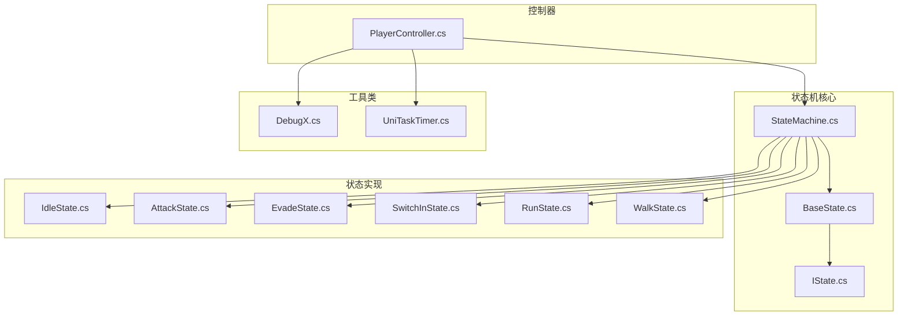

**图表来源**
- [StateMachine.cs](file://Assets/Scripts/Controller/FSM/StateMachine.cs#L1-L115)
- [BaseState.cs](file://Assets/Scripts/Controller/FSM/BaseState.cs#L1-L85)
- [PlayerController.cs](file://Assets/Scripts/Controller/PlayerController.cs#L1-L103)

**章节来源**
- [StateMachine.cs](file://Assets/Scripts/Controller/FSM/StateMachine.cs#L1-L115)
- [PlayerController.cs](file://Assets/Scripts/Controller/PlayerController.cs#L1-L103)

## 核心组件

### StateMachine类

StateMachine类是整个状态机系统的核心控制器，负责管理状态的注册、切换和执行。

#### 关键字段设计

| 字段名 | 类型 | 访问级别 | 设计意图 |
|--------|------|----------|----------|
| `_states` | `Dictionary<Type, IState>` | internal | 存储所有已注册的状态，支持快速类型查找 |
| `_currentState` | `IState` | private | 当前执行的状态实例，控制状态机的当前行为 |
| `StateLocked` | `bool` | internal | 状态锁定标志，防止关键操作期间的状态切换 |
| `currentNormalAttackIndex` | `int` | internal | 当前普通攻击索引，支持连击系统 |
| `_isEnabled` | `bool` | private | 启用/禁用标志，控制状态机的整体活动状态 |

#### 泛型方法的应用

状态机系统大量使用泛型方法来确保类型安全：

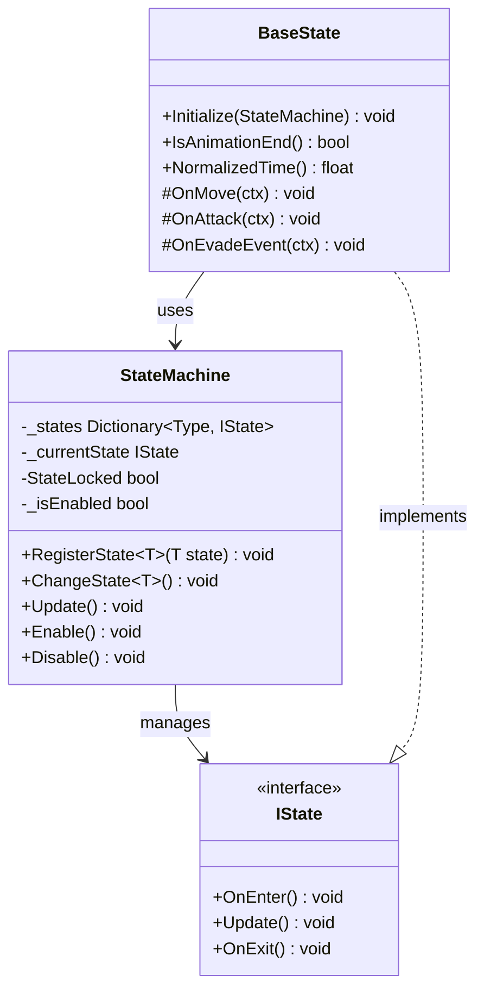

**图表来源**
- [StateMachine.cs](file://Assets/Scripts/Controller/FSM/StateMachine.cs#L7-L15)
- [IState.cs](file://Assets/Scripts/Controller/FSM/IState.cs#L1-L6)
- [BaseState.cs](file://Assets/Scripts/Controller/FSM/BaseState.cs#L1-L85)

**章节来源**
- [StateMachine.cs](file://Assets/Scripts/Controller/FSM/StateMachine.cs#L7-L115)
- [BaseState.cs](file://Assets/Scripts/Controller/FSM/BaseState.cs#L1-L85)

## 架构概览

状态机系统采用分层架构设计，从底层接口到高层控制器形成清晰的层次结构：

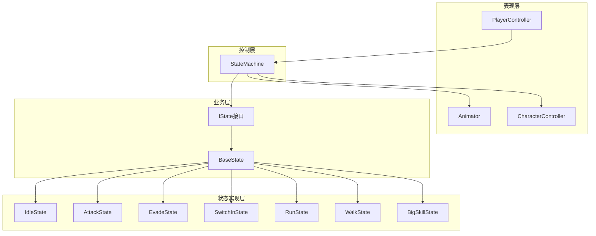

**图表来源**
- [PlayerController.cs](file://Assets/Scripts/Controller/PlayerController.cs#L1-L103)
- [StateMachine.cs](file://Assets/Scripts/Controller/FSM/StateMachine.cs#L1-L115)

## 详细组件分析

### 状态注册机制 (RegisterState)

状态注册是状态机初始化的关键步骤，通过泛型方法确保类型安全：

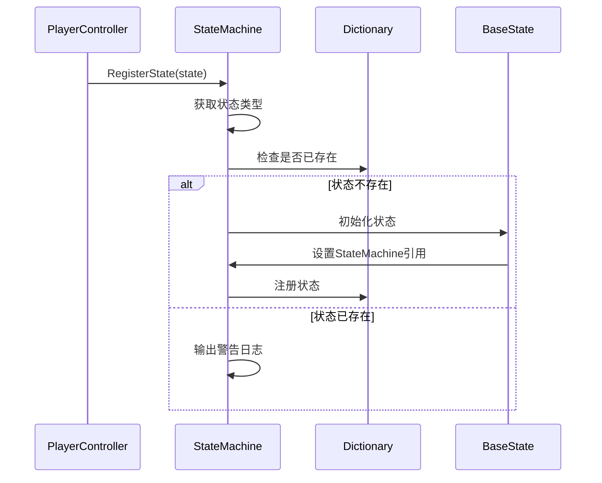

**图表来源**
- [StateMachine.cs](file://Assets/Scripts/Controller/FSM/StateMachine.cs#L25-L42)
- [PlayerController.cs](file://Assets/Scripts/Controller/PlayerController.cs#L25-L50)

#### TryGetValue性能优化

状态机在状态切换时使用`TryGetValue`方法进行性能优化：

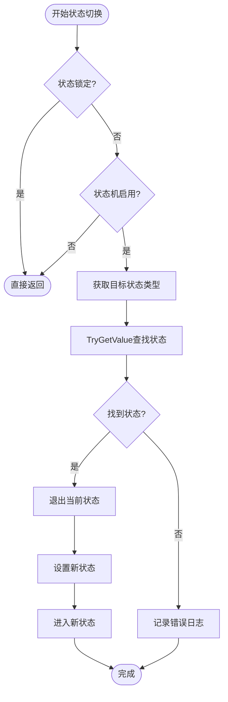

**图表来源**
- [StateMachine.cs](file://Assets/Scripts/Controller/FSM/StateMachine.cs#L44-L58)

**章节来源**
- [StateMachine.cs](file://Assets/Scripts/Controller/FSM/StateMachine.cs#L25-L58)

### 状态切换机制 (ChangeState)

状态切换是状态机的核心功能，涉及状态的退出、设置和进入三个阶段：

#### 状态锁定保护机制

状态锁定机制在关键操作期间防止意外的状态变更：

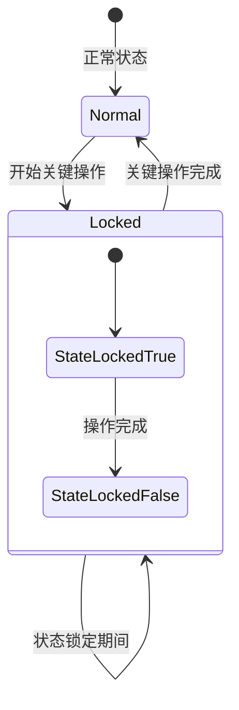

**图表来源**
- [EvadeState.cs](file://Assets/Scripts/Controller/FSM/CharacterState/EvadeState.cs#L6-L12)
- [SwitchInState.cs](file://Assets/Scripts/Controller/FSM/CharacterState/SwitchInState.cs#L6-L12)

**章节来源**
- [StateMachine.cs](file://Assets/Scripts/Controller/FSM/StateMachine.cs#L44-L58)
- [EvadeState.cs](file://Assets/Scripts/Controller/FSM/CharacterState/EvadeState.cs#L1-L23)

### 更新逻辑 (Update)

状态机的更新逻辑遵循简单而高效的原则：

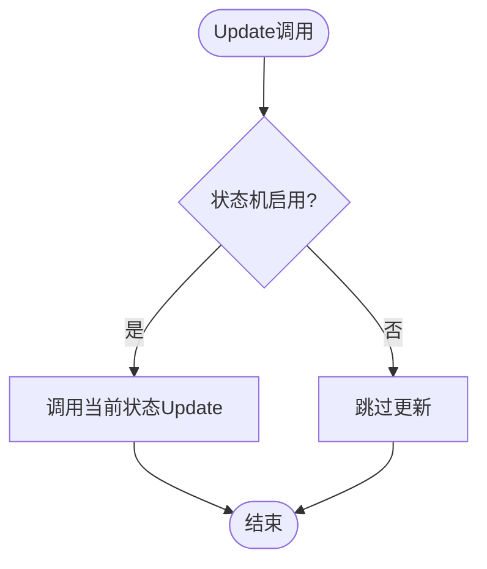

**图表来源**
- [StateMachine.cs](file://Assets/Scripts/Controller/FSM/StateMachine.cs#L60-L64)

**章节来源**
- [StateMachine.cs](file://Assets/Scripts/Controller/FSM/StateMachine.cs#L60-L64)

### 启用/禁用控制 (Enable/Disable)

状态机提供了完整的启用/禁用控制机制：

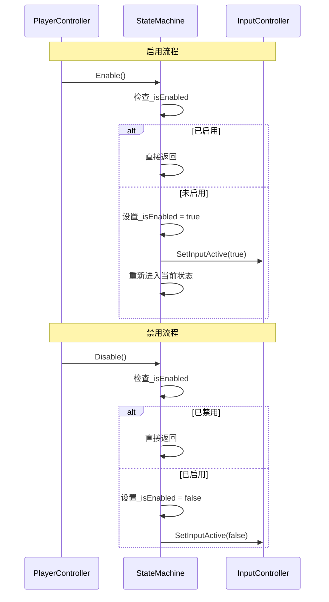

**图表来源**
- [StateMachine.cs](file://Assets/Scripts/Controller/FSM/StateMachine.cs#L86-L114)

**章节来源**
- [StateMachine.cs](file://Assets/Scripts/Controller/FSM/StateMachine.cs#L86-L114)

### BaseState基础状态类

BaseState提供了状态的基础功能和事件处理机制：

#### 动画状态检测

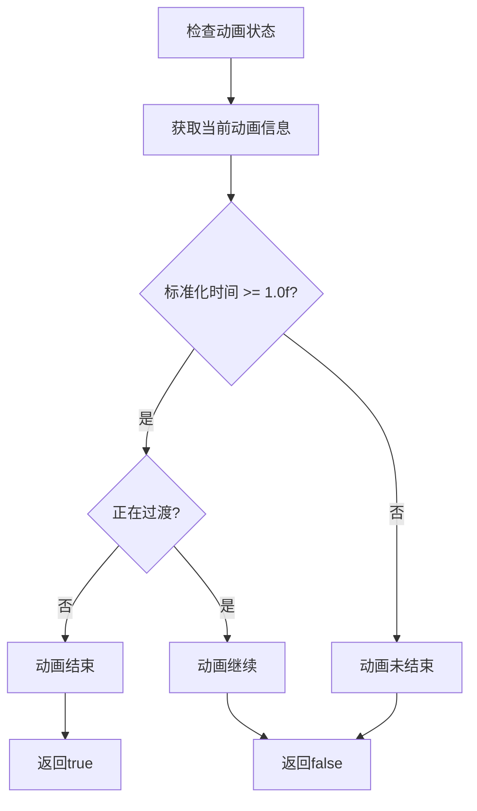

**图表来源**
- [BaseState.cs](file://Assets/Scripts/Controller/FSM/BaseState.cs#L20-L28)

**章节来源**
- [BaseState.cs](file://Assets/Scripts/Controller/FSM/BaseState.cs#L1-L85)

### PlayerController控制器

PlayerController作为状态机的入口点，负责初始化和协调状态机：

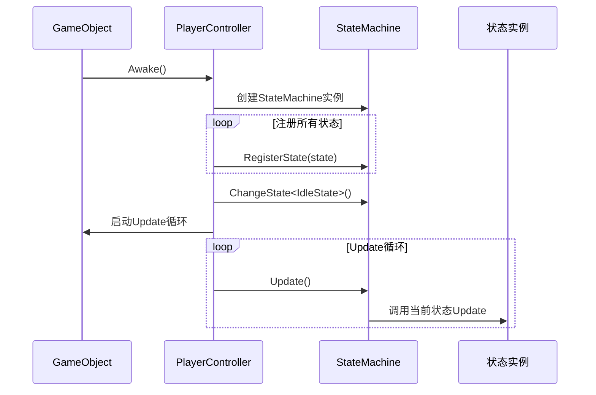

**图表来源**
- [PlayerController.cs](file://Assets/Scripts/Controller/PlayerController.cs#L25-L55)

**章节来源**
- [PlayerController.cs](file://Assets/Scripts/Controller/PlayerController.cs#L1-L103)

## 依赖关系分析

状态机系统的依赖关系呈现清晰的层次结构：

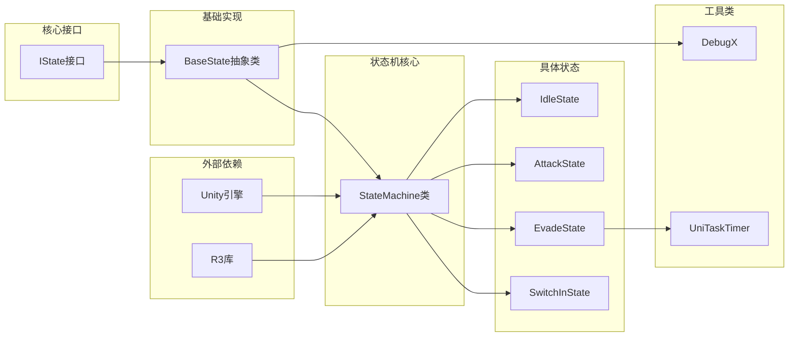

**图表来源**
- [StateMachine.cs](file://Assets/Scripts/Controller/FSM/StateMachine.cs#L1-L5)
- [BaseState.cs](file://Assets/Scripts/Controller/FSM/BaseState.cs#L1-L5)

**章节来源**
- [StateMachine.cs](file://Assets/Scripts/Controller/FSM/StateMachine.cs#L1-L115)
- [BaseState.cs](file://Assets/Scripts/Controller/FSM/BaseState.cs#L1-L85)

## 性能考虑

### 状态字典查找优化

状态机使用`Dictionary<Type, IState>`存储状态，利用`TryGetValue`方法进行高效的查找操作，避免了重复的`ContainsKey`调用。

### 泛型类型安全

通过泛型约束确保编译时类型安全，减少运行时类型检查开销。

### 状态锁定机制

状态锁定机制防止在关键操作期间的状态切换，提高系统稳定性。

### 异常处理策略

系统在多个层面实现了异常处理：

1. **状态注册异常**：重复注册状态时输出警告而非抛出异常
2. **状态切换异常**：未注册状态时记录错误日志
3. **更新异常**：当前状态更新过程中的异常通过日志记录

### 内存管理

- 使用`CompositeDisposable`管理资源释放
- 提供`Dispose`方法清理状态资源
- 避免在热路径中创建临时对象

## 故障排除指南

### 常见问题及解决方案

#### 状态切换失败

**症状**：调用`ChangeState<T>()`后状态没有改变

**原因分析**：
1. 状态未正确注册
2. 状态机被锁定 (`StateLocked = true`)
3. 状态机被禁用 (`_isEnabled = false`)

**解决方案**：
1. 检查状态是否已通过`RegisterState`注册
2. 确认`StateLocked`标志为`false`
3. 验证`_isEnabled`标志为`true`

#### 动画状态检测不准确

**症状**：`IsAnimationEnd()`返回值不符合预期

**原因分析**：
1. 动画播放时间不足
2. 动画过渡时间影响判断
3. 多个动画状态同时存在

**解决方案**：
1. 确保动画播放完整
2. 检查动画过渡设置
3. 在适当的状态下进行检测

#### 性能问题

**症状**：状态机更新导致帧率下降

**原因分析**：
1. 状态更新逻辑过于复杂
2. 频繁的状态切换
3. 大量的状态注册

**解决方案**：
1. 优化状态更新逻辑
2. 减少不必要的状态切换
3. 合理管理状态数量

**章节来源**
- [StateMachine.cs](file://Assets/Scripts/Controller/FSM/StateMachine.cs#L44-L58)
- [BaseState.cs](file://Assets/Scripts/Controller/FSM/BaseState.cs#L20-L28)
- [DebugX.cs](file://Assets/Scripts/Tool/DebugX.cs#L1-L24)

## 结论

状态机核心组件展现了优秀的软件架构设计原则：

1. **单一职责**：每个组件都有明确的职责分工
2. **开放封闭**：对扩展开放，对修改封闭
3. **依赖倒置**：依赖于抽象接口而非具体实现
4. **泛型安全**：通过泛型确保类型安全
5. **性能优化**：合理使用数据结构和算法

该状态机系统不仅提供了强大的状态管理能力，还具备良好的可维护性和扩展性，是Unity游戏开发中状态管理的最佳实践之一。通过合理的架构设计和性能优化，它能够满足复杂游戏场景下的状态管理需求。