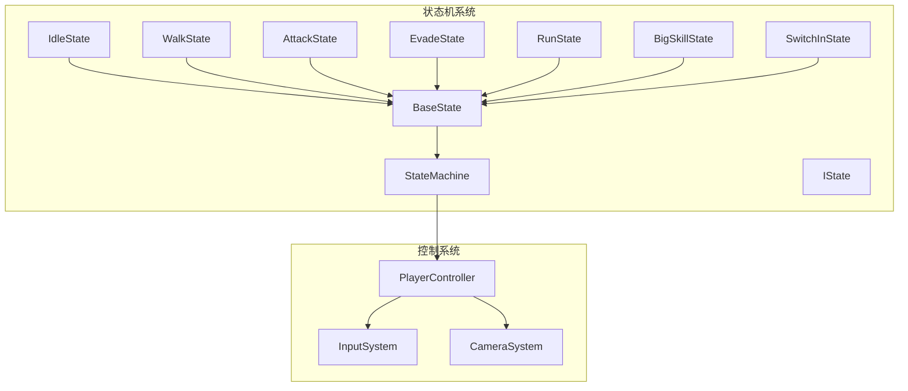
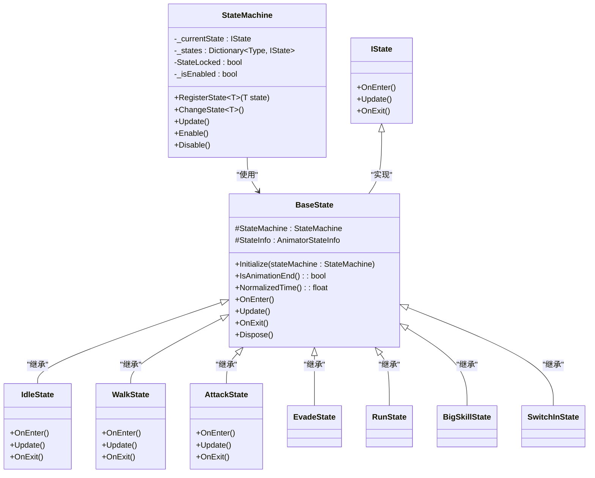
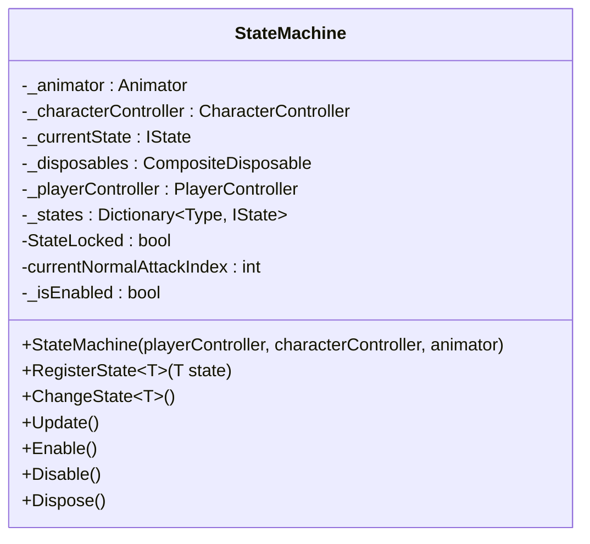
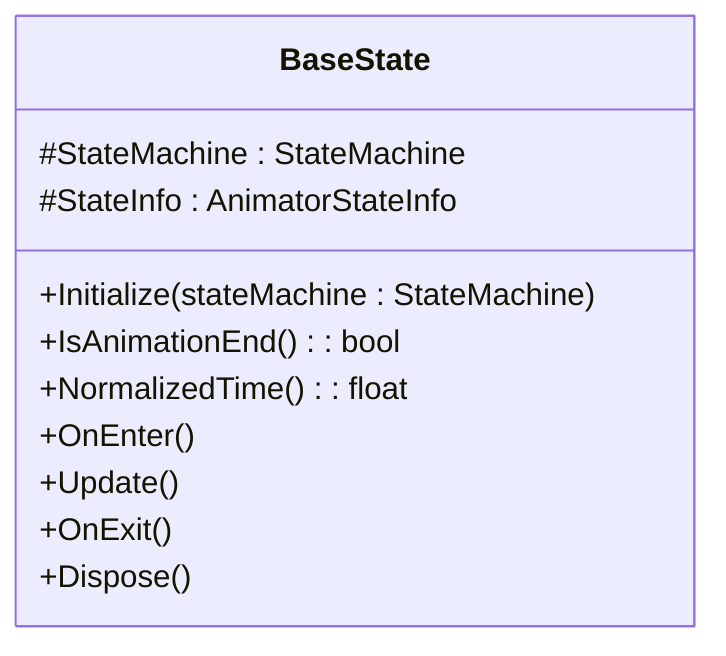
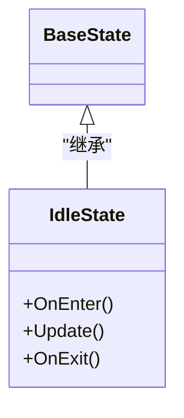
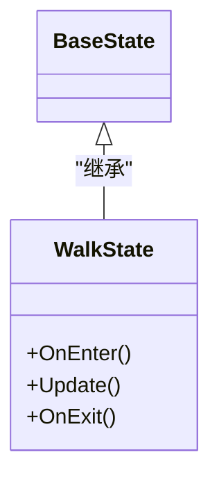
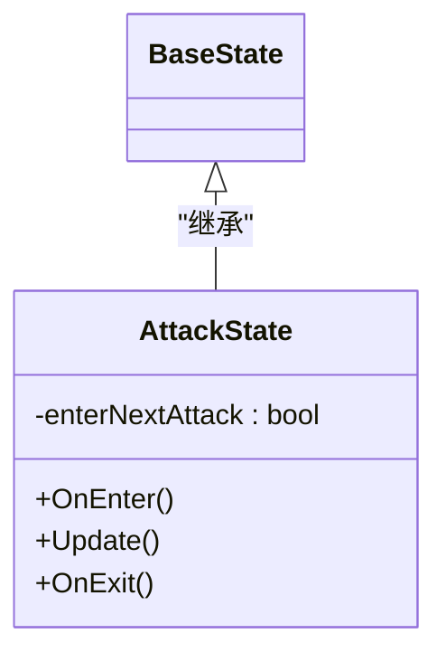

# 状态机系统

<cite>
**本文档引用的文件**   
- [StateMachine.cs](file://Assets/Scripts/Controller/FSM/StateMachine.cs)
- [BaseState.cs](file://Assets/Scripts/Controller/FSM/BaseState.cs)
- [IState.cs](file://Assets/Scripts/Controller/FSM/IState.cs)
- [IdleState.cs](file://Assets/Scripts/Controller/FSM/CharacterState/IdleState.cs)
- [WalkState.cs](file://Assets/Scripts/Controller/FSM/CharacterState/WalkState.cs)
- [AttackState.cs](file://Assets/Scripts/Controller/FSM/CharacterState/AttackState.cs)
- [EvadeState.cs](file://Assets/Scripts/Controller/FSM/CharacterState/EvadeState.cs)
- [RunState.cs](file://Assets/Scripts/Controller/FSM/CharacterState/RunState.cs)
- [BigSkillState.cs](file://Assets/Scripts/Controller/FSM/CharacterState/BigSkillState.cs)
- [SwitchInState.cs](file://Assets/Scripts/Controller/FSM/CharacterState/SwitchInState.cs)
- [PlayerController.cs](file://Assets/Scripts/Controller/PlayerController.cs)
- [InputSystem.cs](file://Assets/Scripts/Manager/InputSystem/InputSystem.cs)
- [CameraSystem.cs](file://Assets/Scripts/Manager/CameraSystem/CameraSystem.cs)
- [UniTaskTimer.cs](file://Assets/Scripts/Tool/UniTaskTimer.cs)
</cite>

## 目录
1. [简介](#简介)
2. [项目结构](#项目结构)
3. [核心组件](#核心组件)
4. [架构概述](#架构概述)
5. [详细组件分析](#详细组件分析)
6. [依赖分析](#依赖分析)
7. [性能考虑](#性能考虑)
8. [故障排除指南](#故障排除指南)
9. [结论](#结论)

## 简介
本项目实现了一个基于Unity的状态机系统，用于管理角色的各种行为状态。该系统采用面向对象的设计模式，通过状态机(StateMachine)统一管理角色的不同状态，如闲置、行走、攻击等。系统设计遵循单一职责原则，每个状态类只负责特定行为的实现。状态机与Unity的Input System、Animator和CharacterController等系统紧密集成，实现了流畅的角色控制体验。通过泛型类型注册和切换状态，系统具有良好的扩展性和类型安全性。

## 项目结构
状态机系统主要位于Assets/Scripts/Controller/FSM目录下，包含核心状态机类、基础状态类、接口定义和具体的状态实现。系统与PlayerController、InputSystem和CameraSystem等模块协同工作，形成完整的角色控制系统。



**Diagram sources**
- [StateMachine.cs](file://Assets/Scripts/Controller/FSM/StateMachine.cs)
- [PlayerController.cs](file://Assets/Scripts/Controller/PlayerController.cs)

**Section sources**
- [StateMachine.cs](file://Assets/Scripts/Controller/FSM/StateMachine.cs)
- [BaseState.cs](file://Assets/Scripts/Controller/FSM/BaseState.cs)
- [IState.cs](file://Assets/Scripts/Controller/FSM/IState.cs)

## 核心组件
状态机系统的核心组件包括StateMachine类、BaseState基类和IState接口。StateMachine类负责管理所有状态的注册、切换和更新，是整个系统的控制中心。BaseState类提供了状态的通用功能实现，如动画状态检测和输入事件处理。IState接口定义了所有状态必须实现的生命周期方法。具体的状态类如IdleState、WalkState、AttackState等继承BaseState，实现特定行为逻辑。系统通过PlayerController与游戏世界交互，接收输入并控制角色行为。

**Section sources**
- [StateMachine.cs](file://Assets/Scripts/Controller/FSM/StateMachine.cs)
- [BaseState.cs](file://Assets/Scripts/Controller/FSM/BaseState.cs)
- [IState.cs](file://Assets/Scripts/Controller/FSM/IState.cs)

## 架构概述
状态机系统采用分层架构设计，上层为具体的状态实现，中层为基类提供通用功能，底层为状态机核心管理。系统通过依赖注入方式获取PlayerController、CharacterController和Animator等组件引用，确保了良好的解耦性。状态切换通过泛型方法实现类型安全，避免了字符串匹配的错误。系统集成了输入处理、动画控制和角色移动等功能，形成了完整的角色行为控制系统。



**Diagram sources**
- [StateMachine.cs](file://Assets/Scripts/Controller/FSM/StateMachine.cs)
- [BaseState.cs](file://Assets/Scripts/Controller/FSM/BaseState.cs)
- [IState.cs](file://Assets/Scripts/Controller/FSM/IState.cs)

## 详细组件分析
### StateMachine类分析
StateMachine类是整个状态机系统的核心，负责管理所有状态的生命周期。它通过字典存储不同类型的状态实例，确保每个状态类型只有一个实例。状态机提供了注册、切换、更新和启用/禁用等核心功能。

#### 架构设计
StateMachine采用组合模式，将状态管理功能集中在一个类中。它持有当前状态的引用，并通过泛型方法实现类型安全的状态切换。系统使用字典来存储所有已注册的状态，通过类型作为键来快速查找。



**Diagram sources**
- [StateMachine.cs](file://Assets/Scripts/Controller/FSM/StateMachine.cs)

**Section sources**
- [StateMachine.cs](file://Assets/Scripts/Controller/FSM/StateMachine.cs)

### BaseState基类分析
BaseState基类为所有具体状态提供了通用的功能实现，包括状态机引用、动画状态检测和输入事件处理等。

#### 生命周期方法
BaseState定义了状态的四个生命周期方法：Initialize、OnEnter、Update和OnExit。这些方法为具体状态提供了标准的执行流程。



**Diagram sources**
- [BaseState.cs](file://Assets/Scripts/Controller/FSM/BaseState.cs)

**Section sources**
- [BaseState.cs](file://Assets/Scripts/Controller/FSM/BaseState.cs)

### 具体状态类分析
#### IdleState分析
IdleState表示角色的闲置状态，当角色没有移动输入时进入此状态。



**Diagram sources**
- [IdleState.cs](file://Assets/Scripts/Controller/FSM/CharacterState/IdleState.cs)

**Section sources**
- [IdleState.cs](file://Assets/Scripts/Controller/FSM/CharacterState/IdleState.cs)

#### WalkState分析
WalkState表示角色的行走状态，当角色接收到移动输入时进入此状态。



**Diagram sources**
- [WalkState.cs](file://Assets/Scripts/Controller/FSM/CharacterState/WalkState.cs)

**Section sources**
- [WalkState.cs](file://Assets/Scripts/Controller/FSM/CharacterState/WalkState.cs)

#### AttackState分析
AttackState表示角色的攻击状态，支持连续攻击和攻击段数管理。



**Diagram sources**
- [AttackState.cs](file://Assets/Scripts/Controller/FSM/CharacterState/AttackState.cs)

**Section sources**
- [AttackState.cs](file://Assets/Scripts/Controller/FSM/CharacterState/AttackState.cs)

## 依赖分析
状态机系统与其他模块存在紧密的依赖关系，形成了完整的角色控制系统。

```mermaid
graph TD
StateMachine --> PlayerController : "依赖"
StateMachine --> Animator : "依赖"
StateMachine --> CharacterController : "依赖"
PlayerController --> InputSystem : "依赖"
PlayerController --> CameraSystem : "依赖"
BaseState --> InputSystem : "依赖"
BaseState --> Animator : "依赖"
IdleState --> InputSystem : "依赖"
WalkState --> InputSystem : "依赖"
AttackState --> InputSystem : "依赖"
EvadeState --> UniTaskTimer : "依赖"
BigSkillState --> UniTaskTimer : "依赖"
SwitchInState --> UniTaskTimer : "依赖"
```

**Diagram sources**
- [StateMachine.cs](file://Assets/Scripts/Controller/FSM/StateMachine.cs)
- [PlayerController.cs](file://Assets/Scripts/Controller/PlayerController.cs)
- [InputSystem.cs](file://Assets/Scripts/Manager/InputSystem/InputSystem.cs)
- [CameraSystem.cs](file://Assets/Scripts/Manager/CameraSystem/CameraSystem.cs)
- [UniTaskTimer.cs](file://Assets/Scripts/Tool/UniTaskTimer.cs)

**Section sources**
- [StateMachine.cs](file://Assets/Scripts/Controller/FSM/StateMachine.cs)
- [PlayerController.cs](file://Assets/Scripts/Controller/PlayerController.cs)
- [InputSystem.cs](file://Assets/Scripts/Manager/InputSystem/InputSystem.cs)

## 性能考虑
状态机系统在设计时考虑了性能优化，通过对象池、事件系统和异步处理等技术提高运行效率。系统使用字典存储状态实例，确保状态查找的时间复杂度为O(1)。通过事件系统而非轮询方式处理输入，减少了不必要的CPU消耗。使用UniTaskTimer实现定时功能，避免了协程的内存分配。状态切换时只执行必要的初始化和清理操作，减少了性能开销。

## 故障排除指南
### 状态无法切换
检查状态是否已正确注册，确保在PlayerController的Awake方法中调用RegisterState注册所有需要的状态。

### 输入无响应
确认InputSystem是否已正确初始化，并检查事件订阅是否完整。确保在OnEnter方法中订阅了必要的输入事件，在OnExit方法中正确取消订阅。

### 动画播放异常
检查Animator组件是否正确引用，确保动画状态名称与代码中的播放名称一致。验证动画过渡条件设置是否正确。

### 状态锁定失效
确认StateLocked标志是否在关键操作期间正确设置，并在操作完成后及时清除。

**Section sources**
- [StateMachine.cs](file://Assets/Scripts/Controller/FSM/StateMachine.cs)
- [BaseState.cs](file://Assets/Scripts/Controller/FSM/BaseState.cs)
- [PlayerController.cs](file://Assets/Scripts/Controller/PlayerController.cs)

## 结论
本状态机系统设计合理，结构清晰，具有良好的扩展性和维护性。通过泛型类型实现状态管理，确保了类型安全和代码质量。系统与Unity的各个子系统紧密集成，实现了流畅的角色控制体验。建议在新状态开发时遵循现有模式，保持代码风格一致。对于复杂的过渡逻辑，可以考虑引入过渡状态或条件检查机制，提高系统的灵活性和可配置性。