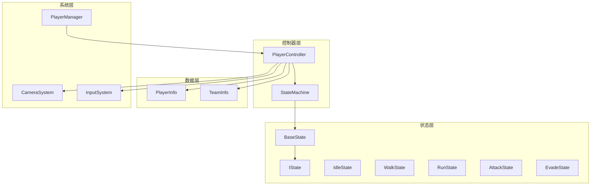
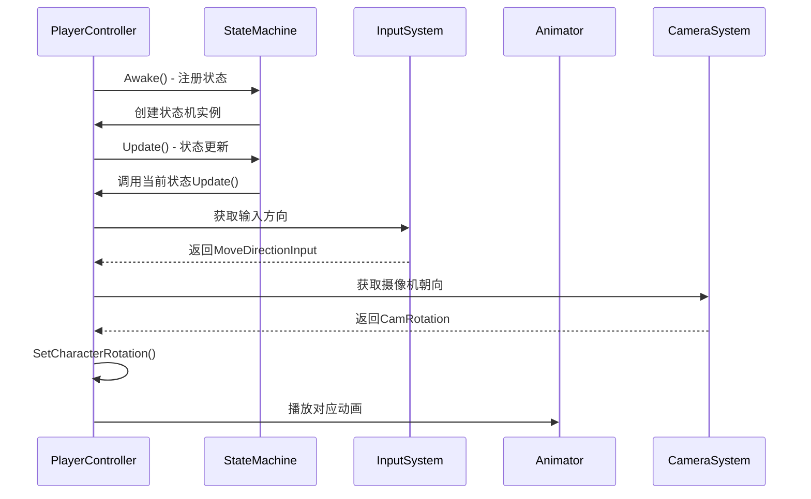
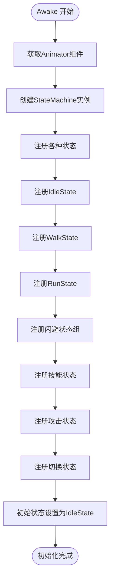
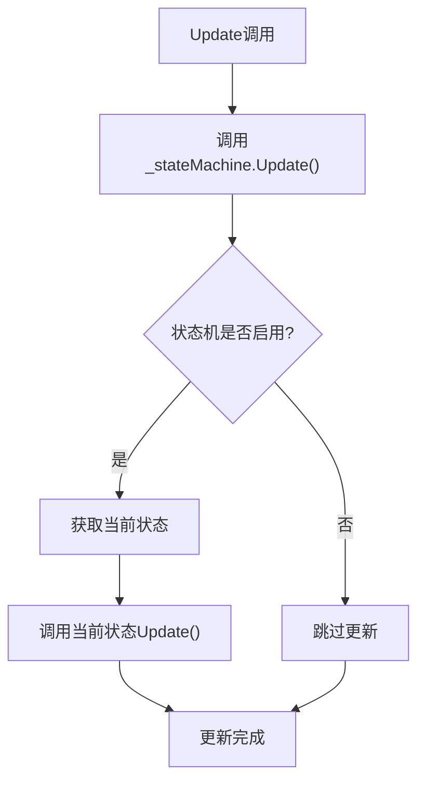
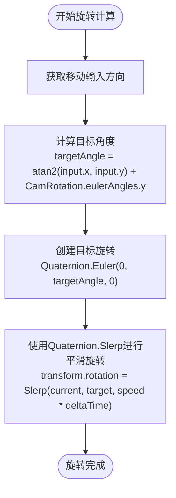
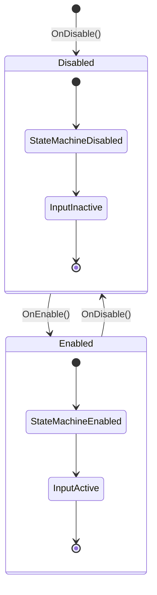
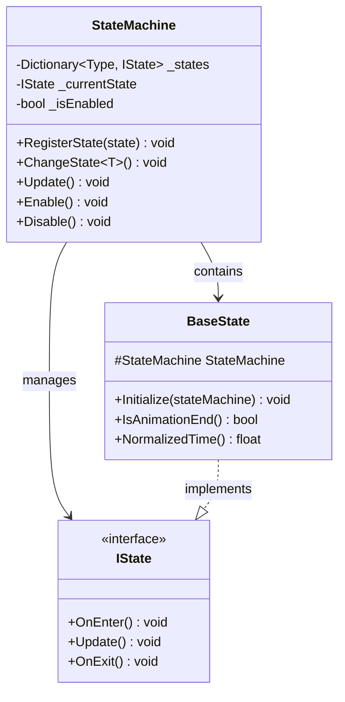
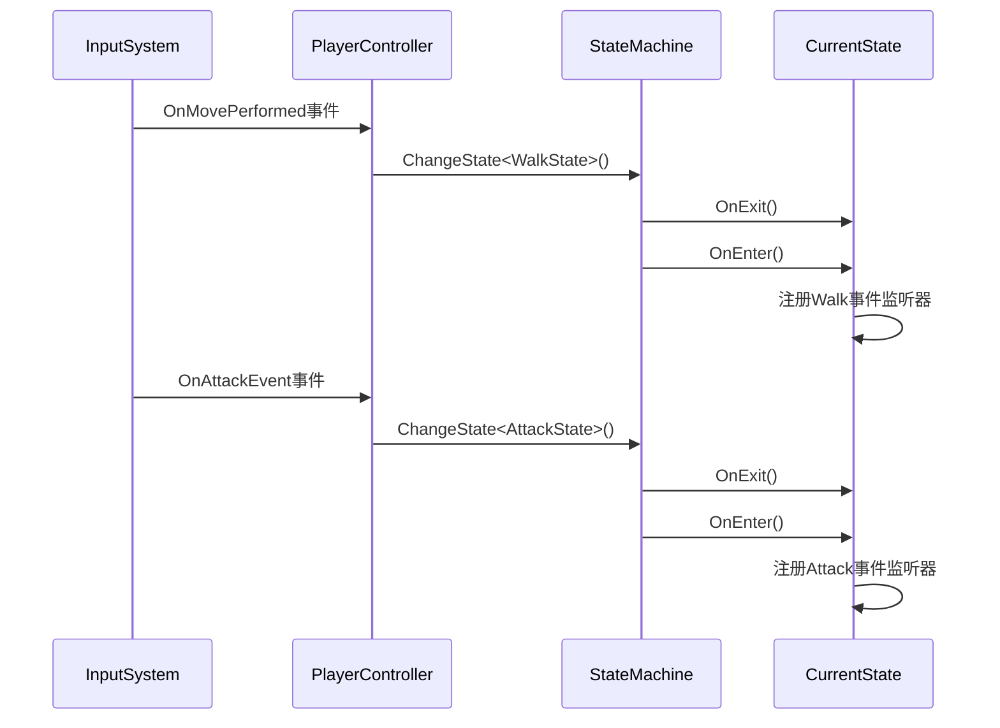
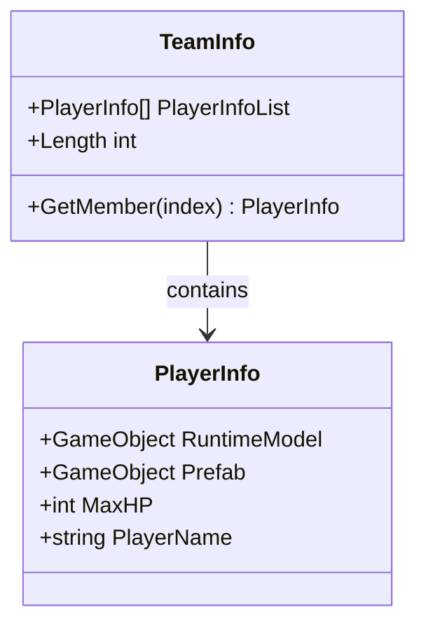
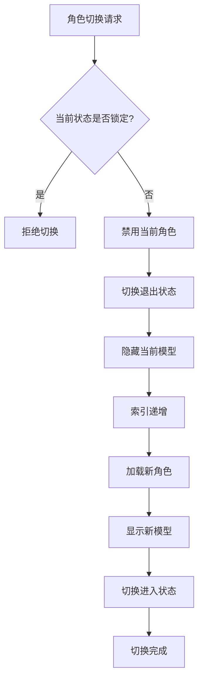

# PlayerController 详细文档

<cite>
**本文档中引用的文件**
- [PlayerController.cs](file://Assets/Scripts/Controller/PlayerController.cs)
- [StateMachine.cs](file://Assets/Scripts/Controller/FSM/StateMachine.cs)
- [BaseState.cs](file://Assets/Scripts/Controller/FSM/BaseState.cs)
- [IState.cs](file://Assets/Scripts/Controller/FSM/IState.cs)
- [IdleState.cs](file://Assets/Scripts/Controller/FSM/CharacterState/IdleState.cs)
- [WalkState.cs](file://Assets/Scripts/Controller/FSM/CharacterState/WalkState.cs)
- [RunState.cs](file://Assets/Scripts/Controller/FSM/CharacterState/RunState.cs)
- [PlayerInfo.cs](file://Assets/Scripts/Data/SOBase/PlayerInfo.cs)
- [TeamInfo.cs](file://Assets/Scripts/Data/SOBase/TeamInfo.cs)
- [CameraSystem.cs](file://Assets/Scripts/Manager/CameraSystem/CameraSystem.cs)
- [InputSystem.cs](file://Assets/Scripts/Manager/InputSystem/InputSystem.cs)
- [PlayerManager.cs](file://Assets/Scripts/Manager/PlayerManager/PlayerManager.cs)
- [Singleton.cs](file://Assets/Scripts/Tool/Singleton.cs)
</cite>

## 目录
1. [简介](#简介)
2. [项目结构](#项目结构)
3. [核心组件](#核心组件)
4. [架构概览](#架构概览)
5. [详细组件分析](#详细组件分析)
6. [状态机系统](#状态机系统)
7. [输入系统集成](#输入系统集成)
8. [角色数据配置](#角色数据配置)
9. [性能考虑](#性能考虑)
10. [故障排除指南](#故障排除指南)
11. [结论](#结论)

## 简介

PlayerController 是游戏中的核心角色控制器组件，负责管理玩家角色的移动、状态转换、动画播放和输入响应。该组件采用状态机模式设计，提供了高度模块化的角色控制系统，支持多种角色状态（Idle、Walk、Run、Attack、Evade等）之间的平滑切换。

PlayerController 作为角色控制的核心枢纽，集成了多个关键系统：
- **状态机系统**：管理角色的各种行为状态
- **动画系统**：与Animator组件协作实现动画播放
- **输入系统**：响应玩家输入并触发状态转换
- **摄像机系统**：提供视角信息用于角色旋转计算
- **角色数据系统**：通过ScriptableObject配置角色属性

## 项目结构

PlayerController 的项目组织遵循清晰的分层架构，主要分为以下几个层次：

**图表来源**
- [PlayerController.cs](file://Assets/Scripts/Controller/PlayerController.cs#L1-L103)
- [StateMachine.cs](file://Assets/Scripts/Controller/FSM/StateMachine.cs#L1-L115)
- [BaseState.cs](file://Assets/Scripts/Controller/FSM/BaseState.cs#L1-L85)

**章节来源**
- [PlayerController.cs](file://Assets/Scripts/Controller/PlayerController.cs#L1-L103)
- [StateMachine.cs](file://Assets/Scripts/Controller/FSM/StateMachine.cs#L1-L115)

## 核心组件

PlayerController 包含以下核心组件和字段：

### 序列化字段
- `_animator`：Animator组件，负责角色动画播放
- `_characterController`：CharacterController组件，处理物理移动和碰撞
- `_cameraSystem`：CameraSystem实例，提供摄像机视角信息
- `_camera`：主摄像机引用

### 公共配置参数
- `RotationSpeed`：角色旋转速度系数，默认值为10f
- `AttackLength`：攻击连击长度，默认值为4
- `PlayerData`：ScriptableObject类型的玩家数据
- `LookAtPoint`：角色朝向目标点的Transform

### 属性访问器
- `CamPosition`：返回摄像机位置
- `CamRotation`：返回摄像机旋转角度

**章节来源**
- [PlayerController.cs](file://Assets/Scripts/Controller/PlayerController.cs#L4-L18)

## 架构概览

PlayerController 采用模块化架构设计，各组件职责明确，相互协作：

**图表来源**
- [PlayerController.cs](file://Assets/Scripts/Controller/PlayerController.cs#L20-L103)
- [StateMachine.cs](file://Assets/Scripts/Controller/FSM/StateMachine.cs#L15-L115)
- [InputSystem.cs](file://Assets/Scripts/Manager/InputSystem/InputSystem.cs#L80-L94)

## 详细组件分析

### Awake 方法初始化流程

PlayerController 的 Awake 方法执行了完整的状态机初始化过程：

**图表来源**
- [PlayerController.cs](file://Assets/Scripts/Controller/PlayerController.cs#L20-L48)

#### 状态注册详解

状态机在Awake方法中注册了以下状态：

| 状态类型 | 描述 | 触发条件 |
|---------|------|----------|
| IdleState | 闲置状态 | 初始状态，无输入时保持 |
| WalkState | 行走状态 | 移动输入开始时 |
| RunState | 跑步状态 | 行走持续4秒后自动转换 |
| EvadeState | 闪避状态 | 闪避输入触发 |
| EvadeBackState | 后闪状态 | 后闪输入触发 |
| EvadeBackEndState | 后闪结束状态 | 后闪动作完成后 |
| BigSkillState | 大技能状态 | 大技能输入触发 |
| AttackState | 攻击状态 | 攻击输入触发 |
| AttackEndState | 攻击结束状态 | 攻击动作完成后 |
| SwitchInState | 切换进入状态 | 角色切换时进入 |
| SwitchOutState | 切换退出状态 | 角色切换时退出 |

**章节来源**
- [PlayerController.cs](file://Assets/Scripts/Controller/PlayerController.cs#L20-L48)
- [StateMachine.cs](file://Assets/Scripts/Controller/FSM/StateMachine.cs#L25-L40)

### Update 方法状态更新机制

Update 方法负责每帧调用状态机的更新逻辑：

**图表来源**
- [PlayerController.cs](file://Assets/Scripts/Controller/PlayerController.cs#L50-L54)
- [StateMachine.cs](file://Assets/Scripts/Controller/FSM/StateMachine.cs#L58-L62)

**章节来源**
- [PlayerController.cs](file://Assets/Scripts/Controller/PlayerController.cs#L50-L54)
- [StateMachine.cs](file://Assets/Scripts/Controller/FSM/StateMachine.cs#L58-L62)

### SetCharacterRotation 方法实现

SetCharacterRotation 方法实现了基于摄像机朝向的角色旋转计算：

**图表来源**
- [PlayerController.cs](file://Assets/Scripts/Controller/PlayerController.cs#L56-L64)

#### 旋转计算公式

角色旋转的核心计算包含以下步骤：

1. **输入方向获取**：从InputSystem获取MoveDirectionInput
2. **角度计算**：使用atan2函数计算相对于摄像机的相对角度
3. **平滑插值**：使用Quaternion.Slerp实现平滑的旋转过渡
4. **时间缩放**：乘以RotationSpeed和Time.deltaTime确保帧率无关性

**章节来源**
- [PlayerController.cs](file://Assets/Scripts/Controller/PlayerController.cs#L56-L64)

### 生命周期管理

PlayerController 实现了完整的生命周期管理：

**图表来源**
- [PlayerController.cs](file://Assets/Scripts/Controller/PlayerController.cs#L66-L82)

#### OnEnable 和 OnDisable 方法

- **OnEnable**：启用状态机和输入系统
- **OnDisable**：禁用状态机和输入系统
- **SetInputActive**：统一控制组件和状态机的激活状态

**章节来源**
- [PlayerController.cs](file://Assets/Scripts/Controller/PlayerController.cs#L66-L82)

## 状态机系统

### StateMachine 架构

状态机系统采用事件驱动的设计模式，支持状态间的平滑转换：

**图表来源**
- [StateMachine.cs](file://Assets/Scripts/Controller/FSM/StateMachine.cs#L6-L115)
- [IState.cs](file://Assets/Scripts/Controller/FSM/IState.cs#L1-L6)
- [BaseState.cs](file://Assets/Scripts/Controller/FSM/BaseState.cs#L5-L85)

### 状态转换机制

状态机支持以下转换模式：

| 转换类型 | 触发方式 | 目标状态 | 条件 |
|---------|----------|----------|------|
| 自动转换 | 时间触发 | RunState | WalkState持续4秒 |
| 输入触发 | 用户输入 | 对应状态 | Move、Attack、Evade等 |
| 动画触发 | 动画完成 | 结束状态 | 攻击、闪避等动作完成后 |
| 强制转换 | 系统调用 | 指定状态 | 角色切换、技能释放等 |

**章节来源**
- [StateMachine.cs](file://Assets/Scripts/Controller/FSM/StateMachine.cs#L42-L56)
- [WalkState.cs](file://Assets/Scripts/Controller/FSM/CharacterState/WalkState.cs#L15-L22)

### 具体状态实现

#### IdleState 状态

IdleState 是角色的初始状态，具有以下特性：

- **进入时**：播放Idle动画，注册所有输入事件监听器
- **更新时**：空操作，等待输入触发状态转换
- **退出时**：移除所有输入事件监听器

#### WalkState 状态

WalkState 实现了角色的行走逻辑：

- **进入时**：播放Walk动画，注册移动取消和状态转换事件
- **更新时**：调用SetCharacterRotation()实现方向跟随
- **自动转换**：4秒后自动转换为RunState

#### RunState 状态

RunState 提供了角色的跑步功能：

- **进入时**：播放Run动画，注册所有相关输入事件
- **更新时**：持续调用SetCharacterRotation()保持方向同步
- **退出时**：移除所有输入事件监听器

**章节来源**
- [IdleState.cs](file://Assets/Scripts/Controller/FSM/CharacterState/IdleState.cs#L1-L25)
- [WalkState.cs](file://Assets/Scripts/Controller/FSM/CharacterState/WalkState.cs#L1-L32)
- [RunState.cs](file://Assets/Scripts/Controller/FSM/CharacterState/RunState.cs#L1-L26)

## 输入系统集成

### InputSystem 集成架构

PlayerController 与InputSystem紧密集成，实现了响应式的输入处理：

**图表来源**
- [InputSystem.cs](file://Assets/Scripts/Manager/InputSystem/InputSystem.cs#L58-L75)
- [PlayerController.cs](file://Assets/Scripts/Controller/PlayerController.cs#L20-L48)

### 输入事件映射

PlayerController 响应以下输入事件：

| 输入事件 | 触发状态 | 事件处理 |
|---------|----------|----------|
| OnMovePerformed | WalkState | 移动开始 |
| OnMoveCanceled | IdleState | 移动停止 |
| OnAttackEvent | AttackState | 攻击开始 |
| OnEvadeEvent | EvadeState | 闪避开始 |
| OnBigSkillEvent | BigSkillState | 大技能开始 |
| SwitchCharacterEvent | SwitchInState/SwitchOutState | 角色切换 |

**章节来源**
- [InputSystem.cs](file://Assets/Scripts/Manager/InputSystem/InputSystem.cs#L58-L75)
- [BaseState.cs](file://Assets/Scripts/Controller/FSM/BaseState.cs#L40-L80)

## 角色数据配置

### PlayerInfo 数据结构

PlayerInfo 是角色的基础数据配置类，采用ScriptableObject设计：

**图表来源**
- [PlayerInfo.cs](file://Assets/Scripts/Data/SOBase/PlayerInfo.cs#L4-L12)
- [TeamInfo.cs](file://Assets/Scripts/Data/SOBase/TeamInfo.cs#L4-L10)

### 数据配置最佳实践

#### PlayerInfo 配置要点

1. **Prefab 字段**：指定角色预制体，支持Addressable加载
2. **RuntimeModel**：运行时缓存的模型对象，便于快速访问
3. **MaxHP**：角色最大生命值，用于战斗系统
4. **PlayerName**：角色名称，用于UI显示和调试

#### TeamInfo 配置要点

1. **PlayerInfoList**：团队成员列表，固定长度为3
2. **GetMember 方法**：安全访问团队成员
3. **Length 属性**：获取团队大小

**章节来源**
- [PlayerInfo.cs](file://Assets/Scripts/Data/SOBase/PlayerInfo.cs#L4-L12)
- [TeamInfo.cs](file://Assets/Scripts/Data/SOBase/TeamInfo.cs#L4-L10)

### PlayerManager 角色管理

PlayerManager 负责团队角色的管理和切换：

**图表来源**
- [PlayerManager.cs](file://Assets/Scripts/Manager/PlayerManager/PlayerManager.cs#L30-L50)

**章节来源**
- [PlayerManager.cs](file://Assets/Scripts/Manager/PlayerManager/PlayerManager.cs#L15-L85)

## 性能考虑

### 状态机优化策略

1. **状态预注册**：所有状态在Awake阶段预注册，避免运行时查找开销
2. **状态锁定机制**：防止状态机在关键时刻被意外修改
3. **启用/禁用控制**：通过状态机的Enable/Disable方法精确控制更新频率
4. **事件监听管理**：及时清理不再需要的事件监听器，防止内存泄漏

### 内存管理

1. **单例模式**：使用SingletonBase确保全局唯一实例
2. **懒加载**：使用Lazy<T>实现线程安全的延迟初始化
3. **事件解绑**：在状态退出时及时移除事件监听器

### 渲染优化

1. **角色隐藏**：通过SetActive控制角色模型的显示状态
2. **动画播放**：只在当前状态对应的动画播放期间占用GPU资源
3. **输入过滤**：通过SetInputActive方法精确控制输入响应范围

## 故障排除指南

### 常见问题及解决方案

#### 状态转换异常

**问题**：角色无法正常切换状态
**原因**：状态机被锁定或状态未正确注册
**解决方案**：
1. 检查StateMachine.StateLocked属性
2. 确认所有状态已在Awake中注册
3. 验证状态继承关系是否正确

#### 旋转不平滑

**问题**：角色旋转时出现跳跃或卡顿
**原因**：RotationSpeed设置不当或Time.deltaTime计算错误
**解决方案**：
1. 调整RotationSpeed参数
2. 确保DeltaTime计算正确
3. 检查摄像机系统提供的角度信息

#### 输入无响应

**问题**：玩家输入无法触发状态转换
**原因**：InputSystem未正确初始化或事件绑定失败
**解决方案**：
1. 检查InputSystem.Instance是否正确创建
2. 验证事件监听器是否正确添加
3. 确认InputActions.Enable()已被调用

#### 动画播放异常

**问题**：角色动画播放不正确
**原因**：Animator组件配置错误或状态机同步问题
**解决方案**：
1. 检查Animator Controller设置
2. 验证动画参数映射
3. 确认状态机与Animator的同步

**章节来源**
- [StateMachine.cs](file://Assets/Scripts/Controller/FSM/StateMachine.cs#L42-L56)
- [PlayerController.cs](file://Assets/Scripts/Controller/PlayerController.cs#L56-L64)
- [InputSystem.cs](file://Assets/Scripts/Manager/InputSystem/InputSystem.cs#L58-L75)

## 结论

PlayerController 作为角色控制系统的核心组件，展现了优秀的软件架构设计原则：

### 设计优势

1. **模块化设计**：清晰的状态分离和职责划分
2. **事件驱动**：响应式输入处理和状态转换
3. **数据驱动**：通过ScriptableObject实现灵活的数据配置
4. **性能优化**：合理的资源管理和更新策略
5. **扩展性强**：易于添加新的状态和功能

### 最佳实践总结

1. **状态机模式**：适用于复杂角色行为管理
2. **单例模式**：确保全局唯一性和线程安全
3. **事件系统**：实现松耦合的组件通信
4. **ScriptableObject**：提供灵活的数据配置方案
5. **生命周期管理**：完善的组件启停控制

PlayerController 的设计为游戏开发提供了可复用的角色控制解决方案，其架构思想和实现技巧值得在类似项目中借鉴和应用。