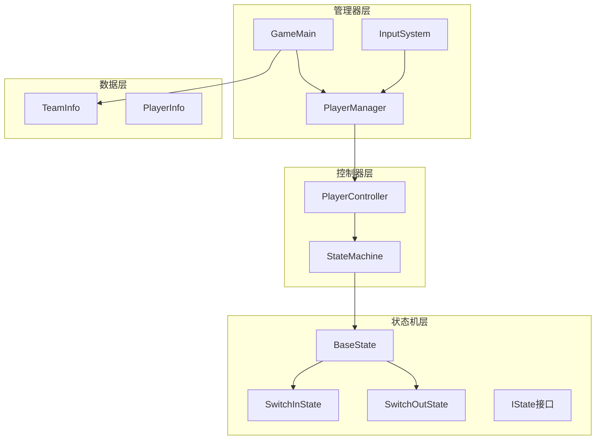
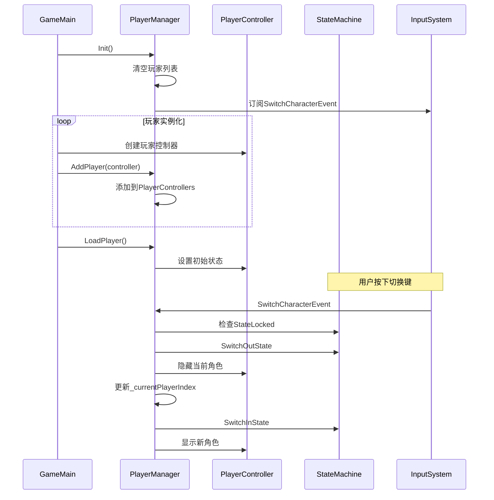
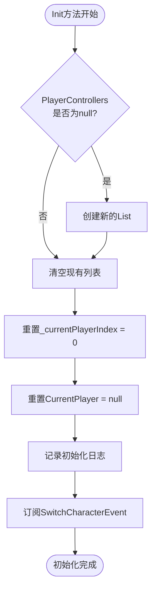
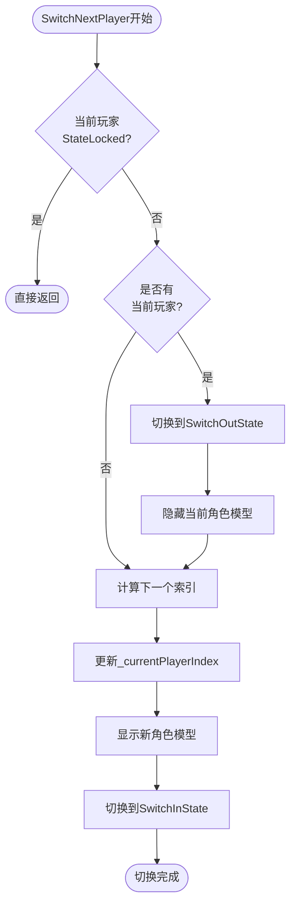
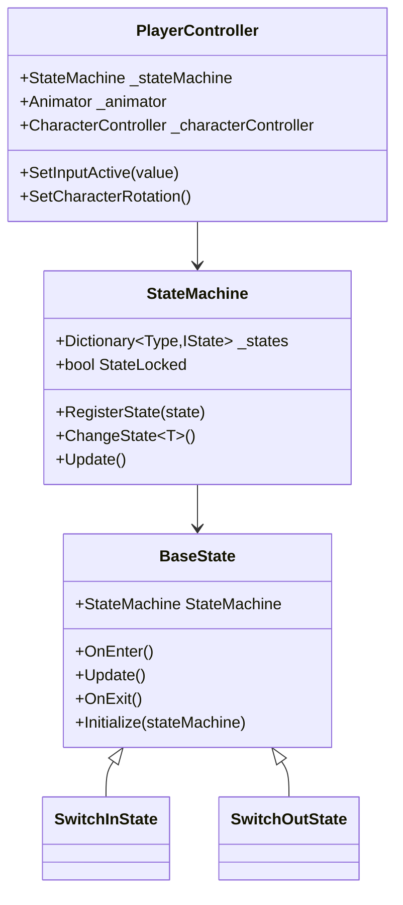
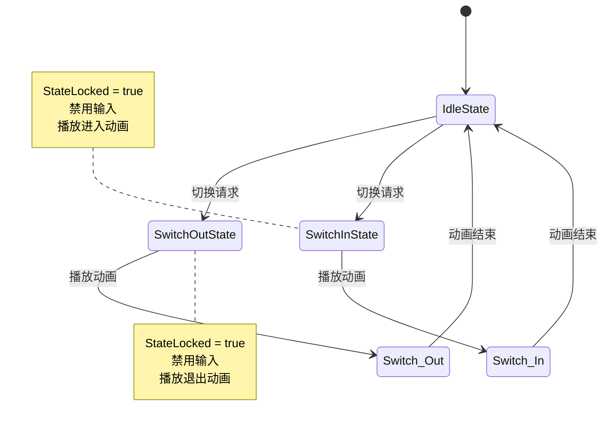
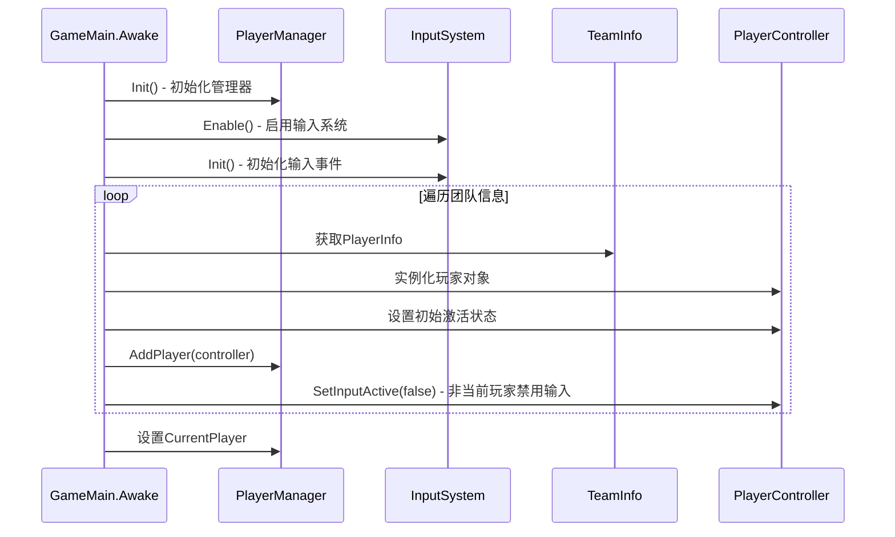
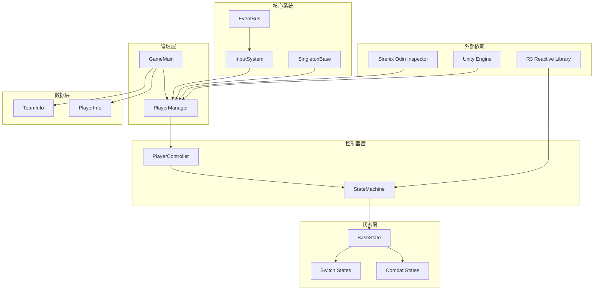

# PlayerManager 详细文档

<cite>
**本文档中引用的文件**
- [PlayerManager.cs](file://Assets/Scripts/Manager/PlayerManager/PlayerManager.cs)
- [GameMain.cs](file://Assets/Scripts/Manager/GameMain.cs)
- [PlayerController.cs](file://Assets/Scripts/Controller/PlayerController.cs)
- [InputSystem.cs](file://Assets/Scripts/Manager/InputSystem/InputSystem.cs)
- [StateMachine.cs](file://Assets/Scripts/Controller/FSM/StateMachine.cs)
- [Singleton.cs](file://Assets/Scripts/Tool/Singleton.cs)
- [SwitchInState.cs](file://Assets/Scripts/Controller/FSM/CharacterState/SwitchInState.cs)
- [SwitchOutState.cs](file://Assets/Controller/FSM/CharacterState/SwitchOutState.cs)
- [BaseState.cs](file://Assets/Scripts/Controller/FSM/BaseState.cs)
- [IState.cs](file://Assets/Scripts/Controller/FSM/IState.cs)
- [TeamInfo.cs](file://Assets/Scripts/Data/SOBase/TeamInfo.cs)
- [PlayerInfo.cs](file://Assets/Scripts/Data/SOBase/PlayerInfo.cs)
</cite>

## 目录
1. [简介](#简介)
2. [项目结构](#项目结构)
3. [核心组件](#核心组件)
4. [架构概览](#架构概览)
5. [详细组件分析](#详细组件分析)
6. [依赖关系分析](#依赖关系分析)
7. [性能考虑](#性能考虑)
8. [故障排除指南](#故障排除指南)
9. [结论](#结论)

## 简介

PlayerManager 是一个基于单例模式的全局玩家管理系统，负责管理游戏中的多个玩家控制器（PlayerControllers），实现角色之间的无缝切换和状态管理。该系统采用状态机模式，结合输入系统和事件驱动架构，提供了完整的游戏角色管理解决方案。

PlayerManager 作为单例类，确保在整个游戏生命周期中只有一个实例存在，统一管理所有玩家对象的状态和行为。系统支持动态添加玩家控制器、自动角色切换、状态锁定保护机制等核心功能。

## 项目结构

PlayerManager 系统的核心文件组织结构如下：

**图表来源**
- [PlayerManager.cs](file://Assets/Scripts/Manager/PlayerManager/PlayerManager.cs#L1-L85)
- [GameMain.cs](file://Assets/Scripts/Manager/GameMain.cs#L1-L74)
- [PlayerController.cs](file://Assets/Scripts/Controller/PlayerController.cs#L1-L103)

**章节来源**
- [PlayerManager.cs](file://Assets/Scripts/Manager/PlayerManager/PlayerManager.cs#L1-L85)
- [GameMain.cs](file://Assets/Scripts/Manager/GameMain.cs#L1-L74)

## 核心组件

PlayerManager 系统包含以下核心组件：

### 单例管理器
- **PlayerManager**: 全局玩家管理器，继承自 SingletonBase
- **GameMain**: 游戏主控制器，负责系统初始化
- **InputSystem**: 输入系统，提供角色切换事件

### 玩家控制器
- **PlayerController**: 单个玩家的控制逻辑
- **StateMachine**: 状态机系统，管理玩家状态转换

### 状态系统
- **SwitchInState**: 角色切换进入状态
- **SwitchOutState**: 角色切换退出状态
- **BaseState**: 状态基类，提供通用功能

**章节来源**
- [PlayerManager.cs](file://Assets/Scripts/Manager/PlayerManager/PlayerManager.cs#L15-L25)
- [PlayerController.cs](file://Assets/Scripts/Controller/PlayerController.cs#L1-L103)
- [StateMachine.cs](file://Assets/Scripts/Controller/FSM/StateMachine.cs#L1-L115)

## 架构概览

PlayerManager 采用分层架构设计，实现了清晰的职责分离和模块化组织：

**图表来源**
- [GameMain.cs](file://Assets/Scripts/Manager/GameMain.cs#L15-L50)
- [PlayerManager.cs](file://Assets/Scripts/Manager/PlayerManager/PlayerManager.cs#L18-L25)
- [InputSystem.cs](file://Assets/Scripts/Manager/InputSystem/InputSystem.cs#L60-L70)

## 详细组件分析

### PlayerManager 单例管理器

PlayerManager 是系统的核心管理器，采用单例模式确保全局唯一性：

#### 属性和字段
- `_currentPlayerIndex`: 当前玩家索引，用于循环切换
- `PlayerControllers`: 玩家控制器列表，存储所有可用角色
- `CurrentPlayer`: 当前活动玩家的引用

#### 核心方法分析

##### Init 方法初始化流程

**图表来源**
- [PlayerManager.cs](file://Assets/Scripts/Manager/PlayerManager/PlayerManager.cs#L18-L25)

##### AddPlayer 方法
该方法负责动态注册玩家控制器到管理系统中，支持运行时添加新角色。

##### SwitchNextPlayer 方法
角色切换的核心逻辑，实现循环切换机制：

**图表来源**
- [PlayerManager.cs](file://Assets/Scripts/Manager/PlayerManager/PlayerManager.cs#L32-L50)

##### SwitchToPlayer 方法
允许直接跳转到指定索引的玩家，提供更灵活的角色切换控制。

##### LoadPlayer 方法
游戏初始化时的角色加载和状态设置，确保只有当前玩家处于激活状态。

**章节来源**
- [PlayerManager.cs](file://Assets/Scripts/Manager/PlayerManager/PlayerManager.cs#L18-L85)

### PlayerController 控制器

PlayerController 负责单个玩家的所有控制逻辑：

#### 状态机注册

**图表来源**
- [PlayerController.cs](file://Assets/Scripts/Controller/PlayerController.cs#L25-L75)
- [StateMachine.cs](file://Assets/Scripts/Controller/FSM/StateMachine.cs#L10-L50)
- [BaseState.cs](file://Assets/Scripts/Controller/FSM/BaseState.cs#L1-L85)

**章节来源**
- [PlayerController.cs](file://Assets/Scripts/Controller/PlayerController.cs#L1-L103)
- [StateMachine.cs](file://Assets/Scripts/Controller/FSM/StateMachine.cs#L1-L115)

### 状态机系统

#### SwitchInState 和 SwitchOutState 状态
这两个状态专门处理角色切换过程中的动画和状态管理：

**图表来源**
- [SwitchInState.cs](file://Assets/Scripts/Controller/FSM/CharacterState/SwitchInState.cs#L1-L33)
- [SwitchOutState.cs](file://Assets/Scripts/Controller/FSM/CharacterState/SwitchOutState.cs#L1-L32)

**章节来源**
- [SwitchInState.cs](file://Assets/Scripts/Controller/FSM/CharacterState/SwitchInState.cs#L1-L33)
- [SwitchOutState.cs](file://Assets/Scripts/Controller/FSM/CharacterState/SwitchOutState.cs#L1-L32)

### GameMain 初始化流程

GameMain 负责整个系统的初始化和玩家实例化：

#### 初始化时序图

**图表来源**
- [GameMain.cs](file://Assets/Scripts/Manager/GameMain.cs#L15-L55)

**章节来源**
- [GameMain.cs](file://Assets/Scripts/Manager/GameMain.cs#L15-L55)

## 依赖关系分析

PlayerManager 系统的依赖关系展现了清晰的层次结构：

**图表来源**
- [PlayerManager.cs](file://Assets/Scripts/Manager/PlayerManager/PlayerManager.cs#L1-L5)
- [GameMain.cs](file://Assets/Scripts/Manager/GameMain.cs#L1-L5)
- [Singleton.cs](file://Assets/Scripts/Tool/Singleton.cs#L1-L24)

**章节来源**
- [PlayerManager.cs](file://Assets/Scripts/Manager/PlayerManager/PlayerManager.cs#L1-L85)
- [GameMain.cs](file://Assets/Scripts/Manager/GameMain.cs#L1-L74)

## 性能考虑

PlayerManager 系统在设计时充分考虑了性能优化：

### 内存管理
- 使用单例模式避免重复实例化
- 及时清理不需要的玩家控制器引用
- 合理使用对象池减少垃圾回收压力

### 状态切换优化
- StateLocked 保护机制防止状态冲突
- 动画播放完成后才进行状态切换
- 及时禁用非活动角色的组件

### 输入处理优化
- 条件性启用/禁用输入处理
- 避免不必要的状态机更新
- 合理的帧率适配

## 故障排除指南

### 常见问题及解决方案

#### 角色切换失败
**症状**: 按下切换键但角色不切换
**原因**: 当前角色处于状态锁定状态
**解决方案**: 检查当前角色是否在执行特殊动作

#### 玩家控制器丢失
**症状**: 玩家控制器无法找到
**原因**: AddPlayer 方法未正确调用
**解决方案**: 确保在实例化后立即注册玩家控制器

#### 状态机异常
**症状**: 角色状态混乱
**原因**: 状态机初始化不完整
**解决方案**: 检查所有状态是否正确注册

**章节来源**
- [PlayerManager.cs](file://Assets/Scripts/Manager/PlayerManager/PlayerManager.cs#L32-L50)
- [StateMachine.cs](file://Assets/Scripts/Controller/FSM/StateMachine.cs#L40-L60)

## 结论

PlayerManager 系统提供了一个完整、高效的玩家管理解决方案。通过单例模式、状态机模式和事件驱动架构的结合，实现了灵活的角色管理和无缝的切换体验。

### 主要优势
- **单例设计**: 确保全局唯一性和一致性
- **状态保护**: StateLocked 机制防止状态冲突
- **事件驱动**: 响应式编程提升用户体验
- **模块化**: 清晰的职责分离便于维护

### 最佳实践建议
- 在游戏初始化阶段正确设置玩家控制器
- 合理使用状态锁定机制保护关键状态
- 定期检查玩家控制器的生命周期管理
- 利用 Odin Inspector 进行可视化调试

该系统为多人游戏开发提供了坚实的基础，支持动态角色管理和复杂的交互逻辑，是现代游戏开发中不可或缺的重要组件。