# 玩家管理系统

<cite>
**本文档引用的文件**
- [GameMain.cs](file://Assets/Scripts/Manager/GameMain.cs)
- [PlayerManager.cs](file://Assets/Scripts/Manager/PlayerManager/PlayerManager.cs)
- [PlayerController.cs](file://Assets/Scripts/Controller/PlayerController.cs)
- [TeamInfo.cs](file://Assets/Scripts/Data/SOBase/TeamInfo.cs)
- [PlayerInfo.cs](file://Assets/Scripts/Data/SOBase/PlayerInfo.cs)
- [Singleton.cs](file://Assets/Scripts/Tool/Singleton.cs)
- [StateMachine.cs](file://Assets/Scripts/Controller/FSM/StateMachine.cs)
- [InputSystem.cs](file://Assets/Scripts/Manager/InputSystem/InputSystem.cs)
- [PlayerEvents.cs](file://Assets/Scripts/EventData/PlayerEvents.cs)
</cite>

## 目录
1. [简介](#简介)
2. [系统架构概览](#系统架构概览)
3. [核心组件分析](#核心组件分析)
4. [PlayerManager单例管理](#playermanager单例管理)
5. [玩家控制器管理机制](#玩家控制器管理机制)
6. [角色切换逻辑](#角色切换逻辑)
7. [状态机状态锁定保护](#状态机状态锁定保护)
8. [事件订阅初始化流程](#事件订阅初始化流程)
9. [项目启动初始化流程](#项目启动初始化流程)
10. [数据配置最佳实践](#数据配置最佳实践)
11. [故障排除指南](#故障排除指南)
12. [总结](#总结)

## 简介

玩家管理系统是一个基于Unity引擎的高度模块化的角色管理框架，采用单例模式设计，负责管理游戏中的所有玩家角色。该系统通过PlayerManager单例进行全局控制，支持多角色切换、状态机管理、事件驱动等核心功能，为游戏提供了完整的角色生命周期管理解决方案。

## 系统架构概览

玩家管理系统采用分层架构设计，包含数据层、管理层和控制层三个主要层次：

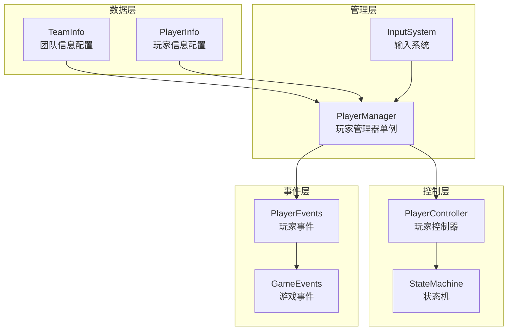

**图表来源**
- [PlayerManager.cs](file://Assets/Scripts/Manager/PlayerManager/PlayerManager.cs#L1-L85)
- [PlayerController.cs](file://Assets/Scripts/Controller/PlayerController.cs#L1-L103)
- [StateMachine.cs](file://Assets/Scripts/Controller/FSM/StateMachine.cs#L1-L115)

## 核心组件分析

### 组件关系图

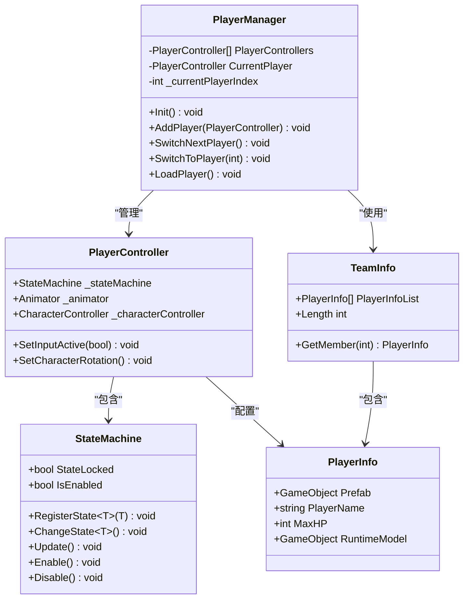

**图表来源**
- [PlayerManager.cs](file://Assets/Scripts/Manager/PlayerManager/PlayerManager.cs#L15-L25)
- [PlayerController.cs](file://Assets/Scripts/Controller/PlayerController.cs#L5-L15)
- [StateMachine.cs](file://Assets/Scripts/Controller/FSM/StateMachine.cs#L8-L15)
- [TeamInfo.cs](file://Assets/Scripts/Data/SOBase/TeamInfo.cs#L5-L7)
- [PlayerInfo.cs](file://Assets/Scripts/Data/SOBase/PlayerInfo.cs#L5-L11)

**章节来源**
- [PlayerManager.cs](file://Assets/Scripts/Manager/PlayerManager/PlayerManager.cs#L1-L85)
- [PlayerController.cs](file://Assets/Scripts/Controller/PlayerController.cs#L1-L103)
- [StateMachine.cs](file://Assets/Scripts/Controller/FSM/StateMachine.cs#L1-L115)

## PlayerManager单例管理

PlayerManager采用单例模式设计，确保整个游戏生命周期内只有一个实例存在，提供全局统一的角色管理服务。

### 单例实现机制

PlayerManager继承自SingletonBase基类，利用泛型约束和Lazy<T>实现线程安全的延迟初始化：

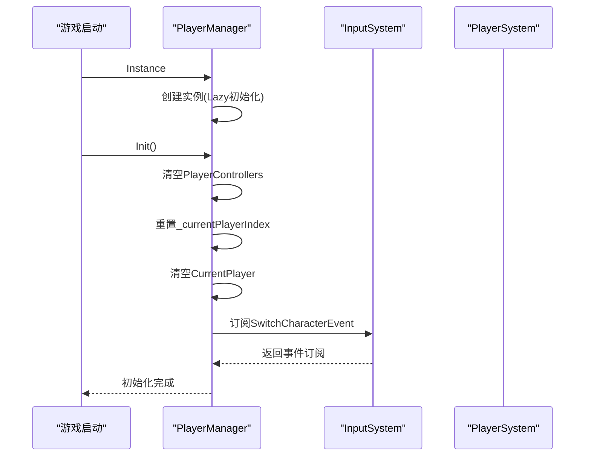

**图表来源**
- [PlayerManager.cs](file://Assets/Scripts/Manager/PlayerManager/PlayerManager.cs#L17-L32)
- [Singleton.cs](file://Assets/Scripts/Tool/Singleton.cs#L10-L20)

### 全局管理功能

PlayerManager的核心职责包括：

1. **玩家控制器列表管理**：维护所有已注册的PlayerController实例
2. **当前玩家跟踪**：实时跟踪当前活跃的玩家角色
3. **玩家索引管理**：维护当前玩家在列表中的位置索引
4. **角色切换控制**：提供多种角色切换方式

**章节来源**
- [PlayerManager.cs](file://Assets/Scripts/Manager/PlayerManager/PlayerManager.cs#L17-L32)

## 玩家控制器管理机制

### PlayerControllers列表管理

PlayerControllers是一个List<PlayerController>类型的成员变量，用于存储游戏中所有的玩家控制器实例：

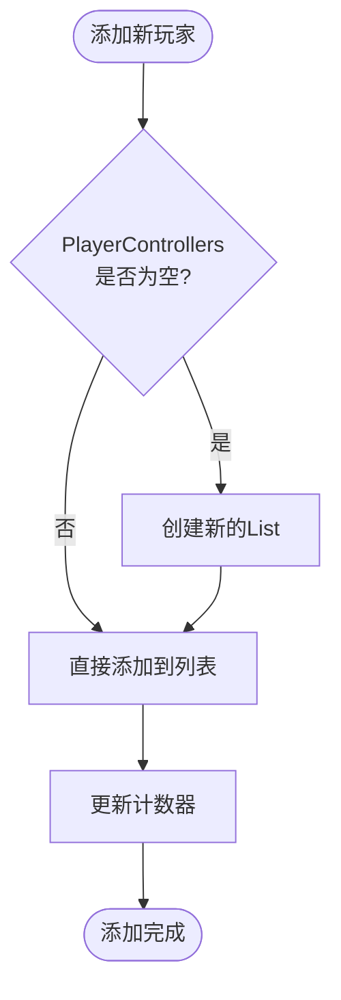

**图表来源**
- [PlayerManager.cs](file://Assets/Scripts/Manager/PlayerManager/PlayerManager.cs#L34-L36)

### CurrentPlayer和_currentPlayerIndex同步机制

系统通过两个关键字段保持玩家状态的一致性：

- **CurrentPlayer**：当前活跃的玩家控制器引用
- **_currentPlayerIndex**：当前玩家在列表中的索引位置

这种双重维护机制确保了在玩家切换过程中状态的准确性和一致性。

**章节来源**
- [PlayerManager.cs](file://Assets/Scripts/Manager/PlayerManager/PlayerManager.cs#L15-L25)

## 角色切换逻辑

### SwitchNextPlayer方法实现

SwitchNextPlayer方法实现了循环式角色切换逻辑：

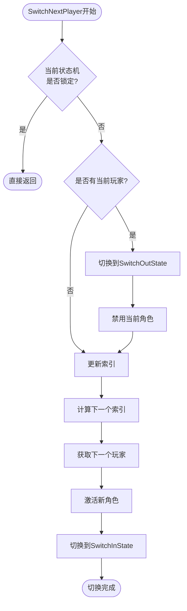

**图表来源**
- [PlayerManager.cs](file://Assets/Scripts/Manager/PlayerManager/PlayerManager.cs#L38-L56)

### SwitchToPlayer方法实现

SwitchToPlayer方法提供了指定索引的角色切换功能：

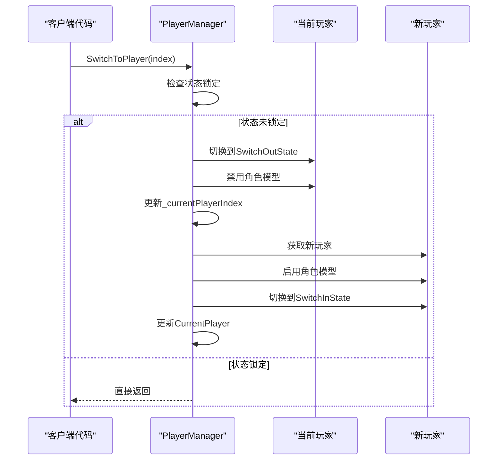

**图表来源**
- [PlayerManager.cs](file://Assets/Scripts/Manager/PlayerManager/PlayerManager.cs#L58-L76)

**章节来源**
- [PlayerManager.cs](file://Assets/Scripts/Manager/PlayerManager/PlayerManager.cs#L38-L76)

## 状态机状态锁定保护

### StateLocked的作用机制

StateLocked是StateMachine类中的一个重要保护机制，在角色切换过程中起到关键的安全保护作用：

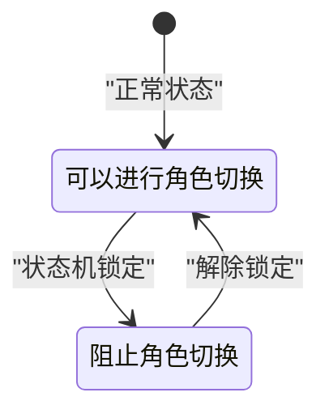

**图表来源**
- [StateMachine.cs](file://Assets/Scripts/Controller/FSM/StateMachine.cs#L13)

### 锁定保护的实现逻辑

在PlayerManager的角色切换方法中，都会先检查当前玩家的状态机是否处于锁定状态：

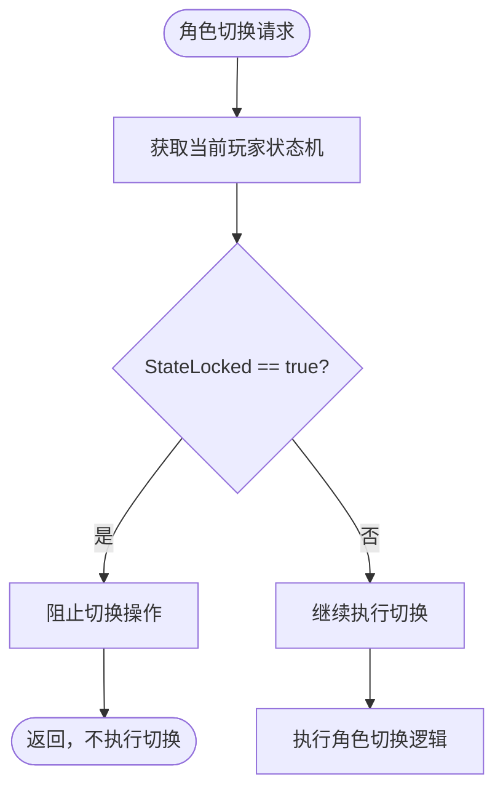

**图表来源**
- [PlayerManager.cs](file://Assets/Scripts/Manager/PlayerManager/PlayerManager.cs#L39-L41)

这种设计确保了在角色正在进行特殊动作（如切换动画）时不会被意外中断，保证了游戏体验的流畅性。

**章节来源**
- [StateMachine.cs](file://Assets/Scripts/Controller/FSM/StateMachine.cs#L13)
- [PlayerManager.cs](file://Assets/Scripts/Manager/PlayerManager/PlayerManager.cs#L39-L41)

## 事件订阅初始化流程

### SwitchCharacterEvent事件绑定

PlayerManager在Init方法中建立了与InputSystem的事件连接：

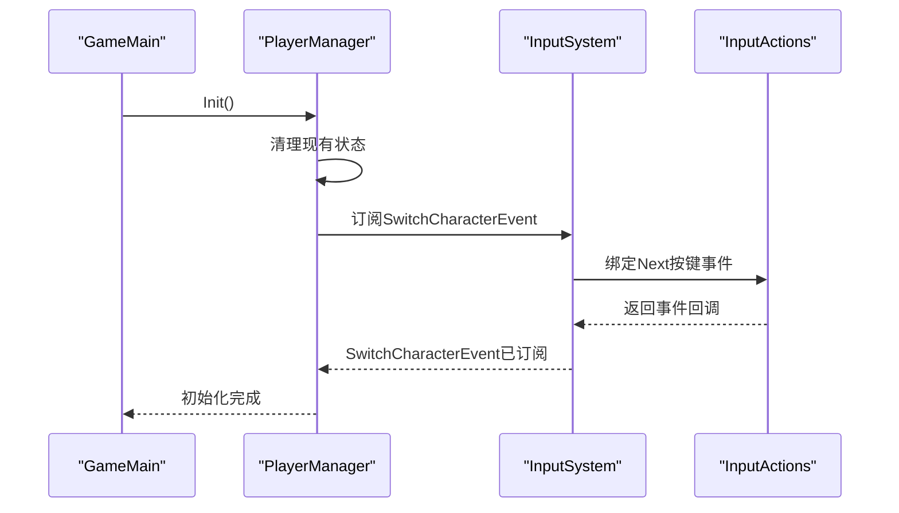

**图表来源**
- [PlayerManager.cs](file://Assets/Scripts/Manager/PlayerManager/PlayerManager.cs#L32)
- [InputSystem.cs](file://Assets/Scripts/Manager/InputSystem/InputSystem.cs#L58-L65)

### 事件处理流程

当用户按下Next按键时，会触发以下事件链：

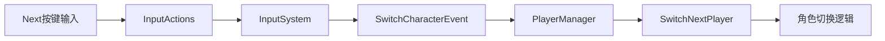

**图表来源**
- [InputSystem.cs](file://Assets/Scripts/Manager/InputSystem/InputSystem.cs#L58-L65)

**章节来源**
- [PlayerManager.cs](file://Assets/Scripts/Manager/PlayerManager/PlayerManager.cs#L32)
- [InputSystem.cs](file://Assets/Scripts/Manager/InputSystem/InputSystem.cs#L58-L65)

## 项目启动初始化流程

### GameMain中的初始化序列

GameMain类的Awake方法展示了完整的玩家系统初始化流程：

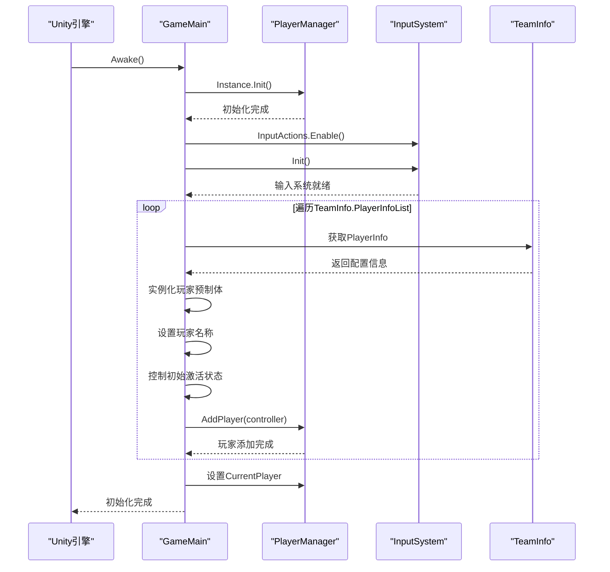

**图表来源**
- [GameMain.cs](file://Assets/Scripts/Manager/GameMain.cs#L15-L50)

### 玩家实例化和激活策略

系统采用了智能的玩家实例化策略：

1. **预实例化所有玩家**：在场景加载时一次性创建所有玩家对象
2. **延迟激活**：只有第一个玩家会被立即激活，其他玩家保持禁用状态
3. **动态控制**：通过SetInputActive方法控制玩家的输入响应

**章节来源**
- [GameMain.cs](file://Assets/Scripts/Manager/GameMain.cs#L15-L50)

## 数据配置最佳实践

### TeamInfo配置规范

TeamInfo作为团队信息的ScriptableObject配置，建议遵循以下最佳实践：

| 配置项 | 类型 | 必需性 | 说明 |
|--------|------|--------|------|
| PlayerInfoList | PlayerInfo[] | 必需 | 存储3个玩家信息的数组 |
| GetMember(index) | 方法 | 推荐 | 安全访问玩家信息的方法 |
| Length | 属性 | 推荐 | 获取玩家数量的便捷属性 |

### PlayerInfo配置规范

PlayerInfo是每个玩家的详细配置信息：

| 配置项 | 类型 | 必需性 | 说明 |
|--------|------|--------|------|
| Prefab | GameObject | 必需 | 玩家角色的预制体引用 |
| PlayerName | string | 必需 | 玩家角色的显示名称 |
| MaxHP | int | 推荐 | 玩家的最大生命值 |
| RuntimeModel | GameObject | 可选 | 运行时缓存的模型对象 |

### 预制体关联最佳实践

1. **命名规范**：使用清晰的命名约定，如"Player_Anbi_Prefab"
2. **层级结构**：确保预制体包含完整的组件结构
3. **资源优化**：合理设置对象池大小，避免频繁实例化
4. **性能考虑**：对于复杂角色，考虑使用Addressable Asset System

**章节来源**
- [TeamInfo.cs](file://Assets/Scripts/Data/SOBase/TeamInfo.cs#L5-L9)
- [PlayerInfo.cs](file://Assets/Scripts/Data/SOBase/PlayerInfo.cs#L5-L11)

## 故障排除指南

### 常见问题及解决方案

#### 1. 玩家切换无响应
**症状**：按下Next按键后角色不切换
**可能原因**：
- InputSystem未正确初始化
- SwitchCharacterEvent事件未订阅
- 状态机处于锁定状态

**解决方案**：
- 检查GameMain.Awake方法中的初始化顺序
- 验证PlayerManager.Init()是否被调用
- 确认状态机的StateLocked属性

#### 2. 新增玩家无法加入
**症状**：新增玩家角色后无法被PlayerManager管理
**可能原因**：
- AddPlayer方法未被调用
- PlayerController组件缺失
- 预制体实例化失败

**解决方案**：
- 确保在GameMain中调用PlayerManager.Instance.AddPlayer()
- 验证PlayerController组件的完整性
- 检查预制体的路径和引用

#### 3. 角色切换动画异常
**症状**：角色切换时出现模型闪烁或动画错误
**可能原因**：
- SwitchInState和SwitchOutState状态机配置错误
- 状态机锁定时间过短
- 动画器配置不匹配

**解决方案**：
- 检查状态机的状态注册顺序
- 调整状态切换的时间间隔
- 验证动画器参数的正确性

### 性能优化建议

1. **对象池管理**：对于频繁切换的角色，考虑使用对象池
2. **延迟加载**：对于非战斗角色，可以采用延迟加载策略
3. **内存监控**：定期检查PlayerControllers列表的内存占用
4. **状态机优化**：避免在状态切换时执行耗时操作

## 总结

玩家管理系统通过PlayerManager单例实现了高效的角色管理，其核心优势包括：

1. **单例模式**：确保全局唯一性，简化跨组件通信
2. **事件驱动**：通过事件机制实现松耦合的系统交互
3. **状态保护**：通过StateLocked机制保证切换过程的安全性
4. **灵活配置**：基于ScriptableObject的数据配置，便于调试和修改
5. **性能优化**：预实例化+延迟激活的策略，平衡内存和性能

该系统为游戏开发提供了坚实的基础架构，支持复杂的多角色交互需求，同时保持了良好的扩展性和维护性。通过遵循本文档中的最佳实践和故障排除指南，开发者可以构建出稳定可靠的玩家管理系统。