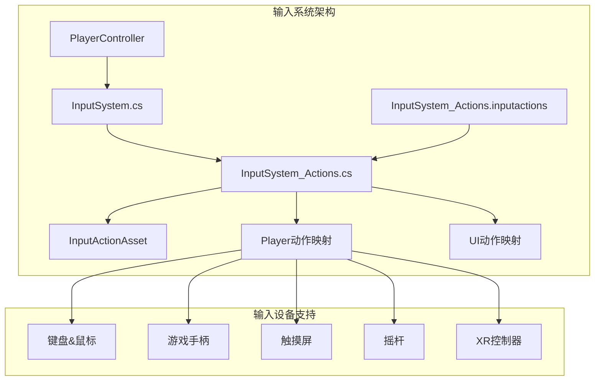
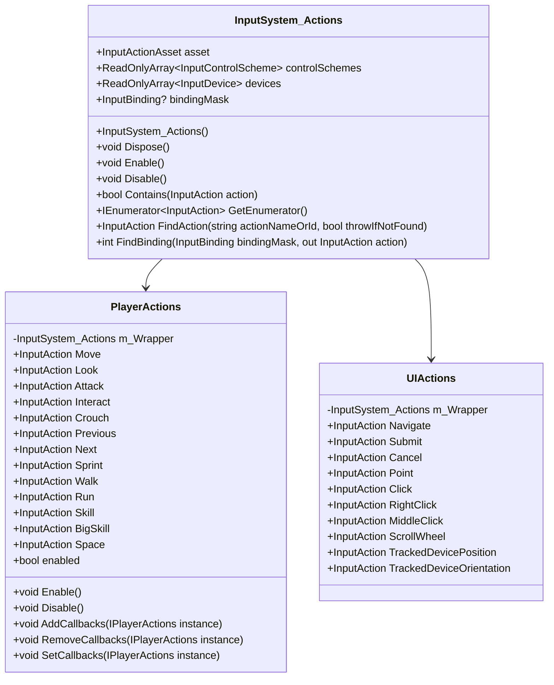
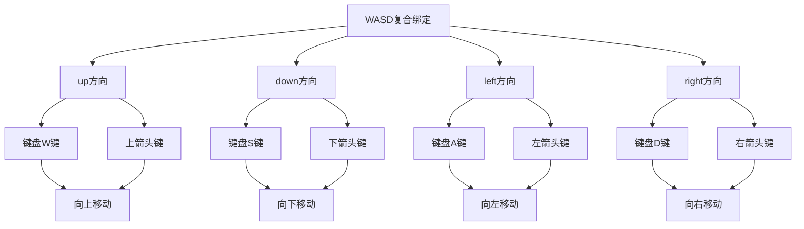
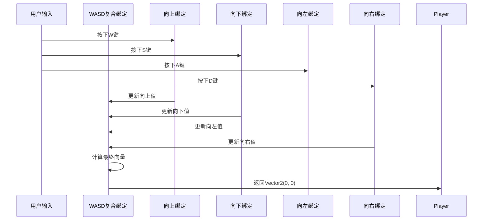
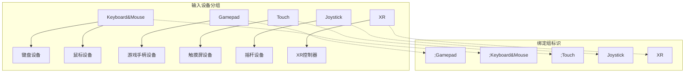

# 输入动作配置

<cite>
**本文档引用的文件**
- [InputSystem_Actions.cs](file://Assets/InputSystem_Actions.cs)
- [InputSystem_Actions.inputactions](file://Assets/InputSystem_Actions.inputactions)
- [InputSystem.cs](file://Assets/Scripts/Manager/InputSystem/InputSystem.cs)
</cite>

## 目录
1. [简介](#简介)
2. [项目结构概览](#项目结构概览)
3. [InputSystem_Actions类详解](#inputsystem_actions类详解)
4. [Player动作映射表分析](#player动作映射表分析)
5. [输入设备绑定配置](#输入设备绑定配置)
6. [复合绑定机制](#复合绑定机制)
7. [输入设备分组策略](#输入设备分组策略)
8. [代码使用示例](#代码使用示例)
9. [配置修改指南](#配置修改指南)
10. [多平台支持最佳实践](#多平台支持最佳实践)
11. [故障排除](#故障排除)
12. [总结](#总结)

## 简介

Unity输入系统通过自动生成的`InputSystem_Actions`类提供了强大而灵活的输入动作配置机制。该类作为`InputActionAsset`的代码表示，为游戏开发者提供了统一的输入处理接口，支持多种输入设备和复杂的绑定配置。

本文档将深入解析由Unity输入系统自动生成的`InputSystem_Actions`类，详细说明其结构、用途以及在实际项目中的应用方法。

## 项目结构概览

该项目采用模块化的输入系统架构，主要包含以下关键组件：

**图表来源**
- [InputSystem_Actions.cs](file://Assets/InputSystem_Actions.cs#L1-L50)
- [InputSystem.cs](file://Assets/Scripts/Manager/InputSystem/InputSystem.cs#L1-L30)

## InputSystem_Actions类详解

### 类结构概述

`InputSystem_Actions`类是Unity输入系统自动生成的核心类，它继承自`IInputActionCollection2`接口并实现了`IDisposable`接口。

**图表来源**
- [InputSystem_Actions.cs](file://Assets/InputSystem_Actions.cs#L60-L100)
- [InputSystem_Actions.cs](file://Assets/InputSystem_Actions.cs#L1332-L1389)

### 构造函数实现

构造函数负责初始化输入动作资产，从JSON格式的配置数据中创建`InputActionAsset`实例：

**节来源**
- [InputSystem_Actions.cs](file://Assets/InputSystem_Actions.cs#L75-L100)

### 资产属性访问

`asset`属性提供了对底层`InputActionAsset`实例的直接访问，允许开发者进行高级配置和查询操作。

**节来源**
- [InputSystem_Actions.cs](file://Assets/InputSystem_Actions.cs#L65-L70)

## Player动作映射表分析

### 核心动作类型

Player动作映射表定义了13个核心输入动作，每个动作都有特定的类型、ID和预期控制类型：

| 动作名称 | 类型 | 预期控制类型 | 描述 |
|---------|------|-------------|------|
| Move | Value | Vector2 | 移动方向输入，支持复合绑定 |
| Look | Value | Vector2 | 视角旋转输入 |
| Attack | Button | Button | 攻击动作触发 |
| Interact | Button | (空) | 交互动作，带Hold交互 |
| Crouch | Button | (空) | 蹲下动作 |
| Previous | Button | Button | 上一个选择 |
| Next | Button | Button | 下一个选择 |
| Sprint | Button | Button | 冲刺动作 |
| Walk | Button | (空) | 行走模式切换 |
| Run | Button | (空) | 跑步模式切换 |
| Skill | Button | (空) | 普通技能 |
| BigSkill | Button | (空) | 大招技能 |
| Space | Button | (空) | 特殊动作 |

### 动作ID和标识

每个动作都具有唯一的UUID标识符，确保在复杂场景中的准确识别和匹配：

**节来源**
- [InputSystem_Actions.cs](file://Assets/InputSystem_Actions.cs#L80-L150)

### 控制类型分析

- **Value类型**：返回连续值，如Vector2用于二维移动输入
- **Button类型**：返回布尔值，表示按下或释放状态
- **PassThrough类型**：直接传递原始输入值

## 输入设备绑定配置

### WASD键盘绑定

WASD键盘绑定采用了复合绑定（Composite Binding）机制，允许多个按键组合成单一的移动动作：

**图表来源**
- [InputSystem_Actions.cs](file://Assets/InputSystem_Actions.cs#L221-L320)

### 游戏手柄绑定

游戏手柄绑定支持左摇杆和D-pad两种输入方式：

**节来源**
- [InputSystem_Actions.cs](file://Assets/InputSystem_Actions.cs#L160-L180)

### 鼠标输入绑定

鼠标输入主要用于视角控制和攻击动作：

**节来源**
- [InputSystem_Actions.cs](file://Assets/InputSystem_Actions.cs#L320-L380)

### XR控制器支持

虚拟现实控制器提供了专门的输入路径：

**节来源**
- [InputSystem_Actions.cs](file://Assets/InputSystem_Actions.cs#L180-L200)

## 复合绑定机制

### WASD复合绑定实现

WASD复合绑定是Unity输入系统的一个重要特性，它允许将多个独立的按键绑定到同一个动作上：

**图表来源**
- [InputSystem_Actions.cs](file://Assets/InputSystem_Actions.cs#L221-L320)

### 复合绑定的工作原理

1. **部分绑定**：每个按键都是复合绑定的一部分
2. **值合并**：系统自动合并所有激活的部分绑定值
3. **向量计算**：最终输出为归一化的Vector2向量

**节来源**
- [InputSystem_Actions.cs](file://Assets/InputSystem_Actions.cs#L221-L320)

## 输入设备分组策略

### 设备分组架构

Unity输入系统采用分组策略来管理不同类型的输入设备：

**图表来源**
- [InputSystem_Actions.cs](file://Assets/InputSystem_Actions.cs#L1134-L1182)

### 优先级处理机制

设备分组决定了输入优先级和控制方案选择：

**节来源**
- [InputSystem_Actions.cs](file://Assets/InputSystem_Actions.cs#L1134-L1182)

### 控制方案索引

系统维护了各个控制方案的索引，以便快速访问：

**节来源**
- [InputSystem_Actions.cs](file://Assets/InputSystem_Actions.cs#L1727-L1794)

## 代码使用示例

### 基本使用模式

以下是使用`InputSystem_Actions`类的基本模式：

**节来源**
- [InputSystem_Actions.cs](file://Assets/InputSystem_Actions.cs#L29-L63)

### 事件回调配置

**节来源**
- [InputSystem.cs](file://Assets/Scripts/Manager/InputSystem/InputSystem.cs#L50-L80)

### 属性访问模式

**节来源**
- [InputSystem.cs](file://Assets/Scripts/Manager/InputSystem/InputSystem.cs#L80-L94)

## 配置修改指南

### 在Unity编辑器中添加新动作

1. 打开`InputSystem_Actions.inputactions`文件
2. 在Player或UI动作映射中添加新的动作定义
3. 配置动作的类型、ID和预期控制类型
4. 添加相应的绑定配置
5. 保存文件，系统会自动生成对应的C#代码

### 配置新的按键绑定

1. 在绑定数组中添加新的绑定对象
2. 设置`path`属性指定输入设备路径
3. 配置`groups`属性设置设备分组
4. 关联到相应的动作名称
5. 设置`isComposite`和`isPartOfComposite`属性

### 确保代码一致性

修改配置文件后，需要：
- 等待Unity重新生成代码
- 检查编译错误
- 更新使用旧绑定的代码
- 测试新添加的功能

## 多平台支持最佳实践

### 平台适配策略

1. **设备检测**：根据可用设备自动选择合适的控制方案
2. **灵敏度调整**：为不同设备类型设置适当的输入灵敏度
3. **反馈机制**：提供视觉和触觉反馈以增强用户体验
4. **可访问性**：支持辅助功能和自定义控制方案

### 性能优化建议

1. **按需启用**：只启用当前活跃的动作映射
2. **事件过滤**：合理使用回调过滤减少不必要的处理
3. **内存管理**：及时释放不再使用的输入动作资源
4. **批处理**：批量处理相似的输入事件

### 兼容性考虑

1. **版本兼容**：确保输入系统版本的一致性
2. **设备兼容**：测试各种输入设备的兼容性
3. **平台差异**：考虑不同平台的输入行为差异
4. **更新策略**：制定输入配置的更新和迁移策略

## 故障排除

### 常见问题及解决方案

1. **动作未响应**
   - 检查动作是否正确启用
   - 验证绑定配置是否正确
   - 确认回调函数已注册

2. **复合绑定不工作**
   - 检查所有部分绑定是否正确定义
   - 验证输入设备是否正确连接
   - 确认复合绑定的逻辑正确

3. **设备绑定冲突**
   - 检查设备分组设置
   - 验证绑定优先级
   - 确认控制方案选择

4. **性能问题**
   - 检查回调函数的效率
   - 优化事件处理逻辑
   - 减少不必要的输入监听

### 调试技巧

1. **日志记录**：在关键位置添加调试日志
2. **断点调试**：使用Unity的调试工具检查输入状态
3. **可视化工具**：使用输入可视化工具监控输入流
4. **单元测试**：编写测试用例验证输入功能

## 总结

Unity输入系统通过`InputSystem_Actions`类提供了一个强大而灵活的输入处理框架。该系统的主要优势包括：

1. **统一接口**：提供一致的编程接口处理各种输入设备
2. **灵活配置**：支持复杂的绑定配置和设备分组
3. **自动管理**：自动生成代码，减少手动维护工作
4. **多平台支持**：内置对多种输入设备的支持
5. **性能优化**：高效的事件处理和内存管理

通过深入理解`InputSystem_Actions`类的结构和工作机制，开发者可以更好地利用Unity输入系统构建优秀的游戏体验。合理的配置管理和最佳实践的应用将确保输入系统的稳定性和可维护性。