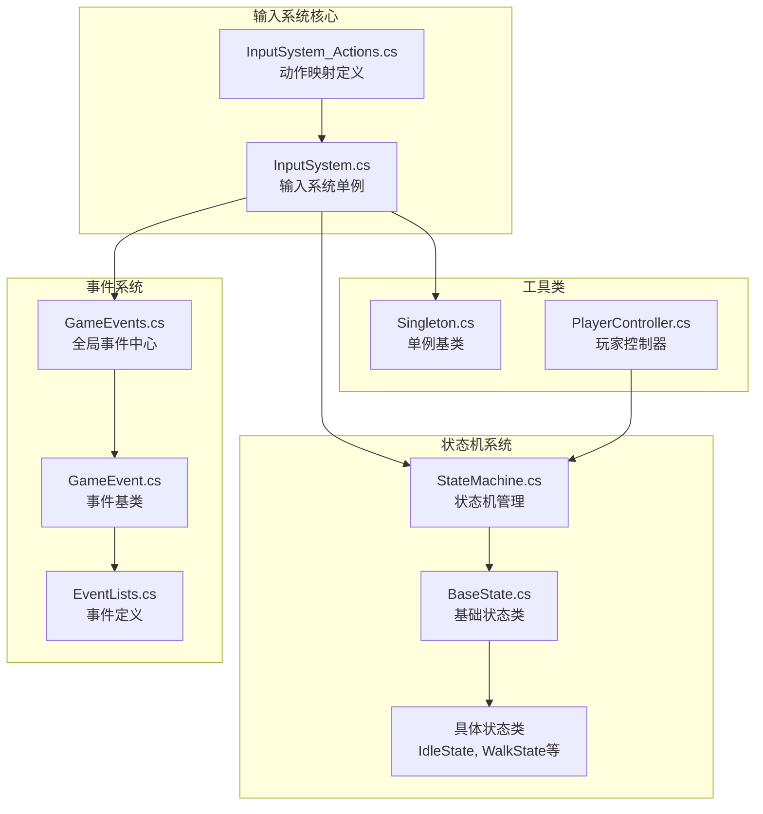
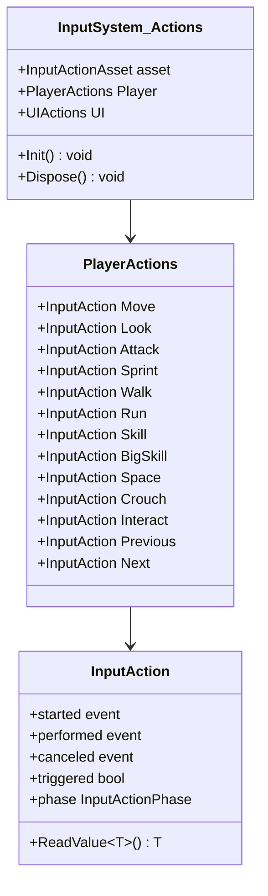
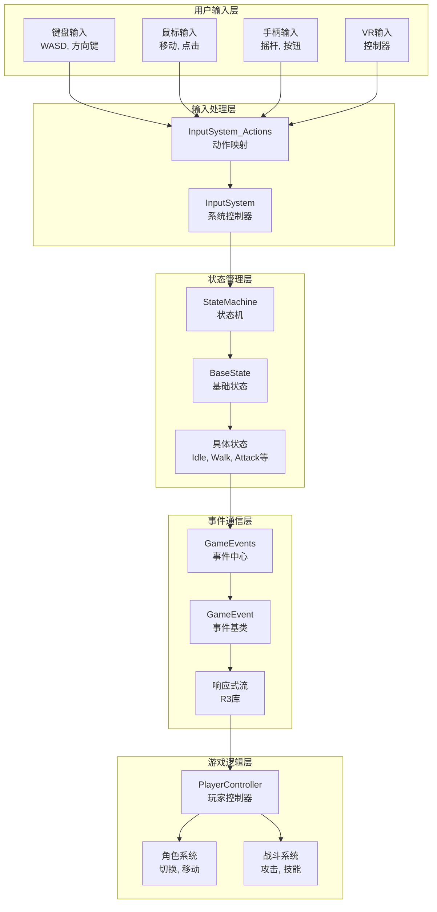
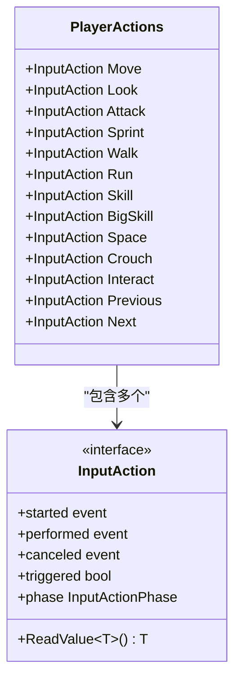
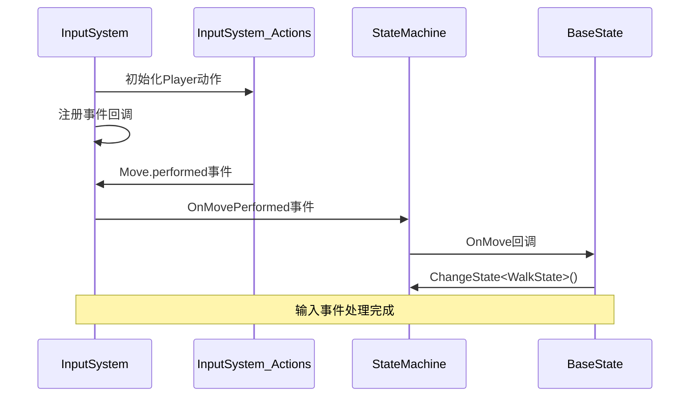
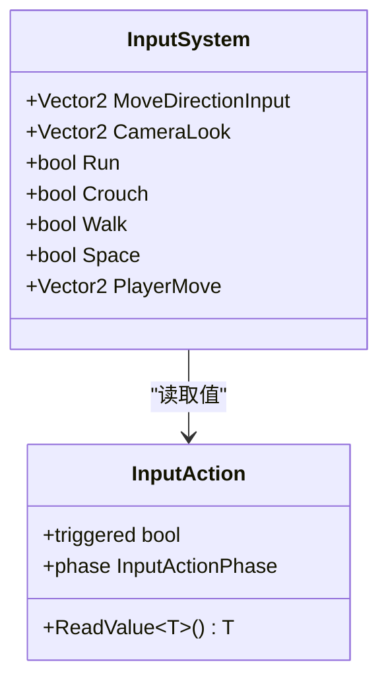
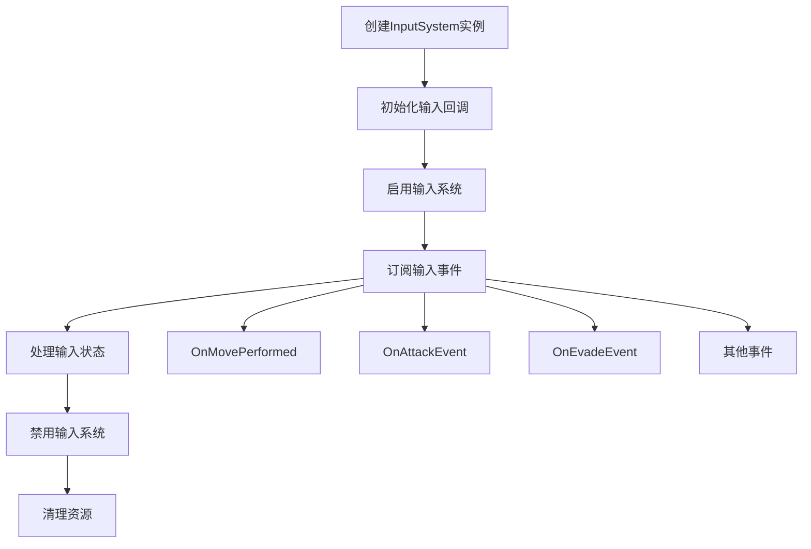
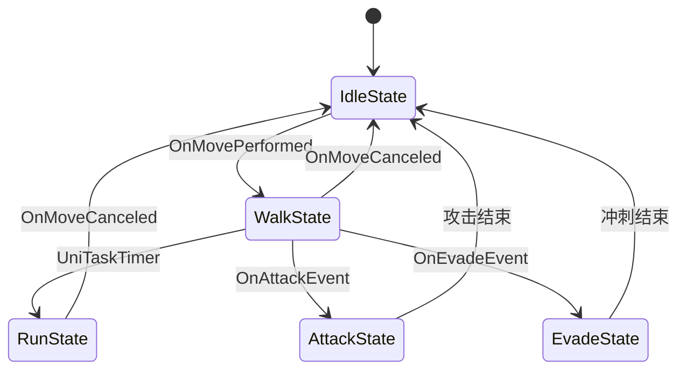
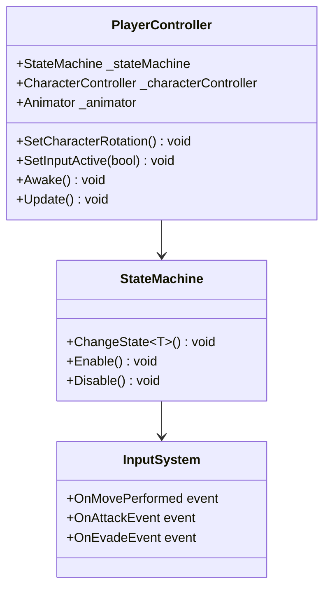
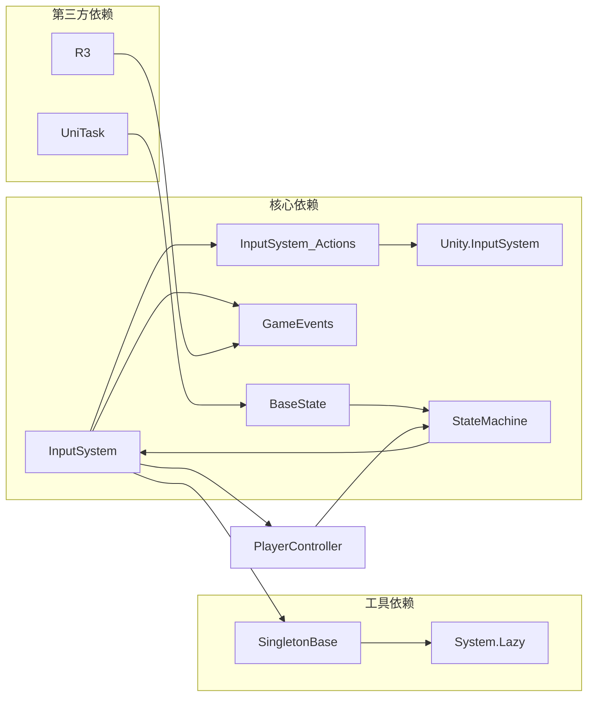

# 输入系统

<cite>
**本文档引用的文件**
- [InputSystem_Actions.cs](file://Assets/InputSystem_Actions.cs)
- [InputSystem.cs](file://Assets/Scripts/Manager/InputSystem/InputSystem.cs)
- [PlayerController.cs](file://Assets/Scripts/Controller/PlayerController.cs)
- [StateMachine.cs](file://Assets/Scripts/Controller/FSM/StateMachine.cs)
- [BaseState.cs](file://Assets/Scripts/Controller/FSM/BaseState.cs)
- [GameEvents.cs](file://Assets/Scripts/Manager/EventSystem/GameEvents.cs)
- [GameEvent.cs](file://Assets/Scripts/Manager/EventSystem/GameEvent.cs)
- [Singleton.cs](file://Assets/Scripts/Tool/Singleton.cs)
- [EventLists.cs](file://Assets/Scripts/Manager/EventSystem/EventLists.cs)
- [IdleState.cs](file://Assets/Scripts/Controller/FSM/CharacterState/IdleState.cs)
- [WalkState.cs](file://Assets/Scripts/Controller/FSM/CharacterState/WalkState.cs)
- [PlayerEvents.cs](file://Assets/EventData/PlayerEvents.cs)
</cite>

## 目录
1. [简介](#简介)
2. [项目结构](#项目结构)
3. [核心组件](#核心组件)
4. [架构概览](#架构概览)
5. [详细组件分析](#详细组件分析)
6. [依赖关系分析](#依赖关系分析)
7. [性能考虑](#性能考虑)
8. [故障排除指南](#故障排除指南)
9. [结论](#结论)

## 简介

本输入系统基于Unity的新输入系统(Input System)，采用现代化的响应式编程模式，提供了强大的输入处理能力。系统通过InputSystem_Actions动作映射类管理玩家输入，结合状态机模式实现复杂的游戏行为控制，并通过事件驱动的方式与其他系统进行解耦通信。

该系统支持多种输入设备（键盘、鼠标、手柄、VR控制器等），并提供了灵活的状态转换机制，能够处理角色切换、移动、攻击、技能释放等多种游戏场景。

## 项目结构

输入系统的核心文件组织如下：

**图表来源**
- [InputSystem_Actions.cs](file://Assets/InputSystem_Actions.cs#L1-L50)
- [InputSystem.cs](file://Assets/Scripts/Manager/InputSystem/InputSystem.cs#L1-L30)
- [StateMachine.cs](file://Assets/Scripts/Controller/FSM/StateMachine.cs#L1-L20)

**章节来源**
- [InputSystem_Actions.cs](file://Assets/InputSystem_Actions.cs#L1-L100)
- [InputSystem.cs](file://Assets/Scripts/Manager/InputSystem/InputSystem.cs#L1-L94)

## 核心组件

### InputSystem_Actions动作映射类

InputSystem_Actions是Unity输入系统自动生成的动作映射类，提供了对玩家输入动作的统一访问接口。

#### 主要特性：
- **类型安全的访问**：通过强类型属性访问各个输入动作
- **多平台支持**：内置多种输入设备绑定
- **响应式设计**：支持回调函数和事件订阅
- **分组管理**：按功能分为Player和UI两组动作

#### Player动作映射器结构

**图表来源**
- [InputSystem_Actions.cs](file://Assets/InputSystem_Actions.cs#L1332-L1389)
- [InputSystem_Actions.cs](file://Assets/InputSystem_Actions.cs#L1302-L1334)

### InputSystem单例

InputSystem类作为输入系统的中央控制器，负责：

- **单例模式管理**：确保全局唯一实例
- **事件回调配置**：设置各种输入事件的处理函数
- **实时输入状态访问**：提供只读属性访问当前输入状态
- **与事件系统的集成**：将输入事件转换为游戏事件

**章节来源**
- [InputSystem.cs](file://Assets/Scripts/Manager/InputSystem/InputSystem.cs#L1-L94)
- [InputSystem_Actions.cs](file://Assets/InputSystem_Actions.cs#L1211-L1232)

## 架构概览

输入系统采用分层架构设计，从底层的输入设备到高层的游戏逻辑形成清晰的层次结构：

**图表来源**
- [InputSystem.cs](file://Assets/Scripts/Manager/InputSystem/InputSystem.cs#L30-L60)
- [StateMachine.cs](file://Assets/Scripts/Controller/FSM/StateMachine.cs#L1-L30)

## 详细组件分析

### InputSystem_Actions动作映射详细分析

#### 动作定义结构

InputSystem_Actions通过PlayerActions结构体提供对玩家动作的访问：

**图表来源**
- [InputSystem_Actions.cs](file://Assets/InputSystem_Actions.cs#L1332-L1389)

#### 输入设备绑定

系统支持多种输入设备的自动绑定：

| 动作名称 | 预期控制类型 | 支持设备 |
|---------|------------|----------|
| Move | Vector2 | 键盘(WASD), 方向键, 手柄左摇杆 |
| Look | Vector2 | 鼠标移动, 手柄右摇杆, VR控制器 |
| Attack | Button | 鼠标左键, 手柄按钮, 触摸屏点击 |
| Sprint | Button | 左Shift键, 手柄左摇杆按键 |
| Walk | Button | 左Ctrl键 |
| Run | Button | 左Shift键 |
| Skill | Button | E键 |
| BigSkill | Button | Q键 |
| Space | Button | 空格键 |

**章节来源**
- [InputSystem_Actions.cs](file://Assets/InputSystem_Actions.cs#L60-L103)
- [InputSystem_Actions.cs](file://Assets/InputSystem_Actions.cs#L1211-L1232)

### InputSystem事件回调机制

#### 事件注册流程

**图表来源**
- [InputSystem.cs](file://Assets/Scripts/Manager/InputSystem/InputSystem.cs#L50-L70)
- [BaseState.cs](file://Assets/Controller/FSM/BaseState.cs#L48-L84)

#### 关键事件回调

InputSystem提供了以下核心事件回调：

| 事件名称 | 触发条件 | 处理逻辑 |
|---------|----------|----------|
| OnMovePerformed | 移动动作执行 | 切换到WalkState或RunState |
| OnMoveCanceled | 移动动作取消 | 切换到IdleState |
| OnWalkEvent | 走路动作执行 | 切换到WalkState |
| OnEvadeEvent | 冲刺动作执行 | 切换到EvadeState |
| OnAttackEvent | 攻击动作执行 | 切换到AttackState |
| SwitchCharacterEvent | 角色切换执行 | 切换到SwitchInState |

**章节来源**
- [InputSystem.cs](file://Assets/Scripts/Manager/InputSystem/InputSystem.cs#L30-L50)
- [BaseState.cs](file://Assets/Scripts/Controller/FSM/BaseState.cs#L48-L84)

### 键盘输入属性封装

InputSystem提供了只读属性来访问实时输入状态：

**图表来源**
- [InputSystem.cs](file://Assets/Scripts/Manager/InputSystem/InputSystem.cs#L70-L94)

#### 封装模式特点

1. **只读访问**：所有属性都是只读的，防止意外修改
2. **类型安全**：使用强类型返回值
3. **实时更新**：每次访问都获取最新的输入状态
4. **简洁接口**：隐藏底层InputAction的复杂性

**章节来源**
- [InputSystem.cs](file://Assets/Scripts/Manager/InputSystem/InputSystem.cs#L70-L94)

### InputSystem单例使用示例

#### 基本使用模式

**图表来源**
- [InputSystem.cs](file://Assets/Scripts/Manager/InputSystem/InputSystem.cs#L10-L30)

#### 事件订阅示例

InputSystem支持多种事件订阅方式：

1. **直接事件订阅**：通过+=操作符订阅特定事件
2. **回调函数**：提供自定义的事件处理函数
3. **响应式集成**：与R3库的Subject配合使用

**章节来源**
- [InputSystem.cs](file://Assets/Scripts/Manager/InputSystem/InputSystem.cs#L30-L50)

### 状态机与输入系统交互

#### 状态转换流程

**图表来源**
- [StateMachine.cs](file://Assets/Scripts/Controller/FSM/StateMachine.cs#L40-L60)
- [BaseState.cs](file://Assets/Scripts/Controller/FSM/BaseState.cs#L48-L84)

#### 状态生命周期管理

每个状态都有明确的生命周期：

1. **OnEnter()**：状态进入时的初始化
2. **Update()**：每帧的状态更新逻辑
3. **OnExit()**：状态退出时的清理工作

**章节来源**
- [BaseState.cs](file://Assets/Scripts/Controller/FSM/BaseState.cs#L1-L20)
- [StateMachine.cs](file://Assets/Scripts/Controller/FSM/StateMachine.cs#L40-L60)

### 与PlayerController的集成

#### 控制器职责

PlayerController负责协调输入系统与游戏逻辑：

**图表来源**
- [PlayerController.cs](file://Assets/Scripts/Controller/PlayerController.cs#L1-L30)
- [StateMachine.cs](file://Assets/Scripts/Controller/FSM/StateMachine.cs#L1-L30)

#### 输入激活管理

PlayerController提供了输入激活的统一管理：

1. **SetInputActive(bool)**：启用或禁用输入处理
2. **状态机同步**：确保状态机与输入系统同步
3. **组件生命周期**：在组件启用/禁用时同步处理

**章节来源**
- [PlayerController.cs](file://Assets/Scripts/Controller/PlayerController.cs#L70-L102)

## 依赖关系分析

### 系统间依赖关系

**图表来源**
- [InputSystem.cs](file://Assets/Scripts/Manager/InputSystem/InputSystem.cs#L1-L10)
- [Singleton.cs](file://Assets/Scripts/Tool/Singleton.cs#L1-L24)

### 模块耦合分析

| 模块 | 耦合度 | 依赖方向 | 解耦策略 |
|------|--------|----------|----------|
| InputSystem_Actions | 低 | 单向 | 自动生成代码 |
| InputSystem | 中 | 双向 | 事件驱动 |
| StateMachine | 中 | 单向 | 接口抽象 |
| BaseState | 低 | 单向 | 继承模式 |
| GameEvents | 低 | 单向 | 响应式流 |

**章节来源**
- [InputSystem.cs](file://Assets/Scripts/Manager/InputSystem/InputSystem.cs#L1-L20)
- [StateMachine.cs](file://Assets/Scripts/Controller/FSM/StateMachine.cs#L1-L20)

## 性能考虑

### 输入处理优化

1. **事件驱动模式**：避免轮询输入状态，减少CPU开销
2. **响应式编程**：使用R3库的Subject实现高效的事件传播
3. **状态缓存**：InputSystem提供实时输入状态的快速访问
4. **内存管理**：通过Dispose模式管理资源释放

### 状态机性能

1. **状态切换优化**：避免频繁的状态创建和销毁
2. **事件订阅管理**：及时取消不需要的事件订阅
3. **更新频率控制**：根据需要调整状态更新频率

## 故障排除指南

### 常见问题及解决方案

#### 输入无响应

**症状**：玩家输入无法触发任何游戏行为

**可能原因**：
1. InputSystem未正确初始化
2. 事件回调未正确注册
3. 状态机被禁用

**解决步骤**：
1. 检查InputSystem.Instance是否正常创建
2. 验证事件回调是否正确注册
3. 确认StateMachine.IsEnabled为true

#### 状态转换异常

**症状**：状态切换不生效或出现错误状态

**可能原因**：
1. 状态未正确注册
2. 事件处理函数错误
3. 状态机锁定

**解决步骤**：
1. 检查StateMachine.RegisterState()调用
2. 验证事件处理函数逻辑
3. 确认StateLocked为false

#### 性能问题

**症状**：游戏运行时输入延迟或卡顿

**可能原因**：
1. 事件处理函数过于复杂
2. 频繁的状态切换
3. 内存泄漏

**解决步骤**：
1. 优化事件处理函数
2. 减少不必要的状态切换
3. 使用Profiler检查内存使用

**章节来源**
- [InputSystem.cs](file://Assets/Scripts/Manager/InputSystem/InputSystem.cs#L80-L94)
- [StateMachine.cs](file://Assets/Scripts/Controller/FSM/StateMachine.cs#L80-L114)

## 结论

本输入系统通过Unity新输入系统构建了一个强大而灵活的输入处理框架。系统的主要优势包括：

1. **模块化设计**：清晰的分层架构便于维护和扩展
2. **响应式编程**：事件驱动的设计提高了系统的响应性和可测试性
3. **多平台支持**：内置多种输入设备的支持，适应不同的游戏平台
4. **状态机集成**：与状态机模式的深度集成，支持复杂的游戏行为
5. **性能优化**：通过事件驱动和响应式编程实现了高效的输入处理

该系统为游戏开发提供了坚实的基础，能够支持从简单的2D游戏到复杂的3D动作游戏的各种需求。通过合理的架构设计和最佳实践的应用，系统具有良好的可扩展性和维护性，能够适应游戏开发过程中的各种变化和挑战。