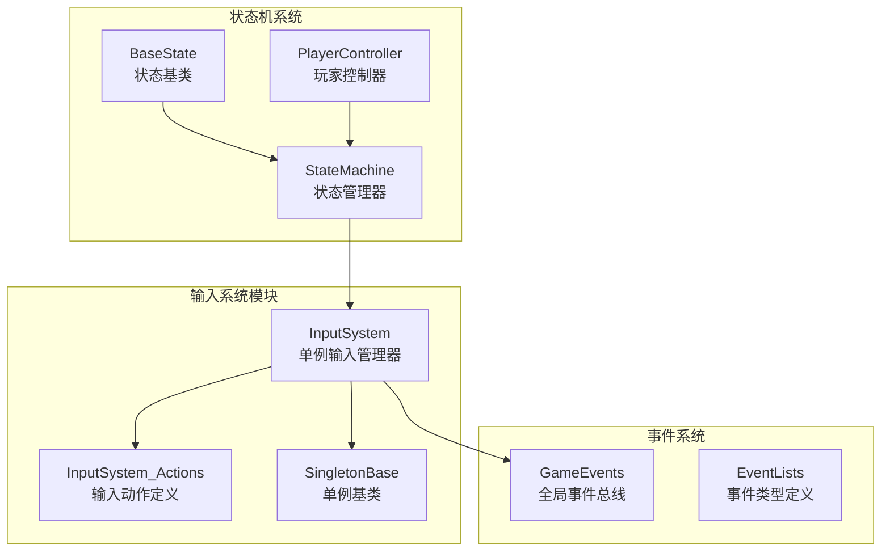
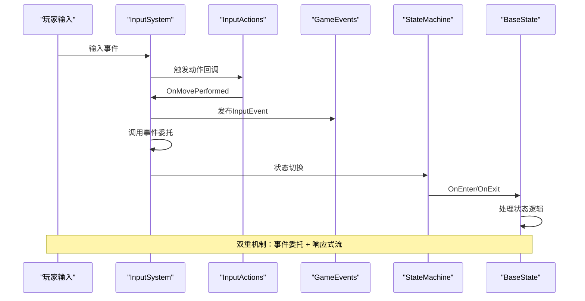
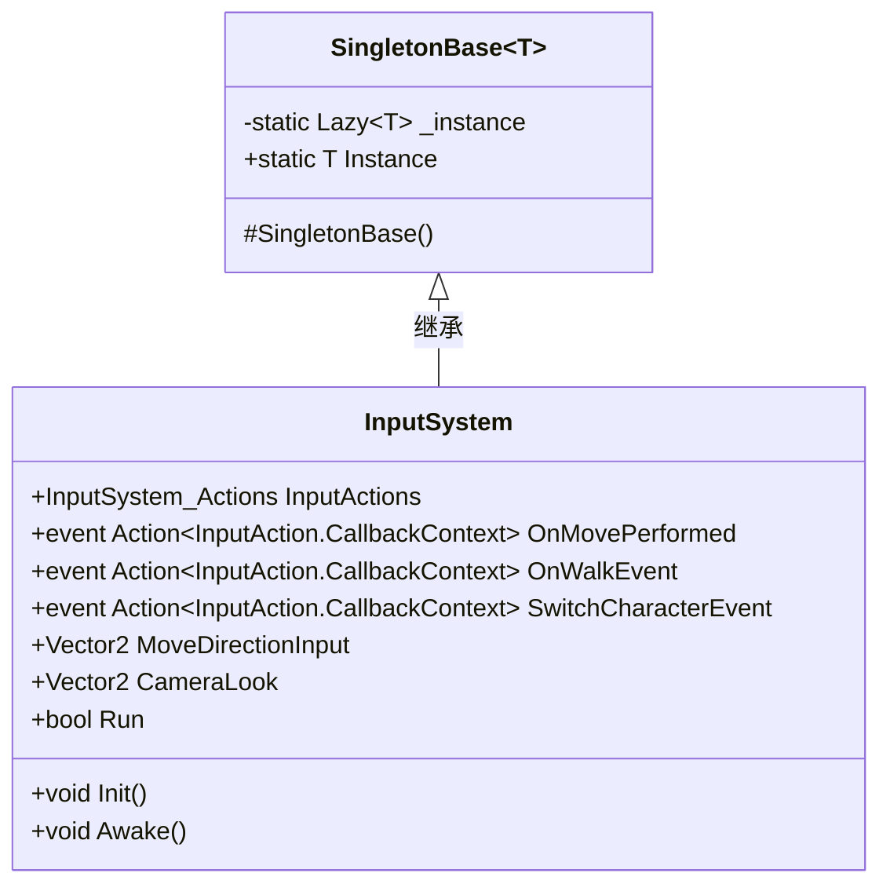
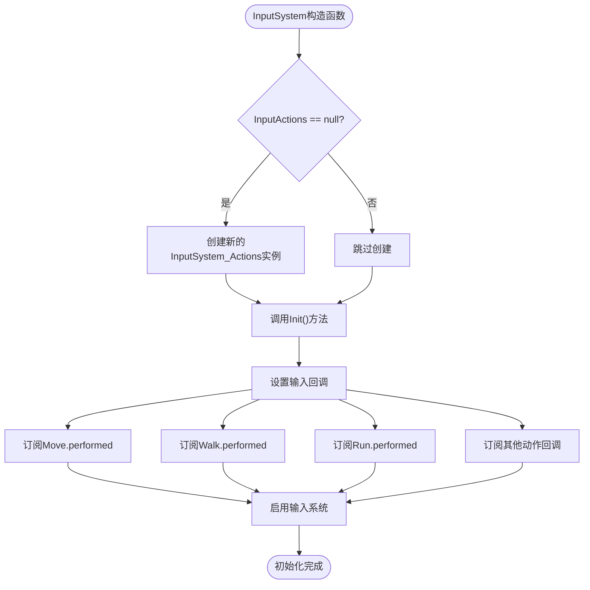
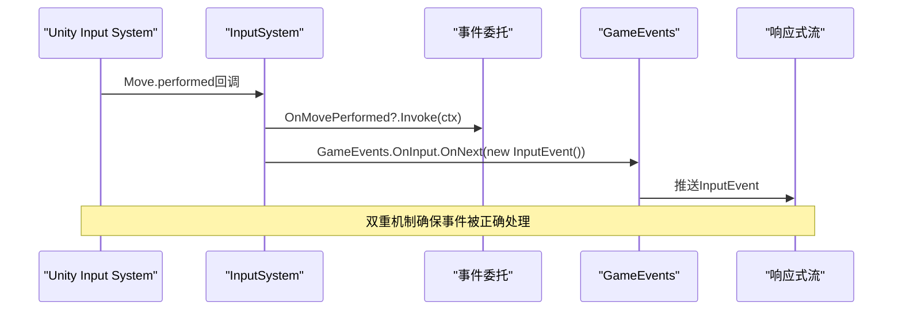
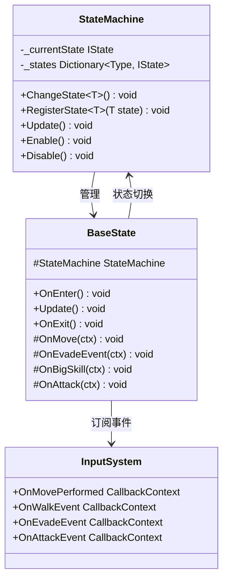
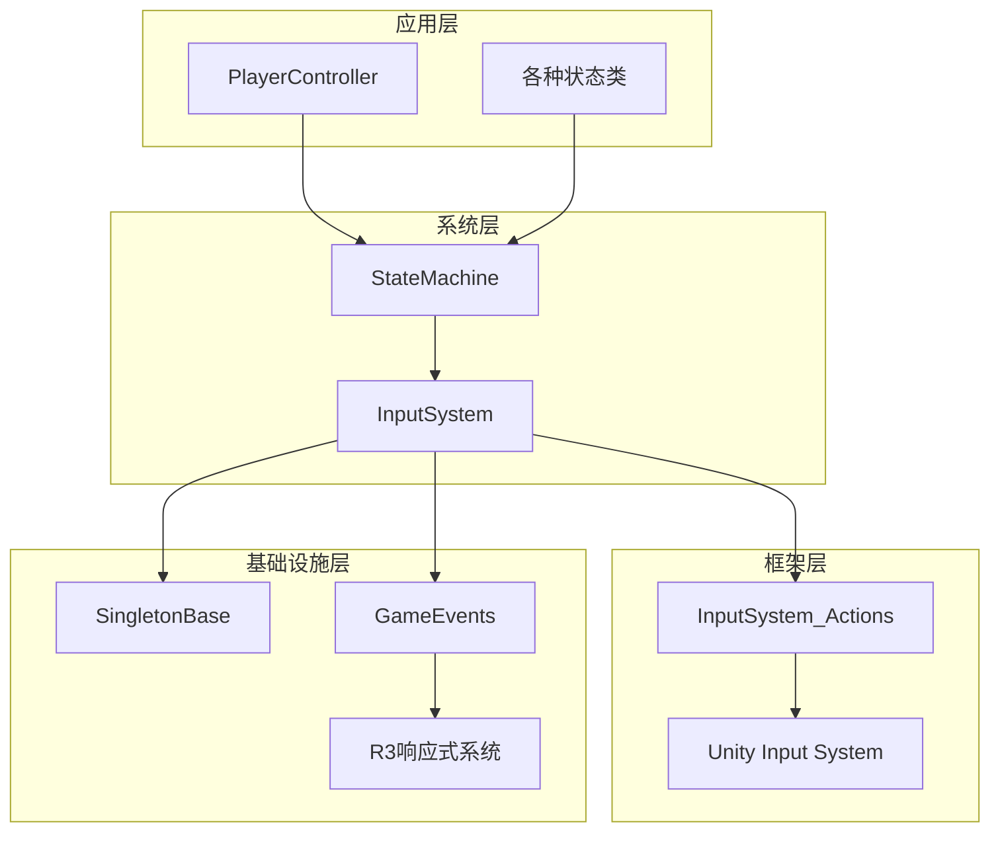

# 输入系统核心

<cite>
**本文档中引用的文件**
- [InputSystem.cs](file://Assets/Scripts/Manager/InputSystem/InputSystem.cs)
- [Singleton.cs](file://Assets/Scripts/Tool/Singleton.cs)
- [InputSystem_Actions.cs](file://Assets/InputSystem_Actions.cs)
- [GameEvents.cs](file://Assets/Scripts/Manager/EventSystem/GameEvents.cs)
- [PlayerEvents.cs](file://Assets/Scripts/EventData/PlayerEvents.cs)
- [StateMachine.cs](file://Assets/Scripts/Controller/FSM/StateMachine.cs)
- [BaseState.cs](file://Assets/Scripts/Controller/FSM/BaseState.cs)
- [PlayerController.cs](file://Assets/Scripts/Controller/PlayerController.cs)
- [EventLists.cs](file://Assets/Scripts/Manager/EventSystem/EventLists.cs)
</cite>

## 目录
1. [简介](#简介)
2. [项目结构](#项目结构)
3. [核心组件](#核心组件)
4. [架构概览](#架构概览)
5. [详细组件分析](#详细组件分析)
6. [依赖关系分析](#依赖关系分析)
7. [性能考虑](#性能考虑)
8. [故障排除指南](#故障排除指南)
9. [结论](#结论)

## 简介

输入系统是游戏的核心基础设施，负责处理所有用户输入并将其转换为游戏行为。本文档详细介绍了InputSystem单例类的架构和实现，包括其继承自SingletonBase的单例模式实现、InputActions字段的初始化流程、事件回调机制以及与游戏其他核心系统的交互模式。

该输入系统采用Unity Input System框架，结合响应式编程模式，提供了高效、可扩展的输入处理解决方案。系统支持多种输入设备（键盘、鼠标、手柄），并为不同的游戏状态提供了灵活的状态管理机制。

## 项目结构

输入系统的核心文件组织如下：

**图表来源**
- [InputSystem.cs](file://Assets/Scripts/Manager/InputSystem/InputSystem.cs#L1-L94)
- [Singleton.cs](file://Assets/Scripts/Tool/Singleton.cs#L1-L24)
- [InputSystem_Actions.cs](file://Assets/InputSystem_Actions.cs#L1-L100)

**章节来源**
- [InputSystem.cs](file://Assets/Scripts/Manager/InputSystem/InputSystem.cs#L1-L94)
- [Singleton.cs](file://Assets/Scripts/Tool/Singleton.cs#L1-L24)

## 核心组件

### InputSystem 单例类

InputSystem是整个输入系统的核心管理器，继承自SingletonBase基类，确保在整个应用程序生命周期中只有一个实例存在。

#### 主要特性：
- **单例模式实现**：使用Lazy<T>实现线程安全的延迟初始化
- **InputActions集成**：管理InputSystem_Actions实例的生命周期
- **事件回调系统**：定义和管理各种输入事件回调
- **响应式集成**：与GameEvents响应式流深度集成

#### 关键字段和属性：
- `InputActions`：InputSystem_Actions实例，包含所有输入动作定义
- 各种事件委托：如`OnMovePerformed`、`OnWalkEvent`、`SwitchCharacterEvent`等
- 只读属性：如`MoveDirectionInput`、`CameraLook`、`Run`等

### InputActions 动作系统

InputSystem_Actions类提供了对Unity Input System动作的封装和管理，包含Player和UI两个主要的动作映射。

#### Player动作映射：
- **移动相关**：Move、Look
- **行动相关**：Attack、Interact、Crouch
- **切换相关**：Previous、Next
- **能力相关**：Sprint、Walk、Run、Skill、BigSkill
- **特殊操作**：Space（角色切换）

#### UI动作映射：
- **导航**：Navigate
- **交互**：Submit、Cancel
- **指针**：Point、Click、RightClick、MiddleClick
- **滚动**：ScrollWheel
- **追踪设备**：TrackedDevicePosition、TrackedDeviceOrientation

**章节来源**
- [InputSystem.cs](file://Assets/Scripts/Manager/InputSystem/InputSystem.cs#L4-L94)
- [InputSystem_Actions.cs](file://Assets/InputSystem_Actions.cs#L1302-L1456)

## 架构概览

输入系统采用分层架构设计，从底层的Unity Input System到高层的游戏逻辑处理：

**图表来源**
- [InputSystem.cs](file://Assets/Scripts/Manager/InputSystem/InputSystem.cs#L58-L70)
- [GameEvents.cs](file://Assets/Scripts/Manager/EventSystem/GameEvents.cs#L18-L20)
- [StateMachine.cs](file://Assets/Scripts/Controller/FSM/StateMachine.cs#L40-L55)

## 详细组件分析

### 单例模式实现

InputSystem继承自SingletonBase基类，实现了线程安全的单例模式：

**图表来源**
- [Singleton.cs](file://Assets/Scripts/Tool/Singleton.cs#L7-L23)
- [InputSystem.cs](file://Assets/Scripts/Manager/InputSystem/InputSystem.cs#L4-L94)

#### 单例实现特点：
- **线程安全**：使用Lazy<T>的LazyThreadSafetyMode.ExecutionAndPublication模式
- **延迟初始化**：实例在首次访问时创建
- **构造函数保护**：防止外部直接实例化
- **反射支持**：通过Activator.CreateInstance支持私有构造函数

### InputActions初始化流程

InputActions的初始化遵循严格的生命周期管理：

**图表来源**
- [InputSystem.cs](file://Assets/Scripts/Manager/InputSystem/InputSystem.cs#L6-L12)
- [InputSystem.cs](file://Assets/Scripts/Manager/InputSystem/InputSystem.cs#L58-L70)

#### 初始化关键步骤：
1. **实例检查**：确保InputActions未被重复创建
2. **回调注册**：将Unity Input System回调与内部事件绑定
3. **双重触发机制**：每个输入动作都触发事件委托和GameEvents响应式流
4. **输入启用**：激活输入系统以接收用户输入

### 事件回调机制

InputSystem定义了丰富的事件回调系统，支持多种游戏行为：

#### 核心事件类型：

| 事件名称 | 触发条件 | 用途 |
|---------|---------|------|
| OnMovePerformed | 移动动作执行时 | 角色移动控制 |
| OnMoveCanceled | 移动动作取消时 | 停止移动状态 |
| OnWalkEvent | 行走动作执行时 | 切换到步行状态 |
| OnEvadeEvent | 冲刺/奔跑动作执行时 | 切换到冲刺状态 |
| SwitchCharacterEvent | 角色切换动作执行时 | 角色切换逻辑 |
| OnAttackEvent | 攻击动作执行时 | 攻击状态切换 |
| OnBigSkillEvent | 大技能动作执行时 | 大技能释放 |

#### 双重触发机制：

**图表来源**
- [InputSystem.cs](file://Assets/Scripts/Manager/InputSystem/InputSystem.cs#L58-L65)
- [GameEvents.cs](file://Assets/Scripts/Manager/EventSystem/GameEvents.cs#L18-L20)

### 只读属性封装

InputSystem提供了多个只读属性来封装InputActions的动作读取逻辑：

#### 移动相关属性：
- `MoveDirectionInput`：获取当前移动方向的Vector2值
- `CameraLook`：获取相机视角的方向向量
- `PlayerMove`：获取玩家移动输入的完整向量

#### 状态相关属性：
- `Run`：布尔值，表示跑步动作是否被触发
- `Crouch`：布尔值，表示蹲下动作的执行状态
- `Walk`：布尔值，表示步行动作的触发状态
- `Space`：布尔值，表示角色切换动作的触发状态

**章节来源**
- [InputSystem.cs](file://Assets/Scripts/Manager/InputSystem/InputSystem.cs#L72-L94)

### 与状态机系统的交互

InputSystem与StateMachine系统紧密协作，实现游戏状态的动态切换：

**图表来源**
- [StateMachine.cs](file://Assets/Scripts/Controller/FSM/StateMachine.cs#L6-L115)
- [BaseState.cs](file://Assets/Scripts/Controller/FSM/BaseState.cs#L5-L85)
- [InputSystem.cs](file://Assets/Scripts/Manager/InputSystem/InputSystem.cs#L25-L45)

#### 状态切换流程：
1. **事件订阅**：状态机在进入状态时订阅相应的输入事件
2. **事件触发**：玩家输入触发相应的事件回调
3. **状态切换**：事件处理器调用StateMachine.ChangeState方法
4. **清理资源**：状态机在退出状态时自动取消事件订阅

**章节来源**
- [StateMachine.cs](file://Assets/Scripts/Controller/FSM/StateMachine.cs#L40-L55)
- [BaseState.cs](file://Assets/Scripts/Controller/FSM/BaseState.cs#L7-L85)

## 依赖关系分析

输入系统的依赖关系体现了清晰的分层架构：

**图表来源**
- [InputSystem.cs](file://Assets/Scripts/Manager/InputSystem/InputSystem.cs#L1-L5)
- [StateMachine.cs](file://Assets/Scripts/Controller/FSM/StateMachine.cs#L1-L5)
- [GameEvents.cs](file://Assets/Scripts/Manager/EventSystem/GameEvents.cs#L1-L3)

### 关键依赖关系：

1. **InputSystem → InputSystem_Actions**：管理输入动作的生命周期
2. **InputSystem → GameEvents**：集成响应式事件系统
3. **StateMachine → InputSystem**：状态机依赖输入系统进行状态切换
4. **BaseState → StateMachine**：状态基类依赖状态机进行状态管理
5. **PlayerController → StateMachine**：玩家控制器管理整个状态机

**章节来源**
- [InputSystem.cs](file://Assets/Scripts/Manager/InputSystem/InputSystem.cs#L1-L94)
- [StateMachine.cs](file://Assets/Scripts/Controller/FSM/StateMachine.cs#L1-L115)

## 性能考虑

### 内存管理优化

1. **单例模式**：避免重复创建InputSystem实例，减少内存开销
2. **延迟初始化**：使用Lazy<T>确保对象仅在需要时创建
3. **事件订阅管理**：状态机自动管理事件订阅的生命周期
4. **对象池化**：GameEvents使用Subject作为事件流，支持高效的事件传播

### 性能监控点

1. **输入响应时间**：从输入检测到状态切换的延迟
2. **事件处理效率**：事件委托和响应式流的处理性能
3. **内存分配**：频繁输入操作时的对象分配情况
4. **CPU占用**：输入系统在主循环中的计算开销

### 最佳实践建议

1. **及时取消订阅**：状态机退出时自动取消事件订阅
2. **避免过度监听**：只订阅必要的输入事件
3. **批量处理**：将多个相关事件合并处理
4. **异步处理**：对于耗时的输入处理逻辑使用异步方式

## 故障排除指南

### 常见问题及解决方案

#### 输入无响应
**症状**：玩家输入无法触发任何游戏行为
**可能原因**：
- InputSystem未正确初始化
- InputActions未启用
- 事件订阅失败

**解决步骤**：
1. 检查InputSystem.Instance是否存在
2. 验证InputActions.Player.enabled为true
3. 确认事件订阅代码未被注释

#### 状态切换异常
**症状**：输入触发后状态未正确切换
**可能原因**：
- 状态机禁用
- 目标状态未注册
- 事件处理器逻辑错误

**解决步骤**：
1. 检查StateMachine.IsEnabled属性
2. 验证目标状态已通过RegisterState注册
3. 调试事件处理器中的状态切换逻辑

#### 性能问题
**症状**：游戏帧率下降，特别是在频繁输入时
**可能原因**：
- 过度的事件订阅
- 低效的事件处理逻辑
- 内存泄漏

**解决步骤**：
1. 检查事件订阅的数量和频率
2. 优化事件处理器中的计算逻辑
3. 使用Unity Profiler分析内存使用情况

**章节来源**
- [InputSystem.cs](file://Assets/Scripts/Manager/InputSystem/InputSystem.cs#L58-L70)
- [StateMachine.cs](file://Assets/Scripts/Controller/FSM/StateMachine.cs#L40-L55)

## 结论

InputSystem单例类作为游戏输入系统的核心，成功地将Unity Input System与游戏状态机系统无缝集成。通过采用单例模式、事件驱动架构和响应式编程模式，系统实现了高效、可维护的输入处理机制。

### 主要优势：

1. **架构清晰**：分层设计使得各组件职责明确，易于维护
2. **性能优异**：单例模式和延迟初始化减少了不必要的资源消耗
3. **扩展性强**：事件系统支持灵活的功能扩展
4. **状态管理完善**：与状态机系统的深度集成确保了流畅的游戏体验

### 技术亮点：

- **双重触发机制**：同时支持事件委托和响应式流，满足不同场景需求
- **自动资源管理**：状态机自动处理事件订阅的生命周期
- **多设备支持**：Unity Input System的跨平台特性
- **类型安全**：强类型的事件定义和参数传递

该输入系统为游戏开发提供了坚实的基础，能够支持复杂的交互需求和多样化的游戏玩法。通过合理的架构设计和最佳实践的应用，系统展现了优秀的可扩展性和维护性。