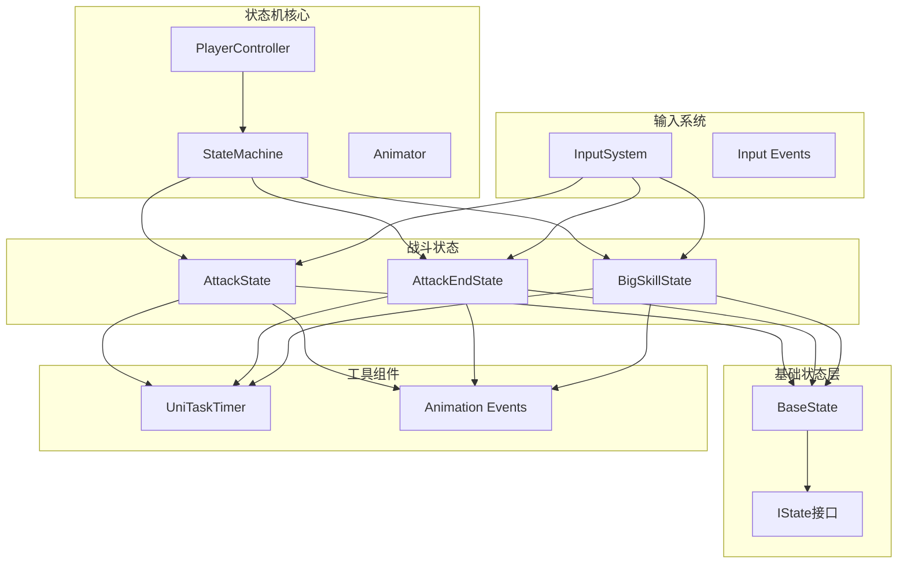
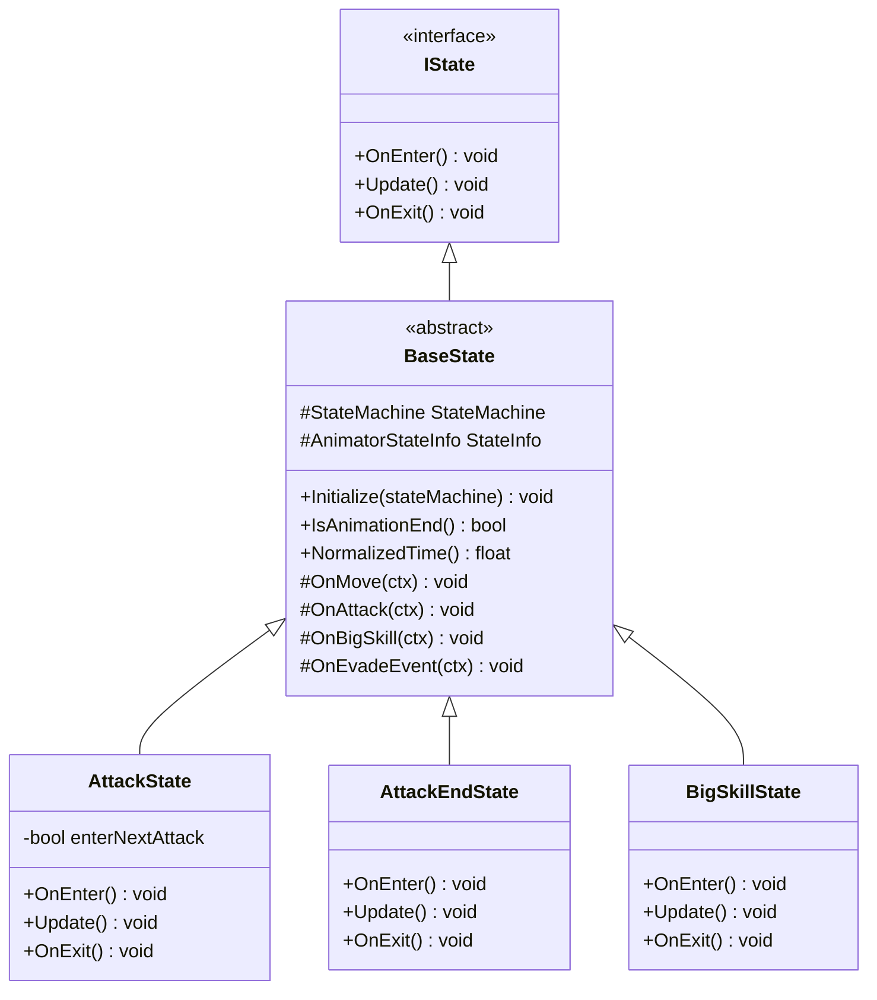
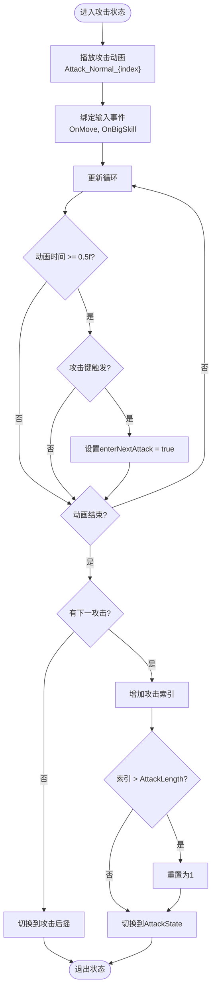
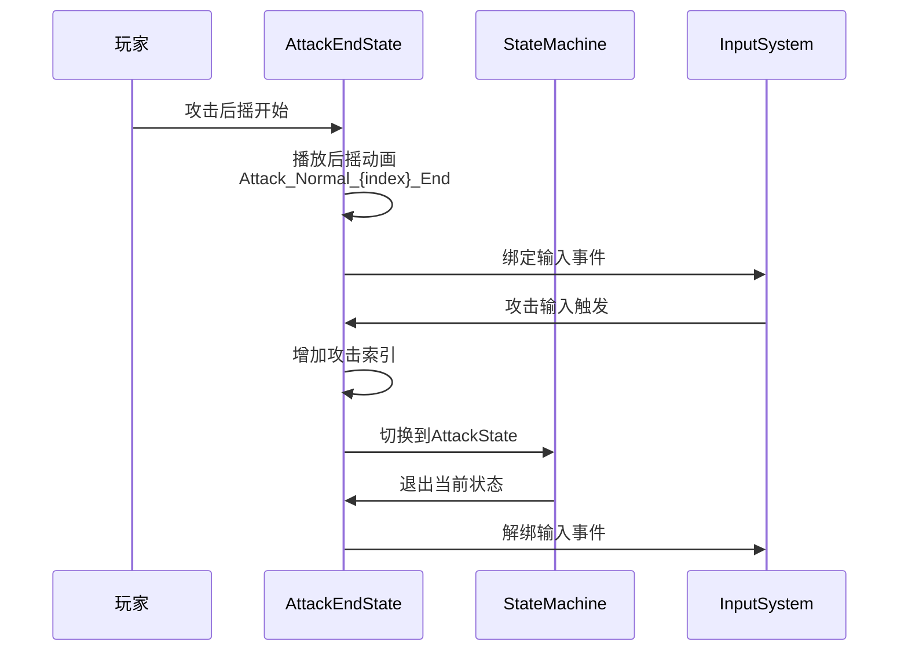
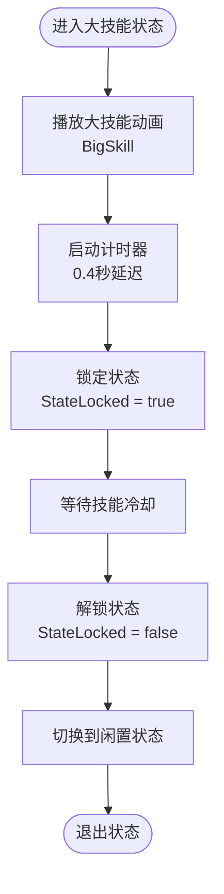
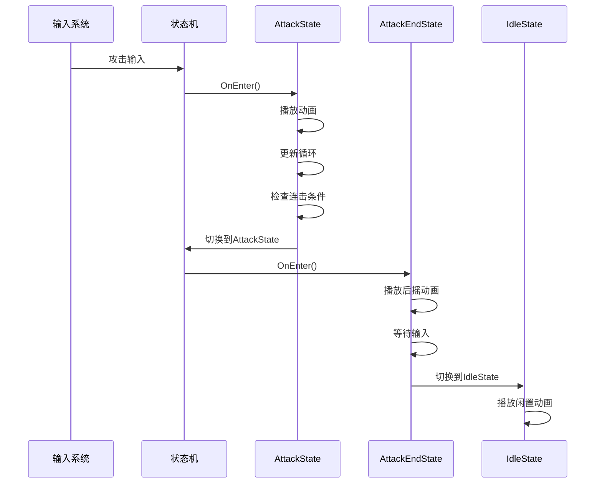
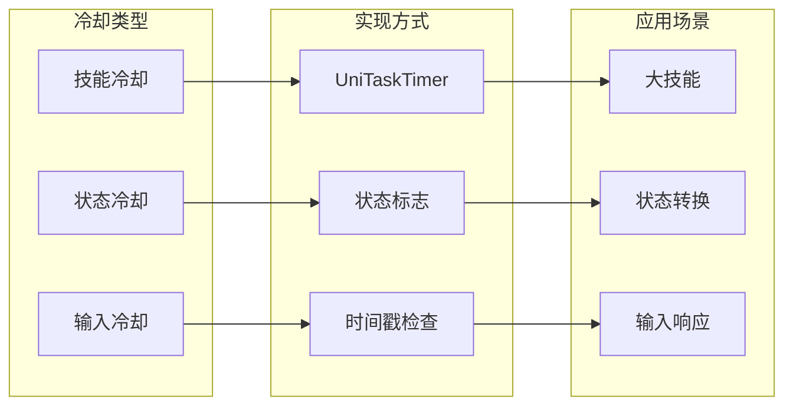
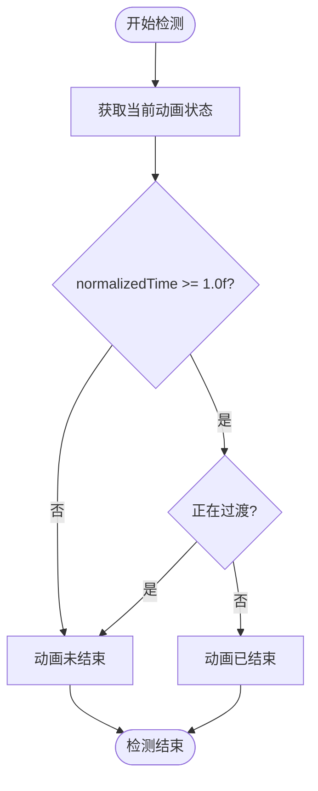

# 攻击与战斗状态系统

<cite>
**本文档中引用的文件**
- [AttackState.cs](file://Assets/Scripts/Controller/FSM/CharacterState/AttackState.cs)
- [AttackEndState.cs](file://Assets/Scripts/Controller/FSM/CharacterState/AttackEndState.cs)
- [BigSkillState.cs](file://Assets/Scripts/Controller/FSM/CharacterState/BigSkillState.cs)
- [BaseState.cs](file://Assets/Scripts/Controller/FSM/BaseState.cs)
- [IState.cs](file://Assets/Scripts/Controller/FSM/IState.cs)
- [StateMachine.cs](file://Assets/Scripts/Controller/FSM/StateMachine.cs)
- [PlayerController.cs](file://Assets/Scripts/Controller/PlayerController.cs)
- [InputSystem.cs](file://Assets/Scripts/Manager/InputSystem/InputSystem.cs)
- [UniTaskTimer.cs](file://Assets/Scripts/Tool/UniTaskTimer.cs)
</cite>

## 目录
1. [简介](#简介)
2. [系统架构概览](#系统架构概览)
3. [核心状态组件](#核心状态组件)
4. [攻击状态系统详解](#攻击状态系统详解)
5. [大技能状态系统](#大技能状态系统)
6. [状态转换机制](#状态转换机制)
7. [输入缓冲与冷却机制](#输入缓冲与冷却机制)
8. [动画事件绑定](#动画事件绑定)
9. [扩展开发指南](#扩展开发指南)
10. [故障排除](#故障排除)

## 简介

本系统是一个基于有限状态机（FSM）的角色攻击与战斗状态管理系统，专为动作游戏设计。该系统提供了完整的连击逻辑处理、动画事件绑定、输入缓冲管理和技能冷却机制，支持复杂的战斗交互和流畅的动作表现。

系统采用模块化设计，通过状态机模式实现了清晰的状态分离，每个状态负责特定的战斗行为，确保代码的可维护性和扩展性。

## 系统架构概览



**图表来源**
- [StateMachine.cs](file://Assets/Scripts/Controller/FSM/StateMachine.cs#L1-L115)
- [PlayerController.cs](file://Assets/Scripts/Controller/PlayerController.cs#L1-L103)
- [BaseState.cs](file://Assets/Scripts/Controller/FSM/BaseState.cs#L1-L85)

**章节来源**
- [StateMachine.cs](file://Assets/Scripts/Controller/FSM/StateMachine.cs#L1-L115)
- [PlayerController.cs](file://Assets/Scripts/Controller/PlayerController.cs#L1-L103)

## 核心状态组件

### 状态接口体系

系统采用分层的状态接口设计，确保类型安全和功能一致性：



**图表来源**
- [IState.cs](file://Assets/Scripts/Controller/FSM/IState.cs#L1-L6)
- [BaseState.cs](file://Assets/Scripts/Controller/FSM/BaseState.cs#L1-L85)
- [AttackState.cs](file://Assets/Scripts/Controller/FSM/CharacterState/AttackState.cs#L1-L61)
- [AttackEndState.cs](file://Assets/Scripts/Controller/FSM/CharacterState/AttackEndState.cs#L1-L44)
- [BigSkillState.cs](file://Assets/Scripts/Controller/FSM/CharacterState/BigSkillState.cs#L1-L22)

### 状态机管理器

状态机负责协调所有状态的生命周期和状态转换：

| 属性/方法 | 类型 | 描述 | 默认值 |
|-----------|------|------|--------|
| StateLocked | bool | 状态锁定标志，防止状态转换 | false |
| currentNormalAttackIndex | int | 当前普通攻击索引 | 1 |
| _isEnabled | bool | 状态机启用状态 | true |
| _currentState | IState | 当前活动状态 | null |
| _states | Dictionary<Type, IState> | 注册的状态集合 | 空字典 |

**章节来源**
- [StateMachine.cs](file://Assets/Scripts/Controller/FSM/StateMachine.cs#L8-L18)
- [BaseState.cs](file://Assets/Scripts/Controller/FSM/BaseState.cs#L6-L10)

## 攻击状态系统详解

### AttackState：连击逻辑处理器

AttackState是系统的核心战斗状态，负责处理连击逻辑、输入缓冲和状态转换。

#### 连击逻辑实现



**图表来源**
- [AttackState.cs](file://Assets/Scripts/Controller/FSM/CharacterState/AttackState.cs#L15-L50)

#### 关键特性

1. **输入缓冲机制**：在动画播放到50%时捕获攻击输入
2. **连击索引管理**：动态管理当前攻击段数
3. **边界检查**：确保攻击索引不会超出范围
4. **事件绑定**：实时响应移动和大技能输入

### AttackEndState：攻击收尾状态

AttackEndState专门处理攻击后的后摇阶段，提供连击延续的可能性。

#### 后摇处理逻辑



**图表来源**
- [AttackEndState.cs](file://Assets/Scripts/Controller/FSM/CharacterState/AttackEndState.cs#L5-L25)

**章节来源**
- [AttackState.cs](file://Assets/Scripts/Controller/FSM/CharacterState/AttackState.cs#L1-L61)
- [AttackEndState.cs](file://Assets/Scripts/Controller/FSM/CharacterState/AttackEndState.cs#L1-L44)

## 大技能状态系统

### BigSkillState：特殊技能管理

BigSkillState管理角色的大招技能，具有独特的冷却和状态锁定机制。

#### 技能执行流程



**图表来源**
- [BigSkillState.cs](file://Assets/Scripts/Controller/FSM/CharacterState/BigSkillState.cs#L3-L15)

#### 冷却机制特点

1. **精确计时**：使用UniTaskTimer实现毫秒级精度
2. **状态锁定**：在技能执行期间阻止其他状态转换
3. **自动恢复**：技能结束后自动解锁状态机
4. **时间源选择**：支持缩放时间和非缩放时间

**章节来源**
- [BigSkillState.cs](file://Assets/Scripts/Controller/FSM/CharacterState/BigSkillState.cs#L1-L22)
- [UniTaskTimer.cs](file://Assets/Scripts/Tool/UniTaskTimer.cs#L1-L188)

## 状态转换机制

### 转换规则矩阵

| 当前状态 | 触发条件 | 目标状态 | 转换原因 |
|----------|----------|----------|----------|
| Idle | 攻击输入 | AttackState | 开始战斗 |
| Walk | 攻击输入 | AttackState | 移动中攻击 |
| Run | 攻击输入 | AttackState | 跑步中攻击 |
| AttackState | 动画播放到50%+攻击输入 | AttackState | 连击继续 |
| AttackState | 动画结束且无连击 | AttackEndState | 攻击完成 |
| AttackEndState | 攻击输入 | AttackState | 连击延续 |
| AttackEndState | 动画结束 | IdleState | 攻击完成 |
| BigSkillState | 技能冷却完成 | IdleState | 技能结束 |

### 状态转换序列图



**图表来源**
- [StateMachine.cs](file://Assets/Scripts/Controller/FSM/StateMachine.cs#L40-L55)
- [AttackState.cs](file://Assets/Scripts/Controller/FSM/CharacterState/AttackState.cs#L15-L50)
- [AttackEndState.cs](file://Assets/Scripts/Controller/FSM/CharacterState/AttackEndState.cs#L5-L25)

**章节来源**
- [StateMachine.cs](file://Assets/Scripts/Controller/FSM/StateMachine.cs#L40-L55)
- [BaseState.cs](file://Assets/Scripts/Controller/FSM/BaseState.cs#L55-L85)

## 输入缓冲与冷却机制

### 输入缓冲系统

系统实现了多层次的输入缓冲机制：

1. **时间窗口缓冲**：在动画播放到50%时捕获攻击输入
2. **状态优先级**：高优先级输入（如大技能）可以打断当前状态
3. **防抖处理**：避免快速连续输入导致的状态混乱

### 冷却系统架构



**图表来源**
- [UniTaskTimer.cs](file://Assets/Scripts/Tool/UniTaskTimer.cs#L1-L188)
- [BigSkillState.cs](file://Assets/Scripts/Controller/FSM/CharacterState/BigSkillState.cs#L8-L13)

**章节来源**
- [AttackState.cs](file://Assets/Scripts/Controller/FSM/CharacterState/AttackState.cs#L22-L25)
- [BigSkillState.cs](file://Assets/Scripts/Controller/FSM/CharacterState/BigSkillState.cs#L8-L13)
- [UniTaskTimer.cs](file://Assets/Scripts/Tool/UniTaskTimer.cs#L88-L141)

## 动画事件绑定

### 动画状态监控

系统通过精确的动画状态监控确保战斗动作的准确性：

#### 动画结束检测算法



**图表来源**
- [BaseState.cs](file://Assets/Scripts/Controller/FSM/BaseState.cs#L25-L32)

### 动画事件处理流程

| 动画阶段 | 事件类型 | 处理时机 | 应用场景 |
|----------|----------|----------|----------|
| 攻击动画 | 击中检测 | 动画关键帧 | 伤害计算 |
| 攻击动画 | 特效触发 | 动画关键帧 | 视觉效果 |
| 后摇动画 | 连击准备 | 动画播放中期 | 连击输入捕获 |
| 技能动画 | 效果施放 | 动画播放后期 | 技能效果激活 |

**章节来源**
- [BaseState.cs](file://Assets/Scripts/Controller/FSM/BaseState.cs#L25-L40)
- [AttackState.cs](file://Assets/Scripts/Controller/FSM/CharacterState/AttackState.cs#L22-L25)

## 扩展开发指南

### 添加新的连击组合

要扩展连击组合，需要修改以下组件：

#### 步骤1：修改PlayerController配置

```csharp
// 在PlayerController.Awake()中
_playerController.AttackLength = 6; // 增加攻击段数
```

#### 步骤2：创建对应的动画序列

命名规范：`Attack_Normal_{index}` 和 `Attack_Normal_{index}_End`

#### 步骤3：测试连击逻辑

验证连击索引的边界条件和状态转换。

### 添加新技能状态

#### 实现自定义技能状态

```csharp
public class CustomSkillState : BaseState
{
    public override void OnEnter()
    {
        base.OnEnter();
        StateMachine._animator.Play("CustomSkill");
        
        // 自定义冷却时间
        UniTaskTimer.StartTimer(
            UniTaskTimer.Mode.Once, 
            2.0f, // 冷却时间
            UniTaskTimer.TimeSource.Scaled,
            () => {
                StateMachine.StateLocked = false;
                StateMachine.ChangeState<IdleState>();
            }
        );
    }
}
```

#### 注册新状态

```csharp
// 在PlayerController.Awake()中
_stateMachine.RegisterState(new CustomSkillState());
```

### 性能优化建议

1. **状态缓存**：避免频繁的状态查找
2. **事件解绑**：及时清理不需要的事件监听器
3. **动画预加载**：提前加载常用动画片段
4. **内存池化**：对临时对象使用对象池

**章节来源**
- [PlayerController.cs](file://Assets/Scripts/Controller/PlayerController.cs#L30-L50)
- [StateMachine.cs](file://Assets/Scripts/Controller/FSM/StateMachine.cs#L30-L45)

## 故障排除

### 常见问题及解决方案

#### 问题1：攻击连击不流畅

**症状**：连击过程中出现卡顿或跳帧

**解决方案**：
- 检查动画播放速度设置
- 验证输入缓冲时间窗口
- 确认状态转换时机

#### 问题2：大技能冷却异常

**症状**：技能冷却时间不准确或无法正常冷却

**解决方案**：
- 检查UniTaskTimer配置
- 验证状态锁定标志
- 确认动画播放时长

#### 问题3：状态转换冲突

**症状**：多个状态同时尝试转换

**解决方案**：
- 检查StateLocked标志
- 验证状态转换条件
- 确认事件处理优先级

### 调试工具

系统提供了完善的调试支持：

```csharp
// 启用调试日志
DebugX.Instance.Log("状态转换: {from} -> {to}");

// 动画状态监控
float normalizedTime = NormalizedTime();
bool isAnimationEnd = IsAnimationEnd();
```

**章节来源**
- [BaseState.cs](file://Assets/Scripts/Controller/FSM/BaseState.cs#L25-L40)
- [AttackState.cs](file://Assets/Scripts/Controller/FSM/CharacterState/AttackState.cs#L16-L17)

## 结论

本攻击与战斗状态系统通过精心设计的有限状态机架构，实现了复杂而流畅的战斗交互。系统的核心优势包括：

1. **模块化设计**：清晰的状态分离便于维护和扩展
2. **精确控制**：毫秒级的时间控制确保动作的准确性
3. **灵活扩展**：标准化的接口支持快速添加新功能
4. **性能优化**：高效的事件处理和状态管理

该系统为动作游戏开发提供了坚实的基础，开发者可以通过遵循本文档的指导原则，轻松扩展和定制战斗系统以满足项目需求。