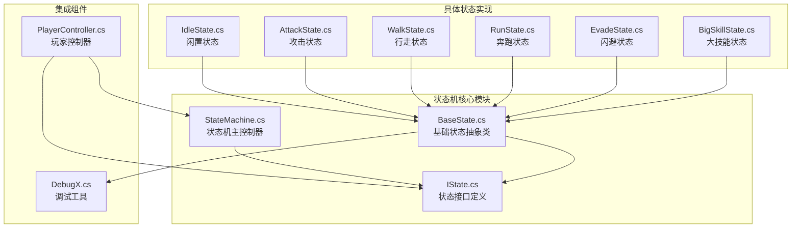
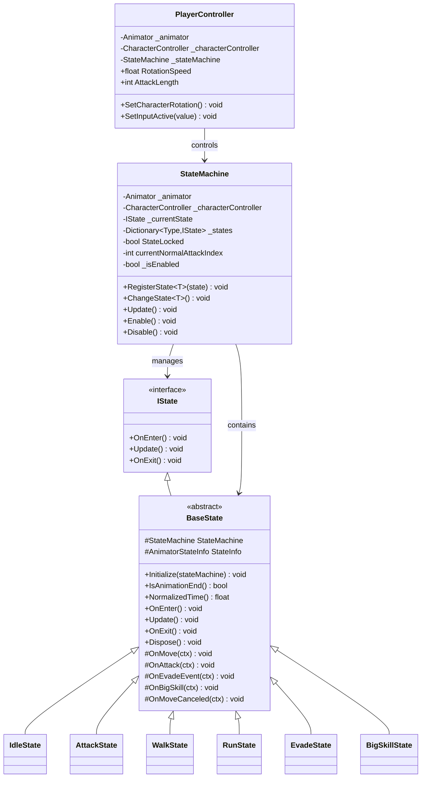
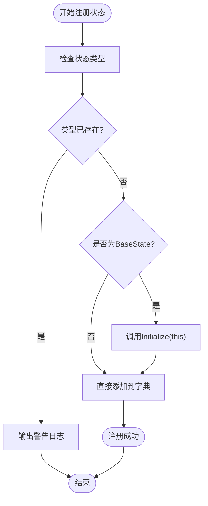
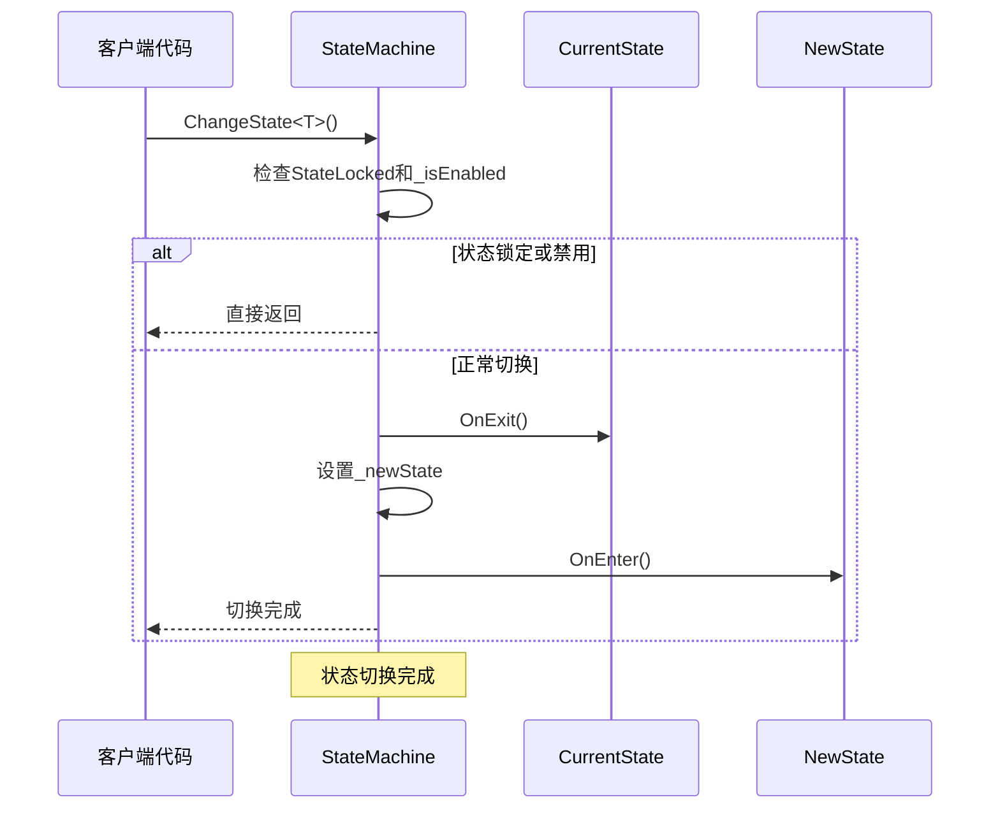
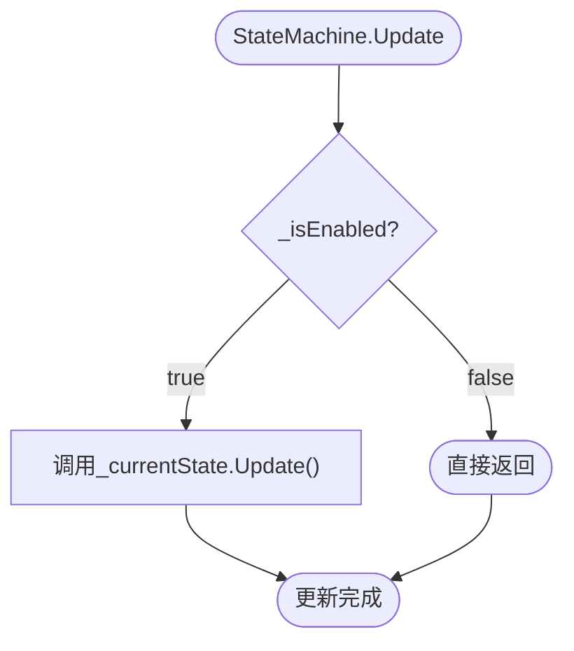
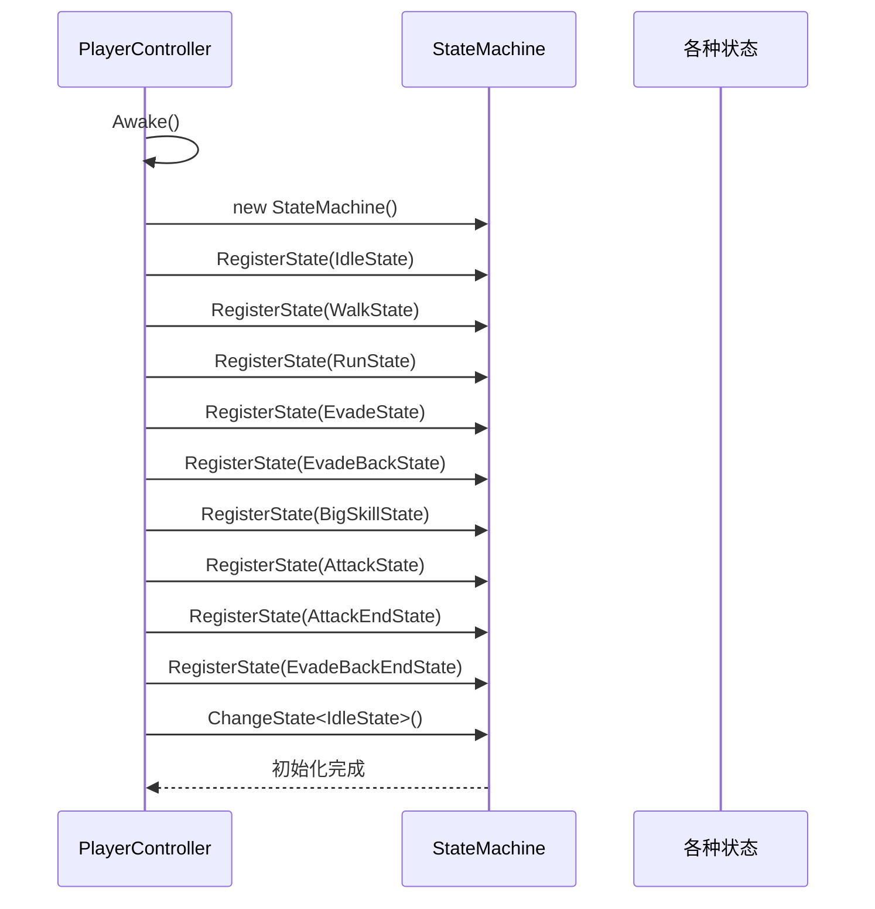
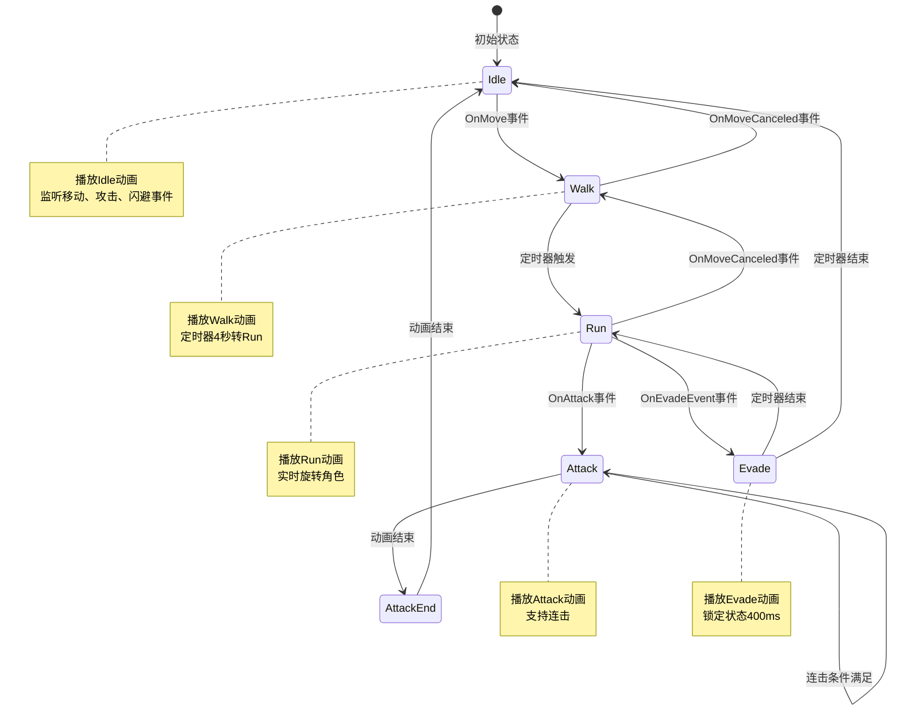
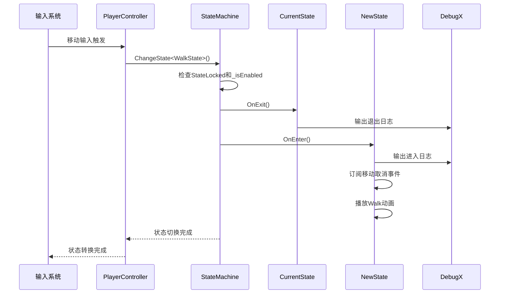
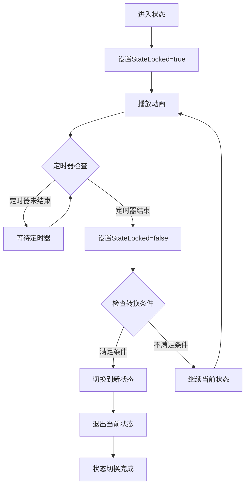

# 状态机核心架构文档

<cite>
**本文档中引用的文件**
- [StateMachine.cs](file://Assets/Scripts/Controller/FSM/StateMachine.cs)
- [IState.cs](file://Assets/Scripts/Controller/FSM/IState.cs)
- [BaseState.cs](file://Assets/Scripts/Controller/FSM/BaseState.cs)
- [PlayerController.cs](file://Assets/Scripts/Controller/PlayerController.cs)
- [IdleState.cs](file://Assets/Scripts/Controller/FSM/CharacterState/IdleState.cs)
- [AttackState.cs](file://Assets/Scripts/Controller/FSM/CharacterState/AttackState.cs)
- [WalkState.cs](file://Assets/Scripts/Controller/FSM/CharacterState/WalkState.cs)
- [RunState.cs](file://Assets/Scripts/Controller/FSM/CharacterState/RunState.cs)
- [EvadeState.cs](file://Assets/Scripts/Controller/FSM/CharacterState/EvadeState.cs)
- [BigSkillState.cs](file://Assets/Scripts/Controller/FSM/CharacterState/BigSkillState.cs)
- [DebugX.cs](file://Assets/Scripts/Tool/DebugX.cs)
</cite>

## 目录
1. [简介](#简介)
2. [项目结构](#项目结构)
3. [核心组件](#核心组件)
4. [架构概览](#架构概览)
5. [详细组件分析](#详细组件分析)
6. [状态机工作流程](#状态机工作流程)
7. [性能优化建议](#性能优化建议)
8. [常见陷阱与解决方案](#常见陷阱与解决方案)
9. [总结](#总结)

## 简介

本状态机核心架构是一个专为Unity游戏设计的高性能状态管理系统，采用面向对象的设计模式，提供了灵活且可扩展的角色状态控制机制。该架构通过清晰的接口分离和抽象基类设计，实现了状态行为的标准化和统一管理。

## 项目结构

状态机相关文件组织在`Assets/Scripts/Controller/FSM/`目录下，包含以下核心组件：



**图表来源**
- [StateMachine.cs](file://Assets/Scripts/Controller/FSM/StateMachine.cs#L1-L115)
- [IState.cs](file://Assets/Scripts/Controller/FSM/IState.cs#L1-L6)
- [BaseState.cs](file://Assets/Scripts/Controller/FSM/BaseState.cs#L1-L85)
- [PlayerController.cs](file://Assets/Scripts/Controller/PlayerController.cs#L1-L94)

**章节来源**
- [StateMachine.cs](file://Assets/Scripts/Controller/FSM/StateMachine.cs#L1-L115)
- [PlayerController.cs](file://Assets/Scripts/Controller/PlayerController.cs#L1-L94)

## 核心组件

### StateMachine类 - 状态机主控制器

StateMachine类是整个状态机的核心控制器，负责状态的注册、切换和生命周期管理。

#### 主要属性和功能

| 属性名称 | 类型 | 描述 |
|---------|------|------|
| `_animator` | Animator | Unity动画控制器引用 |
| `_characterController` | CharacterController | 角色控制器引用 |
| `_currentState` | IState | 当前激活的状态实例 |
| `_states` | Dictionary<Type, IState> | 已注册状态的字典容器 |
| `StateLocked` | bool | 状态锁定标志，防止意外状态切换 |
| `currentNormalAttackIndex` | int | 当前普通攻击索引，用于连击计数 |
| `_isEnabled` | bool | 状态机启用状态标志 |

#### 核心方法

| 方法名称 | 参数 | 返回类型 | 功能描述 |
|---------|------|----------|----------|
| `RegisterState<T>` | T state | void | 注册新状态到状态机 |
| `ChangeState<T>` | 无 | void | 切换到指定类型的状态 |
| `Update` | 无 | void | 更新当前状态逻辑 |
| `Enable` | 无 | void | 启用状态机及其输入处理 |
| `Disable` | 无 | void | 禁用状态机并屏蔽输入 |

### IState接口 - 状态行为契约

IState接口定义了所有状态必须实现的基本行为契约，确保状态的一致性和可预测性。

#### 接口方法

| 方法名称 | 参数 | 返回类型 | 调用时机 | 功能描述 |
|---------|------|----------|----------|----------|
| `OnEnter` | 无 | void | 状态切换时 | 初始化状态，设置初始条件 |
| `Update` | 无 | void | 每帧调用 | 更新状态逻辑和行为 |
| `OnExit` | 无 | void | 状态离开时 | 清理资源，重置状态 |

### BaseState抽象类 - 公共功能提供者

BaseState类作为所有具体状态的基类，提供了通用的功能和便利方法。

#### 核心功能特性

| 功能类别 | 方法名称 | 功能描述 |
|---------|----------|----------|
| 动画时间检查 | `IsAnimationEnd()` | 检查动画是否播放完成 |
| 动画时间检查 | `NormalizedTime()` | 获取动画的归一化时间 |
| 事件订阅管理 | 内置事件处理方法 | 自动处理移动、攻击、闪避等事件 |
| 状态锁定机制 | `StateLocked`标志 | 防止状态意外切换 |

**章节来源**
- [StateMachine.cs](file://Assets/Scripts/Controller/FSM/StateMachine.cs#L6-L115)
- [IState.cs](file://Assets/Scripts/Controller/FSM/IState.cs#L1-L6)
- [BaseState.cs](file://Assets/Scripts/Controller/FSM/BaseState.cs#L1-L85)

## 架构概览

状态机架构采用分层设计，从底层的接口定义到高层的控制器管理，形成了清晰的职责分离。



**图表来源**
- [IState.cs](file://Assets/Scripts/Controller/FSM/IState.cs#L1-L6)
- [BaseState.cs](file://Assets/Scripts/Controller/FSM/BaseState.cs#L1-L85)
- [StateMachine.cs](file://Assets/Scripts/Controller/FSM/StateMachine.cs#L6-L115)
- [PlayerController.cs](file://Assets/Scripts/Controller/PlayerController.cs#L4-L94)

## 详细组件分析

### StateMachine状态机控制器

StateMachine类是状态机架构的核心，负责协调所有状态的生命周期和交互。

#### 状态注册机制

状态注册过程确保每个状态类型只被注册一次，并自动初始化BaseState类型的实例：



**图表来源**
- [StateMachine.cs](file://Assets/Scripts/Controller/FSM/StateMachine.cs#L25-L40)

#### 状态切换逻辑

状态切换遵循严格的生命周期管理，确保状态间的平滑过渡：



**图表来源**
- [StateMachine.cs](file://Assets/Scripts/Controller/FSM/StateMachine.cs#L43-L58)

#### 更新循环机制

状态机的更新循环简单而高效，仅在启用状态下调用当前状态的Update方法：



**图表来源**
- [StateMachine.cs](file://Assets/Scripts/Controller/FSM/StateMachine.cs#L60-L65)

### BaseState抽象类功能详解

BaseState类提供了状态开发的基础框架和常用功能。

#### 动画时间检查功能

BaseState提供了两个关键的动画时间检查方法：

| 方法名称 | 功能描述 | 使用场景 |
|---------|----------|----------|
| `IsAnimationEnd()` | 检查动画是否播放完成 | 动画驱动的状态转换 |
| `NormalizedTime()` | 获取动画的归一化时间 | 动画进度监控和条件判断 |

#### 事件订阅管理

BaseState内置了多种常用的输入事件处理方法，简化了状态间的事件响应：

| 事件方法 | 触发条件 | 状态转换目标 |
|---------|----------|-------------|
| `OnMove` | 移动输入开始 | WalkState |
| `OnAttack` | 攻击输入触发 | AttackState |
| `OnEvadeEvent` | 闪避输入触发 | EvadeState |
| `OnBigSkill` | 大技能输入触发 | BigSkillState |
| `OnMoveCanceled` | 移动输入取消 | IdleState |

### PlayerController集成

PlayerController作为状态机的外部控制器，负责初始化状态机并管理整体的游戏逻辑。

#### 状态初始化流程

PlayerController在Awake阶段完成状态机的完整初始化：



**图表来源**
- [PlayerController.cs](file://Assets/Scripts/Controller/PlayerController.cs#L25-L40)

**章节来源**
- [StateMachine.cs](file://Assets/Scripts/Controller/FSM/StateMachine.cs#L25-L65)
- [BaseState.cs](file://Assets/Scripts/Controller/FSM/BaseState.cs#L20-L85)
- [PlayerController.cs](file://Assets/Scripts/Controller/PlayerController.cs#L25-L40)

## 状态机工作流程

### 状态机内部工作流程

状态机的内部工作遵循严格的生命周期管理模式，确保状态间的平滑过渡和资源的正确管理。



### 状态切换序列图

以下是典型的状态切换序列，展示了从输入到状态转换的完整流程：



**图表来源**
- [StateMachine.cs](file://Assets/Scripts/Controller/FSM/StateMachine.cs#L43-L58)
- [WalkState.cs](file://Assets/Scripts/Controller/FSM/CharacterState/WalkState.cs#L3-L15)

### 状态锁定机制

状态锁定是状态机的重要安全机制，防止在关键动画播放期间发生意外的状态切换：



**图表来源**
- [EvadeState.cs](file://Assets/Scripts/Controller/FSM/CharacterState/EvadeState.cs#L6-L15)
- [BigSkillState.cs](file://Assets/Scripts/Controller/FSM/CharacterState/BigSkillState.cs#L6-L15)

**章节来源**
- [StateMachine.cs](file://Assets/Scripts/Controller/FSM/StateMachine.cs#L43-L65)
- [PlayerController.cs](file://Assets/Scripts/Controller/PlayerController.cs#L25-L40)
- [EvadeState.cs](file://Assets/Scripts/Controller/FSM/CharacterState/EvadeState.cs#L1-L23)

## 性能优化建议

### 状态注册优化

1. **避免重复注册**：状态机已经内置了重复注册检查机制，但仍应避免在运行时频繁注册状态
2. **预注册策略**：在Awake阶段完成所有状态的注册，避免运行时动态注册
3. **状态字典优化**：使用Type作为键名，利用Unity的类型系统进行快速查找

### 动画时间检查优化

1. **缓存动画状态**：BaseState的动画时间检查方法会自动刷新StateInfo，避免频繁调用
2. **合理使用归一化时间**：对于精确的时间判断，使用NormalizedTime()而非IsAnimationEnd()
3. **避免过度检查**：在不需要精确时间控制的状态中，可以省略动画时间检查

### 事件订阅管理优化

1. **及时清理订阅**：在OnExit()方法中正确移除事件订阅，避免内存泄漏
2. **批量订阅管理**：对于多个相似的事件处理，考虑使用统一的事件处理器
3. **条件订阅**：根据状态的具体需求选择性地订阅相关事件

### 状态切换性能优化

1. **减少状态数量**：保持合理的状态数量，避免状态爆炸问题
2. **优化状态转换条件**：使用高效的条件判断逻辑
3. **避免不必要的状态切换**：在状态切换前进行充分的条件检查

## 常见陷阱与解决方案

### 状态锁定陷阱

**问题描述**：忘记解锁状态导致状态机永久锁定

**解决方案**：
```csharp
// 正确的做法
public override void OnEnter()
{
    base.OnEnter();
    StateMachine.StateLocked = true;
    // 设置动画和其他初始化
    UniTaskTimer.StartTimer(UniTaskTimer.Mode.Once, duration, 
                          UniTaskTimer.TimeSource.Scaled, () => {
        StateMachine.StateLocked = false;
        StateMachine.ChangeState<NextState>();
    });
}
```

### 事件订阅泄漏

**问题描述**：在状态切换时忘记移除事件订阅

**解决方案**：
```csharp
// 正确的做法
public override void OnEnter()
{
    InputSystem.Instance.OnMovePerformed += OnMove;
    // 其他订阅...
}

public override void OnExit()
{
    InputSystem.Instance.OnMovePerformed -= OnMove;
    // 其他移除订阅...
    base.OnExit();
}
```

### 动画状态检查错误

**问题描述**：错误地使用IsAnimationEnd()判断动画进度

**解决方案**：
```csharp
// 错误的做法
if (IsAnimationEnd()) // 可能过早返回true
{
    // 状态转换逻辑
}

// 正确的做法
if (NormalizedTime() >= 0.5f) // 明确的进度阈值
{
    // 基于进度的逻辑判断
}
```

### 状态机禁用问题

**问题描述**：状态机禁用后仍然接收输入

**解决方案**：
```csharp
// PlayerController中的正确实现
public void SetInputActive(bool value)
{
    this.enabled = value; // 直接控制组件启用状态
    if (value)
    {
        _stateMachine.Enable();
    }
    else
    {
        _stateMachine.Disable();
    }
}
```

### 内存泄漏预防

**问题描述**：状态机和状态对象的不当销毁

**解决方案**：
虽然当前StateMachine类没有实现完整的Dispose模式，但建议在实际项目中完善：

```csharp
public void Dispose()
{
    _currentState?.OnExit();
    _currentState?.Dispose();
    
    foreach (var state in _states.Values)
    {
        state.Dispose();
    }
    
    _disposables?.Dispose();
    _states.Clear();
}
```

**章节来源**
- [BaseState.cs](file://Assets/Scripts/Controller/FSM/BaseState.cs#L20-L40)
- [StateMachine.cs](file://Assets/Scripts/Controller/FSM/StateMachine.cs#L43-L58)
- [PlayerController.cs](file://Assets/Scripts/Controller/PlayerController.cs#L75-L94)

## 总结

本状态机核心架构通过精心设计的分层结构和明确的职责分离，提供了一个高性能、可扩展的角色状态管理系统。其主要优势包括：

### 设计优势

1. **清晰的接口分离**：IState接口定义了标准的状态行为契约
2. **强大的抽象基类**：BaseState提供了丰富的通用功能和便利方法
3. **灵活的状态管理**：StateMachine类提供了完整的状态生命周期管理
4. **完善的事件处理**：内置的事件订阅机制简化了状态间的通信
5. **安全的状态锁定**：防止关键动画期间的状态意外切换

### 应用价值

该状态机架构特别适用于：
- 动作游戏的角色控制系统
- 复杂的AI状态管理
- 游戏中的各种状态驱动行为
- 需要精确动画同步的场景

### 发展方向

未来的改进方向包括：
- 完善Dispose模式以支持资源的正确释放
- 添加状态优先级和中断机制
- 实现状态机的序列化和持久化
- 提供更丰富的调试和监控功能

通过遵循本文档中的最佳实践和避免常见陷阱，开发者可以充分利用这个状态机架构的强大功能，构建出高质量的游戏角色控制系统。