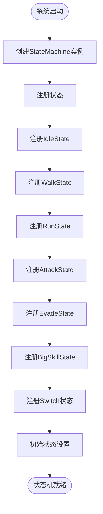

# 状态机系统

<cite>
**本文档中引用的文件**
- [StateMachine.cs](file://Assets/Scripts/Controller/FSM/StateMachine.cs)
- [BaseState.cs](file://Assets/Scripts/Controller/FSM/BaseState.cs)
- [IState.cs](file://Assets/Scripts/Controller/FSM/IState.cs)
- [PlayerController.cs](file://Assets/Scripts/Controller/PlayerController.cs)
- [IdleState.cs](file://Assets/Scripts/Controller/FSM/CharacterState/IdleState.cs)
- [AttackState.cs](file://Assets/Scripts/Controller/FSM/CharacterState/AttackState.cs)
- [EvadeState.cs](file://Assets/Scripts/Controller/FSM/CharacterState/EvadeState.cs)
- [WalkState.cs](file://Assets/Scripts/Controller/FSM/CharacterState/WalkState.cs)
- [RunState.cs](file://Assets/Scripts/Controller/FSM/CharacterState/RunState.cs)
- [BigSkillState.cs](file://Assets/Scripts/Controller/FSM/CharacterState/BigSkillState.cs)
- [SwitchInState.cs](file://Assets/Scripts/Controller/FSM/CharacterState/SwitchInState.cs)
- [SwitchOutState.cs](file://Assets/Scripts/Controller/FSM/CharacterState/SwitchOutState.cs)
- [InputSystem.cs](file://Assets/Scripts/Manager/InputSystem/InputSystem.cs)
</cite>

## 目录
1. [简介](#简介)
2. [系统架构概览](#系统架构概览)
3. [核心组件分析](#核心组件分析)
4. [状态管理系统](#状态管理系统)
5. [状态锁定机制](#状态锁定机制)
6. [具体状态实现](#具体状态实现)
7. [状态切换流程](#状态切换流程)
8. [事件驱动机制](#事件驱动机制)
9. [开发指南](#开发指南)
10. [最佳实践](#最佳实践)

## 简介

本状态机系统是一个基于Unity的复杂角色状态管理框架，专为动作游戏设计。该系统采用面向对象的设计模式，提供了灵活的状态管理、事件驱动的状态切换以及强大的状态锁定机制，确保角色行为的流畅性和一致性。

系统的核心设计理念是将角色的各种行为（如移动、攻击、闪避等）抽象为独立的状态类，通过状态机统一管理和协调这些状态之间的转换。这种设计不仅提高了代码的可维护性，还为角色行为的扩展和调试提供了便利。

## 系统架构概览

状态机系统采用分层架构设计，主要包含以下层次：


**图表来源**
- [StateMachine.cs](file://Assets/Scripts/Controller/FSM/StateMachine.cs#L1-L115)
- [PlayerController.cs](file://Assets/Scripts/Controller/PlayerController.cs#L1-L94)
- [BaseState.cs](file://Assets/Scripts/Controller/FSM/BaseState.cs#L1-L85)

**章节来源**
- [StateMachine.cs](file://Assets/Scripts/Controller/FSM/StateMachine.cs#L1-L115)
- [PlayerController.cs](file://Assets/Scripts/Controller/PlayerController.cs#L1-L94)

## 核心组件分析

### StateMachine类

StateMachine是整个状态机系统的核心控制器，负责管理所有状态的注册、切换和生命周期。

#### 主要特性

| 特性 | 描述 | 实现位置 |
|------|------|----------|
| 状态注册 | 支持泛型状态注册，自动初始化BaseState子类 | [`RegisterState<T>`](file://Assets/Scripts/Controller/FSM/StateMachine.cs#L25-L40) |
| 状态切换 | 安全的状态切换机制，支持状态锁定 | [`ChangeState<T>`](file://Assets/Scripts/Controller/FSM/StateMachine.cs#L42-L56) |
| 生命周期管理 | 自动调用状态的OnEnter、Update、OnExit方法 | [`Update()`](file://Assets/Scripts/Controller/FSM/StateMachine.cs#L58-L62) |
| 启用/禁用控制 | 支持状态机的动态启用和禁用 | [`Enable()`](file://Assets/Scripts/Controller/FSM/StateMachine.cs#L85-L95)、[`Disable()`](file://Assets/Scripts/Controller/FSM/StateMachine.cs#L97-L107) |

#### 内部组件


**图表来源**
- [StateMachine.cs](file://Assets/Scripts/Controller/FSM/StateMachine.cs#L7-L115)
- [BaseState.cs](file://Assets/Scripts/Controller/FSM/BaseState.cs#L6-L85)
- [IState.cs](file://Assets/Scripts/Controller/FSM/IState.cs#L1-L6)

**章节来源**
- [StateMachine.cs](file://Assets/Scripts/Controller/FSM/StateMachine.cs#L7-L115)

### BaseState抽象基类

BaseState提供了所有状态的基础功能，包括动画时间检查、事件订阅管理和状态初始化。

#### 核心功能

| 功能 | 方法名 | 描述 |
|------|--------|------|
| 动画时间检查 | `IsAnimationEnd()` | 检查当前动画是否播放完成 |
| 动画进度查询 | `NormalizedTime()` | 获取当前动画的标准化进度 |
| 事件订阅 | `OnMove()` | 移动事件处理 |
| 事件订阅 | `OnAttack()` | 攻击事件处理 |
| 事件订阅 | `OnEvadeEvent()` | 闪避事件处理 |
| 事件订阅 | `OnBigSkill()` | 大技能事件处理 |

#### 事件处理机制

BaseState内置了丰富的事件处理方法，每个方法都对应特定的游戏输入事件：


**图表来源**
- [BaseState.cs](file://Assets/Scripts/Controller/FSM/BaseState.cs#L35-L85)

**章节来源**
- [BaseState.cs](file://Assets/Scripts/Controller/FSM/BaseState.cs#L6-L85)

## 状态管理系统

### 状态注册流程

状态机采用延迟注册机制，在系统启动时一次性注册所有可用状态：



**图表来源**
- [PlayerController.cs](file://Assets/Scripts/Controller/PlayerController.cs#L25-L40)

### 状态切换机制

状态切换遵循严格的生命周期管理：


**图表来源**
- [StateMachine.cs](file://Assets/Scripts/Controller/FSM/StateMachine.cs#L42-L56)

**章节来源**
- [StateMachine.cs](file://Assets/Scripts/Controller/FSM/StateMachine.cs#L25-L56)
- [PlayerController.cs](file://Assets/Scripts/Controller/PlayerController.cs#L25-L40)

## 状态锁定机制

### StateLocked属性

StateLocked是一个关键的安全机制，用于防止在特定状态下发生不合法的状态切换：

| 使用场景 | 设置时机 | 清除时机 | 影响范围 |
|----------|----------|----------|----------|
| 闪避状态 | 进入EvadeState | 动画结束 | 所有状态切换 |
| 大技能状态 | 进入BigSkillState | 动画结束 | 所有状态切换 |
| 角色切换 | 进入SwitchIn/SwitchOut | 动画结束 | 所有状态切换 |
| 过场动画 | 进入特殊状态 | 动画结束 | 所有状态切换 |

### 锁定机制实现


**图表来源**
- [StateMachine.cs](file://Assets/Scripts/Controller/FSM/StateMachine.cs#L42-L45)

**章节来源**
- [StateMachine.cs](file://Assets/Scripts/Controller/FSM/StateMachine.cs#L13-L13)
- [EvadeState.cs](file://Assets/Scripts/Controller/FSM/CharacterState/EvadeState.cs#L5-L10)
- [BigSkillState.cs](file://Assets/Scripts/Controller/FSM/CharacterState/BigSkillState.cs#L9-L10)

## 具体状态实现

### IdleState - 待机状态

IdleState是最基础的状态，负责处理角色的静止行为：

#### 行为特征
- 播放Idle动画
- 监听移动、攻击、闪避、大技能事件
- 响应移动取消事件回到Idle状态

#### 实现特点
- 最小化的Update方法，专注于事件响应
- 完整的事件订阅和取消订阅管理
- 优雅的状态退出处理

**章节来源**
- [IdleState.cs](file://Assets/Scripts/Controller/FSM/CharacterState/IdleState.cs#L1-L25)

### AttackState - 攻击状态

AttackState实现了复杂的连击系统和动画状态管理：

#### 核心功能
| 功能 | 实现方式 | 描述 |
|------|----------|------|
| 连击计数 | `currentNormalAttackIndex` | 跟踪当前攻击段数 |
| 动画播放 | `Animator.Play()` | 播放指定攻击动画 |
| 连击检测 | `NormalizedTime()` | 检查动画播放进度 |
| 状态切换 | 条件判断 | 连击或后摇状态 |

#### 状态转换逻辑


**图表来源**
- [AttackState.cs](file://Assets/Scripts/Controller/FSM/CharacterState/AttackState.cs#L15-L45)

**章节来源**
- [AttackState.cs](file://Assets/Scripts/Controller/FSM/CharacterState/AttackState.cs#L1-L61)

### EvadeState - 闪避状态

EvadeState展示了状态锁定机制的典型应用：

#### 实现要点
- 进入时立即锁定状态机
- 使用UniTaskTimer延迟解锁
- 切换到RunState作为后续状态

#### 状态锁定流程


**图表来源**
- [EvadeState.cs](file://Assets/Scripts/Controller/FSM/CharacterState/EvadeState.cs#L5-L15)

**章节来源**
- [EvadeState.cs](file://Assets/Scripts/Controller/FSM/CharacterState/EvadeState.cs#L1-L23)

### WalkState - 行走状态

WalkState演示了基于时间的状态转换：

#### 特点
- 播放Walk动画
- 监听多种输入事件
- 使用定时器自动转换到RunState

**章节来源**
- [WalkState.cs](file://Assets/Scripts/Controller/FSM/CharacterState/WalkState.cs#L1-L32)

### RunState - 跑步状态

RunState是最活跃的状态之一：

#### 功能特性
- 持续播放Run动画
- 实时角色旋转控制
- 完整的事件监听覆盖

**章节来源**
- [RunState.cs](file://Assets/Scripts/Controller/FSM/CharacterState/RunState.cs#L1-L26)

### BigSkillState - 大技能状态

BigSkillState展示了长时间技能状态的实现：

#### 实现特点
- 状态锁定防止中断
- 使用定时器控制技能持续时间
- 技能结束后自动返回Idle状态

**章节来源**
- [BigSkillState.cs](file://Assets/Scripts/Controller/FSM/CharacterState/BigSkillState.cs#L1-L22)

### SwitchInState/SwitchOutState - 角色切换状态

这两个状态专门处理角色的入场和出场：

#### SwitchInState特点
- 状态锁定确保切换过程完整
- 播放Switch_In动画
- 自动恢复输入控制

#### SwitchOutState特点
- 状态锁定确保切换过程完整
- 播放Switch_Out动画
- 自动禁用输入控制

**章节来源**
- [SwitchInState.cs](file://Assets/Scripts/Controller/FSM/CharacterState/SwitchInState.cs#L1-L34)
- [SwitchOutState.cs](file://Assets/Scripts/Controller/FSM/CharacterState/SwitchOutState.cs#L1-L33)

## 状态切换流程

### 完整的切换时序


**图表来源**
- [StateMachine.cs](file://Assets/Scripts/Controller/FSM/StateMachine.cs#L42-L56)
- [PlayerController.cs](file://Assets/Scripts/Controller/PlayerController.cs#L42-L45)

### 状态机生命周期


**图表来源**
- [StateMachine.cs](file://Assets/Scripts/Controller/FSM/StateMachine.cs#L15-L115)

**章节来源**
- [StateMachine.cs](file://Assets/Scripts/Controller/FSM/StateMachine.cs#L42-L62)
- [PlayerController.cs](file://Assets/Scripts/Controller/PlayerController.cs#L42-L45)

## 事件驱动机制

### 输入系统集成

状态机与Unity的Input System深度集成，通过事件驱动的方式实现响应式状态管理：

#### 事件类型映射

| Unity输入事件 | 状态机事件 | 对应状态 | 触发条件 |
|---------------|------------|----------|----------|
| Move.performed | OnMovePerformed | WalkState | 开始移动 |
| Move.canceled | OnMoveCanceled | IdleState | 停止移动 |
| Attack.performed | OnAttackEvent | AttackState | 发起攻击 |
| Run.performed | OnEvadeEvent | EvadeState | 闪避/冲刺 |
| BigSkill.performed | OnBigSkillEvent | BigSkillState | 使用大技能 |

### 事件处理流程


**图表来源**
- [InputSystem.cs](file://Assets/Scripts/Manager/InputSystem/InputSystem.cs#L60-L75)

**章节来源**
- [InputSystem.cs](file://Assets/Scripts/Manager/InputSystem/InputSystem.cs#L34-L75)
- [BaseState.cs](file://Assets/Scripts/Controller/FSM/BaseState.cs#L35-L85)

## 开发指南

### 添加新状态的完整步骤

#### 第一步：创建状态类

```csharp
// 示例：跳跃状态实现
public class JumpState : BaseState
{
    public override void OnEnter()
    {
        base.OnEnter();
        StateMachine._animator.Play("Jump");
        // 添加跳跃逻辑
    }

    public override void Update()
    {
        // 处理跳跃过程中的逻辑
    }

    public override void OnExit()
    {
        base.OnExit();
        // 清理跳跃相关资源
    }
}
```

#### 第二步：注册状态

在PlayerController的Awake方法中注册新状态：

```csharp
// 在PlayerController.cs的Awake方法中
_stateMachine.RegisterState(new JumpState());
```

#### 第三步：添加事件处理

在BaseState中添加对应的事件处理方法：

```csharp
protected void OnJumpEvent(InputAction.CallbackContext ctx)
{
    DebugX.Instance.Log("跳跃事件触发");
    StateMachine.ChangeState<JumpState>();
}
```

#### 第四步：在适当的状态中添加事件触发

例如，在IdleState中添加跳跃事件：

```csharp
public override void OnEnter()
{
    base.OnEnter();
    // ... 其他初始化
    InputSystem.Instance.OnJumpEvent += OnJumpEvent;
}
```

### 状态开发最佳实践

#### 1. 状态生命周期管理
- 在OnEnter中进行初始化
- 在Update中处理状态逻辑
- 在OnExit中清理资源

#### 2. 事件管理
- 在OnEnter中注册事件监听器
- 在OnExit中取消事件监听器
- 避免内存泄漏

#### 3. 状态锁定使用
- 在需要防止状态切换时设置StateLocked = true
- 在合适的时候清除锁定状态
- 确保不会造成死锁

#### 4. 动画集成
- 使用StateMachine._animator控制动画
- 利用IsAnimationEnd()检查动画完成
- 通过NormalizedTime()获取动画进度

### 调试和测试

#### 调试工具
- 使用DebugX.Instance.Log记录状态切换
- 监控StateLocked状态
- 检查事件订阅和取消订阅

#### 测试策略
- 单元测试各个状态的行为
- 集成测试状态间的切换
- 性能测试状态机的响应速度

**章节来源**
- [BaseState.cs](file://Assets/Scripts/Controller/FSM/BaseState.cs#L35-L85)
- [PlayerController.cs](file://Assets/Scripts/Controller/PlayerController.cs#L25-L40)

## 最佳实践

### 性能优化建议

#### 1. 状态切换优化
- 避免频繁的状态切换
- 使用状态锁定防止不必要的切换
- 合理设计状态转换条件

#### 2. 内存管理
- 及时取消事件订阅
- 避免在状态中创建大量临时对象
- 使用对象池管理昂贵资源

#### 3. 动画性能
- 使用Animator参数控制动画
- 避免在Update中频繁调用动画控制
- 合理使用动画过渡

### 设计原则

#### 1. 单一职责原则
每个状态只负责一种特定的行为模式。

#### 2. 开闭原则
通过继承BaseState扩展新状态，而不是修改现有代码。

#### 3. 依赖倒置原则
状态依赖于抽象接口，而不是具体实现。

### 常见问题解决

#### 1. 状态卡住
- 检查StateLocked是否被错误设置
- 验证事件触发是否正常
- 确认状态切换条件是否满足

#### 2. 动画异常
- 检查动画名称是否正确
- 验证动画参数设置
- 确认动画状态机配置

#### 3. 事件无响应
- 检查事件订阅是否成功
- 验证事件触发条件
- 确认状态机是否启用

通过遵循这些最佳实践和设计原则，可以构建出稳定、高效且易于维护的状态机系统，为游戏开发提供坚实的基础。