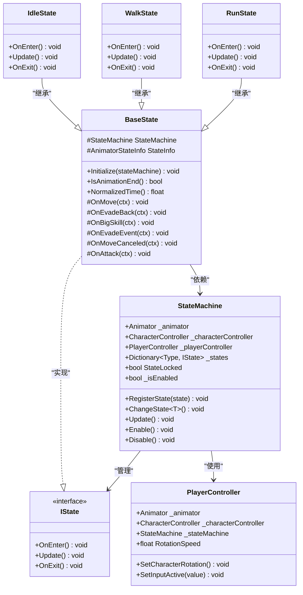
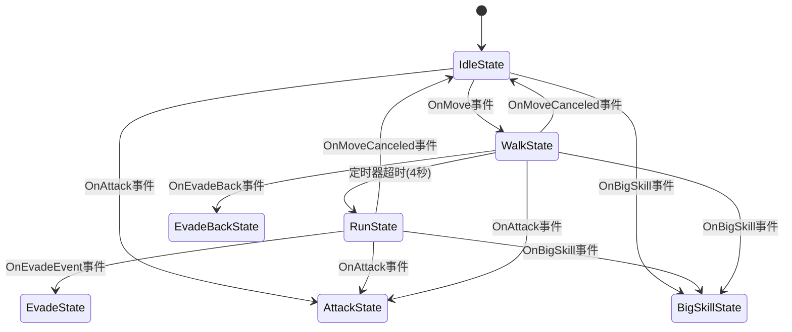
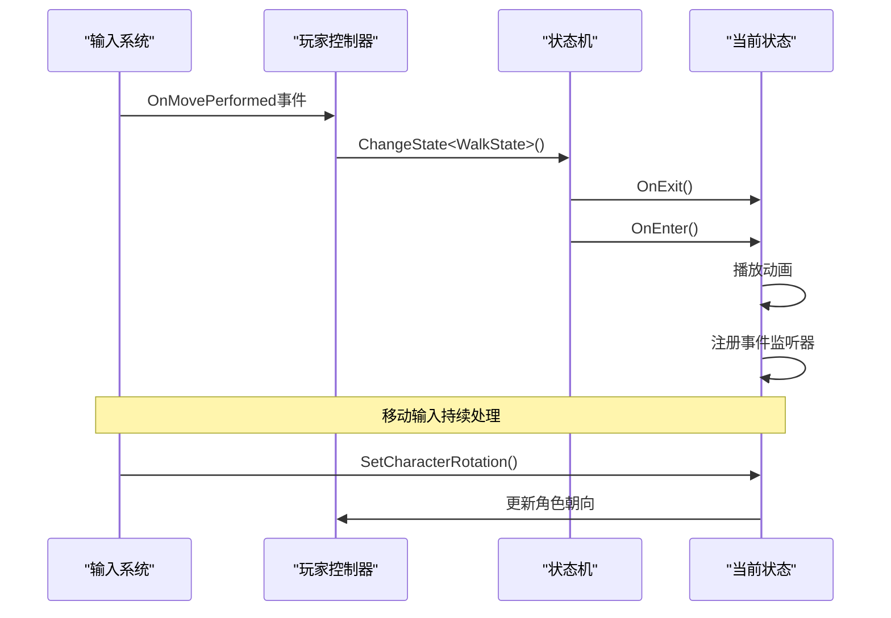
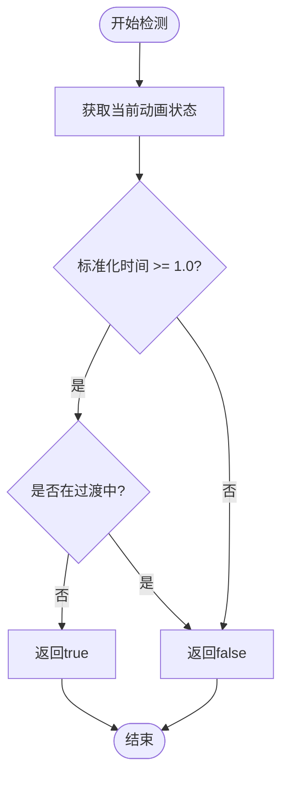
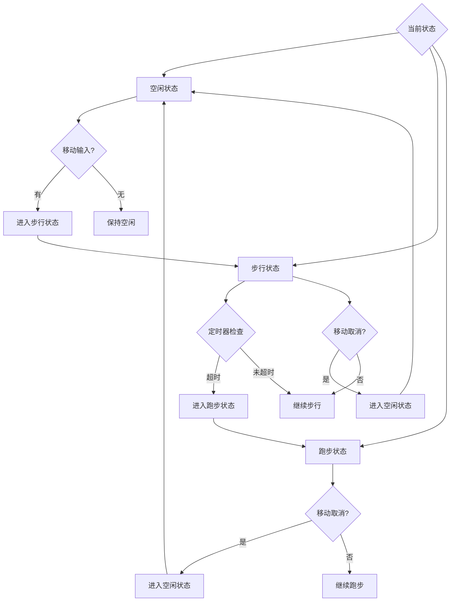

# 角色空闲与移动状态实现文档

<cite>
**本文档中引用的文件**
- [IdleState.cs](file://Assets/Scripts/Controller/FSM/CharacterState/IdleState.cs)
- [WalkState.cs](file://Assets/Scripts/Controller/FSM/CharacterState/WalkState.cs)
- [RunState.cs](file://Assets/Scripts/Controller/FSM/CharacterState/RunState.cs)
- [BaseState.cs](file://Assets/Scripts/Controller/FSM/BaseState.cs)
- [StateMachine.cs](file://Assets/Scripts/Controller/FSM/StateMachine.cs)
- [PlayerController.cs](file://Assets/Scripts/Controller/PlayerController.cs)
- [InputSystem.cs](file://Assets/Scripts/Manager/InputSystem/InputSystem.cs)
- [IState.cs](file://Assets/Scripts/Controller/FSM/IState.cs)
- [UniTaskTimer.cs](file://Assets/Scripts/Tool/UniTaskTimer.cs)
</cite>

## 目录
1. [概述](#概述)
2. [系统架构](#系统架构)
3. [核心状态类分析](#核心状态类分析)
4. [状态转换机制](#状态转换机制)
5. [移动输入处理](#移动输入处理)
6. [动画参数同步](#动画参数同步)
7. [状态转换决策流程](#状态转换决策流程)
8. [性能优化考虑](#性能优化考虑)
9. [扩展开发指南](#扩展开发指南)
10. [故障排除](#故障排除)

## 概述

本系统实现了基于有限状态机（FSM）的角色移动状态管理，包括空闲（Idle）、步行（Walk）和跑步（Run）三种核心移动状态。系统采用事件驱动的设计模式，通过输入系统监听玩家操作，并根据状态条件自动切换角色行为。

### 主要特性

- **状态隔离**：每个状态独立管理自己的进入、更新和退出逻辑
- **事件驱动**：基于Unity Input System的响应式输入处理
- **平滑过渡**：支持状态间的自然动画过渡
- **可配置性**：提供参数化配置以适应不同游戏需求

## 系统架构



**图表来源**
- [StateMachine.cs](file://Assets/Scripts/Controller/FSM/StateMachine.cs#L1-L115)
- [BaseState.cs](file://Assets/Scripts/Controller/FSM/BaseState.cs#L1-L85)
- [PlayerController.cs](file://Assets/Scripts/Controller/PlayerController.cs#L1-L103)

**章节来源**
- [StateMachine.cs](file://Assets/Scripts/Controller/FSM/StateMachine.cs#L1-L115)
- [BaseState.cs](file://Assets/Scripts/Controller/FSM/BaseState.cs#L1-L85)
- [PlayerController.cs](file://Assets/Scripts/Controller/PlayerController.cs#L1-L103)

## 核心状态类分析

### IdleState - 空闲状态

空闲状态是角色的默认静止状态，当玩家没有输入移动指令时保持此状态。

#### 进入逻辑
- 播放"Idle"动画
- 注册移动输入事件监听器
- 注册攻击、闪避和大技能事件监听器

#### 更新逻辑
- 空实现，不执行任何操作

#### 退出逻辑
- 移除所有事件监听器
- 调用基类退出方法

**章节来源**
- [IdleState.cs](file://Assets/Scripts/Controller/FSM/CharacterState/IdleState.cs#L1-L25)

### WalkState - 步行状态

步行状态代表角色以较慢速度移动的状态，具有自动转换到跑步状态的功能。

#### 进入逻辑
- 播放"Walking"动画
- 注册移动取消、闪避、大技能和攻击事件监听器
- 启动定时器，在4秒后自动转换到跑步状态

#### 更新逻辑
- 调用角色旋转设置方法
- 不包含主动的状态转换检查

#### 退出逻辑
- 移除所有事件监听器
- 调用基类退出方法

**章节来源**
- [WalkState.cs](file://Assets/Scripts/Controller/FSM/CharacterState/WalkState.cs#L1-L32)

### RunState - 跑步状态

跑步状态代表角色以最高速度移动的状态，提供最快的游戏体验。

#### 进入逻辑
- 播放"Run"动画
- 注册移动取消、闪避、大技能和攻击事件监听器

#### 更新逻辑
- 调用角色旋转设置方法
- 不包含主动的状态转换检查

#### 退出逻辑
- 移除所有事件监听器
- 调用基类退出方法

**章节来源**
- [RunState.cs](file://Assets/Scripts/Controller/FSM/CharacterState/RunState.cs#L1-L26)

## 状态转换机制



**图表来源**
- [BaseState.cs](file://Assets/Scripts/Controller/FSM/BaseState.cs#L40-L85)
- [WalkState.cs](file://Assets/Scripts/Controller/FSM/CharacterState/WalkState.cs#L10-L15)

### 状态转换条件

| 转换方向 | 触发条件 | 实现方式 | 时间延迟 |
|---------|---------|---------|---------|
| Idle → Walk | OnMove事件 | 输入系统触发 | 无 |
| Walk → Run | 定时器超时 | UniTaskTimer | 4秒 |
| Walk → Idle | OnMoveCanceled事件 | 输入系统触发 | 无 |
| Run → Idle | OnMoveCanceled事件 | 输入系统触发 | 无 |
| Run → Evade | OnEvadeEvent事件 | 输入系统触发 | 无 |
| Walk → EvadeBack | OnEvadeBack事件 | 输入系统触发 | 无 |

**章节来源**
- [BaseState.cs](file://Assets/Scripts/Controller/FSM/BaseState.cs#L40-L85)
- [WalkState.cs](file://Assets/Scripts/Controller/FSM/CharacterState/WalkState.cs#L10-L15)

## 移动输入处理

### 输入系统集成

系统通过InputSystem类统一管理所有输入事件，提供了丰富的输入属性和事件接口。

#### 关键输入属性

| 属性名 | 类型 | 描述 | 使用场景 |
|-------|------|------|---------|
| MoveDirectionInput | Vector2 | 移动方向输入 | 角色旋转计算 |
| PlayerMove | Vector2 | 玩家移动向量 | 状态判断 |
| Run | bool | 跑步按键状态 | 跑步状态激活 |
| Walk | bool | 行走按键状态 | 特殊行走模式 |

#### 输入事件处理



**图表来源**
- [InputSystem.cs](file://Assets/Scripts/Manager/InputSystem/InputSystem.cs#L50-L93)
- [PlayerController.cs](file://Assets/Scripts/Controller/PlayerController.cs#L60-L75)

**章节来源**
- [InputSystem.cs](file://Assets/Scripts/Manager/InputSystem/InputSystem.cs#L50-L93)
- [PlayerController.cs](file://Assets/Scripts/Controller/PlayerController.cs#L60-L75)

### 角色旋转逻辑

角色旋转通过`SetCharacterRotation()`方法实现，该方法基于摄像机朝向计算目标角度，并进行平滑插值。

#### 旋转计算步骤

1. **获取输入**：从InputSystem获取移动方向输入
2. **计算目标角度**：使用atan2函数计算基于摄像机朝向的目标角度
3. **平滑插值**：使用Quaternion.Slerp进行平滑旋转
4. **应用旋转**：更新角色变换矩阵

**章节来源**
- [PlayerController.cs](file://Assets/Scripts/Controller/PlayerController.cs#L60-L75)

## 动画参数同步

### 动画状态监控

系统通过`IsAnimationEnd()`和`NormalizedTime()`方法监控动画播放状态，确保状态转换的时机准确性。

#### 动画结束检测



**图表来源**
- [BaseState.cs](file://Assets/Scripts/Controller/FSM/BaseState.cs#L25-L35)

### 动画参数映射

| 动画名称 | 参数类型 | 用途 | 控制方式 |
|---------|---------|------|---------|
| Idle | 循环动画 | 静止状态 | 持续播放 |
| Walk | 循环动画 | 步行状态 | 持续播放 |
| Run | 循环动画 | 跑步状态 | 持续播放 |
| Evade_Back | 单次动画 | 闪避动作 | 定时器控制 |

**章节来源**
- [BaseState.cs](file://Assets/Scripts/Controller/FSM/BaseState.cs#L25-L35)

## 状态转换决策流程

### 决策树结构



**图表来源**
- [StateMachine.cs](file://Assets/Scripts/Controller/FSM/StateMachine.cs#L40-L60)
- [WalkState.cs](file://Assets/Scripts/Controller/FSM/CharacterState/WalkState.cs#L10-L15)

### 转换优先级

1. **紧急事件优先**：攻击、闪避、大技能等特殊状态
2. **输入响应**：移动输入触发状态变化
3. **定时器触发**：步行状态自动转换为跑步
4. **取消事件**：移动取消导致状态回退

**章节来源**
- [StateMachine.cs](file://Assets/Scripts/Controller/FSM/StateMachine.cs#L40-L60)

## 性能优化考虑

### 内存管理

- **事件监听器管理**：状态进入时注册，退出时移除，避免内存泄漏
- **状态对象池**：可考虑实现状态对象池减少GC压力
- **定时器优化**：使用UniTask实现零GC定时器

### 更新频率优化

- **按需更新**：只有活跃状态才执行Update方法
- **状态锁定**：特殊状态下锁定状态机防止意外转换
- **输入过滤**：只处理必要的输入事件

### 动画性能

- **动画状态缓存**：缓存动画状态信息避免重复查询
- **平滑插值优化**：使用高效的Quaternion插值算法
- **动画参数最小化**：只暴露必要的动画参数

**章节来源**
- [BaseState.cs](file://Assets/Scripts/Controller/FSM/BaseState.cs#L35-L40)
- [UniTaskTimer.cs](file://Assets/Scripts/Tool/UniTaskTimer.cs#L1-L141)

## 扩展开发指南

### 添加新的移动变体

#### 步骤1：创建新状态类

```csharp
// 示例：跳跃状态
public class JumpState : BaseState
{
    public override void OnEnter()
    {
        base.OnEnter();
        StateMachine._animator.Play("Jump");
        // 注册跳跃相关事件
    }
    
    public override void Update()
    {
        // 处理跳跃逻辑
    }
    
    public override void OnExit()
    {
        // 清理跳跃状态
    }
}
```

#### 步骤2：注册状态到状态机

```csharp
// 在PlayerController.Awake()中添加
_stateMachine.RegisterState(new JumpState());
```

#### 步骤3：添加状态转换条件

修改BaseState中的事件处理方法或创建新的状态类来处理特定输入。

### 自定义移动参数

#### 修改旋转速度

```csharp
// 在PlayerController中
public float RotationSpeed = 15f; // 提高旋转速度
```

#### 调整定时器参数

```csharp
// 修改步行状态的定时器
UniTaskTimer.StartTimer(UniTaskTimer.Mode.Once, 2.0f, // 2秒后转换
                       UniTaskTimer.TimeSource.Scaled,
                       () => {
                           StateMachine.ChangeState<RunState>();
                       });
```

### 新增输入绑定

#### 步骤1：在InputSystem_Actions中添加新动作

```csharp
// 添加新的输入动作
public InputAction Climb = m_Player.FindAction("Climb", throwIfNotFound: true);
```

#### 步骤2：在InputSystem中添加事件

```csharp
// 在Init()方法中添加
InputActions.Player.Climb.performed += ctx => OnClimbEvent?.Invoke(ctx);
```

#### 步骤3：在BaseState中添加处理方法

```csharp
protected void OnClimbEvent(InputAction.CallbackContext ctx)
{
    StateMachine.ChangeState<ClimbState>();
}
```

**章节来源**
- [BaseState.cs](file://Assets/Scripts/Controller/FSM/BaseState.cs#L40-L85)
- [PlayerController.cs](file://Assets/Scripts/Controller/PlayerController.cs#L25-L35)

## 故障排除

### 常见问题及解决方案

#### 问题1：状态转换不生效

**症状**：按下移动键但角色仍保持空闲状态

**可能原因**：
- 输入系统未正确初始化
- 状态机被禁用
- 事件监听器未正确注册

**解决方案**：
1. 检查InputSystem.Init()是否被调用
2. 验证StateMachine.IsEnabled属性
3. 确认事件监听器注册逻辑

#### 问题2：动画播放异常

**症状**：状态转换时动画不播放或播放错误

**可能原因**：
- 动画名称不匹配
- 动画控制器配置错误
- 状态机未正确传递动画参数

**解决方案**：
1. 检查Animator控制器中的动画名称
2. 验证动画状态机连接
3. 确认OnEnter()方法中正确的动画播放调用

#### 问题3：角色旋转不平滑

**症状**：角色转向时出现跳跃或抖动

**可能原因**：
- RotationSpeed参数过大
- 输入值不稳定
- 更新频率不一致

**解决方案**：
1. 调整RotationSpeed参数到合理范围（5-15）
2. 对输入值进行平滑处理
3. 确保在FixedUpdate中进行物理相关操作

#### 问题4：定时器功能失效

**症状**：步行状态无法自动转换为跑步状态

**可能原因**：
- UniTaskTimer未正确初始化
- 定时器回调未注册
- 状态锁定阻止转换

**解决方案**：
1. 检查UniTaskTimer.StartTimer调用
2. 验证回调函数逻辑
3. 确认状态机未被锁定

**章节来源**
- [StateMachine.cs](file://Assets/Scripts/Controller/FSM/StateMachine.cs#L40-L60)
- [WalkState.cs](file://Assets/Scripts/Controller/FSM/CharacterState/WalkState.cs#L10-L15)
- [PlayerController.cs](file://Assets/Scripts/Controller/PlayerController.cs#L60-L75)