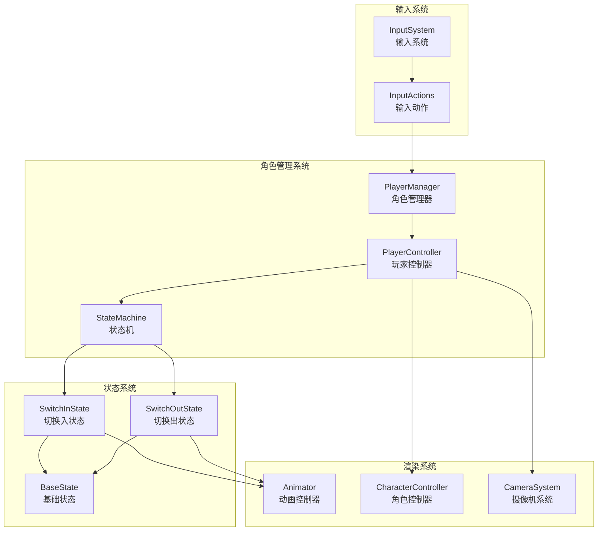
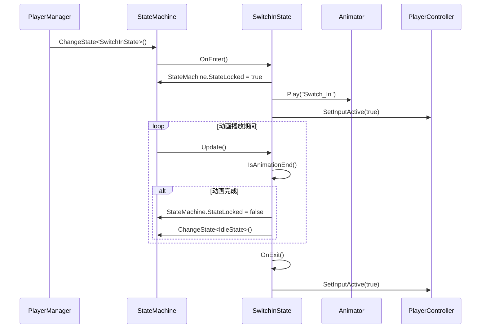
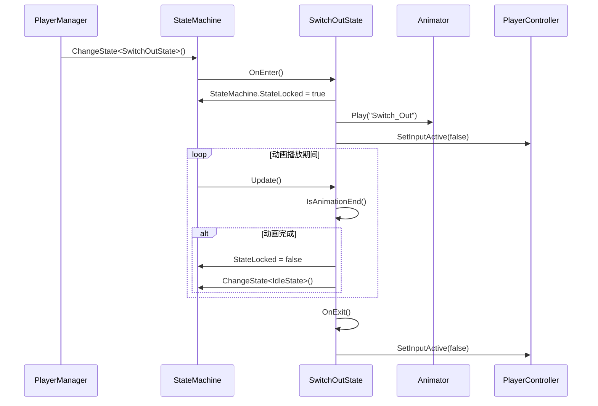
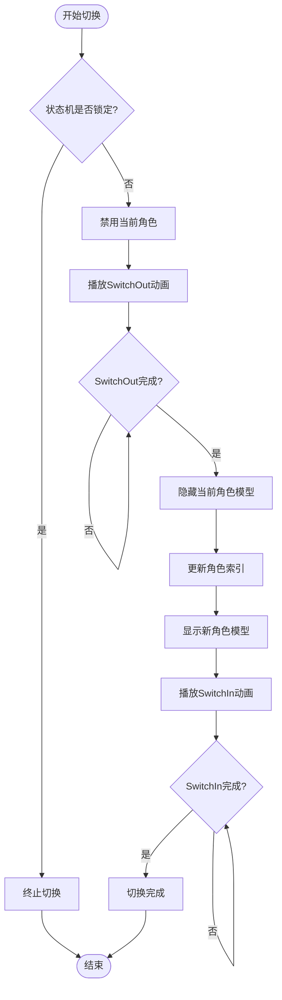
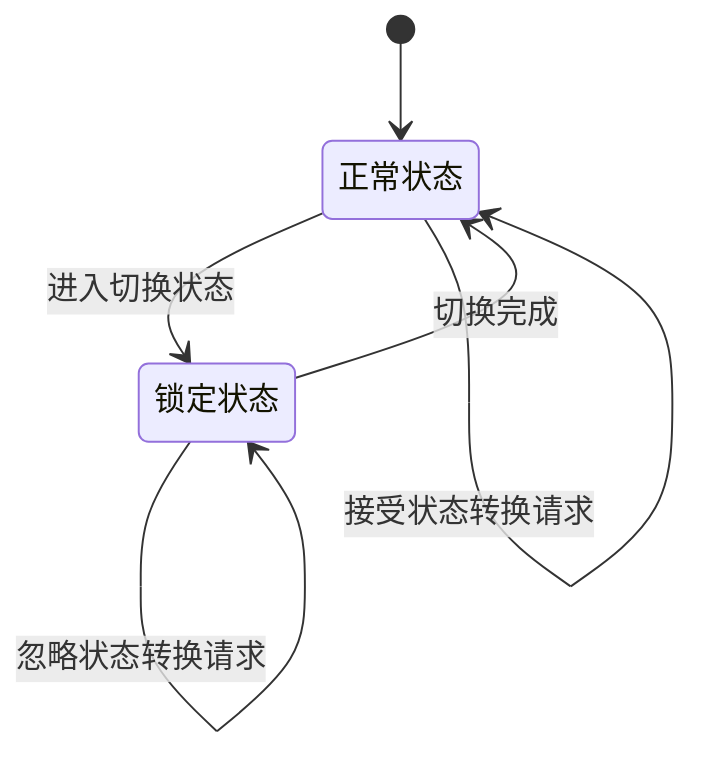
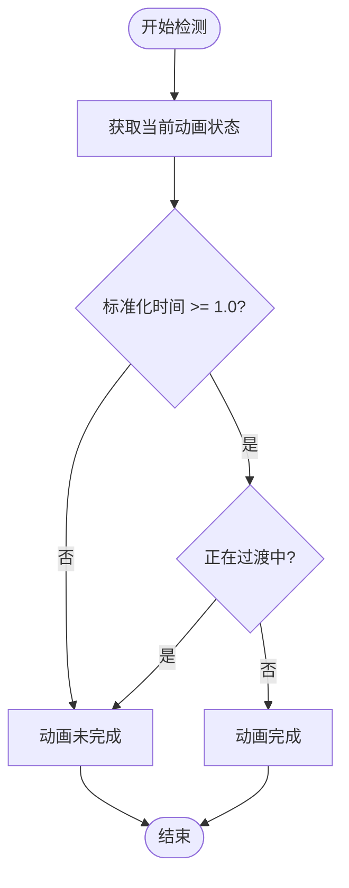
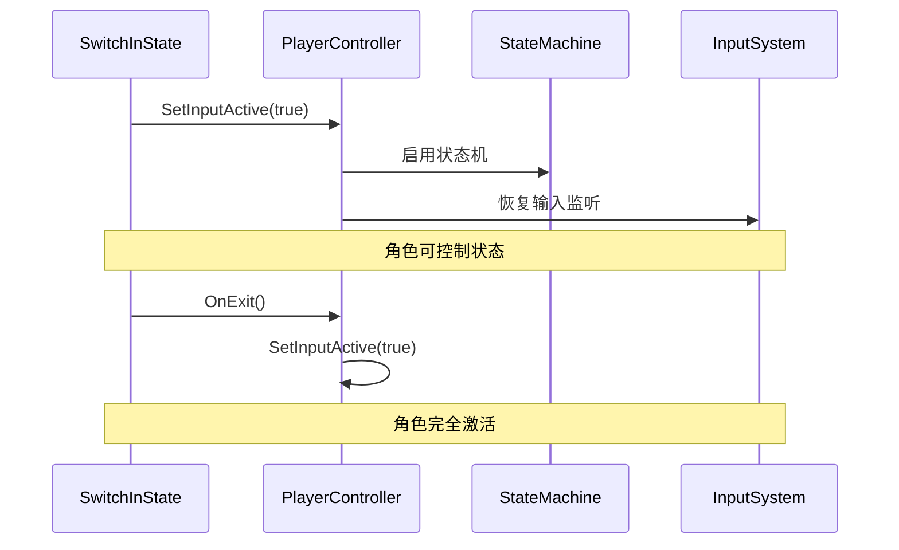
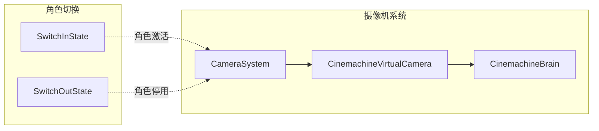
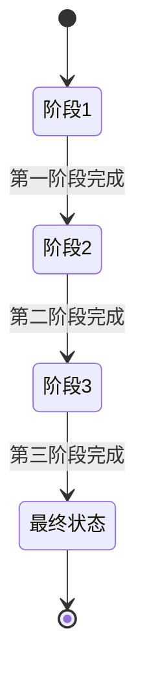

# 角色切换状态实现机制深度解析

<cite>
**本文档中引用的文件**
- [SwitchInState.cs](file://Assets/Scripts/Controller/FSM/CharacterState/SwitchInState.cs)
- [SwitchOutState.cs](file://Assets/Scripts/Controller/FSM/CharacterState/SwitchOutState.cs)
- [PlayerManager.cs](file://Assets/Scripts/Manager/PlayerManager/PlayerManager.cs)
- [StateMachine.cs](file://Assets/Scripts/Controller/FSM/StateMachine.cs)
- [BaseState.cs](file://Assets/Scripts/Controller/FSM/BaseState.cs)
- [PlayerController.cs](file://Assets/Scripts/Controller/PlayerController.cs)
- [InputSystem.cs](file://Assets/Scripts/Manager/InputSystem/InputSystem.cs)
- [CameraSystem.cs](file://Assets/Scripts/Manager/CameraSystem/CameraSystem.cs)
</cite>

## 目录
1. [概述](#概述)
2. [系统架构](#系统架构)
3. [核心状态类分析](#核心状态类分析)
4. [状态切换流程](#状态切换流程)
5. [状态锁定机制](#状态锁定机制)
6. [动画同步机制](#动画同步机制)
7. [输入系统重置](#输入系统重置)
8. [摄像机过渡处理](#摄像机过渡处理)
9. [自定义扩展指南](#自定义扩展指南)
10. [故障排除](#故障排除)

## 概述

角色切换状态机制是游戏系统中负责处理角色间无缝切换的核心组件。该系统通过两个专门的状态类`SwitchInState`和`SwitchOutState`，配合状态机锁定机制，实现了平滑的角色激活/停用、动画同步和输入系统重置功能。

### 核心特性

- **状态锁定保护**：防止在切换过程中意外的状态转换
- **动画驱动**：基于Animator的动画播放和完成检测
- **输入系统管理**：自动启用/禁用角色控制输入
- **角色模型管理**：自动显示/隐藏角色对象
- **状态机集成**：与现有状态机系统无缝协作

## 系统架构



**图表来源**
- [PlayerManager.cs](file://Assets/Scripts/Manager/PlayerManager/PlayerManager.cs#L1-L85)
- [PlayerController.cs](file://Assets/Scripts/Controller/PlayerController.cs#L1-L103)
- [StateMachine.cs](file://Assets/Scripts/Controller/FSM/StateMachine.cs#L1-L115)

## 核心状态类分析

### SwitchInState - 角色切换入状态

`SwitchInState`负责处理新角色的激活过程，确保角色从不可控状态平滑过渡到可控制状态。

#### 主要职责

1. **状态锁定**：进入状态时锁定状态机，防止意外切换
2. **动画播放**：播放"Switch_In"动画序列
3. **完成检测**：监控动画播放进度
4. **状态恢复**：动画完成后解锁状态机并切换到待机状态

#### 关键实现细节



**图表来源**
- [SwitchInState.cs](file://Assets/Scripts/Controller/FSM/CharacterState/SwitchInState.cs#L1-L34)
- [StateMachine.cs](file://Assets/Scripts/Controller/FSM/StateMachine.cs#L45-L60)

**节来源**
- [SwitchInState.cs](file://Assets/Scripts/Controller/FSM/CharacterState/SwitchInState.cs#L1-L34)

### SwitchOutState - 角色切换出状态

`SwitchOutState`负责处理当前角色的停用过程，确保角色从可控状态平滑过渡到不可控状态。

#### 主要职责

1. **状态锁定**：进入状态时锁定状态机，防止意外切换
2. **动画播放**：播放"Switch_Out"动画序列
3. **完成检测**：监控动画播放进度
4. **输入禁用**：动画完成后禁用角色控制输入

#### 关键实现细节



**图表来源**
- [SwitchOutState.cs](file://Assets/Scripts/Controller/FSM/CharacterState/SwitchOutState.cs#L1-L33)
- [StateMachine.cs](file://Assets/Scripts/Controller/FSM/StateMachine.cs#L45-L60)

**节来源**
- [SwitchOutState.cs](file://Assets/Scripts/Controller/FSM/CharacterState/SwitchOutState.cs#L1-L33)

## 状态切换流程

### 完整切换序列

角色切换遵循严格的顺序，确保系统的稳定性和一致性：



**图表来源**
- [PlayerManager.cs](file://Assets/Scripts/Manager/PlayerManager/PlayerManager.cs#L34-L66)
- [StateMachine.cs](file://Assets/Scripts/Controller/FSM/StateMachine.cs#L45-L60)

### PlayerManager中的切换触发

PlayerManager提供了两种主要的切换方式：

#### 1. 循环切换（SwitchNextPlayer）
- 自动计算下一个角色
- 支持循环遍历所有可用角色
- 基于键盘输入事件触发

#### 2. 指定切换（SwitchToPlayer）
- 允许直接指定目标角色索引
- 提供精确的控制能力
- 支持程序化角色切换

**节来源**
- [PlayerManager.cs](file://Assets/Scripts/Manager/PlayerManager/PlayerManager.cs#L34-L66)

## 状态锁定机制

### 锁定原理

状态锁定是角色切换安全性的关键保障机制。当角色进入切换状态时，状态机会被锁定，阻止任何其他状态转换请求。



### 锁定实现

状态锁定通过`StateMachine.StateLocked`布尔值控制：

- **锁定时**：所有状态转换请求被忽略
- **解锁时**：恢复正常状态转换处理
- **异常处理**：确保即使发生错误也能正确解锁

**节来源**
- [StateMachine.cs](file://Assets/Scripts/Controller/FSM/StateMachine.cs#L15-L16)
- [SwitchInState.cs](file://Assets/Scripts/Controller/FSM/CharacterState/SwitchInState.cs#L5-L6)
- [SwitchOutState.cs](file://Assets/Scripts/Controller/FSM/CharacterState/SwitchOutState.cs#L5-L6)

## 动画同步机制

### 动画完成检测

每个切换状态都依赖精确的动画完成检测来确保状态转换的时机准确性。

#### 检测算法



**图表来源**
- [BaseState.cs](file://Assets/Scripts/Controller/FSM/BaseState.cs#L23-L28)

#### 实现细节

动画完成检测使用以下条件组合：
- **标准化时间 ≥ 1.0**：动画播放完成
- **非过渡状态**：确保不在动画过渡期间

这种双重检查机制避免了动画中断或重复播放导致的问题。

**节来源**
- [BaseState.cs](file://Assets/Scripts/Controller/FSM/BaseState.cs#L23-L28)

### 动画序列设计建议

为了获得最佳的切换效果，建议遵循以下动画设计原则：

1. **保持一致的动画长度**：确保SwitchIn和SwitchOut动画具有相似的持续时间
2. **流畅的过渡帧**：在动画的关键帧处设置适当的过渡点
3. **合理的动画速度**：平衡视觉效果和响应速度
4. **音效同步**：配合动画节奏添加适当的音效

## 输入系统重置

### 输入激活管理

角色切换过程中的输入系统管理确保了玩家体验的一致性：



**图表来源**
- [SwitchInState.cs](file://Assets/Scripts/Controller/FSM/CharacterState/SwitchInState.cs#L29-L33)
- [PlayerController.cs](file://Assets/Scripts/Controller/PlayerController.cs#L85-L102)

### 输入系统集成

PlayerController通过`SetInputActive`方法统一管理输入激活状态：

#### 激活流程
1. **组件启用**：直接启用/禁用整个PlayerController组件
2. **状态机同步**：确保状态机的启用/禁用状态一致
3. **输入监听**：恢复或暂停输入事件监听

#### 状态恢复
- **正常激活**：恢复所有输入监听和状态机功能
- **禁用状态**：立即屏蔽所有输入，暂停状态机逻辑

**节来源**
- [PlayerController.cs](file://Assets/Scripts/Controller/PlayerController.cs#L85-L102)
- [SwitchInState.cs](file://Assets/Scripts/Controller/FSM/CharacterState/SwitchInState.cs#L29-L33)
- [SwitchOutState.cs](file://Assets/Scripts/Controller/FSM/CharacterState/SwitchOutState.cs#L27-L31)

## 摄像机过渡处理

### 摄像机系统集成

虽然当前实现中摄像机过渡不是切换状态的主要职责，但系统设计考虑了与摄像机系统的协作：



**图表来源**
- [CameraSystem.cs](file://Assets/Scripts/Manager/CameraSystem/CameraSystem.cs#L1-L36)
- [PlayerController.cs](file://Assets/Scripts/Controller/PlayerController.cs#L1-L10)

### 摄像机状态管理

摄像机系统通过以下方式参与角色切换：

1. **位置信息获取**：通过`CamPosition`和`CamRotation`属性获取当前摄像机状态
2. **虚拟摄像机管理**：利用Cinemachine系统进行平滑的视角过渡
3. **状态同步**：确保摄像机状态与角色状态保持一致

**节来源**
- [CameraSystem.cs](file://Assets/Scripts/Manager/CameraSystem/CameraSystem.cs#L1-L36)

## 自定义扩展指南

### 创建自定义切换状态

开发者可以通过继承`BaseState`类来创建自定义的切换状态：

#### 基本模板

```csharp
// 示例：自定义特效切换状态
public class EffectSwitchState : BaseState
{
    public override void OnEnter()
    {
        base.OnEnter();
        StateMachine.StateLocked = true;
        
        // 播放自定义特效动画
        StateMachine._animator.Play("Effect_Switch");
        
        // 添加自定义特效逻辑
        ApplyCustomEffects();
    }
    
    public override void Update()
    {
        base.Update();
        
        if (IsAnimationEnd())
        {
            StateMachine.StateLocked = false;
            StateMachine.ChangeState<IdleState>();
            
            // 清理自定义特效
            CleanupEffects();
        }
    }
    
    public override void OnExit()
    {
        base.OnExit();
        // 清理资源
    }
    
    private void ApplyCustomEffects()
    {
        // 实现自定义特效逻辑
    }
    
    private void CleanupEffects()
    {
        // 清理自定义特效
    }
}
```

### 扩展切换逻辑

#### 多阶段切换

对于复杂的切换效果，可以实现多阶段的状态转换：



#### 条件切换

根据游戏状态动态调整切换行为：

```csharp
public override void OnEnter()
{
    base.OnEnter();
    
    // 检查游戏状态决定切换方式
    if (IsInCombat())
    {
        // 战斗模式下的快速切换
        StateMachine._animator.speed = 2.0f;
    }
    else
    {
        // 一般情况下的标准切换
        StateMachine._animator.speed = 1.0f;
    }
}
```

### 性能优化建议

1. **动画缓存**：预加载常用的切换动画
2. **对象池**：使用对象池管理临时对象
3. **延迟加载**：按需加载切换相关的资源
4. **批处理**：合并多个切换操作以减少性能开销

## 故障排除

### 常见问题及解决方案

#### 1. 切换状态卡住
**症状**：角色切换后无法继续正常操作
**原因**：状态锁定未正确解锁
**解决方案**：
- 检查动画完成检测逻辑
- 确保`OnExit`方法被正确调用
- 验证状态机的`StateLocked`属性设置

#### 2. 输入系统异常
**症状**：角色切换后输入无响应或重复响应
**原因**：输入激活状态不一致
**解决方案**：
- 检查`SetInputActive`方法的调用时机
- 验证状态机与输入系统的同步
- 确保在适当的状态下启用/禁用输入

#### 3. 动画播放异常
**症状**：切换动画播放不完整或重复
**原因**：动画完成检测条件不准确
**解决方案**：
- 调整动画完成检测逻辑
- 检查动画剪辑的设置
- 验证动画过渡参数

#### 4. 角色模型显示问题
**症状**：角色模型在切换过程中显示异常
**原因**：GameObject激活状态管理不当
**解决方案**：
- 确保在正确的时机激活/隐藏角色模型
- 检查角色控制器的启用状态
- 验证场景中的层级关系

### 调试工具和技巧

#### 状态机调试
```csharp
// 在StateMachine中添加调试输出
public void DebugStateInfo()
{
    Debug.Log($"当前状态: {_currentState?.GetType().Name}");
    Debug.Log($"状态锁定: {StateLocked}");
    Debug.Log($"状态机启用: {_isEnabled}");
}
```

#### 动画调试
```csharp
// 在BaseState中添加动画调试
protected void DebugAnimationState()
{
    var stateInfo = StateMachine._animator.GetCurrentAnimatorStateInfo(0);
    Debug.Log($"动画名称: {stateInfo.IsName("Switch_In")}");
    Debug.Log($"标准化时间: {stateInfo.normalizedTime}");
    Debug.Log($"正在过渡: {StateMachine._animator.IsInTransition(0)}");
}
```

### 性能监控

建议监控以下指标以确保切换系统的性能：

1. **状态转换延迟**：从触发切换到完成的时间
2. **内存使用**：切换过程中临时对象的分配
3. **CPU占用**：状态更新和动画播放的CPU消耗
4. **帧率稳定性**：切换过程中的帧率波动

通过这些监控指标，开发者可以及时发现并解决性能问题，确保角色切换系统的流畅运行。