# 闪避与躲避状态

<cite>
**本文档中引用的文件**   
- [EvadeState.cs](file://Assets/Scripts/Controller/FSM/CharacterState/EvadeState.cs)
- [EvadeBackState.cs](file://Assets/Scripts/Controller/FSM/CharacterState/EvadeBackState.cs)
- [EvadeEndState.cs](file://Assets/Scripts/Controller/FSM/CharacterState/EvadeEndState.cs)
- [EvadeBackEndState.cs](file://Assets/Scripts/Controller/FSM/CharacterState/EvadeBackEndState.cs)
- [PlayerController.cs](file://Assets/Scripts/Controller/PlayerController.cs)
- [StateMachine.cs](file://Assets/Scripts/Controller/FSM/StateMachine.cs)
- [BaseState.cs](file://Assets/Scripts/Controller/FSM/BaseState.cs)
- [InputSystem.cs](file://Assets/Scripts/Manager/InputSystem/InputSystem.cs)
- [UniTaskTimer.cs](file://Assets/Scripts/Tool/UniTaskTimer.cs)
</cite>

## 目录
1. [简介](#简介)
2. [核心状态实现](#核心状态实现)
3. [状态转换逻辑](#状态转换逻辑)
4. [闪避方向判定与位移计算](#闪避方向判定与位移计算)
5. [无敌帧管理机制](#无敌帧管理机制)
6. [后跳闪避特殊处理](#后跳闪避特殊处理)
7. [时间轴示意图](#时间轴示意图)
8. [开发者指导](#开发者指导)

## 简介
本文档全面分析了角色闪避与躲避状态的实现机制。系统详细解释了EvadeState、EvadeBackState和EvadeEndState的状态行为和转换逻辑，描述了闪避方向判定、位移计算和无敌帧管理机制。特别分析了后跳闪避（EvadeBackState）的特殊处理逻辑和动画同步，并提供了闪避状态的时间轴示意图。

## 核心状态实现

### EvadeState（前向闪避状态）
EvadeState类实现了角色的前向闪避行为。当进入此状态时，角色播放"Evade_Front"动画，并设置状态机锁定，防止在闪避过程中被其他输入中断。闪避持续时间为0.4秒，完成后自动转换到RunState（奔跑状态）。

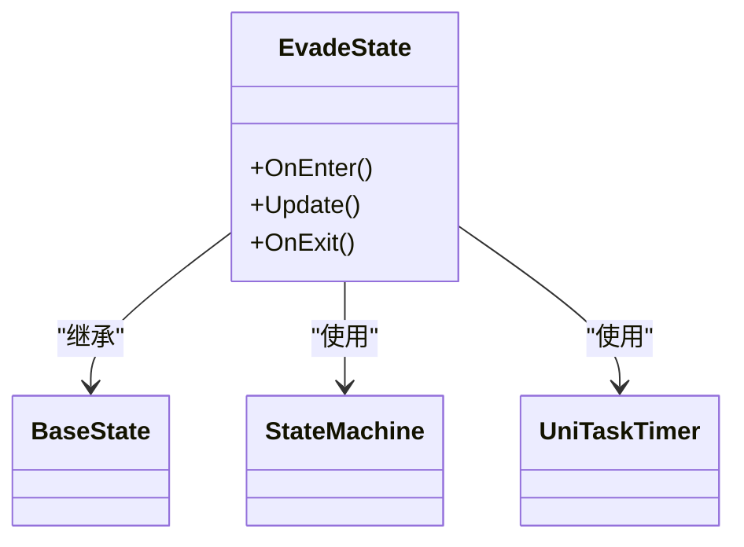

**图示来源**
- [EvadeState.cs](file://Assets/Scripts/Controller/FSM/CharacterState/EvadeState.cs#L1-L23)

### EvadeBackState（后向闪避状态）
EvadeBackState类实现了角色的后向闪避行为。与前向闪避不同，后向闪避在完成主要闪避动作后不会直接进入奔跑状态，而是先进入一个过渡状态（EvadeBackEndState），然后再回到IdleState（闲置状态）。

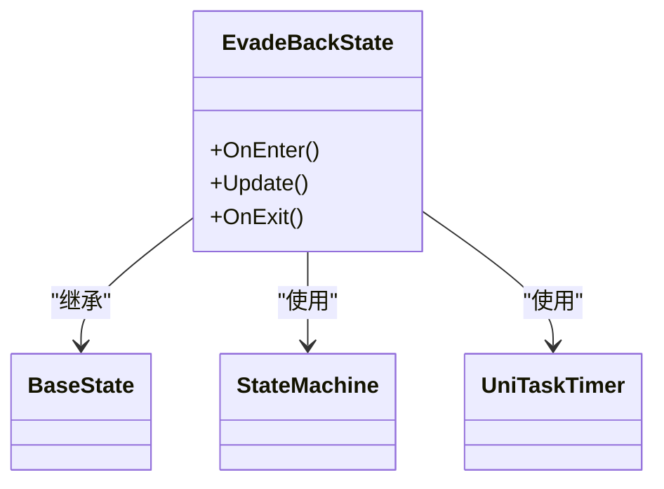

**图示来源**
- [EvadeBackState.cs](file://Assets/Scripts/Controller/FSM/CharacterState/EvadeBackState.cs#L1-L26)

### EvadeBackEndState（后向闪避结束状态）
EvadeBackEndState类处理后向闪避的收尾动作。此状态播放"Evade_Back_End"动画，持续时间为1.3秒，完成后角色回到IdleState。这个状态确保了后向闪避有一个完整的动画序列和恢复过程。

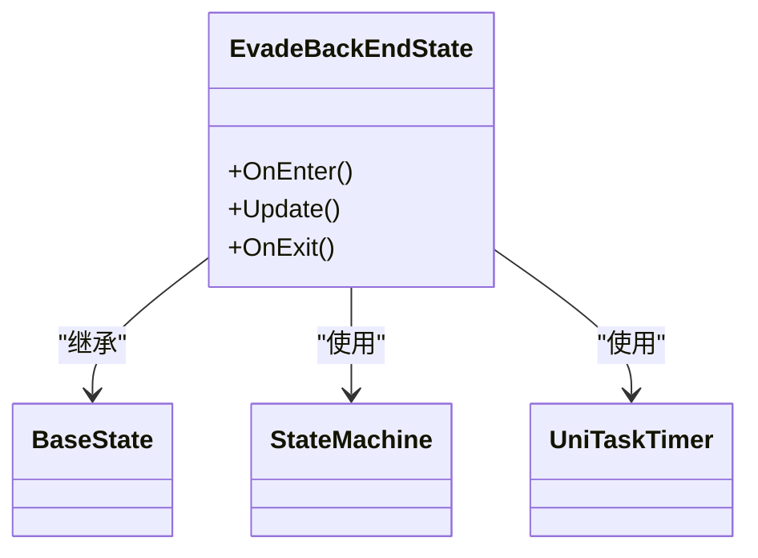

**图示来源**
- [EvadeBackEndState.cs](file://Assets/Scripts/Controller/FSM/CharacterState/EvadeBackEndState.cs#L1-L31)

**本节来源**
- [EvadeState.cs](file://Assets/Scripts/Controller/FSM/CharacterState/EvadeState.cs#L1-L23)
- [EvadeBackState.cs](file://Assets/Scripts/Controller/FSM/CharacterState/EvadeBackState.cs#L1-L26)
- [EvadeBackEndState.cs](file://Assets/Scripts/Controller/FSM/CharacterState/EvadeBackEndState.cs#L1-L31)

## 状态转换逻辑

### 状态机架构
状态机（StateMachine）是整个角色控制系统的核心，负责管理所有状态的注册、转换和更新。状态机通过泛型方法ChangeState<T>()实现类型安全的状态转换，并通过StateLocked标志防止在关键动作期间被意外中断。

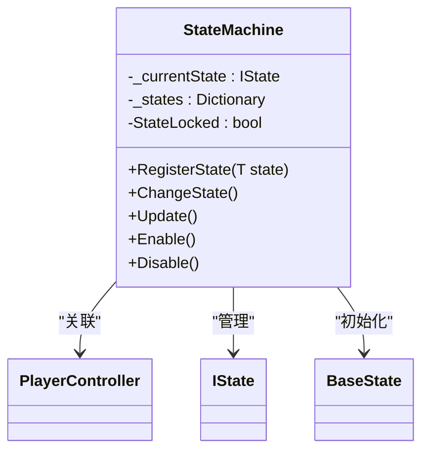

**图示来源**
- [StateMachine.cs](file://Assets/Scripts/Controller/FSM/StateMachine.cs#L1-L115)

### 状态转换流程
闪避状态的转换遵循严格的时序逻辑。当玩家输入闪避指令时，根据当前状态和输入类型，角色会进入相应的闪避状态。状态转换的关键在于输入事件的正确绑定和状态机的锁定机制。

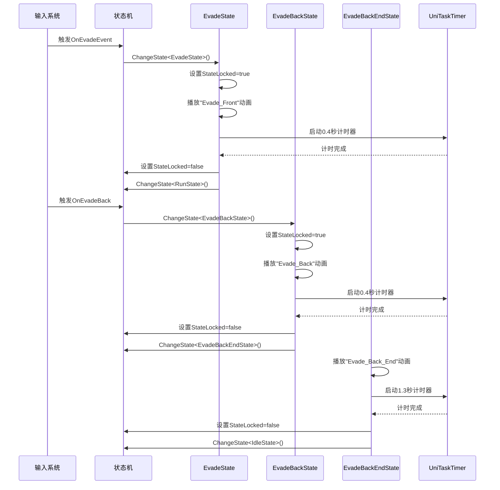

**图示来源**
- [BaseState.cs](file://Assets/Scripts/Controller/FSM/BaseState.cs#L48-L84)
- [InputSystem.cs](file://Assets/Scripts/Manager/InputSystem/InputSystem.cs#L1-L94)

**本节来源**
- [StateMachine.cs](file://Assets/Scripts/Controller/FSM/StateMachine.cs#L1-L115)
- [BaseState.cs](file://Assets/Scripts/Controller/FSM/BaseState.cs#L48-L84)

## 闪避方向判定与位移计算

### 闪避方向判定
闪避方向的判定主要通过输入系统的MoveDirectionInput属性实现。系统根据玩家的输入方向和摄像机的朝向来计算最终的角色移动方向。这种设计确保了闪避方向始终与玩家的视角保持一致，提供更直观的操作体验。

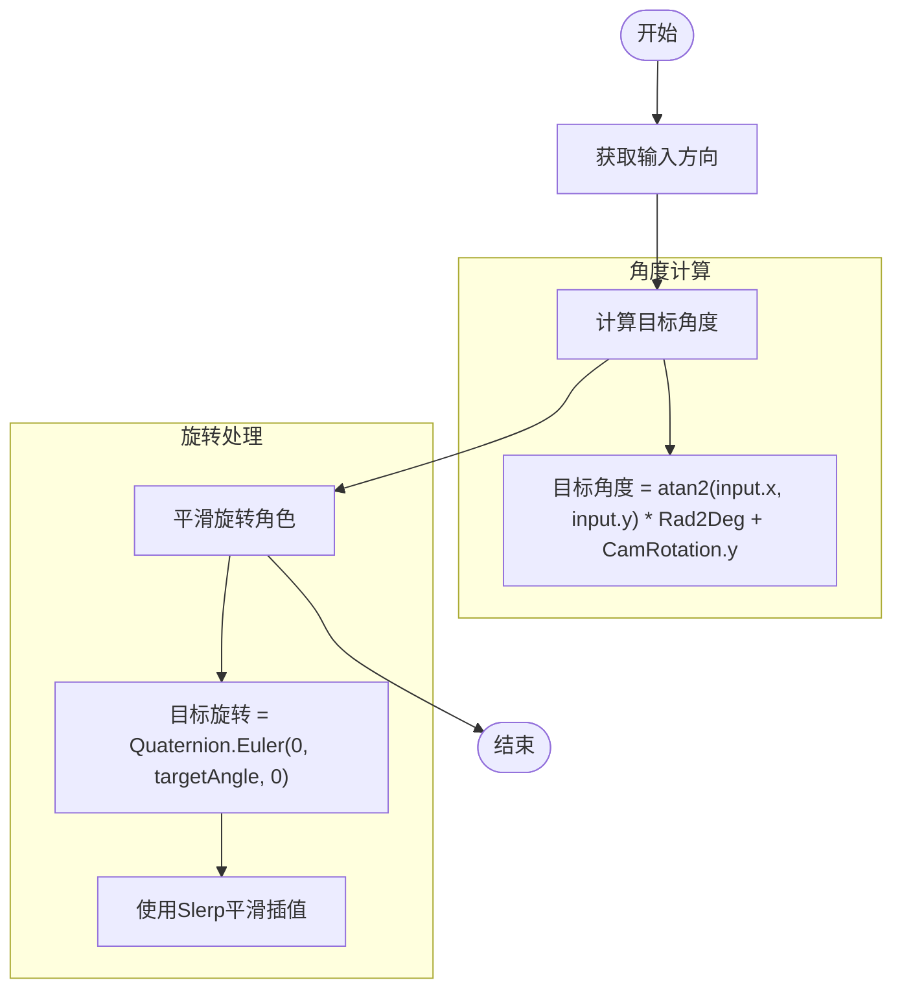

**图示来源**
- [PlayerController.cs](file://Assets/Scripts/Controller/PlayerController.cs#L75-L90)

### 位移执行机制
虽然代码中没有直接显示位移计算的实现，但通过状态机和动画系统的配合，角色的位移是通过动画剪辑本身来实现的。"Evade_Front"和"Evade_Back"动画包含了角色的位移轨迹，确保了闪避动作的流畅性和视觉效果。

**本节来源**
- [PlayerController.cs](file://Assets/Scripts/Controller/PlayerController.cs#L75-L90)

## 无敌帧管理机制

### 状态锁定机制
无敌帧的管理主要通过状态机的StateLocked属性实现。当角色进入闪避状态时，StateLocked被设置为true，阻止其他状态转换。这种机制确保了闪避动作的完整性，防止在关键动作期间被其他输入中断。

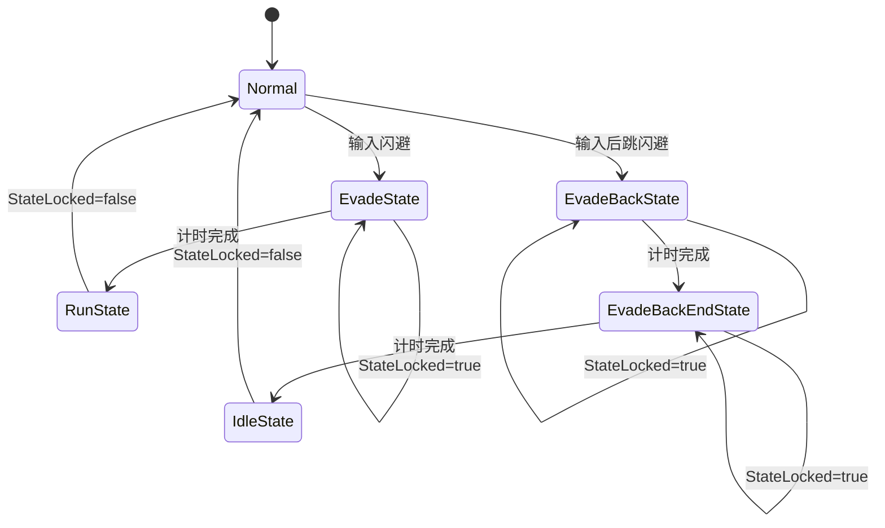

**图示来源**
- [StateMachine.cs](file://Assets/Scripts/Controller/FSM/StateMachine.cs#L38-L50)
- [EvadeState.cs](file://Assets/Scripts/Controller/FSM/CharacterState/EvadeState.cs#L5-L20)

### 计时器实现
无敌帧的持续时间由UniTaskTimer精确控制。这是一个基于UniTask的计时器系统，能够在指定时间后执行回调函数，且不会产生GC分配。这种设计确保了性能的稳定性和计时的精确性。

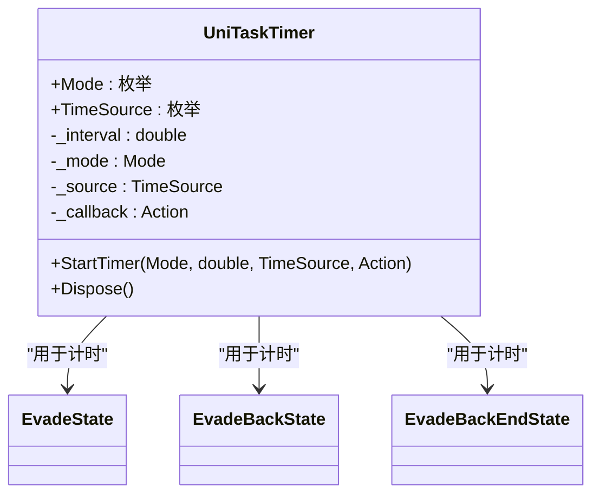

**图示来源**
- [UniTaskTimer.cs](file://Assets/Scripts/Tool/UniTaskTimer.cs#L1-L47)

**本节来源**
- [StateMachine.cs](file://Assets/Scripts/Controller/FSM/StateMachine.cs#L38-L50)
- [UniTaskTimer.cs](file://Assets/Scripts/Tool/UniTaskTimer.cs#L1-L47)

## 后跳闪避特殊处理

### 特殊处理逻辑
后跳闪避（EvadeBackState）与普通闪避的主要区别在于其后续状态转换。普通闪避完成后直接进入奔跑状态，而后跳闪避则需要经过一个专门的收尾状态（EvadeBackEndState），这为后跳动作提供了更完整的动画序列和恢复过程。

```mermaid
flowchart LR
A[EvadeBackState] --> B[EvadeBackEndState]
B --> C[IdleState]
D[EvadeState] --> E[RunState]
style A fill:#f9f,stroke:#333
style B fill:#f9f,stroke:#333
style C fill:#ccf,stroke:#333
style D fill:#ff9,stroke:#333
style E fill:#cfc,stroke:#333
classDef special fill:#f9f,stroke:#333;
classDef normal fill:#ff9,stroke:#333;
classDef end fill:#ccf,stroke:#333;
classDef run fill:#cfc,stroke:#333;
class A,B special
class D normal
class C end
class E run
```

**图示来源**
- [EvadeBackState.cs](file://Assets/Scripts/Controller/FSM/CharacterState/EvadeBackState.cs#L1-L26)
- [EvadeBackEndState.cs](file://Assets/Scripts/Controller/FSM/CharacterState/EvadeBackEndState.cs#L1-L31)

### 动画同步
后跳闪避的动画同步通过精确的计时器控制实现。EvadeBackState持续0.4秒，播放"Evade_Back"动画；随后EvadeBackEndState持续1.3秒，播放"Evade_Back_End"动画。这种分阶段的动画设计确保了动作的流畅性和视觉效果。

**本节来源**
- [EvadeBackState.cs](file://Assets/Scripts/Controller/FSM/CharacterState/EvadeBackState.cs#L1-L26)
- [EvadeBackEndState.cs](file://Assets/Scripts/Controller/FSM/CharacterState/EvadeBackEndState.cs#L1-L31)

## 时间轴示意图

### 前向闪避时间轴
```mermaid
gantt
title 前向闪避时间轴
dateFormat s
section EvadeState
动画播放 :a1, 0, 0.4
状态锁定 :a2, 0, 0.4
section RunState
状态转换 :a3, 0.4, 0.1
note right of a1: 播放"Evade_Front"动画
note right of a2: StateLocked = true
note right of a3: StateLocked = false
```

**图示来源**
- [EvadeState.cs](file://Assets/Scripts/Controller/FSM/CharacterState/EvadeState.cs#L5-L20)

### 后向闪避时间轴
```mermaid
gantt
title 后向闪避时间轴
dateFormat s
section EvadeBackState
动画播放 :b1, 0, 0.4
状态锁定 :b2, 0, 0.4
section EvadeBackEndState
动画播放 :b3, 0.4, 1.3
状态锁定 :b4, 0.4, 1.3
section IdleState
状态转换 :b5, 1.7, 0.1
note right of b1: 播放"Evade_Back"动画
note right of b2: StateLocked = true
note right of b3: 播放"Evade_Back_End"动画
note right of b4: StateLocked = true
note right of b5: StateLocked = false
```

**图示来源**
- [EvadeBackState.cs](file://Assets/Scripts/Controller/FSM/CharacterState/EvadeBackState.cs#L5-L20)
- [EvadeBackEndState.cs](file://Assets/Scripts/Controller/FSM/CharacterState/EvadeBackEndState.cs#L5-L25)

**本节来源**
- [EvadeState.cs](file://Assets/Scripts/Controller/FSM/CharacterState/EvadeState.cs#L5-L20)
- [EvadeBackState.cs](file://Assets/Scripts/Controller/FSM/CharacterState/EvadeBackState.cs#L5-L20)
- [EvadeBackEndState.cs](file://Assets/Scripts/Controller/FSM/CharacterState/EvadeBackEndState.cs#L5-L25)

## 开发者指导

### 闪避参数调整
开发者可以通过修改以下参数来调整闪避行为：
- **闪避持续时间**：在EvadeState、EvadeBackState和EvadeBackEndState中调整UniTaskTimer的持续时间参数
- **动画名称**：在Play()方法中修改动画剪辑名称
- **状态转换目标**：在ChangeState<T>()方法中修改目标状态类型

### 添加新闪避变体
要添加新的闪避变体，建议遵循以下步骤：
1. 创建新的状态类，继承BaseState
2. 在OnEnter()方法中设置状态锁定和播放相应动画
3. 使用UniTaskTimer设置闪避持续时间
4. 在计时器回调中设置状态解锁和状态转换
5. 在PlayerController的Awake()方法中注册新状态

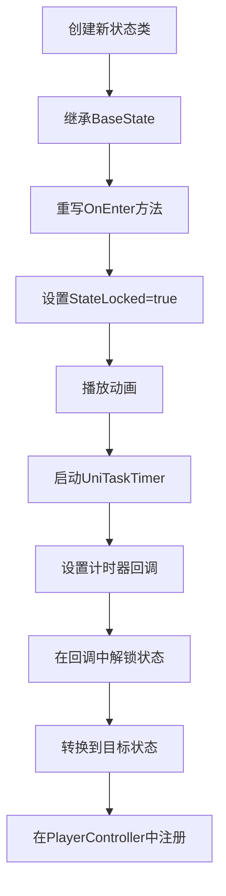

**本节来源**
- [EvadeState.cs](file://Assets/Scripts/Controller/FSM/CharacterState/EvadeState.cs#L1-L23)
- [PlayerController.cs](file://Assets/Scripts/Controller/PlayerController.cs#L29-L74)