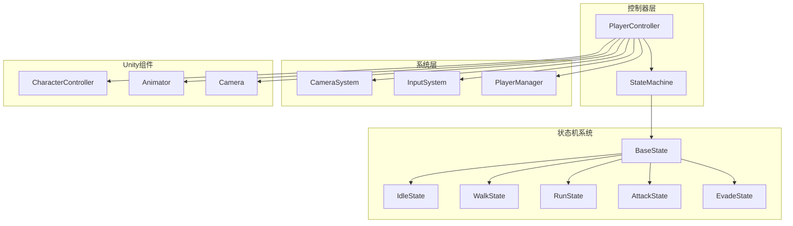
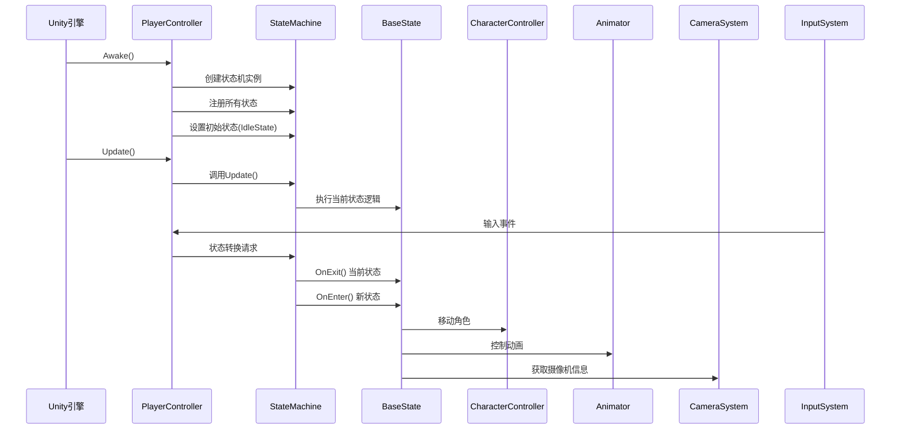
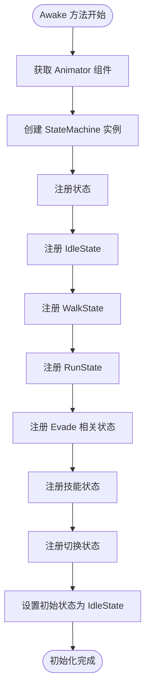
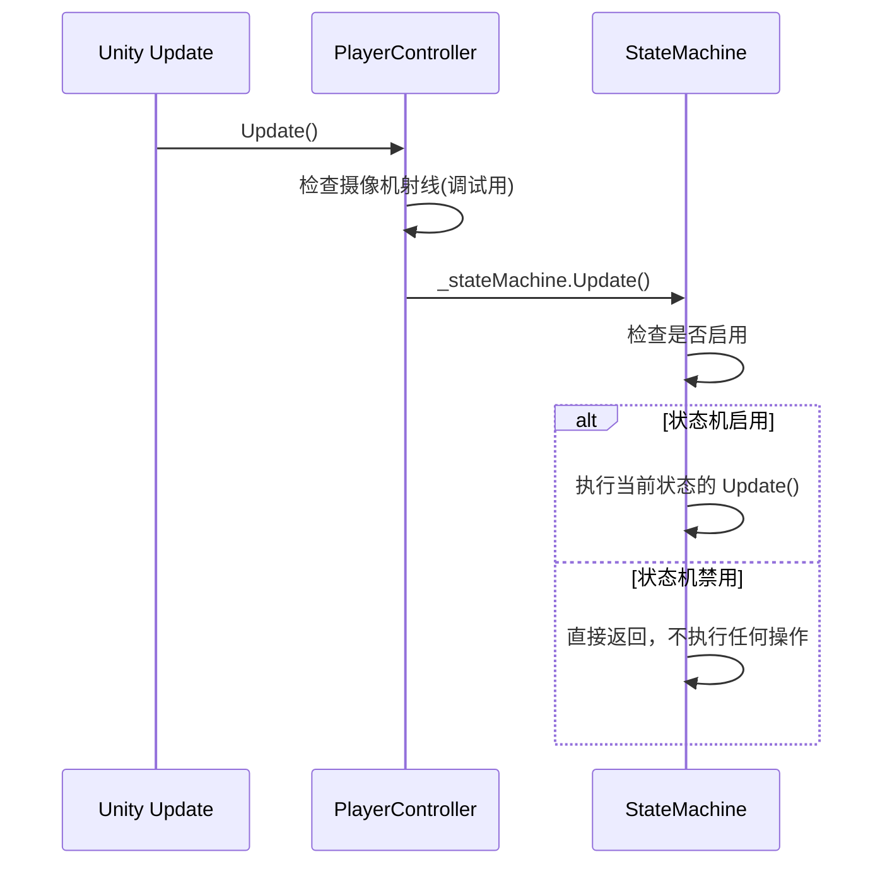
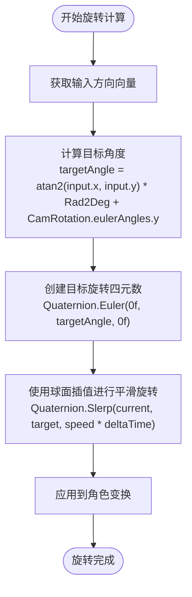
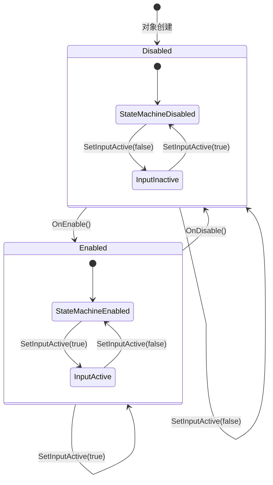
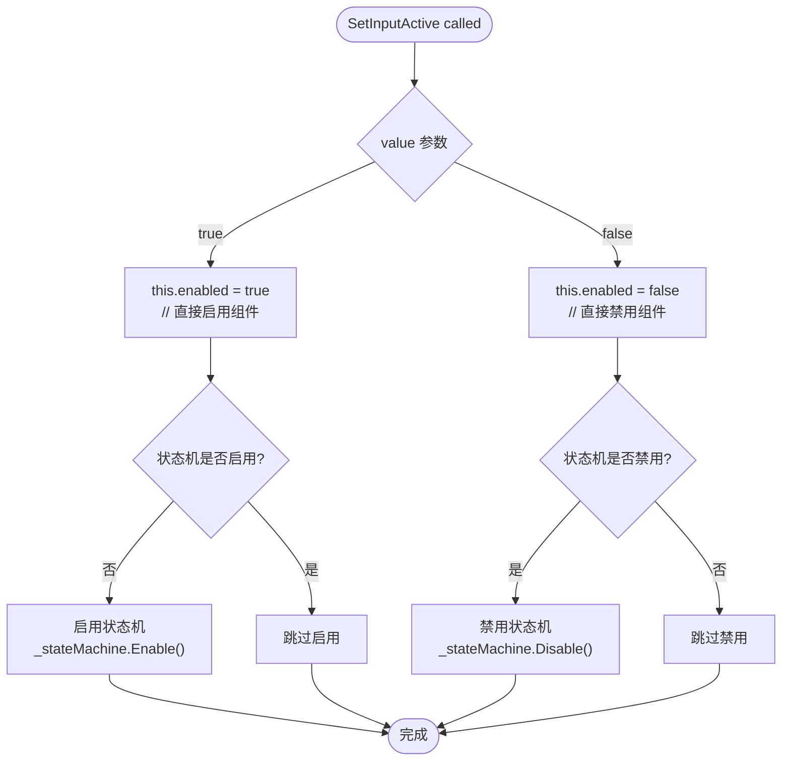
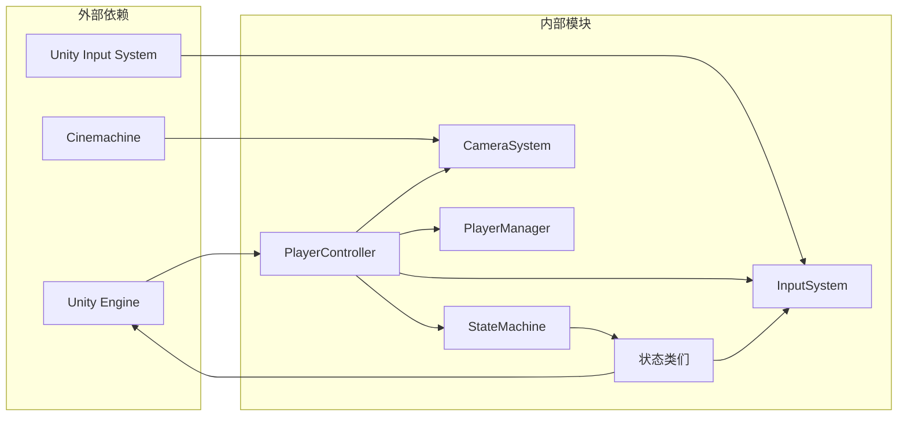

# PlayerController 类详细文档

<cite>
**本文档中引用的文件**
- [PlayerController.cs](file://Assets/Scripts/Controller/PlayerController.cs)
- [StateMachine.cs](file://Assets/Scripts/Controller/FSM/StateMachine.cs)
- [BaseState.cs](file://Assets/Scripts/Controller/FSM/BaseState.cs)
- [IdleState.cs](file://Assets/Scripts/Controller/FSM/CharacterState/IdleState.cs)
- [WalkState.cs](file://Assets/Scripts/Controller/FSM/CharacterState/WalkState.cs)
- [RunState.cs](file://Assets/Scripts/Controller/FSM/CharacterState/RunState.cs)
- [AttackState.cs](file://Assets/Scripts/Controller/FSM/CharacterState/AttackState.cs)
- [EvadeState.cs](file://Assets/Scripts/Controller/FSM/CharacterState/EvadeState.cs)
- [CameraSystem.cs](file://Assets/Scripts/Manager/CameraSystem/CameraSystem.cs)
- [InputSystem.cs](file://Assets/Scripts/Manager/InputSystem/InputSystem.cs)
</cite>

## 目录
1. [简介](#简介)
2. [项目结构](#项目结构)
3. [核心组件](#核心组件)
4. [架构概览](#架构概览)
5. [详细组件分析](#详细组件分析)
6. [依赖关系分析](#依赖关系分析)
7. [性能考虑](#性能考虑)
8. [故障排除指南](#故障排除指南)
9. [结论](#结论)

## 简介

PlayerController 是 Unity 游戏中单个角色的核心控制器类，负责协调角色的行为、状态管理和与游戏系统的交互。该类采用状态机模式设计，通过 StateMachine 管理角色的各种行为状态，同时与 Unity 的 Animator 和 CharacterController 组件紧密集成，实现流畅的角色动画和物理运动。

PlayerController 作为游戏逻辑层与 Unity 引擎之间的桥梁，不仅管理角色的基本移动和动作，还处理复杂的战斗系统、技能释放和角色切换等高级功能。通过精心设计的状态机架构，确保了角色行为的一致性和可扩展性。

## 项目结构

PlayerController 类位于项目的控制器层次结构中，与状态机系统、输入系统和相机系统协同工作：

**图表来源**
- [PlayerController.cs](file://Assets/Scripts/Controller/PlayerController.cs#L1-L103)
- [StateMachine.cs](file://Assets/Scripts/Controller/FSM/StateMachine.cs#L1-L115)

**章节来源**
- [PlayerController.cs](file://Assets/Scripts/Controller/PlayerController.cs#L1-L103)

## 核心组件

PlayerController 类包含以下核心组件和字段：

### 主要字段

| 字段名称 | 类型 | 描述 |
|---------|------|------|
| `_animator` | Animator | Unity Animator 组件，用于控制角色动画 |
| `_characterController` | CharacterController | Unity CharacterController 组件，处理角色物理移动 |
| `_cameraSystem` | CameraSystem | 相机系统，提供摄像机位置和旋转信息 |
| `_stateMachine` | StateMachine | 状态机实例，管理角色状态转换 |
| `RotationSpeed` | float | 角色旋转速度参数，默认值为 10f |
| `AttackLength` | int | 攻击连击长度，默认值为 4 |
| `PlayerData` | ScriptableObject | 角色数据对象，存储角色配置信息 |
| `LookAtPoint` | Transform | 观察点变换，用于角色朝向计算 |

### 属性

| 属性名称 | 类型 | 描述 |
|---------|------|------|
| `CamPosition` | Vector3 | 相机位置，通过 CameraSystem 获取 |
| `CamRotation` | Quaternion | 相机旋转，通过 CameraSystem 获取 |

**章节来源**
- [PlayerController.cs](file://Assets/Scripts/Controller/PlayerController.cs#L5-L20)

## 架构概览

PlayerController 采用分层架构设计，从上到下分为表现层、控制层和系统层：

**图表来源**
- [PlayerController.cs](file://Assets/Scripts/Controller/PlayerController.cs#L22-L50)
- [StateMachine.cs](file://Assets/Scripts/Controller/FSM/StateMachine.cs#L15-L35)

## 详细组件分析

### StateMachine 初始化过程

StateMachine 的初始化是 PlayerController 生命周期中的关键步骤：

**图表来源**
- [PlayerController.cs](file://Assets/Scripts/Controller/PlayerController.cs#L22-L50)

StateMachine 在构造函数中接收三个核心组件：
- `PlayerController` 实例，建立状态机与控制器的联系
- `CharacterController`，提供物理移动能力
- `Animator`，控制角色动画播放

状态注册过程包括：
- 基础移动状态：Idle、Walk、Run
- 防御状态：Evade、EvadeBack、EvadeBackEnd
- 技能状态：BigSkill
- 攻击状态：Attack、AttackEnd
- 角色切换状态：SwitchIn、SwitchOut

**章节来源**
- [PlayerController.cs](file://Assets/Scripts/Controller/PlayerController.cs#L22-L50)
- [StateMachine.cs](file://Assets/Scripts/Controller/FSM/StateMachine.cs#L15-L35)

### Update 方法中的状态机更新

PlayerController 的 Update 方法极其简洁，仅调用状态机的 Update 方法：

**图表来源**
- [PlayerController.cs](file://Assets/Scripts/Controller/PlayerController.cs#L52-L56)
- [StateMachine.cs](file://Assets/Scripts/Controller/FSM/StateMachine.cs#L58-L62)

这种设计模式的优势：
- **单一职责原则**：PlayerController 专注于状态机协调，不直接处理具体逻辑
- **解耦设计**：状态逻辑完全封装在各个状态类中
- **性能优化**：禁用状态下完全跳过状态机更新，减少不必要的计算

**章节来源**
- [PlayerController.cs](file://Assets/Scripts/Controller/PlayerController.cs#L52-L56)
- [StateMachine.cs](file://Assets/Scripts/Controller/FSM/StateMachine.cs#L58-L62)

### SetCharacterRotation 方法详解

SetCharacterRotation 方法实现了基于摄像机朝向和输入方向的角色旋转计算：

**图表来源**
- [PlayerController.cs](file://Assets/Scripts/Controller/PlayerController.cs#L58-L72)

旋转计算的关键要素：
- **输入方向**：通过 `InputSystem.Instance.MoveDirectionInput` 获取
- **摄像机参考**：使用摄像机的 Y 轴旋转角度作为基准
- **平滑插值**：通过 `Quaternion.Slerp` 实现平滑过渡
- **时间缩放**：乘以 `Time.deltaTime` 确保帧率无关性

**章节来源**
- [PlayerController.cs](file://Assets/Scripts/Controller/PlayerController.cs#L58-L72)

### 生命周期方法分析

PlayerController 实现了 Unity 的生命周期方法来管理状态机的启用和禁用：

**图表来源**
- [PlayerController.cs](file://Assets/Scripts/Controller/PlayerController.cs#L74-L88)

OnEnable 方法的执行流程：
1. 启用状态机：调用 `_stateMachine.Enable()`
2. 设置输入激活：调用 `SetInputActive(true)`

OnDisable 方法的执行流程：
1. 禁用状态机：调用 `_stateMachine.Disable()`
2. 设置输入禁用：调用 `SetInputActive(false)`

**章节来源**
- [PlayerController.cs](file://Assets/Scripts/Controller/PlayerController.cs#L74-L88)

### SetInputActive 方法的统一控制机制

SetInputActive 方法实现了对组件启用状态和输入响应的统一控制：

**图表来源**
- [PlayerController.cs](file://Assets/Scripts/Controller/PlayerController.cs#L90-L102)

这种方法的优势：
- **简单高效**：直接设置 `this.enabled` 即可禁用整个组件
- **一致性**：确保组件状态与状态机状态同步
- **安全性**：防止在非活动状态下处理输入事件

**章节来源**
- [PlayerController.cs](file://Assets/Scripts/Controller/PlayerController.cs#L90-L102)

### CameraSystem 集成

PlayerController 通过属性访问 CameraSystem 提供的摄像机信息：

| 属性 | 类型 | 来源 | 用途 |
|------|------|------|------|
| `CamPosition` | Vector3 | CameraSystem.CamPosition | 获取摄像机世界位置 |
| `CamRotation` | Quaternion | CameraSystem.CamRotation | 获取摄像机旋转角度 |

CameraSystem 的工作原理：
- 在 Update 中实时更新摄像机状态
- 使用 Cinemachine 系统获取精确的摄像机信息
- 提供全局访问接口，避免重复查询

**章节来源**
- [PlayerController.cs](file://Assets/Scripts/Controller/PlayerController.cs#L21-L23)
- [CameraSystem.cs](file://Assets/Scripts/Manager/CameraSystem/CameraSystem.cs#L25-L30)

## 依赖关系分析

PlayerController 的依赖关系展现了清晰的分层架构：

**图表来源**
- [PlayerController.cs](file://Assets/Scripts/Controller/PlayerController.cs#L1-L3)
- [StateMachine.cs](file://Assets/Scripts/Controller/FSM/StateMachine.cs#L1-L5)

主要依赖关系：
- **Unity 引擎**：提供基础组件（Animator、CharacterController、Transform）
- **Cinemachine**：提供高级摄像机功能
- **Input System**：提供现代输入处理
- **自定义系统**：CameraSystem、InputSystem、PlayerManager

**章节来源**
- [PlayerController.cs](file://Assets/Scripts/Controller/PlayerController.cs#L1-L3)
- [StateMachine.cs](file://Assets/Scripts/Controller/FSM/StateMachine.cs#L1-L5)

## 性能考虑

PlayerController 的设计充分考虑了性能优化：

### 更新频率优化
- **最小化 Update 开销**：Update 方法只调用状态机的 Update，避免重复计算
- **条件检查**：状态机禁用时完全跳过更新逻辑
- **帧率无关性**：使用 `Time.deltaTime` 确保旋转平滑度不受帧率影响

### 内存管理
- **对象池化**：状态机使用 Dictionary 存储状态，避免频繁创建销毁
- **事件订阅管理**：每个状态在进入时订阅事件，在退出时取消订阅
- **及时清理**：状态机提供 Dispose 方法进行资源清理

### 输入处理优化
- **统一输入控制**：SetInputActive 方法一次性控制所有输入响应
- **事件驱动**：基于事件的状态转换，减少轮询开销
- **输入过滤**：通过 enabled 属性快速过滤无效输入

## 故障排除指南

### 常见问题及解决方案

#### 状态机无法正常工作
**症状**：角色状态不按预期转换
**原因**：状态未正确注册或状态机被禁用
**解决**：检查 Awaken 方法中的状态注册，确认状态机启用状态

#### 角色旋转异常
**症状**：角色旋转不平滑或朝向错误
**原因**：摄像机信息获取失败或输入方向计算错误
**解决**：验证 CameraSystem 正常工作，检查输入系统配置

#### 输入无响应
**症状**：按键操作无法触发角色动作
**原因**：组件禁用或输入系统未正确初始化
**解决**：检查 SetInputActive 调用，确认输入系统初始化

**章节来源**
- [PlayerController.cs](file://Assets/Scripts/Controller/PlayerController.cs#L74-L102)
- [StateMachine.cs](file://Assets/Scripts/Controller/FSM/StateMachine.cs#L86-L114)

## 结论

PlayerController 类是一个设计精良的角色控制器，体现了现代游戏开发的最佳实践：

### 设计优势
- **清晰的职责分离**：控制器负责协调，状态机负责逻辑
- **高度的可扩展性**：新增状态只需继承 BaseState
- **良好的性能特性**：最小化更新开销，优化内存使用
- **强大的集成能力**：与 Unity 生态系统无缝集成

### 架构特点
- **状态机模式**：确保状态转换的可控性和可预测性
- **事件驱动**：提高响应效率和代码可维护性
- **组件化设计**：便于测试和独立开发

### 应用价值
PlayerController 为游戏开发提供了可靠的基础框架，支持复杂的角色行为系统，同时保持了良好的性能和可扩展性。其设计理念可以广泛应用于各种类型的游戏项目，特别是需要复杂角色控制的第三人称或动作游戏。

通过深入理解 PlayerController 的设计原理和实现细节，开发者可以更好地利用这一框架，构建出高质量的游戏角色控制系统。