# PlayerManager单例类详细文档

<cite>
**本文档中引用的文件**
- [PlayerManager.cs](file://Assets/Scripts/Manager/PlayerManager/PlayerManager.cs)
- [PlayerController.cs](file://Assets/Scripts/Controller/PlayerController.cs)
- [PlayerInfo.cs](file://Assets/Scripts/Data/SOBase/PlayerInfo.cs)
- [TeamInfo.cs](file://Assets/Scripts/Data/SOBase/TeamInfo.cs)
- [PlayerEvents.cs](file://Assets/Scripts/EventData/PlayerEvents.cs)
- [Singleton.cs](file://Assets/Scripts/Tool/Singleton.cs)
- [InputSystem.cs](file://Assets/Scripts/Manager/InputSystem/InputSystem.cs)
- [GameMain.cs](file://Assets/Scripts/Manager/GameMain.cs)
- [StateMachine.cs](file://Assets/Scripts/Controller/FSM/StateMachine.cs)
- [BaseState.cs](file://Assets/Scripts/Controller/FSM/BaseState.cs)
- [SwitchInState.cs](file://Assets/Scripts/Controller/FSM/CharacterState/SwitchInState.cs)
- [SwitchOutState.cs](file://Assets/Scripts/Controller/FSM/CharacterState/SwitchOutState.cs)
</cite>

## 目录
1. [简介](#简介)
2. [项目结构](#项目结构)
3. [核心组件](#核心组件)
4. [架构概览](#架构概览)
5. [详细组件分析](#详细组件分析)
6. [依赖关系分析](#依赖关系分析)
7. [性能考虑](#性能考虑)
8. [故障排除指南](#故障排除指南)
9. [结论](#结论)

## 简介

PlayerManager是一个单例类，作为游戏中的全局玩家管理器，负责管理所有角色实例的生命周期、状态切换和角色控制。它通过PlayerControllers列表维护所有可用角色，并提供了角色切换、加载和初始化的核心功能。

该类采用单例模式设计，确保在整个游戏生命周期中只有一个PlayerManager实例存在，从而统一管理所有玩家相关的操作。

## 项目结构

PlayerManager位于项目的管理器层次结构中，与其他核心管理器协同工作：

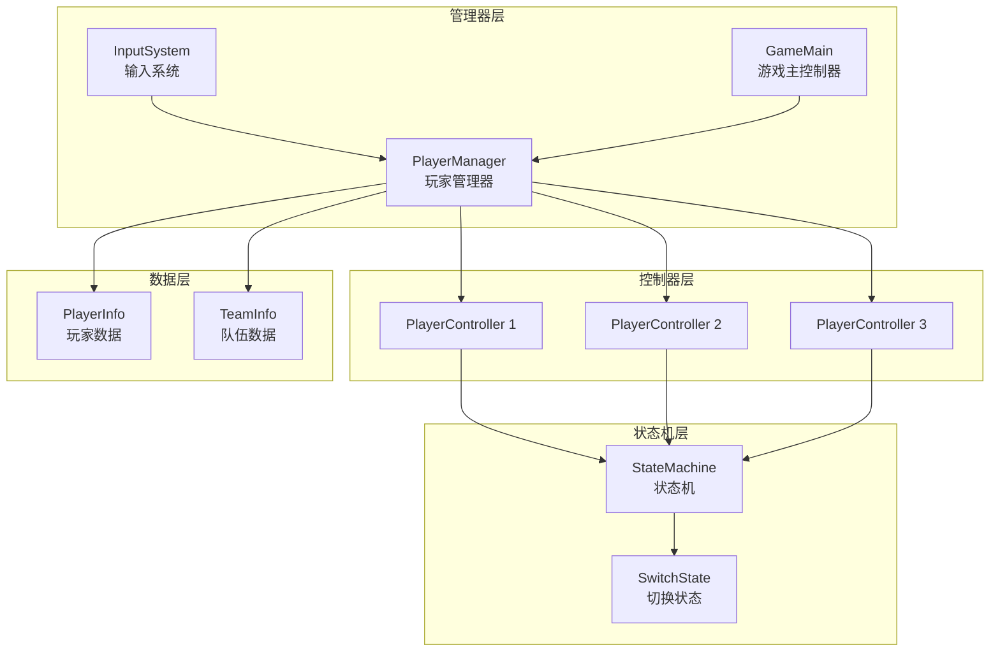

**图表来源**
- [PlayerManager.cs](file://Assets/Scripts/Manager/PlayerManager/PlayerManager.cs#L1-L85)
- [PlayerController.cs](file://Assets/Scripts/Controller/PlayerController.cs#L1-L94)
- [GameMain.cs](file://Assets/Scripts/Manager/GameMain.cs#L1-L74)

**章节来源**
- [PlayerManager.cs](file://Assets/Scripts/Manager/PlayerManager/PlayerManager.cs#L1-L85)
- [GameMain.cs](file://Assets/Scripts/Manager/GameMain.cs#L1-L74)

## 核心组件

PlayerManager包含以下核心组件：

### 单例基类继承
PlayerManager继承自SingletonBase<T>，确保全局唯一性：

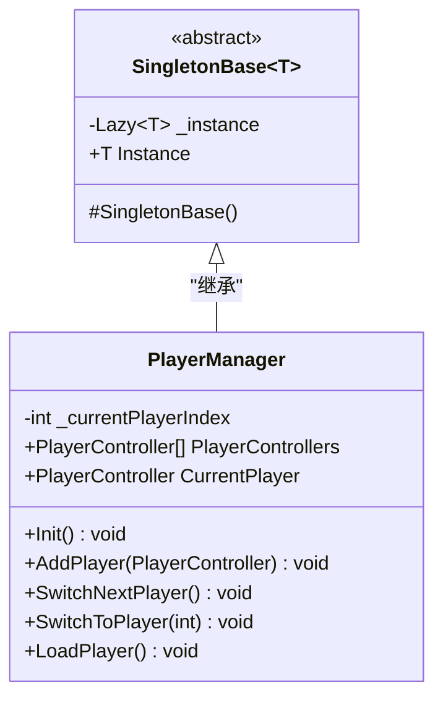

**图表来源**
- [Singleton.cs](file://Assets/Scripts/Tool/Singleton.cs#L1-L24)
- [PlayerManager.cs](file://Assets/Scripts/Manager/PlayerManager/PlayerManager.cs#L15-L85)

### 主要属性和字段

| 属性名称 | 类型 | 描述 | 默认值 |
|---------|------|------|--------|
| _currentPlayerIndex | int | 当前活动角色索引 | 0 |
| PlayerControllers | List<PlayerController> | 所有角色控制器列表 | new List<PlayerController>() |
| CurrentPlayer | PlayerController | 当前活动角色控制器 | null |

**章节来源**
- [PlayerManager.cs](file://Assets/Scripts/Manager/PlayerManager/PlayerManager.cs#L15-L18)

## 架构概览

PlayerManager的整体架构体现了管理器模式的设计原则：

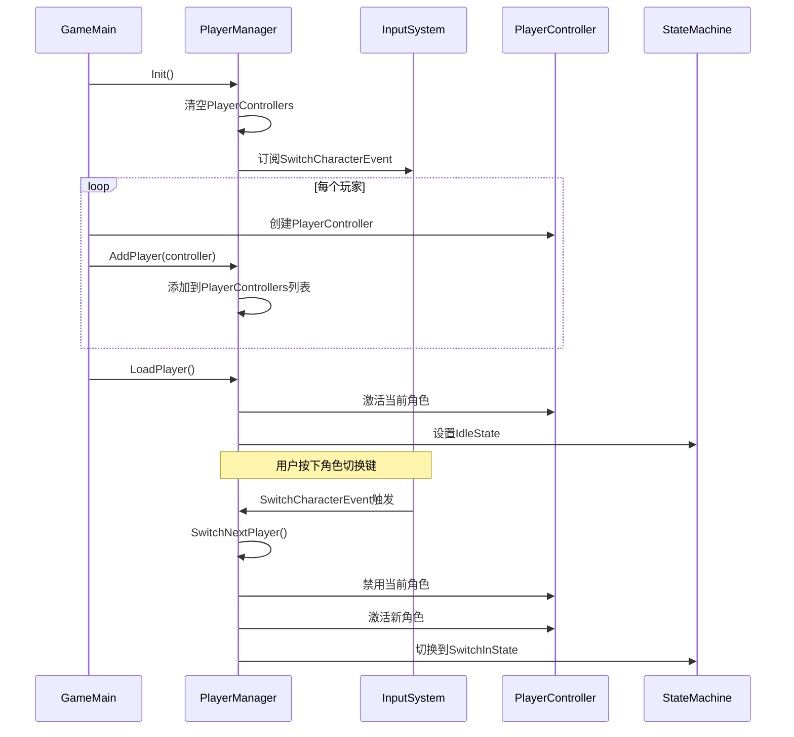

**图表来源**
- [GameMain.cs](file://Assets/Scripts/Manager/GameMain.cs#L15-L50)
- [PlayerManager.cs](file://Assets/Scripts/Manager/PlayerManager/PlayerManager.cs#L20-L85)
- [InputSystem.cs](file://Assets/Scripts/Manager/InputSystem/InputSystem.cs#L50-L60)

## 详细组件分析

### 初始化流程 (Init方法)

Init方法负责PlayerManager的完整初始化过程：

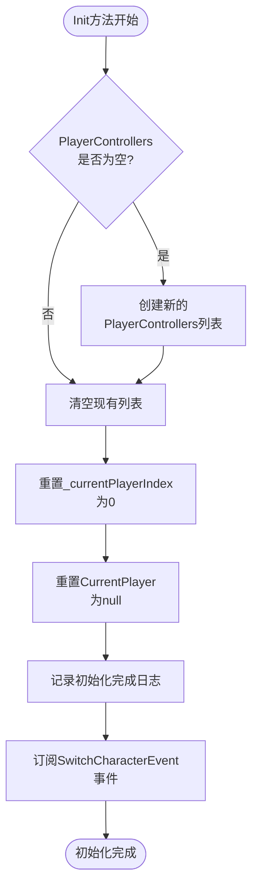

**图表来源**
- [PlayerManager.cs](file://Assets/Scripts/Manager/PlayerManager/PlayerManager.cs#L20-L30)

初始化过程的关键步骤：
1. **列表初始化**：确保PlayerControllers列表存在且为空
2. **索引重置**：将_currentPlayerIndex设置为0
3. **当前玩家重置**：将CurrentPlayer设置为null
4. **事件订阅**：订阅SwitchCharacterEvent事件以响应角色切换输入

**章节来源**
- [PlayerManager.cs](file://Assets/Scripts/Manager/PlayerManager/PlayerManager.cs#L20-L30)

### 角色切换逻辑

PlayerManager提供了两种主要的角色切换方法：SwitchNextPlayer和SwitchToPlayer。

#### SwitchNextPlayer方法

该方法实现了循环角色切换功能：

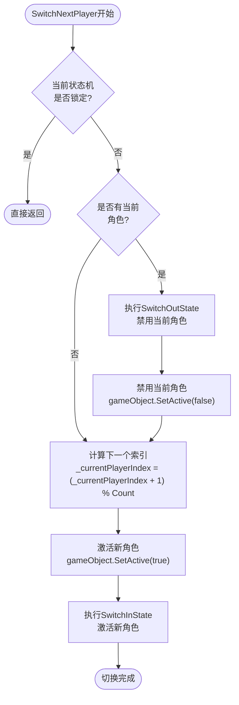

**图表来源**
- [PlayerManager.cs](file://Assets/Scripts/Manager/PlayerManager/PlayerManager.cs#L35-L55)

#### SwitchToPlayer方法

该方法允许直接跳转到指定索引的角色：

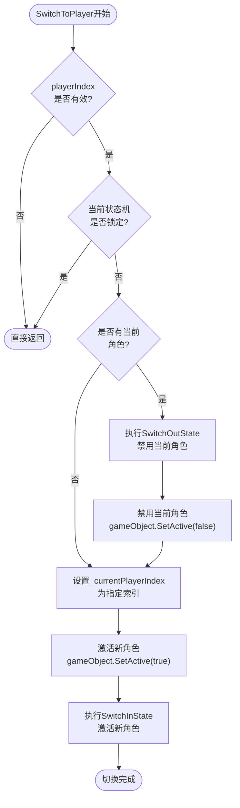

**图表来源**
- [PlayerManager.cs](file://Assets/Scripts/Manager/PlayerManager/PlayerManager.cs#L57-L77)

### 状态锁定机制

PlayerManager通过检查状态机的StateLocked属性来防止在状态转换过程中进行角色切换：

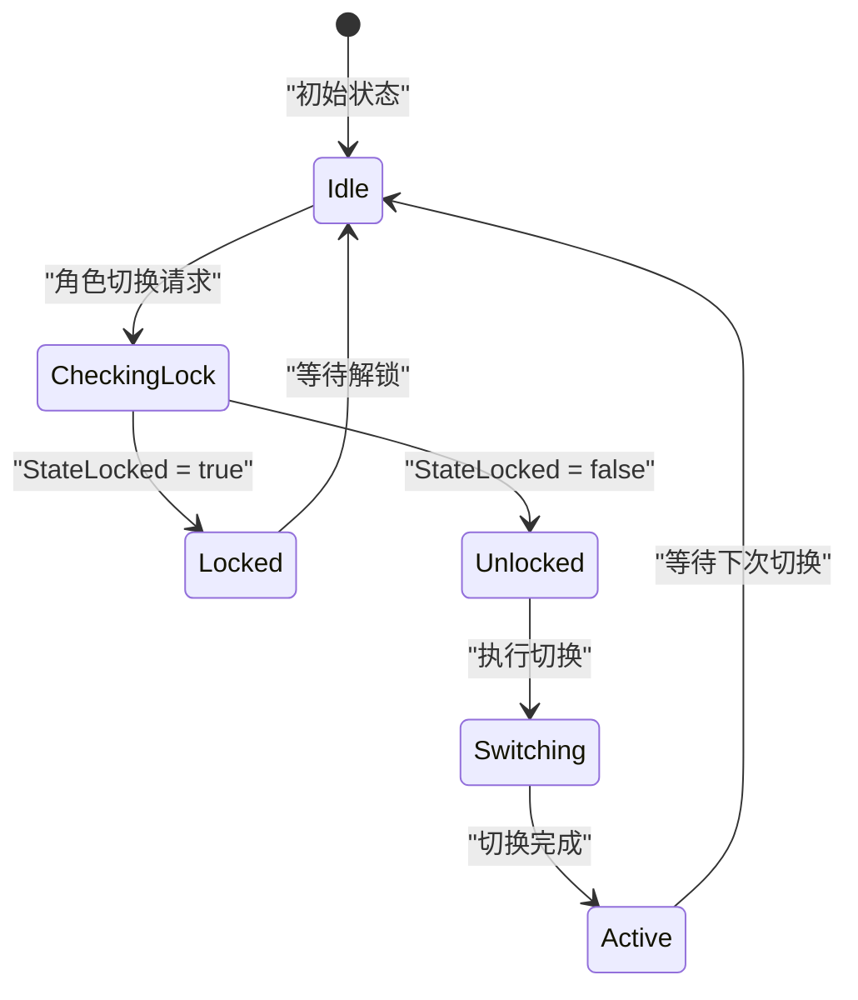

**图表来源**
- [PlayerManager.cs](file://Assets/Scripts/Manager/PlayerManager/PlayerManager.cs#L35-L36)
- [StateMachine.cs](file://Assets/Scripts/Controller/FSM/StateMachine.cs#L25-L26)

**章节来源**
- [PlayerManager.cs](file://Assets/Scripts/Manager/PlayerManager/PlayerManager.cs#L35-L77)

### 角色加载流程 (LoadPlayer方法)

LoadPlayer方法负责在游戏初始化时正确设置所有角色的状态：

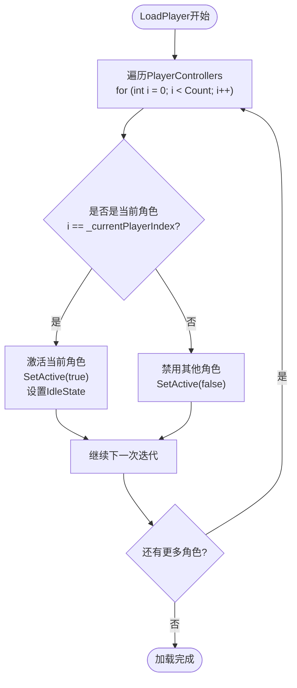

**图表来源**
- [PlayerManager.cs](file://Assets/Scripts/Manager/PlayerManager/PlayerManager.cs#L79-L85)

**章节来源**
- [PlayerManager.cs](file://Assets/Scripts/Manager/PlayerManager/PlayerManager.cs#L79-L85)

### AddPlayer方法

AddPlayer方法用于向PlayerManager添加新的角色控制器：

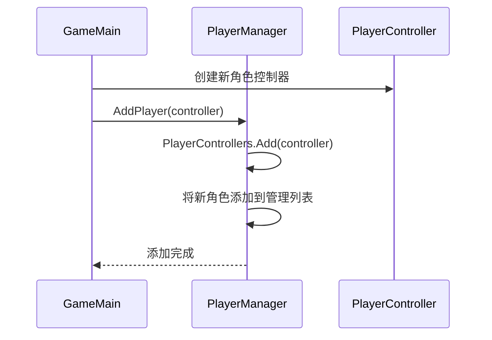

**图表来源**
- [PlayerManager.cs](file://Assets/Scripts/Manager/PlayerManager/PlayerManager.cs#L32-L34)
- [GameMain.cs](file://Assets/Scripts/Manager/GameMain.cs#L35-L45)

**章节来源**
- [PlayerManager.cs](file://Assets/Scripts/Manager/PlayerManager/PlayerManager.cs#L32-L34)

### 与InputSystem的集成

PlayerManager与InputSystem紧密集成，通过事件驱动的方式处理角色切换：

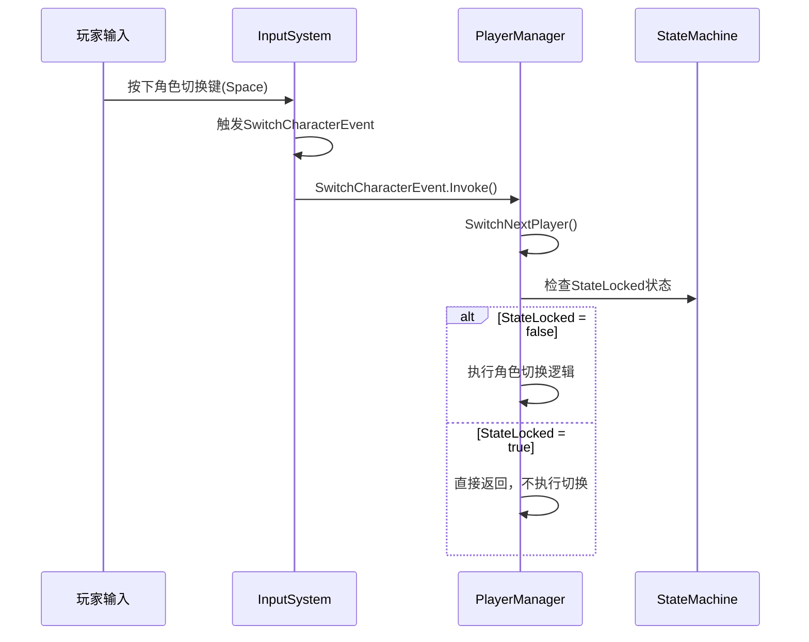

**图表来源**
- [InputSystem.cs](file://Assets/Scripts/Manager/InputSystem/InputSystem.cs#L50-L55)
- [PlayerManager.cs](file://Assets/Scripts/Manager/PlayerManager/PlayerManager.cs#L28-L29)

**章节来源**
- [InputSystem.cs](file://Assets/Scripts/Manager/InputSystem/InputSystem.cs#L50-L55)
- [PlayerManager.cs](file://Assets/Scripts/Manager/PlayerManager/PlayerManager.cs#L28-L29)

## 依赖关系分析

PlayerManager与其他组件的依赖关系：

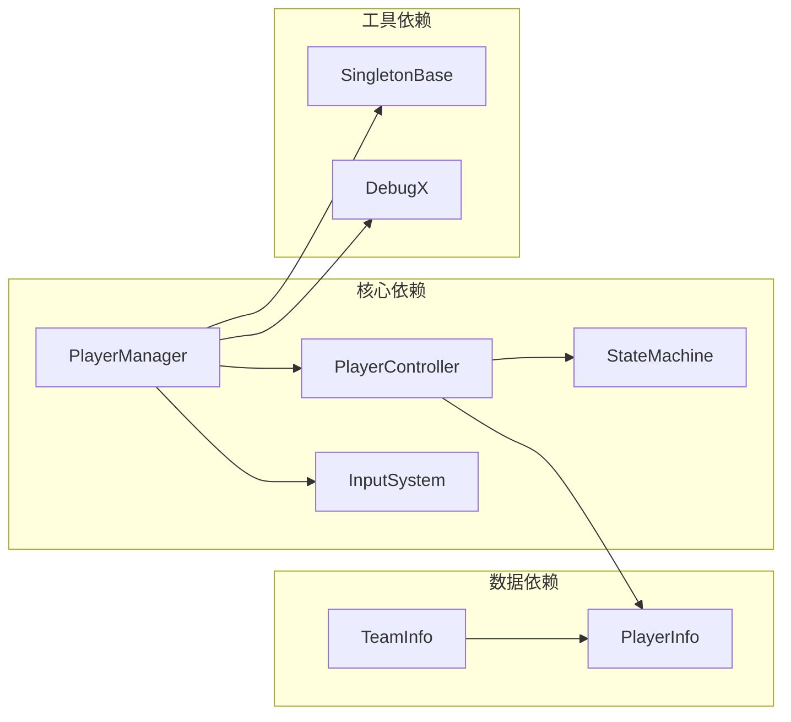

**图表来源**
- [PlayerManager.cs](file://Assets/Scripts/Manager/PlayerManager/PlayerManager.cs#L1-L2)
- [PlayerController.cs](file://Assets/Scripts/Controller/PlayerController.cs#L1-L5)
- [StateMachine.cs](file://Assets/Scripts/Controller/FSM/StateMachine.cs#L1-L5)

**章节来源**
- [PlayerManager.cs](file://Assets/Scripts/Manager/PlayerManager/PlayerManager.cs#L1-L2)
- [PlayerController.cs](file://Assets/Scripts/Controller/PlayerController.cs#L1-L5)
- [StateMachine.cs](file://Assets/Scripts/Controller/FSM/StateMachine.cs#L1-L5)

## 性能考虑

PlayerManager在设计时考虑了以下性能优化：

### 单例模式的优势
- **内存效率**：确保全局只有一个PlayerManager实例
- **访问速度**：通过静态Instance属性快速访问
- **线程安全**：使用Lazy<T>实现线程安全的延迟初始化

### 状态锁定机制
- **避免竞态条件**：防止在状态转换过程中进行角色切换
- **提升用户体验**：确保角色切换的流畅性和一致性

### 对象池化
- **减少GC压力**：通过对象复用减少垃圾回收频率
- **提高响应速度**：避免频繁的对象创建和销毁

## 故障排除指南

### 常见问题及解决方案

#### 1. 角色切换不生效
**症状**：按下角色切换键但角色没有切换
**可能原因**：
- StateLocked为true（状态机正在执行特殊状态）
- PlayerControllers列表为空
- InputSystem未正确初始化

**解决方案**：
- 检查当前角色的状态机状态
- 验证PlayerControllers列表内容
- 确认InputSystem的初始化顺序

#### 2. 角色加载失败
**症状**：游戏启动时角色未正确显示
**可能原因**：
- LoadPlayer方法未被调用
- PlayerControllers列表中缺少角色
- 角色对象未正确激活

**解决方案**：
- 确保在GameMain中调用LoadPlayer
- 验证所有角色都已添加到PlayerControllers
- 检查角色对象的SetActive状态

#### 3. 内存泄漏
**症状**：游戏运行时间长后出现内存增长
**可能原因**：
- PlayerControllers列表未及时清理
- 状态机事件订阅未正确注销

**解决方案**：
- 在适当位置调用PlayerManager的清理方法
- 确保事件订阅的正确管理

**章节来源**
- [PlayerManager.cs](file://Assets/Scripts/Manager/PlayerManager/PlayerManager.cs#L20-L30)
- [StateMachine.cs](file://Assets/Scripts/Controller/FSM/StateMachine.cs#L86-L114)

## 结论

PlayerManager作为游戏中的核心管理器，成功地实现了以下目标：

### 设计优势
1. **单一职责**：专注于玩家管理，职责明确
2. **松耦合**：与其他组件通过接口交互，降低耦合度
3. **可扩展性**：支持动态添加新角色，易于扩展
4. **线程安全**：采用单例模式确保全局唯一性

### 功能完整性
1. **角色管理**：完整的角色生命周期管理
2. **状态控制**：智能的状态锁定机制
3. **事件集成**：与输入系统的无缝集成
4. **错误处理**：完善的边界检查和异常处理

### 性能表现
1. **高效访问**：通过单例模式提供快速访问
2. **资源优化**：合理的对象管理和状态控制
3. **响应迅速**：及时的角色切换响应

PlayerManager的设计充分体现了现代游戏开发的最佳实践，为游戏的多人协作和角色管理提供了坚实的基础。其模块化的架构设计使得系统既稳定可靠，又具备良好的可维护性和扩展性。