# 玩家管理系统

<cite>
**本文档中引用的文件**
- [PlayerManager.cs](file://Assets/Scripts/Manager/PlayerManager/PlayerManager.cs)
- [PlayerController.cs](file://Assets/Scripts/Controller/PlayerController.cs)
- [GameMain.cs](file://Assets/Scripts/Manager/GameMain.cs)
- [StateMachine.cs](file://Assets/Scripts/Controller/FSM/StateMachine.cs)
- [SwitchInState.cs](file://Assets/Scripts/Controller/FSM/CharacterState/SwitchInState.cs)
- [SwitchOutState.cs](file://Assets/Scripts/Controller/FSM/CharacterState/SwitchOutState.cs)
- [BaseState.cs](file://Assets/Scripts/Controller/FSM/BaseState.cs)
- [IState.cs](file://Assets/Scripts/Controller/FSM/IState.cs)
- [Singleton.cs](file://Assets/Scripts/Tool/Singleton.cs)
- [TeamInfo.cs](file://Assets/Scripts/Data/SOBase/TeamInfo.cs)
- [PlayerInfo.cs](file://Assets/Scripts/Data/SOBase/PlayerInfo.cs)
- [InputSystem.cs](file://Assets/Scripts/Manager/InputSystem/InputSystem.cs)
</cite>

## 目录
1. [简介](#简介)
2. [系统架构概览](#系统架构概览)
3. [核心组件分析](#核心组件分析)
4. [角色切换流程详解](#角色切换流程详解)
5. [PlayerController详细分析](#playercontroller详细分析)
6. [状态机系统](#状态机系统)
7. [输入系统集成](#输入系统集成)
8. [性能考虑](#性能考虑)
9. [故障排除指南](#故障排除指南)
10. [总结](#总结)

## 简介

玩家管理系统是一个基于状态机模式的复杂角色管理框架，负责管理游戏中的多个角色实例、角色切换逻辑以及角色状态控制。该系统采用单例模式管理全局玩家状态，通过状态机控制每个角色的行为，并提供了完整的角色切换机制。

系统的核心特点包括：
- **多角色管理**：支持同时管理多个角色实例
- **无缝切换**：提供平滑的角色切换体验
- **状态隔离**：每个角色拥有独立的状态机
- **输入统一**：集中处理所有角色的输入响应
- **性能优化**：只激活当前角色，其他角色组件被禁用

## 系统架构概览

玩家管理系统采用分层架构设计，主要包含以下层次：

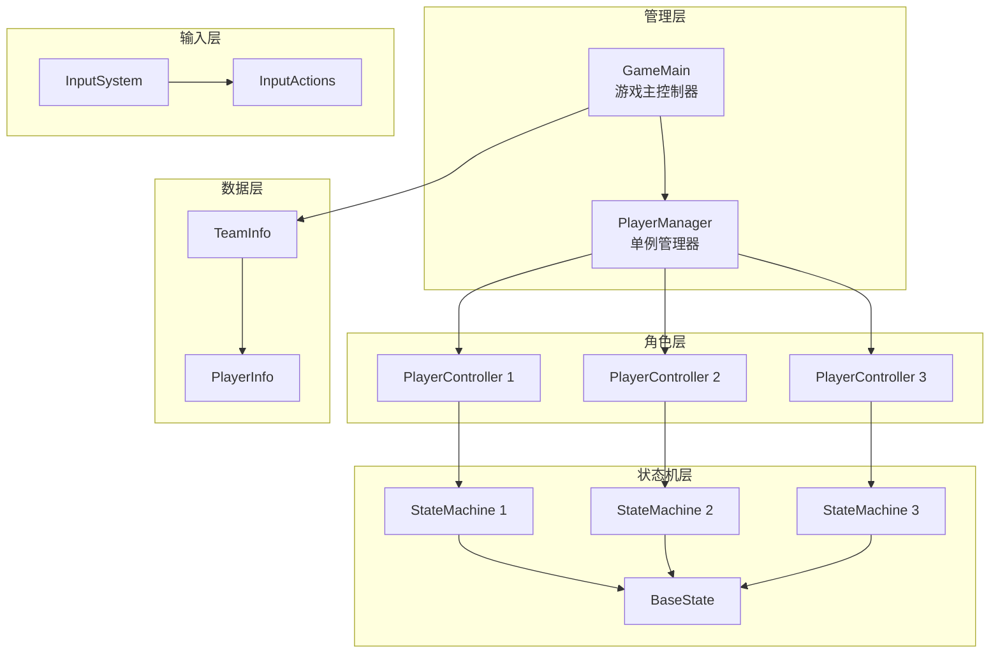

**图表来源**
- [PlayerManager.cs](file://Assets/Scripts/Manager/PlayerManager/PlayerManager.cs#L1-L85)
- [GameMain.cs](file://Assets/Scripts/Manager/GameMain.cs#L1-L74)
- [PlayerController.cs](file://Assets/Scripts/Controller/PlayerController.cs#L1-L94)

**章节来源**
- [PlayerManager.cs](file://Assets/Scripts/Manager/PlayerManager/PlayerManager.cs#L1-L85)
- [GameMain.cs](file://Assets/Scripts/Manager/GameMain.cs#L1-L74)

## 核心组件分析

### PlayerManager单例

PlayerManager是整个玩家管理系统的核心控制器，采用单例模式确保全局唯一性。它负责管理所有PlayerController实例和当前活跃角色。

#### 主要功能特性

| 功能 | 描述 | 实现方式 |
|------|------|----------|
| 多角色管理 | 存储和管理多个PlayerController实例 | `List<PlayerController> PlayerControllers` |
| 当前角色跟踪 | 维护当前活跃角色的引用 | `PlayerController CurrentPlayer` |
| 角色切换控制 | 提供角色切换的入口方法 | `SwitchNextPlayer()`, `SwitchToPlayer()` |
| 生命周期管理 | 初始化和清理玩家资源 | `Init()`, `LoadPlayer()` |
| 输入事件绑定 | 监听角色切换输入事件 | `SwitchCharacterEvent` |

#### 核心属性和方法

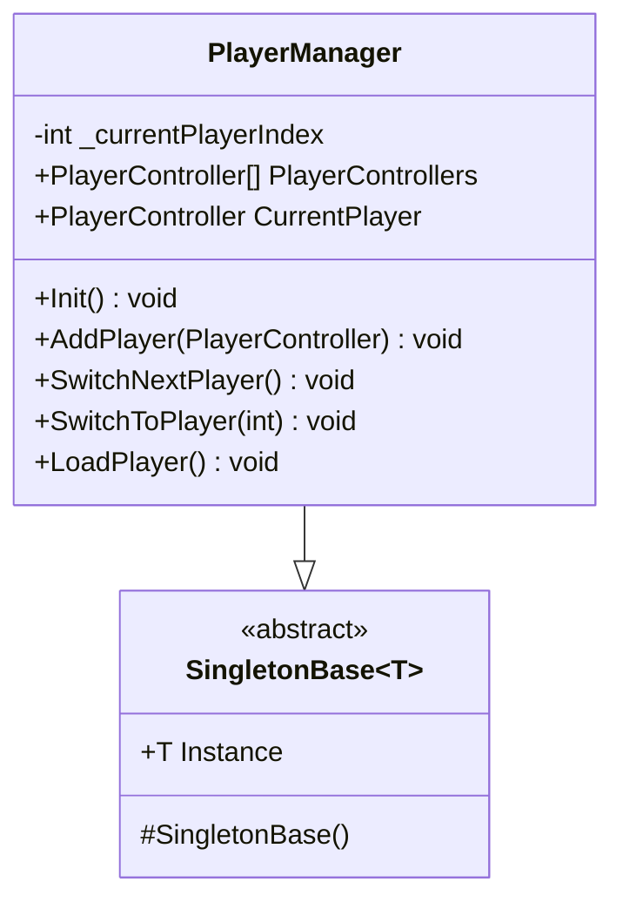

**图表来源**
- [PlayerManager.cs](file://Assets/Scripts/Manager/PlayerManager/PlayerManager.cs#L13-L85)
- [Singleton.cs](file://Assets/Scripts/Tool/Singleton.cs#L1-L24)

### GameMain初始化流程

GameMain负责游戏启动时的玩家系统初始化，包括角色实例化、PlayerController注册和初始状态设置。

#### 初始化步骤

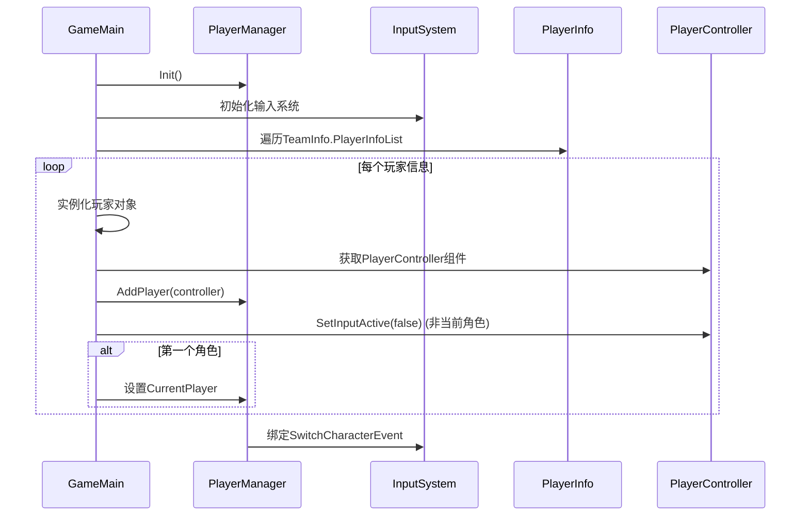

**图表来源**
- [GameMain.cs](file://Assets/Scripts/Manager/GameMain.cs#L20-L50)
- [PlayerManager.cs](file://Assets/Scripts/Manager/PlayerManager/PlayerManager.cs#L18-L25)

**章节来源**
- [PlayerManager.cs](file://Assets/Scripts/Manager/PlayerManager/PlayerManager.cs#L13-L85)
- [GameMain.cs](file://Assets/Scripts/Manager/GameMain.cs#L1-L74)

## 角色切换流程详解

角色切换是玩家管理系统的核心功能，涉及多个组件的协调工作。以下是完整的切换流程：

### 触发机制

角色切换可以通过多种方式触发：
- **输入按键**：默认使用Next/Previous按键
- **程序调用**：通过PlayerManager直接调用切换方法
- **状态限制**：当当前角色处于锁定状态时禁止切换

### 切换流程图

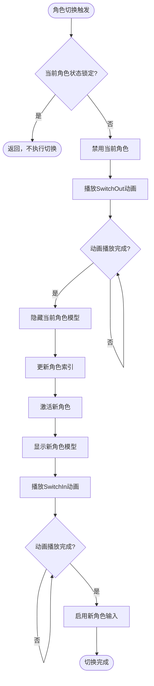

**图表来源**
- [PlayerManager.cs](file://Assets/Scripts/Manager/PlayerManager/PlayerManager.cs#L32-L58)
- [SwitchOutState.cs](file://Assets/Scripts/Controller/FSM/CharacterState/SwitchOutState.cs#L1-L33)
- [SwitchInState.cs](file://Assets/Scripts/Controller/FSM/CharacterState/SwitchInState.cs#L1-L34)

### SwitchOutState执行过程

SwitchOutState负责处理角色退出当前控制的过程：

#### 关键步骤
1. **状态锁定**：设置`StateMachine.StateLocked = true`
2. **动画播放**：播放"Switch_Out"动画
3. **输入禁用**：在动画结束后禁用角色输入
4. **状态重置**：切换到IdleState

#### 执行序列

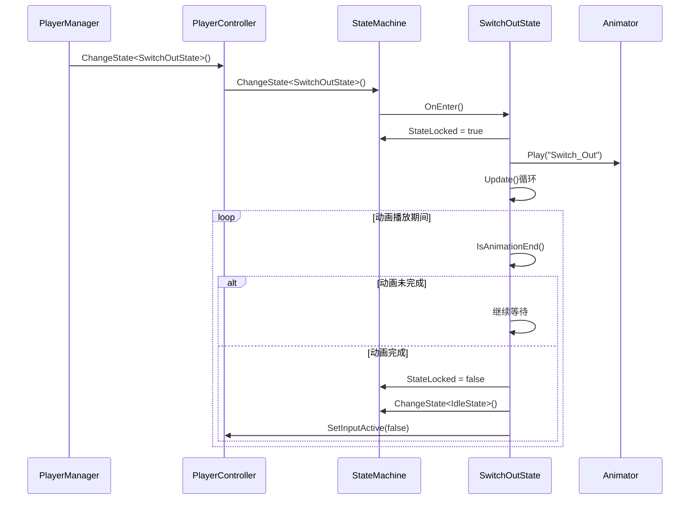

**图表来源**
- [SwitchOutState.cs](file://Assets/Scripts/Controller/FSM/CharacterState/SwitchOutState.cs#L1-L33)
- [StateMachine.cs](file://Assets/Scripts/Controller/FSM/StateMachine.cs#L45-L65)

**章节来源**
- [PlayerManager.cs](file://Assets/Scripts/Manager/PlayerManager/PlayerManager.cs#L32-L58)
- [SwitchOutState.cs](file://Assets/Scripts/Controller/FSM/CharacterState/SwitchOutState.cs#L1-L33)
- [SwitchInState.cs](file://Assets/Scripts/Controller/FSM/CharacterState/SwitchInState.cs#L1-L34)

## PlayerController详细分析

PlayerController是单个角色的核心控制器，负责管理角色的所有行为和状态。它作为PlayerManager和具体角色行为之间的桥梁。

### 核心组件结构

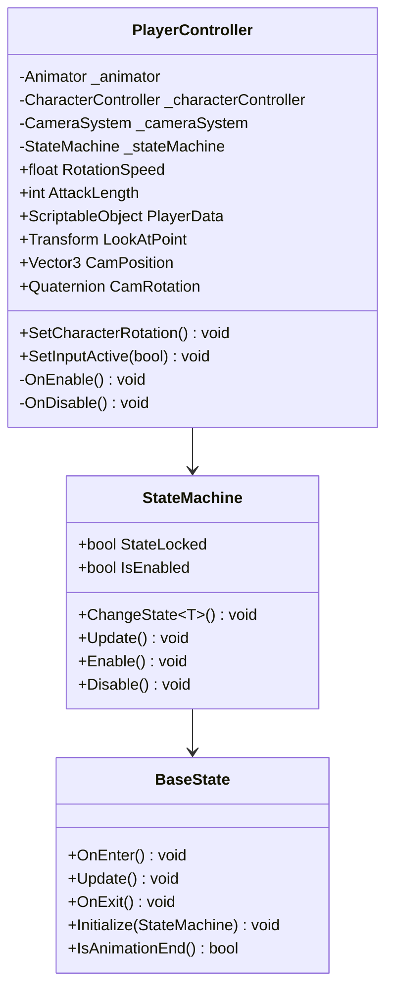

**图表来源**
- [PlayerController.cs](file://Assets/Scripts/Controller/PlayerController.cs#L4-L25)
- [StateMachine.cs](file://Assets/Scripts/Controller/FSM/StateMachine.cs#L8-L25)
- [BaseState.cs](file://Assets/Scripts/Controller/FSM/BaseState.cs#L5-L15)

### 属性管理

PlayerController管理以下关键属性：

| 属性名称 | 类型 | 描述 | 默认值 |
|----------|------|------|--------|
| RotationSpeed | float | 角色旋转速度 | 10f |
| AttackLength | int | 攻击连击长度 | 4 |
| PlayerData | ScriptableObject | 角色数据容器 | null |
| LookAtPoint | Transform | 注视点变换 | null |

### 输入响应控制

SetInputActive方法是控制角色输入响应的核心机制：

#### 方法流程

```mermaid
flowchart TD
SetInputActive[SetInputActive(bool value)] --> CheckValue{value参数}
CheckValue --> |true| EnableComponents[启用组件]
CheckValue --> |false| DisableComponents[禁用组件]
EnableComponents --> SetEnabled[this.enabled = true]
EnableComponents --> EnableStateMachine[状态机启用]
DisableComponents --> SetDisabled[this.enabled = false]
DisableComponents --> DisableStateMachine[状态机禁用]
EnableStateMachine --> Complete[完成]
DisableStateMachine --> Complete
```

**图表来源**
- [PlayerController.cs](file://Assets/Scripts/Controller/PlayerController.cs#L75-L93)

### 状态机集成

PlayerController与状态机系统的深度集成体现在以下几个方面：

#### 状态注册

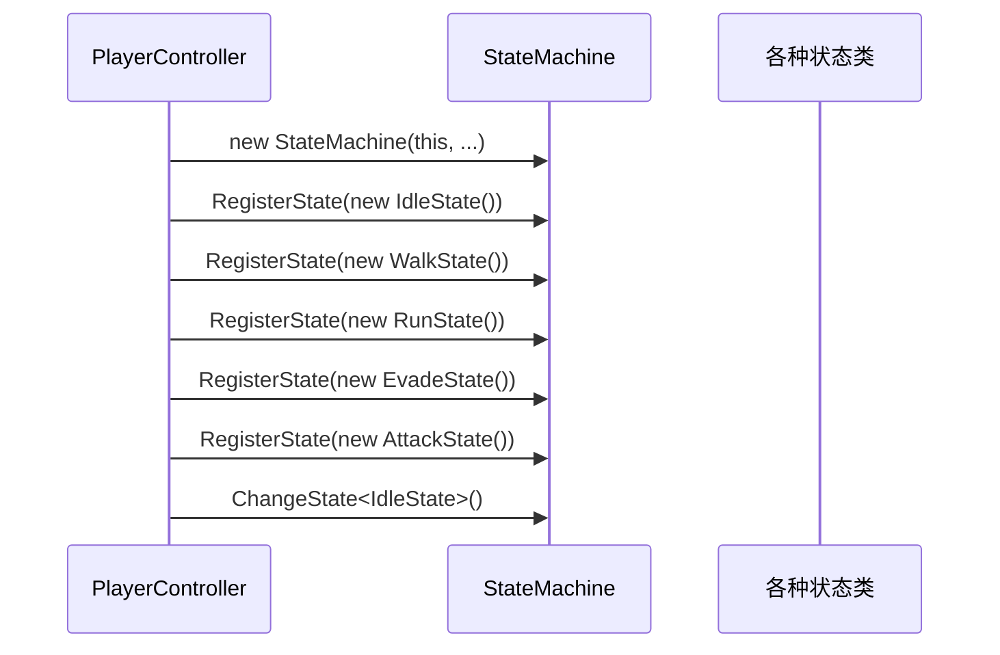

**图表来源**
- [PlayerController.cs](file://Assets/Scripts/Controller/PlayerController.cs#L27-L45)

**章节来源**
- [PlayerController.cs](file://Assets/Scripts/Controller/PlayerController.cs#L1-L94)
- [StateMachine.cs](file://Assets/Scripts/Controller/FSM/StateMachine.cs#L1-L115)

## 状态机系统

状态机系统是玩家行为控制的核心，采用状态模式实现角色行为的动态切换。

### 状态机架构

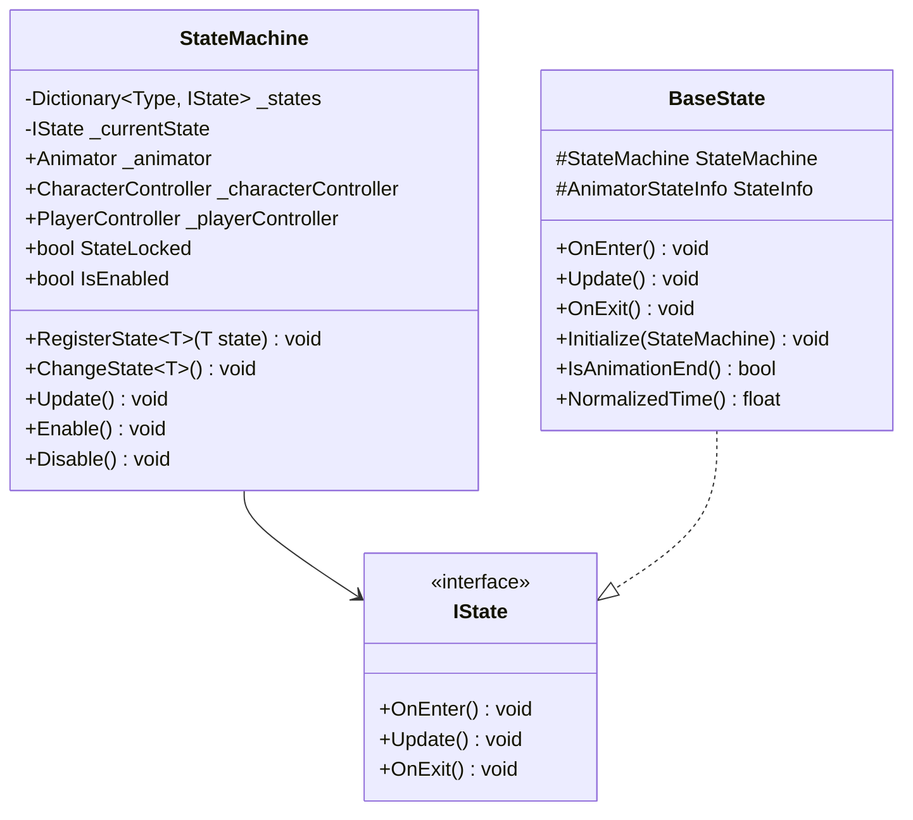

**图表来源**
- [StateMachine.cs](file://Assets/Scripts/Controller/FSM/StateMachine.cs#L8-L25)
- [IState.cs](file://Assets/Scripts/Controller/FSM/IState.cs#L1-L6)
- [BaseState.cs](file://Assets/Scripts/Controller/FSM/BaseState.cs#L5-L15)

### 状态切换机制

状态机的状态切换遵循严格的生命周期：

#### 切换流程

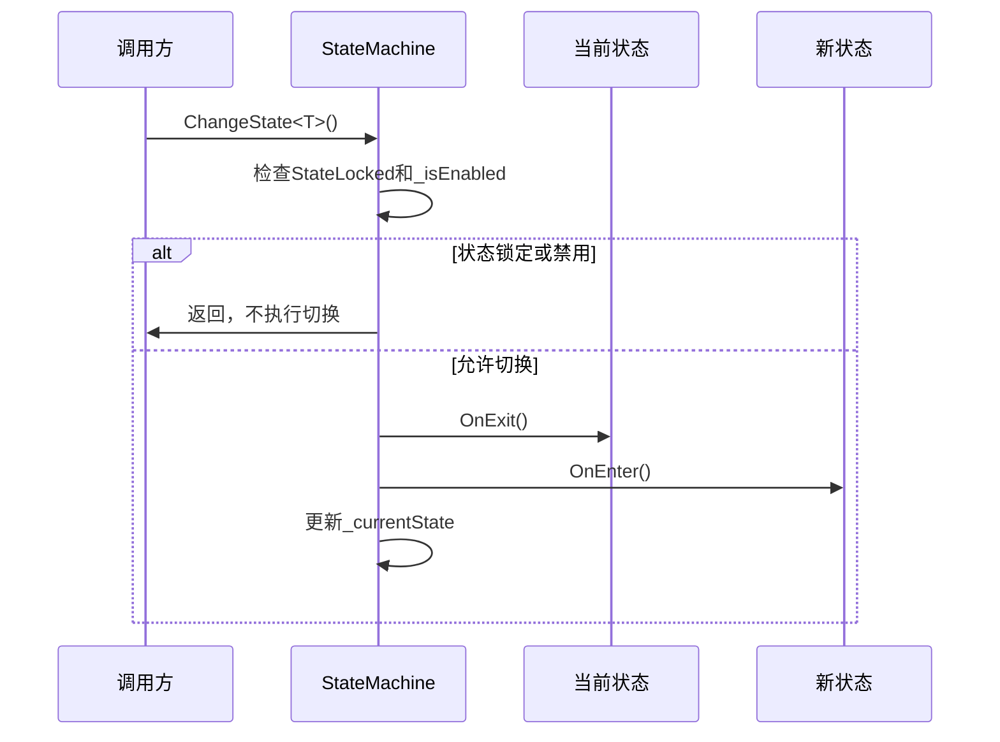

**图表来源**
- [StateMachine.cs](file://Assets/Scripts/Controller/FSM/StateMachine.cs#L45-L65)

### 状态生命周期

每个状态都有明确的生命周期管理：

#### 状态方法调用顺序

| 阶段 | 方法 | 调用时机 | 作用 |
|------|------|----------|------|
| 进入 | OnEnter() | 状态开始时 | 初始化状态，注册事件 |
| 更新 | Update() | 每帧调用 | 处理状态逻辑 |
| 退出 | OnExit() | 状态结束时 | 清理资源，注销事件 |
| 销毁 | Dispose() | 对象销毁时 | 完全清理状态 |

**章节来源**
- [StateMachine.cs](file://Assets/Scripts/Controller/FSM/StateMachine.cs#L1-L115)
- [BaseState.cs](file://Assets/Scripts/Controller/FSM/BaseState.cs#L1-L85)
- [IState.cs](file://Assets/Scripts/Controller/FSM/IState.cs#L1-L6)

## 输入系统集成

玩家管理系统与Unity的新输入系统深度集成，提供统一的输入处理机制。

### 输入事件绑定

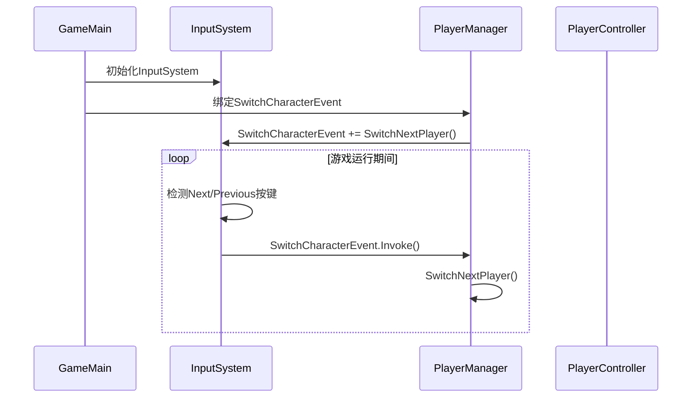

**图表来源**
- [GameMain.cs](file://Assets/Scripts/Manager/GameMain.cs#L20-L25)
- [PlayerManager.cs](file://Assets/Scripts/Manager/PlayerManager/PlayerManager.cs#L25-L25)

### 输入响应流程

#### 角色切换输入处理

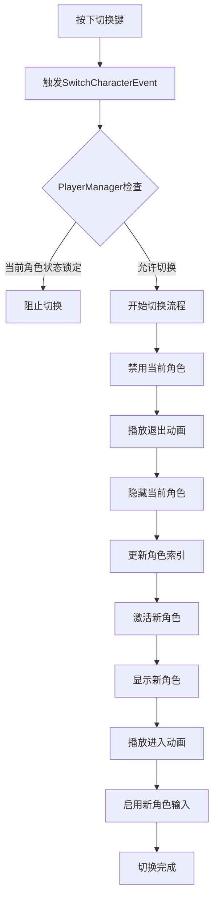

**图表来源**
- [PlayerManager.cs](file://Assets/Scripts/Manager/PlayerManager/PlayerManager.cs#L32-L58)
- [InputSystem.cs](file://Assets/Scripts/Manager/InputSystem/InputSystem.cs#L34-L69)

### 输入状态管理

PlayerController通过SetInputActive方法精确控制输入响应：

#### 输入状态控制表

| 输入状态 | enabled属性 | 状态机状态 | 动画状态 | 用途 |
|----------|-------------|------------|----------|------|
| 激活 | true | 启用 | 正常播放 | 当前活跃角色 |
| 禁用 | false | 禁用 | 停止播放 | 非当前角色 |

**章节来源**
- [PlayerManager.cs](file://Assets/Scripts/Manager/PlayerManager/PlayerManager.cs#L25-L25)
- [PlayerController.cs](file://Assets/Scripts/Controller/PlayerController.cs#L75-L93)
- [InputSystem.cs](file://Assets/Scripts/Manager/InputSystem/InputSystem.cs#L34-L69)

## 性能考虑

玩家管理系统在设计时充分考虑了性能优化，采用了多种策略来确保良好的运行效率。

### 内存管理策略

#### 对象激活/禁用机制

系统采用"激活/禁用"模式来管理内存使用：

```mermaid
graph LR
subgraph "内存优化策略"
A[角色实例化] --> B{当前角色?}
B --> |是| C[SetActive(true)]
B --> |否| D[SetActive(false)]
C --> E[启用组件]
D --> F[禁用组件]
E --> G[正常运行]
F --> H[节省内存]
end
```

**图表来源**
- [GameMain.cs](file://Assets/Scripts/Manager/GameMain.cs#L35-L45)

#### 组件级优化

- **非当前角色组件禁用**：只激活当前角色的游戏对象组件
- **状态机独立管理**：每个角色的状态机独立运行
- **事件订阅管理**：状态切换时自动管理事件订阅

### 运行时性能优化

#### 状态机优化

| 优化策略 | 实现方式 | 性能收益 |
|----------|----------|----------|
| 状态预注册 | Awake时注册所有状态 | 避免运行时查找开销 |
| 状态锁定检查 | StateLocked标志快速判断 | 防止无效状态切换 |
| 条件短路 | 禁用状态下跳过Update | 减少不必要的计算 |
| 对象池化 | 复用状态实例 | 减少GC压力 |

#### 动画系统优化

- **动画状态监控**：通过IsAnimationEnd()方法避免轮询
- **状态机锁定**：动画播放期间锁定状态机
- **及时清理**：动画结束后立即恢复输入控制

## 故障排除指南

### 常见问题及解决方案

#### 角色切换失败

**症状**：按下切换键无反应
**可能原因**：
1. PlayerManager未正确初始化
2. SwitchCharacterEvent事件未绑定
3. 当前角色状态锁定

**排查步骤**：
1. 检查PlayerManager.Instance.Init()是否调用
2. 验证InputSystem.SwitchCharacterEvent事件绑定
3. 检查CurrentPlayer._stateMachine.StateLocked状态

#### 输入响应异常

**症状**：角色无法响应输入
**可能原因**：
1. PlayerController.SetInputActive(false)
2. 状态机被禁用
3. 组件被意外禁用

**排查步骤**：
1. 检查PlayerController.enabled属性
2. 验证StateMachine.IsEnabled状态
3. 确认相关组件未被禁用

#### 动画播放问题

**症状**：角色切换动画不播放或卡住
**可能原因**：
1. 动画状态机配置错误
2. 动画剪辑缺失
3. 状态机锁定未正确解除

**排查步骤**：
1. 检查Animator组件配置
2. 验证Switch_Out和Switch_In动画存在
3. 确认状态机解锁逻辑正确执行

### 调试技巧

#### 日志记录

系统在关键节点添加了调试日志：

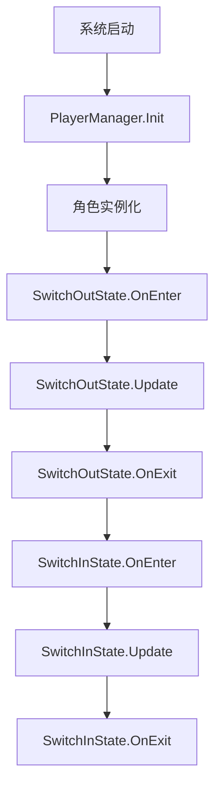

**图表来源**
- [PlayerManager.cs](file://Assets/Scripts/Manager/PlayerManager/PlayerManager.cs#L23-L23)
- [SwitchOutState.cs](file://Assets/Scripts/Controller/FSM/CharacterState/SwitchOutState.cs#L6-L6)
- [SwitchInState.cs](file://Assets/Scripts/Controller/FSM/CharacterState/SwitchInState.cs#L6-L6)

#### 性能监控

建议监控以下指标：
- 状态机切换频率
- 动画播放时间
- 内存使用情况
- 输入响应延迟

**章节来源**
- [PlayerManager.cs](file://Assets/Scripts/Manager/PlayerManager/PlayerManager.cs#L23-L23)
- [SwitchOutState.cs](file://Assets/Scripts/Controller/FSM/CharacterState/SwitchOutState.cs#L6-L6)
- [SwitchInState.cs](file://Assets/Scripts/Controller/FSM/CharacterState/SwitchInState.cs#L6-L6)

## 总结

玩家管理系统是一个设计精良的多角色管理框架，具有以下核心优势：

### 架构优势

1. **模块化设计**：清晰的职责分离，便于维护和扩展
2. **状态机模式**：灵活的角色行为控制机制
3. **单例模式**：全局统一的管理接口
4. **事件驱动**：松耦合的组件间通信

### 功能特性

1. **无缝角色切换**：平滑的视觉效果和流畅的用户体验
2. **输入统一管理**：集中处理多角色输入响应
3. **性能优化**：智能的对象激活/禁用机制
4. **扩展性强**：易于添加新的角色和状态

### 技术亮点

- **状态机深度集成**：每个角色独立的状态机系统
- **输入系统整合**：与Unity新输入系统的无缝对接
- **内存管理优化**：智能的组件激活策略
- **调试友好**：完善的日志记录和状态监控

该系统为游戏开发提供了强大的角色管理基础，特别适用于需要频繁角色切换的游戏类型，如动作冒险、角色扮演等。通过合理的架构设计和性能优化，确保了系统的稳定性和可扩展性。