# UI输入映射

<cite>
**本文档引用的文件**
- [InputSystem_Actions.cs](file://Assets/InputSystem_Actions.cs)
- [InputSystemUIInputModule.cs](file://Library/PackageCache/com.unity.inputsystem@be6c4fd0abf5/InputSystem/Plugins/UI/InputSystemUIInputModule.cs)
- [InputSystem.cs](file://Assets/Scripts/Manager/InputSystem/InputSystem.cs)
</cite>

## 目录
1. [简介](#简介)
2. [项目结构概览](#项目结构概览)
3. [核心UI Action Map架构](#核心ui-action-map架构)
4. [UI交互动作详解](#ui交互动作详解)
5. [复合绑定机制](#复合绑定机制)
6. [多设备映射配置](#多设备映射配置)
7. [PassThrough类型动作](#passthrough类型动作)
8. [Unity EventSystem集成](#unity-eventsystem集成)
9. [最佳实践指南](#最佳实践指南)
10. [故障排除](#故障排除)
11. [总结](#总结)

## 简介

UI输入映射是Unity输入系统中专门针对用户界面交互设计的一套完整输入处理框架。该系统通过UI Action Map提供了统一的输入抽象层，支持Navigate（导航）、Submit（提交）、Cancel（取消）、Point（指针）、Click（点击）等多种UI交互动作，并实现了跨平台、多设备的无缝输入体验。

本文档详细解析了UI Action Map的配置原理、实现机制以及在实际项目中的应用最佳实践，为开发者提供全面的技术指导。

## 项目结构概览

UI输入映射系统的核心组件分布在以下关键位置：

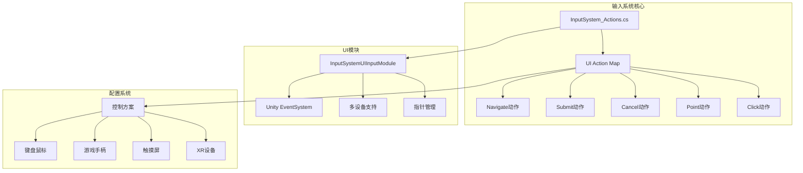

**图表来源**
- [InputSystem_Actions.cs](file://Assets/InputSystem_Actions.cs#L1532-L1564)
- [InputSystemUIInputModule.cs](file://Library/PackageCache/com.unity.inputsystem@be6c4fd0abf5/InputSystem/Plugins/UI/InputSystemUIInputModule.cs#L1-L50)

**章节来源**
- [InputSystem_Actions.cs](file://Assets/InputSystem_Actions.cs#L1-L100)
- [InputSystem.cs](file://Assets/Scripts/Manager/InputSystem/InputSystem.cs#L1-L94)

## 核心UI Action Map架构

UI Action Map采用分层架构设计，提供了清晰的抽象层次和灵活的扩展机制。

### 架构层次图

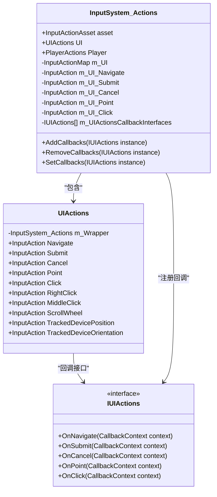

**图表来源**
- [InputSystem_Actions.cs](file://Assets/InputSystem_Actions.cs#L1532-L1592)
- [InputSystem_Actions.cs](file://Assets/InputSystem_Actions.cs#L1884-L1919)

### 动作类型定义

UI Action Map定义了九种核心输入动作，每种动作都有特定的用途和配置方式：

| 动作名称 | 类型 | 预期控制类型 | 主要用途 |
|---------|------|-------------|----------|
| Navigate | PassThrough | Vector2 | 导航输入，支持摇杆和方向键 |
| Submit | Button | Button | 确认操作，如选择项目或确认对话框 |
| Cancel | Button | Button | 取消操作，如关闭菜单或返回上一级 |
| Point | PassThrough | Vector2 | 指针位置，支持鼠标和触摸屏 |
| Click | PassThrough | Button | 主要点击，对应鼠标左键或触摸点击 |
| RightClick | PassThrough | Button | 右键点击，用于上下文菜单 |
| MiddleClick | PassThrough | Button | 中键点击，用于特殊功能 |
| ScrollWheel | PassThrough | Vector2 | 滚轮滚动，支持垂直和水平滚动 |
| TrackedDevicePosition | PassThrough | Vector3 | 追踪设备位置，用于VR/AR |

**章节来源**
- [InputSystem_Actions.cs](file://Assets/InputSystem_Actions.cs#L650-L750)

## UI交互动作详解

### Navigate（导航）动作

Navigate动作是UI系统中最复杂的动作之一，它采用了复合绑定机制来统一处理多种输入源。

#### 复合绑定机制

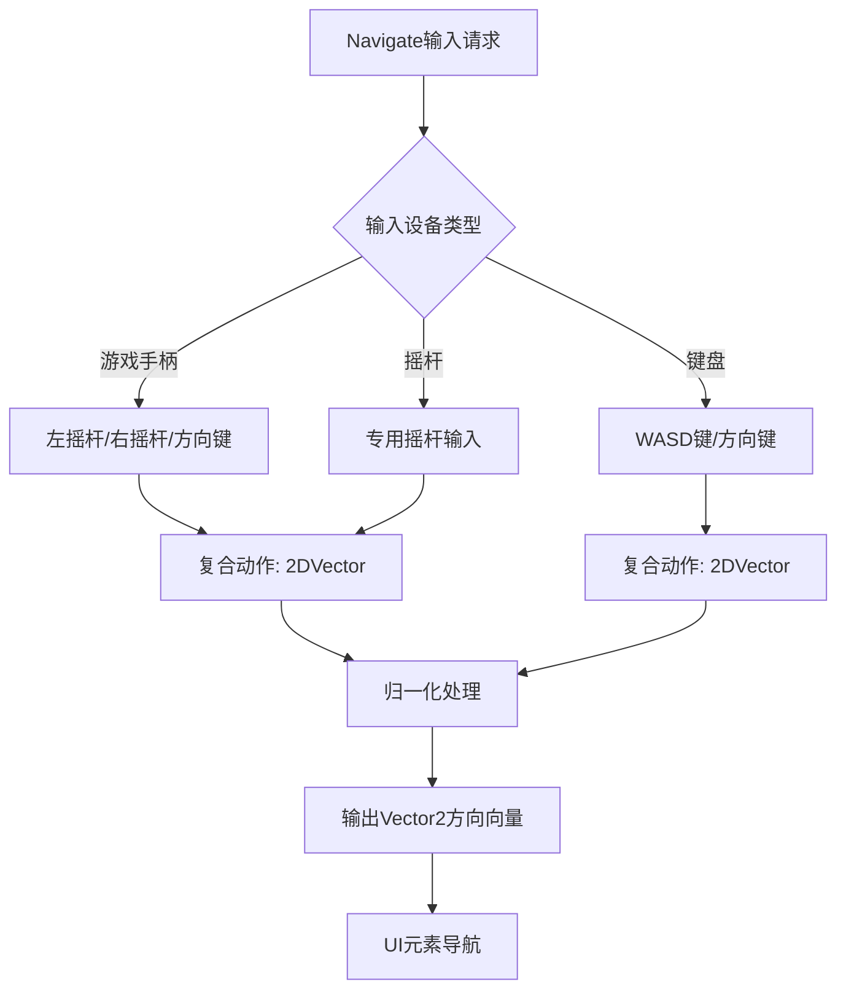

**图表来源**
- [InputSystem_Actions.cs](file://Assets/InputSystem_Actions.cs#L800-L900)

#### 导航输入映射表

| 设备类型 | 输入路径 | 绑定组 | 映射示例 |
|---------|----------|--------|----------|
| 游戏手柄 | `<Gamepad>/leftStick` | Gamepad | 左摇杆移动 |
| 游戏手柄 | `<Gamepad>/rightStick` | Gamepad | 右摇杆移动 |
| 游戏手柄 | `<Gamepad>/dpad` | Gamepad | 方向键 |
| 键盘 | `<Keyboard>/w` | Keyboard&Mouse | 向上移动 |
| 键盘 | `<Keyboard>/s` | Keyboard&Mouse | 向下移动 |
| 键盘 | `<Keyboard>/a` | Keyboard&Mouse | 向左移动 |
| 键盘 | `<Keyboard>/d` | Keyboard&Mouse | 向右移动 |
| 摇杆 | `<Joystick>/stick` | Joystick | 专用摇杆输入 |
| 触摸屏 | `<Touchscreen>/touch*/position` | Touch | 多点触控 |

### Submit（提交）和Cancel（取消）动作

Submit和Cancel动作采用统一的映射策略，确保在不同设备上有一致的操作体验。

#### 设备映射配置

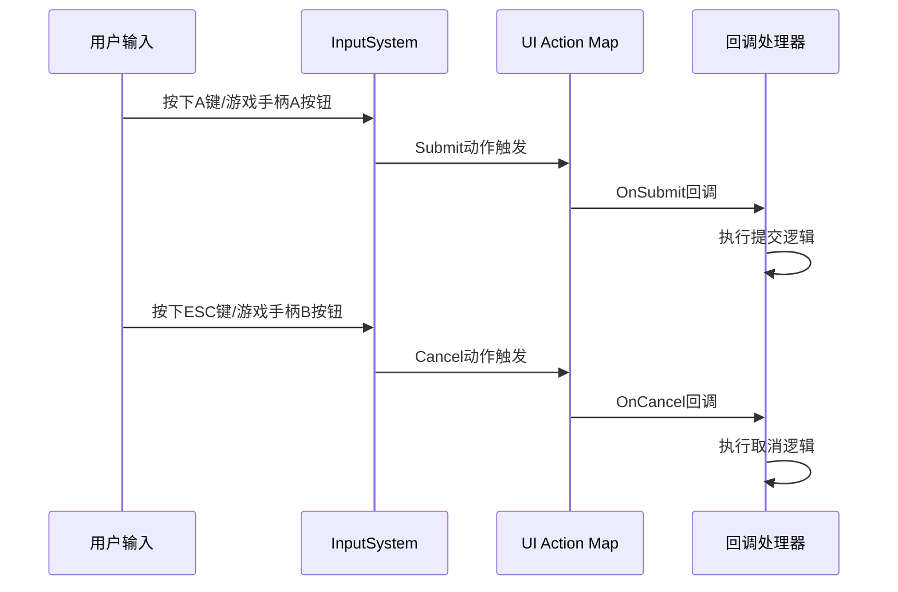

**图表来源**
- [InputSystem_Actions.cs](file://Assets/InputSystem_Actions.cs#L950-L1000)

#### 提交和取消动作映射

| 动作 | 设备 | 输入路径 | 绑定组 | 映射示例 |
|------|------|----------|--------|----------|
| Submit | 游戏手柄 | `<Gamepad>/buttonSouth` | Gamepad | A按钮（Xbox）/X按钮（PlayStation） |
| Submit | 键盘 | `<Keyboard>/enter` | Keyboard&Mouse | Enter键 |
| Submit | 鼠标 | `<Mouse>/leftButton` | Keyboard&Mouse | 左键点击 |
| Submit | 触摸屏 | `<Touchscreen>/touch*/press` | Touch | 单点触摸 |
| Cancel | 游戏手柄 | `<Gamepad>/buttonEast` | Gamepad | B按钮（Xbox）/O按钮（PlayStation） |
| Cancel | 键盘 | `<Keyboard>/escape` | Keyboard&Mouse | Escape键 |
| Cancel | 鼠标 | `<Mouse>/rightButton` | Keyboard&Mouse | 右键点击 |

### Point（指针）和Click（点击）动作

Point和Click动作专门处理指针交互，支持鼠标、触摸屏和追踪设备的输入。

#### 指针交互流程

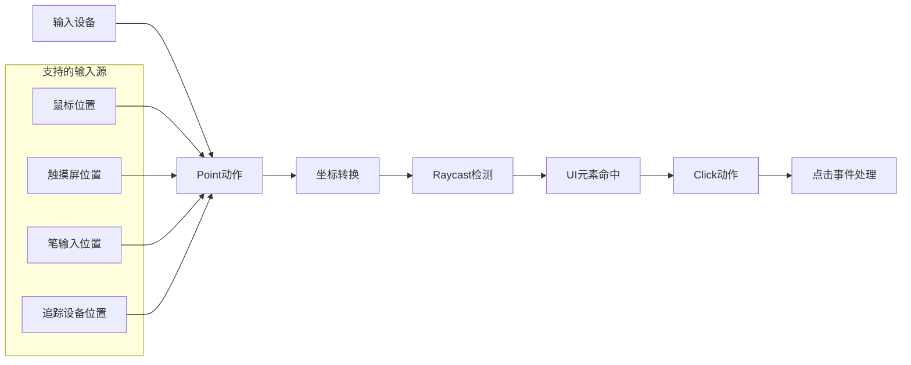

**图表来源**
- [InputSystemUIInputModule.cs](file://Library/PackageCache/com.unity.inputsystem@be6c4fd0abf5/InputSystem/Plugins/UI/InputSystemUIInputModule.cs#L400-L500)

**章节来源**
- [InputSystem_Actions.cs](file://Assets/InputSystem_Actions.cs#L950-L1100)
- [InputSystemUIInputModule.cs](file://Library/PackageCache/com.unity.inputsystem@be6c4fd0abf5/InputSystem/Plugins/UI/InputSystemUIInputModule.cs#L1-L200)

## 复合绑定机制

复合绑定是UI Action Map的核心特性，它允许将多个简单的输入组合成复杂的复合动作。

### 复合动作类型

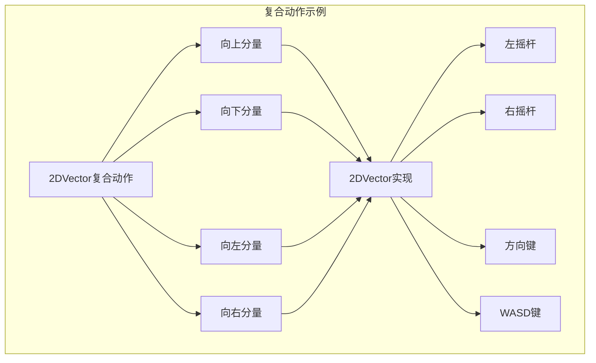

**图表来源**
- [InputSystem_Actions.cs](file://Assets/InputSystem_Actions.cs#L800-L850)

### 复合绑定配置原理

复合绑定通过以下机制实现：

1. **分量分离**：将复合动作分解为独立的分量
2. **优先级处理**：根据输入源的优先级进行处理
3. **值合并**：将多个输入源的值合并为最终结果
4. **边界检查**：确保输出值在有效范围内

**章节来源**
- [InputSystem_Actions.cs](file://Assets/InputSystem_Actions.cs#L800-L950)

## 多设备映射配置

UI Action Map支持五种主要的控制方案，每种方案都针对特定的使用场景进行了优化。

### 控制方案架构

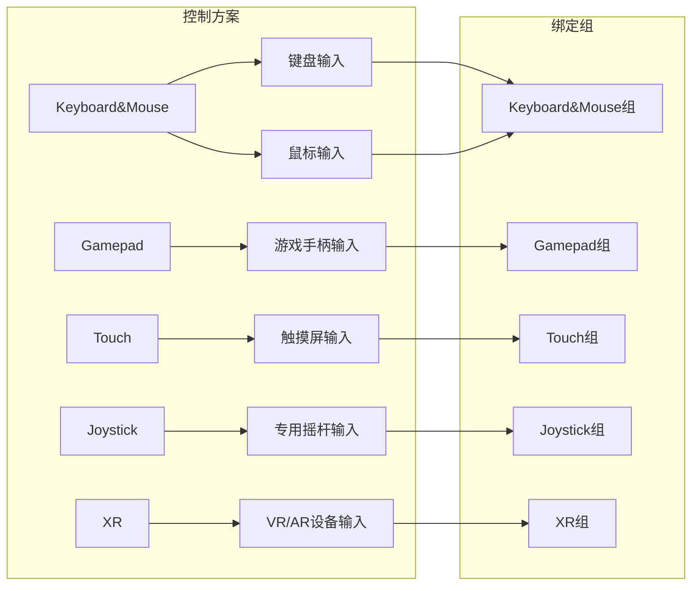

**图表来源**
- [InputSystem_Actions.cs](file://Assets/InputSystem_Actions.cs#L1134-L1200)

### 设备兼容性矩阵

| 动作 | 键盘鼠标 | 游戏手柄 | 触摸屏 | 摇杆 | XR设备 |
|------|----------|----------|--------|------|--------|
| Navigate | ✓ | ✓ | ✗ | ✓ | ✗ |
| Submit | ✓ | ✓ | ✓ | ✓ | ✓ |
| Cancel | ✓ | ✓ | ✓ | ✓ | ✓ |
| Point | ✓ | ✗ | ✓ | ✗ | ✓ |
| Click | ✓ | ✗ | ✓ | ✗ | ✓ |
| RightClick | ✓ | ✗ | ✗ | ✗ | ✗ |
| MiddleClick | ✓ | ✗ | ✗ | ✗ | ✗ |
| ScrollWheel | ✓ | ✗ | ✗ | ✗ | ✗ |
| TrackedDevicePosition | ✗ | ✗ | ✗ | ✗ | ✓ |
| TrackedDeviceOrientation | ✗ | ✗ | ✗ | ✗ | ✓ |

**章节来源**
- [InputSystem_Actions.cs](file://Assets/InputSystem_Actions.cs#L1134-L1250)

## PassThrough类型动作

PassThrough类型是UI Action Map中最重要的动作类型，它直接传递原始输入数据而不进行任何处理。

### PassThrough动作特性

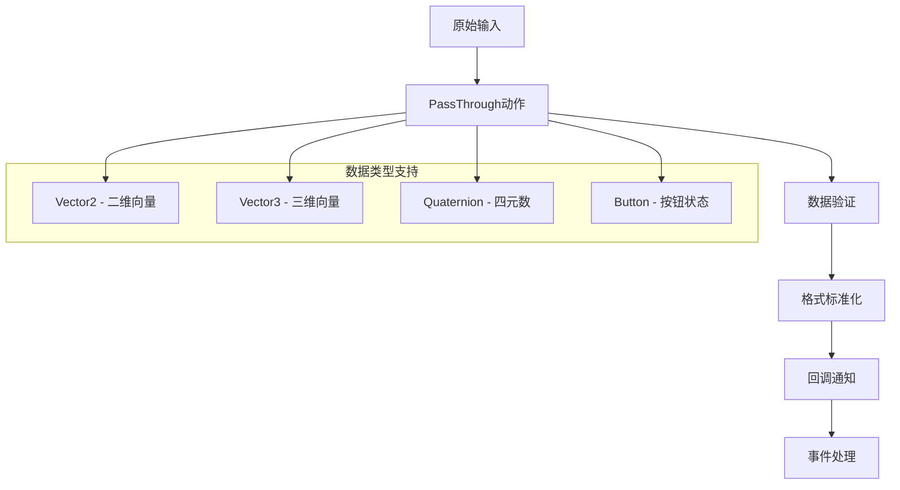

**图表来源**
- [InputSystem_Actions.cs](file://Assets/InputSystem_Actions.cs#L650-L750)

### PassThrough动作应用场景

1. **导航输入**：保持摇杆和方向键的原始值
2. **指针定位**：直接传递鼠标和触摸位置
3. **设备追踪**：传输VR/AR设备的精确位置和旋转信息
4. **滚轮滚动**：保留滚轮的原始滚动增量

**章节来源**
- [InputSystem_Actions.cs](file://Assets/InputSystem_Actions.cs#L650-L750)

## Unity EventSystem集成

UI Action Map与Unity的EventSystem无缝集成，提供了完整的UI交互解决方案。

### 集成架构

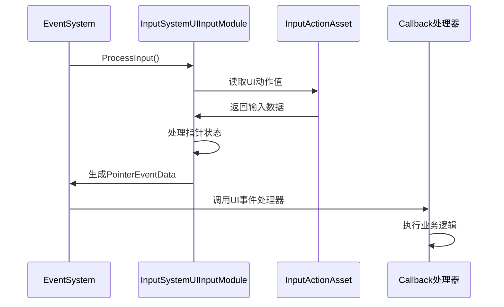

**图表来源**
- [InputSystemUIInputModule.cs](file://Library/PackageCache/com.unity.inputsystem@be6c4fd0abf5/InputSystem/Plugins/UI/InputSystemUIInputModule.cs#L200-L300)

### 指针状态管理

InputSystemUIInputModule负责管理各种输入设备的指针状态：

1. **多设备指针**：支持鼠标、触摸屏、笔和追踪设备
2. **指针行为**：可配置单指针或多指针模式
3. **光标锁定**：支持屏幕中心锁定和外部屏幕锁定
4. **拖拽处理**：自动处理拖拽手势和释放事件

**章节来源**
- [InputSystemUIInputModule.cs](file://Library/PackageCache/com.unity.inputsystem@be6c4fd0abf5/InputSystem/Plugins/UI/InputSystemUIInputModule.cs#L1-L300)

## 最佳实践指南

### UI系统配置最佳实践

1. **动作命名规范**
   - 使用语义化的动作名称
   - 遵循统一的命名约定
   - 避免动作名称冲突

2. **回调接口设计**
   ```csharp
   // 推荐的回调接口实现
   public class UIManager : IUIActions
   {
       public void OnNavigate(InputAction.CallbackContext context)
       {
           var direction = context.ReadValue<Vector2>();
           // 处理导航逻辑
       }
       
       public void OnSubmit(InputAction.CallbackContext context)
       {
           // 处理提交逻辑
       }
       
       public void OnCancel(InputAction.CallbackContext context)
       {
           // 处理取消逻辑
       }
   }
   ```

3. **设备适配策略**
   - 为主流设备提供默认映射
   - 支持自定义设备配置
   - 实现设备热插拔支持

4. **性能优化建议**
   - 及时注销不需要的回调
   - 避免在回调中执行耗时操作
   - 使用对象池管理UI元素

### 菜单系统最佳实践

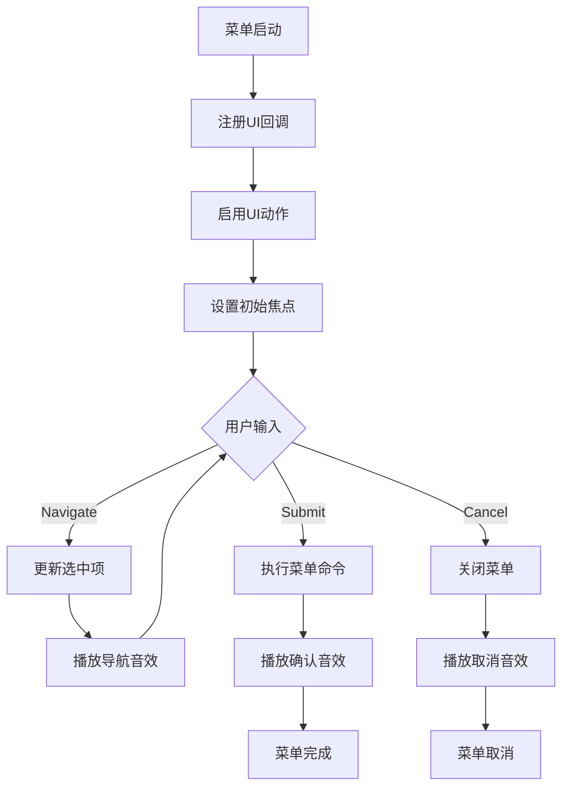

### 错误处理和调试

1. **输入验证**
   - 检查输入动作的有效性
   - 验证设备连接状态
   - 处理输入延迟问题

2. **调试工具**
   - 使用Input Debugger监控输入
   - 实现输入可视化显示
   - 提供输入映射测试功能

**章节来源**
- [InputSystem.cs](file://Assets/Scripts/Manager/InputSystem/InputSystem.cs#L50-L94)

## 故障排除

### 常见问题及解决方案

1. **动作未响应**
   - 检查动作是否正确启用
   - 验证回调接口是否注册
   - 确认设备驱动程序正常

2. **输入延迟**
   - 优化回调函数性能
   - 减少不必要的输入处理
   - 检查帧率稳定性

3. **设备不识别**
   - 验证设备连接状态
   - 检查输入系统配置
   - 更新设备固件

4. **跨平台兼容性**
   - 测试所有目标平台
   - 实现平台特定的适配
   - 提供降级方案

### 性能监控

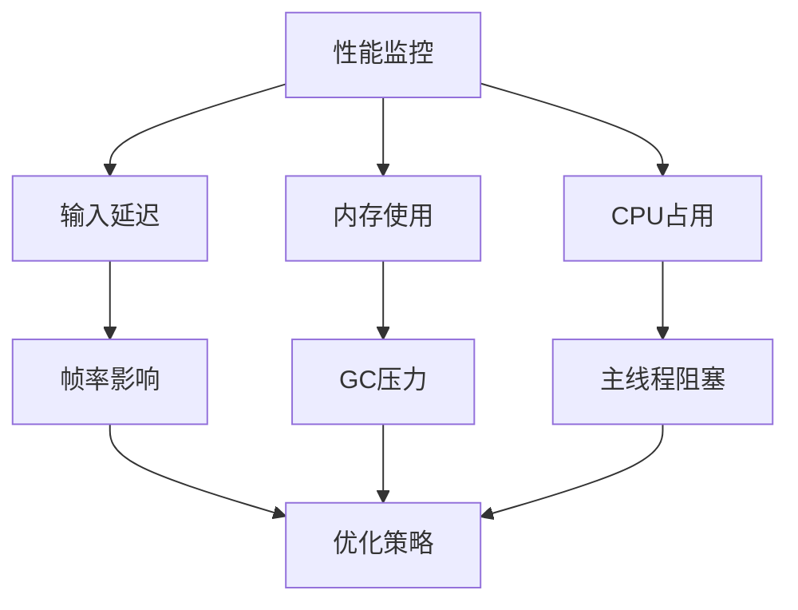

## 总结

UI输入映射系统通过精心设计的架构和丰富的功能特性，为现代游戏和应用程序提供了强大而灵活的UI交互解决方案。其主要优势包括：

1. **统一抽象**：通过UI Action Map提供一致的输入抽象
2. **多设备支持**：无缝支持键盘鼠标、游戏手柄、触摸屏等多种输入设备
3. **复合绑定**：强大的复合动作机制简化复杂输入处理
4. **EventSystem集成**：与Unity原生UI系统完美集成
5. **性能优化**：高效的输入处理和事件分发机制

通过遵循本文档提供的最佳实践指南，开发者可以构建出高质量、跨平台的用户界面交互系统，为用户提供流畅自然的操作体验。